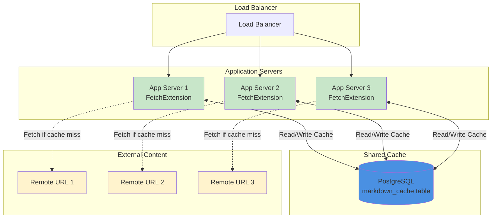

# Mostlylucid.Markdig.FetchExtension.Postgres

PostgreSQL storage plugin for Mostlylucid.Markdig.FetchExtension.

## Overview

This plugin provides a PostgreSQL-based storage backend for the Markdig Fetch Extension. It persists fetched markdown content to a PostgreSQL database, enabling multi-server deployments with shared cache.

## Installation

```bash
dotnet add package Mostlylucid.Markdig.FetchExtension.Postgres
```

## Quick Start

```csharp
using Mostlylucid.Markdig.FetchExtension;
using Mostlylucid.Markdig.FetchExtension.Postgres;
using Markdig;
using Microsoft.Extensions.DependencyInjection;

// Setup DI
var services = new ServiceCollection();
services.AddLogging();
services.AddPostgresMarkdownFetch("Host=localhost;Database=myapp;Username=user;Password=pass");
var serviceProvider = services.BuildServiceProvider();

// Ensure database is created
serviceProvider.EnsureMarkdownCacheDatabase();

// Configure extension
FetchMarkdownExtension.ConfigureServiceProvider(serviceProvider);

// Create pipeline
var pipeline = new MarkdownPipelineBuilder()
    .UseAdvancedExtensions()
    .Use<FetchMarkdownExtension>()
    .Build();

// Use it!
var markdown = @"
# My Document
<fetch markdownurl=""https://raw.githubusercontent.com/user/repo/main/README.md"" pollfrequency=""24""/>
";

var html = Markdown.ToHtml(markdown, pipeline);
```

## Configuration Options

### Connection String

Provide a standard PostgreSQL connection string:

```csharp
// Basic connection
services.AddPostgresMarkdownFetch(
    "Host=localhost;Database=myapp;Username=user;Password=pass");

// With connection pooling (recommended for production)
services.AddPostgresMarkdownFetch(
    "Host=localhost;Database=myapp;Username=user;Password=pass;Pooling=true;MinPoolSize=5;MaxPoolSize=100");

// From configuration
services.AddPostgresMarkdownFetch(
    Configuration.GetConnectionString("MarkdownCache"));
```

### ASP.NET Core Integration

```csharp
// In Program.cs
builder.Services.AddPostgresMarkdownFetch(
    builder.Configuration.GetConnectionString("MarkdownCache"));

// After building the app
var app = builder.Build();
app.Services.EnsureMarkdownCacheDatabase();
```

## Database Schema

The plugin creates a table in the default `public` schema:

```sql
CREATE TABLE markdown_cache (
    id SERIAL PRIMARY KEY,
    url VARCHAR(2048) NOT NULL,
    blog_post_id INTEGER NOT NULL,
    content TEXT NOT NULL,
    last_fetched_at TIMESTAMP WITH TIME ZONE NOT NULL,
    cache_key VARCHAR(128) NOT NULL
);

CREATE UNIQUE INDEX ix_markdown_cache_cache_key ON markdown_cache(cache_key);
CREATE INDEX ix_markdown_cache_url_blog_post_id ON markdown_cache(url, blog_post_id);
```

## Features

- **Multi-Server Support** - Shared cache across application instances
- **Enterprise Ready** - PostgreSQL's ACID guarantees
- **High Concurrency** - Excellent performance under load
- **Stale-while-revalidate** - Returns cached content if fetch fails
- **Multi-post Support** - Same URL can have different cache per blog post
- **Automatic Schema Creation** - No manual database setup required

## Multi-Server Deployment Architecture



**Benefits of shared PostgreSQL cache:**
- Cache consistency across all servers
- Single source of truth for fetched content
- No duplicate fetches from different servers
- Centralized cache management

## When to Use PostgreSQL Storage

**Best for:**
- Multi-server deployments
- High-traffic applications
- Cloud deployments (AWS RDS, Azure Database, etc.)
- Applications requiring centralized cache management
- Kubernetes/container orchestration

**Consider alternatives if:**
- Single-server with simple needs (use SQLite)
- You don't have PostgreSQL infrastructure
- You want zero external dependencies (use In-Memory or File-Based)

## Production Considerations

### Connection Pooling

Always enable connection pooling in production:

```csharp
services.AddPostgresMarkdownFetch(
    "Host=db.example.com;Database=myapp;Username=user;Password=pass;" +
    "Pooling=true;MinPoolSize=5;MaxPoolSize=100;ConnectionLifetime=300");
```

### Migrations

For production deployments, use Entity Framework migrations instead of `EnsureCreated()`:

```bash
dotnet ef migrations add InitialCreate --context MarkdownCacheDbContext
dotnet ef database update --context MarkdownCacheDbContext
```

### Performance Tuning

1. **Indexes**: The plugin creates appropriate indexes by default
2. **Connection pooling**: Use `Pooling=true` in connection string
3. **Timeout settings**: Adjust `CommandTimeout` if fetching large documents
4. **Table partitioning**: Consider partitioning by date for very large caches

### High Availability

PostgreSQL supports various HA configurations:
- Streaming replication with read replicas
- Logical replication
- Patroni for automatic failover
- Cloud-managed solutions (AWS RDS Multi-AZ, Azure PostgreSQL)

## Docker Deployment

Example `docker-compose.yml`:

```yaml
services:
  postgres:
    image: postgres:16
    environment:
      POSTGRES_DB: myapp
      POSTGRES_USER: user
      POSTGRES_PASSWORD: pass
    volumes:
      - postgres_data:/var/lib/postgresql/data
    ports:
      - "5432:5432"

  app:
    image: myapp:latest
    environment:
      ConnectionStrings__MarkdownCache: "Host=postgres;Database=myapp;Username=user;Password=pass"
    depends_on:
      - postgres

volumes:
  postgres_data:
```

## Requirements

- .NET 9.0+
- Npgsql.EntityFrameworkCore.PostgreSQL 9.0+
- PostgreSQL 12+ (recommended 14+)

## License

MIT
