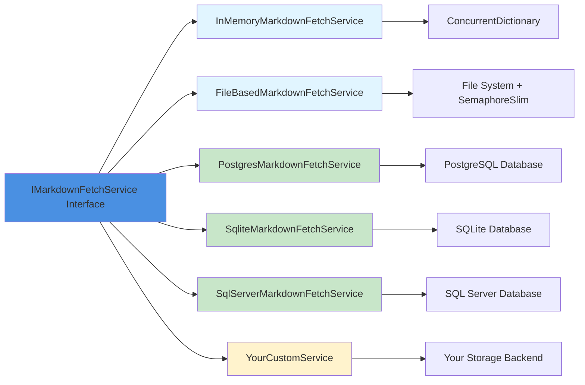
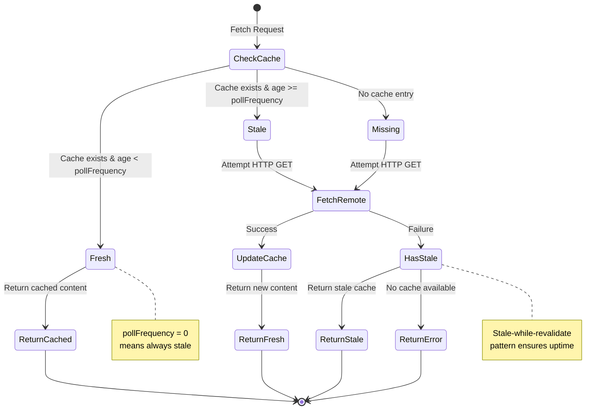
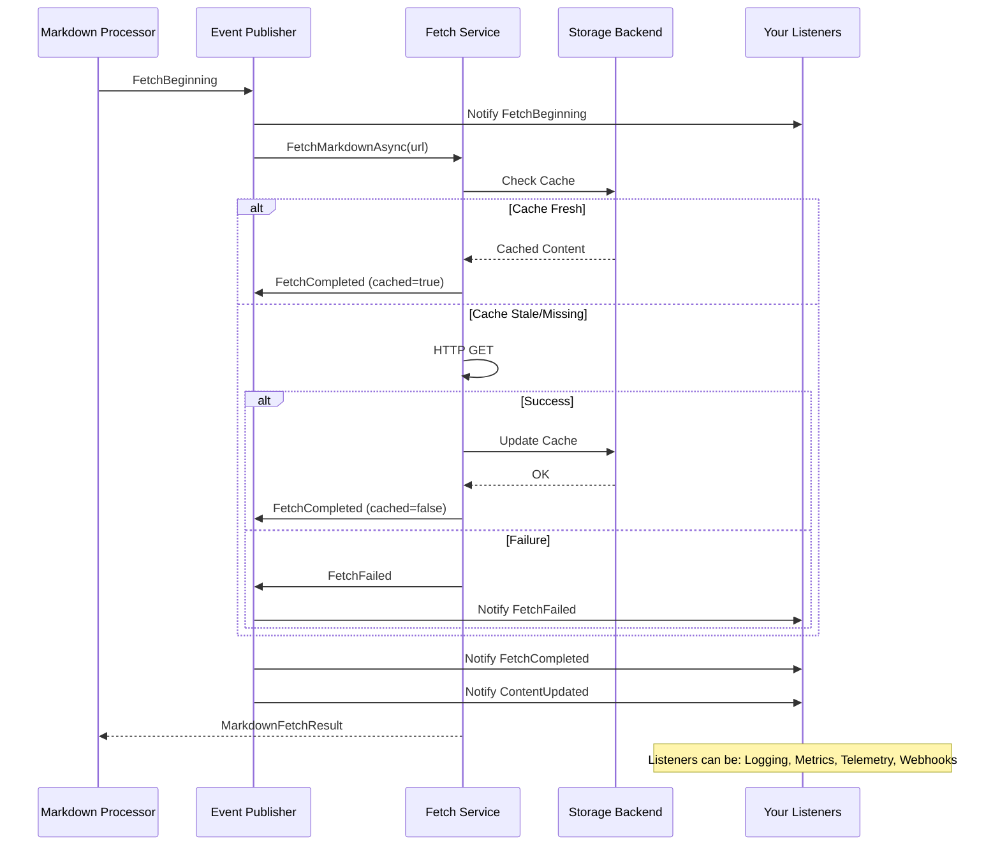

# Mostlylucid.Markdig.FetchExtension

A comprehensive Markdig toolkit providing:

1. **Fetch Preprocessor** - Embed remote Markdown content before pipeline processing
2. **Table of Contents Extension** - Automatically generate TOC from document headings

## Architecture Overview

This package provides two distinct but complementary features:

```mermaid
graph TD
    A[Your Markdown with &lt;fetch&gt; tags and [TOC]] --> B[MarkdownFetchPreprocessor]
    B --> C{Check Cache}
    C -->|Fresh| D[Return Cached Content]
    C -->|Stale/Missing| E[Fetch from Remote URL]
    E -->|Success| F[Update Cache]
    E -->|Failure| G{Has Cached?}
    G -->|Yes| H[Return Stale Cache]
    G -->|No| I[Return Error Comment]
    F --> J[Replace &lt;fetch&gt; with Content]
    D --> J
    H --> J
    I --> J
    J --> K[Processed Markdown with [TOC] markers]
    K --> L[Markdig Pipeline with TOC Extension]
    L --> M[Final HTML with TOC and fetched content]

    style A fill:#e1f5ff
    style B fill:#fff3cd
    style K fill:#d4edda
    style L fill:#d4edda
    style M fill:#c8e6c9
```

**Key Concept**: The Fetch functionality is a **preprocessor** that runs *before* the Markdig pipeline, while TOC is a **pipeline extension** that runs *during* Markdig processing.

## Table of Contents Extension

A Markdig pipeline extension that generates a table of contents from your document headings.

### Quick Start

```csharp
using Markdig;
using Mostlylucid.Markdig.FetchExtension;

var pipeline = new MarkdownPipelineBuilder()
    .UseToc()
    .Build();

var markdown = @"
# My Article

[TOC]

## Introduction
Content here...

## Features
More content...
";

var html = Markdown.ToHtml(markdown, pipeline);
```

### TOC Syntax

```markdown
[TOC]              <!-- All headings H1-H6 -->
[TOC:2-4]          <!-- Only H2-H4 -->
[TOC::my-toc]      <!-- Custom CSS class -->
[TOC:2-4:my-toc]   <!-- Range + custom class -->
```

### TOC Output

Generates semantic `<nav>` elements:

```html
<nav class="ml_toc" aria-label="Table of Contents">
  <ul>
    <li><a href="#introduction">Introduction</a></li>
    <li><a href="#features">Features</a></li>
  </ul>
</nav>
```

Headings automatically get IDs for anchor linking. Default CSS class is `ml_toc`.

---

## Fetch Preprocessor

A **preprocessor** that fetches and embeds remote Markdown content *before* it flows through your Markdig pipeline.

### Why a Preprocessor?

The Fetch functionality runs **before** the Markdig pipeline to ensure:

- ✅ Fetched content receives ALL your custom Markdig extensions
- ✅ Consistent styling and processing for local and remote content
- ✅ TOC extension can see headers from fetched content
- ✅ All extensions work on the combined content
- ✅ Simple integration - one preprocessing step

### Quick Start

```csharp
using Mostlylucid.Markdig.FetchExtension;
using Mostlylucid.Markdig.FetchExtension.Processors;
using Microsoft.Extensions.DependencyInjection;
using Markdig;

// 1. Setup DI with a storage provider
var services = new ServiceCollection();
services.AddLogging();
services.AddInMemoryMarkdownFetch();
var serviceProvider = services.BuildServiceProvider();

// 2. Create preprocessor
var preprocessor = new MarkdownFetchPreprocessor(serviceProvider);

// 3. Create your pipeline (can include any extensions)
var pipeline = new MarkdownPipelineBuilder()
    .UseToc()  // TOC will see fetched content!
    .Build();

// 4. Preprocess, then render
var markdown = @"
# My Document

[TOC]

## Local Content

<fetch markdownurl=""https://raw.githubusercontent.com/scottgal/mostlylucidweb/main/README.md""
       pollfrequency=""24""/>
";

var processedMarkdown = preprocessor.Preprocess(markdown);
var html = Markdown.ToHtml(processedMarkdown, pipeline);
```

### Fetch Syntax

```markdown
<fetch markdownurl="https://example.com/README.md" pollfrequency="24h"/>
```

**Full syntax**:
```markdown
<fetch markdownurl="URL"
       pollfrequency="DURATION"
       transformlinks="true|false"
       showsummary="true|false"
       summarytemplate="TEMPLATE"
       cssclass="CLASSNAME"
       disable="true|false"/>
```

**Attributes**:
- `markdownurl` (required): URL of the remote Markdown to fetch
- `pollfrequency` (required): Cache duration with unit (s/m/h/d) or plain number (defaults to hours)
  - Examples: `"30s"` (30 seconds), `"5m"` (5 minutes), `"12h"` (12 hours), `"7d"` (7 days), `"24"` (24 hours)
  - Use `"0"` or `"0s"` to always fetch fresh content
- `transformlinks` (optional): Rewrite relative links to absolute URLs (default: `false`)
- `showsummary` (optional): Display fetch metadata summary (default: `false`)
- `summarytemplate` (optional): Custom template for metadata summary
- `cssclass` (optional): CSS class for the summary wrapper div (default: `"ft_summary"`)
- `disable` (optional): When `true`, the tag is left as-is and not processed (useful for documentation) (default: `false`)

## Combined Usage

The real power comes from using both features together:

```csharp
using Mostlylucid.Markdig.FetchExtension;
using Mostlylucid.Markdig.FetchExtension.Processors;
using Microsoft.Extensions.DependencyInjection;
using Markdig;

// Setup DI
var services = new ServiceCollection();
services.AddLogging();
services.AddInMemoryMarkdownFetch();
var serviceProvider = services.BuildServiceProvider();

// Create preprocessor and pipeline
var preprocessor = new MarkdownFetchPreprocessor(serviceProvider);
var pipeline = new MarkdownPipelineBuilder()
    .UseToc()
    .Build();

// Your markdown can use both features
var markdown = @"
# Documentation Hub

[TOC:2-3]

## Local Section
This is local content.

## Remote Section
<fetch markdownurl=""https://example.com/api-docs.md""
       pollfrequency=""12""
       transformlinks=""true""
       showsummary=""true""/>

## Another Local Section
More local content.
";

// Process: Fetch first, then pipeline
var processedMarkdown = preprocessor.Preprocess(markdown);
var html = Markdown.ToHtml(processedMarkdown, pipeline);

// Result: TOC includes headers from both local AND fetched content!
```

## Storage Options

The Fetch preprocessor requires a storage backend for caching:

| Storage Type | Persistence | Multi-Server | Use Case | Setup |
|-------------|-------------|--------------|----------|-------|
| **In-Memory** | No | No | Demos, testing, simple apps | Very Easy |
| **File-Based** | Yes | No | Single-server production | Easy |
| **SQLite** | Yes | No | Single-server with DB | Easy |
| **PostgreSQL** | Yes | Yes | Multi-server, cloud | Moderate |
| **SQL Server** | Yes | Yes | Enterprise, Azure | Moderate |
| **Custom** | Configurable | Configurable | Specialized needs | Advanced |

### Storage Provider Architecture



### Option 1: In-Memory Storage

Perfect for demos, testing, or apps that don't need persistence:

```csharp
services.AddInMemoryMarkdownFetch();
```

### Option 2: File-Based Storage

Persists cache to disk, survives restarts:

```csharp
services.AddFileBasedMarkdownFetch("./markdown-cache");
```

### Option 3: Database Storage (Plugins)

#### SQLite
```bash
dotnet add package Mostlylucid.Markdig.FetchExtension.Sqlite
```

```csharp
services.AddSqliteMarkdownFetch("Data Source=markdown-cache.db");
serviceProvider.EnsureMarkdownCacheDatabase();
```

#### PostgreSQL
```bash
dotnet add package Mostlylucid.Markdig.FetchExtension.Postgres
```

```csharp
services.AddPostgresMarkdownFetch("Host=localhost;Database=myapp;Username=user;Password=pass");
serviceProvider.EnsureMarkdownCacheDatabase();
```

#### SQL Server
```bash
dotnet add package Mostlylucid.Markdig.FetchExtension.SqlServer
```

```csharp
services.AddSqlServerMarkdownFetch("Server=localhost;Database=MyApp;Integrated Security=true");
serviceProvider.EnsureMarkdownCacheDatabase();
```

### Option 4: Custom Storage

Implement `IMarkdownFetchService` for your own backend:

```csharp
public class MyCustomMarkdownFetchService : IMarkdownFetchService
{
    public async Task<MarkdownFetchResult> FetchMarkdownAsync(
        string url,
        int pollFrequencyHours,
        int blogPostId)
    {
        // Your custom implementation
    }
}

services.AddScoped<IMarkdownFetchService, MyCustomMarkdownFetchService>();
```

## Fetch Features

### Link Transformation

When fetching remote Markdown (especially from GitHub repositories), relative links will break. Use `transformlinks="true"`:

```markdown
<fetch markdownurl="https://raw.githubusercontent.com/user/repo/main/docs/README.md"
       pollfrequency="24"
       transformlinks="true"/>
```

**What it does**:
- Converts relative links like `[docs](./CONTRIBUTING.md)` to absolute GitHub URLs
- Preserves absolute URLs, anchors (`#section`), and mailto links unchanged
- Special handling for GitHub raw URLs - converts to display URLs (blob view)
- Example: `./file.md` becomes `https://github.com/user/repo/blob/main/docs/file.md`

### Fetch Metadata Summaries

Show readers when content was last fetched:

```markdown
<fetch markdownurl="https://example.com/docs.md"
       pollfrequency="24"
       showsummary="true"
       summarytemplate="_Last updated {age} | Status: {status}_"/>
```

**Available placeholders**:

| Placeholder | Description | Example |
|------------|-------------|---------|
| `{retrieved:format}` | Last fetch date/time | See formats below |
| `{age}` | Human-readable time since fetch | "2 hours ago", "3 days ago" |
| `{url}` | Source URL | `https://example.com/file.md` |
| `{nextrefresh:format}` | When content will be refreshed | "in 22 hours" |
| `{pollfrequency}` | Cache duration in hours | `24` |
| `{status}` | Cache status | `fresh`, `cached`, or `stale` |

**Date format options**: `relative`, `short`, `long`, `date`, `time`, `iso`, `day`, `month`, `month-text`, `month-short`, `year`, or any .NET DateTime format string.

### Separate Summary Tag

Display metadata separately from content:

```markdown
# External Documentation

<fetch markdownurl="https://github.com/user/repo/main/README.md"
       pollfrequency="24"
       transformlinks="true"/>

---

<fetch-summary url="https://github.com/user/repo/main/README.md"
               template="Last updated: {age}"/>
```

**Important**: The `url` attribute must exactly match the `markdownurl` from the corresponding `<fetch>` tag.

## Real-World Integration Example

Here's how to integrate into a typical ASP.NET Core application:

```csharp
// Startup.cs or Program.cs
public class MarkdownRenderingService
{
    private readonly MarkdownFetchPreprocessor _preprocessor;
    private readonly MarkdownPipeline _pipeline;

    public MarkdownRenderingService(IServiceProvider serviceProvider)
    {
        // Create preprocessor (runs BEFORE pipeline)
        _preprocessor = new MarkdownFetchPreprocessor(serviceProvider);

        // Create pipeline with extensions (runs AFTER preprocessing)
        _pipeline = new MarkdownPipelineBuilder()
            .UseToc()
            // Add your other extensions here
            .Build();
    }

    public string RenderMarkdown(string markdown)
    {
        // Step 1: Preprocess to handle <fetch> tags
        var processedMarkdown = _preprocessor.Preprocess(markdown);

        // Step 2: Run through pipeline (TOC and other extensions)
        return Markdown.ToHtml(processedMarkdown, _pipeline);
    }
}

// Configure DI
builder.Services.AddFileBasedMarkdownFetch("./cache");
builder.Services.AddSingleton<MarkdownRenderingService>();
```

## Why Preprocessor + Extension Architecture?

**Fetch is a Preprocessor** because:
- ✅ Runs once before pipeline, not during parsing
- ✅ Fetched content flows through the entire pipeline
- ✅ All your extensions see the combined content
- ✅ TOC can include headers from fetched content
- ✅ Consistent processing everywhere

**TOC is an Extension** because:
- ✅ Needs to parse the document structure
- ✅ Extracts headers after all content is assembled
- ✅ Integrates with Markdig's rendering pipeline
- ✅ Works on the final, preprocessed markdown

## Caching Behavior



**Cache Rules**:
- `pollfrequency="0"` = Always fetch fresh (no cache)
- `pollfrequency="24"` = Cache for 24 hours
- Failed fetch with cache = Returns stale cached content (graceful degradation)
- Failed fetch without cache = Returns error comment

## Events and Monitoring

Monitor fetch operations in real-time:



### Subscribe to Events

```csharp
var eventPublisher = serviceProvider.GetRequiredService<IMarkdownFetchEventPublisher>();

eventPublisher.FetchBeginning += (sender, args) =>
{
    Console.WriteLine($"Fetching {args.Url}...");
};

eventPublisher.FetchCompleted += (sender, args) =>
{
    var source = args.WasCached ? "cache" : "remote";
    Console.WriteLine($"Fetched {args.Url} from {source} in {args.Duration.TotalMilliseconds}ms");
};

eventPublisher.FetchFailed += (sender, args) =>
{
    Console.WriteLine($"Failed to fetch {args.Url}: {args.ErrorMessage}");
};
```

## Thread Safety

- `MarkdownFetchPreprocessor` is **thread-safe**
- Can be registered as Singleton in DI
- Safe for concurrent use across multiple requests
- All storage providers handle concurrent access:
  - **InMemory**: Uses `ConcurrentDictionary`
  - **File**: Uses `SemaphoreSlim` for file locking
  - **Database**: Relies on database transaction isolation

## Error Handling

If a fetch fails, the preprocessor renders an HTML comment:

```html
<!-- Failed to fetch markdown from https://example.com/docs.md: HTTP 404 Not Found -->
```

Your page continues to render normally.

## Demo Application

See the `Mostlylucid.Markdig.FetchExtension.Demo` project for a complete working example:

```bash
cd Mostlylucid.Markdig.FetchExtension.Demo
dotnet run
```

Open http://localhost:5000 to see an interactive demo with:
- Live markdown editor
- Real-time fetch and TOC rendering
- Cache inspector
- Event monitoring

## Testing

Comprehensive tests included:

```bash
dotnet test Mostlylucid.Markdig.FetchExtension.Tests
```

## API Reference

### IMarkdownFetchService

```csharp
public interface IMarkdownFetchService
{
    Task<MarkdownFetchResult> FetchMarkdownAsync(
        string url,              // URL to fetch
        int pollFrequencyHours,  // Cache duration in hours
        int blogPostId);         // Optional context ID (0 if not used)
}
```

### MarkdownFetchResult

```csharp
public class MarkdownFetchResult
{
    public bool Success { get; set; }
    public string? Content { get; set; }
    public string? ErrorMessage { get; set; }
}
```

### MarkdownFetchPreprocessor

```csharp
public class MarkdownFetchPreprocessor
{
    public MarkdownFetchPreprocessor(IServiceProvider serviceProvider);

    // Synchronous preprocessing
    public string Preprocess(string markdown, int blogPostId = 0);

    // Async preprocessing
    public Task<string> PreprocessAsync(string markdown, int blogPostId = 0);
}
```

## Requirements

- .NET 9.0+
- Markdig 0.43.0+

## Installation

```bash
# Core package (includes TOC extension and Fetch preprocessor)
dotnet add package Mostlylucid.Markdig.FetchExtension

# Optional database plugins
dotnet add package Mostlylucid.Markdig.FetchExtension.Sqlite
dotnet add package Mostlylucid.Markdig.FetchExtension.Postgres
dotnet add package Mostlylucid.Markdig.FetchExtension.SqlServer
```

## Contributing

Issues and PRs welcome at [github.com/scottgal/mostlylucidweb](https://github.com/scottgal/mostlylucidweb/tree/main/Mostlylucid.Markdig.FetchExtension)

## License

Unlicense (public domain)
