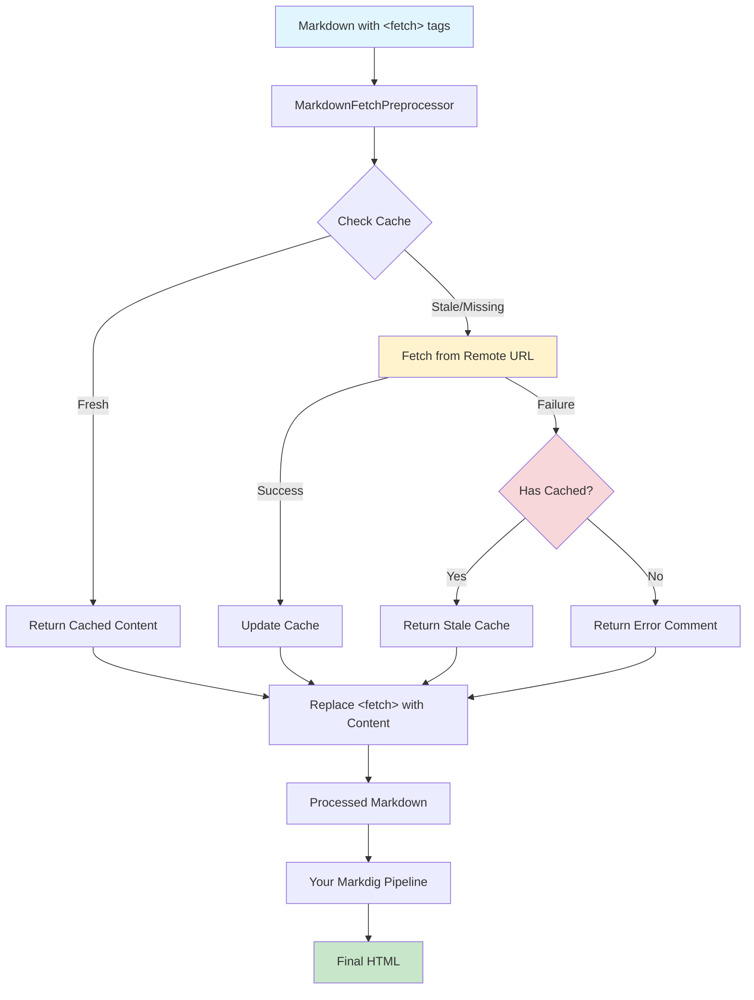
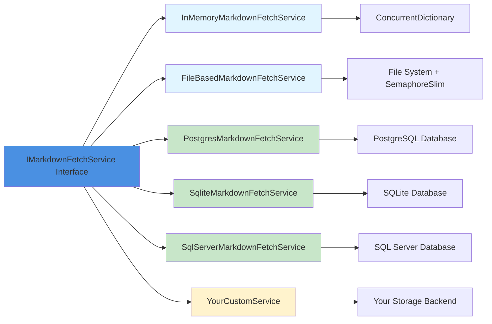
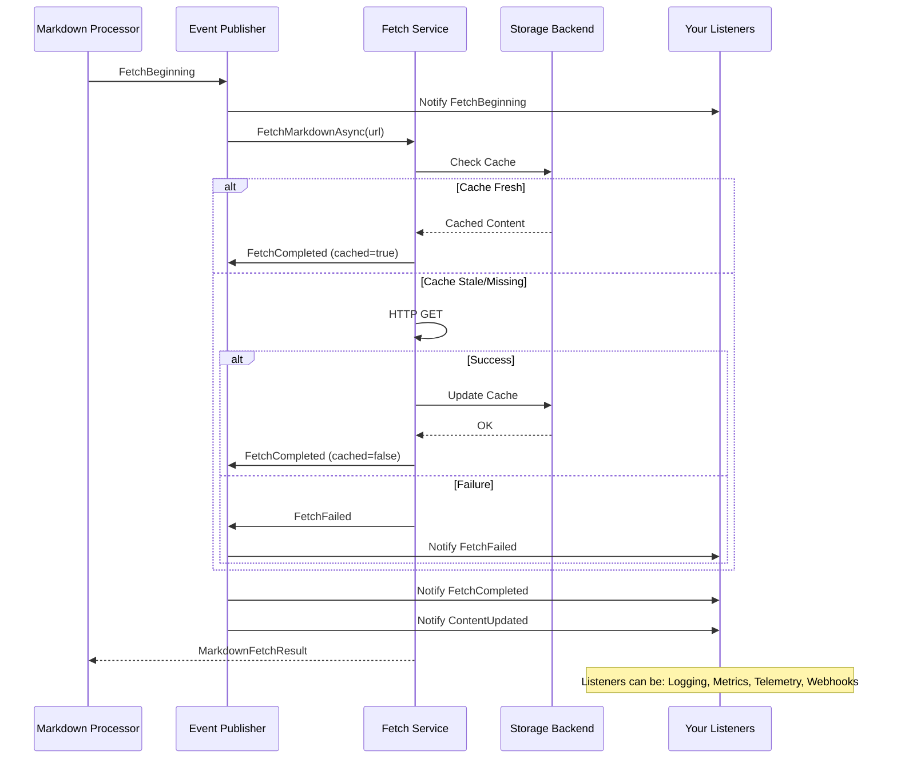
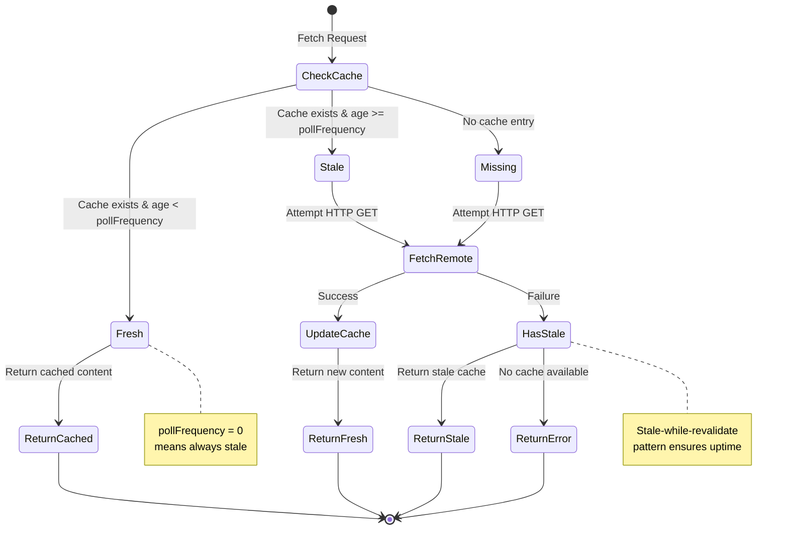

# Mostlylucid.Markdig.FetchExtension

A Markdig extension that provides two powerful features:

1. **Table of Contents** - Automatically generate TOC from document headings
2. **Fetch Remote Markdown** - Embed remote markdown content at render time

## Table of Contents Extension

Automatically generate a table of contents from your document headings using `[TOC]` markers.

### Usage Examples

```markdown
# My Article

[TOC]              <!-- All headings H1-H6 -->
[TOC:2-4]          <!-- Only H2-H4 -->
[TOC::my-toc]      <!-- Custom CSS class -->
[TOC:2-4:my-toc]   <!-- Range + custom class -->

## Introduction
...
```

### Output

Generates a semantic `<nav>` element:

```html
<nav class="ml_toc" aria-label="Table of Contents">
  <ul>
    <li><a href="#introduction">Introduction</a></li>
    ...
  </ul>
</nav>
```

Headings automatically get IDs for anchor linking. Default CSS class is `ml_toc`.

---

## Fetch Extension

Enables fetching remote Markdown at render time using a simple inline directive:

```markdown
<fetch markdownurl="https://example.com/README.md" pollfrequency="12h"/>
```

**Full syntax**:
```markdown
<fetch markdownurl="URL"
       pollfrequency="HOURS"
       transformlinks="true|false"
       showsummary="true|false"
       summarytemplate="TEMPLATE"
       cssclass="CLASSNAME"
       disable="true|false"/>
```

- `markdownurl` (required): URL of the remote Markdown to fetch
- `pollfrequency` (required): Cache duration in hours (use `0` to always fetch fresh)
- `transformlinks` (optional): Rewrite relative links to absolute URLs (default: `false`)
- `showsummary` (optional): Display fetch metadata summary (default: `false`)
- `summarytemplate` (optional): Custom template for metadata summary (see examples below)
- `cssclass` (optional): CSS class for the summary wrapper div (default: `"ft_summary"`)
- `disable` (optional): When `true`, the tag is left as-is and not processed (useful for documentation) (default: `false`)

## Features

- **Simple inline syntax** for embedding remote Markdown
- **Multiple storage backends** - In-memory, file-based, or custom (e.g., database)
- **Smart caching** with configurable poll frequency
- **Stale-while-revalidate** - Returns cached content if fetch fails
- **DI-friendly** - Full dependency injection support
- **Error handling** - Gracefully handles failures with HTML comments

## Architecture Overview



## Quick Start

### Option 1: In-Memory Storage (Simplest)

Perfect for demos, testing, or apps that don't need persistence:

```csharp
using Mostlylucid.Markdig.FetchExtension;
using Microsoft.Extensions.DependencyInjection;
using Markdig;

// 1. Setup DI
var services = new ServiceCollection();
services.AddLogging();
services.AddInMemoryMarkdownFetch();
var serviceProvider = services.BuildServiceProvider();

// 2. Configure extension
FetchMarkdownExtension.ConfigureServiceProvider(serviceProvider);

// 3. Create pipeline
var pipeline = new MarkdownPipelineBuilder()
    .UseAdvancedExtensions()
    .Use<FetchMarkdownExtension>()
    .Build();

// 4. Use it!
var markdown = @"
# My Document
<fetch markdownurl=""https://raw.githubusercontent.com/user/repo/main/README.md"" pollfrequency=""1""/>
";

var html = Markdown.ToHtml(markdown, pipeline);
```

### Option 2: File-Based Storage (Recommended)

Persists cache to disk, survives restarts:

```csharp
services.AddFileBasedMarkdownFetch("./markdown-cache");
// ... rest same as above
```

### Option 3: Database Storage (Plugin)

Use a database provider plugin for multi-server deployments:

#### SQLite
```csharp
// Add package: Mostlylucid.Markdig.FetchExtension.Sqlite
services.AddSqliteMarkdownFetch("Data Source=markdown-cache.db");
serviceProvider.EnsureMarkdownCacheDatabase();
```

#### PostgreSQL
```csharp
// Add package: Mostlylucid.Markdig.FetchExtension.Postgres
services.AddPostgresMarkdownFetch("Host=localhost;Database=myapp;Username=user;Password=pass");
serviceProvider.EnsureMarkdownCacheDatabase();
```

#### SQL Server
```csharp
// Add package: Mostlylucid.Markdig.FetchExtension.SqlServer
services.AddSqlServerMarkdownFetch("Server=localhost;Database=MyApp;Integrated Security=true");
serviceProvider.EnsureMarkdownCacheDatabase();
```

See individual plugin READMEs for detailed configuration options.

### Option 4: Custom Storage (Advanced)

Implement `IMarkdownFetchService` for your own backend:

```csharp
public class MyCustomMarkdownFetchService : IMarkdownFetchService
{
    public async Task<MarkdownFetchResult> FetchMarkdownAsync(
        string url,
        int pollFrequencyHours,
        int blogPostId)
    {
        // Your custom implementation
    }
}

builder.Services.AddScoped<IMarkdownFetchService, MyCustomMarkdownFetchService>();
```

## Storage Comparison

| Storage Type | Persistence | Multi-Server | Use Case | Setup |
|-------------|-------------|--------------|----------|-------|
| **In-Memory** | No | No | Demos, testing, simple apps | Very Easy |
| **File-Based** | Yes | No | Single-server production | Easy |
| **SQLite** | Yes | No | Single-server with DB | Easy |
| **PostgreSQL** | Yes | Yes | Multi-server, cloud | Moderate |
| **SQL Server** | Yes | Yes | Enterprise, Azure | Moderate |
| **Custom** | Configurable | Configurable | Specialized needs | Advanced |

### Storage Provider Architecture



## Usage Examples

### Basic Fetch

```markdown
<fetch markdownurl="https://example.com/docs.md" pollfrequency="24"/>
```

### Multiple Sources

```markdown
## API Documentation
<fetch markdownurl="https://api.example.com/README.md" pollfrequency="1"/>

## Changelog
<fetch markdownurl="https://github.com/user/repo/main/CHANGELOG.md" pollfrequency="6"/>
```

### Link Rewriting for Remote Content

When fetching remote Markdown (especially from GitHub repositories), relative links in that content will break. Use `transformlinks="true"` to automatically rewrite relative links to absolute URLs pointing back to the source:

```markdown
<fetch markdownurl="https://raw.githubusercontent.com/user/repo/main/docs/README.md"
       pollfrequency="24"
       transformlinks="true"/>
```

**What it does**:
- Converts relative links like `[docs](./CONTRIBUTING.md)` to absolute GitHub URLs
- Preserves absolute URLs, anchors (`#section`), and mailto links unchanged
- Special handling for GitHub raw URLs - converts to display URLs (blob view)
- Example: `./file.md` becomes `https://github.com/user/repo/blob/main/docs/file.md`

**When to use**:
- Fetching documentation from GitHub repositories
- Embedding content with internal cross-references
- Remote content with relative image or doc links
- Not needed for single-file content without links
- Not needed if source uses only absolute URLs

### With Blog Post Context

The `blogPostId` parameter allows multiple blog posts to fetch the same URL with separate caches:

```csharp
// In your blog rendering code
var blogPostId = post.Id;
var html = Markdown.ToHtml(post.Content, pipeline);
// Each post maintains its own cache of fetched content
```

### Fetch Metadata Summary

Show readers when content was last fetched and its cache status with customizable metadata summaries.

#### Inline Summary (attached to fetched content)

Add summary directly after the fetched content:

```markdown
<fetch markdownurl="https://api.example.com/status.md"
       pollfrequency="1"
       showsummary="true"/>
```

**Default output** (italicized at bottom of fetched content):
> _Content fetched from [https://api.example.com/status.md](https://api.example.com/status.md) on 15 Nov 2024 (2 hours ago)_

**Custom template**:
```markdown
<fetch markdownurl="https://example.com/docs.md"
       pollfrequency="24"
       showsummary="true"
       summarytemplate="Last updated: {retrieved:long} | Status: {status} | Refreshes {nextrefresh:relative}"/>
```

Output:
> Last updated: 15 November 2024 14:30 | Status: cached | Refreshes in 22 hours

**Available placeholders**:

| Placeholder | Description | Example |
|------------|-------------|---------|
| `{retrieved:format}` | Last fetch date/time | See formats below |
| `{age}` | Human-readable time since fetch | "2 hours ago", "3 days ago" |
| `{url}` | Source URL | `https://example.com/file.md` |
| `{nextrefresh:format}` | When content will be refreshed | "in 22 hours", "in 5 minutes" |
| `{pollfrequency}` | Cache duration in hours | `24` |
| `{status}` | Cache status | `fresh`, `cached`, or `stale` |

**Date format options for `{retrieved:format}` and `{nextrefresh:format}`**:

| Format | Example Output |
|--------|---------------|
| `relative` | "2 hours ago" / "in 3 days" |
| `short` | "15 Nov 2024" |
| `long` | "15 November 2024 14:30" |
| `date` | "2024-11-15" |
| `time` | "14:30" |
| `iso` | "2024-11-15T14:30:00.000Z" |
| `day` | "15" |
| `month` | "11" |
| `month-text` | "November" |
| `month-short` | "Nov" |
| `year` | "2024" |
| Custom | Any .NET DateTime format string |

**Examples**:

```markdown
<!-- Minimal transparency -->
<fetch markdownurl="https://github.com/user/repo/main/README.md"
       pollfrequency="24"
       showsummary="true"
       summarytemplate="_Updated {age}_"/>
```

```markdown
<!-- Detailed status for critical content -->
<fetch markdownurl="https://status.example.com/uptime.md"
       pollfrequency="1"
       showsummary="true"
       summarytemplate="**Status**: {status} | Last check: {retrieved:time} | Next: {nextrefresh:time}"/>
```

```markdown
<!-- SEO-friendly with full dates -->
<fetch markdownurl="https://api.example.com/changelog.md"
       pollfrequency="6"
       showsummary="true"
       summarytemplate="*Content from [{url}]({url}) as of {retrieved:dd MMMM yyyy}*"/>
```

```markdown
<!-- Custom CSS class for summary styling -->
<fetch markdownurl="https://api.example.com/docs.md"
       pollfrequency="12"
       showsummary="true"
       summarytemplate="Updated {age}"
       cssclass="content-metadata"/>
```

**Output with custom CSS class**:
```html
<div class="content-metadata">Updated 2 hours ago</div>
```

#### Separate Summary Tag (place anywhere)

Use `<fetch-summary>` to display metadata separately from the content. This is useful for:
- Showing summary at the top of a section while content appears below
- Creating a metadata footer in a different location
- Building a status dashboard showing multiple fetch statuses

**Basic usage**:
```markdown
# External Documentation

<fetch markdownurl="https://github.com/user/repo/main/README.md"
       pollfrequency="24"
       transformlinks="true"/>

---

<fetch-summary url="https://github.com/user/repo/main/README.md"/>
```

**With custom template**:
```markdown
## Latest API Status

<fetch markdownurl="https://status.api.com/current.md" pollfrequency="1"/>

---

**Metadata**: <fetch-summary url="https://status.api.com/current.md"
              template="Last check: {retrieved:time} | Status: {status} | Next: {nextrefresh:relative}"/>
```

**With custom CSS class**:
```markdown
<fetch-summary url="https://api.example.com/status.md"
               template="{status} - {age}"
               cssclass="api-status-badge"/>
```

**Multiple summaries**:
```markdown
# Documentation Hub

## Core Library
<fetch markdownurl="https://example.com/core/README.md" pollfrequency="24"/>

## API Reference
<fetch markdownurl="https://example.com/api/README.md" pollfrequency="12"/>

## Changelog
<fetch markdownurl="https://example.com/CHANGELOG.md" pollfrequency="6"/>

---

### Update Status
- Core docs: <fetch-summary url="https://example.com/core/README.md" template="updated {age}"/>
- API docs: <fetch-summary url="https://example.com/api/README.md" template="updated {age}"/>
- Changelog: <fetch-summary url="https://example.com/CHANGELOG.md" template="updated {age}"/>
```

**Important**: The `url` attribute in `<fetch-summary>` must exactly match the `markdownurl` from the corresponding `<fetch>` tag. The fetch must appear earlier in the document.

## Preprocessing Integration

The FetchExtension uses a **preprocessing approach** to ensure fetched content flows through your existing Markdig pipeline seamlessly.

### How It Works

```
Your Markdown → MarkdownFetchPreprocessor → Fetched Content Injected → Your Pipeline → Final HTML
```

1. **Before Parsing**: `MarkdownFetchPreprocessor` scans for `<fetch>` tags
2. **Content Fetching**: Remote Markdown is fetched (with caching)
3. **Tag Replacement**: `<fetch>` tags are replaced with actual Markdown content
4. **Normal Processing**: The merged Markdown flows through your pipeline once
5. **Consistent Output**: All content gets the same extensions, styling, and processing

### Integration Example

In your main application (like the Mostlylucid blog):

```csharp
public class MarkdownRenderingService
{
    private readonly IServiceProvider _serviceProvider;
    private readonly MarkdownFetchPreprocessor _preprocessor;

    public MarkdownRenderingService(IServiceProvider serviceProvider)
    {
        _serviceProvider = serviceProvider;
        _preprocessor = new MarkdownFetchPreprocessor(serviceProvider);
    }

    public string RenderMarkdown(string markdown)
    {
        // Step 1: Preprocess to handle fetch tags
        var processedMarkdown = _preprocessor.Preprocess(markdown);

        // Step 2: Run through your normal pipeline
        var pipeline = new MarkdownPipelineBuilder()
            .UseAdvancedExtensions()
            .UseYourCustomExtensions()  // Your ToC, syntax highlighting, etc.
            .Build();

        return Markdown.ToHtml(processedMarkdown, pipeline);
    }
}
```

### Why Preprocessing?

**Benefits**:
- Fetched content gets ALL your custom Markdig extensions
- Consistent styling and processing everywhere
- No special rendering path for remote content
- Works with any Markdig extensions (ToC, syntax highlighting, etc.)
- Simple to integrate - just one preprocessing step

**Alternative Approach** (not used):
- Parse fetch tags as inline/block elements during Markdig parsing
- Would require separate rendering pipeline for fetched content
- Inconsistent results between local and fetched Markdown
- Complex integration with other extensions

### Thread Safety

`MarkdownFetchPreprocessor` is **thread-safe** and can be:
- Registered as a Singleton in DI
- Used concurrently across multiple requests
- Shared across your application

The underlying storage providers handle concurrent access:
- **InMemory**: Uses `ConcurrentDictionary`
- **File**: Uses `SemaphoreSlim` for file locking
- **Database**: Relies on database transaction isolation

## Events and Monitoring

The FetchExtension publishes events for all fetch operations, allowing you to monitor, log, and respond to fetch activity in real-time.



### Available Events

```csharp
public interface IMarkdownFetchEventPublisher
{
    // Raised when a fetch begins
    event EventHandler<FetchBeginningEventArgs> FetchBeginning;

    // Raised when a fetch completes successfully
    event EventHandler<FetchCompletedEventArgs> FetchCompleted;

    // Raised when a fetch fails
    event EventHandler<FetchFailedEventArgs> FetchFailed;

    // Raised when cached content is updated from any source
    event EventHandler<ContentUpdatedEventArgs> ContentUpdated;
}
```

### Subscribe to Events

```csharp
public class Startup
{
    public void ConfigureServices(IServiceCollection services)
    {
        services.AddInMemoryMarkdownFetch();

        // Get the event publisher after building service provider
        var sp = services.BuildServiceProvider();
        var eventPublisher = sp.GetRequiredService<IMarkdownFetchEventPublisher>();

        // Subscribe to events
        eventPublisher.FetchBeginning += (sender, args) =>
        {
            Console.WriteLine($"Fetching {args.Url}...");
        };

        eventPublisher.FetchCompleted += (sender, args) =>
        {
            var source = args.WasCached ? "cache" : "remote";
            Console.WriteLine($"Fetched {args.Url} from {source} in {args.Duration.TotalMilliseconds}ms");
        };

        eventPublisher.FetchFailed += (sender, args) =>
        {
            Console.WriteLine($"Failed to fetch {args.Url}: {args.ErrorMessage}");
        };
    }
}
```

### Monitoring and Telemetry

Perfect for integrating with monitoring systems:

```csharp
// Application Insights / OpenTelemetry integration
eventPublisher.FetchCompleted += (sender, args) =>
{
    telemetryClient.TrackDependency(
        "HTTP",
        args.Url,
        "FetchMarkdown",
        startTime,
        args.Duration,
        success: true);

    telemetryClient.TrackMetric("MarkdownFetch.Duration", args.Duration.TotalMilliseconds);
    telemetryClient.TrackMetric("MarkdownFetch.ContentLength", args.ContentLength);
};

// Prometheus metrics
eventPublisher.FetchCompleted += (sender, args) =>
{
    fetchDurationHistogram.Observe(args.Duration.TotalSeconds);
    fetchCounter.Inc();
};
```

### External Cache Invalidation

Trigger cache updates from external systems (webhooks, file watchers, etc.):

```csharp
// GitHub webhook notifies of README changes
app.MapPost("/webhooks/github", async (IMarkdownFetchEventPublisher eventPublisher) =>
{
    var url = "https://raw.githubusercontent.com/user/repo/main/README.md";

    // Invalidate cache - next request will fetch fresh content
    await eventPublisher.InvalidateCacheAsync(url);

    return Results.Ok();
});

// Or push updated content directly
app.MapPost("/api/markdown/update", async (
    UpdateRequest request,
    IMarkdownFetchEventPublisher eventPublisher) =>
{
    await eventPublisher.UpdateCachedContentAsync(
        request.Url,
        request.Markdown,
        blogPostId: request.PostId);

    return Results.Ok();
});
```

### Fetch Statistics

Monitor fetch performance and cache effectiveness:

```csharp
var stats = eventPublisher.GetStatistics();

Console.WriteLine($"Total Fetches: {stats.TotalFetches}");
Console.WriteLine($"Successful: {stats.SuccessfulFetches}");
Console.WriteLine($"Failed: {stats.FailedFetches}");
Console.WriteLine($"Cache Hits: {stats.CachedResponses}");
Console.WriteLine($"Cache Hit Rate: {(double)stats.CachedResponses / stats.TotalFetches:P1}");
Console.WriteLine($"Avg Duration: {stats.AverageFetchDuration.TotalMilliseconds:F0}ms");
```

### Real-time Dashboard Example

Display fetch status in a dashboard:

```csharp
// SignalR Hub for real-time updates
public class FetchHub : Hub
{
    public FetchHub(IMarkdownFetchEventPublisher eventPublisher)
    {
        eventPublisher.FetchBeginning += async (sender, args) =>
        {
            await Clients.All.SendAsync("FetchStarted", new
            {
                args.Url,
                Timestamp = args.Timestamp
            });
        };

        eventPublisher.FetchCompleted += async (sender, args) =>
        {
            await Clients.All.SendAsync("FetchCompleted", new
            {
                args.Url,
                args.Duration,
                args.WasCached,
                args.ContentLength
            });
        };
    }
}
```

## Standalone Processing

Use the extension without Markdig pipeline for programmatic access:

```csharp
// Just process fetch tags, return markdown
var markdown = @"
# Documentation
<fetch markdownurl=""https://example.com/README.md"" pollfrequency=""24""/>
";

var processedMarkdown = MarkdownFetchProcessor.ProcessFetchTags(
    markdown,
    serviceProvider);
// processedMarkdown now contains fetched content instead of fetch tag

// Or process and render to HTML in one step
var html = MarkdownFetchProcessor.ProcessAndRender(
    markdown,
    serviceProvider,
    pipeline: myCustomPipeline);  // Optional custom pipeline
```

### Async Processing

```csharp
// Async versions for better performance
var processedMarkdown = await MarkdownFetchProcessor.ProcessFetchTagsAsync(
    markdown,
    serviceProvider);

var html = await MarkdownFetchProcessor.ProcessAndRenderAsync(
    markdown,
    serviceProvider,
    myCustomPipeline);
```

### Testing with Standalone Processor

Perfect for unit testing:

```csharp
[Fact]
public void TestMarkdownProcessing()
{
    // Arrange
    var services = new ServiceCollection();
    services.AddInMemoryMarkdownFetch();
    var sp = services.BuildServiceProvider();

    var markdown = "<fetch markdownurl=\"https://example.com/test.md\" pollfrequency=\"1\"/>";

    // Act
    var result = MarkdownFetchProcessor.ProcessFetchTags(markdown, sp);

    // Assert
    Assert.DoesNotContain("<fetch", result);
    Assert.Contains("expected content", result);
}
```

## Advanced Configuration

### Background Polling

Enable automatic background updates:

```csharp
services.AddMarkdownFetchPolling(options =>
{
    options.Enabled = true;
    options.SchedulerTickInterval = TimeSpan.FromMinutes(5);
    options.MaxConcurrentFetches = 10;
    options.HttpTimeout = TimeSpan.FromSeconds(30);
});
```

### Custom Cache Directory

```csharp
services.AddFileBasedMarkdownFetch("/var/cache/markdown");
```

### Disabling Processing for Documentation

When writing documentation about the fetch extension (like this README!), you need a way to show the tags without them being processed. Use the `disable="true"` attribute:

```markdown
<!-- This will be processed and fetch content -->
<fetch markdownurl="https://example.com/README.md" pollfrequency="24"/>

<!-- This will NOT be processed - useful for documentation -->
<fetch markdownurl="https://example.com/README.md" pollfrequency="24" disable="true"/>
```

This works for both `<fetch>` and `<fetch-summary>` tags:

```markdown
<!-- Won't be processed -->
<fetch-summary url="https://example.com/README.md" disable="true"/>
```

The disabled tags remain in your markdown as-is, allowing you to document the syntax without triggering actual fetches.

## Database Storage Plugins

For production deployments requiring persistence and multi-server support, use one of the database provider plugins:

### SQLite Plugin

**Package**: `Mostlylucid.Markdig.FetchExtension.Sqlite`

Perfect for single-server applications with simple database needs:

```bash
dotnet add package Mostlylucid.Markdig.FetchExtension.Sqlite
```

```csharp
services.AddSqliteMarkdownFetch("Data Source=./Data/markdown-cache.db");
```

**Best for**: Single-server apps, development, testing

### PostgreSQL Plugin

**Package**: `Mostlylucid.Markdig.FetchExtension.Postgres`

Enterprise-ready storage for multi-server deployments:

```bash
dotnet add package Mostlylucid.Markdig.FetchExtension.Postgres
```

```csharp
services.AddPostgresMarkdownFetch(
    "Host=localhost;Database=myapp;Username=user;Password=pass");
```

**Best for**: Multi-server deployments, cloud applications, Kubernetes

### SQL Server Plugin

**Package**: `Mostlylucid.Markdig.FetchExtension.SqlServer`

Microsoft SQL Server and Azure SQL Database support:

```bash
dotnet add package Mostlylucid.Markdig.FetchExtension.SqlServer
```

```csharp
services.AddSqlServerMarkdownFetch(
    "Server=localhost;Database=MyApp;Integrated Security=true");
```

**Best for**: Microsoft-centric environments, Azure deployments, enterprise

### Database Plugin Features

All database plugins provide:
- Persistent cache across restarts
- Stale-while-revalidate pattern
- Automatic schema creation
- Thread-safe concurrent access
- Multi-post cache isolation

See individual plugin READMEs for detailed configuration, performance tuning, and deployment guidance.

## How It Works

1. **Parse**: Markdig parses `<fetch>` tags during Markdown processing
2. **Resolve**: Extension resolves `IMarkdownFetchService` from DI
3. **Check Cache**: Service checks if cached content exists and is fresh
4. **Fetch**: If stale or missing, fetches from remote URL
5. **Cache**: Stores content with timestamp for future requests
6. **Render**: Returns content as HTML

### Caching Behavior

- `pollfrequency="0"` = Always fetch fresh (no cache)
- `pollfrequency="24"` = Cache for 24 hours
- Failed fetch with cache = Returns stale cached content
- Failed fetch without cache = Returns error comment



## Error Handling

If a fetch fails, the extension renders an HTML comment:

```html
<!-- Failed to fetch markdown from https://example.com/docs.md: HTTP 404 Not Found -->
```

Your page continues to render normally.

## Demo Application

See the `Mostlylucid.Markdig.FetchExtension.Demo` project for a complete working example.

```bash
cd Mostlylucid.Markdig.FetchExtension.Demo
dotnet run
```

## Testing

Comprehensive tests included in `Mostlylucid.Markdig.FetchExtension.Tests`:

```bash
dotnet test Mostlylucid.Markdig.FetchExtension.Tests
```

## API Reference

### IMarkdownFetchService

```csharp
public interface IMarkdownFetchService
{
    Task<MarkdownFetchResult> FetchMarkdownAsync(
        string url,              // URL to fetch
        int pollFrequencyHours,  // Cache duration in hours
        int blogPostId);         // Optional context ID (0 if not used)
}
```

### MarkdownFetchResult

```csharp
public class MarkdownFetchResult
{
    public bool Success { get; set; }
    public string? Content { get; set; }
    public string? ErrorMessage { get; set; }
}
```

## Requirements

- .NET 9.0+
- Markdig 0.42.0+

## NuGet Package

```bash
dotnet add package Mostlylucid.Markdig.FetchExtension
```

## Contributing

Issues and PRs welcome at [github.com/mostlylucid/mostlylucidweb](https://github.com/mostlylucid/mostlylucidweb)

## License

MIT