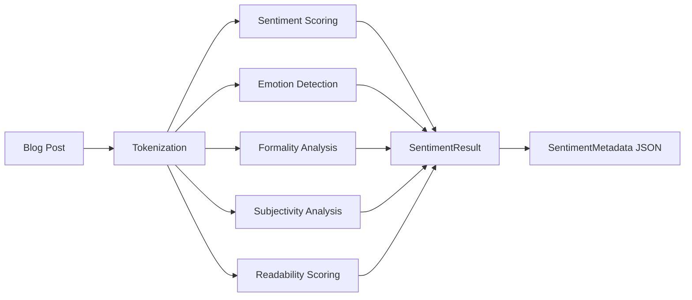

# Mostlylucid Sentiment Analysis

Self-hosted sentiment analysis for blog posts using rule-based and lexicon-based methods.

## Overview

This library provides comprehensive sentiment and emotional tone analysis for the Mostlylucid blog platform. It uses:

- **Lexicon-based sentiment analysis** - CPU-efficient, no ML models required
- **Multi-dimensional analysis** - Sentiment, emotion, formality, subjectivity, readability
- **Similarity scoring** - Find posts with similar emotional tone
- **JSON metadata** - Store sentiment data for semantic search filtering

## Features

- ✅ CPU-friendly analysis (no GPU or heavy models needed)
- ✅ Multi-dimensional sentiment scoring
- ✅ 8 emotional tone categories
- ✅ Formality and subjectivity detection
- ✅ Readability scoring
- ✅ Sentiment similarity calculation
- ✅ JSON metadata for database storage
- ✅ Batch processing support

## Installation

Add to your project:

```bash
dotnet add reference ../Mostlylucid.SentimentAnalysis/Mostlylucid.SentimentAnalysis.csproj
```

## Configuration

Update `appsettings.json`:

```json
{
  "SentimentAnalysis": {
    "Enabled": true,
    "MaxTextLength": 10000,
    "MinimumEmotionConfidence": 0.3,
    "AutoReanalyze": true,
    "EnableCaching": true,
    "CacheExpirationHours": 24
  }
}
```

## Usage

### Register Services

```csharp
// In Program.cs
builder.Services.AddSentimentAnalysis(builder.Configuration);
```

### Analyze Text

```csharp
var sentimentService = services.GetRequiredService<ISentimentAnalysisService>();

var result = await sentimentService.AnalyzeAsync(blogPostContent);

Console.WriteLine($"Sentiment: {result.SentimentClass}");
Console.WriteLine($"Score: {result.SentimentScore:F2}");
Console.WriteLine($"Emotion: {result.DominantEmotion}");
Console.WriteLine($"Formality: {result.FormalityScore:F2}");
```

### Batch Analysis

```csharp
var texts = new[] { "First post content", "Second post content" };
var results = await sentimentService.AnalyzeBatchAsync(texts);
```

### Calculate Similarity

```csharp
var similarity = sentimentService.CalculateSentimentSimilarity(result1, result2);
Console.WriteLine($"Tone similarity: {similarity:P0}");
```

### Store as Metadata

```csharp
var metadata = sentimentService.ToMetadata(result);
var json = JsonSerializer.Serialize(metadata);
// Store in BlogPostEntity.SentimentMetadata column
```

## Analysis Dimensions

### Sentiment Score

Range: -1.0 (very negative) to +1.0 (very positive)

- **Positive**: > 0.1
- **Neutral**: -0.1 to 0.1
- **Negative**: < -0.1

### Emotional Tones

- **Analytical** - Data-driven, logical, research-focused
- **Confident** - Assertive, certain, definitive
- **Tentative** - Uncertain, questioning, hesitant
- **Joyful** - Happy, enthusiastic, excited
- **Sad** - Melancholic, disappointed, regretful
- **Angry** - Frustrated, critical, harsh
- **Fear** - Worried, anxious, concerned
- **Neutral** - No strong emotional tone

### Formality Score

Range: 0.0 (casual) to 1.0 (very formal)

Indicators:
- Formal: "therefore", "moreover", passive voice
- Casual: contractions, "cool", "stuff", "guys"

### Subjectivity Score

Range: 0.0 (objective) to 1.0 (subjective)

- **Objective**: Facts, data, research, measurements
- **Subjective**: Opinions, beliefs, preferences, emotions

### Readability Score

Range: 0.0 (difficult) to 1.0 (easy to read)

Based on:
- Average sentence length
- Average word length
- Vocabulary complexity

## Tone-Based Search

Use sentiment metadata to find posts with similar tone:

```csharp
// Get posts with similar emotional tone
var currentPost = await sentimentService.AnalyzeAsync(postContent);

var similarPosts = allPosts
    .Select(p => new
    {
        Post = p,
        Similarity = sentimentService.CalculateSentimentSimilarity(
            currentPost,
            JsonSerializer.Deserialize<SentimentResult>(p.SentimentMetadata)
        )
    })
    .OrderByDescending(x => x.Similarity)
    .Take(5)
    .ToList();
```

## Architecture

### Analysis Flow



### Lexicon-Based Approach

The service uses curated word lists to detect:
- Positive/negative sentiment words
- Emotional keywords for each tone category
- Formal vs. casual language markers
- Subjective vs. objective indicators

Benefits:
- No model files to download
- Instant analysis (no inference overhead)
- Deterministic results
- Easy to extend and customize

## Performance

- **Analysis Time**: ~5-10ms per blog post
- **Memory Usage**: <10MB
- **Batch Processing**: ~100 posts/second
- **No GPU Required**: Pure CPU-based

## Integration with Semantic Search

Sentiment metadata integrates with the existing semantic search system:

1. **Content Embeddings**: Find similar content
2. **Sentiment Filtering**: Filter by emotional tone
3. **Combined Ranking**: Rank by content + tone similarity

```csharp
// Find technical posts with similar tone
var results = await semanticSearch.SearchAsync(query);
var filtered = results.Where(r =>
    r.SentimentMetadata.DominantEmotion == "Analytical" &&
    r.SentimentMetadata.Formality > 0.7
);
```

## Customization

### Extend Lexicons

```csharp
// In SentimentAnalysisService.cs
private HashSet<string> LoadPositiveWords()
{
    return new HashSet<string>
    {
        // Add your domain-specific positive words
        "efficient", "scalable", "performant", // ...
    };
}
```

### Adjust Thresholds

```json
{
  "SentimentAnalysis": {
    "MinimumEmotionConfidence": 0.2  // Lower = more sensitive
  }
}
```

## Troubleshooting

### Low Confidence Scores

- Add more domain-specific keywords to lexicons
- Adjust `MinimumEmotionConfidence` threshold
- Ensure text is in English (current version)

### Inaccurate Results

- Review and expand word lists
- Consider text preprocessing (remove code blocks, etc.)
- Validate tokenization for your content type

## Future Enhancements

- [ ] Multi-language support
- [ ] ONNX model option for ML-based analysis
- [ ] Advanced linguistic features (dependency parsing)
- [ ] Aspect-based sentiment (sentiment per topic)
- [ ] Emotional arc tracking (sentiment over time)

## License

Part of the Mostlylucid project. See main repository for license information.
