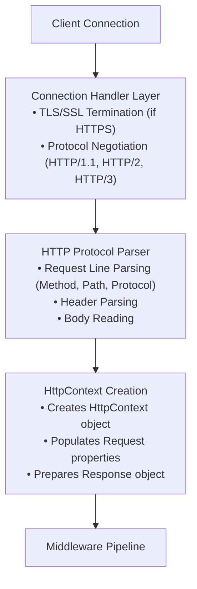
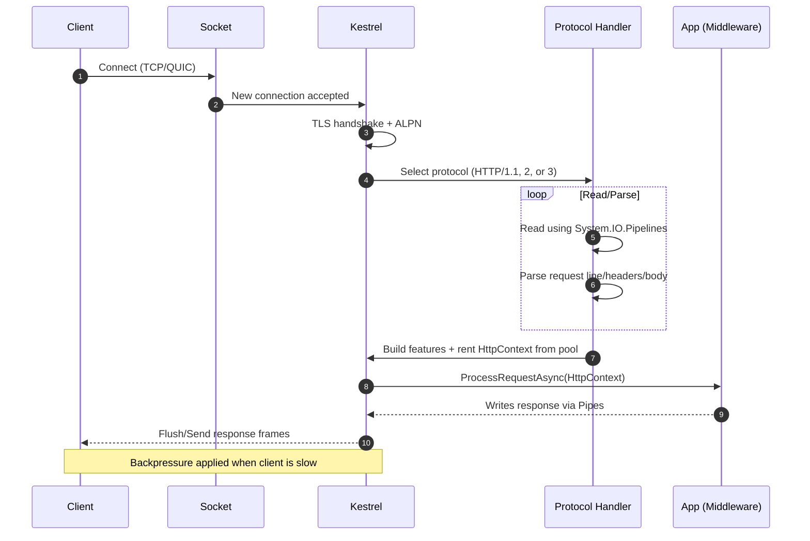

# Understanding the ASP.NET Core Request and Response Pipeline - Part 2: Server and Hosting Layer


<!--category-- ASP.NET, ASP.NET Lifecycle, AI-Article -->
<datetime class="hidden">2025-11-09T09:15</datetime>

## Introduction

In Part 1, we explored the overall architecture of the ASP.NET Core request and response pipeline. Now, we'll dive deep into the foundation layer: the server and hosting infrastructure. This is where everything begins—where your application comes to life and where raw network requests are transformed into the structured `HttpContext` objects that flow through your middleware pipeline.

Understanding this layer is crucial because it controls how your application starts, how it's configured, and how it interacts with the underlying web server. Whether you're deploying to production, optimizing performance, or configuring HTTPS, the hosting layer is where these concerns are addressed.

> NOTE: This is part of my experiments with AI / a way to spend $1000 Calude Code Web credits. I've fed this a BUNCH of papers, my understanding, questions I had to generate this article. It's fun and fills a gap I haven't seen filled anywhere else.

[TOC]


## The Two-Layer Architecture: Host and Server

ASP.NET Core separates the concerns of application hosting and web serving into two distinct layers:

1. **The Host** - Manages application lifetime, configuration, dependency injection, and logging
2. **The Server** - Handles HTTP communications, listens for requests, and manages connections

This separation provides flexibility: you can swap servers (Kestrel, HTTP.sys, IIS Integration) without changing your application code, or run your application in different hosting environments (console app, Windows Service, systemd daemon) without modifying the server configuration.

## The Host Layer

### WebApplication and WebApplicationBuilder

In ASP.NET Core 6 and later, the hosting model has been simplified with `WebApplication` and `WebApplicationBuilder`. This replaced the older `IHostBuilder` and `IWebHostBuilder` pattern with a more streamlined API.

```csharp
// Modern ASP.NET Core 8 application
var builder = WebApplication.CreateBuilder(args);

// Configure services during the build phase
builder.Services.AddControllers();
builder.Services.AddEndpointsApiExplorer();
builder.Services.AddSwaggerGen();

// Build the application
var app = builder.Build();

// Configure middleware after building
if (app.Environment.IsDevelopment())
{
    app.UseSwagger();
    app.UseSwaggerUI();
}

app.UseHttpsRedirection();
app.UseAuthorization();
app.MapControllers();

// Start the server and begin processing requests
app.Run();
```

### What Happens During WebApplication.CreateBuilder()?

When you call `WebApplication.CreateBuilder(args)`, a substantial amount of initialization occurs:

```csharp
// Simplified view of what CreateBuilder does internally
public static WebApplicationBuilder CreateBuilder(string[] args)
{
    var builder = new WebApplicationBuilder();

    // 1. Configure the host defaults
    //    - Content root path (Directory.GetCurrentDirectory())
    //    - Load appsettings.json and appsettings.{Environment}.json
    //    - Load environment variables
    //    - Load command-line arguments
    //    - Setup default logging providers (Console, Debug, EventSource, EventLog on Windows)

    // 2. Configure Kestrel as the default web server
    builder.WebHost.UseKestrel();

    // 3. Setup dependency injection container
    //    - Creates the IServiceCollection
    //    - Registers core services

    // 4. Configure the environment
    //    - Sets ASPNETCORE_ENVIRONMENT (Development, Staging, Production)
    //    - Determines if running in development mode

    // 5. Setup configuration system
    //    - Creates the IConfiguration hierarchy
    //    - Combines all configuration sources

    return builder;
}
```

### Customizing the Host

You have extensive control over how the host is configured:

```csharp
var builder = WebApplication.CreateBuilder(args);

// Configure Kestrel server options
builder.WebHost.ConfigureKestrel(serverOptions =>
{
    serverOptions.Limits.MaxConcurrentConnections = 100;
    serverOptions.Limits.MaxRequestBodySize = 10 * 1024 * 1024; // 10 MB
    serverOptions.Limits.MinRequestBodyDataRate = new MinDataRate(
        bytesPerSecond: 100,
        gracePeriod: TimeSpan.FromSeconds(10)
    );
});

// Add additional configuration sources
builder.Configuration.AddJsonFile("customsettings.json", optional: true);
builder.Configuration.AddEnvironmentVariables(prefix: "MYAPP_");

// Configure logging
builder.Logging.ClearProviders(); // Remove defaults
builder.Logging.AddConsole();
builder.Logging.AddDebug();
builder.Logging.SetMinimumLevel(LogLevel.Warning);

// Change the content root and web root
builder.Environment.ContentRootPath = "/custom/path";
builder.Environment.WebRootPath = "/custom/wwwroot";

var app = builder.Build();
```

### The Service Container

The dependency injection container is built during the host initialization. Services registered here are available throughout your application:

```csharp
var builder = WebApplication.CreateBuilder(args);

// Singleton: One instance for the application lifetime
builder.Services.AddSingleton<IMyService, MyService>();

// Scoped: One instance per request
builder.Services.AddScoped<IRequestService, RequestService>();

// Transient: New instance every time it's requested
builder.Services.AddTransient<ITransientService, TransientService>();

// Configure options pattern
builder.Services.Configure<MyOptions>(
    builder.Configuration.GetSection("MyOptions")
);

// Access configuration directly during service registration
var connectionString = builder.Configuration.GetConnectionString("DefaultConnection");
builder.Services.AddDbContext<MyDbContext>(options =>
    options.UseSqlServer(connectionString)
);

var app = builder.Build();
```

### Environment and Configuration

ASP.NET Core provides a sophisticated configuration system that merges multiple sources:

```csharp
var builder = WebApplication.CreateBuilder(args);

// Configuration is loaded in this order (later sources override earlier):
// 1. appsettings.json
// 2. appsettings.{Environment}.json
// 3. User secrets (in Development environment only)
// 4. Environment variables
// 5. Command-line arguments

// Access configuration
var mySetting = builder.Configuration["MySection:MySetting"];
var myValue = builder.Configuration.GetValue<int>("MySection:MyValue");

// Check environment
if (builder.Environment.IsDevelopment())
{
    // Development-specific configuration
    builder.Services.AddDatabaseDeveloperPageExceptionFilter();
}

if (builder.Environment.IsProduction())
{
    // Production-specific configuration
    builder.Configuration.AddAzureKeyVault(/* ... */);
}

var app = builder.Build();
```

## The Server Layer: Kestrel

Kestrel is ASP.NET Core's cross-platform web server. It's fast, lightweight, and capable of handling production workloads. Understanding Kestrel's capabilities helps you optimize your application's performance and security.

### Kestrel Architecture



#### Kestrel Architecture — Deeper Dive

To understand how bytes become an HttpContext that your middleware can use, it helps to zoom in on Kestrel’s internal flow and responsibilities.

```mermaid
flowchart LR
  subgraph os[OS / Network Stack]
    net[(TCP/UDP Sockets)]
  end

  subgraph kestrel[Kestrel Server]
    accept["Connection Accept Loop<br/>(.NET Sockets)"]

    subgraph connmw[Per-Connection Middleware]
      tls["TLS Termination / ALPN<br/>(Selects HTTP/1.1 vs HTTP/2 vs HTTP/3)"]
      limits["Connection & Request Limits<br/>(timeouts, sizes, rate limits)"]
      logging[Connection Logging]
    end

    subgraph proto[Protocol Handlers]
      h1["HTTP/1.1 Handler<br/>(keep-alive, chunked, pipelining)"]
      h2["HTTP/2 Handler<br/>(multiplexing, HPACK)"]
      h3["HTTP/3 Handler<br/>(QUIC, QPACK)"]
    end

    subgraph io[High-Perf IO]
      pipes["System.IO.Pipelines<br/>(zero-copy buffers)"]
      parser2[HTTP Parser]
    end

    features["Feature Mapping<br/>(IFeatureCollection)"]
    ctxpool[HttpContext Pool]
    appinvoke[IHttpApplication.ProcessRequestAsync]
  end

  app[Your Middleware Pipeline]

  net --> accept --> connmw --> proto
  proto --> io --> features --> ctxpool --> appinvoke --> app
```





Key internals to know:
- TLS and ALPN selection decide which protocol handler runs for this connection.
- System.IO.Pipelines underpins all parsing and writing for minimal allocations and high throughput.
- Feature mapping (IFeatureCollection) exposes low-level server capabilities to HttpContext without tying it to Kestrel types.
- HttpContext objects are pooled to reduce GC pressure; they’re reset and reused per request.
- Backpressure is applied through Pipes when the client can’t read fast enough; server won’t over-buffer writes.
- Timeouts and limits (keep-alive, headers, request body size, HTTP/2 stream limits) protect the server from slowloris and resource exhaustion.
- Threading: most work runs on the ThreadPool; protocol handlers avoid per-request thread creation and favor async continuations.

### Configuring Kestrel Endpoints

You can configure what endpoints Kestrel listens on and how:

```csharp
var builder = WebApplication.CreateBuilder(args);

builder.WebHost.ConfigureKestrel(options =>
{
    // Listen on all network interfaces on port 5000 (HTTP)
    options.Listen(IPAddress.Any, 5000);

    // Listen on localhost port 5001 (HTTPS)
    options.Listen(IPAddress.Loopback, 5001, listenOptions =>
    {
        listenOptions.UseHttps("certificate.pfx", "password");
    });

    // Listen on specific IP with HTTP/2
    options.Listen(IPAddress.Parse("192.168.1.100"), 5002, listenOptions =>
    {
        listenOptions.Protocols = HttpProtocols.Http2;
    });

    // Unix domain socket (Linux/macOS)
    options.ListenUnixSocket("/tmp/myapp.sock");

    // Named pipe (Windows)
    options.ListenNamedPipe("mypipename");
});

var app = builder.Build();
```

Alternatively, you can configure endpoints via appsettings.json:

```json
{
  "Kestrel": {
    "Endpoints": {
      "Http": {
        "Url": "http://localhost:5000"
      },
      "Https": {
        "Url": "https://localhost:5001",
        "Certificate": {
          "Path": "certificate.pfx",
          "Password": "your-password"
        }
      }
    }
  }
}
```

```csharp
var builder = WebApplication.CreateBuilder(args);

// Endpoints are automatically configured from appsettings.json
// when you don't explicitly call ConfigureKestrel

var app = builder.Build();
```

### HTTPS Configuration

HTTPS is essential for production applications. Kestrel provides several ways to configure TLS:

```csharp
var builder = WebApplication.CreateBuilder(args);

builder.WebHost.ConfigureKestrel(options =>
{
    options.Listen(IPAddress.Any, 5001, listenOptions =>
    {
        // Option 1: Certificate from file
        listenOptions.UseHttps("certificate.pfx", "password");

        // Option 2: Certificate from store (Windows)
        listenOptions.UseHttps(storeCert =>
        {
            storeCert.Subject = "localhost";
            storeCert.Store = "My";
            storeCert.Location = StoreLocation.CurrentUser;
            storeCert.AllowInvalid = false; // Don't allow invalid certs
        });

        // Option 3: Development certificate
        listenOptions.UseHttps(); // Uses development certificate in Development environment

        // Option 4: Configure TLS details
        listenOptions.UseHttps(httpsOptions =>
        {
            httpsOptions.ServerCertificate = LoadCertificate();
            httpsOptions.ClientCertificateMode = ClientCertificateMode.RequireCertificate;
            httpsOptions.CheckCertificateRevocation = true;
            httpsOptions.SslProtocols = SslProtocols.Tls12 | SslProtocols.Tls13;

            // Client certificate validation
            httpsOptions.ClientCertificateValidation = (certificate, chain, errors) =>
            {
                // Custom validation logic
                return errors == SslPolicyErrors.None;
            };
        });
    });
});

var app = builder.Build();
```

### Kestrel Limits and Performance Tuning

Kestrel provides numerous options to control resource usage and optimize performance:

```csharp
var builder = WebApplication.CreateBuilder(args);

builder.WebHost.ConfigureKestrel(options =>
{
    // Connection limits
    options.Limits.MaxConcurrentConnections = 100;
    options.Limits.MaxConcurrentUpgradedConnections = 100;

    // Request limits
    options.Limits.MaxRequestBodySize = 10 * 1024 * 1024; // 10 MB
    options.Limits.MaxRequestHeaderCount = 100;
    options.Limits.MaxRequestHeadersTotalSize = 32 * 1024; // 32 KB
    options.Limits.MaxRequestLineSize = 8 * 1024; // 8 KB

    // Keep-alive timeout
    options.Limits.KeepAliveTimeout = TimeSpan.FromMinutes(2);

    // Request header read timeout
    options.Limits.RequestHeadersTimeout = TimeSpan.FromSeconds(30);

    // Minimum data rate for request body
    options.Limits.MinRequestBodyDataRate = new MinDataRate(
        bytesPerSecond: 240,
        gracePeriod: TimeSpan.FromSeconds(5)
    );

    // Minimum data rate for response body
    options.Limits.MinResponseDataRate = new MinDataRate(
        bytesPerSecond: 240,
        gracePeriod: TimeSpan.FromSeconds(5)
    );

    // HTTP/2 specific limits
    options.Limits.Http2.MaxStreamsPerConnection = 100;
    options.Limits.Http2.HeaderTableSize = 4096;
    options.Limits.Http2.MaxFrameSize = 16 * 1024; // 16 KB
    options.Limits.Http2.MaxRequestHeaderFieldSize = 8 * 1024; // 8 KB
    options.Limits.Http2.InitialConnectionWindowSize = 128 * 1024; // 128 KB
    options.Limits.Http2.InitialStreamWindowSize = 96 * 1024; // 96 KB
});

var app = builder.Build();
```

### HTTP/2 and HTTP/3 Support

Kestrel supports modern HTTP protocols:

```csharp
var builder = WebApplication.CreateBuilder(args);

builder.WebHost.ConfigureKestrel(options =>
{
    // HTTP/1.1 only
    options.Listen(IPAddress.Any, 5000, listenOptions =>
    {
        listenOptions.Protocols = HttpProtocols.Http1;
    });

    // HTTP/1.1 and HTTP/2
    options.Listen(IPAddress.Any, 5001, listenOptions =>
    {
        listenOptions.Protocols = HttpProtocols.Http1AndHttp2;
        listenOptions.UseHttps();
    });

    // HTTP/2 only
    options.Listen(IPAddress.Any, 5002, listenOptions =>
    {
        listenOptions.Protocols = HttpProtocols.Http2;
        listenOptions.UseHttps();
    });

    // HTTP/3 (QUIC) - requires .NET 7+
    options.Listen(IPAddress.Any, 5003, listenOptions =>
    {
        listenOptions.Protocols = HttpProtocols.Http1AndHttp2AndHttp3;
        listenOptions.UseHttps();
    });
});

var app = builder.Build();
```

### Server Features

Kestrel exposes server capabilities through the `IFeatureCollection` available on `HttpContext`:

```csharp
app.Use(async (context, next) =>
{
    // Check if HTTP/2 is being used
    var http2Feature = context.Features.Get<IHttpRequestFeature>();
    if (http2Feature?.Protocol == "HTTP/2")
    {
        Console.WriteLine("Using HTTP/2");
    }

    // Access connection features
    var connectionFeature = context.Features.Get<IHttpConnectionFeature>();
    Console.WriteLine($"Remote IP: {connectionFeature?.RemoteIpAddress}");
    Console.WriteLine($"Local IP: {connectionFeature?.LocalIpAddress}");

    // TLS information
    var tlsFeature = context.Features.Get<ITlsConnectionFeature>();
    if (tlsFeature?.ClientCertificate != null)
    {
        Console.WriteLine($"Client cert: {tlsFeature.ClientCertificate.Subject}");
    }

    // Request body pipe for high-performance scenarios
    var bodyPipeFeature = context.Features.Get<IRequestBodyPipeFeature>();
    if (bodyPipeFeature != null)
    {
        var reader = bodyPipeFeature.Reader;
        // Use System.IO.Pipelines for zero-copy reads
    }

    await next(context);
});
```

## Application Lifetime Events

The host provides hooks for application lifecycle events:

```csharp
var builder = WebApplication.CreateBuilder(args);
var app = builder.Build();

// Get the application lifetime
var lifetime = app.Services.GetRequiredService<IHostApplicationLifetime>();

// Application started event
lifetime.ApplicationStarted.Register(() =>
{
    Console.WriteLine("Application has started");
    // Perform startup tasks (warm up caches, etc.)
});

// Application stopping event
lifetime.ApplicationStopping.Register(() =>
{
    Console.WriteLine("Application is stopping");
    // Begin graceful shutdown (stop accepting new requests)
});

// Application stopped event
lifetime.ApplicationStopped.Register(() =>
{
    Console.WriteLine("Application has stopped");
    // Cleanup resources
});

app.Run();
```

You can also implement `IHostedService` for background tasks:

```csharp
public class MyBackgroundService : IHostedService, IDisposable
{
    private Timer? _timer;
    private readonly ILogger<MyBackgroundService> _logger;

    public MyBackgroundService(ILogger<MyBackgroundService> logger)
    {
        _logger = logger;
    }

    public Task StartAsync(CancellationToken cancellationToken)
    {
        _logger.LogInformation("Background service is starting");

        _timer = new Timer(DoWork, null, TimeSpan.Zero, TimeSpan.FromMinutes(5));

        return Task.CompletedTask;
    }

    private void DoWork(object? state)
    {
        _logger.LogInformation("Background service is working");
        // Perform periodic work
    }

    public Task StopAsync(CancellationToken cancellationToken)
    {
        _logger.LogInformation("Background service is stopping");

        _timer?.Change(Timeout.Infinite, 0);

        return Task.CompletedTask;
    }

    public void Dispose()
    {
        _timer?.Dispose();
    }
}

// Register the service
var builder = WebApplication.CreateBuilder(args);
builder.Services.AddHostedService<MyBackgroundService>();
var app = builder.Build();
```

## Graceful Shutdown

ASP.NET Core handles graceful shutdown automatically, but you can customize the behavior:

```csharp
var builder = WebApplication.CreateBuilder(args);

// Configure shutdown timeout
builder.WebHost.ConfigureKestrel(options =>
{
    options.AddServerHeader = false; // Remove Server header for security
});

builder.Host.ConfigureHostOptions(options =>
{
    // How long to wait for the application to shut down gracefully
    options.ShutdownTimeout = TimeSpan.FromSeconds(30);
});

var app = builder.Build();

// During shutdown, Kestrel:
// 1. Stops accepting new connections
// 2. Waits for existing requests to complete (up to ShutdownTimeout)
// 3. Aborts remaining requests
// 4. Disposes services
// 5. Runs ApplicationStopped callbacks

app.Run();
```

## Production Hosting Scenarios

### Running Behind a Reverse Proxy

In production, Kestrel is typically behind a reverse proxy (nginx, Apache, IIS):

```csharp
var builder = WebApplication.CreateBuilder(args);

// Configure forwarded headers for reverse proxy scenarios
builder.Services.Configure<ForwardedHeadersOptions>(options =>
{
    options.ForwardedHeaders = ForwardedHeaders.XForwardedFor | ForwardedHeaders.XForwardedProto;

    // If your proxy is on a known network
    options.KnownNetworks.Add(new IPNetwork(IPAddress.Parse("10.0.0.0"), 8));
    options.KnownProxies.Add(IPAddress.Parse("10.0.0.1"));

    // Required when running in containers/Kubernetes
    options.ForwardedHeaders = ForwardedHeaders.All;
    options.KnownNetworks.Clear();
    options.KnownProxies.Clear();
});

var app = builder.Build();

// Must be before other middleware
app.UseForwardedHeaders();

app.UseHttpsRedirection();
app.UseAuthentication();
app.UseAuthorization();

app.MapControllers();

app.Run();
```

### Windows Service Hosting

```csharp
var builder = WebApplication.CreateBuilder(args);

// Enable Windows Service lifetime
builder.Host.UseWindowsService();

// Configure content root for Windows Service
builder.Host.UseContentRoot(AppContext.BaseDirectory);

var app = builder.Build();

app.Run();
```

### Linux systemd Service Hosting

```csharp
var builder = WebApplication.CreateBuilder(args);

// Enable systemd lifetime
builder.Host.UseSystemd();

var app = builder.Build();

app.Run();
```

## Advanced: Custom Server

While Kestrel is the standard choice, you can implement a custom server if needed:

```csharp
public class CustomServer : IServer
{
    private IFeatureCollection _features = new FeatureCollection();

    public IFeatureCollection Features => _features;

    public Task StartAsync<TContext>(IHttpApplication<TContext> application,
        CancellationToken cancellationToken) where TContext : notnull
    {
        // Start listening for connections
        // Create HttpContext for each request
        // Invoke application.ProcessRequestAsync(httpContext)
        return Task.CompletedTask;
    }

    public Task StopAsync(CancellationToken cancellationToken)
    {
        // Stop accepting new connections
        // Wait for existing requests to complete
        return Task.CompletedTask;
    }

    public void Dispose()
    {
        // Cleanup resources
    }
}

// Use custom server
var builder = WebApplication.CreateBuilder(args);
builder.WebHost.UseServer(new CustomServer());
var app = builder.Build();
```

## Key Takeaways

- The host manages application lifetime, configuration, DI, and logging
- Kestrel is a high-performance, cross-platform web server
- You can configure endpoints, HTTPS, protocols, and performance limits
- The server creates `HttpContext` objects that flow through the middleware pipeline
- Graceful shutdown ensures requests complete before the application terminates
- Production deployments typically use Kestrel behind a reverse proxy
- The `IFeatureCollection` provides access to low-level server capabilities

Understanding the server and hosting layer gives you control over how your application starts, how it handles connections, and how it performs under load. This foundation supports everything that happens in the layers above.

---
