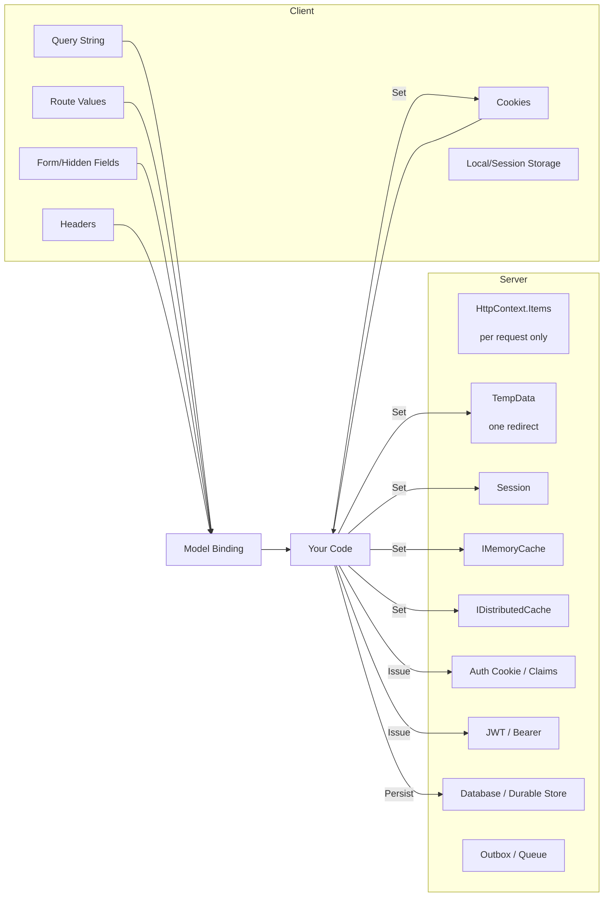
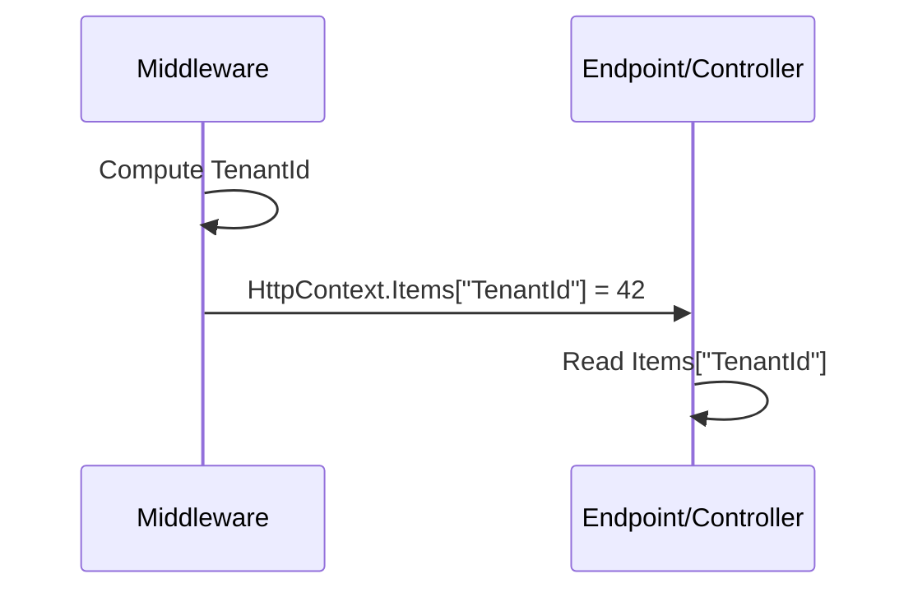
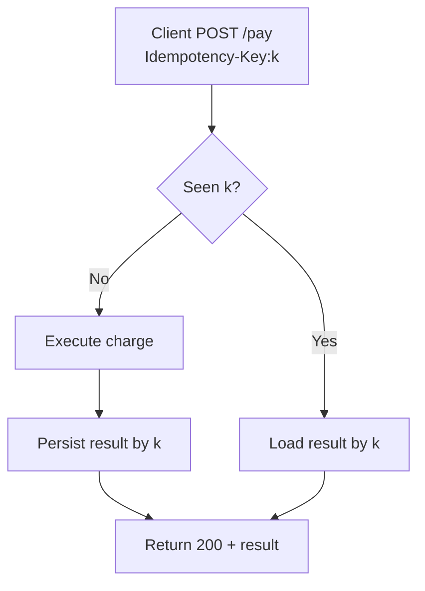
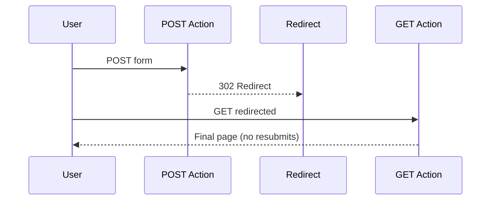
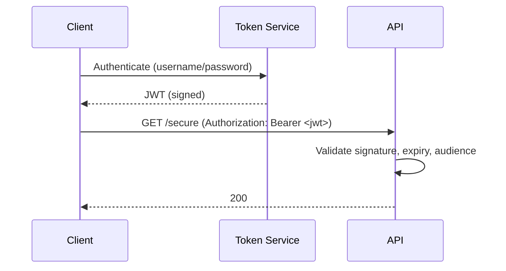
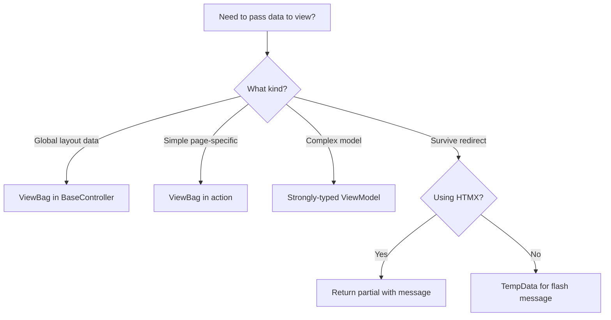
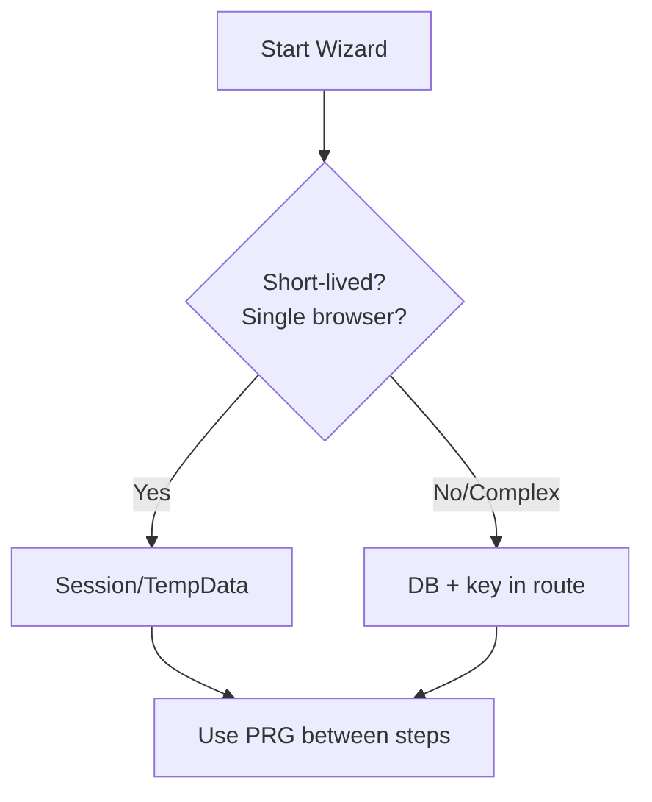
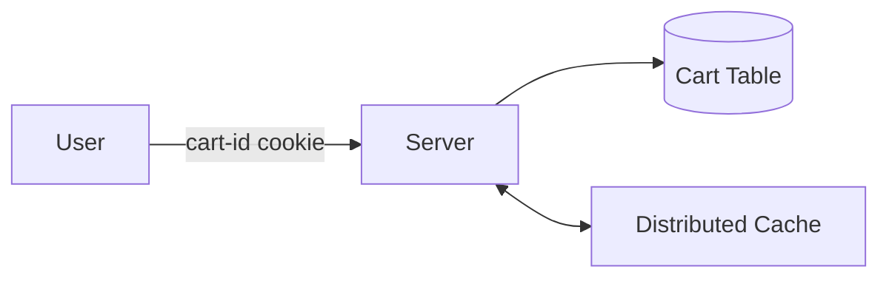

# Keeping State Between Requests in ASP.NET Core: A Practical, No‑Nonsense Guide (MVC, Razor Pages, Minimal APIs)

<!--category-- ASP.NET, ASP.NET Core, State, Web Development, AI-Article -->
<datetime class="hidden">2025-11-09T12:33</datetime>

> **UPDATE (2025-11-10)**: Added more practical examples from my actual codebase showing real-world patterns, trade-offs, gotchas, and the evolution from simple to sophisticated state management approaches. Includes detailed IMemoryCache patterns, ViewBag usage (good and bad), ResponseCache/OutputCache strategies, and lessons learned from production.

## Introduction

HTTP is famously stateless. Your app… is not. Users sign in, add items to baskets, hop between pages, return tomorrow, and expect you to remember. In ASP.NET Core (MVC, Razor Pages, Minimal APIs), there are a lot of ways to preserve and transfer state between requests. Some are per-request only. Some last for a session. Some live in the client. Some are distributed and survive server restarts. Each choice has trade-offs across security, performance, scale, and developer ergonomics.

This post catalogs the options, shows concrete, copy‑pasteable examples in all three stacks, and gives you decision guidance so you can pick the right tool for the job.

> NOTE: This is part of my experiments with AI (assisted drafting) + my own editing. Same voice, same pragmatism; just faster fingers.

[TOC]

## The Landscape at a Glance



- Client-carried: query, route, headers, forms, cookies, JWT. Scales horizontally but is visible to the client (must be validated/signed/encrypted where appropriate).
- Server-carried: TempData, Session, caches, DB. Requires affinity or distribution strategy.
- Per-request: HttpContext.Items — useful for passing data internally during a single request.

## Golden Rules (before we dive into APIs)

1. Prefer “stateless server” patterns when you need to scale horizontally (push state to client tokens, durable stores, or distributed caches).
2. Never trust client-controlled state. Validate, sign, and/or encrypt.
3. Keep large data out of cookies and headers; they bloat every request.
4. Use TempData only for Post-Redirect-Get (PRG) one-shots like flash messages.
5. Use Session only when you must maintain server-side conversational state and you’ve planned distribution.
6. Claims are for identity and coarse-grained authorization, not general app state.
7. Cache is not a source of truth. Back it with a durable store if the data matters.

---

## Per-Request State: HttpContext.Items

- Scope: current request only (teardown at end of pipeline)
- Use for: passing computed values between middleware and endpoints/controllers
- Scale: no impact
- Security: server-only



Middleware example (all stacks):

```csharp
app.Use(async (context, next) =>
{
    var tenantId = context.Request.Headers["X-TenantId"].FirstOrDefault() ?? "public";
    context.Items["TenantId"] = tenantId;
    await next(context);
});
```

- Minimal API endpoint:
```csharp
app.MapGet("/whoami", (HttpContext ctx) => new { Tenant = ctx.Items["TenantId"] });
```
- MVC Controller:
```csharp
public IActionResult WhoAmI() => Json(new { Tenant = HttpContext.Items["TenantId"] });
```
- Razor Page handler:
```csharp
public IActionResult OnGet() => new JsonResult(new { Tenant = HttpContext.Items["TenantId"] });
```

---

## Transient Client-Carried State: Route Values and Query String

- Scope: current request; the client carries it explicitly.
- Use for: navigation context, filtering, pagination, resource identity
- Security: must validate/authorize; do not embed secrets

Examples

- Minimal APIs:
```csharp
app.MapGet("/orders/{id:int}", (int id, int? page) => Results.Ok(new { id, page }));
// GET /orders/5?page=2
```

- MVC:
```csharp
[HttpGet("/orders/{id:int}")]
public IActionResult Details(int id, int? page)
  => View(new { id, page });
```

- Razor Pages (Orders/Details.cshtml.cs):
```csharp
public IActionResult OnGet(int id, int? page)
  => Page();
```

Generating links that preserve state:
```csharp
// Razor Pages
<a asp-page="/Orders/Details" asp-route-id="@Model.Id" asp-route-page="@Model.Page">Next</a>

// MVC
@Html.ActionLink("Next", "Details", "Orders", new { id = Model.Id, page = Model.Page }, null)
```

---

## Headers: Correlation IDs, Idempotency Keys, Feature Flags

- Scope: current request, optionally echoed in responses
- Use for: tracing, retry-safety, A/B flags
- Security: treat as untrusted input, validate/whitelist

```csharp
app.Use(async (ctx, next) =>
{
    var correlationId = ctx.Request.Headers["X-Correlation-Id"].FirstOrDefault()
                      ?? Guid.NewGuid().ToString("n");
    ctx.Response.Headers["X-Correlation-Id"] = correlationId;
    await next(ctx);
});
```

Idempotency (pattern):


---

## Forms and Hidden Fields (PRG)

- Scope: next request only (client posts back the values)
- Use for: wizard steps, anti-forgery tokens, keeping small bits of state across PRG
- Security: always validate; combine with antiforgery

PRG pattern in MVC/Razor Pages:


- MVC:
```csharp
[HttpPost]
[ValidateAntiForgeryToken]
public IActionResult Save(SettingsModel model)
{
    // validate & persist
    return RedirectToAction(nameof(Summary), new { tab = model.SelectedTab });
}
```

- Razor Pages:
```csharp
public IActionResult OnPost(SettingsModel model)
{
    return RedirectToPage("/Settings/Summary", new { tab = model.SelectedTab });
}
```

---

## Cookies: Small, Signed, Sometimes Encrypted

- Scope: every request from the browser until expiry
- Use for: preferences, non-sensitive flags, consent; auth cookies (separate section)
- Trade-offs: size limits (~4KB per cookie), performance impact, must comply with consent laws

Minimal API example:
```csharp
app.MapPost("/prefs/theme/{value}", (HttpContext ctx, string value) =>
{
    ctx.Response.Cookies.Append("theme", value, new CookieOptions
    {
        HttpOnly = false,
        Secure = true,
        SameSite = SameSiteMode.Lax,
        Expires = DateTimeOffset.UtcNow.AddYears(1)
    });
    return Results.Ok();
});

app.MapGet("/prefs/theme", (HttpContext ctx)
  => Results.Text(ctx.Request.Cookies["theme"] ?? "system"));
```

MVC/Razor Pages usage is identical via `HttpContext`.

For integrity/confidentiality, use the ASP.NET Core Data Protection system to protect payloads you put in cookies yourself.

---

## TempData: One-Redirect Message Bus

- Scope: survives one redirect
- Backing store: Cookie (default) or Session
- Use for: flash messages, validation summaries after PRG

Setup (Program.cs):
```csharp
builder.Services.AddControllersWithViews().AddSessionStateTempDataProvider(); // optional
builder.Services.AddSession();
var app = builder.Build();
app.UseSession();
```

In MVC controller:
```csharp
TempData["StatusMessage"] = "Saved!";
return RedirectToAction("Index");
```

In Razor Page handler:
```csharp
TempData["StatusMessage"] = "Saved!";
return RedirectToPage("/Index");
```

In view/page:
```csharp
@if (TempData["StatusMessage"] is string msg) {
  <div class="alert alert-success">@msg</div>
}
```


---

## Session: Server-Side Conversational State

- Scope: browser session (cookie key + server store)
- Use for: multi-step wizards, small cart data, throttling counters
- Trade-offs: requires sticky sessions or distributed backing store; can limit scale

Configure:
```csharp
builder.Services.AddDistributedMemoryCache(); // or AddStackExchangeRedisCache
builder.Services.AddSession(options =>
{
    options.IdleTimeout = TimeSpan.FromMinutes(20);
    options.Cookie.HttpOnly = true;
    options.Cookie.IsEssential = true;
});
var app = builder.Build();
app.UseSession();
```

Using Session (any stack):
```csharp
app.MapPost("/cart/add/{id:int}", (HttpContext ctx, int id) =>
{
    var key = "cart";
    var bytes = ctx.Session.Get(key);
    var list = bytes is null ? new List<int>() : System.Text.Json.JsonSerializer.Deserialize<List<int>>(bytes)!;
    list.Add(id);
    ctx.Session.Set(key, System.Text.Json.JsonSerializer.SerializeToUtf8Bytes(list));
    return Results.Ok(list);
});
```

Session helpers:
```csharp
public static class SessionExtensions
{
    public static void Set<T>(this ISession session, string key, T value)
      => session.SetString(key, System.Text.Json.JsonSerializer.Serialize(value));

    public static T? Get<T>(this ISession session, string key)
      => session.TryGetValue(key, out var data)
         ? System.Text.Json.JsonSerializer.Deserialize<T>(data)
         : default;
}
```

### A cautionary tale: When session state becomes the bottleneck

I once worked on a massive UK government IT project where session state misuse (among many other architectural sins) became a performance-killing bottleneck. The team had stuffed **everything** into session: user preferences, multi-step form data, search results, temporary calculations, even cached lookups that should have been in a proper cache or database.

**The problem:** Session state was stored in-process (ASP.NET session state in web.config, this was pre-Core days). Every request had to deserialize massive session objects. As load increased, session state ballooned to tens of megabytes per user. With thousands of concurrent users, the servers ran out of memory.

**The desperate solution:** We flew to HP's facility in Stuttgart to run load tests on their Superdome—at the time, **Europe's most powerful Windows machine**. It was a beast: dozens of Itanium processors, hundreds of gigabytes of RAM. The idea was to prove that with enough hardware, the system could meet requirements.

**The result:** Even on the Superdome, we couldn't hit the required concurrent user targets. The session state architecture was fundamentally broken. Vertical scaling couldn't save bad design. The session serialization/deserialization overhead, combined with memory pressure from massive session objects, meant the system simply couldn't scale—not at any reasonable cost.

**The security nightmare:** Worse than the performance issues, we discovered a coding error that caused session state to **leak between users**. User A's session data would occasionally appear in User B's session. This wasn't just embarrassing—it was catastrophic. The users were **NHS staff** accessing patient records and clinical systems. We had accidentally created a data protection breach mechanism that could expose sensitive medical information across different healthcare professionals' sessions.

**What should have happened:**
1. **Stateless by default**: Most of that session data should never have existed
2. **Database for durable state**: Multi-step form progress should have been in the database with a workflow ID
3. **Cache for lookups**: Shared lookups belonged in IMemoryCache or a distributed cache
4. **Client-side for preferences**: User preferences could have been in cookies or local storage
5. **Distributed session if needed**: If session was truly required, Redis-backed session would have shared the load

**The lesson:** Session state doesn't scale vertically and barely scales horizontally (even with sticky sessions or distributed stores, you're still serializing/deserializing on every request). The Superdome experiment proved that throwing hardware at architectural problems is expensive and often futile.

But more importantly: **session state bugs become security vulnerabilities**. Thread-safety issues, race conditions, incorrect session ID handling—these don't just cause performance problems, they can leak sensitive data between users. In a healthcare context (or banking, or any regulated industry), this is a compliance nightmare and potential criminal liability.

**Modern advice:**
- If you find yourself needing more than a few KB of session data, you've probably got a design problem
- If you're storing sensitive data in session, you're creating a security attack surface
- Stateless architectures don't just scale better—they're inherently more secure because there's no server-side state to leak
- Rethink your state management strategy before you need to fly to Stuttgart (or explain a data breach to the Information Commissioner)

---

## Caching: IMemoryCache and IDistributedCache

- Scope: server process (IMemoryCache) or distributed (IDistributedCache)
- Use for: derived/computed data, lookups, short-lived state
- Trade-offs: cache invalidation, serialization for distributed

IMemoryCache:
```csharp
builder.Services.AddMemoryCache();

app.MapGet("/rates", (IMemoryCache cache) =>
{
    var key = "fx:usd:eur";
    if (!cache.TryGetValue(key, out decimal rate))
    {
        rate = 0.92m; // pretend fetch
        cache.Set(key, rate, TimeSpan.FromMinutes(5));
    }
    return Results.Ok(rate);
});
```

IDistributedCache (e.g., Redis):
```csharp
builder.Services.AddStackExchangeRedisCache(o => o.Configuration = "localhost:6379");

app.MapGet("/feature/{name}", async (IDistributedCache cache, string name) =>
{
    var val = await cache.GetStringAsync($"feat:{name}");
    return Results.Text(val ?? "off");
});
```

Cache-as-state anti-pattern warning: if it must be durable or authoritative, store it in a database and optionally cache it.

### Choosing between IMemoryCache and IDistributedCache
- IMemoryCache:
  - Blazing fast, in-process, objects stay as objects (no serialization).
  - Eviction by memory pressure, size limit, absolute/sliding expiration, and priority.
  - Not shared across nodes; cleared on app recycle/deploy.
  - Great for per-node hotsets, computed lookups, short TTLs.
- IDistributedCache (Redis/SQL/etc.):
  - Shared across a farm; survives app restarts; requires serialization (strings/bytes).
  - Slightly higher latency; throughput depends on network and backend.
  - Supports absolute/sliding expiration (provider-dependent; Redis provider updates TTL on access for sliding).
  - Ideal for cross-node consistency, large fan-out reads, feature flags, and session.

### Common cache strategies
- Cache-aside (most common):
  1) Try cache; 2) if miss, load from source; 3) write to cache; 4) return.
  - Pros: simple; source of truth remains the database.
  - Cons: first request after expiry is slow; possible stampedes.
- Read-through (via a library/provider): cache handles loading on misses.
- Write-through: writes go to cache and backing store synchronously.
- Write-behind: write to cache, flush to store asynchronously (risk: loss/inconsistency).
- Refresh-ahead: refresh hot keys before they expire to avoid cold misses.

### Expiration, eviction, and sizing
- Absolute expiration: always expires after a fixed duration (good for external data freshness).
- Sliding expiration: extends TTL on access (good for sessions/user-specific data).
- Size-based eviction (IMemoryCache): set entry.Size and configure SizeLimit to bound memory.
- Priority (IMemoryCache): CacheItemPriority.High/Normal/Low/NeverRemove affects eviction under pressure.
- Jitter: add small random offsets to TTLs to avoid synchronized expiry (stampedes).

### Preventing cache stampedes (thundering herd)
- Use GetOrCreate/GetOrCreateAsync (IMemoryCache) to ensure single-thread population per node.
- Distributed: use a short-lived lock key (SET NX EX) or library support; add TTL jitter; consider background refresh.
- Serve stale-while-revalidate: keep a secondary key with stale value and short extension while new value is computed.

### Key design and namespacing
- Prefer lowercase, colon-delimited keys: app:entity:123 or tenant:us:users:42.
- Include version segment to invalidate whole classes of keys without deletes: v2:products:123.
- Tenant-aware: prefix keys with tenant or organization id to avoid collisions and ease purges.
- Keep keys small but descriptive; avoid user-controlled raw input without normalization.

### Expiring sets of keys (tags/groups)
When you need to invalidate many related entries:
- Versioned prefixes (soft invalidation): bump a global version in a small key and compose keys with it.
  ```csharp
  // version key: "v:products"; keys like $"{version}:product:{id}"
  var version = await cache.GetStringAsync("v:products") ?? "1";
  var key = $"{version}:product:{id}";
  ```
  To invalidate all products: increment v:products (clients will naturally miss old prefixed keys).
- Tag set per group (Redis): keep a Set of keys per tag; on invalidation, fetch members and delete.
  ```csharp
  // using StackExchange.Redis directly for sets + efficient deletes
  var mux = await ConnectionMultiplexer.ConnectAsync("localhost:6379");
  var db = mux.GetDatabase();
  var tag = "tag:category:42";
  var key = $"prod:{prodId}";
  await db.StringSetAsync(key, serialized, expiry: TimeSpan.FromMinutes(30));
  await db.SetAddAsync(tag, key); // remember membership

  // later, invalidate the whole tag
  var members = await db.SetMembersAsync(tag);
  if (members.Length > 0)
  {
      var keys = Array.ConvertAll(members, m => (RedisKey)m);
      await db.KeyDeleteAsync(keys);
  }
  await db.KeyDeleteAsync(tag);
  ```
- Pub/Sub invalidation: publish an "invalidate:key" message; each node removes the key from its local IMemoryCache.
- Scan with patterns: SCAN/KEYS should be avoided in prod hot paths; okay for admin tooling on small keyspaces.

### Practical helpers
- IMemoryCache get-or-set with options:
  ```csharp
  T GetOrAdd<T>(IMemoryCache cache, string key, Func<ICacheEntry, T> factory)
    => cache.GetOrCreate(key, e =>
    {
        e.AbsoluteExpirationRelativeToNow = TimeSpan.FromMinutes(10);
        e.SlidingExpiration = TimeSpan.FromMinutes(2);
        e.Priority = CacheItemPriority.Normal;
        e.Size = 1;
        return factory(e);
    });
  ```
- IDistributedCache with JSON and expiration:
  ```csharp
  static async Task<T?> GetOrSetJsonAsync<T>(IDistributedCache cache, string key, Func<Task<T>> factory, TimeSpan ttl)
  {
      var json = await cache.GetStringAsync(key);
      if (json is not null)
          return System.Text.Json.JsonSerializer.Deserialize<T>(json);

      var value = await factory();
      var opts = new DistributedCacheEntryOptions { AbsoluteExpirationRelativeToNow = ttl };
      await cache.SetStringAsync(key,
          System.Text.Json.JsonSerializer.Serialize(value),
          opts);
      return value;
  }
  ```

### Monitoring and visibility
- Track hit/miss rates and average load time; expose metrics (Prometheus counters) per key group.
- Add logging around cache population and eviction callbacks for IMemoryCache.
- For Redis, watch keyspace hits/misses, latency, and memory fragmentation; set maxmemory policies as appropriate.

---

## Real-World IMemoryCache Patterns from Production

Here's how I actually use IMemoryCache in my blog platform, evolved through trial and error. I'll show you three real patterns from simple to sophisticated.

### Pattern 1: Simple cache-aside for rarely-changing data (Categories)

This was my first caching implementation. Blog categories don't change often, so cache them for 30 minutes:

```csharp
// From BaseController.cs
private const string CacheKey = "Categories";

private async Task<List<string>> GetCategories()
{
    baseControllerService.MemoryCache.TryGetValue(CacheKey, out var value);

    if (value is List<string> categories) return categories;

    logger.LogInformation("Fetching categories from BlogService");
    categories = (await BlogViewService.GetCategories(true)).OrderBy(x => x).ToList();
    baseControllerService.MemoryCache.Set(CacheKey, categories, TimeSpan.FromMinutes(30));
    return categories;
}
```

**Why this works:**
- Categories are read on every page (shown in navigation)
- They rarely change (only when I add new blog posts with new categories)
- 30-minute TTL is fine; if new categories appear, users see them within 30 minutes
- Absolute expiration only (no sliding) because we don't care how often it's accessed

**Gotcha I hit:** Initially I used a string key "Categories". Works fine until you have multiple controllers and one accidentally reuses the same key. Now I use constants or strongly-typed keys (see the earlier section on avoiding collisions).

### Pattern 2: Per-user state with size limits and sliding expiration (Translation tasks)

This caches translation status per user. It's more complex because it needs bounds and should stay alive as long as the user is active:

```csharp
// From TranslateCacheService.cs - tracks translation tasks per user
public void AddTask(string userId, TranslateTask task)
{
    CachedTasks CachedTasks() => new()
    {
        Tasks = new List<TranslateTask> { task },
        AbsoluteExpiration = DateTime.Now.AddHours(6)
    };

    if (memoryCache.TryGetValue(userId, out CachedTasks? tasks))
    {
        tasks ??= CachedTasks();
        var currentTasks = tasks.Tasks;

        // Keep only the 5 most recent tasks
        currentTasks = currentTasks.OrderByDescending(x => x.StartTime).ToList();
        if (currentTasks.Count >= 5)
        {
            var lastTask = currentTasks.Last();
            currentTasks.Remove(lastTask);
        }

        currentTasks.Add(task);
        currentTasks = currentTasks.OrderByDescending(x => x.StartTime).ToList();
        tasks.Tasks = currentTasks;

        memoryCache.Set(userId, tasks, new MemoryCacheEntryOptions
        {
            AbsoluteExpiration = tasks.AbsoluteExpiration,
            SlidingExpiration = TimeSpan.FromHours(1) // Extends on access
        });
    }
    else
    {
        var absoluteExpiration = DateTime.Now.AddHours(6);
        var cachedTasks = CachedTasks();
        memoryCache.Set(userId, cachedTasks, new MemoryCacheEntryOptions
        {
            AbsoluteExpiration = absoluteExpiration,
            SlidingExpiration = TimeSpan.FromHours(1)
        });
    }
}
```

**Why this is different:**
- **Sliding expiration**: If user keeps checking translation status, keep the cache alive up to 6 hours max
- **Size limits**: Only keep 5 most recent tasks per user to prevent memory bloat
- **Manual management**: I explicitly limit size because MemoryCache doesn't enforce entry-level item count limits (only overall cache size)

**Mistake I made:** Initially I didn't limit the number of tasks. A power user triggered 50+ translations and I had a memory leak. Now I keep max 5 per user.

**Trade-off:** This won't scale to millions of users. If this becomes a problem, I'd move to IDistributedCache (Redis) or store in the database with an index on userId + startTime.

### Pattern 3: Cache with observability (Metrics caching)

This caches analytics metrics and tracks cache effectiveness using Serilog tracing:

```csharp
// From UmamiDataSortService.cs - caches Umami analytics metrics
public async Task<List<MetricsResponseModels>?> GetMetrics(DateTime startAt, DateTime endAt, string prefix = "")
{
    using var activity = Log.Logger.StartActivity("GetMetricsWithPrefix");
    try
    {
        var cacheKey = $"Metrics_{startAt:yyyyMMdd}_{endAt:yyyyMMdd}_{prefix}";

        if (cache.TryGetValue(cacheKey, out List<MetricsResponseModels>? metrics))
        {
            activity?.AddProperty("CacheHit", true);
            return metrics;
        }

        activity?.AddProperty("CacheHit", false);
        var metricsRequest = new MetricsRequest
        {
            StartAtDate = startAt,
            EndAtDate = endAt,
            Type = MetricType.url,
            Limit = 500
        };

        var metricRequest = await dataService.GetMetrics(metricsRequest);
        if (metricRequest.Status != HttpStatusCode.OK) return null;

        var filteredMetrics = metricRequest.Data
            .Where(x => x.x.StartsWith(prefix))
            .ToList();

        cache.Set(cacheKey, filteredMetrics, TimeSpan.FromHours(1));

        activity?.AddProperty("MetricsCount", filteredMetrics?.Count() ?? 0);
        activity?.Complete();
        return filteredMetrics;
    }
    catch (Exception e)
    {
        activity?.Complete(LogEventLevel.Error, e);
        return null;
    }
}
```

**What makes this production-ready:**
- **Observability**: SerilogTracing activity tracks cache hit/miss rate and records metrics count
- **Composite key**: Includes date range and prefix to avoid key collisions
- **Date formatting**: Uses `yyyyMMdd` format in key so different times on the same day share the cache
- **Null handling**: Returns null if external service fails; doesn't cache failures
- **Filtered caching**: Caches the filtered result, not the raw response

**Evolution:** Initially I cached for 10 minutes. But Umami metrics are heavy to fetch and don't change much, so 1 hour is fine. I discovered this by looking at the SerilogTracing data and seeing excessive cache misses.

**Monitoring in action:** In Seq (my log aggregator), I can query:
```
ActivityName = "GetMetricsWithPrefix" and CacheHit = false
```
This tells me my cache miss rate. If it's high, I adjust TTL or key strategy.

### Comparing the three approaches

| Pattern | Use Case | Expiration | Size Control | Observability |
|---------|----------|------------|--------------|---------------|
| **Categories** | Global, rarely-changing | 30 min absolute | Not needed (small) | Basic logging |
| **Translation tasks** | Per-user, bounded | 6h absolute + 1h sliding | Manual (5 items max) | None (should add!) |
| **Metrics** | Expensive external calls | 1h absolute | Natural (time-windowed) | Full tracing |

**Key lessons:**
1. Start simple (pattern 1), add complexity only when needed
2. Always think about cache memory usage - add size limits for per-user caches
3. For expensive operations, add observability from day one
4. Adjust TTL based on actual data change frequency, not guesses

**When I don't use IMemoryCache:**
- For user authentication state (claims in auth cookie instead)
- For shopping cart (would use DB + distributed cache in production)
- For blog post content (already in DB, loaded once per request)
- Cross-server state (would need IDistributedCache/Redis)

---

## Authentication Cookies and Claims

- Scope: across requests until expiry/sign-out
- Use for: identity, coarse roles/permissions, a small amount of profile data
- Trade-offs: cookie size; don’t overstuff. Claims should be stable.

Setup cookie auth:
```csharp
builder.Services.AddAuthentication("Cookies")
    .AddCookie("Cookies", o =>
    {
        o.LoginPath = "/login";
        o.Cookie.SecurePolicy = CookieSecurePolicy.Always;
        o.SlidingExpiration = true;
    });
builder.Services.AddAuthorization();
var app = builder.Build();
app.UseAuthentication();
app.UseAuthorization();
```

Sign-in with claims (MVC/minimal):
```csharp
app.MapPost("/login", async (HttpContext ctx) =>
{
    var claims = new[]
    {
        new Claim(ClaimTypes.NameIdentifier, "123"),
        new Claim(ClaimTypes.Name, "Alice"),
        new Claim(ClaimTypes.Role, "Admin")
    };
    var identity = new ClaimsIdentity(claims, "Cookies");
    await ctx.SignInAsync("Cookies", new ClaimsPrincipal(identity));
    return Results.Redirect("/");
});
```

Read claims (any stack):
```csharp
[Authorize]
app.MapGet("/me", (ClaimsPrincipal user)
  => Results.Ok(new { user.Identity!.Name, Roles = user.Claims.Where(c => c.Type == ClaimTypes.Role).Select(c => c.Value) }));
```

---

## JWT / Bearer Tokens

- Scope: client carries token; stateless server
- Use for: SPAs/mobile/APIs, cross-domain, microservices
- Trade-offs: token size; rotation/refresh; store minimal claims, use introspection if needed

```csharp
builder.Services.AddAuthentication("Bearer")
   .AddJwtBearer("Bearer", o =>
   {
       o.Authority = "https://demo.identityserver.io"; // example
       o.Audience = "api";
       o.RequireHttpsMetadata = true;
   });
```

Use:
```csharp
[Authorize(AuthenticationSchemes = "Bearer")]
app.MapGet("/secure", () => "ok");
```

Mermaid overview:


---

## Durable State: Database and Friends

- Scope: forever (until you delete it)
- Use for: anything that must not be lost: carts, orders, profiles, long-running workflows
- Patterns: standard CRUD with EF Core; CQRS; event sourcing; outbox pattern for reliability

EF Core sketch:
```csharp
builder.Services.AddDbContext<AppDb>(o => o.UseSqlServer(cs));

app.MapPost("/cart/items", async (AppDb db, AddItem cmd) =>
{
    var cart = await db.Carts.FindAsync(cmd.CartId) ?? new Cart(cmd.CartId);
    cart.Add(cmd.ProductId, cmd.Qty);
    await db.SaveChangesAsync();
    return Results.Created($"/cart/{cart.Id}", cart);
});
```

---

## Response Caching, ETags, and Conditional Requests

- Not strictly “state carrying,” but reduces repeated work by letting the client/proxies reuse prior responses. Often paired with query/route state.

```csharp
builder.Services.AddResponseCaching();
var app = builder.Build();
app.UseResponseCaching();

app.MapGet("/products", (HttpContext ctx) =>
{
    ctx.Response.GetTypedHeaders().CacheControl = new CacheControlHeaderValue { Public = true, MaxAge = TimeSpan.FromSeconds(30) };
    return Results.Ok(new[] { new { Id = 1, Name = "Widget" } });
}).CacheOutput();
```

ETag example:
```csharp
app.MapGet("/resource", (HttpContext ctx) =>
{
    var version = "W/\"abc123\""; // compute based on data hash
    ctx.Response.Headers.ETag = version;
    if (ctx.Request.Headers.IfNoneMatch == version)
        return Results.StatusCode(StatusCodes.Status304NotModified);
    return Results.Text("payload");
});
```

---

## ResponseCache vs OutputCache: Real-World Usage in Production

I use both ResponseCache and OutputCache together on my blog for different purposes. Here's why you might want both and how they differ.

### The confusion: Two caching attributes?

ASP.NET Core has **two** similar-looking caching systems:

1. **ResponseCache (HTTP caching)**: Sets HTTP headers (`Cache-Control`, `Vary`) telling browsers and CDNs how to cache
2. **OutputCache (server-side)**: Caches the rendered output on the server to skip executing the action entirely

**They complement each other.** ResponseCache handles client/CDN caching; OutputCache handles server-side caching.

### My blog post action (both caches applied)

```csharp
// From BlogController.cs
[Route("{slug}")]
[HttpGet]
[ResponseCache(Duration = 300, VaryByHeader = "hx-request",
    VaryByQueryKeys = new[] { nameof(slug), nameof(language) },
    Location = ResponseCacheLocation.Any)]
[OutputCache(Duration = 3600, VaryByHeaderNames = new[] { "hx-request" },
    VaryByQueryKeys = new[] { nameof(slug), nameof(language) })]
public async Task<IActionResult> Show(string slug, string language = "en")
{
    var post = await blogViewService.GetPost(slug, language);
    if (post == null) return NotFound();

    // ... populate user info, comments, etc ...

    if (Request.IsHtmx()) return PartialView("_PostPartial", post);
    return View("Post", post);
}
```

**What happens when someone requests `/blog/my-post`:**

1. **OutputCache checks first**: Do I have a cached response for `my-post` + `en` language?
   - **Hit**: Return cached HTML, action method never runs (fast! ~1ms)
   - **Miss**: Execute action, render view, cache result for 3600 seconds (1 hour)

2. **ResponseCache sets headers**: After OutputCache generates the response, ResponseCache adds:
   ```
   Cache-Control: public, max-age=300
   Vary: hx-request
   ```

3. **Browser caching**: Browser caches the response for 300 seconds (5 minutes). Subsequent requests from same user don't even hit the server.

4. **CDN caching** (if using Cloudflare/Fastly): CDN caches for 5 minutes. Users worldwide hit the CDN, not my server.

### Why different durations? (300 vs 3600)

```csharp
[ResponseCache(Duration = 300)]    // 5 minutes client/CDN cache
[OutputCache(Duration = 3600)]     // 1 hour server cache
```

**Reasoning:**
- **Server cache is longer (1 hour)**: I control my server; I can purge cache if I update a post
- **Client cache is shorter (5 minutes)**: I can't purge user browsers or CDNs easily; 5 minutes is a reasonable staleness window
- **Trade-off**: If I edit a post, new content appears:
  - Server-side: Immediately (I can invalidate cache)
  - CDN/browsers: Within 5 minutes (or I manually purge CDN)

**Evolution:** Initially I had both at 5 minutes. But that meant my server was re-rendering every 5 minutes even though content rarely changes. Now:
- Server happily serves cached HTML for 1 hour
- Clients get fresh-enough content every 5 minutes

### VaryByHeader for HTMX

```csharp
VaryByHeader = "hx-request"  // ResponseCache
VaryByHeaderNames = new[] { "hx-request" }  // OutputCache
```

**Why this matters:** HTMX requests include `hx-request: true` header. I return different responses:
- **Full request**: Complete HTML page with layout
- **HTMX request**: Partial view without layout

Without `VaryBy`, the cache would return the wrong format. With `VaryBy`, I cache two versions of each page.

**Example:**
```
User requests /blog/my-post → Cache key: "blog/my-post:en:hx=false" → Full HTML cached
HTMX requests /blog/my-post → Cache key: "blog/my-post:en:hx=true" → Partial HTML cached
```

### VaryByQueryKeys for language and pagination

```csharp
[ResponseCache(VaryByQueryKeys = new[] { nameof(slug), nameof(language) })]
[OutputCache(VaryByQueryKeys = new[] { nameof(slug), nameof(language) })]
```

**Problem without this:** `/blog/my-post?language=fr` would serve the English cached version.

**With VaryByQueryKeys:** Separate cache entries:
- `/blog/my-post?language=en` → Cache key includes "en"
- `/blog/my-post?language=fr` → Cache key includes "fr"

**Real usage from my blog list:**
```csharp
[Route("blog")]
[ResponseCache(Duration = 300, VaryByHeader = "hx-request",
    VaryByQueryKeys = new[] { "page", "pageSize", "startDate", "endDate", "language", "orderBy", "orderDir" })]
[OutputCache(Duration = 3600, VaryByHeaderNames = new[] { "hx-request" },
    VaryByQueryKeys = new[] { "page", "pageSize", "startDate", "endDate", "language", "orderBy", "orderDir" })]
public async Task<IActionResult> Index(int page = 1, int pageSize = 20, /* ... */)
```

**Cache explosion warning:** Each unique combination of parameters = separate cache entry:
- `page=1&pageSize=20&language=en` → One entry
- `page=2&pageSize=20&language=en` → Another entry
- `page=1&pageSize=10&language=en` → Another entry

**Mitigation:**
- Reasonable max cache size (OutputCache auto-evicts least-recently-used)
- Common parameters cached (page 1, default pageSize)
- Uncommon combinations might miss cache (acceptable)

### Setup required

**ResponseCache** works out of the box, but for **OutputCache** you need setup:

```csharp
// Program.cs
builder.Services.AddOutputCache(options =>
{
    options.MaximumBodySize = 64 * 1024 * 1024; // 64 MB max response size
    options.SizeLimit = 100 * 1024 * 1024; // 100 MB total cache size
});

var app = builder.Build();
app.UseOutputCache(); // Must be in middleware pipeline
```

### When OutputCache doesn't help

OutputCache is skipped for:
- Authenticated requests (different users see different data)
- POST/PUT/DELETE (only GET/HEAD cached)
- Responses with `Set-Cookie` header
- Responses that explicitly set `Cache-Control: no-store`

**Example where I don't use it:**
```csharp
// Comment submission - authenticated, POST, and per-user
[HttpPost]
[Authorize]
public async Task<IActionResult> AddComment(CommentModel model)
{
    // No caching attributes - this is user-specific and changes state
}
```

### Measuring effectiveness

I use Prometheus metrics (exposed via my app) to track:
```csharp
// Pseudo-code for metrics
cache_hits_total{cache="output"} 45230
cache_misses_total{cache="output"} 892
```

**My cache hit rate: ~98%** for blog posts (most traffic hits the same popular posts repeatedly).

**Impact:**
- Without caching: ~50ms average response time (DB query + Markdown rendering)
- With OutputCache: ~1-2ms for cached responses
- **25x speedup**

### When I temporarily disable caching

Sometimes I'm debugging and need fresh responses every time:

```csharp
// During development, comment out caching
// [ResponseCache(Duration = 300, ...)]
// [OutputCache(Duration = 3600, ...)]
public async Task<IActionResult> Show(string slug, string language = "en")
```

Or use environment-specific settings:
```csharp
#if DEBUG
    // No caching in development
#else
    [ResponseCache(Duration = 300, ...)]
    [OutputCache(Duration = 3600, ...)]
#endif
```

**Better approach:** Use configuration:
```csharp
[ResponseCache(Duration = responseCacheDuration, ...)]
```
where `responseCacheDuration` is 0 in development, 300 in production.

### Pros and cons of this dual-cache strategy

**Pros:**
- **Server efficiency**: OutputCache reduces CPU/DB load by 98%
- **Client/CDN benefits**: ResponseCache reduces my bandwidth and improves global latency
- **Flexibility**: Different TTLs for server vs client
- **Cost savings**: Fewer DB queries, less bandwidth

**Cons:**
- **Staleness**: Content updates take up to 5 minutes to propagate to clients
- **Cache invalidation complexity**: Updating a post requires invalidating both server and CDN caches
- **Memory usage**: OutputCache holds rendered HTML in server memory
- **Debugging confusion**: Sometimes forget cache is on and wonder why changes don't appear

**When I'd skip caching:**
- Real-time data (stock prices, live sports)
- Personalized content (user-specific recommendations)
- Low-traffic pages (caching overhead > benefit)
- Pages that change very frequently

**My verdict:** For a blog with mostly-static content and high read/write ratio, dual caching is a huge win. I wouldn't use this on admin panels or dashboards with rapidly changing data.

---

## ViewBag, ViewData, and TempData: Controller-to-View State (and why I mostly avoid two of them)

These three are often confused. Here's how they differ and what I actually use in production.

### The three amigos compared

```csharp
// ViewData: string-keyed dictionary
ViewData["Title"] = "Blog";
ViewData["Categories"] = new List<string> { "ASP.NET", "C#" };

// ViewBag: dynamic wrapper around ViewData
ViewBag.Title = "Blog";
ViewBag.Categories = new List<string> { "ASP.NET", "C#" };

// TempData: survives one redirect (backed by session or cookie)
TempData["Message"] = "Post saved!";
return RedirectToAction("Index");
```

| Feature | ViewData | ViewBag | TempData |
|---------|----------|---------|----------|
| **Type** | `ViewDataDictionary` | dynamic | `ITempDataDictionary` |
| **Lifetime** | Current request | Current request | One redirect |
| **Key access** | String keys | Property syntax | String keys |
| **Type safety** | None (casts needed) | None (dynamic) | None (casts needed) |
| **Compile-time checking** | No | No | No |
| **Survives redirect** | No | No | Yes |

### What I actually use: ViewBag for global layout data

In my blog, I use ViewBag exclusively for passing data from controllers to shared layout (analytics, categories, etc.):

```csharp
// From BaseController.cs - runs before every action
public override async Task OnActionExecutionAsync(ActionExecutingContext filterContext,
    ActionExecutionDelegate next)
{
    logger.LogInformation("OnActionExecutionAsync");

    if (!Request.IsHtmx())
    {
        // Analytics settings for layout
        ViewBag.UmamiPath = AnalyticsSettings.UmamiPath;
        ViewBag.UmamiWebsiteId = AnalyticsSettings.WebsiteId;
        ViewBag.UmamiScript = AnalyticsSettings.UmamiScript;
    }

    logger.LogInformation("Adding categories to viewbag");
    ViewBag.Categories = await GetCategories(); // Cached list

    await base.OnActionExecutionAsync(filterContext, next);
}
```

Then in my layout (`_Layout.cshtml`):
```html
@if (ViewBag.Categories is List<string> categories)
{
    <nav>
        @foreach (var cat in categories)
        {
            <a asp-controller="Blog" asp-action="Category" asp-route-category="@cat">@cat</a>
        }
    </nav>
}

@if (!string.IsNullOrEmpty(ViewBag.UmamiPath))
{
    <script async src="@ViewBag.UmamiScript"
            data-website-id="@ViewBag.UmamiWebsiteId"></script>
}
```

**Why this pattern works:**
- **Global**: Every page needs categories nav and analytics
- **Computed once**: BaseController runs before every action
- **HTMX optimization**: Skip analytics script on partial requests (HTMX doesn't need it re-injected)
- **Cached**: Categories are cached (see my IMemoryCache pattern above), so not hitting DB every request

**Mistake I made early on:** I was setting `ViewBag.Categories` in every single action method. DRY violation and easy to forget. Moving it to `OnActionExecutionAsync` in the base controller solved this.

### ViewBag for page-specific data (acceptable pattern)

```csharp
// From BlogController.cs
[Route("category/{category}")]
public async Task<IActionResult> Category(string category, int page = 1, int pageSize = 10)
{
    ViewBag.Category = category; // Used in view for heading
    ViewBag.Title = category + " - Blog"; // Used in layout <title>

    var posts = await blogViewService.GetPostsByCategory(category, page, pageSize);
    // ... populate posts model ...

    if (Request.IsHtmx()) return PartialView("_BlogSummaryList", posts);
    return View("Index", posts);
}
```

In view:
```html
@{
    ViewData["Title"] = ViewBag.Title; // Standard MVC convention for <title>
}

<h1>Category: @ViewBag.Category</h1>
```

**This is okay because:**
- Simple scalar values (string, int)
- Used only in the view, not passed around
- Alternative would be adding `Title` and `Category` properties to every view model

### What I avoid: Complex objects in ViewBag

**Anti-pattern:**
```csharp
// DON'T DO THIS
ViewBag.User = new UserViewModel { Name = "Scott", IsAdmin = true };
ViewBag.Posts = new List<Post> { ... };
ViewBag.Metadata = new { Tags = new[] { "a", "b" }, Date = DateTime.Now };
```

**Problems:**
- No compile-time safety (typo `ViewBag.Usr` fails at runtime)
- Hard to track what data is available in view
- Makes testing harder (need to inspect ViewBag dictionary)
- No IntelliSense

**Better: Strongly-typed view models:**
```csharp
// DO THIS instead
public class BlogIndexViewModel : BaseViewModel
{
    public string Category { get; set; }
    public List<PostSummary> Posts { get; set; }
    public PaginationInfo Pagination { get; set; }
}

public IActionResult Category(string category, int page = 1)
{
    var model = new BlogIndexViewModel
    {
        Category = category,
        Posts = await GetPosts(category, page),
        // Inherited from BaseViewModel:
        Authenticated = user.LoggedIn,
        Name = user.Name,
        AvatarUrl = user.AvatarUrl
    };
    return View("Index", model);
}
```

### TempData: I don't use it (and here's why)

**Standard TempData use case:**
```csharp
[HttpPost]
public IActionResult SavePost(PostModel model)
{
    // Save post...
    TempData["SuccessMessage"] = "Post saved successfully!";
    return RedirectToAction("Index");
}

public IActionResult Index()
{
    // TempData["SuccessMessage"] available here (consumed on read)
    return View();
}
```

**Why I don't use TempData in my blog:**

1. **I use HTMX instead of redirects**: My forms submit via HTMX and return partial views with inline success/error messages. No redirect = no need for TempData.

```csharp
[HttpPost]
public async Task<IActionResult> Submit(ContactViewModel model)
{
    if (!ModelState.IsValid)
        return PartialView("_ContactForm", model); // Show errors inline

    await sender.SendEmailAsync(contactModel);

    // Return success view directly (no redirect)
    return PartialView("_Response", new ContactViewModel
    {
        Email = model.Email,
        Name = model.Name,
        Comment = "Message sent!"
    });
}
```

2. **For traditional PRG (Post-Redirect-Get)**, I would use TempData. But I prefer avoiding redirects when possible for better UX.

**When TempData makes sense:**
- Traditional MVC apps with full page redirects after POST
- Multi-step wizards where you redirect between steps
- Flash messages after authentication redirects

**TempData gotcha:** By default backed by cookies (since ASP.NET Core 2.0). If you put large objects in TempData, you're bloating the cookie sent with every request. For large state, use Session with a backing store or DB.

### Quick decision tree



**My rules:**
1. **ViewBag for global layout stuff only** (analytics, nav, breadcrumbs)
2. **ViewBag for simple page titles/headings** (optional; could use ViewModel)
3. **Never ViewBag for complex objects** (use ViewModels)
4. **Never ViewData** (ViewBag has nicer syntax)
5. **TempData only if you really need PRG** (I don't, thanks to HTMX)

---

## Pattern: Wizards and Multi-Step Flows

Which state holder to use?



- Small, single-session: Session or TempData between steps.
- Cross-device/long-running: persist to DB, carry a key in the URL.

Example (DB + route key):
```csharp
app.MapPost("/wizard/{id}", async (AppDb db, Guid id, StepInput input) =>
{
    var flow = await db.Flows.FindAsync(id) ?? new Flow(id);
    flow.Apply(input);
    await db.SaveChangesAsync();
    return Results.Redirect($"/wizard/{id}/next");
});
```

---

## Pattern: Flash Messages with TempData

- Set in POST; read once after redirect.

```csharp
TempData["Flash"] = "Profile saved";
return RedirectToAction("Index");
```

Razor view:
```csharp
@if (TempData["Flash"] is string flash) {
  <div class="alert alert-info">@flash</div>
}
```

---

## Pattern: Shopping Cart

- Small carts: Session (if your scale is modest and you have sticky/distributed session).
- Larger carts/multi-device: DB + cart-id in cookie or URL. Cache for speed.



---

## Security, Privacy, and Compliance Checklist

- Validate all client-provided state: query, headers, forms, cookies, JWT claims.
- Protect sensitive client-stored state: use Data Protection for cookies you issue; never store secrets in query strings.
- Set cookie flags: `Secure`, `HttpOnly`, `SameSite`, `IsEssential` (if required by consent/functional need).
- Regenerate authentication cookies on privilege changes; keep claims minimal.
- Encrypt at rest for server-side stores as needed; ensure key rotation (Data Protection keys, JWT signing keys).
- GDPR/CCPA: provide user data export/deletion paths; minimize retention.

---

## Decision Matrix (Cheat Sheet)


Quick picks:
- Need one-redirect flash? TempData.
- Need wizard across multiple requests in one session? Session (or DB + key if long-running/multi-device).
- Need scalability and stateless APIs? JWT for identity, DB/DistributedCache for state.
- Need to pass data inside the pipeline only? HttpContext.Items.
- Need cache for computed lookups? IMemoryCache locally; IDistributedCache across a farm.

---

## MVC vs Razor Pages vs Minimal APIs: Same Foundations, Different Shapes

All three stacks sit on the same primitives (HttpContext, model binding, auth, data protection). The examples above show that the APIs differ mostly in ergonomics:

- Minimal APIs: parameter binding from route/query/body/claims; return `Results.*`.
- MVC: attributes, filters, model binding into action parameters/view models.
- Razor Pages: page handlers with bound properties and tag helpers for generating links/forms.

They all share the same state mechanisms discussed here.

---

## Pitfalls and Anti-Patterns

- Storing large or sensitive data in cookies or TempData.
- Depending on in-memory cache for correctness (it’s a cache, not truth).
- Building authorization based on client-sent route/query flags without server checks.
- Over-stuffing auth cookies or JWTs with volatile claims.
- Session without a distribution strategy (works locally, breaks at scale).

---

## Real-World State Management: What I Actually Use (and Don't Use)

After showing you all these options, here's my honest assessment of what works in production for my blog platform.

### My state management stack (in order of frequency)

| Mechanism | Frequency | Use Cases | Satisfaction |
|-----------|-----------|-----------|--------------|
| **IMemoryCache** | Very High | Categories, metrics, translation tasks | ⭐⭐⭐⭐⭐ Essential |
| **OutputCache** | High | Rendered blog posts, lists | ⭐⭐⭐⭐⭐ Huge perf win |
| **ResponseCache** | High | HTTP caching headers | ⭐⭐⭐⭐ Works with OutputCache |
| **ViewBag** | Medium | Analytics settings, page titles | ⭐⭐⭐ OK for simple stuff |
| **Auth Claims** | Medium | User identity, admin flag | ⭐⭐⭐⭐⭐ Right tool for auth |
| **Route/Query** | Medium | Pagination, filtering, slugs | ⭐⭐⭐⭐ Stateless and linkable |
| **Database** | Medium | Blog posts, comments, state | ⭐⭐⭐⭐⭐ Source of truth |
| **Cookies** | Low | User preferences (future) | ⭐⭐⭐ Haven't needed yet |
| **Session** | Never | - | ❌ No distributed store setup |
| **TempData** | Never | - | ❌ HTMX eliminates need |
| **HttpContext.Items** | Never | - | ❌ Haven't had use case |
| **IDistributedCache** | Never | - | ❌ Single server (for now) |

### Detailed pros/cons from production experience

#### IMemoryCache ⭐⭐⭐⭐⭐

**What I use it for:**
- Categories list (global, 30 min TTL)
- Per-user translation task tracking (6h absolute + 1h sliding)
- External API responses (Umami metrics, 1h TTL)

**Pros in practice:**
- Blazing fast (in-process)
- No serialization overhead
- Reduced DB/API load by ~95%
- Easy to implement and understand
- Observability via SerilogTracing

**Cons I've hit:**
- Memory leaks if you don't limit per-user caches
- Cleared on app restart (acceptable for my use case)
- Not shared across servers (fine for single instance)
- Cache invalidation is manual (need to Remove() explicitly)

**Scaling limit:** If I get to multiple servers, I'd need IDistributedCache (Redis) for shared state. For now, single server + memory cache is perfect.

#### OutputCache + ResponseCache ⭐⭐⭐⭐⭐

**What I use it for:**
- Blog post rendering (1 hour server, 5 min client/CDN)
- Blog list/category pages
- Calendar data

**Pros in practice:**
- **25x speedup** (50ms → 2ms)
- Scales to high traffic without breaking a sweat
- Separate TTLs for server vs client
- Works seamlessly with HTMX (VaryByHeader)
- Measurable impact via Prometheus metrics

**Cons I've hit:**
- Debugging confusion (forget cache is on)
- Cache explosion with many query parameter combinations
- Staleness window (5 min for clients)
- Need to manually invalidate on content updates

**Best for:** Read-heavy applications with mostly static content. Not good for personalized or real-time data.

#### ViewBag ⭐⭐⭐

**What I use it for:**
- Global layout data (analytics, categories)
- Page titles

**Pros in practice:**
- Simple and quick for layout-level data
- Set once in BaseController, available everywhere
- Works fine with cached categories list

**Cons I've hit:**
- No type safety (typos fail at runtime)
- Tempting to overuse for complex data
- Hard to test

**Rule I follow:** ViewBag for simple scalars only. Complex objects go in ViewModels.

#### Auth Claims ⭐⭐⭐⭐⭐

**What I use it for:**
- User ID, name, email, avatar URL
- Admin flag (checking `sub` claim against config)

**Pros in practice:**
- Secure (signed cookie, Data Protection)
- Automatic with ASP.NET Core Identity/OAuth
- Available via `User.Claims` everywhere
- Sliding expiration keeps users logged in

**Cons I've hit:**
- Cookie size limit (don't overstuff claims)
- Claims are static until re-login
- If I add a claim (like "IsEditor"), need to re-issue auth cookie

**Best practice:** Keep claims minimal and stable. Don't put frequently-changing data in claims.

#### Things I don't use (and why)

**Session (never used):**
- Would require distributed store (Redis)
- Adds complexity for minimal benefit
- My use cases are better served by:
  - Auth claims (identity)
  - IMemoryCache (short-lived state)
  - Database (durable state)

**TempData (never used):**
- HTMX eliminated Post-Redirect-Get pattern
- Forms return partial views with inline messages
- No need to survive redirects

**HttpContext.Items (never used):**
- Haven't had a use case for per-request state
- My middleware doesn't compute values for controllers
- If I needed tenant detection, I'd use it

**IDistributedCache (never used):**
- Single server deployment
- IMemoryCache meets all needs
- Would use Redis if I scale to multiple servers

### Evolution of my approach

**Phase 1 (initial):** No caching at all. Every request hit the database and rendered Markdown. Worked fine for low traffic.

**Phase 2 (first optimization):** Added IMemoryCache for categories. Saw immediate DB load reduction. Kept it simple: 30 min TTL, no fancy logic.

**Phase 3 (scaling up):** Added OutputCache for blog posts when traffic spiked. Massive performance improvement. Initial mistake: cached for 5 minutes only. Increased to 1 hour after monitoring showed content rarely changes.

**Phase 4 (observability):** Added SerilogTracing to metrics cache. Discovered cache misses were high due to date formatting in keys. Fixed key format to `yyyyMMdd` instead of full timestamps. Hit rate went from 60% to 95%.

**Phase 5 (HTMX integration):** Added `VaryByHeader` for `hx-request`. Initially forgot this and served full pages to HTMX requests. Debugging nightmare until I figured it out.

**Current state:** Happy with the stack. IMemoryCache + OutputCache + ResponseCache handle 98% of my state management needs. Database for durable state. Auth claims for identity. That's it.

### Advice for your app

**Start here:**
1. Route/query params for navigation/filtering (always stateless first)
2. Auth claims for identity
3. Database for anything that must persist
4. IMemoryCache for read-heavy computed data
5. OutputCache for expensive-to-render pages

**Add if needed:**
6. Session (only if you must have server-side conversational state)
7. IDistributedCache (only when you scale to multiple servers)
8. Cookies (for client-side preferences, consent)

**Avoid:**
- Complex objects in ViewBag/TempData
- Session without a distributed backing store
- Caching user-specific or frequently-changing data
- Premature optimization (measure first!)

**Key lessons:**
- Start simple, add complexity only when measurements show you need it
- Observability is critical (know your cache hit rates!)
- Think about scale limits early (per-user caches need bounds)
- Test cache invalidation thoroughly (staleness is a real problem)
- Document your TTL choices (future you will ask "why 30 minutes?")

---

## Wrap-Up

State in web apps isn't one size fits all. Choose the lightest option that meets your needs, prefer stateless patterns when you can, and be explicit about security and lifecycle.

If you want to go deeper on how these pieces flow through the pipeline, see my series starting with [Part 1: Overview and Foundation](/blog/aspnet-pipeline-part1-overview) and especially the middleware and routing parts.

Happy building.


---

## Appendix: More Copy‑Pasteable Examples (Refinements)

These examples deepen the earlier sections with production‑grade details you can paste into net9 minimal templates, MVC, or Razor Pages.

### Cookies: Protect values with Data Protection

```csharp
using Microsoft.AspNetCore.DataProtection;

var builder = WebApplication.CreateBuilder(args);
builder.Services.AddDataProtection();
var app = builder.Build();

app.MapPost("/prefs/secure/{value}", (HttpContext ctx, string value, IDataProtectionProvider dp) =>
{
    var protector = dp.CreateProtector("prefs.theme");
    var protectedValue = protector.Protect(value);
    ctx.Response.Cookies.Append("pref.theme.p", protectedValue, new CookieOptions
    {
        HttpOnly = true,
        Secure = true,
        SameSite = SameSiteMode.Lax,
        Expires = DateTimeOffset.UtcNow.AddYears(1)
    });
    return Results.Ok();
});

app.MapGet("/prefs/secure", (HttpContext ctx, IDataProtectionProvider dp) =>
{
    if (ctx.Request.Cookies.TryGetValue("pref.theme.p", out var v))
    {
        var protector = dp.CreateProtector("prefs.theme");
        return Results.Text(protector.Unprotect(v));
    }
    return Results.NotFound();
});
```

Tip: In multi‑node deployments, persist Data Protection keys (e.g., to a shared file system, Redis, or Azure Key Vault) so cookies can be read across instances.

### Antiforgery in MVC, Razor Pages, and Minimal APIs

```csharp
var builder = WebApplication.CreateBuilder(args);
builder.Services.AddControllersWithViews();
builder.Services.AddRazorPages();
builder.Services.AddAntiforgery(o => o.HeaderName = "X-CSRF-TOKEN");
var app = builder.Build();

app.MapGet("/antiforgery/token", (IAntiforgery af, HttpContext ctx) =>
{
    var tokens = af.GetAndStoreTokens(ctx);
    return Results.Json(new { token = tokens.RequestToken });
});

app.MapPost("/submit", (HttpContext ctx) => Results.Ok("posted"))
   .AddEndpointFilter(async (efiContext, next) =>
   {
       var af = efiContext.HttpContext.RequestServices.GetRequiredService<IAntiforgery>();
       await af.ValidateRequestAsync(efiContext.HttpContext);
       return await next(efiContext);
   });

app.MapControllers();
app.MapRazorPages();
```

- MVC: decorate actions with `[ValidateAntiForgeryToken]` and use `@Html.AntiForgeryToken()` in forms.
- Razor Pages: enabled by default on form posts; use `asp-antiforgery="true"` if needed.
- Minimal: validate via `IAntiforgery` as shown.

### Session with Redis and sliding vs absolute expiration

```csharp
builder.Services.AddStackExchangeRedisCache(o => o.Configuration = "localhost:6379");
builder.Services.AddSession(o =>
{
    o.IdleTimeout = TimeSpan.FromMinutes(20); // sliding
    o.IOTimeout = TimeSpan.FromSeconds(2);
    o.Cookie.HttpOnly = true;
    o.Cookie.IsEssential = true;
});
var app = builder.Build();
app.UseSession();
```

Store small, compressible data only. Persist real carts/orders to a DB.

### IMemoryCache with entry options and eviction callback

```csharp
builder.Services.AddMemoryCache();

app.MapGet("/fx/{pair}", (IMemoryCache cache, string pair) =>
{
    var key = $"fx:{pair.ToLowerInvariant()}";
    return Results.Ok(cache.GetOrCreate(key, entry =>
    {
        entry.AbsoluteExpirationRelativeToNow = TimeSpan.FromMinutes(10);
        entry.SlidingExpiration = TimeSpan.FromMinutes(2);
        entry.Size = 1; // enable size-based eviction if configured
        entry.RegisterPostEvictionCallback((k, v, reason, state) =>
        {
            Console.WriteLine($"Evicted {k} because {reason}");
        });
        return 0.92m; // fetch from external service in real life
    }));
});
```

### IDistributedCache get‑or‑set with jitter to avoid stampedes

```csharp
builder.Services.AddStackExchangeRedisCache(o => o.Configuration = "localhost:6379");

app.MapGet("/feature/{name}", async (IDistributedCache cache, string name) =>
{
    var key = $"feat:{name}";
    var cached = await cache.GetStringAsync(key);
    if (cached is not null) return Results.Text(cached);

    // Lock key to prevent thundering herd (very simple approach)
    var lockKey = key + ":lock";
    var gotLock = await cache.SetStringAsync(lockKey, "1", new DistributedCacheEntryOptions
    {
        AbsoluteExpirationRelativeToNow = TimeSpan.FromSeconds(5)
    });

    try
    {
        cached = await cache.GetStringAsync(key);
        if (cached is null)
        {
            var computed = "on"; // expensive work
            var rnd = Random.Shared.Next(0, 15); // jitter
            await cache.SetStringAsync(key, computed, new DistributedCacheEntryOptions
            {
                AbsoluteExpirationRelativeToNow = TimeSpan.FromMinutes(5).Add(TimeSpan.FromSeconds(rnd))
            });
            cached = computed;
        }
    }
    finally
    {
        await cache.RemoveAsync(lockKey);
    }

    return Results.Text(cached);
});
```

For robust locking, prefer Redis primitives (SET NX EX) via StackExchange.Redis.

### Issue and validate JWTs locally (demo)

```csharp
using System.IdentityModel.Tokens.Jwt;
using Microsoft.IdentityModel.Tokens;
using System.Security.Claims;

var key = new SymmetricSecurityKey(System.Text.Encoding.UTF8.GetBytes("super-secret-key-please-rotate"));
var creds = new SigningCredentials(key, SecurityAlgorithms.HmacSha256);

builder.Services.AddAuthentication("Bearer")
    .AddJwtBearer("Bearer", o =>
    {
        o.TokenValidationParameters = new TokenValidationParameters
        {
            ValidateIssuer = false,
            ValidateAudience = false,
            IssuerSigningKey = key,
            ValidateIssuerSigningKey = true,
            ValidateLifetime = true
        };
    });
var app = builder.Build();
app.UseAuthentication();
app.UseAuthorization();

app.MapPost("/token", () =>
{
    var claims = new[] { new Claim(ClaimTypes.Name, "alice") };
    var jwt = new JwtSecurityToken(claims: claims, expires: DateTime.UtcNow.AddMinutes(30), signingCredentials: creds);
    var token = new JwtSecurityTokenHandler().WriteToken(jwt);
    return Results.Json(new { access_token = token });
});

app.MapGet("/who", [Microsoft.AspNetCore.Authorization.Authorize] () => "ok");
```

### Conditional updates with ETags (If‑Match)

```csharp
record Todo(int Id, string Title, string Version);
var store = new Dictionary<int, Todo> { [1] = new(1, "Ship", "v1") };

app.MapGet("/todo/{id:int}", (int id, HttpContext ctx) =>
{
    if (!store.TryGetValue(id, out var t)) return Results.NotFound();
    ctx.Response.Headers.ETag = t.Version;
    return Results.Json(t);
});

app.MapPut("/todo/{id:int}", (int id, HttpContext ctx, Todo input) =>
{
    if (!store.TryGetValue(id, out var current)) return Results.NotFound();
    var ifMatch = ctx.Request.Headers["If-Match"].ToString();
    if (string.IsNullOrEmpty(ifMatch) || ifMatch != current.Version)
        return Results.StatusCode(StatusCodes.Status412PreconditionFailed);

    var next = current with { Title = input.Title, Version = $"v{DateTime.UtcNow.Ticks}" };
    store[id] = next;
    ctx.Response.Headers.ETag = next.Version;
    return Results.Ok(next);
});
```

### TempData: complex objects via JSON

```csharp
public static class TempDataJsonExtensions
{
    public static void Put<T>(this ITempDataDictionary tempData, string key, T value)
        => tempData[key] = System.Text.Json.JsonSerializer.Serialize(value);

    public static T? Get<T>(this ITempDataDictionary tempData, string key)
        => tempData.TryGetValue(key, out var o) && o is string s
           ? System.Text.Json.JsonSerializer.Deserialize<T>(s)
           : default;
}

// Usage in MVC action
TempData.Put("WizardState", new { Step = 2, Name = "Alice" });
var state = TempData.Get<dynamic>("WizardState");
```

### EF Core concurrency token

```csharp
public class Product
{
    public int Id { get; set; }
    public string Name { get; set; } = string.Empty;
    [Timestamp] public byte[] RowVersion { get; set; } = default!;
}

// On update
try
{
    await db.SaveChangesAsync();
}
catch (DbUpdateConcurrencyException)
{
    return Results.StatusCode(StatusCodes.Status412PreconditionFailed);
}
```

### Refreshing claims by re‑issuing the auth cookie

```csharp
app.MapPost("/promote", async (HttpContext ctx) =>
{
    var u = ctx.User;
    var claims = u.Claims.ToList();
    claims.Add(new Claim(ClaimTypes.Role, "Editor"));
    var id = new ClaimsIdentity(claims, "Cookies");
    await ctx.SignInAsync("Cookies", new ClaimsPrincipal(id));
    return Results.Ok();
});
```

That should cover the gaps: stronger security defaults, multi‑node readiness, and real‑world patterns for caches, tokens, and conditional requests.

---

## Deep Dive: HttpContext.Items (Practical Patterns and Helpers)

HttpContext.Items is a per-request bag (IDictionary<object, object?>) that lives only for the lifetime of a single request. It’s perfect for passing computed values from middleware/filters to your endpoints, controllers, and Razor Pages handlers without touching global state or long‑lived stores.

- Lifecycle: created at request start; discarded when the response completes.
- Scope: current request only — never crosses redirects or background work.
- Performance: O(1) lookups; ideal for per-request caching.
- Safety: server-side only; not visible to the client.

### Why Items instead of…
- Session/TempData: Those cross requests and introduce distribution concerns. Items is ephemeral and scale‑friendly.
- DI Scoped services: Use these for behavior and shared dependencies. Items is better for ad-hoc, computed values (tenant, user locale, feature flags) and per-request caches.
- HttpContext.Features: For framework/transport-level features (IEndpointFeature, IHttpUpgradeFeature). Items is for app-level data.

### Avoid key collisions: strongly-typed keys
Because Items uses object keys, prefer private static object keys or a dedicated key type to avoid name collisions.

```csharp
public static class ItemKeys
{
    public static readonly object TenantId = new();
    public static readonly object UserLocale = new();
    public static readonly object PerRequestCache = new();
}
```

Or create a typed wrapper with extensions:

```csharp
public static class HttpContextItemsExtensions
{
    public static void Set<T>(this HttpContext ctx, object key, T value)
        => ctx.Items[key] = value!;

    public static T? Get<T>(this HttpContext ctx, object key)
        => ctx.Items.TryGetValue(key, out var v) ? (T?)v : default;

    public static T GetOrCreate<T>(this HttpContext ctx, object key, Func<T> factory)
    {
        if (ctx.Items.TryGetValue(key, out var existing) && existing is T typed)
            return typed;
        var created = factory();
        ctx.Items[key] = created!;
        return created;
    }
}
```

### Pattern: Compute in middleware, consume in endpoints/controllers/pages

```csharp
// Program.cs
app.Use(async (ctx, next) =>
{
    var tenant = ctx.Request.Headers["X-TenantId"].FirstOrDefault() ?? "public";
    ctx.Set(ItemKeys.TenantId, tenant); // using extension above

    // Per-request cache holder (optional)
    ctx.Set(ItemKeys.PerRequestCache, new Dictionary<string, object?>());

    await next(ctx);
});

// Minimal API
app.MapGet("/whoami", (HttpContext ctx) => new
{
    Tenant = ctx.Get<string>(ItemKeys.TenantId),
});

// MVC Controller
public IActionResult WhoAmI()
    => Json(new { Tenant = HttpContext.Get<string>(ItemKeys.TenantId) });

// Razor Page handler
public IActionResult OnGet()
    => new JsonResult(new { Tenant = HttpContext.Get<string>(ItemKeys.TenantId) });
```

### Pattern: Per-request cache to avoid repeated work
Use Items as a tiny cache so repeated reads within the same request don’t re-hit databases/services.

```csharp
public static class PerRequestCacheExtensions
{
    public static async Task<T> GetOrAddAsync<T>(this HttpContext ctx, string key, Func<Task<T>> factory)
    {
        var bag = ctx.Get<Dictionary<string, object?>>(ItemKeys.PerRequestCache)
                  ?? ctx.GetOrCreate(ItemKeys.PerRequestCache, () => new Dictionary<string, object?>());

        if (bag.TryGetValue(key, out var val) && val is T hit)
            return hit;

        var created = await factory();
        bag[key] = created!;
        return created;
    }
}

// Usage in endpoint
app.MapGet("/profile", async (HttpContext ctx, IUserRepo repo) =>
{
    var userId = ctx.User.Identity?.Name ?? "anon";
    var profile = await ctx.GetOrAddAsync($"profile:{userId}", () => repo.LoadAsync(userId));
    return Results.Json(profile);
});
```

Notes:
- Threading: A single request typically executes on one logical path; Items isn’t thread-safe for parallel writes. If you start parallel tasks that share Items, add your own synchronization.
- Size: Keep values small and cheap to compute/serialize. It’s in-memory per request.

### Pattern: Filters that populate Items (MVC/Razor Pages)

```csharp
public class TenantFilter : IAsyncResourceFilter
{
    public async Task OnResourceExecutionAsync(ResourceExecutingContext context, ResourceExecutionDelegate next)
    {
        var tenant = context.HttpContext.Request.Headers["X-TenantId"].FirstOrDefault() ?? "public";
        context.HttpContext.Set(ItemKeys.TenantId, tenant);
        await next();
    }
}

// Register filter globally
services.AddControllersWithViews(o => o.Filters.Add<TenantFilter>());
```

### Pattern: Enrich logs without allocations everywhere
Compute once, then read in logging scopes or middleware.

```csharp
app.Use(async (ctx, next) =>
{
    var correlationId = ctx.Request.Headers["X-Correlation-Id"].FirstOrDefault() ?? Guid.NewGuid().ToString("n");
    ctx.Items["CorrelationId"] = correlationId; // string key acceptable for app-local use

    using (logger.BeginScope(new { CorrelationId = correlationId }))
    {
        await next(ctx);
    }
});
```

### When not to use Items
- Data needed after redirect or across requests (use TempData/Session/DB instead).
- App-wide singletons or cross-request caches (use IMemoryCache/IDistributedCache).
- Values that belong in identity/authorization (use claims/policies).

Quick rule: If it’s computed during this request and read within this request by your own code, Items is ideal.
