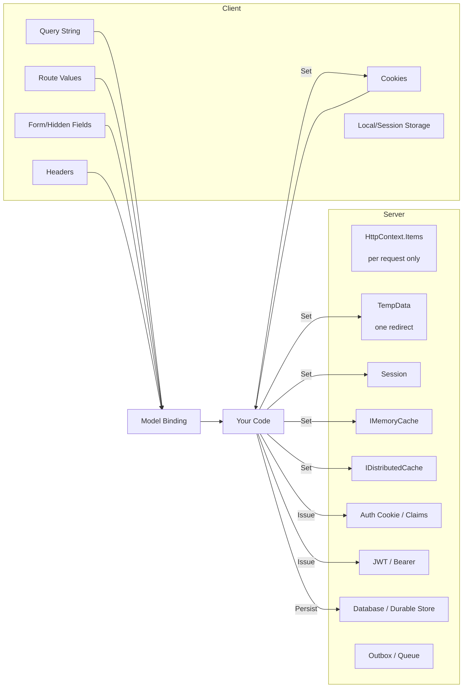
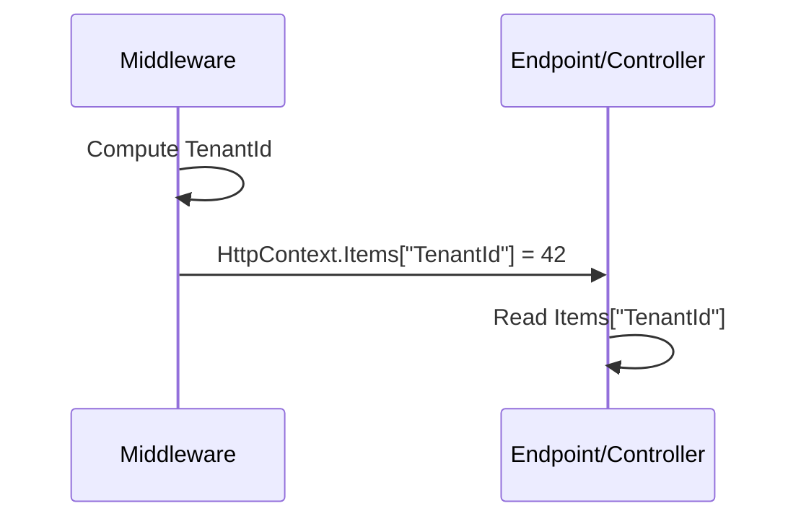
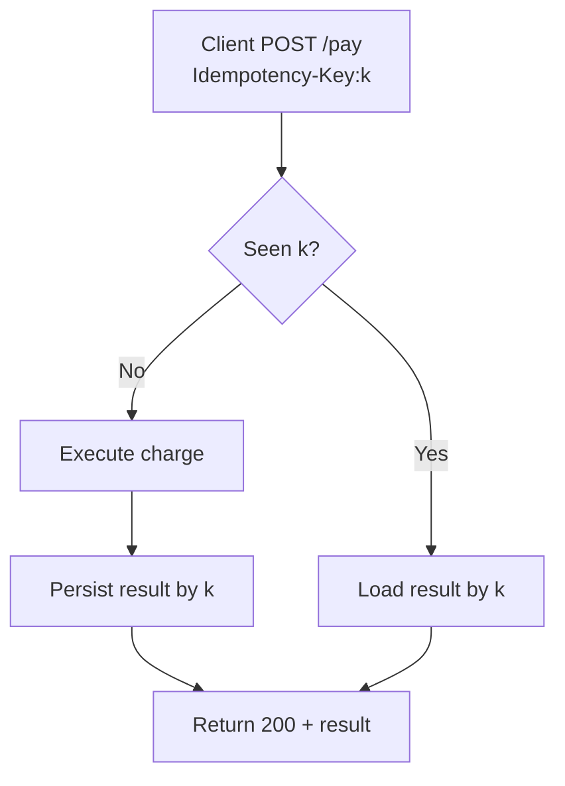
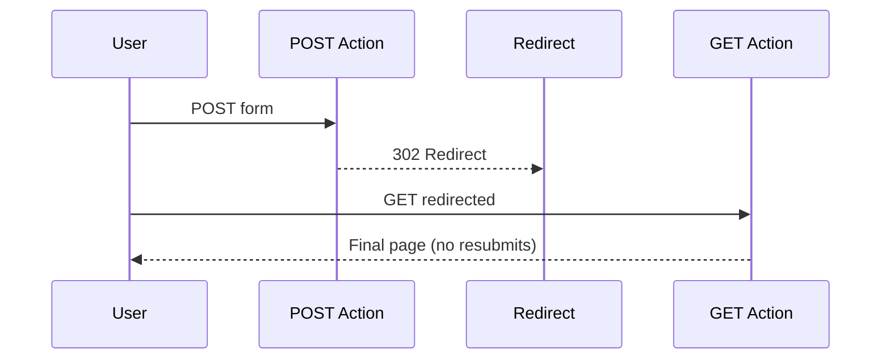
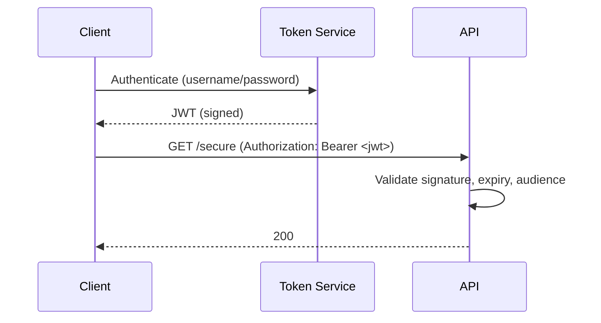
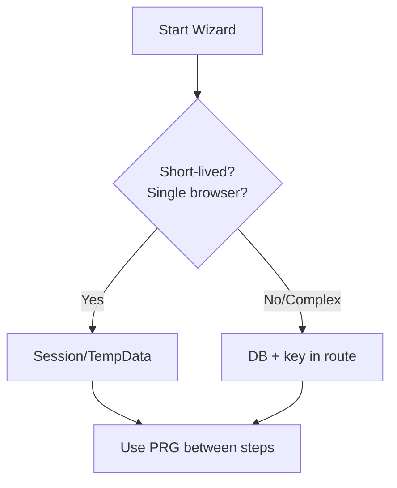
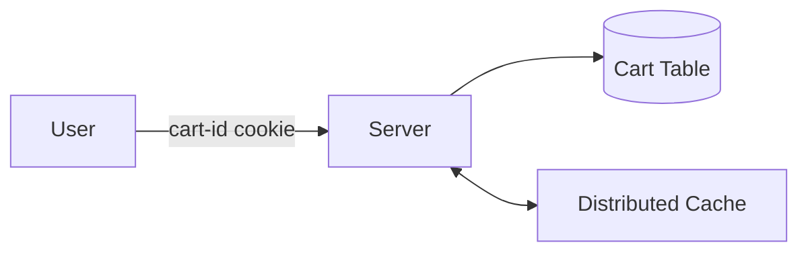

# Keeping State Between Requests in ASP.NET Core: A Practical, No‑Nonsense Guide (MVC, Razor Pages, Minimal APIs)

<!--category-- ASP.NET, ASP.NET Core, State, Web Development, AI-Article -->
<datetime class="hidden">2025-11-09T12:33</datetime>

## Introduction

HTTP is famously stateless. Your app… is not. Users sign in, add items to baskets, hop between pages, return tomorrow, and expect you to remember. In ASP.NET Core (MVC, Razor Pages, Minimal APIs), there are a lot of ways to preserve and transfer state between requests. Some are per-request only. Some last for a session. Some live in the client. Some are distributed and survive server restarts. Each choice has trade-offs across security, performance, scale, and developer ergonomics.

This post catalogs the options, shows concrete, copy‑pasteable examples in all three stacks, and gives you decision guidance so you can pick the right tool for the job.

> NOTE: This is part of my experiments with AI (assisted drafting) + my own editing. Same voice, same pragmatism; just faster fingers.

[TOC]

## The Landscape at a Glance



- Client-carried: query, route, headers, forms, cookies, JWT. Scales horizontally but is visible to the client (must be validated/signed/encrypted where appropriate).
- Server-carried: TempData, Session, caches, DB. Requires affinity or distribution strategy.
- Per-request: HttpContext.Items — useful for passing data internally during a single request.

## Golden Rules (before we dive into APIs)

1. Prefer “stateless server” patterns when you need to scale horizontally (push state to client tokens, durable stores, or distributed caches).
2. Never trust client-controlled state. Validate, sign, and/or encrypt.
3. Keep large data out of cookies and headers; they bloat every request.
4. Use TempData only for Post-Redirect-Get (PRG) one-shots like flash messages.
5. Use Session only when you must maintain server-side conversational state and you’ve planned distribution.
6. Claims are for identity and coarse-grained authorization, not general app state.
7. Cache is not a source of truth. Back it with a durable store if the data matters.

---

## Per-Request State: HttpContext.Items

- Scope: current request only (teardown at end of pipeline)
- Use for: passing computed values between middleware and endpoints/controllers
- Scale: no impact
- Security: server-only



Middleware example (all stacks):

```csharp
app.Use(async (context, next) =>
{
    var tenantId = context.Request.Headers["X-TenantId"].FirstOrDefault() ?? "public";
    context.Items["TenantId"] = tenantId;
    await next(context);
});
```

- Minimal API endpoint:
```csharp
app.MapGet("/whoami", (HttpContext ctx) => new { Tenant = ctx.Items["TenantId"] });
```
- MVC Controller:
```csharp
public IActionResult WhoAmI() => Json(new { Tenant = HttpContext.Items["TenantId"] });
```
- Razor Page handler:
```csharp
public IActionResult OnGet() => new JsonResult(new { Tenant = HttpContext.Items["TenantId"] });
```

---

## Transient Client-Carried State: Route Values and Query String

- Scope: current request; the client carries it explicitly.
- Use for: navigation context, filtering, pagination, resource identity
- Security: must validate/authorize; do not embed secrets

Examples

- Minimal APIs:
```csharp
app.MapGet("/orders/{id:int}", (int id, int? page) => Results.Ok(new { id, page }));
// GET /orders/5?page=2
```

- MVC:
```csharp
[HttpGet("/orders/{id:int}")]
public IActionResult Details(int id, int? page)
  => View(new { id, page });
```

- Razor Pages (Orders/Details.cshtml.cs):
```csharp
public IActionResult OnGet(int id, int? page)
  => Page();
```

Generating links that preserve state:
```csharp
// Razor Pages
<a asp-page="/Orders/Details" asp-route-id="@Model.Id" asp-route-page="@Model.Page">Next</a>

// MVC
@Html.ActionLink("Next", "Details", "Orders", new { id = Model.Id, page = Model.Page }, null)
```

---

## Headers: Correlation IDs, Idempotency Keys, Feature Flags

- Scope: current request, optionally echoed in responses
- Use for: tracing, retry-safety, A/B flags
- Security: treat as untrusted input, validate/whitelist

```csharp
app.Use(async (ctx, next) =>
{
    var correlationId = ctx.Request.Headers["X-Correlation-Id"].FirstOrDefault()
                      ?? Guid.NewGuid().ToString("n");
    ctx.Response.Headers["X-Correlation-Id"] = correlationId;
    await next(ctx);
});
```

Idempotency (pattern):


---

## Forms and Hidden Fields (PRG)

- Scope: next request only (client posts back the values)
- Use for: wizard steps, anti-forgery tokens, keeping small bits of state across PRG
- Security: always validate; combine with antiforgery

PRG pattern in MVC/Razor Pages:


- MVC:
```csharp
[HttpPost]
[ValidateAntiForgeryToken]
public IActionResult Save(SettingsModel model)
{
    // validate & persist
    return RedirectToAction(nameof(Summary), new { tab = model.SelectedTab });
}
```

- Razor Pages:
```csharp
public IActionResult OnPost(SettingsModel model)
{
    return RedirectToPage("/Settings/Summary", new { tab = model.SelectedTab });
}
```

---

## Cookies: Small, Signed, Sometimes Encrypted

- Scope: every request from the browser until expiry
- Use for: preferences, non-sensitive flags, consent; auth cookies (separate section)
- Trade-offs: size limits (~4KB per cookie), performance impact, must comply with consent laws

Minimal API example:
```csharp
app.MapPost("/prefs/theme/{value}", (HttpContext ctx, string value) =>
{
    ctx.Response.Cookies.Append("theme", value, new CookieOptions
    {
        HttpOnly = false,
        Secure = true,
        SameSite = SameSiteMode.Lax,
        Expires = DateTimeOffset.UtcNow.AddYears(1)
    });
    return Results.Ok();
});

app.MapGet("/prefs/theme", (HttpContext ctx)
  => Results.Text(ctx.Request.Cookies["theme"] ?? "system"));
```

MVC/Razor Pages usage is identical via `HttpContext`.

For integrity/confidentiality, use the ASP.NET Core Data Protection system to protect payloads you put in cookies yourself.

---

## TempData: One-Redirect Message Bus

- Scope: survives one redirect
- Backing store: Cookie (default) or Session
- Use for: flash messages, validation summaries after PRG

Setup (Program.cs):
```csharp
builder.Services.AddControllersWithViews().AddSessionStateTempDataProvider(); // optional
builder.Services.AddSession();
var app = builder.Build();
app.UseSession();
```

In MVC controller:
```csharp
TempData["StatusMessage"] = "Saved!";
return RedirectToAction("Index");
```

In Razor Page handler:
```csharp
TempData["StatusMessage"] = "Saved!";
return RedirectToPage("/Index");
```

In view/page:
```csharp
@if (TempData["StatusMessage"] is string msg) {
  <div class="alert alert-success">@msg</div>
}
```


---

## Session: Server-Side Conversational State

- Scope: browser session (cookie key + server store)
- Use for: multi-step wizards, small cart data, throttling counters
- Trade-offs: requires sticky sessions or distributed backing store; can limit scale

Configure:
```csharp
builder.Services.AddDistributedMemoryCache(); // or AddStackExchangeRedisCache
builder.Services.AddSession(options =>
{
    options.IdleTimeout = TimeSpan.FromMinutes(20);
    options.Cookie.HttpOnly = true;
    options.Cookie.IsEssential = true;
});
var app = builder.Build();
app.UseSession();
```

Using Session (any stack):
```csharp
app.MapPost("/cart/add/{id:int}", (HttpContext ctx, int id) =>
{
    var key = "cart";
    var bytes = ctx.Session.Get(key);
    var list = bytes is null ? new List<int>() : System.Text.Json.JsonSerializer.Deserialize<List<int>>(bytes)!;
    list.Add(id);
    ctx.Session.Set(key, System.Text.Json.JsonSerializer.SerializeToUtf8Bytes(list));
    return Results.Ok(list);
});
```

Session helpers:
```csharp
public static class SessionExtensions
{
    public static void Set<T>(this ISession session, string key, T value)
      => session.SetString(key, System.Text.Json.JsonSerializer.Serialize(value));

    public static T? Get<T>(this ISession session, string key)
      => session.TryGetValue(key, out var data)
         ? System.Text.Json.JsonSerializer.Deserialize<T>(data)
         : default;
}
```

---

## Caching: IMemoryCache and IDistributedCache

- Scope: server process (IMemoryCache) or distributed (IDistributedCache)
- Use for: derived/computed data, lookups, short-lived state
- Trade-offs: cache invalidation, serialization for distributed

IMemoryCache:
```csharp
builder.Services.AddMemoryCache();

app.MapGet("/rates", (IMemoryCache cache) =>
{
    var key = "fx:usd:eur";
    if (!cache.TryGetValue(key, out decimal rate))
    {
        rate = 0.92m; // pretend fetch
        cache.Set(key, rate, TimeSpan.FromMinutes(5));
    }
    return Results.Ok(rate);
});
```

IDistributedCache (e.g., Redis):
```csharp
builder.Services.AddStackExchangeRedisCache(o => o.Configuration = "localhost:6379");

app.MapGet("/feature/{name}", async (IDistributedCache cache, string name) =>
{
    var val = await cache.GetStringAsync($"feat:{name}");
    return Results.Text(val ?? "off");
});
```

Cache-as-state anti-pattern warning: if it must be durable or authoritative, store it in a database and optionally cache it.

### Choosing between IMemoryCache and IDistributedCache
- IMemoryCache:
  - Blazing fast, in-process, objects stay as objects (no serialization).
  - Eviction by memory pressure, size limit, absolute/sliding expiration, and priority.
  - Not shared across nodes; cleared on app recycle/deploy.
  - Great for per-node hotsets, computed lookups, short TTLs.
- IDistributedCache (Redis/SQL/etc.):
  - Shared across a farm; survives app restarts; requires serialization (strings/bytes).
  - Slightly higher latency; throughput depends on network and backend.
  - Supports absolute/sliding expiration (provider-dependent; Redis provider updates TTL on access for sliding).
  - Ideal for cross-node consistency, large fan-out reads, feature flags, and session.

### Common cache strategies
- Cache-aside (most common):
  1) Try cache; 2) if miss, load from source; 3) write to cache; 4) return.
  - Pros: simple; source of truth remains the database.
  - Cons: first request after expiry is slow; possible stampedes.
- Read-through (via a library/provider): cache handles loading on misses.
- Write-through: writes go to cache and backing store synchronously.
- Write-behind: write to cache, flush to store asynchronously (risk: loss/inconsistency).
- Refresh-ahead: refresh hot keys before they expire to avoid cold misses.

### Expiration, eviction, and sizing
- Absolute expiration: always expires after a fixed duration (good for external data freshness).
- Sliding expiration: extends TTL on access (good for sessions/user-specific data).
- Size-based eviction (IMemoryCache): set entry.Size and configure SizeLimit to bound memory.
- Priority (IMemoryCache): CacheItemPriority.High/Normal/Low/NeverRemove affects eviction under pressure.
- Jitter: add small random offsets to TTLs to avoid synchronized expiry (stampedes).

### Preventing cache stampedes (thundering herd)
- Use GetOrCreate/GetOrCreateAsync (IMemoryCache) to ensure single-thread population per node.
- Distributed: use a short-lived lock key (SET NX EX) or library support; add TTL jitter; consider background refresh.
- Serve stale-while-revalidate: keep a secondary key with stale value and short extension while new value is computed.

### Key design and namespacing
- Prefer lowercase, colon-delimited keys: app:entity:123 or tenant:us:users:42.
- Include version segment to invalidate whole classes of keys without deletes: v2:products:123.
- Tenant-aware: prefix keys with tenant or organization id to avoid collisions and ease purges.
- Keep keys small but descriptive; avoid user-controlled raw input without normalization.

### Expiring sets of keys (tags/groups)
When you need to invalidate many related entries:
- Versioned prefixes (soft invalidation): bump a global version in a small key and compose keys with it.
  ```csharp
  // version key: "v:products"; keys like $"{version}:product:{id}"
  var version = await cache.GetStringAsync("v:products") ?? "1";
  var key = $"{version}:product:{id}";
  ```
  To invalidate all products: increment v:products (clients will naturally miss old prefixed keys).
- Tag set per group (Redis): keep a Set of keys per tag; on invalidation, fetch members and delete.
  ```csharp
  // using StackExchange.Redis directly for sets + efficient deletes
  var mux = await ConnectionMultiplexer.ConnectAsync("localhost:6379");
  var db = mux.GetDatabase();
  var tag = "tag:category:42";
  var key = $"prod:{prodId}";
  await db.StringSetAsync(key, serialized, expiry: TimeSpan.FromMinutes(30));
  await db.SetAddAsync(tag, key); // remember membership

  // later, invalidate the whole tag
  var members = await db.SetMembersAsync(tag);
  if (members.Length > 0)
  {
      var keys = Array.ConvertAll(members, m => (RedisKey)m);
      await db.KeyDeleteAsync(keys);
  }
  await db.KeyDeleteAsync(tag);
  ```
- Pub/Sub invalidation: publish an "invalidate:key" message; each node removes the key from its local IMemoryCache.
- Scan with patterns: SCAN/KEYS should be avoided in prod hot paths; okay for admin tooling on small keyspaces.

### Practical helpers
- IMemoryCache get-or-set with options:
  ```csharp
  T GetOrAdd<T>(IMemoryCache cache, string key, Func<ICacheEntry, T> factory)
    => cache.GetOrCreate(key, e =>
    {
        e.AbsoluteExpirationRelativeToNow = TimeSpan.FromMinutes(10);
        e.SlidingExpiration = TimeSpan.FromMinutes(2);
        e.Priority = CacheItemPriority.Normal;
        e.Size = 1;
        return factory(e);
    });
  ```
- IDistributedCache with JSON and expiration:
  ```csharp
  static async Task<T?> GetOrSetJsonAsync<T>(IDistributedCache cache, string key, Func<Task<T>> factory, TimeSpan ttl)
  {
      var json = await cache.GetStringAsync(key);
      if (json is not null)
          return System.Text.Json.JsonSerializer.Deserialize<T>(json);

      var value = await factory();
      var opts = new DistributedCacheEntryOptions { AbsoluteExpirationRelativeToNow = ttl };
      await cache.SetStringAsync(key,
          System.Text.Json.JsonSerializer.Serialize(value),
          opts);
      return value;
  }
  ```

### Monitoring and visibility
- Track hit/miss rates and average load time; expose metrics (Prometheus counters) per key group.
- Add logging around cache population and eviction callbacks for IMemoryCache.
- For Redis, watch keyspace hits/misses, latency, and memory fragmentation; set maxmemory policies as appropriate.

---

## Authentication Cookies and Claims

- Scope: across requests until expiry/sign-out
- Use for: identity, coarse roles/permissions, a small amount of profile data
- Trade-offs: cookie size; don’t overstuff. Claims should be stable.

Setup cookie auth:
```csharp
builder.Services.AddAuthentication("Cookies")
    .AddCookie("Cookies", o =>
    {
        o.LoginPath = "/login";
        o.Cookie.SecurePolicy = CookieSecurePolicy.Always;
        o.SlidingExpiration = true;
    });
builder.Services.AddAuthorization();
var app = builder.Build();
app.UseAuthentication();
app.UseAuthorization();
```

Sign-in with claims (MVC/minimal):
```csharp
app.MapPost("/login", async (HttpContext ctx) =>
{
    var claims = new[]
    {
        new Claim(ClaimTypes.NameIdentifier, "123"),
        new Claim(ClaimTypes.Name, "Alice"),
        new Claim(ClaimTypes.Role, "Admin")
    };
    var identity = new ClaimsIdentity(claims, "Cookies");
    await ctx.SignInAsync("Cookies", new ClaimsPrincipal(identity));
    return Results.Redirect("/");
});
```

Read claims (any stack):
```csharp
[Authorize]
app.MapGet("/me", (ClaimsPrincipal user)
  => Results.Ok(new { user.Identity!.Name, Roles = user.Claims.Where(c => c.Type == ClaimTypes.Role).Select(c => c.Value) }));
```

---

## JWT / Bearer Tokens

- Scope: client carries token; stateless server
- Use for: SPAs/mobile/APIs, cross-domain, microservices
- Trade-offs: token size; rotation/refresh; store minimal claims, use introspection if needed

```csharp
builder.Services.AddAuthentication("Bearer")
   .AddJwtBearer("Bearer", o =>
   {
       o.Authority = "https://demo.identityserver.io"; // example
       o.Audience = "api";
       o.RequireHttpsMetadata = true;
   });
```

Use:
```csharp
[Authorize(AuthenticationSchemes = "Bearer")]
app.MapGet("/secure", () => "ok");
```

Mermaid overview:


---

## Durable State: Database and Friends

- Scope: forever (until you delete it)
- Use for: anything that must not be lost: carts, orders, profiles, long-running workflows
- Patterns: standard CRUD with EF Core; CQRS; event sourcing; outbox pattern for reliability

EF Core sketch:
```csharp
builder.Services.AddDbContext<AppDb>(o => o.UseSqlServer(cs));

app.MapPost("/cart/items", async (AppDb db, AddItem cmd) =>
{
    var cart = await db.Carts.FindAsync(cmd.CartId) ?? new Cart(cmd.CartId);
    cart.Add(cmd.ProductId, cmd.Qty);
    await db.SaveChangesAsync();
    return Results.Created($"/cart/{cart.Id}", cart);
});
```

---

## Response Caching, ETags, and Conditional Requests

- Not strictly “state carrying,” but reduces repeated work by letting the client/proxies reuse prior responses. Often paired with query/route state.

```csharp
builder.Services.AddResponseCaching();
var app = builder.Build();
app.UseResponseCaching();

app.MapGet("/products", (HttpContext ctx) =>
{
    ctx.Response.GetTypedHeaders().CacheControl = new CacheControlHeaderValue { Public = true, MaxAge = TimeSpan.FromSeconds(30) };
    return Results.Ok(new[] { new { Id = 1, Name = "Widget" } });
}).CacheOutput();
```

ETag example:
```csharp
app.MapGet("/resource", (HttpContext ctx) =>
{
    var version = "W/\"abc123\""; // compute based on data hash
    ctx.Response.Headers.ETag = version;
    if (ctx.Request.Headers.IfNoneMatch == version)
        return Results.StatusCode(StatusCodes.Status304NotModified);
    return Results.Text("payload");
});
```

---

## Pattern: Wizards and Multi-Step Flows

Which state holder to use?



- Small, single-session: Session or TempData between steps.
- Cross-device/long-running: persist to DB, carry a key in the URL.

Example (DB + route key):
```csharp
app.MapPost("/wizard/{id}", async (AppDb db, Guid id, StepInput input) =>
{
    var flow = await db.Flows.FindAsync(id) ?? new Flow(id);
    flow.Apply(input);
    await db.SaveChangesAsync();
    return Results.Redirect($"/wizard/{id}/next");
});
```

---

## Pattern: Flash Messages with TempData

- Set in POST; read once after redirect.

```csharp
TempData["Flash"] = "Profile saved";
return RedirectToAction("Index");
```

Razor view:
```csharp
@if (TempData["Flash"] is string flash) {
  <div class="alert alert-info">@flash</div>
}
```

---

## Pattern: Shopping Cart

- Small carts: Session (if your scale is modest and you have sticky/distributed session).
- Larger carts/multi-device: DB + cart-id in cookie or URL. Cache for speed.



---

## Security, Privacy, and Compliance Checklist

- Validate all client-provided state: query, headers, forms, cookies, JWT claims.
- Protect sensitive client-stored state: use Data Protection for cookies you issue; never store secrets in query strings.
- Set cookie flags: `Secure`, `HttpOnly`, `SameSite`, `IsEssential` (if required by consent/functional need).
- Regenerate authentication cookies on privilege changes; keep claims minimal.
- Encrypt at rest for server-side stores as needed; ensure key rotation (Data Protection keys, JWT signing keys).
- GDPR/CCPA: provide user data export/deletion paths; minimize retention.

---

## Decision Matrix (Cheat Sheet)

```mermaid
classDiagram
  class Items {
    +Per-request only
    +Great for middleware->endpoint handoff
  }
  class QueryRoute {
    +Explicit, linkable
    -User-controlled
  }
  class Headers {
    +Tracing, idempotency
    -Noisy, untrusted
  }
  class Cookies {
    +Persist small prefs
    -Size, perf, consent
  }
  class TempData {
    +One-redirect messages
    -Ephemeral
  }
  class Session {
    +Conversational state
    -Scaling complexity
  }
  class MemoryCache {
    +Fast, in-proc
    -Not shared across instances
  }
  class DistributedCache {
    +Shared across servers
    -Serialization, ops
  }
  class AuthCookieClaims {
    +Identity, roles
    -Don’t overstuff
  }
  class JWT {
    +Stateless, cross-domain
    -Revocation/rotation
  }
  class DB {
    +Durable, authoritative
    -Latency, complexity
  }
```



Quick picks:
- Need one-redirect flash? TempData.
- Need wizard across multiple requests in one session? Session (or DB + key if long-running/multi-device).
- Need scalability and stateless APIs? JWT for identity, DB/DistributedCache for state.
- Need to pass data inside the pipeline only? HttpContext.Items.
- Need cache for computed lookups? IMemoryCache locally; IDistributedCache across a farm.

---

## MVC vs Razor Pages vs Minimal APIs: Same Foundations, Different Shapes

All three stacks sit on the same primitives (HttpContext, model binding, auth, data protection). The examples above show that the APIs differ mostly in ergonomics:

- Minimal APIs: parameter binding from route/query/body/claims; return `Results.*`.
- MVC: attributes, filters, model binding into action parameters/view models.
- Razor Pages: page handlers with bound properties and tag helpers for generating links/forms.

They all share the same state mechanisms discussed here.

---

## Pitfalls and Anti-Patterns

- Storing large or sensitive data in cookies or TempData.
- Depending on in-memory cache for correctness (it’s a cache, not truth).
- Building authorization based on client-sent route/query flags without server checks.
- Over-stuffing auth cookies or JWTs with volatile claims.
- Session without a distribution strategy (works locally, breaks at scale).

---

## Wrap-Up

State in web apps isn’t one size fits all. Choose the lightest option that meets your needs, prefer stateless patterns when you can, and be explicit about security and lifecycle.

If you want to go deeper on how these pieces flow through the pipeline, see my series starting with [Part 1: Overview and Foundation](/blog/aspnet-pipeline-part1-overview) and especially the middleware and routing parts.

Happy building.


---

## Appendix: More Copy‑Pasteable Examples (Refinements)

These examples deepen the earlier sections with production‑grade details you can paste into net9 minimal templates, MVC, or Razor Pages.

### Cookies: Protect values with Data Protection

```csharp
using Microsoft.AspNetCore.DataProtection;

var builder = WebApplication.CreateBuilder(args);
builder.Services.AddDataProtection();
var app = builder.Build();

app.MapPost("/prefs/secure/{value}", (HttpContext ctx, string value, IDataProtectionProvider dp) =>
{
    var protector = dp.CreateProtector("prefs.theme");
    var protectedValue = protector.Protect(value);
    ctx.Response.Cookies.Append("pref.theme.p", protectedValue, new CookieOptions
    {
        HttpOnly = true,
        Secure = true,
        SameSite = SameSiteMode.Lax,
        Expires = DateTimeOffset.UtcNow.AddYears(1)
    });
    return Results.Ok();
});

app.MapGet("/prefs/secure", (HttpContext ctx, IDataProtectionProvider dp) =>
{
    if (ctx.Request.Cookies.TryGetValue("pref.theme.p", out var v))
    {
        var protector = dp.CreateProtector("prefs.theme");
        return Results.Text(protector.Unprotect(v));
    }
    return Results.NotFound();
});
```

Tip: In multi‑node deployments, persist Data Protection keys (e.g., to a shared file system, Redis, or Azure Key Vault) so cookies can be read across instances.

### Antiforgery in MVC, Razor Pages, and Minimal APIs

```csharp
var builder = WebApplication.CreateBuilder(args);
builder.Services.AddControllersWithViews();
builder.Services.AddRazorPages();
builder.Services.AddAntiforgery(o => o.HeaderName = "X-CSRF-TOKEN");
var app = builder.Build();

app.MapGet("/antiforgery/token", (IAntiforgery af, HttpContext ctx) =>
{
    var tokens = af.GetAndStoreTokens(ctx);
    return Results.Json(new { token = tokens.RequestToken });
});

app.MapPost("/submit", (HttpContext ctx) => Results.Ok("posted"))
   .AddEndpointFilter(async (efiContext, next) =>
   {
       var af = efiContext.HttpContext.RequestServices.GetRequiredService<IAntiforgery>();
       await af.ValidateRequestAsync(efiContext.HttpContext);
       return await next(efiContext);
   });

app.MapControllers();
app.MapRazorPages();
```

- MVC: decorate actions with `[ValidateAntiForgeryToken]` and use `@Html.AntiForgeryToken()` in forms.
- Razor Pages: enabled by default on form posts; use `asp-antiforgery="true"` if needed.
- Minimal: validate via `IAntiforgery` as shown.

### Session with Redis and sliding vs absolute expiration

```csharp
builder.Services.AddStackExchangeRedisCache(o => o.Configuration = "localhost:6379");
builder.Services.AddSession(o =>
{
    o.IdleTimeout = TimeSpan.FromMinutes(20); // sliding
    o.IOTimeout = TimeSpan.FromSeconds(2);
    o.Cookie.HttpOnly = true;
    o.Cookie.IsEssential = true;
});
var app = builder.Build();
app.UseSession();
```

Store small, compressible data only. Persist real carts/orders to a DB.

### IMemoryCache with entry options and eviction callback

```csharp
builder.Services.AddMemoryCache();

app.MapGet("/fx/{pair}", (IMemoryCache cache, string pair) =>
{
    var key = $"fx:{pair.ToLowerInvariant()}";
    return Results.Ok(cache.GetOrCreate(key, entry =>
    {
        entry.AbsoluteExpirationRelativeToNow = TimeSpan.FromMinutes(10);
        entry.SlidingExpiration = TimeSpan.FromMinutes(2);
        entry.Size = 1; // enable size-based eviction if configured
        entry.RegisterPostEvictionCallback((k, v, reason, state) =>
        {
            Console.WriteLine($"Evicted {k} because {reason}");
        });
        return 0.92m; // fetch from external service in real life
    }));
});
```

### IDistributedCache get‑or‑set with jitter to avoid stampedes

```csharp
builder.Services.AddStackExchangeRedisCache(o => o.Configuration = "localhost:6379");

app.MapGet("/feature/{name}", async (IDistributedCache cache, string name) =>
{
    var key = $"feat:{name}";
    var cached = await cache.GetStringAsync(key);
    if (cached is not null) return Results.Text(cached);

    // Lock key to prevent thundering herd (very simple approach)
    var lockKey = key + ":lock";
    var gotLock = await cache.SetStringAsync(lockKey, "1", new DistributedCacheEntryOptions
    {
        AbsoluteExpirationRelativeToNow = TimeSpan.FromSeconds(5)
    });

    try
    {
        cached = await cache.GetStringAsync(key);
        if (cached is null)
        {
            var computed = "on"; // expensive work
            var rnd = Random.Shared.Next(0, 15); // jitter
            await cache.SetStringAsync(key, computed, new DistributedCacheEntryOptions
            {
                AbsoluteExpirationRelativeToNow = TimeSpan.FromMinutes(5).Add(TimeSpan.FromSeconds(rnd))
            });
            cached = computed;
        }
    }
    finally
    {
        await cache.RemoveAsync(lockKey);
    }

    return Results.Text(cached);
});
```

For robust locking, prefer Redis primitives (SET NX EX) via StackExchange.Redis.

### Issue and validate JWTs locally (demo)

```csharp
using System.IdentityModel.Tokens.Jwt;
using Microsoft.IdentityModel.Tokens;
using System.Security.Claims;

var key = new SymmetricSecurityKey(System.Text.Encoding.UTF8.GetBytes("super-secret-key-please-rotate"));
var creds = new SigningCredentials(key, SecurityAlgorithms.HmacSha256);

builder.Services.AddAuthentication("Bearer")
    .AddJwtBearer("Bearer", o =>
    {
        o.TokenValidationParameters = new TokenValidationParameters
        {
            ValidateIssuer = false,
            ValidateAudience = false,
            IssuerSigningKey = key,
            ValidateIssuerSigningKey = true,
            ValidateLifetime = true
        };
    });
var app = builder.Build();
app.UseAuthentication();
app.UseAuthorization();

app.MapPost("/token", () =>
{
    var claims = new[] { new Claim(ClaimTypes.Name, "alice") };
    var jwt = new JwtSecurityToken(claims: claims, expires: DateTime.UtcNow.AddMinutes(30), signingCredentials: creds);
    var token = new JwtSecurityTokenHandler().WriteToken(jwt);
    return Results.Json(new { access_token = token });
});

app.MapGet("/who", [Microsoft.AspNetCore.Authorization.Authorize] () => "ok");
```

### Conditional updates with ETags (If‑Match)

```csharp
record Todo(int Id, string Title, string Version);
var store = new Dictionary<int, Todo> { [1] = new(1, "Ship", "v1") };

app.MapGet("/todo/{id:int}", (int id, HttpContext ctx) =>
{
    if (!store.TryGetValue(id, out var t)) return Results.NotFound();
    ctx.Response.Headers.ETag = t.Version;
    return Results.Json(t);
});

app.MapPut("/todo/{id:int}", (int id, HttpContext ctx, Todo input) =>
{
    if (!store.TryGetValue(id, out var current)) return Results.NotFound();
    var ifMatch = ctx.Request.Headers["If-Match"].ToString();
    if (string.IsNullOrEmpty(ifMatch) || ifMatch != current.Version)
        return Results.StatusCode(StatusCodes.Status412PreconditionFailed);

    var next = current with { Title = input.Title, Version = $"v{DateTime.UtcNow.Ticks}" };
    store[id] = next;
    ctx.Response.Headers.ETag = next.Version;
    return Results.Ok(next);
});
```

### TempData: complex objects via JSON

```csharp
public static class TempDataJsonExtensions
{
    public static void Put<T>(this ITempDataDictionary tempData, string key, T value)
        => tempData[key] = System.Text.Json.JsonSerializer.Serialize(value);

    public static T? Get<T>(this ITempDataDictionary tempData, string key)
        => tempData.TryGetValue(key, out var o) && o is string s
           ? System.Text.Json.JsonSerializer.Deserialize<T>(s)
           : default;
}

// Usage in MVC action
TempData.Put("WizardState", new { Step = 2, Name = "Alice" });
var state = TempData.Get<dynamic>("WizardState");
```

### EF Core concurrency token

```csharp
public class Product
{
    public int Id { get; set; }
    public string Name { get; set; } = string.Empty;
    [Timestamp] public byte[] RowVersion { get; set; } = default!;
}

// On update
try
{
    await db.SaveChangesAsync();
}
catch (DbUpdateConcurrencyException)
{
    return Results.StatusCode(StatusCodes.Status412PreconditionFailed);
}
```

### Refreshing claims by re‑issuing the auth cookie

```csharp
app.MapPost("/promote", async (HttpContext ctx) =>
{
    var u = ctx.User;
    var claims = u.Claims.ToList();
    claims.Add(new Claim(ClaimTypes.Role, "Editor"));
    var id = new ClaimsIdentity(claims, "Cookies");
    await ctx.SignInAsync("Cookies", new ClaimsPrincipal(id));
    return Results.Ok();
});
```

That should cover the gaps: stronger security defaults, multi‑node readiness, and real‑world patterns for caches, tokens, and conditional requests.

---

## Deep Dive: HttpContext.Items (Practical Patterns and Helpers)

HttpContext.Items is a per-request bag (IDictionary<object, object?>) that lives only for the lifetime of a single request. It’s perfect for passing computed values from middleware/filters to your endpoints, controllers, and Razor Pages handlers without touching global state or long‑lived stores.

- Lifecycle: created at request start; discarded when the response completes.
- Scope: current request only — never crosses redirects or background work.
- Performance: O(1) lookups; ideal for per-request caching.
- Safety: server-side only; not visible to the client.

### Why Items instead of…
- Session/TempData: Those cross requests and introduce distribution concerns. Items is ephemeral and scale‑friendly.
- DI Scoped services: Use these for behavior and shared dependencies. Items is better for ad-hoc, computed values (tenant, user locale, feature flags) and per-request caches.
- HttpContext.Features: For framework/transport-level features (IEndpointFeature, IHttpUpgradeFeature). Items is for app-level data.

### Avoid key collisions: strongly-typed keys
Because Items uses object keys, prefer private static object keys or a dedicated key type to avoid name collisions.

```csharp
public static class ItemKeys
{
    public static readonly object TenantId = new();
    public static readonly object UserLocale = new();
    public static readonly object PerRequestCache = new();
}
```

Or create a typed wrapper with extensions:

```csharp
public static class HttpContextItemsExtensions
{
    public static void Set<T>(this HttpContext ctx, object key, T value)
        => ctx.Items[key] = value!;

    public static T? Get<T>(this HttpContext ctx, object key)
        => ctx.Items.TryGetValue(key, out var v) ? (T?)v : default;

    public static T GetOrCreate<T>(this HttpContext ctx, object key, Func<T> factory)
    {
        if (ctx.Items.TryGetValue(key, out var existing) && existing is T typed)
            return typed;
        var created = factory();
        ctx.Items[key] = created!;
        return created;
    }
}
```

### Pattern: Compute in middleware, consume in endpoints/controllers/pages

```csharp
// Program.cs
app.Use(async (ctx, next) =>
{
    var tenant = ctx.Request.Headers["X-TenantId"].FirstOrDefault() ?? "public";
    ctx.Set(ItemKeys.TenantId, tenant); // using extension above

    // Per-request cache holder (optional)
    ctx.Set(ItemKeys.PerRequestCache, new Dictionary<string, object?>());

    await next(ctx);
});

// Minimal API
app.MapGet("/whoami", (HttpContext ctx) => new
{
    Tenant = ctx.Get<string>(ItemKeys.TenantId),
});

// MVC Controller
public IActionResult WhoAmI()
    => Json(new { Tenant = HttpContext.Get<string>(ItemKeys.TenantId) });

// Razor Page handler
public IActionResult OnGet()
    => new JsonResult(new { Tenant = HttpContext.Get<string>(ItemKeys.TenantId) });
```

### Pattern: Per-request cache to avoid repeated work
Use Items as a tiny cache so repeated reads within the same request don’t re-hit databases/services.

```csharp
public static class PerRequestCacheExtensions
{
    public static async Task<T> GetOrAddAsync<T>(this HttpContext ctx, string key, Func<Task<T>> factory)
    {
        var bag = ctx.Get<Dictionary<string, object?>>(ItemKeys.PerRequestCache)
                  ?? ctx.GetOrCreate(ItemKeys.PerRequestCache, () => new Dictionary<string, object?>());

        if (bag.TryGetValue(key, out var val) && val is T hit)
            return hit;

        var created = await factory();
        bag[key] = created!;
        return created;
    }
}

// Usage in endpoint
app.MapGet("/profile", async (HttpContext ctx, IUserRepo repo) =>
{
    var userId = ctx.User.Identity?.Name ?? "anon";
    var profile = await ctx.GetOrAddAsync($"profile:{userId}", () => repo.LoadAsync(userId));
    return Results.Json(profile);
});
```

Notes:
- Threading: A single request typically executes on one logical path; Items isn’t thread-safe for parallel writes. If you start parallel tasks that share Items, add your own synchronization.
- Size: Keep values small and cheap to compute/serialize. It’s in-memory per request.

### Pattern: Filters that populate Items (MVC/Razor Pages)

```csharp
public class TenantFilter : IAsyncResourceFilter
{
    public async Task OnResourceExecutionAsync(ResourceExecutingContext context, ResourceExecutionDelegate next)
    {
        var tenant = context.HttpContext.Request.Headers["X-TenantId"].FirstOrDefault() ?? "public";
        context.HttpContext.Set(ItemKeys.TenantId, tenant);
        await next();
    }
}

// Register filter globally
services.AddControllersWithViews(o => o.Filters.Add<TenantFilter>());
```

### Pattern: Enrich logs without allocations everywhere
Compute once, then read in logging scopes or middleware.

```csharp
app.Use(async (ctx, next) =>
{
    var correlationId = ctx.Request.Headers["X-Correlation-Id"].FirstOrDefault() ?? Guid.NewGuid().ToString("n");
    ctx.Items["CorrelationId"] = correlationId; // string key acceptable for app-local use

    using (logger.BeginScope(new { CorrelationId = correlationId }))
    {
        await next(ctx);
    }
});
```

### When not to use Items
- Data needed after redirect or across requests (use TempData/Session/DB instead).
- App-wide singletons or cross-request caches (use IMemoryCache/IDistributedCache).
- Values that belong in identity/authorization (use claims/policies).

Quick rule: If it’s computed during this request and read within this request by your own code, Items is ideal.
