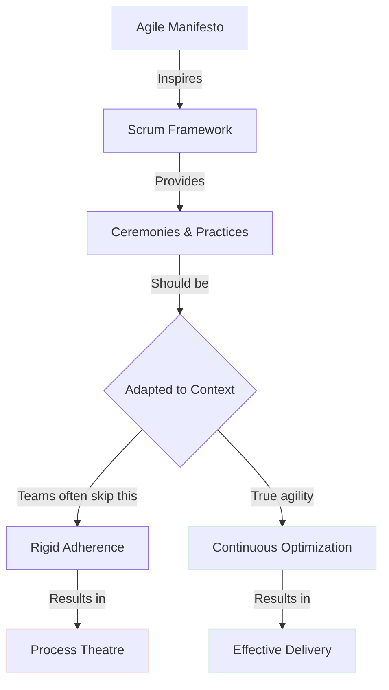
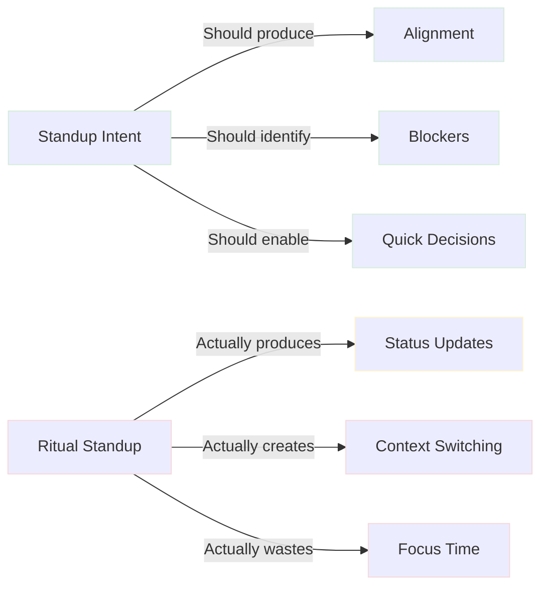
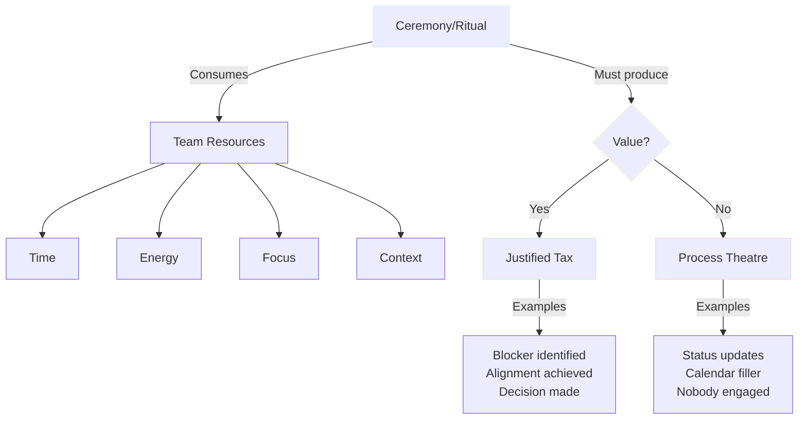
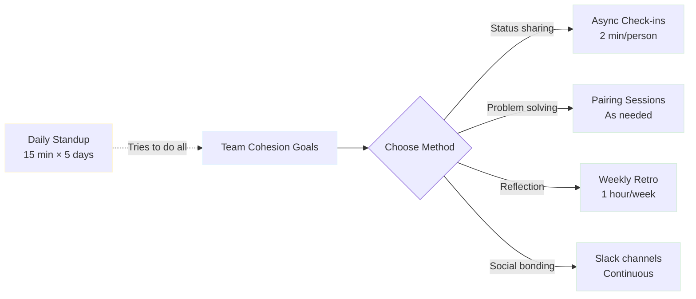
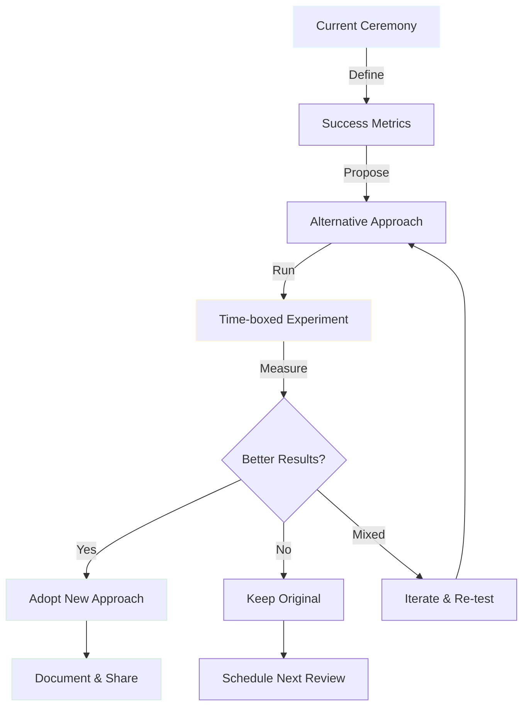
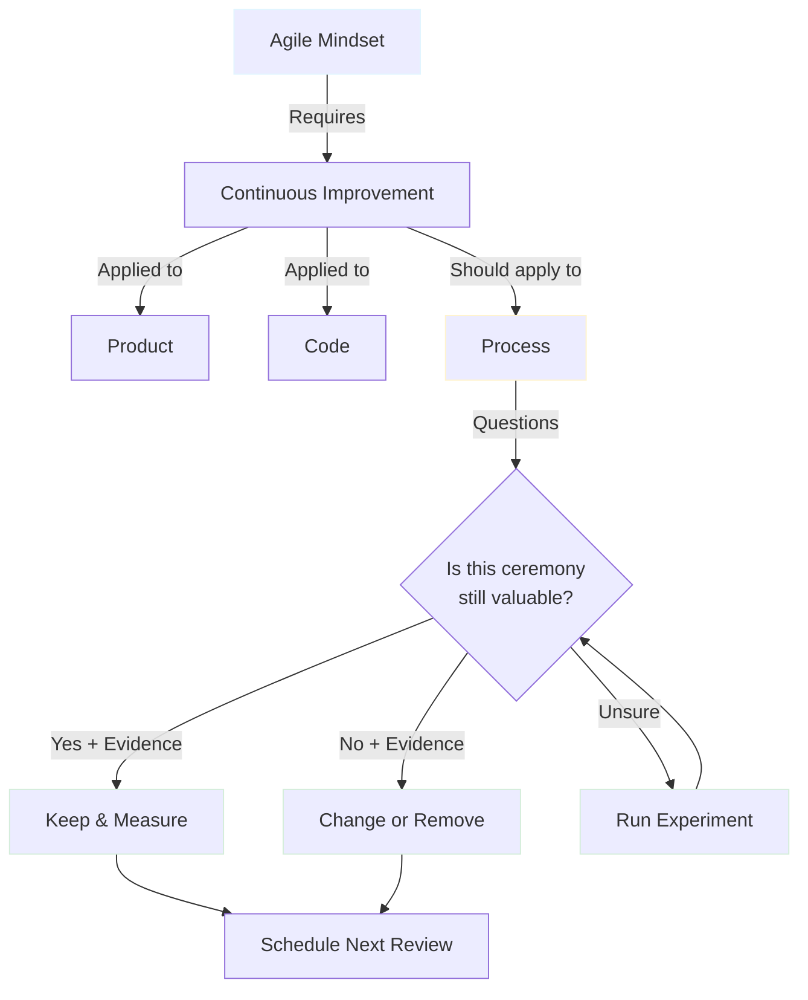

# Daily Standups Are Bullshit (Unless They Earn Their Pay)

> Daily standups aren’t inherently bad - but when they become ritual instead of alignment, they waste time and damage trust. This article explores why ceremony is tax, how to measure its value, and practical async-first alternatives that keep teams aligned without burning energy or time. Agile is adaptation - not adherence.


<!-- category -- Agile,Development,Project Management -->
<datetime class="hidden">2025-11-21T09:30</datetime>

## Introduction

In my almost 30 years of software development, I've attended more daily standups than I care to count. Some were electric - brief moments of alignment that cleared blockers and sent us sprinting forward. Others were performative rituals where tired developers recited "same as yesterday" to a gallery of muted cameras.

The difference? One type of standup *earned its tax*. The other was just ceremony.

[TOC]

## A Confession

I have to confess: I am an inveterate Agilist. I became that way by experiencing the WORST of the PRINCEs, Waterfalls, and heavy-handed process frameworks. I've lived through the "comprehensive documentation before a single line of code" era. I've sat in Change Control Board meetings where deploying a one-line fix required three weeks of approval paperwork.

The simple fact is: **Agile is the BEST way to build good software.** To paraphrase Churchill:

> *"Indeed it has been said that Agile is the worst form of software development process - except for all those other forms that have been tried from time to time."*

But here's the thing: **being pro-Agile doesn't mean being pro-ritual**. In fact, defending unquestioned ceremonies is the *opposite* of agile.

Here's what I've learned: **agile is about adaptation, not adherence**. Yet most teams inherit Scrum rituals wholesale, treating them as sacred rather than pragmatic. Daily standups, sprint planning, retrospectives - these are tools, not commandments. And like any tool, they should be evaluated by whether they *work*.

This article isn't about eliminating standups. It's about questioning whether your ceremonies deliver value proportional to their cost. Because in my experience, **the most agile thing you can do is adapt your agile process**.

## Scrum Is a Template, Not Dogma

Let me be clear: **Scrum is brilliant as a starting point.** It gave teams structure when we were drowning in waterfall. If you're just starting with Agile, Scrum is about as good as they come - it provides clear ceremonies, defined roles, and a proven framework that works for many teams.

But somewhere along the line, we confused *following Scrum* with *being agile*.

Scrum is a **toolkit**. Agile is a **mindset**.

Here's the part nobody talks about: **once Scrum starts to fray, slow you down, or offer less value than it costs - that's when you adapt**. This takes experience, but it's KEY to true agility. The ability to recognize when your process needs evolution is what separates mature agile teams from those cargo-culting ceremonies.

And here's the uncomfortable truth: Scrum Masters only get paid as long as you keep using Scrum. So take their advice, but remember their incentives aren't perfectly aligned with "use whatever works best."

[The Agile Manifesto](https://agilemanifesto.org/) never mandated daily standups. It valued "individuals and interactions over processes and tools" and emphasized **"self-organizing teams"** as a core principle. Yet I've watched teams force 9am standups across three timezones because "that's what Scrum says." That's not agility - that's tradition dressed as methodology.

I've realized many people doing "agile" have never actually read the Agile Manifesto. It's the foundational document - written in 2001 by 17 software developers who were tired of heavyweight, process-driven development. They met for three days and distilled what actually worked into four value statements.

Here it is:

> **The Agile Manifesto**
>
> *We are uncovering better ways of developing software by doing it and helping others do it. Through this work we have come to value:*
>
> - **Individuals and interactions** over processes and tools
> - **Working software** over comprehensive documentation
> - **Customer collaboration** over contract negotiation
> - **Responding to change** over following a plan
>
> *That is, while there is value in the items on the right, we value the items on the left more.*

Notice what's NOT in there: daily standups, sprint planning, story points, retrospectives. Those came from Scrum, which was created to implement these values. But somewhere along the way, we started treating Scrum's implementation as the goal instead of the values themselves.

The Manifesto is about **principles**, not prescriptions. "Individuals and interactions over processes and tools" means if your process (standups) is getting in the way of interactions (actual collaboration), you're doing it backwards.

**Self-organizing teams don't need ceremonies imposed on them. They choose the practices that work.**



In my experience, the teams that ship fastest aren't the ones who follow Scrum by the book. They're the ones who **inspect and adapt their own process** as rigorously as they inspect and adapt their code.

## Standups Often Decay Into Ritual

Let me paint a picture you might recognize:

It's 9:00 AM. You're deep in solving a gnarly concurrency bug. Your IDE is open, debugger attached, mental model fully loaded. Then - ping - the standup meeting starts in 2 minutes.

You context-switch. Join the call. Wait while three people unmute. Then:

- **Alice:** "Same as yesterday, working on the login feature."
- **Bob:** "Finishing up tests, no blockers."
- **Carol:** *(camera off)* "Yeah, still on that database migration."

Ten minutes later, you return to your code. The mental model is gone. You spend another 15 minutes rebuilding context.

**What did that meeting achieve?**

In my experience, failing standups share common symptoms:

### The Ritual Decay Checklist

- [ ] Most updates are variations of "same as yesterday"
- [ ] No decisions are made
- [ ] More than 50% of attendees have cameras off
- [ ] Timezone spread forces late/early attendance
- [ ] People multitask during the meeting
- [ ] Nobody asks follow-up questions
- [ ] The meeting could have been a Slack message

When these symptoms appear, your standup isn't creating alignment. It's creating **synchronized fatigue**.

### The Attendance Roll Problem

Let's be honest: in many workplaces, the 9am standup is an attendance roll. It's a way to verify people are "at their desks" (or at least awake). This isn't agile - it's surveillance theatre.

If you need a daily standup to know whether your developers are working, you have a trust problem, not a process problem. **Treat your developers like professionals.** Judge them by what they deliver, not by whether they showed up to a meeting on time.



## All Ceremony Is Tax

Here's the framework that changed how I think about agile practices:

**Every ritual consumes resources:**
- **Time** - 15 minutes × 5 developers × 5 days = 6.25 hours/week
- **Cognitive energy** - context switching destroys deep work
- **Emotional bandwidth** - "performative presence" is exhausting
- **Focus** - interrupting flow states has compound costs

In democratic societies, we accept taxation *when it funds essential services*. Roads, schools, healthcare - these justify the burden because we get value in return.

Agile ceremonies work the same way.



### The Tax Equation

For any ceremony to justify its existence, this must be true:

**Value Delivered > Resources Consumed**

In my experience, standups fail when teams don't measure both sides of this equation. They inherit the ceremony, run it forever, and never ask: *"Is this still worth it?"*

## Better, Cheaper, Faster Alternatives

Here's what I've seen work across different team contexts:

### Status Updates → Async Check-ins

Instead of synchronous meetings, try:

**Slack/Teams Thread (Daily)**
```
👋 Good morning! Quick updates:
✅ Yesterday: Completed auth refactor (#234)
🎯 Today: Tackling payment integration (#456)
🚧 Blockers: Need staging DB access (@alice)
```

**Time cost:** 2 minutes vs. 15 minutes
**Timezone impact:** Zero
**Searchable history:** Yes

### The Communication Multiplier Effect

Here's a KEY BENEFIT most teams miss: **Slack check-ins become THE place to communicate with anyone interested in progress.** Product managers, stakeholders, designers, other engineering teams - they can all subscribe to the channel and stay informed without forcing developers into yet another meeting.

**Your job is to build your team as a feature delivery machine. Communication is the oil that keeps it running.**

When the CEO asks "what's the team working on?", send them a link. When product needs an update, they're subscribed. When other teams coordinate, they see your progress in real-time. This is communication *amplification*, not *overhead*.

### Making It Truly Async

Here's how to make this work across any timezone:

**The Pattern:**
"Status updates by 9am" (your local time) - and leave **detailed notes for each task in the Slack thread**. Not just "working on auth" but "Auth refactor: finished JWT validation, starting refresh token flow, blocker: need design approval on error states."

The Australia dev leaves their note whenever works best for them - maybe at the end of their day. At 9am UK time (or before if urgent), you read it and action it: "Dave, can you help Joe with the design approval?" Then you let the TEAM arrange how it happens.

**THEY drive the process.** You're not orchestrating every interaction. You're removing blockers and letting professionals coordinate directly.

This is the Agile principle of **self-organizing teams** in action. Not "teams that follow a prescribed process," but teams that organize around the work itself. The information is transparent, the context is shared, and the team figures out how to solve it.

Now you've made your process truly async. The detail in the notes means you don't need synchronous clarification. The team self-organizes around the information.

### GitHub + Slack = Culture + Status

Link GitHub to your Slack channel. Now a status update BECOMES a PR. Code reviews are visible. You celebrate wins with emoji. That's not frivolous - it's culture.

```
🎉 @alice opened PR #234: Add JWT refresh token flow
💪 @bob approved PR #234: "Beautiful error handling!"
🚀 @alice merged PR #234 into main
✅ Build passed: 47 tests, 0 failures
```

Your standup just became your GitHub activity feed. Zero tax, automatic visibility, peer recognition built in.

**Make the most critical place for communication a NICE place to be.** If your team channel is where work happens, make it somewhere people want to be. Celebrate wins. Appreciate good work publicly. Thank people for helping.

**This is engineering culture.** When the main communication channel feels positive, people engage more, ask for help sooner, and share knowledge freely. A toxic or boring channel? People mute it. Your communication machine breaks down.

### When Async Fails (And How to Fix It)

Async-first isn't perfect. Common failure modes:

- **People don't read the channel**: Make it valuable (GitHub notifications, decisions, wins). Boring = tuned out.
- **Blocked for 4 hours unnoticed**: Clear protocol. Tag with 🚧, @mention, escalate after 2 hours. Track "blocker response time" as a metric.
- **Timezone gaps = 8-hour delays**: Identify 2-3 hour overlap window. For global teams, accept handoff delay but document thoroughly.
- **Juniors don't speak up**: Assigned senior explicitly checks in. Make "I'm stuck" safe by celebrating early asks.

**The key: async-first doesn't mean async-only.** When something's stuck, jump on a call. Sync meetings solve problems, not report status.

**The Same Goes for Physical Spaces**

If you're still in an office and have a team room - make it NICE. You WANT your team to hang out in there.

Good chairs. Decent coffee. Whiteboards that actually work. Natural light if possible. A space that doesn't feel like a punishment.

When the team room is pleasant, people naturally gravitate there. Conversations happen. Problems get solved at the whiteboard. Someone overhears a blocker and jumps in to help. That's organic collaboration - the kind that standups try (and fail) to manufacture.

This is what **self-organizing teams** actually look like. Not standing in a circle reporting to a Scrum Master. But professionals who organize around the work because the environment makes it easy.

A depressing room with broken furniture and fluorescent lighting? People work from home or hide at their desks. Your communication machine stays fragmented.

**About Sync Meetings:**
You CAN still book recurring meetings when needed - you don't have to cancel everything. The key is intentionality. A weekly 1-on-1? Keep it. It preserves space on calendars and shows importance. The difference is these become *optional synchronous discussion* rather than *mandatory status reporting*.

Book the recurrence, but make it clear: "If you have nothing to discuss this week, you can skip it."

**Here's my approach as a senior/lead:** I never cancel the 1-on-1. Ever. But I make it clear THEY can. It's there for them. This sends a message: "I've protected this time for you. Use it if you need it. No pressure if you don't."

Some weeks they'll skip it because they're heads-down and flowing. Other weeks they'll use all 30 minutes because something's bothering them or they want to talk through a design.

The recurring meeting creates **space**. Not obligation.

This is especially useful for:
- One-to-ones (preserve the relationship space)
- Architecture discussions (complex, benefit from whiteboarding)
- Stakeholder demos (emotional/political value in live interaction)

The goal isn't zero meetings. It's **meetings that earn their time**.

### Alignment → Accurate Boards

In my experience, teams that keep their kanban boards current don't need standups for visibility.

**Signal-rich board indicators:**
- Story points with error bars (confidence ranges)
- "Stuck" tags with aging indicators
- PR status directly on cards
- Actual vs. estimated time tracking

If your board is trustworthy, **looking at it should answer "what's everyone doing?"**

### Blockers → Issue Tagging + Async Pings

Real blockers need immediate attention, not a next-day standup.

**Better pattern:**
1. Tag issue with `🚧 blocked`
2. Ping relevant person directly
3. If not resolved in 2 hours, escalate to lead
4. Track blocker resolution time as a metric

### Team Cohesion → Weekly Retros + Pairing

The argument I hear most often: *"But standups keep us connected as a team!"*

Fair point. But is a daily status update the best way to build connection?

In my experience, these create *stronger* bonds:
- **Pairing sessions** - actual collaboration
- **Weekly retros** - honest reflection
- **Slack water cooler channels** - async social time
- **Monthly team lunches** - non-work connection



### The Context Matrix

Not all teams should adopt the same ceremonies. Here's my heuristic:

| Team Profile | Standup Value | Better Alternative |
|--------------|---------------|-------------------|
| **Mature, distributed, async-first** | Low | Slack check-ins + accurate boards |
| **Junior-heavy team** | Low | Mentorship model (see below) |
| **Tight deadline, high risk** | Depends | Balance: Will 15 min slow you down? If no blockers, why report when you're in a hurry? Try Slack war room + on-demand huddles |
| **Stable feature team** | Very Low | Low tax async updates; scale up to daily only when building complex multi-person features or critical issues |
| **Open source, global timezones** | Very Low | Async updates + weekly video summary |

> **Aside: The Junior Developer Myth**
>
> Common wisdom: "Juniors need daily standups to learn." Reality: standups often **increase anxiety** for juniors without actually helping them grow.
>
> **YOUR TEAM RAISES YOUR JUNIORS.** Not standups. Mentorship does. Allocate time for seniors to help them. Make it cultural: Leads run Seniors, Seniors run Juniors. Juniors can prep with their senior before updates, but they must have their own voice - a senior never speaks FOR them.
>
> **Professional development happens through mentorship, not status reporting.** Standups don't teach estimation, architecture, or debugging. Pairing does. Code reviews do. 1-on-1s do.

In my experience, the mistake isn't having standups or not having them. It's **applying the same ceremony to every context**.

## EVERYTHING Adapts to What Works

Here's the truth: **EVERYTHING adapts to what works best for your team.**

This is what the Agile principle of **self-organizing teams** actually means. Not "teams that follow Scrum perfectly," but **teams that continuously adapt their process to serve the work**.

Some teams LIVE FOR daily standups - the energy, the connection, the rapid-fire problem solving. Some will protest even at a Slack message, preferring deep focus with minimal interruption.

A truly self-organizing team experiments, measures, and chooses. You adapt to achieve the result.

### Who Decides to Change the Process?

When I say "the team decides," who actually makes that call? Usually **leads or senior developers** propose changes. That's fine. Leadership creates conditions for improvement.

**The pattern:**
1. Anyone proposes an experiment - "try async check-ins for 2 weeks?"
2. Team discusses trade-offs - concerns, metrics, how to revert
3. Lead decides whether to run it - based on buy-in and feasibility
4. Team measures results - blocker time? satisfaction?
5. Team decides to keep, revert, or iterate

**Transparency is key.** Change based on evidence ("we have data this isn't working"), not opinion ("I think this is better").

If your team can't voice concerns about process changes, you don't have a self-organizing team - you have command-and-control with better buzzwords.

### Spikes: The Experimentation Muscle

Here's a pattern I love: **spikes**. If you use sprints (or just rapid cycle feedback), spikes are your experimentation budget.

**Keep note of ANY "we should try X tech" discussion.** When someone says "I wonder if Postgres full-text search would be faster than Elasticsearch for this," write it down. Don't debate it right then. Capture it.

**Use spikes as fun breaks during heavy development.** Working on a big, long feature that's grinding you down? Schedule a spike. "Alice, take a day and try that React Server Components approach you mentioned. See if it solves our hydration issues."

**Spikes are FUN for devs.** They're permission to explore, learn, and potentially fail. That's healthy.

**Track them as a team:**
- How long should this spike be? (2 hours? 1 day? 3 days?)
- What are we trying to learn? ("Does this approach work?" not "Build the whole feature")
- How do we know if it succeeded? ("Can render 10k items without lag")
- **Present findings at the end** - you're not just goofing off, you're answering questions for the team

That last point is critical. The spike ends with "here's what I learned." Could be 10 minutes in Slack, could be 20 minutes at a whiteboard. The format doesn't matter. What matters is **you're contributing to the team's knowledge, not just extracting from it**.

**This is especially important for juniors.** A junior doing a spike on caching isn't just "learning Redis." They're becoming the team's Redis expert for that specific use case. They researched it, tested it, and now they're teaching the team.

"You mentioned wanting to learn about caching. Here's a 2-day spike: investigate Redis vs in-memory caching for our API responses. Present your findings to the team on Friday."

Now the junior isn't just consuming knowledge from seniors - they're **contributing to the team's collective understanding**. That's how you build confidence. That's how juniors stop feeling like imposters.

### Spikes Pay for Themselves

Here's the economic argument for spikes: they're not just learning exercises - they're decision accelerators.

**Path 1: Adoption**
Next dev cycle, you can use that tech. You deliver MORE value as a result of the spike. It paid for itself. Alice spent a day spiking React Server Components? Two weeks later, the team ships a feature with 80% less client-side JavaScript. That one-day investment saved days of debugging hydration issues.

**Path 2: Elimination**
Or you eliminate a choice, making spec'ing more valuable by reducing pathways. "We tried GraphQL federation and it's way too complex for our team size. Now we know: stick with REST for the next 6 months." That's not a failed spike - that's a **successful decision**. You stopped wasting time wondering "should we use GraphQL?" The answer is no, backed by evidence.

Both outcomes have value. Either you gain a tool or you eliminate distraction. The worst outcome is never spiking - just endlessly debating "should we try X?" without data.

**Even process gets spikes.** You can be a "process owner" on the team and use process spikes. "Let's try async check-ins for 2 weeks. That's a process spike. We'll measure blocker response time and see what happens."

**The principle: change is driven by experimentation.** It's healthy for a team to play with technology. It's healthy to play with process. The alternative is stagnation - same tools, same ceremonies, same frustrations for years.

Spikes normalize experimentation. They make it safe to say "I don't know if this will work" and try it anyway.

Ask yourself: **What does the output of the team need to be?**

1. **Status updates** (updated at least daily) - so stakeholders know what's happening
2. **Input to change direction** (really core to agile) - but standups aren't REALLY for that anyway; that's a separate async process through backlog refinement, retros, and stakeholder feedback

The *best result* I've had is with the async self-organizing Slack approach. You identify what should be "taken offline" (into a separate meeting of stakeholders) or when you need a team meeting to discuss something complex.

### Remember: The Product Is The Output

Until there's a feature to play with, **the product of your process is the output of your development machine**. That's what matters.

If your company needs rolling progress updates, think about how you can deliver that as CHEAPLY (in tax terms) as possible:

**Creative Alternatives:**
- Script that looks at JIRA tickets for story points completed
- LLM-driven estimator based on historical task velocity
- Automated weekly digest from Git commits + PR descriptions
- Dashboard pulling from CI/CD pipeline status
- Slack bot that surfaces blockers automatically from ticket tags

There are OPTIONS that are cheaper than forcing humans to manually report progress every single day.

The goal isn't to eliminate communication. It's to **automate the mechanical parts so humans can focus on the valuable parts** - the decisions, the collaboration, the creative problem-solving.

## Measure Rituals Like Systems

If you're a developer, you monitor your systems. You track latency, error rates, resource usage. You set SLOs and investigate when they degrade.

**Why don't we do this for our processes?**

### Communication Metrics That Actually Matter

Before you can measure ceremonies, measure the **communication itself**. Here are metrics I've tracked that revealed real problems:

**Response Time to Blockers**
- Average time from "🚧 blocked" tag to resolution
- Target: <2 hours during team overlap hours
- If you're consistently over 4 hours, your communication channels aren't working

**Time-to-PR-Review**
- How long from PR opened to first review?
- Target: <4 hours for small PRs, <24 hours for large
- If reviews sit for days, either people aren't checking Slack or you have too much WIP

**Question Response Rate**
- When someone asks for help in the team channel, how often do they get a response within 1 hour?
- Target: >80% during overlap hours
- If it's low, your channel isn't functioning as a communication hub

**Deploy Frequency**
- Not just a DevOps metric - it's a communication metric
- If you're deploying daily, coordination is working
- If deployments cluster on Thursdays, your process has bottlenecks

**Slack Channel Engagement**
- Not just "who posted" but "who replied to others"
- Are 3 people carrying all the communication load?
- Is half the team lurking?

**The pattern:** If these metrics are healthy, your communication infrastructure is working. If they're degraded, **no ceremony will fix it**. You need to address the underlying problem (unclear ownership, low psychological safety, tool friction, etc.).

### Ceremony Health Check

Ask your team quarterly:

1. **What problem is this ceremony solving?**
   - If nobody can articulate it clearly, kill it.

2. **What evidence shows it works?**
   - "We've always done it" is not evidence.

3. **Is there a faster way?**
   - Could async work? Could automation help?

4. **What happens if we skip it?**
   - Run the experiment. Pause for 2 weeks. Measure impact.

5. **Have we tested alternatives?**
   - If you've run the same ceremony for years unchanged, you're not being agile.

### Practical Example: My Last Team

We had daily standups for 18 months. Then I proposed an experiment:

**Hypothesis:** Our mature team can maintain alignment with 3x weekly check-ins + async updates.

**Metrics:**
- Blocker resolution time
- Sprint goal achievement rate
- Team satisfaction (anonymous survey)
- Average PR age

**Result after 4 weeks:**
- Blocker time: **unchanged** (we used Slack tags)
- Sprint goals: **+1 improvement** (more focus time)
- Satisfaction: **+15% increase** (less meeting fatigue)
- PR age: **-8 hours average** (more review time)

We made it permanent. Not because standups are bad, but because **our context didn't justify the tax**.



## Team Maturity & Context Matter

I want to be crystal clear: **I'm not saying eliminate standups everywhere**.

Some contexts genuinely benefit from daily synchronization:

### When Standups Earn Their Tax

In my experience, daily standups deliver value for:

**Newly Formed Teams**
- Members don't know each other's working styles
- Implicit knowledge hasn't built up yet
- Need explicit coordination while norms establish

**Junior-Heavy Teams**
- Learning to estimate and plan
- Benefit from daily mentorship touchpoints
- Building professional communication skills

**High-Pressure Release Windows**
- Coordinating complex deployment dependencies
- Rapid blocker identification is critical
- Psychological safety in shared stress

**Cross-Functional Discovery**
- Product, design, and engineering exploring together
- Rapid iteration on prototypes
- Tight feedback loops essential

**The key principle:** When your team's context changes, your ceremonies should too.

I've worked with teams that did standups during a 6-week product launch, then switched to async afterwards. That's not inconsistency - **that's adaptation**.

## What Good Looks Like

Let me share what effective ceremony looks like, when it's working:

### Example: The 7-Minute Standup

One of the best teams I worked with ran standups like this:

**Format:**
1. Everyone posts update in Slack *before* meeting
2. Meeting starts: "Any blockers or decisions needed?"
3. Address only those items
4. If nothing urgent: "Great, meeting cancelled, back to work"

**Average duration:** 7 minutes
**Meetings cancelled:** ~40% of the time
**Value:** High-bandwidth problem solving, zero status theatre

### Example: The Async Video Update

For a distributed team across 9 timezones:

**Pattern:**
- Each person records 60-second Loom video at their day-end
- Posts to shared Slack thread
- Others watch async and reply with comments/offers of help
- Weekly sync meeting only for complex discussions

**Time cost:** 60 seconds recording + 3 minutes watching
**Timezone issues:** Eliminated
**Connection:** Higher (seeing faces, hearing tone)

### Example: The Confidence Dashboard

Instead of asking "are you on track?", one team built a simple dashboard:

| Task | Estimate | Confidence | Last Update |
|------|----------|-----------|-------------|
| Auth refactor | 5 points | 🟢 90% | 2 hours ago |
| Payment API | 8 points | 🟡 60% | 5 hours ago |
| DB migration | 3 points | 🔴 30% | 1 day ago |

Confidence below 70% triggered automatic "need help?" Slack message.

**Result:** Blockers surfaced proactively, no meeting needed.

## The Real Spirit of Agile

Here's what bothers me about the standup orthodoxy:

The Agile Manifesto says **"responding to change over following a plan."**

Yet we resist changing our ceremonies. We inherited standups from Scrum, and we keep running them even when evidence suggests they're not working.

That's not agility. That's **tradition**.

In my experience, truly agile teams ask hard questions:

- "This ceremony worked last year. Does it still?"
- "We're distributed now. Should our sync patterns change?"
- "Our team has tripled. Does the same structure scale?"
- "We just shipped the big project. What do we optimize for now?"



## Conclusion: Ceremony Must Earn Its Burden

Let me bring this home with a simple principle:

> **A ceremony is not agile because it has a name in the Scrum Guide.
> It's agile only when it earns its burden.**

Standups aren't bullshit. **Mandatory, unquestioned, context-free standups are.**

In my experience, the best teams treat ceremonies like code:

- They **refactor** when patterns emerge
- They **optimize** when performance suffers
- They **delete** when no longer needed
- They **test alternatives** before committing
- They **measure** to know what works

This is **self-organizing teams in practice**. Not teams that follow a prescribed process perfectly. But teams that continuously inspect and adapt their own way of working.

Agile isn't about protecting rituals. It's about **protecting clarity, flow, and delivery**.

If a 2-minute Slack check-in achieves what a 15-minute standup used to - and your team ships faster, feels less fatigued, and maintains alignment - **that is agility in action**.

So here's my challenge to you:

**This week, ask your team:**
1. What would we lose if we skipped standups for a week?
2. What would we gain?
3. Are we willing to test it?

You might discover the standup is essential. Great - now you have evidence, not assumption.

Or you might discover it's been tax without benefit for months. Also great - now you can optimize.

Either way, you'll be doing the most agile thing possible: **adapting based on reality, not ritual**.

---

## References & Further Reading

- [Agile Manifesto](https://agilemanifesto.org/) - The original principles
- [Turn the Ship Around!](https://davidmarquet.com/) by L. David Marquet - Intent-based leadership reduces ceremony needs
- [Team Topologies](https://teamtopologies.com/) - How team structure impacts communication needs
- [Remote: Office Not Required](https://basecamp.com/books/remote) - Async-first thinking from Basecamp

---

*Have you experimented with alternatives to daily standups? I'd love to hear what worked (or didn't) for your team. [Get in touch](/contact) or leave a comment below.*
