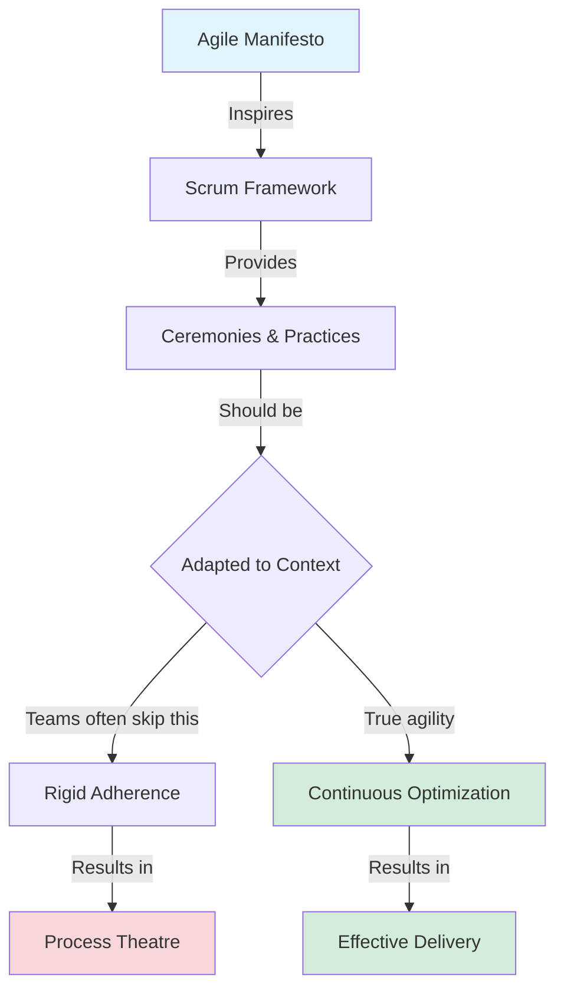
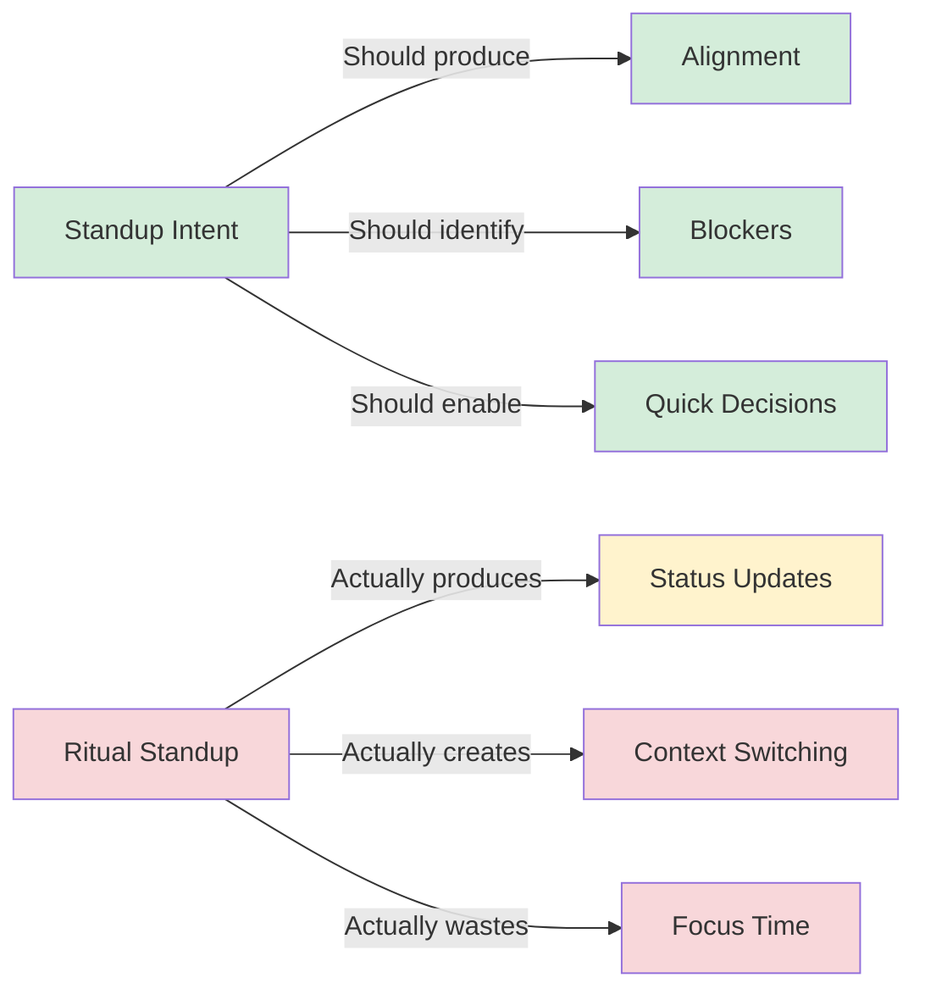
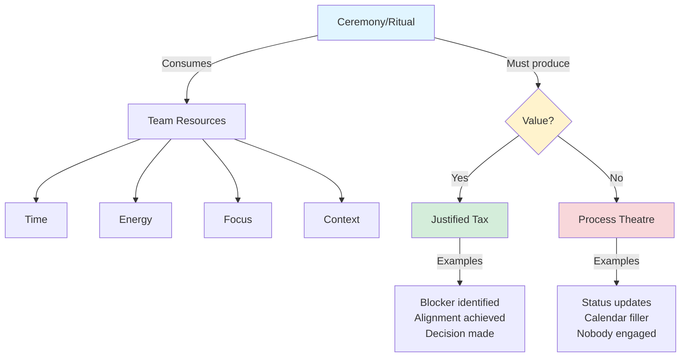
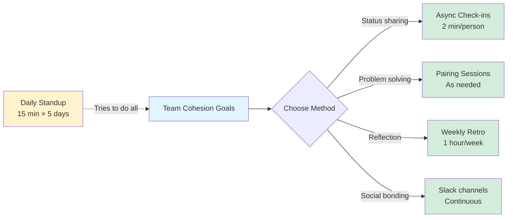
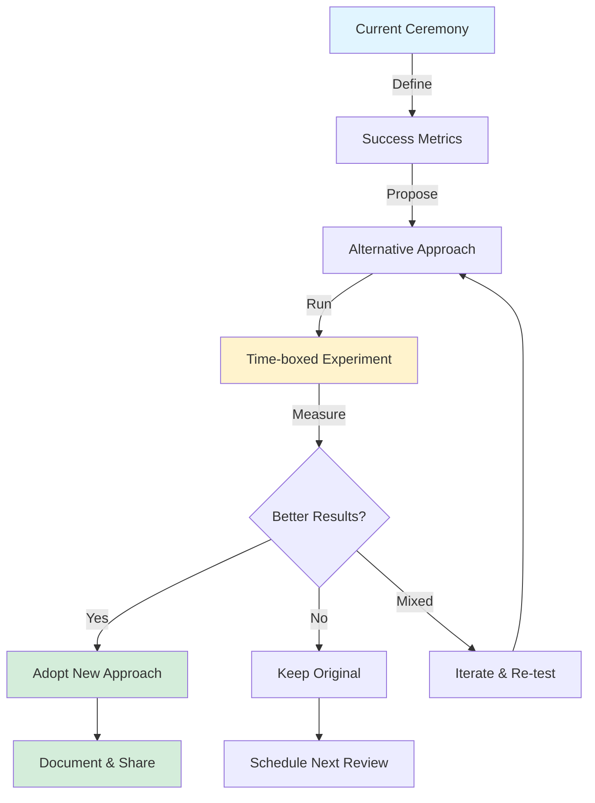
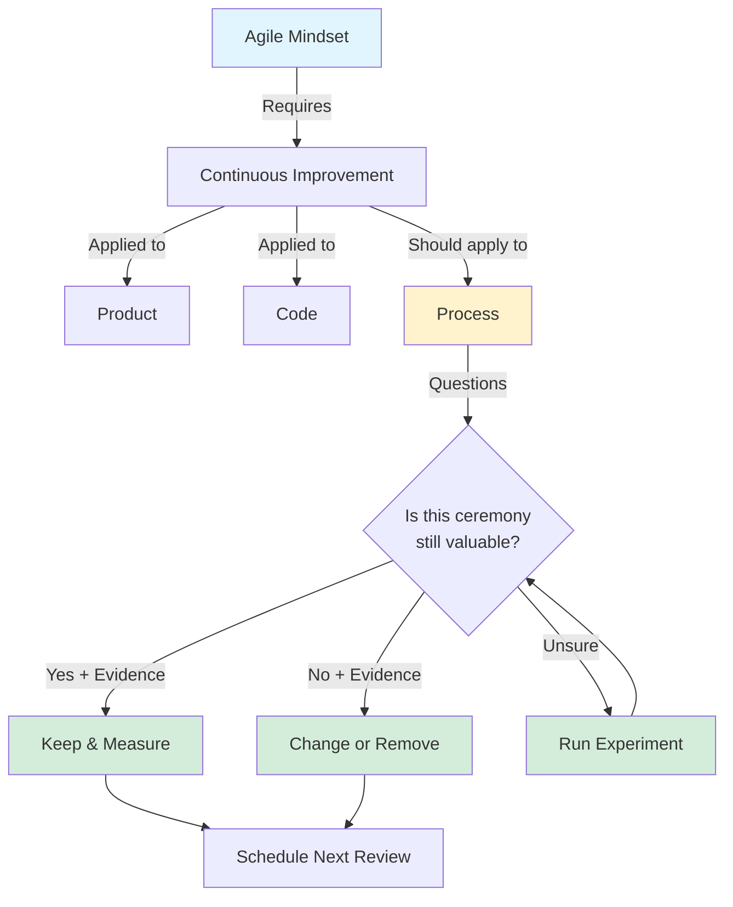

# Daily Standups Are Bullshit (Unless They Earn Their Pay)

<!-- category -- Agile,Development,Project Management -->
<datetime class="hidden">2025-01-20T14:30</datetime>

## Introduction

In my fifteen years of software development, I've attended more daily standups than I care to count. Some were electric — brief moments of alignment that cleared blockers and sent us sprinting forward. Others were performative rituals where tired developers recited "same as yesterday" to a gallery of muted cameras.

The difference? One type of standup *earned its tax*. The other was just ceremony.

Here's what I've learned: **agile is about adaptation, not adherence**. Yet most teams inherit Scrum rituals wholesale, treating them as sacred rather than pragmatic. Daily standups, sprint planning, retrospectives — these are tools, not commandments. And like any tool, they should be evaluated by whether they *work*.

This article isn't about eliminating standups. It's about questioning whether your ceremonies deliver value proportional to their cost. Because in my experience, **the most agile thing you can do is adapt your agile process**.

## Scrum Is a Template, Not Dogma

Let me be clear: Scrum is brilliant. It gave teams structure when we were drowning in waterfall. But somewhere along the line, we confused *following Scrum* with *being agile*.

Scrum is a **toolkit**. Agile is a **mindset**.

The Agile Manifesto never mandated daily standups. It valued "individuals and interactions over processes and tools." Yet I've watched teams force 9am standups across three timezones because "that's what Scrum says." That's not agility — that's cargo culting.



In my experience, the teams that ship fastest aren't the ones who follow Scrum by the book. They're the ones who **inspect and adapt their own process** as rigorously as they inspect and adapt their code.

## Standups Often Decay Into Ritual

Let me paint a picture you might recognize:

It's 9:00 AM. You're deep in solving a gnarly concurrency bug. Your IDE is open, debugger attached, mental model fully loaded. Then — ping — the standup meeting starts in 2 minutes.

You context-switch. Join the call. Wait while three people unmute. Then:

- **Alice:** "Same as yesterday, working on the login feature."
- **Bob:** "Finishing up tests, no blockers."
- **Carol:** *(camera off)* "Yeah, still on that database migration."

Ten minutes later, you return to your code. The mental model is gone. You spend another 15 minutes rebuilding context.

**What did that meeting achieve?**

In my experience, failing standups share common symptoms:

### The Ritual Decay Checklist

- [ ] Most updates are variations of "same as yesterday"
- [ ] No decisions are made
- [ ] More than 50% of attendees have cameras off
- [ ] Timezone spread forces late/early attendance
- [ ] People multitask during the meeting
- [ ] Nobody asks follow-up questions
- [ ] The meeting could have been a Slack message

When these symptoms appear, your standup isn't creating alignment. It's creating **synchronized fatigue**.



## All Ceremony Is Tax

Here's the framework that changed how I think about agile practices:

**Every ritual consumes resources:**
- **Time** — 15 minutes × 5 developers × 5 days = 6.25 hours/week
- **Cognitive energy** — context switching destroys deep work
- **Emotional bandwidth** — "performative presence" is exhausting
- **Focus** — interrupting flow states has compound costs

In democratic societies, we accept taxation *when it funds essential services*. Roads, schools, healthcare — these justify the burden because we get value in return.

Agile ceremonies work the same way.



### The Tax Equation

For any ceremony to justify its existence, this must be true:

**Value Delivered > Resources Consumed**

In my experience, standups fail when teams don't measure both sides of this equation. They inherit the ceremony, run it forever, and never ask: *"Is this still worth it?"*

## Better, Cheaper, Faster Alternatives

Here's what I've seen work across different team contexts:

### Status Updates → Async Check-ins

Instead of synchronous meetings, try:

**Slack/Teams Thread (Daily)**
```
👋 Good morning! Quick updates:
✅ Yesterday: Completed auth refactor (#234)
🎯 Today: Tackling payment integration (#456)
🚧 Blockers: Need staging DB access (@alice)
```

**Time cost:** 2 minutes vs. 15 minutes
**Timezone impact:** Zero
**Searchable history:** Yes

### Alignment → Accurate Boards

In my experience, teams that keep their kanban boards current don't need standups for visibility.

**Signal-rich board indicators:**
- Story points with error bars (confidence ranges)
- "Stuck" tags with aging indicators
- PR status directly on cards
- Actual vs. estimated time tracking

If your board is trustworthy, **looking at it should answer "what's everyone doing?"**

### Blockers → Issue Tagging + Async Pings

Real blockers need immediate attention, not a next-day standup.

**Better pattern:**
1. Tag issue with `🚧 blocked`
2. Ping relevant person directly
3. If not resolved in 2 hours, escalate to lead
4. Track blocker resolution time as a metric

### Team Cohesion → Weekly Retros + Pairing

The argument I hear most often: *"But standups keep us connected as a team!"*

Fair point. But is a daily status update the best way to build connection?

In my experience, these create *stronger* bonds:
- **Pairing sessions** — actual collaboration
- **Weekly retros** — honest reflection
- **Slack water cooler channels** — async social time
- **Monthly team lunches** — non-work connection



### The Context Matrix

Not all teams should adopt the same ceremonies. Here's my heuristic:

| Team Profile | Standup Value | Better Alternative |
|--------------|---------------|-------------------|
| **Mature, distributed, async-first** | Low | Slack check-ins + accurate boards |
| **Junior-heavy, co-located** | High | Keep daily standups (they're learning) |
| **Tight deadline, high risk** | High | Brief daily + real-time slack war room |
| **Stable feature team** | Medium | 2-3 weekly check-ins + pair sessions |
| **Open source, global timezones** | Very Low | Async updates + weekly video summary |

In my experience, the mistake isn't having standups or not having them. It's **applying the same ceremony to every context**.

## Measure Rituals Like Systems

If you're a developer, you monitor your systems. You track latency, error rates, resource usage. You set SLOs and investigate when they degrade.

**Why don't we do this for our processes?**

### Ceremony Health Check

Ask your team quarterly:

1. **What problem is this ceremony solving?**
   - If nobody can articulate it clearly, kill it.

2. **What evidence shows it works?**
   - "We've always done it" is not evidence.

3. **Is there a faster way?**
   - Could async work? Could automation help?

4. **What happens if we skip it?**
   - Run the experiment. Pause for 2 weeks. Measure impact.

5. **Have we tested alternatives?**
   - If you've run the same ceremony for years unchanged, you're not being agile.

### Practical Example: My Last Team

We had daily standups for 18 months. Then I proposed an experiment:

**Hypothesis:** Our mature team can maintain alignment with 3x weekly check-ins + async updates.

**Metrics:**
- Blocker resolution time
- Sprint goal achievement rate
- Team satisfaction (anonymous survey)
- Average PR age

**Result after 4 weeks:**
- Blocker time: **unchanged** (we used Slack tags)
- Sprint goals: **+1 improvement** (more focus time)
- Satisfaction: **+15% increase** (less meeting fatigue)
- PR age: **-8 hours average** (more review time)

We made it permanent. Not because standups are bad, but because **our context didn't justify the tax**.



## Team Maturity & Context Matter

I want to be crystal clear: **I'm not saying eliminate standups everywhere**.

Some contexts genuinely benefit from daily synchronization:

### When Standups Earn Their Tax

In my experience, daily standups deliver value for:

**Newly Formed Teams**
- Members don't know each other's working styles
- Implicit knowledge hasn't built up yet
- Need explicit coordination while norms establish

**Junior-Heavy Teams**
- Learning to estimate and plan
- Benefit from daily mentorship touchpoints
- Building professional communication skills

**High-Pressure Release Windows**
- Coordinating complex deployment dependencies
- Rapid blocker identification is critical
- Psychological safety in shared stress

**Cross-Functional Discovery**
- Product, design, and engineering exploring together
- Rapid iteration on prototypes
- Tight feedback loops essential

**The key principle:** When your team's context changes, your ceremonies should too.

I've worked with teams that did standups during a 6-week product launch, then switched to async afterwards. That's not inconsistency — **that's adaptation**.

## What Good Looks Like

Let me share what effective ceremony looks like, when it's working:

### Example: The 7-Minute Standup

One of the best teams I worked with ran standups like this:

**Format:**
1. Everyone posts update in Slack *before* meeting
2. Meeting starts: "Any blockers or decisions needed?"
3. Address only those items
4. If nothing urgent: "Great, meeting cancelled, back to work"

**Average duration:** 7 minutes
**Meetings cancelled:** ~40% of the time
**Value:** High-bandwidth problem solving, zero status theatre

### Example: The Async Video Update

For a distributed team across 9 timezones:

**Pattern:**
- Each person records 60-second Loom video at their day-end
- Posts to shared Slack thread
- Others watch async and reply with comments/offers of help
- Weekly sync meeting only for complex discussions

**Time cost:** 60 seconds recording + 3 minutes watching
**Timezone issues:** Eliminated
**Connection:** Higher (seeing faces, hearing tone)

### Example: The Confidence Dashboard

Instead of asking "are you on track?", one team built a simple dashboard:

| Task | Estimate | Confidence | Last Update |
|------|----------|-----------|-------------|
| Auth refactor | 5 points | 🟢 90% | 2 hours ago |
| Payment API | 8 points | 🟡 60% | 5 hours ago |
| DB migration | 3 points | 🔴 30% | 1 day ago |

Confidence below 70% triggered automatic "need help?" Slack message.

**Result:** Blockers surfaced proactively, no meeting needed.

## The Real Spirit of Agile

Here's what bothers me about the standup orthodoxy:

The Agile Manifesto says **"responding to change over following a plan."**

Yet we resist changing our ceremonies. We inherited standups from Scrum, and we keep running them even when evidence suggests they're not working.

That's not agility. That's **tradition**.

In my experience, truly agile teams ask hard questions:

- "This ceremony worked last year. Does it still?"
- "We're distributed now. Should our sync patterns change?"
- "Our team has tripled. Does the same structure scale?"
- "We just shipped the big project. What do we optimize for now?"



## Conclusion: Ceremony Must Earn Its Burden

Let me bring this home with a simple principle:

> **A ceremony is not agile because it has a name in the Scrum Guide.
> It's agile only when it earns its burden.**

Standups aren't bullshit. **Mandatory, unquestioned, context-free standups are.**

In my experience, the best teams treat ceremonies like code:

- They **refactor** when patterns emerge
- They **optimize** when performance suffers
- They **delete** when no longer needed
- They **test alternatives** before committing
- They **measure** to know what works

Agile isn't about protecting rituals. It's about **protecting clarity, flow, and delivery**.

If a 2-minute Slack check-in achieves what a 15-minute standup used to — and your team ships faster, feels less fatigued, and maintains alignment — **that is agility in action**.

So here's my challenge to you:

**This week, ask your team:**
1. What would we lose if we skipped standups for a week?
2. What would we gain?
3. Are we willing to test it?

You might discover the standup is essential. Great — now you have evidence, not assumption.

Or you might discover it's been tax without benefit for months. Also great — now you can optimize.

Either way, you'll be doing the most agile thing possible: **adapting based on reality, not ritual**.

---

## References & Further Reading

- [Agile Manifesto](https://agilemanifesto.org/) — The original principles
- [Turn the Ship Around!](https://davidmarquet.com/) by L. David Marquet — Intent-based leadership reduces ceremony needs
- [Team Topologies](https://teamtopologies.com/) — How team structure impacts communication needs
- [Remote: Office Not Required](https://basecamp.com/books/remote) — Async-first thinking from Basecamp

---

*Have you experimented with alternatives to daily standups? I'd love to hear what worked (or didn't) for your team. [Get in touch](/contact) or leave a comment below.*
