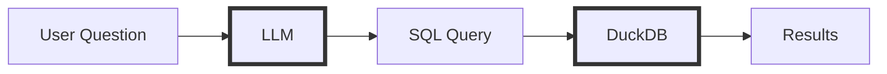
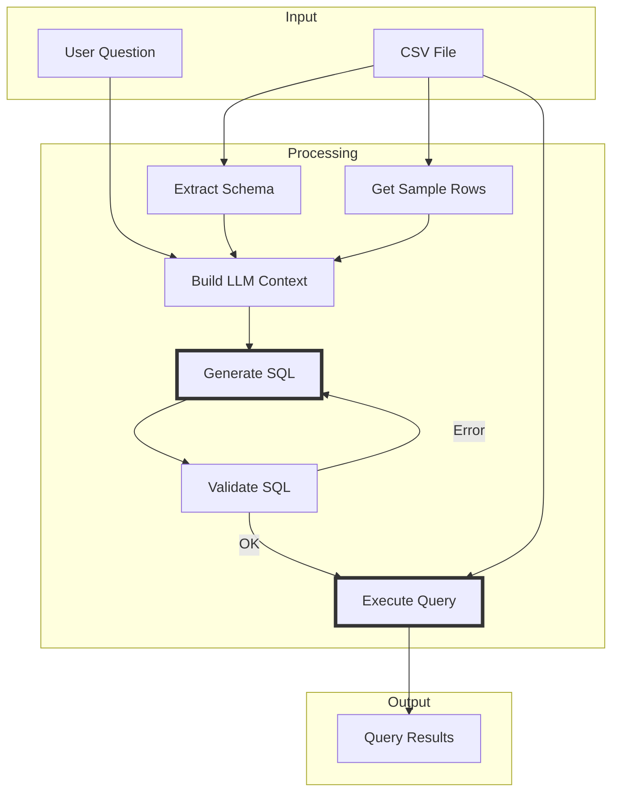

# How to Analyse Large CSV Files with Local LLMs in C#

<!--category-- AI, LLM, Data Analysis, DuckDB, C#, Ollama -->
<datetime class="hidden">2025-12-18T10:00</datetime>

You've got a 500MB CSV file. Maybe it's sales data, server logs, or customer records. You want to ask questions about it - "What's the average order value by region?" or "Show me the trend of errors over the last month." 

You've heard of all these fancy 'AI' tools (including [Copilot in Excel](https://support.microsoft.com/en-gb/copilot-excel)) and *know* they can do this sort of thing. But what if you had to build it yourself? What if your data is too sensitive for cloud services, or you need something customised to your workflow?

The obvious approach - dump it into ChatGPT - doesn't work. Context windows are limited (even 200K tokens is only ~50K rows), and you probably don't want to upload sensitive business data to external services anyway.

So how do you analyse large datasets with LLMs locally, using C#?

[TOC]

## The Problem: LLMs Can't Process Large Data

LLMs have two fundamental limitations when it comes to data analysis:

1. **Context window limits** - Even a 200K token context fits maybe 50,000 rows. Your 500MB CSV has millions.
2. **LLMs aren't databases** - They're great at understanding questions and generating code, but terrible at scanning millions of rows to compute an average.

The solution is simple: **don't feed data to the LLM**. Instead, let the LLM generate SQL that queries the data.



The LLM never sees the actual data - just the schema. This keeps things fast, private, and accurate.

## Comparing the Approaches

Before jumping into code, let's look at the options for querying large CSV files from C#:

### Option 1: Load Everything Into Memory

Libraries like [CsvHelper](https://joshclose.github.io/CsvHelper/) or [Microsoft.Data.Analysis](https://www.nuget.org/packages/Microsoft.Data.Analysis) (DataFrame) can parse CSV into memory:

```csharp
// CsvHelper approach
using var reader = new StreamReader("sales.csv");
using var csv = new CsvReader(reader, CultureInfo.InvariantCulture);
var records = csv.GetRecords<SaleRecord>().ToList();
var totalByRegion = records.GroupBy(r => r.Region).Select(g => new { Region = g.Key, Total = g.Sum(r => r.Amount) });
```

**Problem**: A 500MB CSV loads into ~2-4GB of RAM as objects. A 5GB file? You're out of memory. Plus you're writing manual LINQ for every query.

### Option 2: Import to a Database

Load the CSV into SQLite, PostgreSQL, or SQL Server, then query normally:

```csharp
// SQLite approach - requires import step
using var connection = new SqliteConnection("Data Source=analytics.db");
// First: CREATE TABLE, then bulk insert from CSV...
// Then: var result = connection.Query("SELECT Region, SUM(Amount) FROM sales GROUP BY Region");
```

**Problem**: The import step is slow (minutes for large files), you need schema definitions upfront, and you're managing database files or servers.

### Option 3: Let the LLM Generate Code

Tools like [PandasAI](https://github.com/Sinaptik-AI/pandas-ai) (Python) let the LLM generate pandas code that runs against your data:

```python
# PandasAI approach
df = pd.read_csv("sales.csv")
pandas_ai = PandasAI(llm)
response = pandas_ai.run(df, "What are total sales by region?")
# LLM generates: df.groupby('Region')['Amount'].sum()
```

**Problem**: Still loads everything into memory. Also, executing LLM-generated arbitrary code is a security nightmare compared to SQL (which is declarative and sandbox-able).

### Option 4: DuckDB (The Winner 🦆)

DuckDB queries CSV files directly without loading them into memory:

```csharp
using var connection = new DuckDBConnection("DataSource=:memory:");
connection.Open();
using var cmd = connection.CreateCommand();
cmd.CommandText = "SELECT Region, SUM(Amount) FROM 'sales.csv' GROUP BY Region";
// Executes directly against the file - no import, no memory explosion
```

**Why DuckDB wins:**

| Factor | CsvHelper | SQLite | DuckDB |
|--------|-----------|--------|--------|
| **Memory usage** | Loads entire file | Loads entire file (during import) | Streams from disk |
| **Setup required** | None | Schema + import | None |
| **Query language** | LINQ (code) | SQL | SQL |
| **500MB file** | ~2GB RAM | Minutes to import | Instant queries |
| **5GB file** | OOM crash | Very slow import | Works fine |
| **Parquet support** | No | No | Yes (10-100x faster) |

DuckDB is designed for exactly this use case - analytical queries over files. It's what data engineers use in Python; the .NET bindings are excellent.

## The Stack

| Component | Purpose |
|-----------|---------|
| [DuckDB](https://duckdb.org/) | Query engine - queries CSV directly |
| [DuckDB.NET](https://github.com/Giorgi/DuckDB.NET) | C# bindings with ADO.NET support |
| [Ollama](https://ollama.ai/) | Local LLM inference |
| [Bogus](https://github.com/bchavez/Bogus) | Generate realistic test data |
| `qwen2.5-coder:7b` | Model that's excellent at SQL |

## Project Setup

Let's create a sample project. Install the NuGet packages:

```bash
dotnet add package DuckDB.NET.Data.Full
dotnet add package OllamaSharp
dotnet add package Bogus
```

Pull a coding-focused model that's good at SQL:

```bash
ollama pull qwen2.5-coder:7b
```

## The Architecture

Here's how the pieces fit together:



The key insight: we give the LLM **schema and sample data**, not the actual data. This keeps context small and responses fast.

## Step 1: Generate Test Data with Bogus

Before we can test our LLM-powered CSV analyser, we need data to analyse. You might have real CSV files to work with, but for development and testing there are good reasons to generate synthetic data:

1. **Scale testing** - Generate 100K, 1M, or 10M rows to verify performance at different sizes
2. **Privacy** - No risk of exposing real customer/business data in demos or screenshots
3. **Reproducibility** - Same seed = same data, making bugs reproducible
4. **Edge cases** - Control the distribution (e.g., force 5% returns, specific date ranges)

### What is Bogus?

[Bogus](https://github.com/bchavez/Bogus) is a .NET port of the popular faker.js library. It generates realistic-looking fake data - names, addresses, emails, dates, numbers - with proper locale support. Instead of hand-crafting test CSV files or using random garbage data, Bogus gives you data that *looks* real:

- `f.Name.FullName()` → "John Smith" (not "asdf1234")
- `f.Internet.Email()` → "john.smith@gmail.com" (properly formatted)
- `f.Date.Between(start, end)` → Realistic date distribution
- `f.Commerce.ProductName()` → "Handcrafted Granite Cheese" (fun, but recognisable)

This matters because realistic data helps you spot issues - weird formatting, unexpected aggregations, edge cases in date handling - that random strings would hide.

### Define the Data Model

```csharp
internal class SaleRecord
{
    public string OrderId { get; set; } = "";
    public DateTime OrderDate { get; set; }
    public string CustomerId { get; set; } = "";
    public string CustomerName { get; set; } = "";
    public string Region { get; set; } = "";
    public string Category { get; set; } = "";
    public string ProductName { get; set; } = "";
    public int Quantity { get; set; }
    public decimal UnitPrice { get; set; }
    public decimal Discount { get; set; }
    public bool IsReturned { get; set; }
}
```

### Configure the Faker

Bogus uses a fluent API to define generation rules:

```csharp
var categories = new[] { "Electronics", "Clothing", "Home & Garden", "Sports", "Books" };
var regions = new[] { "North", "South", "East", "West", "Central" };

var faker = new Faker<SaleRecord>()
    .RuleFor(s => s.OrderId, f => f.Random.Guid().ToString()[..8].ToUpper())
    .RuleFor(s => s.OrderDate, f => f.Date.Between(
        new DateTime(2022, 1, 1), 
        new DateTime(2024, 12, 31)))
    .RuleFor(s => s.CustomerId, f => $"CUST-{f.Random.Number(10000, 99999)}")
    .RuleFor(s => s.CustomerName, f => f.Name.FullName())
    .RuleFor(s => s.Region, f => f.PickRandom(regions))
    .RuleFor(s => s.Category, f => f.PickRandom(categories))
    .RuleFor(s => s.ProductName, (f, s) => GenerateProductName(f, s.Category))
    .RuleFor(s => s.Quantity, f => f.Random.Number(1, 20))
    .RuleFor(s => s.UnitPrice, f => f.Random.Decimal(9.99m, 299.99m))
    .RuleFor(s => s.Discount, f => f.Random.Bool(0.3f) ? f.Random.Decimal(0.05m, 0.25m) : 0m)
    .RuleFor(s => s.IsReturned, f => f.Random.Bool(0.05f));
```

Let's break down what's happening:

- **`f` (Faker)** - The generator instance with access to all the data modules (Name, Date, Random, etc.)
- **`f.Random.Guid().ToString()[..8]`** - Generate a GUID but take only first 8 chars for a readable order ID
- **`f.Date.Between()`** - Random date within a realistic range (not year 9999)
- **`f.PickRandom(array)`** - Select randomly from predefined options (ensures valid categories)
- **`f.Random.Bool(0.3f)`** - 30% chance of true (30% of orders get a discount)
- **`(f, s)` syntax** - Access both faker AND the partially-built record. This lets `ProductName` depend on `Category`

The `(f, s)` pattern is powerful - it means "Electronics" orders get electronics product names, not random items. This coherence makes the generated data much more realistic for testing aggregations like "revenue by category".

### Generate and Write to CSV

```csharp
var records = faker.Generate(100_000); // Adjust for your testing needs

await using var writer = new StreamWriter(csvPath, false, Encoding.UTF8);
await writer.WriteLineAsync("OrderId,OrderDate,CustomerId,CustomerName,Region,Category,...");

foreach (var record in records)
{
    var total = record.Quantity * record.UnitPrice * (1 - record.Discount);
    await writer.WriteLineAsync($"{record.OrderId},{record.OrderDate:yyyy-MM-dd},...");
}
```

100K rows generates about 15MB of CSV - enough to test with, but you can easily scale to millions. The generation is fast (~2 seconds for 100K rows) because Bogus is optimised for bulk generation.

> **Tip**: Set `Randomizer.Seed = new Random(12345)` before generating to get reproducible data. Same seed = same "random" records every time, which is invaluable for debugging.

## Step 2: Build the Schema Context

Before the LLM can generate SQL, it needs to understand the data structure. We extract this from DuckDB:

### The Context Model

```csharp
public class DataContext
{
    public string CsvPath { get; set; } = "";
    public List<ColumnInfo> Columns { get; set; } = new();
    public List<Dictionary<string, string>> SampleRows { get; set; } = new();
    public long RowCount { get; set; }
}

public class ColumnInfo
{
    public string Name { get; set; } = "";
    public string Type { get; set; } = "";  // VARCHAR, DOUBLE, TIMESTAMP, etc.
}
```

This captures everything the LLM needs: column names, types, and a few sample rows to understand the data format.

### Extracting the Schema

DuckDB can describe any CSV without loading it all:

```csharp
private DataContext BuildContext(DuckDBConnection connection, string csvPath)
{
    var context = new DataContext { CsvPath = csvPath };

    // Get schema - DuckDB infers types from the CSV
    using var cmd = connection.CreateCommand();
    cmd.CommandText = $"DESCRIBE SELECT * FROM '{csvPath}'";
    using var reader = cmd.ExecuteReader();

    while (reader.Read())
    {
        context.Columns.Add(new ColumnInfo
        {
            Name = reader.GetString(0),  // Column name
            Type = reader.GetString(1)   // Inferred type
        });
    }

    return context;
}
```

The `DESCRIBE` command reads only the file header plus a few rows for type inference - it's instant even on huge files.

### Getting Sample Data

Sample rows help the LLM understand data formats (dates, IDs, etc.):

```csharp
using var cmd = connection.CreateCommand();
cmd.CommandText = $"SELECT * FROM '{csvPath}' LIMIT 3";
using var reader = cmd.ExecuteReader();

while (reader.Read())
{
    var row = new Dictionary<string, string>();
    for (int i = 0; i < reader.FieldCount; i++)
    {
        var value = reader.IsDBNull(i) ? "NULL" : reader.GetValue(i)?.ToString() ?? "";
        row[reader.GetName(i)] = value;
    }
    context.SampleRows.Add(row);
}
```

Three rows is usually enough - it shows the LLM what formats to expect without wasting tokens.

## Step 3: Generate SQL with the LLM

Now we build a prompt that gives the LLM everything it needs:

### Building the Prompt

```csharp
private string BuildPrompt(DataContext context, string question, string? previousError)
{
    var sb = new StringBuilder();

    sb.AppendLine("You are a SQL expert. Generate a DuckDB SQL query to answer the user's question.");
    sb.AppendLine();
    sb.AppendLine("IMPORTANT RULES:");
    sb.AppendLine("1. The table is accessed directly from the CSV file path");
    sb.AppendLine("2. Use single quotes around the file path in FROM clause");
    sb.AppendLine("3. DuckDB syntax - use LIMIT not TOP, use || for string concat");
    sb.AppendLine("4. Return ONLY the SQL query, no explanation, no markdown");
    sb.AppendLine();
    
    sb.AppendLine($"CSV File: '{context.CsvPath}'");
    sb.AppendLine($"Row Count: {context.RowCount:N0}");
    sb.AppendLine();
    
    // Schema
    sb.AppendLine("Schema:");
    foreach (var col in context.Columns)
    {
        sb.AppendLine($"  - {col.Name}: {col.Type}");
    }
```

The rules section is crucial - it tells the LLM exactly how to format the query for DuckDB. Being explicit about syntax (LIMIT vs TOP, string concatenation) prevents common errors.

### Adding Sample Data

```csharp
    if (context.SampleRows.Count > 0)
    {
        sb.AppendLine();
        sb.AppendLine("Sample data (first 3 rows):");
        foreach (var row in context.SampleRows)
        {
            var values = row.Select(kv => $"{kv.Key}='{kv.Value}'");
            sb.AppendLine($"  {{ {string.Join(", ", values)} }}");
        }
    }
```

### Error Recovery

If a previous attempt failed, include the error:

```csharp
    if (previousError != null)
    {
        sb.AppendLine();
        sb.AppendLine("YOUR PREVIOUS QUERY HAD AN ERROR:");
        sb.AppendLine(previousError);
        sb.AppendLine("Please fix the query based on this error.");
    }

    sb.AppendLine();
    sb.AppendLine($"Question: {question}");
    sb.AppendLine();
    sb.AppendLine("SQL Query (no markdown, no explanation):");

    return sb.ToString();
}
```

This retry mechanism is important - local LLMs sometimes make syntax mistakes, and giving them the error usually fixes it on the second attempt.

### Calling the LLM

```csharp
var request = new GenerateRequest { Model = _model, Prompt = prompt };
var response = await _ollama.GenerateAsync(request).StreamToEndAsync();
var sql = CleanSqlResponse(response?.Response ?? "");
```

The `StreamToEndAsync()` waits for the complete response. For a better UX, you could stream tokens as they arrive.

### Cleaning the Response

LLMs often wrap SQL in markdown code blocks despite being told not to:

```csharp
private string CleanSqlResponse(string response)
{
    var sql = response.Trim();

    // Remove markdown code blocks if present
    if (sql.StartsWith("```"))
    {
        var lines = sql.Split('\n').ToList();
        lines.RemoveAt(0);  // Remove opening ```sql
        if (lines.Count > 0 && lines[^1].Trim().StartsWith("```"))
        {
            lines.RemoveAt(lines.Count - 1);  // Remove closing ```
        }
        sql = string.Join('\n', lines);
    }

    return sql.Trim('`', ' ', '\n', '\r');
}
```

## Step 4: Validate Before Executing

DuckDB's `EXPLAIN` lets us check SQL syntax without running the query:

```csharp
private string? ValidateSql(DuckDBConnection connection, string sql)
{
    try
    {
        using var cmd = connection.CreateCommand();
        cmd.CommandText = $"EXPLAIN {sql}";
        cmd.ExecuteNonQuery();
        return null; // Valid
    }
    catch (Exception ex)
    {
        return ex.Message;
    }
}
```

If validation fails, we feed the error back to the LLM and retry (up to a limit).

## Step 5: Execute and Format Results

Finally, run the query and format the output:

```csharp
private QueryResult ExecuteQuery(DuckDBConnection connection, string sql)
{
    var result = new QueryResult { Sql = sql };

    try
    {
        using var cmd = connection.CreateCommand();
        cmd.CommandText = sql;
        using var reader = cmd.ExecuteReader();

        // Capture column names
        for (int i = 0; i < reader.FieldCount; i++)
        {
            result.Columns.Add(reader.GetName(i));
        }

        // Capture rows
        while (reader.Read())
        {
            var row = new List<object?>();
            for (int i = 0; i < reader.FieldCount; i++)
            {
                row.Add(reader.IsDBNull(i) ? null : reader.GetValue(i));
            }
            result.Rows.Add(row);
        }

        result.Success = true;
    }
    catch (Exception ex)
    {
        result.Success = false;
        result.Error = ex.Message;
    }

    return result;
}
```

The `QueryResult` class (shown in full in the sample project) includes a `ToString()` method that formats results as a readable table.

## Adding Conversation Context

For interactive analysis, users often want to ask follow-up questions:

```
"What's the total revenue?"
→ "Break that down by region"
→ "Show the top 5 regions"
```

The second and third questions only make sense with context from the first.

### Tracking Conversation History

```csharp
public class ConversationTurn
{
    public string Question { get; set; } = "";
    public string Sql { get; set; } = "";
    public bool Success { get; set; }
    public int RowCount { get; set; }
    public string Summary { get; set; } = "";  // "Single value: 1234567.89"
}
```

### Including History in Prompts

```csharp
if (_history.Count > 0)
{
    sb.AppendLine();
    sb.AppendLine("CONVERSATION HISTORY (for context):");
    
    foreach (var turn in _history.TakeLast(5))  // Last 5 turns
    {
        sb.AppendLine($"Q: {turn.Question}");
        sb.AppendLine($"SQL: {turn.Sql}");
        if (turn.Success)
        {
            sb.AppendLine($"Result: {turn.Summary}");
        }
        sb.AppendLine();
    }
}
```

The history gives the LLM context to understand references like "that", "those results", or "break it down further".

## Which Model to Use?

For SQL generation, coding-focused models work best. Here are the options available via [Ollama's model library](https://ollama.ai/library):

| Model | Size | Speed | Quality | Link |
|-------|------|-------|---------|------|
| `qwen2.5-coder:7b` | 4.7GB | Fast | Excellent | [Ollama](https://ollama.ai/library/qwen2.5-coder) |
| `deepseek-coder-v2:16b` | 9GB | Medium | Best | [Ollama](https://ollama.ai/library/deepseek-coder-v2) |
| `codellama:7b` | 4GB | Fast | Good | [Ollama](https://ollama.ai/library/codellama) |
| `llama3.2:3b` | 2GB | Very Fast | Acceptable | [Ollama](https://ollama.ai/library/llama3.2) |

For most use cases, **`qwen2.5-coder:7b`** hits the sweet spot - accurate SQL, good speed, runs on modest hardware (8GB+ RAM).

## Performance

### Real-World Benchmarks

Testing on a 100K row CSV file (14MB), DuckDB query times were:

| Query Type | Time |
|------------|------|
| Simple COUNT | 65ms |
| GROUP BY with SUM | 58-68ms |
| Complex aggregation with FILTER | 63ms |
| Multi-table GROUP BY with HAVING | 71ms |

That's analytical queries completing in under 100ms - without any import step. The same queries via CsvHelper + LINQ would require loading the entire file into memory first.

### Convert Large Files to Parquet

For files over 1GB, [Parquet format](https://parquet.apache.org/) is 10-100x faster:

```csharp
using var cmd = connection.CreateCommand();
cmd.CommandText = $"COPY (SELECT * FROM '{csvPath}') TO '{parquetPath}' (FORMAT PARQUET)";
cmd.ExecuteNonQuery();
```

The compressed Parquet file is also much smaller.

### Security Considerations

When executing LLM-generated SQL:

```csharp
private bool IsSafeQuery(string sql)
{
    var dangerous = new[] { "DROP", "DELETE", "TRUNCATE", "UPDATE", "INSERT", "ALTER", "CREATE" };
    var upperSql = sql.ToUpperInvariant();
    return !dangerous.Any(d => upperSql.Contains(d));
}
```

DuckDB's in-memory mode also provides natural isolation - it can't affect your production databases.

## Complete Example

Here's how it all comes together:

```csharp
// Generate test data
await GenerateSalesCsvAsync("sales.csv", 100_000);

// Simple query
using var service = new CsvQueryService("qwen2.5-coder:7b", verbose: true);
var result = await service.QueryAsync("sales.csv", "What are total sales by region?");
Console.WriteLine(result);

// Conversational analysis
using var analyser = new ConversationalCsvAnalyser("sales.csv", "qwen2.5-coder:7b");

Console.WriteLine(await analyser.AskAsync("What's the total revenue?"));
Console.WriteLine(await analyser.AskAsync("Break that down by category"));
Console.WriteLine(await analyser.AskAsync("Which category has the most returns?"));
```

## Summary

The best approach for analysing large CSV files with local LLMs:

1. **Generate test data** with Bogus for realistic scenarios
2. **Extract schema** from DuckDB - column names, types, sample rows
3. **Build a context-rich prompt** - rules, schema, samples, conversation history
4. **Validate SQL** before executing using `EXPLAIN`
5. **Execute with DuckDB** - queries CSV directly, handles files larger than RAM

The LLM never sees your data - just the schema. This keeps things:
- **Fast** - SQL is optimised for data processing
- **Accurate** - No hallucinated numbers
- **Private** - Data never leaves your machine
- **Scalable** - Works with billion-row datasets

The full sample project is available at [Mostlylucid.CsvLlm](https://github.com/scottgal/mostlylucidweb) - includes the `CsvQueryService`, `ConversationalCsvAnalyser`, and Bogus-based data generation.

## Resources

### DuckDB
- [DuckDB Documentation](https://duckdb.org/docs/) - Full reference
- [DuckDB CSV Import](https://duckdb.org/docs/data/csv/overview.html) - CSV-specific features
- [DuckDB SQL Reference](https://duckdb.org/docs/sql/introduction) - SQL syntax differences from other databases
- [DuckDB.NET GitHub](https://github.com/Giorgi/DuckDB.NET) - C# bindings
- [DuckDB.NET NuGet](https://www.nuget.org/packages/DuckDB.NET.Data.Full) - Full package with native binaries

### Ollama & LLMs
- [Ollama](https://ollama.ai/) - Local LLM runtime
- [Ollama Model Library](https://ollama.ai/library) - Available models
- [OllamaSharp](https://github.com/awaescher/OllamaSharp) - C# client library
- [OllamaSharp NuGet](https://www.nuget.org/packages/OllamaSharp/)

### Test Data Generation
- [Bogus GitHub](https://github.com/bchavez/Bogus) - Fake data generator
- [Bogus API Reference](https://github.com/bchavez/Bogus#bogus-api-support) - Available data types

### Alternatives Mentioned
- [CsvHelper](https://joshclose.github.io/CsvHelper/) - CSV parsing library
- [Microsoft.Data.Analysis](https://www.nuget.org/packages/Microsoft.Data.Analysis) - DataFrame for .NET
- [PandasAI](https://github.com/Sinaptik-AI/pandas-ai) - Python LLM + pandas integration
