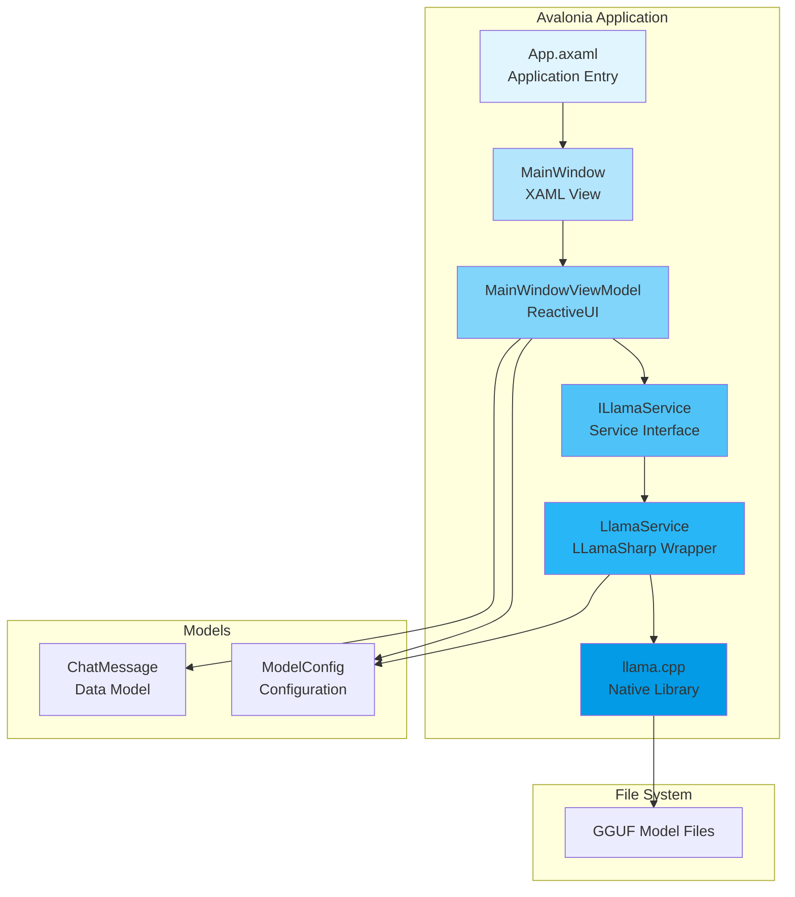
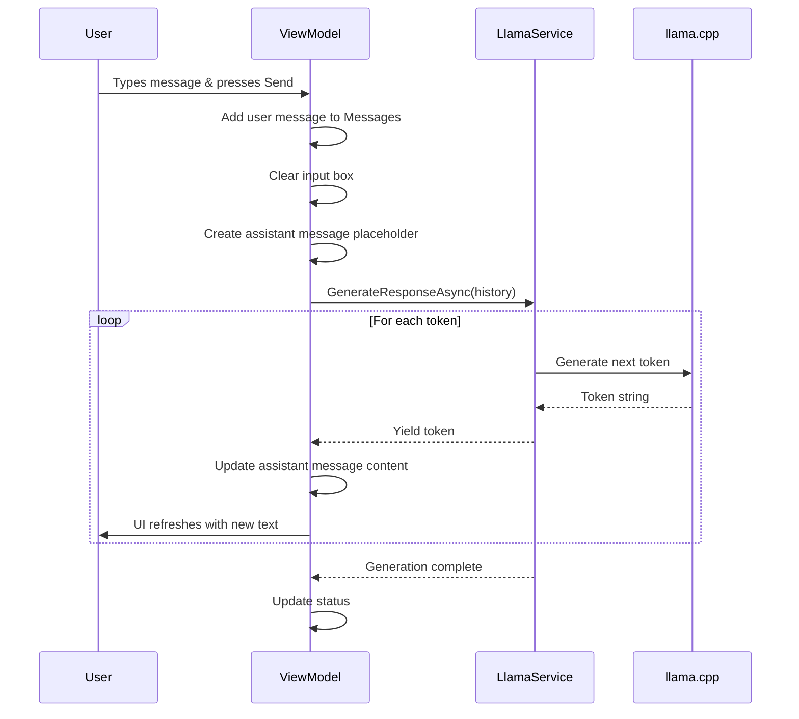

# Building a Cross-Platform AI Chat Application with Avalonia and LLamaSharp

<datetime class="hidden">2025-11-10T14:00</datetime>
<!-- category -- Avalonia, LLamaSharp, AI, Desktop Development, .NET -->

# Introduction

If you've been following the AI space, you'll know that running large language models locally has gone from "you'll need a small data centre" to "works on my laptop" in remarkably short order. Thanks to quantization techniques and clever optimisations, models that once required 80GB of VRAM can now run on consumer hardware with just 4-8GB of RAM. Rather impressive stuff.

In this article, I'll show you how to build a proper cross-platform desktop chat application using Avalonia UI and LLamaSharp. We'll create a clean MVVM architecture, implement streaming responses, and most importantly - keep it all local. No cloud APIs, no subscription fees, just you and a tiny language model having a chat on your own machine.

This is the kind of application you might build as a starting point for more sophisticated integrations - perhaps connecting it to the [mostlyucid.llmbackend](https://github.com/scottgal/mostlyucid.llmbackend) universal LLM/NMT backend I'm working on, or using it as a test bed for your own AI experiments.

[TOC]

# Why Avalonia?

You might be wondering why I've chosen Avalonia over the more traditional WPF or even Electron. The answer is refreshingly simple:

- **Truly Cross-Platform**: Write once, run on Windows, macOS, and Linux. No compromises.
- **XAML-Based**: If you know WPF, you already know Avalonia. The transition is seamless.
- **Modern**: Unlike WPF which is stuck in .NET Framework land, Avalonia is built for modern .NET
- **Performant**: No Chromium bloat like Electron. It's native UI all the way down.
- **Open Source**: Proper MIT license, unlike WPF's reference-source-only approach

Avalonia represents the future of .NET desktop development. It's what WPF should have become if Microsoft hadn't been so focused on web technologies for a decade.

# Why LLamaSharp?

[LLamaSharp](https://github.com/SciSharp/LLamaSharp) is a C# binding for llama.cpp, the wildly popular C++ library for running LLM inference. It's the standard choice for local LLM work, and for good reason:

- **GGUF Support**: Runs quantized models efficiently
- **CPU and GPU**: Works on CPU or can offload layers to CUDA/Metal/Vulkan
- **Streaming**: Token-by-token generation for responsive UIs
- **Battle-Tested**: Used by thousands of projects worldwide
- **Active Development**: Regular updates to match llama.cpp improvements

The alternative would be running models via Python and Flask, but that's rather inelegant when we can keep it all in .NET, isn't it?

# Architecture Overview

Let's start with the big picture. Here's how our application is structured:



The architecture follows classic MVVM principles:

- **Views** (XAML): Define the UI structure and styling
- **ViewModels**: Handle all the business logic and state management
- **Models**: Simple data containers (ChatMessage, ModelConfig)
- **Services**: Encapsulate external dependencies (LLamaSharp)

This separation means we can easily swap out the LLamaSharp implementation for something else - say, calling out to a remote API like my [LLMApi mocker project](https://github.com/scottgal/LLMApi), or plugging into a unified backend service.

# Project Structure

Let's walk through the project structure:

```
Mostlylucid.TinyLlm.Chat/
├── Models/
│   ├── ChatMessage.cs          # Individual message in conversation
│   └── ModelConfig.cs          # LLM configuration settings
├── Services/
│   ├── ILlamaService.cs        # Service interface
│   └── LlamaService.cs         # LLamaSharp implementation
├── ViewModels/
│   ├── ViewModelBase.cs        # Base ReactiveUI ViewModel
│   └── MainWindowViewModel.cs  # Main chat logic
├── Views/
│   ├── MainWindow.axaml        # Main window XAML
│   └── MainWindow.axaml.cs     # Code-behind and converters
├── App.axaml                   # Application resources
├── App.axaml.cs                # Application lifecycle
└── Program.cs                  # Entry point
```

Clean, organised, and easy to navigate. Let's dive into each layer.

# The Data Models

## ChatMessage

Our `ChatMessage` model is wonderfully simple:

```csharp
public class ChatMessage
{
    /// <summary>
    /// Unique identifier for the message
    /// </summary>
    public Guid Id { get; init; } = Guid.NewGuid();

    /// <summary>
    /// The content of the message
    /// </summary>
    public string Content { get; init; } = string.Empty;

    /// <summary>
    /// True if this message is from the user, false if from the assistant
    /// </summary>
    public bool IsUser { get; init; }

    /// <summary>
    /// Timestamp when the message was created
    /// </summary>
    public DateTime Timestamp { get; init; } = DateTime.Now;

    /// <summary>
    /// Token count for this message (useful for tracking context usage)
    /// </summary>
    public int TokenCount { get; init; }
}
```

Using `init` setters makes these records immutable after construction - perfect for UI binding where we don't want messages changing unexpectedly. The `IsUser` flag lets us style user and assistant messages differently in the UI.

## ModelConfig

The `ModelConfig` holds all our LLM parameters:

```csharp
public class ModelConfig
{
    public string ModelPath { get; set; } = string.Empty;
    public uint ContextSize { get; set; } = 2048;
    public int GpuLayerCount { get; set; } = 0;
    public int Seed { get; set; } = -1;
    public float Temperature { get; set; } = 0.7f;
    public float TopP { get; set; } = 0.95f;
    public int MaxTokens { get; set; } = 256;
    public float RepeatPenalty { get; set; } = 1.1f;
}
```

These parameters control the model's behaviour:

- **ModelPath**: Path to the GGUF file
- **ContextSize**: How many tokens the model can "remember"
- **GpuLayerCount**: How many layers to offload to GPU (0 = CPU only)
- **Temperature**: Creativity level (higher = more creative, lower = more focused)
- **TopP**: Nucleus sampling threshold
- **MaxTokens**: Maximum length of generated response
- **RepeatPenalty**: Discourages repetitive text

# The Service Layer

## ILlamaService Interface

Following good practices, we define an interface for our LLM service:

```csharp
public interface ILlamaService : IDisposable
{
    /// <summary>
    /// Loads a model from the specified path
    /// </summary>
    Task<bool> LoadModelAsync(ModelConfig config, CancellationToken ct = default);

    /// <summary>
    /// Checks if a model is currently loaded
    /// </summary>
    bool IsModelLoaded { get; }

    /// <summary>
    /// Generates a response based on the conversation history
    /// </summary>
    IAsyncEnumerable<string> GenerateResponseAsync(
        IEnumerable<ChatMessage> history,
        CancellationToken ct = default);

    /// <summary>
    /// Unloads the current model and frees resources
    /// </summary>
    void UnloadModel();

    /// <summary>
    /// Gets the current model configuration
    /// </summary>
    ModelConfig? CurrentConfig { get; }
}
```

The key method here is `GenerateResponseAsync` which returns an `IAsyncEnumerable<string>`. This allows us to stream tokens as they're generated, giving that nice "typing" effect in the UI.

## LlamaService Implementation

Here's where the magic happens. The `LlamaService` wraps LLamaSharp's API:

```csharp
public class LlamaService : ILlamaService
{
    private LLamaWeights? _model;
    private LLamaContext? _context;
    private InteractiveExecutor? _executor;
    private ModelConfig? _currentConfig;

    public bool IsModelLoaded => _model != null && _context != null;
    public ModelConfig? CurrentConfig => _currentConfig;

    public async Task<bool> LoadModelAsync(ModelConfig config, CancellationToken ct = default)
    {
        return await Task.Run(() =>
        {
            try
            {
                // Clean up existing model if any
                UnloadModel();

                // Create model parameters
                var parameters = new ModelParams(config.ModelPath)
                {
                    ContextSize = config.ContextSize,
                    GpuLayerCount = config.GpuLayerCount,
                    Seed = (uint)(config.Seed < 0 ? Random.Shared.Next() : config.Seed)
                };

                // Load the model
                _model = LLamaWeights.LoadFromFile(parameters);

                // Create context
                _context = _model.CreateContext(parameters);

                // Create executor for interactive sessions
                _executor = new InteractiveExecutor(_context);

                _currentConfig = config;

                return true;
            }
            catch (Exception)
            {
                UnloadModel();
                return false;
            }
        }, ct);
    }

    // ... rest of implementation
}
```

The loading process:
1. Clean up any existing model
2. Create parameters from our config
3. Load the GGUF model weights
4. Create a context (the stateful part that holds conversation)
5. Create an executor for generating text

## Streaming Generation

The generation method is where streaming comes in:

```csharp
public async IAsyncEnumerable<string> GenerateResponseAsync(
    IEnumerable<ChatMessage> history,
    [EnumeratorCancellation] CancellationToken ct = default)
{
    if (!IsModelLoaded || _executor == null || _currentConfig == null)
    {
        yield return "Error: No model loaded. Please load a model first.";
        yield break;
    }

    // Build the prompt from conversation history
    var prompt = BuildPrompt(history);

    // Inference parameters
    var inferenceParams = new InferenceParams
    {
        Temperature = _currentConfig.Temperature,
        TopP = _currentConfig.TopP,
        RepeatPenalty = _currentConfig.RepeatPenalty,
        MaxTokens = _currentConfig.MaxTokens,
        AntiPrompts = new List<string> { "User:", "\nUser:" }
    };

    // Stream tokens as they're generated
    await foreach (var token in _executor.InferAsync(prompt, inferenceParams, ct))
    {
        if (ct.IsCancellationRequested)
            break;

        yield return token;
    }
}
```

Using `IAsyncEnumerable<string>` is rather clever here. Each token gets yielded as soon as it's generated, allowing the UI to update in real-time. The `EnumeratorCancellation` attribute ensures our cancellation token is properly threaded through the async enumerable.

## Prompt Building

We construct prompts from conversation history:

```csharp
private string BuildPrompt(IEnumerable<ChatMessage> history)
{
    var sb = new StringBuilder();

    // Add system prompt
    sb.AppendLine("You are a helpful AI assistant. You provide clear, concise answers to questions.");
    sb.AppendLine();

    // Add conversation history
    foreach (var message in history)
    {
        if (message.IsUser)
        {
            sb.AppendLine($"User: {message.Content}");
        }
        else
        {
            sb.AppendLine($"Assistant: {message.Content}");
        }
    }

    // Add the assistant prompt to start generation
    sb.Append("Assistant: ");

    return sb.ToString();
}
```

This simple format works well with most instruction-tuned models. Different models might need different prompt formats (like Llama 2's special tags or ChatML), but this approach is good enough for TinyLlama and similar models.

# The ViewModel

## MainWindowViewModel

The ViewModel is where MVVM really shines. Using ReactiveUI, we get reactive property change notifications and command handling:

```csharp
public class MainWindowViewModel : ViewModelBase
{
    private readonly ILlamaService _llamaService;
    private string _userInput = string.Empty;
    private string _modelPath = string.Empty;
    private bool _isModelLoaded;
    private bool _isGenerating;
    private string _statusMessage = "No model loaded";
    private CancellationTokenSource? _generationCts;

    public MainWindowViewModel()
    {
        _llamaService = new LlamaService();

        // Initialize commands
        LoadModelCommand = ReactiveCommand.CreateFromTask(LoadModelAsync,
            this.WhenAnyValue(x => x.ModelPath, path => !string.IsNullOrWhiteSpace(path) && !IsGenerating));

        SendMessageCommand = ReactiveCommand.CreateFromTask(SendMessageAsync,
            this.WhenAnyValue(
                x => x.UserInput,
                x => x.IsModelLoaded,
                x => x.IsGenerating,
                (input, loaded, generating) => !string.IsNullOrWhiteSpace(input) && loaded && !generating));

        CancelGenerationCommand = ReactiveCommand.Create(CancelGeneration,
            this.WhenAnyValue(x => x.IsGenerating));

        ClearChatCommand = ReactiveCommand.Create(ClearChat);
    }

    public ObservableCollection<ChatMessage> Messages { get; } = new();

    // Properties with INotifyPropertyChanged via ReactiveUI
    public string UserInput
    {
        get => _userInput;
        set => this.RaiseAndSetIfChanged(ref _userInput, value);
    }

    // ... other properties
}
```

ReactiveUI's `WhenAnyValue` is brilliantly powerful. It watches property changes and automatically enables/disables commands based on conditions. For example, `SendMessageCommand` is only enabled when there's user input, a model is loaded, and we're not currently generating.

## Message Sending Flow

Here's how messages flow through the system:



The streaming is handled in the `SendMessageAsync` method:

```csharp
private async Task SendMessageAsync()
{
    if (string.IsNullOrWhiteSpace(UserInput) || !IsModelLoaded)
        return;

    // Add user message
    var userMessage = new ChatMessage
    {
        Content = UserInput,
        IsUser = true
    };
    Messages.Add(userMessage);

    // Clear input
    UserInput = string.Empty;

    // Start generation
    IsGenerating = true;
    StatusMessage = "Generating response...";
    _generationCts = new CancellationTokenSource();

    // Create assistant message placeholder
    var assistantMessage = new ChatMessage
    {
        Content = string.Empty,
        IsUser = false
    };
    Messages.Add(assistantMessage);

    try
    {
        var responseText = string.Empty;
        var messageIndex = Messages.Count - 1;

        await foreach (var token in _llamaService.GenerateResponseAsync(Messages.Take(Messages.Count - 1), _generationCts.Token))
        {
            responseText += token;

            // Update message in place
            Messages[messageIndex] = new ChatMessage
            {
                Id = assistantMessage.Id,
                Content = responseText,
                IsUser = false,
                Timestamp = assistantMessage.Timestamp
            };
        }

        StatusMessage = "Response complete";
    }
    catch (OperationCanceledException)
    {
        StatusMessage = "Generation cancelled";
    }
    catch (Exception ex)
    {
        StatusMessage = $"Error: {ex.Message}";
    }
    finally
    {
        IsGenerating = false;
        _generationCts?.Dispose();
        _generationCts = null;
    }
}
```

The clever bit is how we handle the streaming. We create a placeholder message in the collection, then replace it with updated versions as tokens arrive. This keeps the UI responsive - users see the response being "typed" in real-time.

# The View

## MainWindow XAML

The XAML defines our UI structure. Here's the chat messages section:

```xml
<!-- Chat Messages -->
<ScrollViewer Grid.Row="1" Name="ChatScrollViewer">
    <ItemsControl ItemsSource="{Binding Messages}" Margin="10">
        <ItemsControl.ItemTemplate>
            <DataTemplate DataType="models:ChatMessage">
                <Border Classes="{Binding IsUser, Converter={x:Static MessageStyleConverter.Instance}}">
                    <StackPanel>
                        <TextBlock Text="{Binding Content}"
                                   Classes="{Binding IsUser, Converter={x:Static MessageTextStyleConverter.Instance}}"/>
                        <TextBlock Text="{Binding Timestamp, StringFormat='{}{0:HH:mm:ss}'}"
                                   FontSize="10"
                                   Opacity="0.7"
                                   Margin="0,5,0,0"/>
                    </StackPanel>
                </Border>
            </DataTemplate>
        </ItemsControl.ItemTemplate>
    </ItemsControl>
</ScrollViewer>
```

We use value converters to dynamically apply styles based on whether the message is from the user or assistant.

## Styling

Avalonia's styling system is reminiscent of CSS:

```xml
<Window.Styles>
    <!-- User Message Style -->
    <Style Selector="Border.user-message">
        <Setter Property="Background" Value="#0078D4"/>
        <Setter Property="CornerRadius" Value="8"/>
        <Setter Property="Padding" Value="12"/>
        <Setter Property="Margin" Value="50,5,10,5"/>
        <Setter Property="HorizontalAlignment" Value="Right"/>
    </Style>

    <Style Selector="TextBlock.user-message-text">
        <Setter Property="Foreground" Value="White"/>
        <Setter Property="TextWrapping" Value="Wrap"/>
    </Style>

    <!-- Assistant Message Style -->
    <Style Selector="Border.assistant-message">
        <Setter Property="Background" Value="#F3F2F1"/>
        <Setter Property="CornerRadius" Value="8"/>
        <Setter Property="Padding" Value="12"/>
        <Setter Property="Margin" Value="10,5,50,5"/>
        <Setter Property="HorizontalAlignment" Value="Left"/>
    </Style>

    <Style Selector="TextBlock.assistant-message-text">
        <Setter Property="Foreground" Value="#323130"/>
        <Setter Property="TextWrapping" Value="Wrap"/>
    </Style>
</Window.Styles>
```

User messages get a blue background and align right, assistant messages are grey and align left. Classic chat UI design.

## Input Area

The input area includes key binding for sending messages with Enter:

```xml
<TextBox Grid.Column="0"
         Text="{Binding UserInput}"
         Watermark="Type your message here..."
         AcceptsReturn="True"
         MaxHeight="100">
    <TextBox.KeyBindings>
        <KeyBinding Gesture="Enter" Command="{Binding SendMessageCommand}"/>
    </TextBox.KeyBindings>
</TextBox>

<Button Grid.Column="1"
        Content="Send"
        Command="{Binding SendMessageCommand}"
        IsVisible="{Binding !IsGenerating}"
        Classes="accent"/>
```

The Send button is hidden when generating, replaced by a Cancel button. This is done with simple binding to the `IsGenerating` property.

# Value Converters

We need value converters to dynamically apply CSS classes:

```csharp
public class MessageStyleConverter : IValueConverter
{
    public static MessageStyleConverter Instance { get; } = new();

    public object? Convert(object? value, Type targetType, object? parameter, CultureInfo culture)
    {
        return value is bool isUser && isUser ? "user-message" : "assistant-message";
    }

    public object? ConvertBack(object? value, Type targetType, object? parameter, CultureInfo culture)
    {
        throw new NotImplementedException();
    }
}
```

Simple but effective. The converter checks if the message is from the user and returns the appropriate style class name.

# Running the Application

## Getting a Model

First, you'll need a GGUF model. I recommend starting with TinyLlama:

1. Visit [TheBloke's HuggingFace](https://huggingface.co/TheBloke/TinyLlama-1.1B-Chat-v1.0-GGUF)
2. Download `tinyllama-1.1b-chat-v1.0.Q4_K_M.gguf` (about 700MB)
3. Place it somewhere accessible on your system

The Q4_K_M quantization is a good balance - decent quality with reasonable memory usage. You can go larger (Q8) for better quality or smaller (Q4_0) for faster inference.

## Building and Running

```bash
cd Mostlylucid.TinyLlm.Chat
dotnet restore
dotnet build
dotnet run
```

On first run:

1. Enter the full path to your GGUF file
2. Click "Load Model" (this takes 5-30 seconds depending on model size)
3. Wait for the status indicator to turn green
4. Start chatting!

## Screenshot

Here's what it looks like in action:

```
┌────────────────────────────────────────────────────────────┐
│ Model Path: [C:\models\tinyllama.gguf] [Load Model]  ● Ready │
├────────────────────────────────────────────────────────────┤
│                                                            │
│  ┌──────────────────────────────────────┐                │
│  │ Hello! I'm a tiny AI assistant...    │                │
│  │ How can I help you today?            │                │
│  └──────────────────────────────────────┘  14:23:01      │
│                                                            │
│                          ┌────────────────────────────┐   │
│                   14:23:15  │ What is Avalonia UI? │   │
│                          └────────────────────────────┘   │
│                                                            │
│  ┌──────────────────────────────────────┐                │
│  │ Avalonia is a cross-platform UI      │                │
│  │ framework for .NET that allows...    │                │
│  └──────────────────────────────────────┘  14:23:18      │
│                                                            │
├────────────────────────────────────────────────────────────┤
│ [Type your message here...              ] [Send]  [Clear] │
└────────────────────────────────────────────────────────────┘
```

# Performance Considerations

## Memory Usage

LLMs are memory-hungry beasts, even when quantized. Here's what to expect:

- **TinyLlama 1.1B Q4_K_M**: ~1GB RAM
- **Phi-2 2.7B Q4_K_M**: ~2.5GB RAM
- **Mistral 7B Q4_K_M**: ~5GB RAM
- **Llama 2 13B Q4_K_M**: ~9GB RAM

The context size also affects memory. A 2048 context uses less RAM than 4096, but you can hold less conversation history.

## Inference Speed

Speed depends on your hardware:

**CPU Only:**
- Modern desktop CPU: 5-15 tokens/second
- Laptop CPU: 2-8 tokens/second

**With GPU Offloading:**
- Entry-level GPU: 15-30 tokens/second
- Mid-range GPU (RTX 3060): 30-60 tokens/second
- High-end GPU (RTX 4090): 80-120+ tokens/second

To enable GPU offloading, increase `GpuLayerCount` in the `ModelConfig`. Start with 10 layers and increase until you hit memory limits or performance degrades.

## UI Responsiveness

The key to keeping the UI responsive is our use of async/await and `IAsyncEnumerable`. Model loading and inference happen on background threads, never blocking the UI thread.

The token-by-token streaming also helps with perceived performance. Users see progress immediately rather than waiting for the entire response.

# Integration Possibilities

## LLMApi Integration

My [LLMApi project](https://github.com/scottgal/LLMApi) provides a simple HTTP API for mocking LLM responses. You could swap out the `LlamaService` implementation to call this API instead:

```csharp
public class HttpLlamaService : ILlamaService
{
    private readonly HttpClient _httpClient;

    public async IAsyncEnumerable<string> GenerateResponseAsync(
        IEnumerable<ChatMessage> history,
        CancellationToken ct = default)
    {
        var response = await _httpClient.PostAsJsonAsync("/api/chat", history, ct);
        await using var stream = await response.Content.ReadAsStreamAsync(ct);
        using var reader = new StreamReader(stream);

        while (!reader.EndOfStream)
        {
            var line = await reader.ReadLineAsync();
            if (line != null) yield return line;
        }
    }
}
```

This would let you develop against a mock API during testing, then swap to local inference for production.

## mostlyucid.llmbackend Integration

The [mostlyucid.llmbackend](https://github.com/scottgal/mostlyucid.llmbackend) project aims to provide a universal backend for LLM and NMT systems. It will include:

- **Multiple Provider Support**: OpenAI, Anthropic, local models, etc.
- **Unified API**: One interface, multiple backends
- **Caching**: Response caching for common queries
- **Rate Limiting**: Built-in throttling
- **Monitoring**: Prometheus metrics and observability

Once that's ready, integrating it would be as simple as implementing a new `ILlamaService` that talks to the unified backend. The beauty of interface-based design is we can swap implementations without touching the UI code.

# Future: Running in the Browser

Now here's where it gets really interesting. Avalonia has been working on WebAssembly support, which would let us run this exact same codebase in a browser. Imagine:

- **Same C# Code**: No JavaScript rewrite required
- **Local Inference in Browser**: Run the LLM entirely client-side
- **Progressive Web App**: Install as a desktop app from the browser
- **No Server Costs**: Everything runs on the user's machine

The technical challenges are significant:

1. **WASM Size**: The compiled app needs to be downloadable
2. **Model Loading**: Streaming large GGUF files into WASM memory
3. **Performance**: WASM is slower than native (though improving rapidly)
4. **WebGPU**: Accessing GPU from WASM for acceleration

But it's entirely possible. Projects like [whisper.cpp WASM](https://github.com/ggerganov/whisper.cpp/tree/master/examples/whisper.wasm) have proven that running complex ML models in the browser is viable.

I'll be exploring this in a future article once Avalonia's WASM support matures. The potential for truly private, no-backend AI applications running in browsers is rather exciting.

# Common Gotchas

## Model Path Issues

The most common issue is incorrect model paths. Make sure:
- Path uses forward slashes (`/`) or escaped backslashes (`\\`)
- File exists and is readable
- File is actually a GGUF model (not GGML or other formats)

## Out of Memory

If you get OOM errors:
- Try a smaller model (TinyLlama instead of Mistral)
- Reduce context size (`ContextSize = 1024`)
- Use more aggressive quantization (Q4_0 instead of Q4_K_M)

## Slow Inference

If generation is painfully slow:
- Check CPU usage - should be near 100% on several cores
- Try GPU offloading if you have a compatible GPU
- Use a smaller model
- Reduce `MaxTokens`

## Model Not Loading

If model loading fails silently:
- Check the application logs (if you add logging)
- Try a different model to isolate the issue
- Ensure you have enough RAM
- Check file permissions

# In Conclusion

We've built a proper cross-platform AI chat application from scratch, with:

- **Clean Architecture**: MVVM pattern with ReactiveUI
- **Streaming Responses**: Real-time token-by-token generation
- **Local Inference**: Complete privacy, no cloud dependencies
- **Cross-Platform**: Works on Windows, macOS, and Linux

The application demonstrates how modern .NET, Avalonia UI, and LLamaSharp come together to create sophisticated desktop experiences. It's a starting point you can extend in numerous directions:

- Add conversation persistence (save/load chats)
- Implement multiple character personalities
- Add RAG (Retrieval-Augmented Generation) with vector search
- Connect to the mostlyucid.llmbackend for unified LLM access
- Support multiple concurrent models
- Add voice input/output using Whisper and speech synthesis

The code is available in the [Mostlylucid repository](https://github.com/scottgal/mostlylucidweb) under `Mostlylucid.TinyLlm.Chat`. Clone it, run it, break it, improve it. That's what open source is all about.

In a future article, I'll explore getting this running in a browser via Avalonia's WebAssembly support. The idea of a fully local AI assistant running in your browser tab, with zero server infrastructure, is thoroughly compelling.

Until then, happy coding! And remember: AI doesn't have to mean cloud APIs and subscription fees. Sometimes the best AI is the one running quietly on your own machine.
