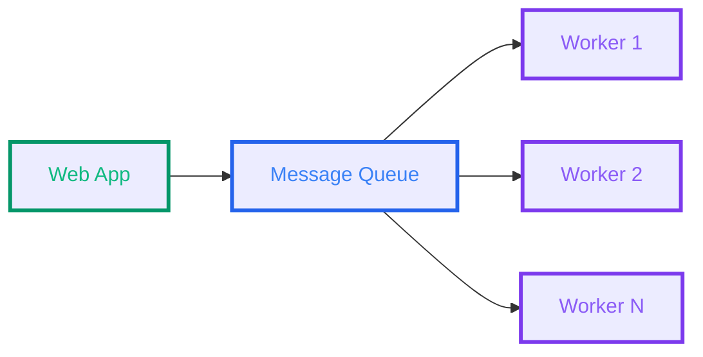
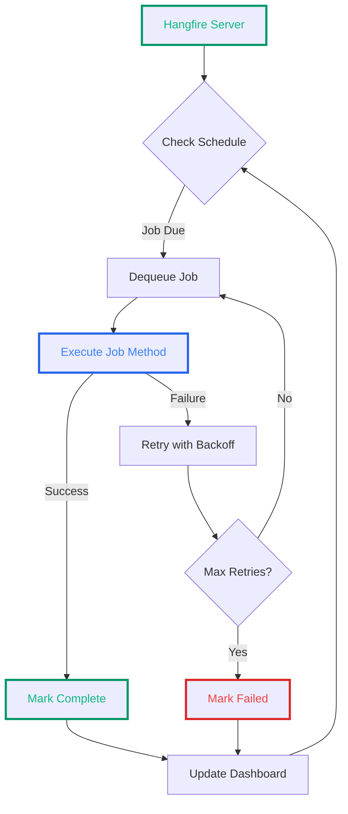

# Background Services in ASP.NET Core - Part 1: The Approaches

<!--category-- ASP.NET Core, IHostedService, BackgroundService, Hangfire -->
<datetime class="hidden">2025-11-26T09:00</datetime>

# Introduction

Background services are the unsung heroes of modern web applications. Whilst your controllers handle HTTP requests in the foreground, background services quietly process queued emails, index content for search, check external APIs, clean up temporary files, and handle countless other tasks that would otherwise block your request pipeline.

In this two-part series, we'll explore the different approaches to implementing background services in ASP.NET Core, from the built-in `IHostedService` and `BackgroundService` abstractions to more sophisticated solutions like Hangfire. In Part 1, we'll examine the fundamental approaches and their characteristics. In [Part 2](/blog/background-services-in-aspnetcore-part2), we'll dive into real-world implementations from a production codebase.

> **Important:** We'll pay special attention to lifecycle management—particularly the often-overlooked `StopAsync` method, which is where many developers encounter cryptic exceptions when their applications shut down.

[TOC]

# Why Background Services?

Before diving into the "how," let's briefly consider the "why." Background services let you:

1. **Offload slow operations** - Don't make users wait whilst you send emails or generate PDFs
2. **Schedule recurring tasks** - Clean up old records every night at 2 AM
3. **Process queues** - Handle messages from channels or message brokers
4. **Monitor external state** - Poll APIs or watch file systems for changes
5. **Coordinate complex workflows** - Manage multi-step processes that span minutes or hours

ASP.NET Core provides several approaches to implementing these services, each with different trade-offs.

# The Historical Context: Why Background Services are Now Feasible

In the "old days" (pre-2010), running background work in your web application was generally considered a bad idea. The conventional wisdom was: "Web servers handle web requests. Background work belongs on a separate server."

This wasn't just cargo-cult wisdom—it was based on real technical limitations:

## The Single-Core Era

Early web servers typically ran on **single-core or dual-core CPUs**. If you ran a CPU-intensive background task, it directly competed with web requests for the same core:

```
Single Core (2005):
┌─────────────────────┐
│  Background Task    │  ← Uses 80% CPU
│  (80% of core)      │
├─────────────────────┤
│  Web Requests       │  ← Only 20% left!
│  (20% of core)      │  ← Slow responses
└─────────────────────┘
```

Result: Your website became sluggish the moment background work kicked in.

## Thread Pool Starvation

Classic ASP.NET used **thread-per-request**. The thread pool was relatively small (25-100 threads typically), and background tasks would steal threads that should be handling web requests:

```csharp
// Classic ASP.NET (2008)
ThreadPool.QueueUserWorkItem(_ =>
{
    // This steals a thread from the pool!
    ProcessLongRunningTask();
});

// Meanwhile, web requests are queued waiting for threads
// HTTP 503 Service Unavailable
```

## IIS Application Pool Recycling

IIS would aggressively recycle application pools (restart your app) based on memory limits, request counts, or time schedules. Background work would be killed mid-operation:

```
00:00 - Background import starts (2 hour task)
02:00 - IIS recycles app pool (scheduled)
      - Background task killed
      - Work lost, must start again
```

## Limited Async/Await Support

Before .NET 4.5 (2012), async programming was painful. Background tasks often blocked threads unnecessarily:

```csharp
// Pre-async (2008)
void ProcessEmails()
{
    foreach (var email in GetEmails())
    {
        smtp.Send(email);  // Blocks thread for 500ms per email
    }
}
// 100 emails = 50 seconds of blocked thread time
```

## What Changed: The Modern Era

Today's landscape is dramatically different:

### 1. Multi-Core is Standard

Even modest cloud VMs have 2-8 cores. A background task on one core doesn't significantly impact web requests on other cores:

```
8-Core Server (2024):
Core 1: ████████████████████ Web Requests
Core 2: ████████████████████ Web Requests
Core 3: ████████████████████ Web Requests
Core 4: ████████████████████ Web Requests
Core 5: ████████████████████ Background Task ← Isolated
Core 6: ████████████████████ Background Task
Core 7: ████████████████████ Background Task
Core 8: ████████████████████ Background Task
```

### 2. Async/Await Everywhere

Modern .NET makes async programming trivial. Background tasks can wait on I/O without blocking threads:

```csharp
// Modern async (2024)
async Task ProcessEmailsAsync(CancellationToken ct)
{
    await foreach (var email in GetEmailsAsync(ct))
    {
        await smtp.SendAsync(email, ct);  // Doesn't block thread!
    }
}
// 100 emails processed efficiently, thread returns to pool during I/O
```

### 3. Better Process Hosting

- **Docker** - Background services in containers don't get arbitrarily recycled
- **Kubernetes** - Proper graceful shutdown handling with `SIGTERM`
- **systemd** - Linux services that restart reliably
- **Windows Services** - Proper long-running process model

### 4. Channels and Modern Primitives

.NET now has first-class support for concurrent programming:

```csharp
// System.Threading.Channels (2024)
var channel = Channel.CreateBounded<Email>(100);

// Producer (web request)
await channel.Writer.WriteAsync(email);  // Fast, non-blocking

// Consumer (background service)
await foreach (var email in channel.Reader.ReadAllAsync())
{
    await ProcessAsync(email);  // Efficient, async
}
```

### 5. Resource Limits and Cgroups

Modern container orchestrators let you **limit resource usage**:

```yaml
# Kubernetes resource limits
resources:
  limits:
    cpu: "500m"        # Background task can't use more than 0.5 CPU
    memory: "512Mi"    # Or more than 512 MB RAM
```

This means a runaway background task can't starve your web tier.

The question is no longer "Can we run background services in our web app?" but "**Should we?**" We'll explore this decision in the "When NOT to Use Background Services" section later.

# The Built-in Options

## IHostedService: The Foundation

At its core, every background service in ASP.NET Core implements `IHostedService`. This interface is beautifully simple:

```csharp
public interface IHostedService
{
    Task StartAsync(CancellationToken cancellationToken);
    Task StopAsync(CancellationToken cancellationToken);
}
```

That's it. Two methods. `StartAsync` is called when your application starts, and `StopAsync` when it shuts down.

Here's the lifecycle visualised:


### StartAsync: Synchronous vs Asynchronous Start

A critical decision when implementing `IHostedService` is whether your `StartAsync` method should block or return immediately.

**Synchronous (blocking) start:**
```csharp
public class BlockingStartService : IHostedService
{
    public async Task StartAsync(CancellationToken cancellationToken)
    {
        // This blocks application startup until complete
        await InitializeDatabaseAsync(cancellationToken);
        await LoadConfigurationAsync(cancellationToken);

        // Only now will the application continue starting
    }

    public Task StopAsync(CancellationToken cancellationToken)
        => Task.CompletedTask;
}
```

**Asynchronous (non-blocking) start:**
```csharp
public class NonBlockingStartService : IHostedService
{
    private Task _backgroundTask;
    private readonly CancellationTokenSource _cts = new();

    public Task StartAsync(CancellationToken cancellationToken)
    {
        // Start background work but return immediately
        _backgroundTask = Task.Run(async () =>
        {
            // Give other services time to initialise
            await Task.Delay(TimeSpan.FromSeconds(5), _cts.Token);
            await DoLongRunningWorkAsync(_cts.Token);
        }, _cts.Token);

        return Task.CompletedTask;
    }

    public async Task StopAsync(CancellationToken cancellationToken)
    {
        _cts.Cancel();
        await _backgroundTask; // Wait for completion
    }
}
```

**When to use each approach:**

- **Blocking:** When the service must complete initialisation before the application can handle requests (e.g., loading critical configuration, warming caches)
- **Non-blocking:** When the service can initialise in the background whilst other services start (e.g., indexing existing content, syncing with external services)

### StopAsync: The Common Pitfall

Here's where things get interesting—and where many developers encounter problems. When your application shuts down, ASP.NET Core calls `StopAsync` on all hosted services. You have a limited window (default 5 seconds, configurable via `HostOptions.ShutdownTimeout`) to clean up gracefully.

**The most common mistake:**

```csharp
public class BrokenService : IHostedService
{
    private readonly Channel<string> _channel = Channel.CreateUnbounded<string>();
    private Task _processingTask;

    public Task StartAsync(CancellationToken cancellationToken)
    {
        _processingTask = ProcessMessagesAsync();
        return Task.CompletedTask;
    }

    public Task StopAsync(CancellationToken cancellationToken)
    {
        // WRONG: The channel is still open, ProcessMessagesAsync
        // will hang on WaitToReadAsync forever!
        return Task.CompletedTask;
    }

    private async Task ProcessMessagesAsync()
    {
        // This will never exit because the channel is never completed
        await foreach (var message in _channel.Reader.ReadAllAsync())
        {
            await ProcessAsync(message);
        }
    }
}
```

When you run this service and stop your application, you'll see errors like:

```
Unable to cast object of type 'TaskCompletionSource`1[System.Threading.Tasks.VoidTaskResult]' to type 'System.Threading.Tasks.Task'
```

Or the application will simply hang for the shutdown timeout period before forcefully terminating.

**The correct approach:**

```csharp
public class CorrectService : IHostedService
{
    private readonly Channel<string> _channel = Channel.CreateUnbounded<string>();
    private readonly CancellationTokenSource _cts = new();
    private Task _processingTask;

    public Task StartAsync(CancellationToken cancellationToken)
    {
        _processingTask = ProcessMessagesAsync(_cts.Token);
        return Task.CompletedTask;
    }

    public async Task StopAsync(CancellationToken cancellationToken)
    {
        // CORRECT: Signal cancellation and complete the channel
        await _cts.CancelAsync();
        _channel.Writer.Complete();

        try
        {
            // Wait for processing to finish or for the shutdown timeout
            await Task.WhenAny(_processingTask,
                Task.Delay(Timeout.Infinite, cancellationToken));
        }
        catch (OperationCanceledException)
        {
            // Expected when shutdown timeout is reached
        }
    }

    private async Task ProcessMessagesAsync(CancellationToken token)
    {
        await foreach (var message in _channel.Reader.ReadAllAsync(token))
        {
            try
            {
                await ProcessAsync(message);
            }
            catch (OperationCanceledException)
            {
                // Shutdown requested, exit gracefully
                break;
            }
        }
    }
}
```

**Key points for correct StopAsync implementation:**

1. **Signal cancellation** - Use a `CancellationTokenSource` and cancel it
2. **Complete channels** - If you're using channels, call `Writer.Complete()`
3. **Wait for background tasks** - Use `Task.WhenAny` with the shutdown cancellation token
4. **Handle OperationCanceledException** - This is expected and should be caught
5. **Don't throw exceptions** - Exceptions in `StopAsync` can cause unpredictable behaviour

## BackgroundService: The Convenient Base Class

Writing `IHostedService` implementations can be repetitive. You always need a background task, a cancellation token source, and the same cleanup pattern. `BackgroundService` handles this boilerplate for you:

```csharp
public abstract class BackgroundService : IHostedService, IDisposable
{
    private Task _executeTask;
    private CancellationTokenSource _stoppingCts;

    protected abstract Task ExecuteAsync(CancellationToken stoppingToken);

    public virtual Task StartAsync(CancellationToken cancellationToken)
    {
        _stoppingCts = CancellationTokenSource.CreateLinkedTokenSource(cancellationToken);
        _executeTask = ExecuteAsync(_stoppingCts.Token);
        return Task.CompletedTask;
    }

    public virtual async Task StopAsync(CancellationToken cancellationToken)
    {
        if (_executeTask == null) return;

        try
        {
            _stoppingCts.Cancel();
        }
        finally
        {
            await Task.WhenAny(_executeTask, Task.Delay(Timeout.Infinite, cancellationToken));
        }
    }

    public virtual void Dispose()
    {
        _stoppingCts?.Cancel();
    }
}
```

You just implement `ExecuteAsync` and let the base class handle the plumbing:

```csharp
public class SimpleBackgroundService : BackgroundService
{
    private readonly ILogger<SimpleBackgroundService> _logger;

    public SimpleBackgroundService(ILogger<SimpleBackgroundService> logger)
    {
        _logger = logger;
    }

    protected override async Task ExecuteAsync(CancellationToken stoppingToken)
    {
        _logger.LogInformation("Service starting");

        // Wait for app to finish starting
        await Task.Delay(TimeSpan.FromSeconds(5), stoppingToken);

        while (!stoppingToken.IsCancellationRequested)
        {
            try
            {
                await DoWorkAsync(stoppingToken);
                await Task.Delay(TimeSpan.FromMinutes(5), stoppingToken);
            }
            catch (OperationCanceledException)
            {
                // Shutdown requested
                break;
            }
            catch (Exception ex)
            {
                _logger.LogError(ex, "Error in background service");
            }
        }

        _logger.LogInformation("Service stopping");
    }

    private async Task DoWorkAsync(CancellationToken token)
    {
        _logger.LogInformation("Doing work...");
        // Your actual work here
        await Task.Delay(1000, token);
    }
}
```

### When to Use BackgroundService vs IHostedService

**Use `BackgroundService` when:**
- You need a long-running background loop
- You want simple periodic execution
- You don't need fine control over `StartAsync`/`StopAsync` timing

**Use `IHostedService` when:**
- You need to control exactly what happens in `StartAsync` vs background work
- You're setting up event handlers or watchers rather than a continuous loop
- You need to coordinate with other services during startup

# Advanced: Startup Coordination

Sometimes you need services to wait for each other. For example, you might want your semantic search indexer to wait until your markdown file processor has finished its initial load.

Here's a pattern for coordinating service startup:

```csharp
public interface IStartupCoordinator
{
    void RegisterService(string serviceName);
    void SignalReady(string serviceName);
    bool IsServiceReady(string serviceName);
    Task WaitForServiceAsync(string serviceName, CancellationToken cancellationToken = default);
    Task WaitForAllServicesAsync(CancellationToken cancellationToken = default);
}

public class StartupCoordinator : IStartupCoordinator
{
    private readonly ConcurrentDictionary<string, TaskCompletionSource> _services = new();
    private readonly ILogger<StartupCoordinator> _logger;

    public void RegisterService(string serviceName)
    {
        _services.TryAdd(serviceName, new TaskCompletionSource());
    }

    public void SignalReady(string serviceName)
    {
        if (_services.TryGetValue(serviceName, out var tcs))
        {
            tcs.TrySetResult();
            _logger.LogInformation("{Service} is ready", serviceName);
        }
    }

    public async Task WaitForServiceAsync(string serviceName, CancellationToken ct = default)
    {
        if (_services.TryGetValue(serviceName, out var tcs))
        {
            await tcs.Task.WaitAsync(ct);
        }
    }

    public async Task WaitForAllServicesAsync(CancellationToken ct = default)
    {
        await Task.WhenAll(_services.Values.Select(tcs => tcs.Task)).WaitAsync(ct);
    }
}
```

Usage in a service:

```csharp
public class DependentService : IHostedService
{
    private readonly IStartupCoordinator _coordinator;
    private readonly ILogger<DependentService> _logger;

    public DependentService(
        IStartupCoordinator coordinator,
        ILogger<DependentService> logger)
    {
        _coordinator = coordinator;
        _logger = logger;
    }

    public async Task StartAsync(CancellationToken cancellationToken)
    {
        // Wait for another service to be ready
        await _coordinator.WaitForServiceAsync("MarkdownProcessor", cancellationToken);

        _logger.LogInformation("Dependencies ready, starting work");

        // Do your work...

        // Signal you're ready for services that depend on you
        _coordinator.SignalReady("DependentService");
    }

    public Task StopAsync(CancellationToken cancellationToken)
        => Task.CompletedTask;
}
```

This pattern becomes especially useful when you have multiple background services with interdependencies.

# When NOT to Use Background Services

Before we dive into more sophisticated tools like Hangfire, let's talk about when you *shouldn't* use background services in your main web application.

## Signs You Should Split to a Separate Project

Background services running in your web application share resources with your HTTP request pipeline. This can cause problems:

### 1. Resource Contention

**Problem:** Your background service consumes significant CPU, memory, or database connections.

```csharp
// This will starve your web application
public class VideoTranscodingService : BackgroundService
{
    protected override async Task ExecuteAsync(CancellationToken stoppingToken)
    {
        while (!stoppingToken.IsCancellationRequested)
        {
            var video = await _queue.DequeueAsync();
            // This uses 100% of 4 CPU cores for 5 minutes
            await TranscodeVideoAsync(video);
        }
    }
}
```

**When web requests arrive during transcoding, they're slow because the CPU is busy.**

**Solution:** Move to a separate worker service:

```bash
# Your solution structure
/YourApp.Web          # ASP.NET Core web app - no background services
/YourApp.Worker       # .NET Worker Service - handles background work
/YourApp.Shared       # Shared models, interfaces
```

### 2. Different Scaling Requirements

**Problem:** Your background work needs different scaling than your web tier.

- **Web tier:** Scale for HTTP traffic (might need 10 instances during the day, 2 at night)
- **Background tier:** Scale for queue depth (might need 1 instance normally, 20 when processing a batch)

If they're in the same process, you can't scale them independently.

**Example scenario:**
```
09:00 - High web traffic, low background work → Need 10 web instances, 1 worker
14:00 - Newsletter time! Low web traffic, high background work → Need 2 web instances, 20 workers
```

Putting background services in your web app means you'd have to run 20 web instances just to handle the newsletter, wasting resources.

### 3. Deployment Independence

**Problem:** You want to deploy web changes without restarting background services (or vice versa).

```csharp
// If this is in your web app, deploying a CSS change restarts the service
public class LongRunningImportService : BackgroundService
{
    protected override async Task ExecuteAsync(CancellationToken stoppingToken)
    {
        // This import takes 2 hours
        await ImportMillionsOfRecordsAsync(stoppingToken);
    }
}
```

Every deployment interrupts the import. Move it to a separate worker service that you deploy independently.

### 4. Different Failure Domains

**Problem:** A bug in your background service crashes the entire web application.

```csharp
// This null reference exception crashes your web app
public class BuggyBackgroundService : BackgroundService
{
    protected override async Task ExecuteAsync(CancellationToken stoppingToken)
    {
        string value = null;
        // Unhandled exception - takes down the whole app
        await ProcessAsync(value.Length);
    }
}
```

If background work is in a separate process, it can crash and restart without affecting web requests.

## How to Factor Background Services

When you decide to split, here's the recommended architecture:

### Option 1: .NET Worker Service

Create a new project using the Worker Service template:

```bash
dotnet new worker -n YourApp.Worker
```

Structure:
```
/YourApp.Worker
  /Services
    VideoTranscodingService.cs
    EmailSenderService.cs
  /Program.cs
  /appsettings.json
```

Program.cs:
```csharp
var builder = Host.CreateApplicationBuilder(args);

// Register your background services
builder.Services.AddHostedService<VideoTranscodingService>();
builder.Services.AddHostedService<EmailSenderService>();

// Share configuration with web app
builder.Services.Configure<VideoConfig>(
    builder.Configuration.GetSection("Video"));

// Share database context
builder.Services.AddDbContext<YourDbContext>(options =>
    options.UseNpgsql(builder.Configuration.GetConnectionString("Default")));

var host = builder.Build();
host.Run();
```

Deploy separately:
```bash
# Web app on ports 80/443
/YourApp.Web → web-server-1, web-server-2, web-server-3

# Worker service doesn't listen on any port
/YourApp.Worker → worker-server-1, worker-server-2
```

### Option 2: Separate Project with Shared Queue

Use a message queue to decouple web and workers:



Web app queues work:
```csharp
// In your web controller
public class VideoController : ControllerBase
{
    private readonly IMessageQueue _queue;

    [HttpPost("upload")]
    public async Task<IActionResult> Upload(IFormFile video)
    {
        await _storage.SaveAsync(video);

        // Queue for processing - don't process in web app
        await _queue.PublishAsync(new VideoTranscodeJob
        {
            VideoId = video.Id,
            Priority = Priority.Normal
        });

        return Accepted(); // Return immediately
    }
}
```

Worker consumes from queue:
```csharp
// In your worker service
public class VideoWorker : BackgroundService
{
    private readonly IMessageQueue _queue;

    protected override async Task ExecuteAsync(CancellationToken stoppingToken)
    {
        await foreach (var job in _queue.SubscribeAsync<VideoTranscodeJob>(stoppingToken))
        {
            await TranscodeAsync(job);
        }
    }
}
```

**Popular message queue options:**
- **RabbitMQ** - Most popular, feature-rich
- **Azure Service Bus** - If you're on Azure
- **AWS SQS** - If you're on AWS
- **Redis Streams** - Simpler, good for smaller scale

### Option 3: Multiple Specialised Workers

For complex systems, split by responsibility:

```
/YourApp.Web              # HTTP requests only
/YourApp.EmailWorker      # Sends emails
/YourApp.VideoWorker      # Transcodes videos
/YourApp.ReportWorker     # Generates reports
/YourApp.Scheduler        # Runs scheduled jobs (Hangfire)
```

Each worker can:
- Scale independently
- Deploy independently
- Use different resources (email worker needs SMTP, video worker needs GPU)
- Have different monitoring and alerting

## When to Keep Background Services in Your Web App

Despite the above, some scenarios are perfectly fine for in-process background services:

### Lightweight Periodic Tasks
```csharp
// Fine to keep in web app
public class CacheWarmingService : BackgroundService
{
    protected override async Task ExecuteAsync(CancellationToken stoppingToken)
    {
        while (!stoppingToken.IsCancellationRequested)
        {
            await _cache.WarmupAsync(); // Quick operation
            await Task.Delay(TimeSpan.FromMinutes(5), stoppingToken);
        }
    }
}
```

### Event Listeners
```csharp
// Fine to keep in web app
public class FileWatcherService : IHostedService
{
    // Reacts to events, doesn't consume significant resources
    private FileSystemWatcher _watcher;

    public Task StartAsync(CancellationToken cancellationToken)
    {
        _watcher = new FileSystemWatcher("/config");
        _watcher.Changed += OnConfigChanged;
        _watcher.EnableRaisingEvents = true;
        return Task.CompletedTask;
    }
}
```

### Channel-Based Queues (for non-critical work)
```csharp
// Fine to keep in web app if work is quick and not critical
public class EmailQueueService : BackgroundService
{
    // Sends emails in background, but each email takes < 1 second
    // If the app restarts, losing a few queued emails is acceptable
}
```

### Startup Coordination
```csharp
// Fine to keep in web app
public class WarmupService : IHostedService
{
    // Runs once at startup, then does nothing
    public async Task StartAsync(CancellationToken cancellationToken)
    {
        await _database.WarmupConnectionPoolAsync();
        await _cache.LoadCriticalDataAsync();
    }
}
```

## Decision Matrix

| Characteristic | Keep in Web App | Move to Worker Service |
|---------------|-----------------|------------------------|
| CPU usage per operation | < 100ms | > 1 second |
| Memory per operation | < 10 MB | > 100 MB |
| Frequency | Periodic (minutes/hours) | Continuous or high-frequency |
| Criticality | Non-critical | Critical |
| Duration | Seconds | Minutes to hours |
| Scales with | Web traffic | Work queue depth |
| Example | Cache warming, config reload | Video processing, large imports |

## Real-World Example: The Blog Platform

In the blog platform whose code we examine in Part 2:

**Kept in web app:**
- `MarkdownDirectoryWatcherService` - Lightweight file watcher
- `UmamiBackgroundSender` - Quick analytics events
- `EmailSenderHostedService` - Small volume, non-critical
- `MarkdownReAddPostsService` - Startup-only, configuration-gated

**Should move to worker service if scale increases:**
- `BrokenLinkCheckerBackgroundService` - Makes many HTTP requests
- `SemanticIndexingBackgroundService` - Calls external embedding API

**Already in separate service:**
- `Mostlylucid.SchedulerService` - Hangfire dashboard and newsletter sending

This is a pragmatic approach: start simple (in-process), split when you have evidence you need to.

# Beyond the Basics: Hangfire

Whilst `IHostedService` and `BackgroundService` are excellent for services you own and control, sometimes you need more sophisticated scheduling. That's where libraries like [Hangfire](https://www.hangfire.io/) come in.

Hangfire provides:

- **Persistent job queues** - Jobs survive application restarts
- **Recurring jobs** - Cron-style scheduling
- **Dashboard UI** - See what's running, what's failed, retry jobs
- **Distributed execution** - Multiple servers can process the same job queue
- **Automatic retries** - Failed jobs are automatically retried with exponential backoff

Here's a simple example:

```csharp
// In Program.cs
builder.Services.AddHangfire(config => config
    .UsePostgreSqlStorage(connectionString)
    .UseRecommendedSerializerSettings());

builder.Services.AddHangfireServer();

var app = builder.Build();

// Schedule recurring jobs
app.UseHangfireDashboard();
app.Services.GetRequiredService<IRecurringJobManager>()
    .AddOrUpdate<NewsletterService>(
        "send-daily-newsletter",
        x => x.SendDailyNewsletter(),
        Cron.Daily(17)); // 5 PM every day
```

Your service is just a normal class:

```csharp
public class NewsletterService
{
    private readonly IEmailService _emailService;
    private readonly ISubscriberRepository _subscribers;

    public NewsletterService(
        IEmailService emailService,
        ISubscriberRepository subscribers)
    {
        _emailService = emailService;
        _subscribers = subscribers;
    }

    public async Task SendDailyNewsletter()
    {
        var subscribers = await _subscribers.GetDailySubscribersAsync();

        foreach (var subscriber in subscribers)
        {
            await _emailService.SendNewsletterAsync(subscriber);
        }
    }
}
```

Hangfire handles:
- Ensuring the job runs at the scheduled time
- Retrying if it fails
- Storing execution history
- Providing a dashboard to monitor everything



**When to use Hangfire:**

- You need persistent job queues that survive restarts
- You want a dashboard to monitor and manually trigger jobs
- You need distributed job processing across multiple servers
- You want built-in retry logic and failure handling
- You need cron-style scheduling of recurring tasks

**When to stick with IHostedService/BackgroundService:**

- You need fine control over service lifecycle
- Your service needs to react to events in real-time
- You want to minimise dependencies
- You're building a simple periodic task that doesn't need persistence

# Other Options

Whilst Hangfire is popular, there are other libraries worth considering:

**Quartz.NET:**
- More flexible scheduling than Hangfire
- Supports cron expressions and calendar-based scheduling
- Can persist to multiple databases
- More complex API but more powerful

**MassTransit/NServiceBus:**
- Full-featured message bus implementations
- Better for distributed systems and microservices
- Support sagas (long-running workflows)
- Steeper learning curve

**Azure Functions/AWS Lambda:**
- If you're in the cloud, consider serverless
- Pay per execution rather than keeping a service running
- Automatic scaling
- Some latency overhead for cold starts

# Summary

In Part 1, we've covered the fundamental approaches to background services in ASP.NET Core:

1. **IHostedService** - The foundation, maximum flexibility
2. **BackgroundService** - Convenient base class for long-running loops
3. **Startup coordination** - Making services wait for each other
4. **Hangfire** - When you need persistent jobs and sophisticated scheduling

The most important lessons:

- **Always complete channels and cancel tokens in StopAsync**
- **Decide whether StartAsync should block or return immediately**
- **Handle OperationCanceledException gracefully**
- **Use Task.WhenAny with the shutdown token to respect shutdown timeouts**

In [Part 2](/blog/background-services-in-aspnetcore-part2), we'll examine real-world implementations from a production blog platform:

- File system watchers that sync markdown files to a database
- Email senders with retry policies and circuit breakers
- Analytics event queues that batch requests
- Semantic search indexers that process content asynchronously
- Broken link checkers that periodically validate external URLs

These examples demonstrate the patterns from Part 1 in action, including the startup coordination pattern and proper shutdown handling.

# Further Reading

- [Microsoft Docs: Background tasks with hosted services](https://learn.microsoft.com/en-us/aspnet/core/fundamentals/host/hosted-services)
- [Hangfire Documentation](https://docs.hangfire.io/)
- [Channels in C#](https://learn.microsoft.com/en-us/dotnet/core/extensions/channels)
- [Quartz.NET Documentation](https://www.quartz-scheduler.net/)
