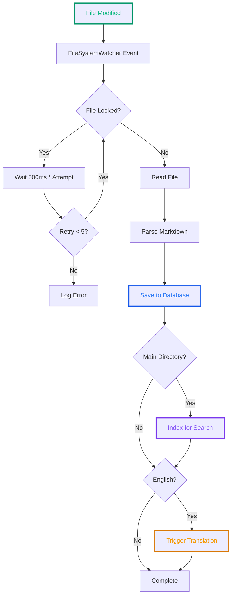
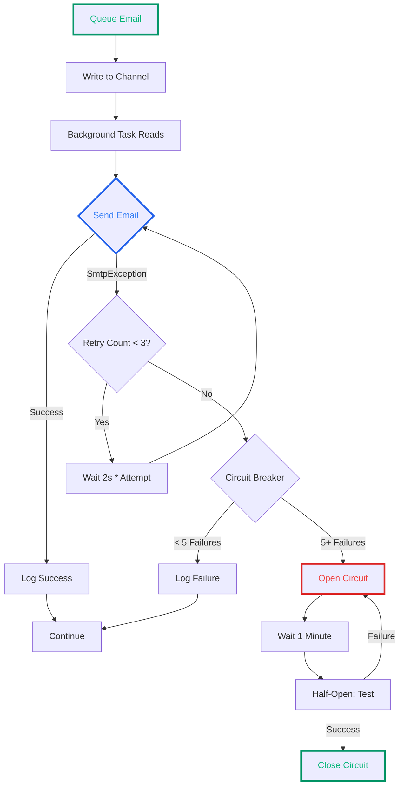
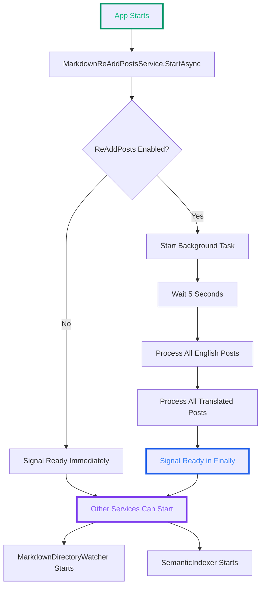

# Background Services in ASP.NET Core - Part 2: Practical Examples

<!--category-- ASP.NET Core, IHostedService, BackgroundService, Channels, Polly -->
<datetime class="hidden">2025-11-27T09:30</datetime>

Theory is one thing; production code is another. In Part 1 we covered the abstractions—now let's see how they're applied in a real codebase. This article walks through actual background services from this blog platform: file watchers with Polly retry policies, channel-based email queues with circuit breakers, semantic search indexers with hash-based change detection, and more.

# Introduction

In [Part 1](/blog/background-services-in-aspnetcore-part1), we explored the fundamental approaches to implementing background services in ASP.NET Core. We covered `IHostedService`, `BackgroundService`, lifecycle management, and the common pitfalls around shutdown handling.

Now it's time to see these patterns in action. In this article, we'll examine real background services from a production blog platform, demonstrating:

- File system watchers that sync markdown files to a database
- Channel-based email queues with Polly retry policies
- Analytics event senders that batch background requests
- Semantic search indexers with hash-based change detection
- Broken link checkers that periodically validate external URLs
- Startup coordination between dependent services
- Scoping and Entity Framework lifecycle management

Each example illustrates practical solutions to common problems you'll encounter when building production background services.

[TOC]

# Example 1: File System Watcher with Polly Retry

The first service we'll examine watches a directory of markdown blog posts and automatically processes them when they change. This is a perfect example of event-driven background processing.

## The Problem

When a markdown file is created or modified:
1. Read the file contents
2. Parse markdown metadata (title, categories, publish date)
3. Render to HTML and extract plain text
4. Save to the database
5. Trigger translation to other languages
6. Index for semantic search

The challenge: [`FileSystemWatcher`](https://learn.microsoft.com/en-us/dotnet/api/system.io.filesystemwatcher) events can fire whilst the file is still being written, causing `IOException` when you try to read it.

## The Solution: MarkdownDirectoryWatcherService

```csharp
public class MarkdownDirectoryWatcherService(
    MarkdownConfig markdownConfig,
    IServiceScopeFactory serviceScopeFactory,
    IStartupCoordinator startupCoordinator,
    ILogger<MarkdownDirectoryWatcherService> logger)
    : IHostedService
{
    private FileSystemWatcher _fileSystemWatcher;
    private Task _awaitChangeTask = Task.CompletedTask;

    public Task StartAsync(CancellationToken cancellationToken)
    {
        _fileSystemWatcher = new FileSystemWatcher
        {
            Path = markdownConfig.MarkdownPath,
            NotifyFilter = NotifyFilters.FileName | NotifyFilters.LastWrite |
                          NotifyFilters.CreationTime | NotifyFilters.Size,
            Filter = "*.md",
            IncludeSubdirectories = true
        };

        _fileSystemWatcher.EnableRaisingEvents = true;

        // Start background processing in a separate task
        _awaitChangeTask = Task.Run(() => AwaitChanges(cancellationToken), cancellationToken);

        logger.LogInformation("Started watching directory {Directory}", markdownConfig.MarkdownPath);

        // Signal ready - watcher is set up and listening
        startupCoordinator.SignalReady(StartupServiceNames.MarkdownDirectoryWatcher);

        return Task.CompletedTask;
    }

    public Task StopAsync(CancellationToken cancellationToken)
    {
        // Proper cleanup
        _fileSystemWatcher.EnableRaisingEvents = false;
        _fileSystemWatcher.Dispose();

        logger.LogInformation("Stopped watching directory");

        return Task.CompletedTask;
    }

    private async Task AwaitChanges(CancellationToken cancellationToken)
    {
        while (!cancellationToken.IsCancellationRequested)
        {
            var fileEvent = _fileSystemWatcher.WaitForChanged(WatcherChangeTypes.All);

            if (fileEvent.ChangeType == WatcherChangeTypes.Changed ||
                fileEvent.ChangeType == WatcherChangeTypes.Created)
            {
                await OnChangedAsync(fileEvent);
            }
            else if (fileEvent.ChangeType == WatcherChangeTypes.Deleted)
            {
                await OnDeletedAsync(fileEvent);
            }
            else if (fileEvent.ChangeType == WatcherChangeTypes.Renamed)
            {
                await OnRenamedAsync(fileEvent);
            }
        }
    }
}
```

Notice a few key patterns:

1. **IHostedService, not BackgroundService** - We need fine control over the watcher setup
2. **Separate background task** - The `StartAsync` returns immediately, processing happens in `AwaitChanges`
3. **Startup coordination** - Signals when it's ready for dependent services
4. **Proper disposal** - Disables and disposes the file system watcher in `StopAsync`

## Handling File Lock Issues with Polly

The most interesting part is how we handle files that are still being written. [Polly](https://github.com/App-vNext/Polly) is a .NET resilience library that provides retry policies, circuit breakers, and more:

```csharp
private async Task OnChangedAsync(WaitForChangedResult e)
{
    if (e.Name == null) return;

    // Serilog activity for distributed tracing
    using var activity = Log.Logger.StartActivity("Markdown File Changed {Name}", e.Name);

    // Define a retry policy for file access issues
    var retryPolicy = Policy
        .Handle<IOException>() // Only handle IO exceptions (like file in use)
        .WaitAndRetryAsync(5, retryAttempt => TimeSpan.FromMilliseconds(500 * retryAttempt),
            (exception, timeSpan, retryCount, context) =>
            {
                activity?.Activity?.SetTag("Retry Attempt", retryCount);
                logger.LogWarning(
                    "File is in use, retrying attempt {RetryCount} after {TimeSpan}",
                    retryCount, timeSpan);
            });

    try
    {
        var fileName = e.Name;
        var isTranslated = Path.GetFileNameWithoutExtension(e.Name).Contains(".");
        var language = MarkdownBaseService.EnglishLanguage;
        var directory = markdownConfig.MarkdownPath;

        if (isTranslated)
        {
            language = Path.GetFileNameWithoutExtension(e.Name).Split('.').Last();
            fileName = Path.GetFileName(fileName);
            directory = markdownConfig.MarkdownTranslatedPath;
        }

        var filePath = Path.Combine(directory, fileName);

        using var scope = serviceScopeFactory.CreateScope();
        var blogService = scope.ServiceProvider.GetRequiredService<IBlogService>();

        // Use the Polly retry policy
        await retryPolicy.ExecuteAsync(async () =>
        {
            // Read the file - might throw IOException if locked
            var markdown = await File.ReadAllTextAsync(filePath);

            var slug = Path.GetFileNameWithoutExtension(fileName);
            if (isTranslated)
            {
                slug = slug.Split('.').First();
            }

            // Save to database
            var savedModel = await blogService.SavePost(slug, language, markdown);

            activity?.Activity?.SetTag("Page Processed", savedModel.Slug);

            // Index in semantic search (only for main directory files)
            if (!e.Name.Contains(Path.DirectorySeparatorChar))
            {
                await IndexPostForSemanticSearchAsync(scope, savedModel, language);
            }

            // Trigger translation for English posts
            if (language == MarkdownBaseService.EnglishLanguage &&
                !string.IsNullOrEmpty(savedModel.Markdown))
            {
                var translateService = scope.ServiceProvider
                    .GetRequiredService<IBackgroundTranslateService>();
                await translateService.TranslateForAllLanguages(
                    new PageTranslationModel
                    {
                        OriginalFileName = filePath,
                        OriginalMarkdown = savedModel.Markdown,
                        Persist = true
                    });
            }
        });

        activity?.Complete();
    }
    catch (Exception exception)
    {
        activity?.Complete(LogEventLevel.Error, exception);
    }
}
```

**Key patterns here:**

1. **Polly retry policy** - Exponential backoff (500ms, 1s, 1.5s, 2s, 2.5s)
2. **Only retry IOException** - Other exceptions bubble up
3. **Scoped services** - Create a scope per file to avoid lifecycle issues
4. **Structured logging** - Using [Serilog](https://serilog.net/) activities for tracing
5. **Cascading operations** - Save → Index → Translate

The retry policy handles the common case where a text editor is still writing the file when the change event fires.

## Visual Flow



Register it in `Program.cs` (all hosted services follow this pattern):

```csharp
builder.Services.AddHostedService<MarkdownDirectoryWatcherService>();
```

[See the full implementation  here.](https://github.com/scottgal/mostlylucidweb/blob/main/Mostlylucid/Blog/WatcherService/MarkdownDirectoryWatcherService.cs)

# Example 2: Channel-Based Email Queue

Email sending is a classic use case for background services. You don't want to block an HTTP request whilst you negotiate SMTP, so you queue the email and send it in the background.

## The Problem

When a user submits a comment or contact form:
1. Validate and store the submission
2. Queue an email notification
3. Return response immediately (don't block on SMTP)
4. Send emails in the background with retry logic
5. Handle SMTP failures gracefully (circuit breaker)

## The Solution: EmailSenderHostedService

This service uses a [`Channel<T>`](https://learn.microsoft.com/en-us/dotnet/core/extensions/channels) for the queue and Polly for resilience:

```csharp
public class EmailSenderHostedService : IEmailSenderHostedService
{
    private readonly Channel<BaseEmailModel> _mailMessages =
        Channel.CreateUnbounded<BaseEmailModel>();
    private readonly CancellationTokenSource _cancellationTokenSource = new();
    private Task _sendTask = Task.CompletedTask;
    private readonly IEmailService _emailService;
    private readonly ILogger<EmailSenderHostedService> _logger;
    private readonly IAsyncPolicy _policyWrap;

    public EmailSenderHostedService(
        IEmailService emailService,
        ILogger<EmailSenderHostedService> logger)
    {
        _emailService = emailService;
        _logger = logger;

        // Retry policy: 3 attempts with exponential backoff
        var retryPolicy = Policy
            .Handle<SmtpException>()
            .WaitAndRetryAsync(3,
                attempt => TimeSpan.FromSeconds(2 * attempt),
                (exception, timeSpan, retryCount, context) =>
                {
                    logger.LogWarning(exception,
                        "Retry {RetryCount} for sending email failed", retryCount);
                });

        // Circuit breaker: open after 5 failures, stay open for 1 minute
        var circuitBreakerPolicy = Policy
            .Handle<SmtpException>()
            .CircuitBreakerAsync(
                5,
                TimeSpan.FromMinutes(1),
                onBreak: (exception, timespan) =>
                {
                    logger.LogError(
                        "Circuit broken due to too many failures. Breaking for {BreakDuration}",
                        timespan);
                },
                onReset: () =>
                {
                    logger.LogInformation("Circuit reset. Resuming email delivery.");
                },
                onHalfOpen: () =>
                {
                    logger.LogInformation("Circuit in half-open state. Testing connection...");
                });

        // Combine retry and circuit breaker
        _policyWrap = Policy.WrapAsync(retryPolicy, circuitBreakerPolicy);
    }

    public async Task SendEmailAsync(BaseEmailModel message)
    {
        await _mailMessages.Writer.WriteAsync(message);
    }

    public Task StartAsync(CancellationToken cancellationToken)
    {
        _logger.LogInformation("Starting background e-mail delivery");
        _sendTask = DeliverAsync(_cancellationTokenSource.Token);
        return Task.CompletedTask;
    }

    public async Task StopAsync(CancellationToken cancellationToken)
    {
        _logger.LogInformation("Stopping background e-mail delivery");

        // Proper shutdown sequence
        await _cancellationTokenSource.CancelAsync();
        _mailMessages.Writer.Complete(); // Critical: complete the channel

        // Wait for the background task to finish
        await Task.WhenAny(_sendTask, Task.Delay(Timeout.Infinite, cancellationToken));
    }

    private async Task DeliverAsync(CancellationToken token)
    {
        _logger.LogInformation("E-mail background delivery started");

        try
        {
            // Process items as they arrive
            while (await _mailMessages.Reader.WaitToReadAsync(token))
            {
                BaseEmailModel? message = null;
                try
                {
                    message = await _mailMessages.Reader.ReadAsync(token);

                    // Execute with retry policy and circuit breaker
                    await _policyWrap.ExecuteAsync(async () =>
                    {
                        switch (message)
                        {
                            case ContactEmailModel contactEmailModel:
                                await _emailService.SendContactEmail(contactEmailModel);
                                break;
                            case CommentEmailModel commentEmailModel:
                                await _emailService.SendCommentEmail(commentEmailModel);
                                break;
                            case ConfirmEmailModel confirmEmailModel:
                                await _emailService.SendConfirmationEmail(confirmEmailModel);
                                break;
                        }
                    });

                    _logger.LogInformation("Email from {SenderEmail} sent", message.SenderEmail);
                }
                catch (OperationCanceledException)
                {
                    break; // Shutdown requested
                }
                catch (Exception exc)
                {
                    _logger.LogError(exc,
                        "Couldn't send an e-mail from {SenderEmail}",
                        message?.SenderEmail);
                }
            }
        }
        catch (OperationCanceledException)
        {
            _logger.LogWarning("E-mail background delivery canceled");
        }

        _logger.LogInformation("E-mail background delivery stopped");
    }

    public void Dispose()
    {
        _cancellationTokenSource.Dispose();
    }
}
```

**Key patterns demonstrated:**

1. **Channel as queue** - Unbounded channel for messages
2. **Policy wrapping** - Retry inside circuit breaker
3. **Graceful shutdown** - Complete channel, cancel token, wait for task
4. **Pattern matching** - Switch on different email types
5. **Scoped lifetime** - Created once as singleton, holds long-lived state

## Retry and Circuit Breaker Visualised



This demonstrates a production-grade pattern:
- **Retry policy** handles transient failures (temporary network issues)
- **Circuit breaker** prevents cascading failures (if SMTP is down, don't keep hammering it)
- **Channel** provides natural backpressure (if we can't send, messages queue up)

# Example 3: Analytics Event Sender (Umami)

This service queues analytics events and sends them to an [Umami](https://umami.is/) analytics server. It's similar to the email service but simpler—no retry policy needed, just fire and forget.

```csharp
public class UmamiBackgroundSender(
    IServiceScopeFactory scopeFactory,
    ILogger<UmamiBackgroundSender> logger) : IHostedService
{
    private readonly CancellationTokenSource _cancellationTokenSource = new();
    private readonly Channel<SendBackgroundPayload> _channel =
        Channel.CreateUnbounded<SendBackgroundPayload>();
    private Task _sendTask = Task.CompletedTask;

    public Task StartAsync(CancellationToken cancellationToken)
    {
        _sendTask = SendRequest(_cancellationTokenSource.Token);
        return Task.CompletedTask;
    }

    public async Task StopAsync(CancellationToken cancellationToken)
    {
        logger.LogInformation("UmamiBackgroundSender is stopping.");

        // Standard shutdown pattern
        await _cancellationTokenSource.CancelAsync();
        _channel.Writer.Complete();

        try
        {
            await Task.WhenAny(_sendTask, Task.Delay(Timeout.Infinite, cancellationToken));
        }
        catch (OperationCanceledException)
        {
            logger.LogWarning("StopAsync operation was canceled.");
        }
    }

    public async Task TrackPageView(string url, string title, UmamiPayload? payload = null)
    {
        await using var scope = scopeFactory.CreateAsyncScope();
        var payloadService = scope.ServiceProvider.GetRequiredService<PayloadService>();
        var sendPayload = payloadService.PopulateFromPayload(payload, null);
        sendPayload.Url = url;
        sendPayload.Title = title;

        await _channel.Writer.WriteAsync(new SendBackgroundPayload("event", sendPayload));
        logger.LogInformation("Umami pageview event queued");
    }

    private async Task SendRequest(CancellationToken token)
    {
        logger.LogInformation("Umami background delivery started");

        // Double while loop: outer waits for items, inner drains all available
        while (await _channel.Reader.WaitToReadAsync(token))
        {
            while (_channel.Reader.TryRead(out var payload))
            {
                try
                {
                    using var scope = scopeFactory.CreateScope();
                    var client = scope.ServiceProvider.GetRequiredService<UmamiClient>();

                    await client.Send(payload.Payload, type: payload.EventType);

                    logger.LogInformation("Umami background event sent: {EventType}",
                        payload.EventType);
                }
                catch (OperationCanceledException)
                {
                    logger.LogWarning("Umami background delivery canceled.");
                    return;
                }
                catch (Exception ex)
                {
                    logger.LogError(ex, "Error sending Umami background event.");
                }
            }
        }
    }

    private record SendBackgroundPayload(string EventType, UmamiPayload Payload);
}
```

**Key differences from the email service:**

1. **No resilience policies** - Analytics aren't critical, if it fails we just log and continue
2. **Double while loop** - Inner loop drains all available items for efficiency
3. **Scoped service creation** - Each send gets a fresh scope for the HTTP client

This demonstrates that not all background services need complex error handling. For non-critical telemetry, simple logging might be enough.

# Example 4: Periodic Background Work with BackgroundService

Now let's look at services that do periodic work rather than processing queues. The `BrokenLinkCheckerBackgroundService` checks blog post links periodically and fetches archive.org URLs for broken ones.

```csharp
public class BrokenLinkCheckerBackgroundService : BackgroundService
{
    private readonly IServiceProvider _serviceProvider;
    private readonly ILogger<BrokenLinkCheckerBackgroundService> _logger;
    private readonly HttpClient _httpClient;
    private readonly TimeSpan _checkInterval = TimeSpan.FromHours(1);
    private const int BatchSize = 20;

    public BrokenLinkCheckerBackgroundService(
        IServiceProvider serviceProvider,
        ILogger<BrokenLinkCheckerBackgroundService> logger,
        IHttpClientFactory httpClientFactory)
    {
        _serviceProvider = serviceProvider;
        _logger = logger;
        _httpClient = httpClientFactory.CreateClient("BrokenLinkChecker");
        _httpClient.Timeout = TimeSpan.FromSeconds(30);
    }

    protected override async Task ExecuteAsync(CancellationToken stoppingToken)
    {
        _logger.LogInformation("Broken Link Checker Background Service started");

        // Initial delay to let the application fully start
        await Task.Delay(TimeSpan.FromMinutes(5), stoppingToken);

        while (!stoppingToken.IsCancellationRequested)
        {
            try
            {
                await CheckLinksAsync(stoppingToken);
                await FetchArchiveUrlsAsync(stoppingToken);
            }
            catch (Exception ex)
            {
                _logger.LogError(ex, "Error in Broken Link Checker Background Service");
            }

            _logger.LogInformation("Broken Link Checker sleeping for {Interval}", _checkInterval);
            await Task.Delay(_checkInterval, stoppingToken);
        }

        _logger.LogInformation("Broken Link Checker Background Service stopped");
    }

    private async Task CheckLinksAsync(CancellationToken cancellationToken)
    {
        _logger.LogInformation("Starting link validity check");

        using var scope = _serviceProvider.CreateScope();
        var brokenLinkService = scope.ServiceProvider.GetRequiredService<IBrokenLinkService>();

        var linksToCheck = await brokenLinkService.GetLinksToCheckAsync(BatchSize, cancellationToken);
        _logger.LogInformation("Found {Count} links to check", linksToCheck.Count);

        foreach (var link in linksToCheck)
        {
            if (cancellationToken.IsCancellationRequested) break;

            try
            {
                var (statusCode, isBroken, error) = await CheckUrlAsync(link.OriginalUrl, cancellationToken);
                await brokenLinkService.UpdateLinkStatusAsync(
                    link.Id, statusCode, isBroken, error, cancellationToken);

                if (isBroken)
                {
                    _logger.LogWarning("Link is broken: {Url} (Status: {StatusCode})",
                        link.OriginalUrl, statusCode);
                }

                // Be respectful to servers
                await Task.Delay(TimeSpan.FromSeconds(2), cancellationToken);
            }
            catch (Exception ex)
            {
                _logger.LogError(ex, "Error checking link: {Url}", link.OriginalUrl);
                await brokenLinkService.UpdateLinkStatusAsync(
                    link.Id, 0, true, ex.Message, cancellationToken);
            }
        }
    }

    private async Task<(int statusCode, bool isBroken, string? error)> CheckUrlAsync(
        string url,
        CancellationToken cancellationToken)
    {
        try
        {
            using var request = new HttpRequestMessage(HttpMethod.Head, url);
            request.Headers.UserAgent.ParseAdd(
                "Mozilla/5.0 (compatible; MostlylucidBot/1.0; +https://www.mostlylucid.net)");

            using var response = await _httpClient.SendAsync(
                request,
                HttpCompletionOption.ResponseHeadersRead,
                cancellationToken);

            var statusCode = (int)response.StatusCode;
            var isBroken = response.StatusCode == HttpStatusCode.NotFound ||
                          response.StatusCode == HttpStatusCode.Gone ||
                          statusCode >= 500;

            return (statusCode, isBroken, null);
        }
        catch (HttpRequestException ex)
        {
            return (0, true, ex.Message);
        }
        catch (TaskCanceledException ex) when (ex.InnerException is TimeoutException)
        {
            return (0, true, "Request timed out");
        }
    }
}
```

**Patterns demonstrated:**

1. **BackgroundService base class** - Perfect for periodic work
2. **Initial delay** - Wait for other services to initialise
3. **Batching** - Process 20 links at a time, not all at once
4. **Rate limiting** - 2-second delay between checks to be polite
5. **Scoped service creation** - New scope per batch
6. **Cancellation token checking** - Break early if shutdown requested

# Example 5: Semantic Search Indexing with Hash-Based Change Detection

The semantic search indexer is more sophisticated—it only re-indexes posts that have actually changed. This saves expensive embedding API calls.

```csharp
public class SemanticIndexingBackgroundService : BackgroundService
{
    private readonly ILogger<SemanticIndexingBackgroundService> _logger;
    private readonly IServiceProvider _serviceProvider;
    private readonly ISemanticSearchService _semanticSearchService;
    private readonly MarkdownConfig _markdownConfig;
    private readonly SemanticSearchConfig _semanticSearchConfig;
    private readonly TimeSpan _indexInterval = TimeSpan.FromHours(1);
    private readonly TimeSpan _startupDelay = TimeSpan.FromSeconds(30);

    protected override async Task ExecuteAsync(CancellationToken stoppingToken)
    {
        if (!_semanticSearchConfig.Enabled)
        {
            _logger.LogInformation("Semantic search is disabled, indexing service will not run");
            return;
        }

        _logger.LogInformation("Semantic indexing background service starting...");

        // Wait for other services to initialise
        await Task.Delay(_startupDelay, stoppingToken);

        // Initialise the semantic search service
        try
        {
            await _semanticSearchService.InitializeAsync(stoppingToken);
            _logger.LogInformation("Semantic search initialized successfully");
        }
        catch (Exception ex)
        {
            _logger.LogError(ex, "Failed to initialize semantic search service");
            return;
        }

        // Initial indexing
        await IndexAllMarkdownFilesAsync(stoppingToken);

        // Periodic re-indexing to catch any changes
        while (!stoppingToken.IsCancellationRequested)
        {
            try
            {
                await Task.Delay(_indexInterval, stoppingToken);
                await IndexAllMarkdownFilesAsync(stoppingToken);
            }
            catch (OperationCanceledException)
            {
                break;
            }
            catch (Exception ex)
            {
                _logger.LogError(ex, "Error during periodic indexing");
            }
        }

        _logger.LogInformation("Semantic indexing background service stopped");
    }

    private async Task IndexAllMarkdownFilesAsync(CancellationToken stoppingToken)
    {
        var markdownPath = _markdownConfig.MarkdownPath;

        if (!Directory.Exists(markdownPath))
        {
            _logger.LogWarning("Markdown directory does not exist: {Path}", markdownPath);
            return;
        }

        // Get ONLY files in the main directory, NOT subdirectories
        var markdownFiles = Directory.GetFiles(markdownPath, "*.md", SearchOption.TopDirectoryOnly);

        _logger.LogInformation("Found {Count} markdown files to index in {Path}",
            markdownFiles.Length, markdownPath);

        var indexedCount = 0;
        var skippedCount = 0;
        var errorCount = 0;

        using var scope = _serviceProvider.CreateScope();
        var markdownRenderingService = scope.ServiceProvider
            .GetRequiredService<MarkdownRenderingService>();

        foreach (var filePath in markdownFiles)
        {
            if (stoppingToken.IsCancellationRequested)
                break;

            try
            {
                var result = await IndexMarkdownFileAsync(
                    filePath,
                    markdownRenderingService,
                    stoppingToken);

                if (result == IndexResult.Indexed)
                    indexedCount++;
                else if (result == IndexResult.Skipped)
                    skippedCount++;
            }
            catch (Exception ex)
            {
                errorCount++;
                _logger.LogError(ex, "Error indexing file: {FilePath}", filePath);
            }

            // Delay to avoid overwhelming the embedding service
            await Task.Delay(100, stoppingToken);
        }

        _logger.LogInformation(
            "Indexing complete: {Indexed} indexed, {Skipped} skipped (unchanged), {Errors} errors",
            indexedCount, skippedCount, errorCount);
    }

    private async Task<IndexResult> IndexMarkdownFileAsync(
        string filePath,
        MarkdownRenderingService markdownRenderingService,
        CancellationToken stoppingToken)
    {
        var fileName = Path.GetFileNameWithoutExtension(filePath);

        // Skip translated files (they have language suffix like .es.md, .fr.md)
        if (fileName.Contains('.'))
        {
            var parts = fileName.Split('.');
            if (parts.Length >= 2 && parts[^1].Length == 2)
            {
                return IndexResult.Skipped;
            }
        }

        var markdown = await File.ReadAllTextAsync(filePath, stoppingToken);
        var fileInfo = new FileInfo(filePath);

        var blogPost = markdownRenderingService.GetPageFromMarkdown(
            markdown,
            fileInfo.LastWriteTimeUtc,
            filePath);

        if (blogPost.IsHidden)
        {
            _logger.LogDebug("Skipping hidden post: {Slug}", blogPost.Slug);
            return IndexResult.Skipped;
        }

        // Compute content hash
        var contentHash = ComputeContentHash(blogPost.PlainTextContent);

        // Check if reindexing is needed
        var needsReindex = await _semanticSearchService.NeedsReindexingAsync(
            blogPost.Slug,
            MarkdownBaseService.EnglishLanguage,
            contentHash,
            stoppingToken);

        if (!needsReindex)
        {
            _logger.LogDebug("Skipping unchanged post: {Slug}", blogPost.Slug);
            return IndexResult.Skipped;
        }

        // Create document for indexing
        var document = new BlogPostDocument
        {
            Id = $"{blogPost.Slug}_{MarkdownBaseService.EnglishLanguage}",
            Slug = blogPost.Slug,
            Title = blogPost.Title,
            Content = blogPost.PlainTextContent,
            Language = MarkdownBaseService.EnglishLanguage,
            Categories = blogPost.Categories.ToList(),
            PublishedDate = blogPost.PublishedDate,
            ContentHash = contentHash
        };

        await _semanticSearchService.IndexPostAsync(document, stoppingToken);
        _logger.LogInformation("Indexed post: {Slug}", blogPost.Slug);

        return IndexResult.Indexed;
    }

    private static string ComputeContentHash(string content)
    {
        using var sha256 = SHA256.Create();
        var bytes = Encoding.UTF8.GetBytes(content);
        var hashBytes = sha256.ComputeHash(bytes);
        return Convert.ToBase64String(hashBytes);
    }

    private enum IndexResult
    {
        Indexed,
        Skipped
    }
}
```

**Key patterns:**

1. **Configuration-driven** - Only runs if semantic search is enabled
2. **Hash-based change detection** - SHA256 hash of content, skip if unchanged
3. **Rate limiting** - 100ms delay between indexing operations
4. **Filtered processing** - Skip translated files and hidden posts
5. **Detailed metrics** - Track indexed/skipped/error counts

# Example 6: Startup Coordination

The final example shows how services can coordinate their startup. The `MarkdownReAddPostsService` re-processes all markdown files on startup (useful after schema changes), but signals when it's ready so other services know they can proceed.

```csharp
public class MarkdownReAddPostsService(
    MarkdownConfig markdownConfig,
    IServiceScopeFactory serviceScopeFactory,
    IStartupCoordinator startupCoordinator,
    ILogger<MarkdownReAddPostsService> logger) : IHostedService
{
    public async Task StartAsync(CancellationToken cancellationToken)
    {
        if (!markdownConfig.ReAddPosts)
        {
            logger.LogInformation("ReAddPosts is disabled, skipping bulk post re-add");
            // Signal ready immediately since we're not doing anything
            startupCoordinator.SignalReady(StartupServiceNames.MarkdownReAddPosts);
            return;
        }

        logger.LogWarning("ReAddPosts is ENABLED - re-processing ALL markdown posts on startup");

        // Run in background so it doesn't block startup
        _ = Task.Run(async () =>
        {
            try
            {
                // Small delay to let other services initialize
                await Task.Delay(TimeSpan.FromSeconds(5), cancellationToken);
                await ReAddAllPostsAsync(cancellationToken);
            }
            finally
            {
                // Signal ready when complete (even if there were errors)
                startupCoordinator.SignalReady(StartupServiceNames.MarkdownReAddPosts);
            }
        }, cancellationToken);
    }

    public Task StopAsync(CancellationToken cancellationToken) => Task.CompletedTask;

    private async Task ReAddAllPostsAsync(CancellationToken cancellationToken)
    {
        using var activity = Log.Logger.StartActivity("ReAdd All Posts");
        var stopwatch = Stopwatch.StartNew();

        try
        {
            using var scope = serviceScopeFactory.CreateScope();
            var blogService = scope.ServiceProvider.GetRequiredService<IBlogService>();
            var markdownBlogService = scope.ServiceProvider.GetRequiredService<IMarkdownBlogService>();
            var semanticSearchService = scope.ServiceProvider.GetService<ISemanticSearchService>();

            // Process English files
            var markdownFiles = Directory.GetFiles(
                markdownConfig.MarkdownPath,
                "*.md",
                SearchOption.TopDirectoryOnly);

            logger.LogInformation("Found {Count} English markdown files to process",
                markdownFiles.Length);

            int processed = 0;
            int failed = 0;

            foreach (var filePath in markdownFiles)
            {
                if (cancellationToken.IsCancellationRequested) break;

                var slug = Path.GetFileNameWithoutExtension(filePath);
                try
                {
                    var blogModel = await markdownBlogService.GetPage(filePath);
                    blogModel.Language = MarkdownBaseService.EnglishLanguage;
                    await blogService.SavePost(blogModel);

                    // Index in semantic search
                    if (semanticSearchService != null)
                    {
                        await IndexPostAsync(semanticSearchService, blogModel,
                            MarkdownBaseService.EnglishLanguage);
                    }

                    processed++;
                    if (processed % 10 == 0)
                    {
                        logger.LogInformation("Processed {Count}/{Total} English posts",
                            processed, markdownFiles.Length);
                    }
                }
                catch (Exception ex)
                {
                    failed++;
                    logger.LogError(ex, "Failed to process {Slug}", slug);
                }
            }

            // Process translated files
            var translatedFiles = Directory.GetFiles(
                markdownConfig.MarkdownTranslatedPath,
                "*.md",
                SearchOption.TopDirectoryOnly);

            logger.LogInformation("Found {Count} translated markdown files to process",
                translatedFiles.Length);

            int translatedProcessed = 0;
            int translatedFailed = 0;

            foreach (var filePath in translatedFiles)
            {
                if (cancellationToken.IsCancellationRequested) break;

                var fileNameWithoutExt = Path.GetFileNameWithoutExtension(filePath);
                if (!fileNameWithoutExt.Contains(".")) continue;

                var parts = fileNameWithoutExt.Split('.');
                var slug = parts[0];
                var language = parts[^1];

                try
                {
                    var blogModel = await markdownBlogService.GetPage(filePath);
                    blogModel.Language = language;
                    await blogService.SavePost(blogModel);

                    if (semanticSearchService != null)
                    {
                        await IndexPostAsync(semanticSearchService, blogModel, language);
                    }

                    translatedProcessed++;
                    if (translatedProcessed % 50 == 0)
                    {
                        logger.LogInformation("Processed {Count}/{Total} translated posts",
                            translatedProcessed, translatedFiles.Length);
                    }
                }
                catch (Exception ex)
                {
                    translatedFailed++;
                    logger.LogError(ex, "Failed to process translated post {Slug} ({Language})",
                        slug, language);
                }
            }

            stopwatch.Stop();

            activity?.Activity?.SetTag("English Processed", processed);
            activity?.Activity?.SetTag("English Failed", failed);
            activity?.Activity?.SetTag("Translated Processed", translatedProcessed);
            activity?.Activity?.SetTag("Translated Failed", translatedFailed);
            activity?.Activity?.SetTag("Duration", stopwatch.Elapsed.ToString());
            activity?.Complete();

            logger.LogWarning(
                "ReAddPosts completed in {Duration}. English: {EnglishProcessed}/{EnglishTotal}, Translated: {TranslatedProcessed}/{TranslatedTotal}",
                stopwatch.Elapsed,
                processed, markdownFiles.Length,
                translatedProcessed, translatedFiles.Length);
        }
        catch (Exception ex)
        {
            activity?.Complete(LogEventLevel.Error, ex);
            logger.LogError(ex, "Error during ReAddPosts");
        }
    }
}
```

**Key patterns:**

1. **Startup coordination** - Signals when ready for dependent services
2. **Fire and forget with finally** - Task.Run with finally block ensures signal
3. **Progress logging** - Log every 10 English posts, every 50 translated posts
4. **Structured activity** - Serilog activity with tags for observability
5. **Two-phase processing** - English files first, then translated files

## Coordination Flow



You'll notice every example above uses `IServiceScopeFactory` to create scopes. This isn't optional—it's essential for working with Entity Framework and other scoped services. Let's dig into why.

# Background Services and Scoping

One of the trickiest aspects of background services is managing service lifetimes—particularly with [Entity Framework Core](https://learn.microsoft.com/en-us/ef/core/). Here's what you need to know.

## The Problem: Singleton vs Scoped

Background services registered with `AddHostedService<T>()` are **singletons**. They're created once and live for the entire application lifetime. But many services you'll want to use are **scoped**:

- `DbContext` - Scoped by default (and for good reason)
- `IHttpContextAccessor` - Scoped to the HTTP request
- Any service registered with `AddScoped<T>()`

If you try to inject a scoped service into a singleton, you'll get this exception:

```
Cannot consume scoped service 'YourDbContext' from singleton 'YourBackgroundService'
```

## Why DbContext is Scoped

Entity Framework's `DbContext` tracks entities and manages database connections. It's designed to be short-lived:

```csharp
// BAD: DbContext lives forever, accumulates tracked entities,
// connections may timeout, change tracking becomes stale
public class BrokenService : BackgroundService
{
    private readonly MyDbContext _dbContext; // Injected once, lives forever

    public BrokenService(MyDbContext dbContext)
    {
        _dbContext = dbContext; // This context will never be disposed!
    }
}
```

Problems with a long-lived DbContext:
- **Memory leaks** - Tracked entities accumulate
- **Stale data** - Change tracker doesn't see external changes
- **Connection issues** - Connections may timeout or be recycled
- **Concurrency bugs** - DbContext isn't thread-safe

## The Solution: IServiceScopeFactory

Every example in this article uses the same pattern—create a scope for each unit of work:

```csharp
public class CorrectService : BackgroundService
{
    private readonly IServiceScopeFactory _scopeFactory;

    public CorrectService(IServiceScopeFactory scopeFactory)
    {
        _scopeFactory = scopeFactory; // This is a singleton, safe to inject
    }

    protected override async Task ExecuteAsync(CancellationToken stoppingToken)
    {
        while (!stoppingToken.IsCancellationRequested)
        {
            // Create a new scope for each iteration
            using var scope = _scopeFactory.CreateScope();
            var dbContext = scope.ServiceProvider.GetRequiredService<MyDbContext>();

            // DbContext is fresh, will be disposed when scope ends
            await ProcessWorkAsync(dbContext, stoppingToken);

            await Task.Delay(TimeSpan.FromMinutes(5), stoppingToken);
        }
        // Scope disposed here - DbContext disposed, connections returned to pool
    }
}
```

## Scope Granularity

How often should you create a new scope? It depends on your workload:

**Per iteration** (most common):
```csharp
while (!stoppingToken.IsCancellationRequested)
{
    using var scope = _scopeFactory.CreateScope();
    // Process batch...
}
```

**Per item** (when processing a queue):
```csharp
await foreach (var item in channel.Reader.ReadAllAsync(stoppingToken))
{
    using var scope = _scopeFactory.CreateScope();
    // Process single item...
}
```

**Per batch** (when you need transaction semantics):
```csharp
var items = await GetBatchAsync(100);
using var scope = _scopeFactory.CreateScope();
var dbContext = scope.ServiceProvider.GetRequiredService<MyDbContext>();

await using var transaction = await dbContext.Database.BeginTransactionAsync();
foreach (var item in items)
{
    // Process within same transaction...
}
await transaction.CommitAsync();
```

## Async Scopes

For async operations, prefer `CreateAsyncScope()` which properly handles async disposal:

```csharp
await using var scope = _scopeFactory.CreateAsyncScope();
var dbContext = scope.ServiceProvider.GetRequiredService<MyDbContext>();
await dbContext.SaveChangesAsync(stoppingToken);
// Scope disposed asynchronously
```

## Common Mistakes

**1. Capturing scoped services in closures:**
```csharp
// BAD: dbContext captured, will outlive its scope
var dbContext = scope.ServiceProvider.GetRequiredService<MyDbContext>();
_ = Task.Run(async () =>
{
    await Task.Delay(10000);
    await dbContext.SaveChangesAsync(); // Scope already disposed!
});
```

**2. Reusing a scope across async boundaries:**
```csharp
// BAD: Scope should match unit of work
using var scope = _scopeFactory.CreateScope();
while (!stoppingToken.IsCancellationRequested)
{
    var dbContext = scope.ServiceProvider.GetRequiredService<MyDbContext>();
    await ProcessAsync(dbContext); // Same stale context every iteration
    await Task.Delay(TimeSpan.FromMinutes(5), stoppingToken);
}
```

**3. Forgetting to dispose:**
```csharp
// BAD: Scope never disposed, DbContext leaks
var scope = _scopeFactory.CreateScope();
var dbContext = scope.ServiceProvider.GetRequiredService<MyDbContext>();
await ProcessAsync(dbContext);
// Where's the dispose?
```

Always use `using` statements or `await using` for async scopes.

# Summary: Patterns Across All Examples

Looking across all these real-world services, several patterns emerge:

## 1. Proper Shutdown Handling

Every service follows the same shutdown pattern:

```csharp
public async Task StopAsync(CancellationToken cancellationToken)
{
    // 1. Cancel the cancellation token
    await _cancellationTokenSource.CancelAsync();

    // 2. Complete any channels
    _channel.Writer.Complete();

    // 3. Wait for background tasks with timeout
    await Task.WhenAny(_backgroundTask, Task.Delay(Timeout.Infinite, cancellationToken));
}
```

## 2. Scoped Service Creation

Background services are singletons, but they often need scoped services (like DbContext). Every example creates scopes:

```csharp
using var scope = _serviceProvider.CreateScope();
var scopedService = scope.ServiceProvider.GetRequiredService<IScopedService>();
```

## 3. Resilience Patterns

Different services use different resilience strategies:

- **Polly retry** - File system watcher (handles locked files)
- **Polly circuit breaker** - Email sender (prevents SMTP hammering)
- **Rate limiting** - Link checker and indexer (be polite to external services)
- **Hash-based change detection** - Semantic indexer (avoid expensive re-indexing)

## 4. Observability

Every service includes comprehensive logging:

- **Startup/shutdown events** - Always logged
- **Progress metrics** - Batch processing logs counts
- **Serilog activities** - For distributed tracing
- **Error logging with context** - Enough info to diagnose issues

## 5. Configuration-Driven Behaviour

Services check configuration:

```csharp
if (!_config.Enabled)
{
    _logger.LogInformation("Service is disabled");
    return;
}
```

This lets you enable/disable features without code changes.

# Conclusion

These real-world examples demonstrate that background services in ASP.NET Core can handle sophisticated scenarios:

- **Event-driven processing** with file system watchers
- **Queue-based processing** with channels
- **Periodic tasks** with BackgroundService
- **Resilient operations** with Polly policies
- **Coordinated startup** with custom coordination services
- **Efficient change detection** with content hashing

The most important lessons:

1. **Always complete channels and cancel tokens in StopAsync**
2. **Create scopes for scoped services**
3. **Choose the right resilience pattern for your scenario**
4. **Log comprehensively for observability**
5. **Handle OperationCanceledException gracefully**
6. **Use startup coordination when services depend on each other**

With these patterns, you can build production-grade background services that are resilient, observable, and easy to maintain.

# Further Reading

- [Part 1: Background Services Approaches](/blog/background-services-in-aspnetcore-part1)
- [Polly Documentation](https://github.com/App-vNext/Polly)
- [System.Threading.Channels](https://learn.microsoft.com/en-us/dotnet/core/extensions/channels)
- [Microsoft Docs: Worker Services](https://learn.microsoft.com/en-us/dotnet/core/extensions/workers)
