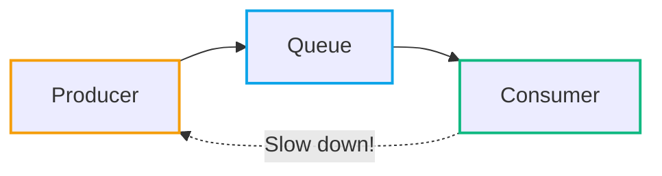
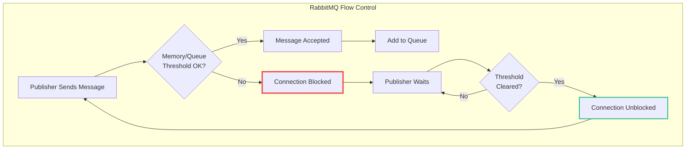
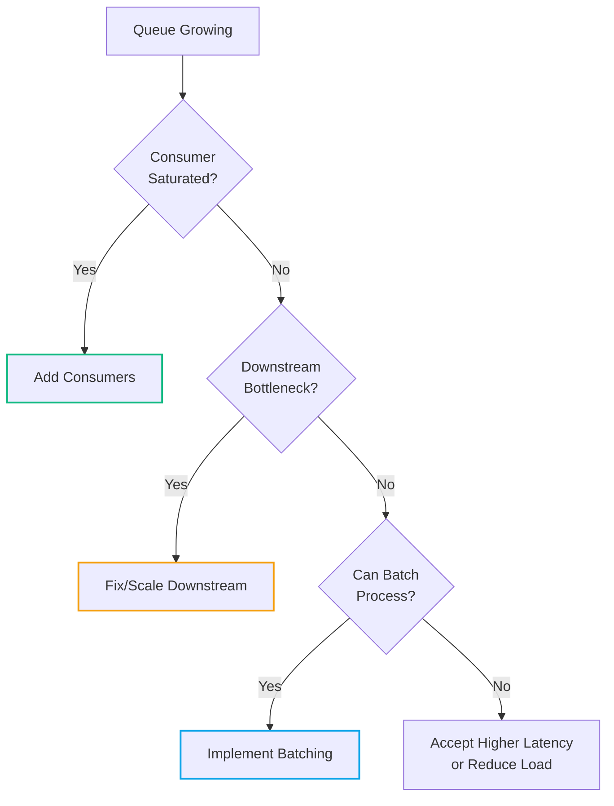

# Under Pressure: How Queueing Systems Handle Backpressure with Examples in C#

<datetime class="hidden">2025-11-22T14:00</datetime>
<!-- category -- Distributed Systems, RabbitMQ, C#, Messaging -->

Backpressure is the unsung hero of distributed systems. It's what keeps your queues from bursting at the seams when producers are firing messages faster than consumers can chew through them. Put simply: it's the system saying "hold on a moment" when things get too busy.

[TOC]

## What Backpressure Is

At its core, backpressure is a feedback loop that slows producers when consumers lag behind. Think of it like traffic lights on a slip road—you can't just pile onto the motorway whenever you fancy. The lights control the flow, letting cars merge safely without causing a pile-up.

Without backpressure, a fast producer will overwhelm a slow consumer. Messages pile up in queues, memory gets exhausted, and eventually your system falls over. Backpressure says "steady on" before disaster strikes.



The beauty of backpressure is that it's a *conversation* between producer and consumer. The consumer signals "I'm full, give me a minute" and the producer responds "No problem, I'll wait." It's polite, collaborative, and keeps everybody from falling over.

## How RabbitMQ Handles Backpressure

RabbitMQ has several built-in mechanisms for handling backpressure, and understanding them is crucial if you're building systems that need to stay upright under load.

### Flow Control

When RabbitMQ's memory usage or queue depth exceeds configured thresholds, it activates *flow control*. This temporarily blocks publisher connections—publishers can't send new messages until the broker has cleared enough backlog.



The key insight here is that RabbitMQ doesn't just drop messages when under pressure—it slows down the source. This is a much more civilised approach than silently discarding data.

### Consumer Acknowledgements

Consumers control the pace through acknowledgements (ACKs and NACKs). A message isn't removed from the queue until the consumer explicitly acknowledges it. If a consumer doesn't ACK messages fast enough, the queue grows—which eventually triggers flow control upstream.

You can also use *prefetch limits* to control how many unacknowledged messages a consumer can have in flight at once. This prevents a single slow consumer from hoarding messages.

```csharp
// Set prefetch count to limit unacknowledged messages
channel.BasicQos(prefetchSize: 0, prefetchCount: 10, global: false);
```

This tells RabbitMQ: "Only send me 10 messages at a time. Once I ACK some, you can send more." It's the consumer explicitly saying how much pressure it can handle.

## C# Code Examples

Right, let's get into the code. Here are practical examples of implementing and responding to backpressure in your C# applications.

### Queue Depth Monitoring

First things first—you can't manage what you can't measure. Here's how to check how many messages are waiting in a queue:

```csharp
var queue = channel.QueueDeclare(
    queue: "tasks",
    durable: true,
    exclusive: false,
    autoDelete: false);

Console.WriteLine($"Messages ready: {queue.MessageCount}");

// React to queue depth
if (queue.MessageCount > 1000)
{
    Console.WriteLine("Queue backing up - consider throttling producers");
}
```

This snippet checks how many messages are waiting. If the count climbs, that's your cue to throttle producers or scale up consumers. Don't worry about checking this too frequently—a periodic health check is usually sufficient.

### Publisher Confirms

Publisher confirms let you know when RabbitMQ has successfully received and processed your message. If acknowledgements slow down, that's a clear signal of backpressure:

```csharp
// Enable publisher confirms
channel.ConfirmSelect();

var body = Encoding.UTF8.GetBytes("Hello, Queue!");

channel.BasicPublish(
    exchange: "",
    routingKey: "tasks",
    basicProperties: null,
    body: body);

// Wait for confirmation - timeout indicates backpressure
bool confirmed = channel.WaitForConfirms(TimeSpan.FromSeconds(5));

if (!confirmed)
{
    Console.WriteLine("Message not confirmed - broker may be under pressure");
}
```

If RabbitMQ is struggling, confirmations take longer or time out entirely. Your producer can use this signal to back off rather than piling on more pressure.

For high-throughput scenarios, you'll want asynchronous confirms:

```csharp
channel.ConfirmSelect();

var outstandingConfirms = new ConcurrentDictionary<ulong, string>();

channel.BasicAcks += (sender, ea) =>
{
    if (ea.Multiple)
    {
        var confirmed = outstandingConfirms.Where(k => k.Key <= ea.DeliveryTag);
        foreach (var entry in confirmed)
        {
            outstandingConfirms.TryRemove(entry.Key, out _);
        }
    }
    else
    {
        outstandingConfirms.TryRemove(ea.DeliveryTag, out _);
    }
};

channel.BasicNacks += (sender, ea) =>
{
    // Message was rejected - implement retry logic
    Console.WriteLine($"Message {ea.DeliveryTag} was nacked - broker under pressure");
    // Back off before retrying
};
```

### Retry with Exponential Backoff

When you detect backpressure, the worst thing you can do is immediately retry at full speed. That's like responding to a traffic jam by pressing the accelerator harder. Instead, implement exponential backoff:

```csharp
public async Task PublishWithBackpressureAsync(
    IModel channel,
    byte[] body,
    int maxRetries = 5)
{
    int attempt = 0;

    while (attempt < maxRetries)
    {
        try
        {
            channel.ConfirmSelect();
            channel.BasicPublish(
                exchange: "",
                routingKey: "tasks",
                basicProperties: null,
                body: body);

            if (channel.WaitForConfirms(TimeSpan.FromSeconds(5)))
            {
                return; // Success
            }

            throw new Exception("Publish not confirmed");
        }
        catch (Exception ex)
        {
            attempt++;

            if (attempt >= maxRetries)
            {
                throw new Exception($"Failed to publish after {maxRetries} attempts", ex);
            }

            // Exponential backoff: 1s, 2s, 4s, 8s, 16s
            var delay = TimeSpan.FromSeconds(Math.Pow(2, attempt - 1));
            Console.WriteLine($"Backpressure detected - retry {attempt} after {delay}");

            await Task.Delay(delay);
        }
    }
}
```

This mimics HTTP's 429 (Too Many Requests) pattern. Instead of hammering the broker, we pause before retrying, giving the system time to recover.

### Using Channels for In-Process Backpressure

If you're building an internal pipeline (producer → processor → consumer all within your application), .NET's `Channel<T>` provides elegant backpressure support:

```csharp
// Create a bounded channel - backpressure is automatic
var channel = Channel.CreateBounded<WorkItem>(new BoundedChannelOptions(100)
{
    FullMode = BoundedChannelFullMode.Wait // Block producer when full
});

// Producer - will automatically wait when channel is full
async Task ProduceAsync(ChannelWriter<WorkItem> writer)
{
    for (int i = 0; i < 10000; i++)
    {
        var item = new WorkItem { Id = i };

        // This awaits if the channel is at capacity
        await writer.WriteAsync(item);

        Console.WriteLine($"Produced item {i}");
    }

    writer.Complete();
}

// Consumer - processes at its own pace
async Task ConsumeAsync(ChannelReader<WorkItem> reader)
{
    await foreach (var item in reader.ReadAllAsync())
    {
        // Simulate slow processing
        await Task.Delay(100);
        Console.WriteLine($"Processed item {item.Id}");
    }
}

// Run both concurrently
await Task.WhenAll(
    ProduceAsync(channel.Writer),
    ConsumeAsync(channel.Reader)
);
```

The bounded channel automatically applies backpressure—the producer blocks when the channel is full, naturally slowing down to match the consumer's pace. No manual throttling required.

### A Complete Backpressure-Aware Publisher

Here's a more complete example that brings together monitoring, confirms, and backoff:

```csharp
public class BackpressureAwarePublisher : IDisposable
{
    private readonly IConnection _connection;
    private readonly IModel _channel;
    private readonly string _queueName;
    private readonly int _queueDepthThreshold;

    public BackpressureAwarePublisher(
        string hostName,
        string queueName,
        int queueDepthThreshold = 1000)
    {
        var factory = new ConnectionFactory { HostName = hostName };
        _connection = factory.CreateConnection();
        _channel = _connection.CreateModel();
        _queueName = queueName;
        _queueDepthThreshold = queueDepthThreshold;

        _channel.QueueDeclare(
            queue: queueName,
            durable: true,
            exclusive: false,
            autoDelete: false);

        _channel.ConfirmSelect();
    }

    public async Task<bool> PublishAsync(byte[] body, CancellationToken ct = default)
    {
        // Check queue depth first
        var queueInfo = _channel.QueueDeclarePassive(_queueName);

        if (queueInfo.MessageCount > _queueDepthThreshold)
        {
            Console.WriteLine($"Queue depth {queueInfo.MessageCount} exceeds threshold - applying backpressure");

            // Wait for queue to drain a bit
            while (queueInfo.MessageCount > _queueDepthThreshold * 0.8)
            {
                await Task.Delay(1000, ct);
                queueInfo = _channel.QueueDeclarePassive(_queueName);
            }
        }

        // Publish with retry
        for (int attempt = 1; attempt <= 3; attempt++)
        {
            try
            {
                var properties = _channel.CreateBasicProperties();
                properties.Persistent = true;

                _channel.BasicPublish(
                    exchange: "",
                    routingKey: _queueName,
                    basicProperties: properties,
                    body: body);

                if (_channel.WaitForConfirms(TimeSpan.FromSeconds(5)))
                {
                    return true;
                }
            }
            catch (Exception ex)
            {
                Console.WriteLine($"Publish attempt {attempt} failed: {ex.Message}");
            }

            if (attempt < 3)
            {
                await Task.Delay(TimeSpan.FromSeconds(Math.Pow(2, attempt)), ct);
            }
        }

        return false;
    }

    public void Dispose()
    {
        _channel?.Dispose();
        _connection?.Dispose();
    }
}
```

## Best Practices

### Stay Calm

Don't panic when queues grow. A bit of depth is normal and healthy—it means your system is absorbing load spikes gracefully. The goal isn't an empty queue; it's a *stable* queue that doesn't grow unboundedly.

Monitor queue depth over time. Look for trends, not snapshots. A queue that's consistently at 100 messages is fine. A queue that's grown from 100 to 10,000 over the past hour needs attention.

### Be Pragmatic

Apply patterns pragmatically. Not every message needs publisher confirms. Not every queue needs sophisticated backpressure handling. A queue that processes 10 messages per hour probably doesn't need the same resilience engineering as one processing 10,000 per second.

Ask yourself: "What's the actual cost if this message is lost or delayed?" If the answer is "not much," don't over-engineer. If the answer is "significant financial or data integrity impact," invest in proper backpressure handling.

### Scale Smart

When queues are backing up, the answer isn't always "add more producers." That's like trying to fix a traffic jam by adding more cars.

Consider:
- **Scale consumers first** - can you add more workers to process the backlog?
- **Check for bottlenecks** - is one slow downstream dependency causing the backup?
- **Batch where possible** - can consumers process multiple messages at once?



### Monitor and Alert

Set up alerts for:
- Queue depth exceeding thresholds
- Consumer lag increasing
- Publisher confirms timing out
- Connection blocked events

You want to know about backpressure *before* it becomes a crisis, not when your system's already fallen over.

## Conclusion

Backpressure isn't just rate limiting—it's a survival tactic. By treating it as a conversation between producer and consumer, you build systems that stay resilient under pressure.

The key insights:

1. **Backpressure is feedback** - producers and consumers collaborating to find sustainable throughput
2. **Monitor queue depth** - you can't manage what you can't measure
3. **Use publisher confirms** - know when the broker is struggling
4. **Implement exponential backoff** - don't hammer a system that's already under pressure
5. **Scale consumers, not just producers** - fix the bottleneck, not the symptom

When your system says "I'm full, give me a minute," the correct response is "No problem, I'll wait." That's the essence of well-behaved distributed systems—polite, collaborative, and resilient.

Stay calm when queues grow a bit, and remember: a system under graceful backpressure is infinitely better than one that's fallen over entirely.
