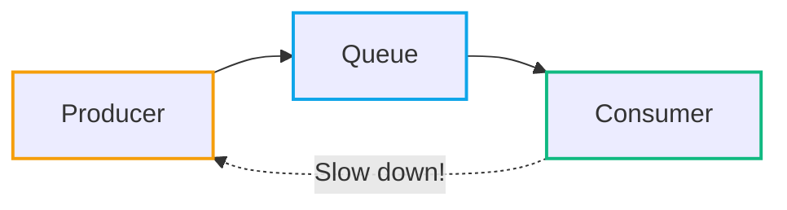
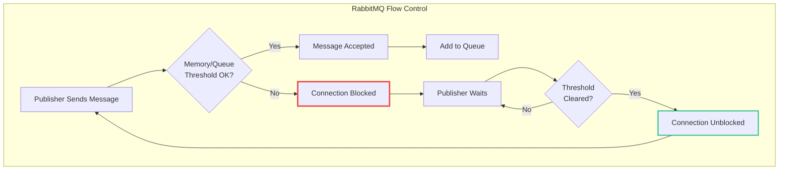
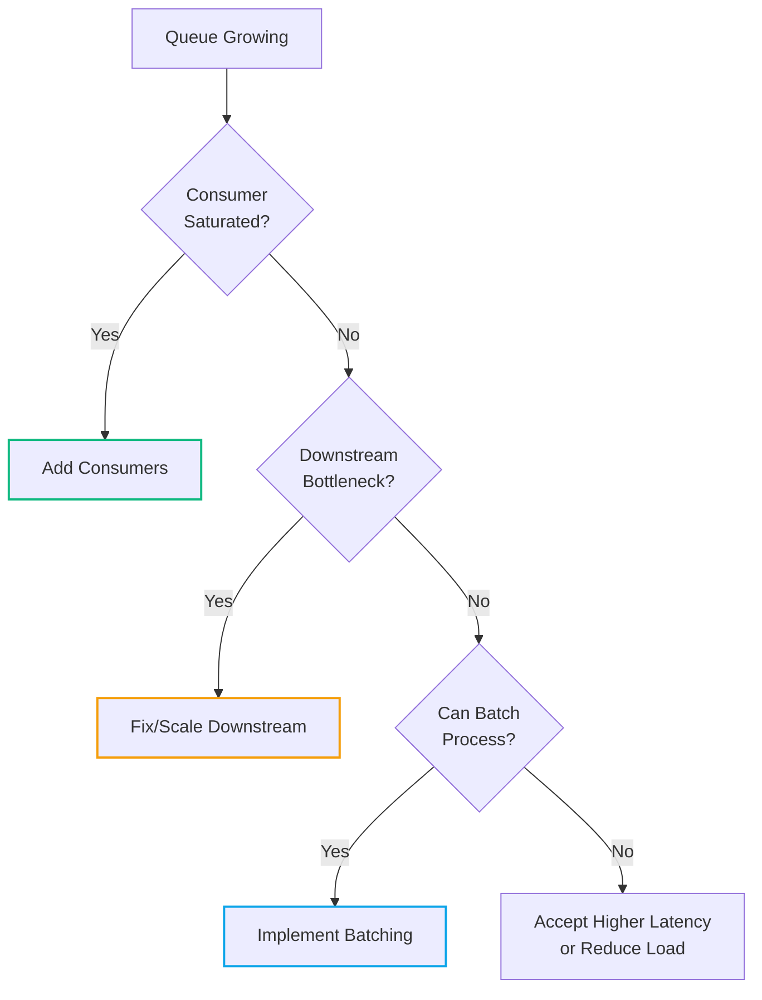

# Under Pressure: How Queueing Systems Handle Backpressure with Examples in C#

<datetime class="hidden">2025-11-23T14:00</datetime>
<!-- category -- Distributed Systems, RabbitMQ, Kafka, Azure Service Bus, C#, Messaging -->

Backpressure is the unsung hero of distributed systems. It's what keeps your queues from bursting at the seams when producers are firing messages faster than consumers can chew through them. Put simply: it's the system saying "hold on a moment" when things get too busy.

**Here's the thing:** the techniques in this article apply to virtually *every* message queue and service bus—RabbitMQ, Kafka, Azure Service Bus, AWS SQS, NATS, you name it. The specifics vary, but the principles are universal. I'll use RabbitMQ for most examples because it's what I know best, but I'll show you how these patterns translate across platforms.

> **A confession:** Even most senior developers don't implement proper backpressure handling. They build happy-path systems that work fine in dev and staging, then wonder why production falls over during Black Friday. Backpressure handling is one of those techniques that separates "it works" from "it scales." If you're not thinking about it, you're building a system that will eventually fail under load.

[TOC]

## What Backpressure Is

At its core, backpressure is a feedback loop that slows producers when consumers lag behind. Think of it like traffic lights on a slip road—you can't just pile onto the motorway whenever you fancy. The lights control the flow, letting cars merge safely without causing a pile-up.

Without backpressure, a fast producer will overwhelm a slow consumer. Messages pile up in queues, memory gets exhausted, and eventually your system falls over. Backpressure says "steady on" before disaster strikes.



The beauty of backpressure is that it's a *conversation* between producer and consumer. The consumer signals "I'm full, give me a minute" and the producer responds "No problem, I'll wait." It's polite, collaborative, and keeps everybody from falling over.

## How RabbitMQ Handles Backpressure

[RabbitMQ](https://www.rabbitmq.com/) is an open-source message broker that implements the [Advanced Message Queuing Protocol (AMQP)](https://www.rabbitmq.com/tutorials/amqp-concepts). It's one of the most widely deployed message brokers, used by companies from startups to enterprises like Bloomberg, Pivotal, and VMware (who now maintain it).

**What RabbitMQ excels at:**
- **Complex routing** - Exchanges, bindings, and routing keys let you build sophisticated message routing topologies. Want messages to fan out to multiple queues? Route based on headers? Direct to specific consumers? RabbitMQ's [exchange types](https://www.rabbitmq.com/tutorials/amqp-concepts#exchanges) (direct, fanout, topic, headers) have you covered.
- **Reliability guarantees** - [Publisher confirms](https://www.rabbitmq.com/docs/confirms), [consumer acknowledgements](https://www.rabbitmq.com/docs/confirms#consumer-acknowledgements), and [persistent messages](https://www.rabbitmq.com/docs/persistence-conf) mean you can build systems where message loss is unacceptable.
- **Flexible deployment** - Run it on a single node for development, or deploy a [cluster](https://www.rabbitmq.com/docs/clustering) with [quorum queues](https://www.rabbitmq.com/docs/quorum-queues) for high availability in production.
- **Protocol support** - Beyond AMQP, RabbitMQ supports [MQTT](https://www.rabbitmq.com/docs/mqtt) (IoT), [STOMP](https://www.rabbitmq.com/docs/stomp) (simple text protocol), and has a [streams](https://www.rabbitmq.com/docs/streams) feature for Kafka-like append-only logs.

**When to consider alternatives:** If you need massive throughput with simpler routing (millions of messages/second), Kafka's log-based architecture may be more appropriate. If you're all-in on a cloud provider, their managed services (Azure Service Bus, AWS SQS) reduce operational overhead.

RabbitMQ has several built-in mechanisms for handling backpressure, and understanding them is crucial if you're building systems that need to stay upright under load. The [RabbitMQ documentation](https://www.rabbitmq.com/docs) is excellent—I'll link to specific pages as we go.

### Flow Control

When RabbitMQ's memory usage or queue depth exceeds configured thresholds, it activates [flow control](https://www.rabbitmq.com/docs/flow-control). This temporarily blocks publisher connections—publishers can't send new messages until the broker has cleared enough backlog. See also the docs on [memory alarms](https://www.rabbitmq.com/docs/memory) and [disk alarms](https://www.rabbitmq.com/docs/disk-alarms) which trigger flow control.



The key insight here is that RabbitMQ doesn't just drop messages when under pressure—it slows down the source. This is a much more civilised approach than silently discarding data.

### Consumer Acknowledgements

Consumers control the pace through [acknowledgements](https://www.rabbitmq.com/docs/confirms#consumer-acknowledgements) (ACKs and NACKs). A message isn't removed from the queue until the consumer explicitly acknowledges it. If a consumer doesn't ACK messages fast enough, the queue grows—which eventually triggers flow control upstream.

You can also use [prefetch limits](https://www.rabbitmq.com/docs/consumer-prefetch) (QoS) to control how many unacknowledged messages a consumer can have in flight at once. This prevents a single slow consumer from hoarding messages.

```csharp
// Set prefetch count to limit unacknowledged messages
channel.BasicQos(prefetchSize: 0, prefetchCount: 10, global: false);
```

This tells RabbitMQ: "Only send me 10 messages at a time. Once I ACK some, you can send more." It's the consumer explicitly saying how much pressure it can handle. The [.NET client documentation](https://www.rabbitmq.com/client-libraries/dotnet-api-guide) covers the API in detail.

## How Other Systems Handle Backpressure

The patterns are universal, but the implementations differ. Here's how some other popular messaging systems approach the same problem.

### Kafka: Consumer-Controlled Polling

[Apache Kafka](https://kafka.apache.org/) is a distributed event streaming platform designed for high-throughput, fault-tolerant messaging. Unlike traditional message brokers, Kafka stores messages in an append-only log and lets consumers track their own position (offset).

Kafka takes a fundamentally different approach—consumers *pull* messages rather than having them pushed. This makes backpressure implicit: if a consumer doesn't poll, it doesn't receive messages. The broker doesn't care; it just keeps the messages around until the consumer is ready. See the [Kafka Consumer documentation](https://kafka.apache.org/documentation/#consumerapi) for details on the polling model.

```csharp
// Kafka consumer with explicit backpressure control
using var consumer = new ConsumerBuilder<string, string>(config).Build();
consumer.Subscribe("orders");

while (!cancellationToken.IsCancellationRequested)
{
    // Only fetch what you can handle - this IS your backpressure
    var result = consumer.Consume(timeout: TimeSpan.FromSeconds(1));

    if (result != null)
    {
        await ProcessMessageAsync(result.Message.Value);

        // Manual commit = explicit acknowledgement
        consumer.Commit(result);
    }

    // If processing is slow, you simply poll less frequently
    // Kafka doesn't push more messages at you
}
```

The clever bit: Kafka's consumer groups automatically rebalance partitions. If one consumer falls behind, you can add more consumers to the group and partitions get redistributed. Backpressure becomes a scaling decision.

```csharp
// Control batch size to manage memory pressure
var config = new ConsumerConfig
{
    BootstrapServers = "localhost:9092",
    GroupId = "order-processors",
    AutoOffsetReset = AutoOffsetReset.Earliest,
    MaxPollIntervalMs = 300000,      // 5 mins max between polls
    MaxPartitionFetchBytes = 1048576, // 1MB max per partition fetch
    FetchMaxBytes = 52428800          // 50MB max total fetch
};
```

### Azure Service Bus: Concurrent Message Control

[Azure Service Bus](https://learn.microsoft.com/en-us/azure/service-bus-messaging/service-bus-messaging-overview) is Microsoft's fully managed enterprise message broker with queues and publish-subscribe topics. It's designed for decoupling applications and services in cloud-native architectures.

Azure Service Bus uses a `MaxConcurrentCalls` setting that's beautifully simple—it controls how many messages your processor handles simultaneously. Backpressure is automatic. The [message processing documentation](https://learn.microsoft.com/en-us/azure/service-bus-messaging/service-bus-performance-improvements) covers performance tuning in detail.

```csharp
var processor = client.CreateProcessor("orders-queue", new ServiceBusProcessorOptions
{
    // This IS your backpressure - only process 10 at a time
    MaxConcurrentCalls = 10,
    AutoCompleteMessages = false,
    PrefetchCount = 20  // Buffer 20 messages locally
});

processor.ProcessMessageAsync += async args =>
{
    try
    {
        await ProcessOrderAsync(args.Message.Body.ToString());
        await args.CompleteMessageAsync(args.Message);
    }
    catch (Exception ex)
    {
        // Abandon returns message to queue for retry
        await args.AbandonMessageAsync(args.Message);
    }
};

processor.ProcessErrorAsync += args =>
{
    Console.WriteLine($"Error: {args.Exception.Message}");
    return Task.CompletedTask;
};

await processor.StartProcessingAsync();
```

Azure Service Bus also supports *sessions* for ordered processing and *dead-letter queues* for messages that fail repeatedly—both important for managing pressure when things go wrong.

### AWS SQS: Visibility Timeout Dance

[Amazon Simple Queue Service (SQS)](https://aws.amazon.com/sqs/) is a fully managed message queuing service from AWS. It offers two queue types: Standard (best-effort ordering, at-least-once delivery) and FIFO (exactly-once processing, strict ordering).

SQS uses [visibility timeouts](https://docs.aws.amazon.com/AWSSimpleQueueService/latest/SQSDeveloperGuide/sqs-visibility-timeout.html) as its backpressure mechanism. When you receive a message, it becomes invisible to other consumers. If you don't delete it in time, it reappears for someone else to try.

```csharp
var sqsClient = new AmazonSQSClient();

// Receive with explicit backpressure control
var response = await sqsClient.ReceiveMessageAsync(new ReceiveMessageRequest
{
    QueueUrl = queueUrl,
    MaxNumberOfMessages = 10,           // Batch size = backpressure control
    WaitTimeSeconds = 20,               // Long polling
    VisibilityTimeout = 300             // 5 mins to process before retry
});

foreach (var message in response.Messages)
{
    try
    {
        await ProcessAsync(message.Body);

        // Only delete after successful processing
        await sqsClient.DeleteMessageAsync(queueUrl, message.ReceiptHandle);
    }
    catch
    {
        // Don't delete - message will become visible again after timeout
        // Optionally, change visibility timeout to retry sooner
        await sqsClient.ChangeMessageVisibilityAsync(queueUrl,
            message.ReceiptHandle, visibilityTimeout: 0);
    }
}
```

The clever SQS trick: use `ApproximateNumberOfMessages` to monitor queue depth and auto-scale consumers:

```csharp
var attributes = await sqsClient.GetQueueAttributesAsync(new GetQueueAttributesRequest
{
    QueueUrl = queueUrl,
    AttributeNames = new List<string> { "ApproximateNumberOfMessages" }
});

var depth = int.Parse(attributes.Attributes["ApproximateNumberOfMessages"]);

if (depth > 1000)
{
    // Signal to scale up consumers
    await TriggerAutoScalingAsync();
}
```

### NATS JetStream: Flow Control Built In

[NATS](https://nats.io/) is a lightweight, high-performance cloud-native messaging system. [JetStream](https://docs.nats.io/nats-concepts/jetstream) is NATS's built-in persistence layer that adds durable streams, exactly-once delivery, and—importantly for us—[explicit flow control](https://docs.nats.io/nats-concepts/jetstream/consumers#flow-control).

NATS JetStream has explicit flow control with consumer acknowledgements and max pending message limits:

```csharp
var js = connection.CreateJetStreamContext();

var subscription = js.PushSubscribeAsync("orders.>", (sender, args) =>
{
    try
    {
        ProcessMessage(args.Message.Data);
        args.Message.Ack();
    }
    catch
    {
        args.Message.Nak();  // Negative ack - redeliver
    }
}, new PushSubscribeOptions.Builder()
    .WithConfiguration(new ConsumerConfiguration.Builder()
        .WithMaxAckPending(100)     // Max unacked messages - THIS is backpressure
        .WithAckWait(30000)         // 30 seconds to ack
        .Build())
    .Build());
```

### The Common Thread

Notice what all these systems have in common:

1. **Explicit batch/concurrency limits** - you control how much you're willing to handle
2. **Acknowledgement-based flow** - messages stay available until you confirm processing
3. **Timeout-based recovery** - if you fail, messages return for retry
4. **Depth monitoring** - you can always ask "how backed up am I?"

The syntax differs, but the dance is the same: *"Here's how much I can handle. Tell me when I've handled it. If I don't tell you in time, assume I failed."*

## C# Code Examples

Right, let's get into the code. Here are practical examples of implementing and responding to backpressure in your C# applications.

### Queue Depth Monitoring

First things first—you can't manage what you can't measure. Here's how to check how many messages are waiting in a [queue](https://www.rabbitmq.com/docs/queues):

```csharp
var queue = channel.QueueDeclare(
    queue: "tasks",
    durable: true,
    exclusive: false,
    autoDelete: false);

Console.WriteLine($"Messages ready: {queue.MessageCount}");

// React to queue depth
if (queue.MessageCount > 1000)
{
    Console.WriteLine("Queue backing up - consider throttling producers");
}
```

This snippet checks how many messages are waiting. If the count climbs, that's your cue to throttle producers or scale up consumers. Don't worry about checking this too frequently—a periodic health check is usually sufficient.

### Publisher Confirms

[Publisher confirms](https://www.rabbitmq.com/docs/confirms) let you know when RabbitMQ has successfully received and processed your message. If acknowledgements slow down, that's a clear signal of backpressure:

```csharp
// Enable publisher confirms
channel.ConfirmSelect();

var body = Encoding.UTF8.GetBytes("Hello, Queue!");

channel.BasicPublish(
    exchange: "",
    routingKey: "tasks",
    basicProperties: null,
    body: body);

// Wait for confirmation - timeout indicates backpressure
bool confirmed = channel.WaitForConfirms(TimeSpan.FromSeconds(5));

if (!confirmed)
{
    Console.WriteLine("Message not confirmed - broker may be under pressure");
}
```

If RabbitMQ is struggling, confirmations take longer or time out entirely. Your producer can use this signal to back off rather than piling on more pressure.

For high-throughput scenarios, you'll want asynchronous confirms:

```csharp
channel.ConfirmSelect();

var outstandingConfirms = new ConcurrentDictionary<ulong, string>();

channel.BasicAcks += (sender, ea) =>
{
    if (ea.Multiple)
    {
        var confirmed = outstandingConfirms.Where(k => k.Key <= ea.DeliveryTag);
        foreach (var entry in confirmed)
        {
            outstandingConfirms.TryRemove(entry.Key, out _);
        }
    }
    else
    {
        outstandingConfirms.TryRemove(ea.DeliveryTag, out _);
    }
};

channel.BasicNacks += (sender, ea) =>
{
    // Message was rejected - implement retry logic
    Console.WriteLine($"Message {ea.DeliveryTag} was nacked - broker under pressure");
    // Back off before retrying
};
```

### Retry with Exponential Backoff

When you detect backpressure, the worst thing you can do is immediately retry at full speed. That's like responding to a traffic jam by pressing the accelerator harder. Instead, implement exponential backoff:

```csharp
public async Task PublishWithBackpressureAsync(
    IModel channel,
    byte[] body,
    int maxRetries = 5)
{
    int attempt = 0;

    while (attempt < maxRetries)
    {
        try
        {
            channel.ConfirmSelect();
            channel.BasicPublish(
                exchange: "",
                routingKey: "tasks",
                basicProperties: null,
                body: body);

            if (channel.WaitForConfirms(TimeSpan.FromSeconds(5)))
            {
                return; // Success
            }

            throw new Exception("Publish not confirmed");
        }
        catch (Exception ex)
        {
            attempt++;

            if (attempt >= maxRetries)
            {
                throw new Exception($"Failed to publish after {maxRetries} attempts", ex);
            }

            // Exponential backoff: 1s, 2s, 4s, 8s, 16s
            var delay = TimeSpan.FromSeconds(Math.Pow(2, attempt - 1));
            Console.WriteLine($"Backpressure detected - retry {attempt} after {delay}");

            await Task.Delay(delay);
        }
    }
}
```

This mimics HTTP's 429 (Too Many Requests) pattern. Instead of hammering the broker, we pause before retrying, giving the system time to recover.

### Using Channels for In-Process Backpressure

If you're building an internal pipeline (producer → processor → consumer all within your application), .NET's `Channel<T>` provides elegant backpressure support:

```csharp
// Create a bounded channel - backpressure is automatic
var channel = Channel.CreateBounded<WorkItem>(new BoundedChannelOptions(100)
{
    FullMode = BoundedChannelFullMode.Wait // Block producer when full
});

// Producer - will automatically wait when channel is full
async Task ProduceAsync(ChannelWriter<WorkItem> writer)
{
    for (int i = 0; i < 10000; i++)
    {
        var item = new WorkItem { Id = i };

        // This awaits if the channel is at capacity
        await writer.WriteAsync(item);

        Console.WriteLine($"Produced item {i}");
    }

    writer.Complete();
}

// Consumer - processes at its own pace
async Task ConsumeAsync(ChannelReader<WorkItem> reader)
{
    await foreach (var item in reader.ReadAllAsync())
    {
        // Simulate slow processing
        await Task.Delay(100);
        Console.WriteLine($"Processed item {item.Id}");
    }
}

// Run both concurrently
await Task.WhenAll(
    ProduceAsync(channel.Writer),
    ConsumeAsync(channel.Reader)
);
```

The bounded channel automatically applies backpressure—the producer blocks when the channel is full, naturally slowing down to match the consumer's pace. No manual throttling required.

### A Complete Backpressure-Aware Publisher

Here's a more complete example that brings together monitoring, confirms, and backoff. Note the use of [persistent messages](https://www.rabbitmq.com/docs/publishers#message-properties) to ensure messages survive broker restarts:

```csharp
public class BackpressureAwarePublisher : IDisposable
{
    private readonly IConnection _connection;
    private readonly IModel _channel;
    private readonly string _queueName;
    private readonly int _queueDepthThreshold;

    public BackpressureAwarePublisher(
        string hostName,
        string queueName,
        int queueDepthThreshold = 1000)
    {
        // See https://www.rabbitmq.com/docs/connections for connection best practices
        var factory = new ConnectionFactory { HostName = hostName };
        _connection = factory.CreateConnection();
        _channel = _connection.CreateModel(); // Creates a channel - see https://www.rabbitmq.com/docs/channels
        _queueName = queueName;
        _queueDepthThreshold = queueDepthThreshold;

        _channel.QueueDeclare(
            queue: queueName,
            durable: true,
            exclusive: false,
            autoDelete: false);

        _channel.ConfirmSelect();
    }

    public async Task<bool> PublishAsync(byte[] body, CancellationToken ct = default)
    {
        // Check queue depth first
        var queueInfo = _channel.QueueDeclarePassive(_queueName);

        if (queueInfo.MessageCount > _queueDepthThreshold)
        {
            Console.WriteLine($"Queue depth {queueInfo.MessageCount} exceeds threshold - applying backpressure");

            // Wait for queue to drain a bit
            while (queueInfo.MessageCount > _queueDepthThreshold * 0.8)
            {
                await Task.Delay(1000, ct);
                queueInfo = _channel.QueueDeclarePassive(_queueName);
            }
        }

        // Publish with retry
        for (int attempt = 1; attempt <= 3; attempt++)
        {
            try
            {
                var properties = _channel.CreateBasicProperties();
                properties.Persistent = true;

                _channel.BasicPublish(
                    exchange: "",
                    routingKey: _queueName,
                    basicProperties: properties,
                    body: body);

                if (_channel.WaitForConfirms(TimeSpan.FromSeconds(5)))
                {
                    return true;
                }
            }
            catch (Exception ex)
            {
                Console.WriteLine($"Publish attempt {attempt} failed: {ex.Message}");
            }

            if (attempt < 3)
            {
                await Task.Delay(TimeSpan.FromSeconds(Math.Pow(2, attempt)), ct);
            }
        }

        return false;
    }

    public void Dispose()
    {
        _channel?.Dispose();
        _connection?.Dispose();
    }
}
```

## Best Practices

For a comprehensive overview of building reliable systems with RabbitMQ, see the official [Reliability Guide](https://www.rabbitmq.com/docs/reliability).

### Stay Calm

Don't panic when queues grow. A bit of depth is normal and healthy—it means your system is absorbing load spikes gracefully. The goal isn't an empty queue; it's a *stable* queue that doesn't grow unboundedly.

Monitor queue depth over time. Look for trends, not snapshots. A queue that's consistently at 100 messages is fine. A queue that's grown from 100 to 10,000 over the past hour needs attention.

### Be Pragmatic

Apply patterns pragmatically. Not every message needs publisher confirms. Not every queue needs sophisticated backpressure handling. A queue that processes 10 messages per hour probably doesn't need the same resilience engineering as one processing 10,000 per second.

Ask yourself: "What's the actual cost if this message is lost or delayed?" If the answer is "not much," don't over-engineer. If the answer is "significant financial or data integrity impact," invest in proper backpressure handling.

### Scale Smart

When queues are backing up, the answer isn't always "add more producers." That's like trying to fix a traffic jam by adding more cars.

Consider:
- **Scale consumers first** - can you add more workers to process the backlog?
- **Check for bottlenecks** - is one slow downstream dependency causing the backup?
- **Batch where possible** - can consumers process multiple messages at once?



### Monitor and Alert

Use the [RabbitMQ Management Plugin](https://www.rabbitmq.com/docs/management) or [HTTP API](https://www.rabbitmq.com/docs/management#http-api) for comprehensive monitoring. Set up alerts for:
- Queue depth exceeding thresholds
- Consumer lag increasing
- Publisher confirms timing out
- [Connection blocked events](https://www.rabbitmq.com/docs/connection-blocked)

You want to know about backpressure *before* it becomes a crisis, not when your system's already fallen over.

## Conclusion

Backpressure isn't just rate limiting—it's a survival tactic. By treating it as a conversation between producer and consumer, you build systems that stay resilient under pressure.

The key insights:

1. **Backpressure is feedback** - producers and consumers collaborating to find sustainable throughput
2. **Monitor queue depth** - you can't manage what you can't measure
3. **Use publisher confirms** - know when the broker is struggling
4. **Implement exponential backoff** - don't hammer a system that's already under pressure
5. **Scale consumers, not just producers** - fix the bottleneck, not the symptom

When your system says "I'm full, give me a minute," the correct response is "No problem, I'll wait." That's the essence of well-behaved distributed systems—polite, collaborative, and resilient.

Stay calm when queues grow a bit, and remember: a system under graceful backpressure is infinitely better than one that's fallen over entirely.
