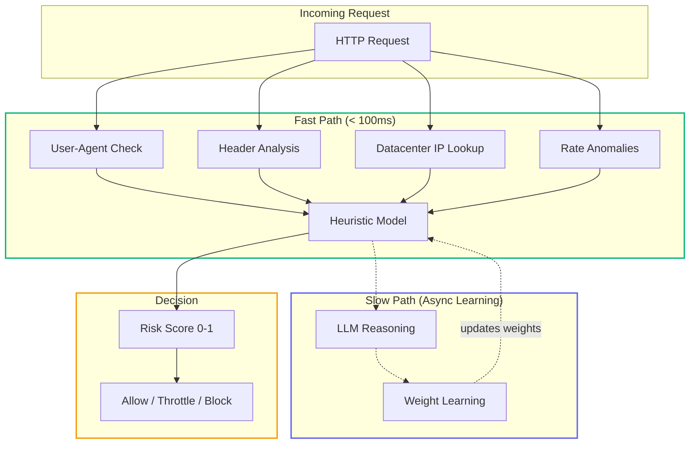
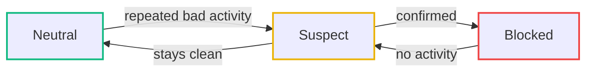
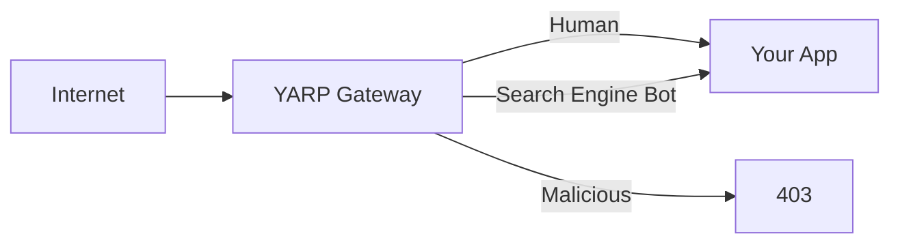

# **StyloBot: Fighting Back Against Scrapers (Part 1)**

*Scrapers are about to start using AI to mimic real users - so I built a bot detector that learns, adapts, and fights back.*

**[Read Part 2: How Bots Got Smarter - The New Frontier in Bot Detection](https://www.mostlylucid.net/blog/botdetection-part2-signature-pipeline-and-stylobot-architecture)**

**[👉 See It Live: StyloBot.net](https://stylobot.net)** - This is the real production system detecting your request in single milliseconds (CPU-only, no GPU needed). Try it yourself, see the scores, understand the signals.

**Key concept: Behavioural Routing.** This enables a new category - where transparent, adjustable "teams" of detectors and learning systems reflexively route traffic based on learned behaviour patterns, not static rules. With the [YARP Gateway](https://hub.docker.com/r/scottgal/mostlylucid.yarpgateway), bots never reach your backend. Or use the middleware to build behavioural routing directly into your app layer.

<pinned/>
<!--category-- ASP.NET, Bot Detection, Security -->

<datetime class="hidden">2025-12-08T07:00</datetime>

[](https://www.nuget.org/packages/mostlylucid.botdetection/)
[](https://github.com/scottgal/mostlylucid.nugetpackages/blob/main/Mostlylucid.BotDetection/README.md)
[](https://hub.docker.com/r/scottgal/mostlylucid.yarpgateway)

---

## **Why This Exists**

Bot detection has quietly become one of the hardest problems in modern web engineering.

**The problem just changed.** Three years ago, you could block 95% of bots with regex on the User-Agent string. Not anymore. Not because bots got smarter on their own - but because **large language models made it trivial to mimic genuine user behaviour at scale**. An LLM-powered scraper doesn't just blindly request the same path repeatedly. It understands your site structure, adapts when blocked, and requests pages in realistic order. It's indistinguishable from a human except in aggregate behavior.

* Rotating residential proxiess
* Perfectly valid browser fingerprints
* Realistic mouse movement
* Executing JavaScript
* Adapting when blocked

Commercial solutions solve this, but they're expensive (£3K-£50K/month is typical depending on scale), closed-source, and tied to specific CDNs. You never really know what's happening under the hood. And they have a limitation: most were built for the 2022 threat landscape (headless browsers, distributed proxies). They stop before v4—the LLM-powered frontier. If you're being scraped by intelligent automation, they work okay. If you're under coordinated, intelligent, adaptive attack, they're playing catch-up.

I wanted something different:

* **Open** - You can read, audit, and modify every detection rule
* **Local** - No 3rd-party API calls, no data leaving your infrastructure
* **Understandable** - Explainable decisions, not a black-box ML model
* **Easy to extend** - Add custom detectors for your specific threat surface
* **Cheap to run** - CPU, not licensing costs (yes, even on a Raspberry Pi)
* **Built for v4** - Handles the modern LLM-driven frontier, not just yesterday's attacks

So I built **StyloBot** - a modular, learning bot detection engine for .NET. Free, unlicensed, designed from the ground up for the new bot era.

It started simple… and then grew into something far more interesting.

---

[TOC]

---

## **A Concrete Example (What This Actually Catches)**

Here’s a real-world scenario:

A scraper spoofs:

```
User-Agent: Mozilla/5.0 (Windows NT 10.0; Win64; x64) Chrome/120
```

Looks legitimate.

But it *forgets* a header Chrome always sends:

```
Sec-Fetch-Mode
```

And its `Accept-Language` header doesn’t match the claimed locale.

And the request rate is clearly automated.

**One signal is fine. Two is suspicious. Three is a pattern.**

The system flags it in under 100 milliseconds - no AI needed.

This is the foundation of the whole design:
**don’t rely on one big “bot or not” model. Accumulate evidence.**

---

## Philosophy of the System

At its core, this project isn't really about bot detection at all - it's about **treating traffic as a living system** rather than a stream of isolated requests.

**Why this matters now:** LLM-powered bots aren't dumb. They adapt. An LLM bot hits your API, gets rate-limited, changes User-Agent, rotates IP, requests related products (like a human would), then systematically extracts data. Static rules can't keep up. But an adaptive system can.

Modern scrapers behave like organisms: they learn, mutate, probe for weaknesses, and respond to pressure. So the defence must evolve too.

The philosophy here is simple:

1. **Observe many signals** - UA, headers, IP, behavioral patterns, cross-layer consistency
2. **Combine them** - Don't trust one signal. Aggregate evidence.
3. **Let them interact** - A perfect UA is suspicious if the IP is a datacenter. Headers are suspicious if they're missing real-browser markers.
4. **Adapt over time** - Patterns decay. New patterns emerge. Learn continuously.

Instead of a single "bot/not-bot" check, the engine becomes **a network of small detectors**, each contributing evidence into a shared decision-making layer. Policies become composable flows, not hard-coded rules. Reputation shifts gradually instead of flipping states. AI is just another contributor, weighted alongside heuristics—not a monolith.

The system is built to be **transparent, explainable, extensible, and self-correcting**, with the long-term goal of behaving less like a firewall and more like an **immune system**: fast at the edge, intelligent in the core, and always learning.

---

## **Why Single-Signal Detection Fails (And How StyloBot Avoids It)**

Most systems rely on one or two signals:

- **"Block if User-Agent says 'bot'"** → Easily spoofed. Modern bots use real User-Agent strings.
- **"Block if rate > X requests/sec"** → Intelligent bots throttle. You'll block real power-users.
- **"Block if IP is in a datacenter"** → Residential proxy networks have real home ISPs. Good luck.
- **"Block if JavaScript doesn't execute"** → Headless browsers execute JS perfectly fine.

The pattern: **any single signal can be faked.** The solution: **don't rely on one signal.**

StyloBot combines many weak signals into a strong verdict. A perfect User-Agent is fine. A perfect User-Agent *plus* a datacenter IP *plus* missing security headers *plus* request rate anomalies *plus* cross-layer inconsistency = bot.

---

## **How It Works (The Short Version)**

Requests flow through several small detectors, each contributing a little piece of evidence.

Think of it as airport security: one TSA agent checking documents isn't enough. But three agents checking documents, boarding passes, and baggage together catch what one misses.



### **Fast Path (< 100ms)**

Runs synchronously. Doesn’t slow your app.

* Known bot patterns
* Missing headers real browsers always send
* Datacenter IPs (AWS/Azure/GCP)
* Rate spikes
* Inconsistencies between UA + headers

This catches **80%** of bots instantly.

### **Slow Path (Async)**

Runs in the background.

* Heuristic model with learned weights
* LLM reasoning via [Ollama](https://ollama.com/)
* Updating pattern reputation
* Forgetting stale signals

This catches the adaptive bots - the ones most people *think* they're catching with "regex on User-Agent".

---

## **Try It in 10 Seconds**

### Local Installation

```bash
dotnet add package Mostlylucid.BotDetection
```

```csharp
var builder = WebApplication.CreateBuilder(args);
builder.Services.AddBotDetection();

var app = builder.Build();
app.UseBotDetection();
app.Run();
```

That's it. Everything works out of the box.

### See It Live First

Don't want to install yet? **[Visit stylobot.net](https://stylobot.net)** to see the production system in action. Submit requests, watch them analyzed in single milliseconds with full early-exit enabled. No signup, fully interactive—it's the real deal.

---

## **What It Detects (At a Glance)**

| Check           | What It Finds                                     |
| --------------- | ------------------------------------------------- |
| **User-Agent**  | Known bots, libraries, scrapers                   |
| **Headers**     | Missing security headers, impossible combinations |
| **IP**          | Cloud hosts pretending to be “home users”         |
| **Rate**        | Automation bursts, distributed scraping           |
| **Consistency** | “Chrome/120” without Chrome’s actual header set   |

Consistency is the sleeper feature - modern bots can spoof *one* signal but usually fail at cross-signal coherence.

---

## **A Real Detection Result (Broken Down)**

Here's what a real detection looks like - actual data from **[stylobot.net](https://stylobot.net)** running in production with early-exit enabled. You can generate these same results yourself by testing on the live site. The latencies shown are real CPU-only performance, no slowdown for visibility.

### Summary

```json
{
  "policy": "fastpath",
  "isBot": false,
  "isHuman": true,
  "humanProbability": 0.8,
  "botProbability": 0.2,
  "confidence": 0.76,
  "riskBand": "Low",
  "recommendedAction": { "action": "Allow", "reason": "Low risk (probability: 20%)" },
  "processingTimeMs": 50.7,
  "detectorsRan": ["UserAgent", "Ip", "Header", "ClientSide", "Behavioral", "Heuristic", "VersionAge", "Inconsistency"],
  "detectorCount": 8,
  "earlyExit": false
}
```

**8 detectors ran in 51ms** - that's parallel execution across multiple evidence sources.

### Detector Contributions

Each detector contributes a weighted impact. Negative = human signal. Positive = bot signal.

| Detector | Impact | Weight | Weighted | Reason |
|----------|--------|--------|----------|--------|
| **UserAgent** | -0.20 | 1.0 | -0.20 | User-Agent appears normal |
| **Header** | -0.15 | 1.0 | -0.15 | Headers appear normal |
| **Behavioral** | -0.10 | 1.0 | -0.10 | Request patterns appear normal |
| **Heuristic** | -0.77 | 2.0 | **-1.54** | 88% human likelihood (16 features) |
| **ClientSide** | -0.05 | 0.8 | -0.04 | Fingerprint appears legitimate |
| **VersionAge** | -0.05 | 0.8 | -0.04 | Browser/OS versions appear current |
| **Inconsistency** | -0.05 | 0.8 | -0.04 | No header/UA inconsistencies |
| **IP** | 0.00 | 0.5 | 0.00 | Localhost (neutral in dev) |

The **Heuristic detector** dominates here - it's weighted 2x and used 16 features to reach 88% human confidence.

### Signals Collected

Each detector emits signals that feed into the heuristic model:

```json
{
  "ua.is_bot": false,
  "ua.raw": "Mozilla/5.0 (Windows NT 10.0; Win64; x64) AppleWebKit/537.36...",
  "ip.is_local": true,
  "ip.address": "::1",
  "header.has_accept_language": true,
  "header.has_accept_encoding": true,
  "header.count": 16,
  "fingerprint.integrity_score": 1,
  "behavioral.anomaly": false,
  "heuristic.prediction": "human",
  "heuristic.confidence": 0.77,
  "versionage.analyzed": true
}
```

These signals persist and train the learning system over time.

### Category Breakdown

Scores aggregate by category for the final decision:

| Category | Score | Weight | Notes |
|----------|-------|--------|-------|
| Heuristic | -1.54 | 2.0 | Strongest human signal |
| UserAgent | -0.20 | 1.0 | Normal browser UA |
| Header | -0.15 | 1.0 | All expected headers present |
| Behavioral | -0.10 | 1.0 | No rate anomalies |
| ClientSide | -0.04 | 0.8 | Valid fingerprint received |
| VersionAge | -0.04 | 0.8 | Current browser version |
| Inconsistency | -0.04 | 0.8 | UA matches headers |
| IP | 0.00 | 0.5 | Localhost (dev neutral) |

**Total weighted score: -2.11** → Strong human signal → Allow.

> **Note:** This is the demo's `fastpath` policy which runs **all** detectors for visibility. In real production with early exit enabled, high-confidence requests exit after just 2-3 detectors agree - typically **under 10ms**. The 51ms here is because demo mode disables early exit to show all contributions.

### Full Pipeline (Demo Mode with LLM)

For comparison, here's the `demo` policy - the complete pipeline including LLM reasoning. This shows what happens when detectors **disagree**:

```json
{
  "policy": "demo",
  "isBot": false,
  "isHuman": true,
  "humanProbability": 0.87,
  "botProbability": 0.13,
  "confidence": 1.0,
  "botType": "Scraper",
  "riskBand": "Low",
  "recommendedAction": { "action": "Allow", "reason": "Low risk (probability: 13%)" },
  "processingTimeMs": 1370,
  "aiRan": true,
  "detectorsRan": ["UserAgent", "Ip", "Header", "ClientSide", "Behavioral",
                   "VersionAge", "Inconsistency", "Heuristic", "HeuristicLate", "Llm"],
  "detectorCount": 10
}
```

**10 detectors in 1.4 seconds** - the LLM ran and *disagreed* with the heuristics.

| Detector | Impact | Weight | Weighted | Reason |
|----------|--------|--------|----------|--------|
| **LLM** | +0.85 | 2.5 | **+2.13** | "Chrome common in bots, cookies + referer suspicious" |
| **HeuristicLate** | -0.77 | 2.5 | -1.92 | 88% human (with all evidence) |
| **Heuristic** (early) | -0.77 | 2.0 | -1.54 | 88% human likelihood (16 features) |
| **UserAgent** | -0.20 | 1.0 | -0.20 | User-Agent appears normal |
| **Header** | -0.15 | 1.0 | -0.15 | Headers appear normal |
| **Behavioral** | -0.10 | 1.0 | -0.10 | Request patterns appear normal |
| **ClientSide** | 0.00 | 1.8 | 0.00 | No fingerprint (awaiting JS) |
| **VersionAge** | -0.05 | 0.8 | -0.04 | Browser/OS versions current |
| **Inconsistency** | -0.05 | 0.8 | -0.04 | No header/UA inconsistencies |
| **IP** | 0.00 | 0.5 | 0.00 | Localhost (neutral) |

This is the interesting case - **the LLM flagged it as a potential bot** while all static detectors said human:

```json
{
  "ai.prediction": "bot",
  "ai.confidence": 0.85,
  "ai.learned_pattern": "Browser string suggests Chrome, common in bots. Presence of cookies and a specific referer also points to a potential bot."
}
```

The LLM's reasoning gets recorded as a signal that feeds back into the learning system. Over time, if this pattern keeps appearing and gets confirmed as bot traffic, the heuristic weights will adjust.

Notice:

1. **Heuristic runs twice** - early (before all detectors) and late (after all evidence). Both said "human" with 88% confidence.

2. **LLM disagreed** - it spotted patterns the static detectors missed. Its +2.13 weighted impact partially counters the heuristic's -3.46.

3. **No fingerprint** - ClientSide returned 0 because JS hadn't executed yet. In a real browser, this would add more human signal.

4. **Final verdict: Allow** - even with the LLM's suspicion, the combined evidence still favours human (87%). But the `botType: "Scraper"` flag means it's being watched.

The category breakdown shows the tension:

| Category | Score | Weight | Notes |
|----------|-------|--------|-------|
| **Heuristic** | -3.46 | 4.5 | Strong human signal |
| **AI** | +2.13 | 2.5 | LLM says bot |
| UserAgent | -0.20 | 1.0 | Normal browser |
| Header | -0.15 | 1.0 | All headers present |
| Behavioral | -0.10 | 1.0 | Normal patterns |
| ClientSide | 0.00 | 1.8 | No fingerprint yet |
| VersionAge | -0.04 | 0.8 | Current versions |
| Inconsistency | -0.04 | 0.8 | UA matches headers |
| IP | 0.00 | 0.5 | Localhost |

**Total weighted score: -1.86** → Human wins, but the LLM's dissent is noted.

> **Key insight:** The system doesn't blindly trust any single detector. When they disagree, evidence is weighted and the majority wins - but minority opinions get recorded for learning.

> **Important:** This verbose output is demo-only. In production, you get a slim response via HTTP headers (`X-Bot-Confidence`, `X-Bot-RiskBand`, etc.) or a simple `context.IsBot()` check. The full JSON is for debugging and tuning - you'd never send this to clients.

---

## **Using the Results**

```csharp
if (context.IsBot())
    return Results.StatusCode(403);

var score = context.GetBotConfidence();  // 0.0-1.0
var risk  = context.GetRiskBand();       // Low/Elevated/Medium/High
```

### Protecting Endpoints

```csharp
app.MapGet("/api/data", Secret).BlockBots();
app.MapGet("/sitemap.xml", Sitemap)
   .BlockBots(allowVerifiedBots: true);
```

Risk levels guide the action:

| Risk     | Confidence | Recommended Action |
| -------- | ---------- | ------------------ |
| Low      | < 0.3      | Allow              |
| Elevated | 0.3-0.5    | Log / rate-limit   |
| Medium   | 0.5-0.7    | Challenge          |
| High     | > 0.7      | Block              |

---

## **AI Detection (Optional)**

Not required - but useful for catching advanced automation.

### **Heuristic Detector (Fast, Learning)**

The system includes a heuristic detector that uses logistic regression with dynamically learned weights. It starts with sensible defaults and evolves based on detection feedback.

Typical latency: **1-5ms**

```json
{
  "BotDetection": {
    "AiDetection": {
      "Heuristic": {
        "Enabled": true,
        "LoadLearnedWeights": true,
        "EnableWeightLearning": true
      }
    }
  }
}
```

Features are extracted dynamically - new patterns automatically get default weights and learn over time. The system discovers what matters for *your* traffic.

### **Ollama LLM (Deep Reasoning)**

Catches evasive bots that look "fine" to fast rules. Uses [Ollama](https://ollama.com/) for local LLM inference.

```bash
ollama pull gemma3:1b
```

```json
{
  "BotDetection": {
    "AiDetection": {
      "Provider": "Ollama",
      "Ollama": { "Model": "gemma3:1b" }
    }
  }
}
```

AI is **fail-safe** - if it's down, detection continues normally.

---

## **The Learning System: Adaptive, Not Trigger-Happy**

Static blocklists go stale. Attackers adapt.
So this system learns.



Patterns decay over time:

* IPs get reassigned
* Misconfigured scripts get fixed
* Traffic changes naturally

Without decay you’d block legitimate users forever.

```json
{
  "BotDetection": {
    "Learning": {
      "Enabled": true,
      "ScoreDecayTauHours": 168,
      "GcEligibleDays": 90
    }
  }
}
```

---

## **YARP Gateway: Edge Protection for Your App**

There’s also a **Docker-first YARP reverse proxy** that runs detection *before* requests hit your app.



Run it in one line:

```bash
docker run -p 80:8080 \
  -e DEFAULT_UPSTREAM=http://your-app:3000 \
  scottgal/mostlylucid.yarpgateway
```

Works on:

* Linux
* macOS
* Windows
* **ARM (yes, Raspberry Pi)**

For custom routing:

```yaml
services:
  gateway:
    image: scottgal/mostlylucid.yarpgateway
    volumes:
      - ./yarp.json:/app/config/yarp.json
```

---

## **A Reasonable Production Config**

```json
{
  "BotDetection": {
    "BotThreshold": 0.7,
    "BlockDetectedBots": true,
    "EnableAiDetection": true,
    "Learning": { "Enabled": true },
    "PathPolicies": {
      "/api/login": "strict",
      "/sitemap.xml": "allowVerifiedBots"
    }
  }
}
```

---

## **Where This Is Going**

This is Part 1 (the overview).
The next parts dig deeper:

* **Part 2**: [How Bots Got Smarter - The New Frontier in Bot Detection](https://www.mostlylucid.net/blog/botdetection-part2-signature-pipeline-and-stylobot-architecture)
* **Part 3**: Behaviour analytics
* **Part 4**: Client-side fingerprinting
* **Part 5**: The heuristic detector - learning weights in real-time
* **Part 6**: LLM detection internals
* **Part 7**: The learning system explained properly

**Future roadmap:**
* RAG-based pattern matching with vector embeddings
* Local small model inference via [LlamaSharp](https://github.com/SciSharp/LLamaSharp) / ONNX
* Semantic similarity for detecting novel attack patterns

If you want a bot detector you can *understand*, *extend*, and *run anywhere*, this series is for you.

---

## **Academic & Industry Reading**

If you want to dive into why bot detection is hard and what the research says:

### Bot Detection & Evasion
- [Imperva: The State of Bot Traffic Report 2024](https://www.imperva.com/blog/bot-attack-trends/) - Real-world bot attack data
- [OWASP: Bot Management](https://owasp.org/www-community/attacks/Bot_attack) - Security fundamentals
- [Cloudflare: Bot Detection Overview](https://www.cloudflare.com/learning/bots/what-is-bot-detection/) - Industry perspective

### Network Fingerprinting
- [JA3: SSL/TLS Client Fingerprinting](https://github.com/salesforce/ja3) - TLS signature matching (the standard)
- [TCP/IP Fingerprinting: p0f Reference](https://lcamtuf.coredump.cx/p0f3/) - Network-layer OS detection
- [HTTP/2 Fingerprinting Techniques](https://www.cloudflare.com/learning/http/http2/) - How browsers differ in HTTP/2

### Behavioral Analysis & Anomaly Detection
- [Outlier Detection in Time Series Data (ACM)](https://en.wikipedia.org/wiki/Anomaly_detection) - Statistical foundations
- [Markov Chains in Intrusion Detection](https://en.wikipedia.org/wiki/Markov_chain) - State transition modeling

### LLM-Powered Threats & Data Poisoning
- [Data Poisoning Attacks on Machine Learning (arXiv: 1811.03728)](https://arxiv.org/abs/1811.03728) - Why scrapers target your data
- [Extracting Training Data from Large Language Models (arXiv: 2302.07933)](https://arxiv.org/abs/2302.07933) - Why bots want your content
- [Web Scraping and Copyright Issues](https://en.wikipedia.org/wiki/Web_scraping#Legal_issues) - The legal angle

### Headless Browser Detection
- [Puppeteer & Playwright Detection](https://antoinevastel.com/blog/detect-puppeteer-and-playwright/) - How headless browsers are identified
- [Canvas Fingerprinting & Evasion](https://cvdazzle.com/) - Client-side detection techniques

---

## **Project Links**

* **GitHub:** full docs
  [https://github.com/scottgal/stylobot](https://github.com/scottgal/stylobot)
* **NuGet:** install the package
  [https://www.nuget.org/packages/mostlylucid.botdetection](https://www.nuget.org/packages/mostlylucid.botdetection)
* **Docker Hub:** YARP gateway
  [https://hub.docker.com/r/scottgal/stylobot-gateway](https://hub.docker.com/r/scottgal/stylobot-gateway)

---

**Unlicense - public domain. Use it however you want.**

