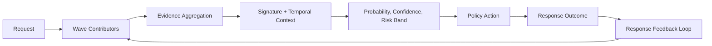
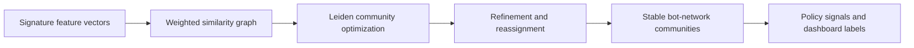
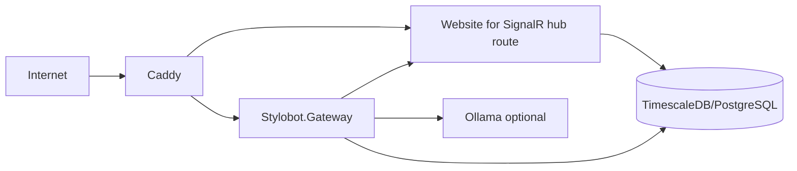

# **StyloBot: How Bots Got Smarter - The New Frontier in Bot Detection (Part 2)**

*Part 1 was the why. This is the show-and-tell tour of what StyloBot does that is rare in production bot stacks.*

Thesis: StyloBot models bot detection as a progressive, early-exit topology of behavioral signals, with response outcomes feeding back into scoring and bounded temporal memory preserving campaign context.

If you have pricing, inventory, or proprietary content, this is about stopping large-scale harvesting (price intelligence, competitive crawling, AI training scrapes) before it becomes your baseline traffic.

> ### What Makes StyloBot Different
> - behavioral, not rule-based
> - progressive detection, not full analysis
> - campaign-aware, not request-aware
> - real-time, not batch

**[Read Part 1: StyloBot: Fighting Back Against Scrapers](https://www.mostlylucid.net/blog/botdetection-introduction)**

**[👉 See It Live: StyloBot.net](https://stylobot.net)** - This is the real production system running early-exit detection inline at the gateway (measured inline; latency varies by policy and enabled waves).

<!--category-- ASP.NET, Bot Detection, Security, Architecture -->
<datetime class="hidden">2026-02-15T10:30</datetime>

[](https://www.nuget.org/packages/mostlylucid.botdetection/)
[](https://github.com/scottgal/stylobot)
[](https://hub.docker.com/r/scottgal/stylobot-gateway)

---

[TOC]

---

## Part 2 Context

This post skips setup and configuration (covered in Part 1), focusing instead on the novel internals that set StyloBot apart.

---

## Why We're Here: The New Bot Frontier

Before diving into architecture, understand the threat. This isn't about blocking simple scrapers anymore.

### What Bots Actually Do

Bots fall into categories:

1. **Dumb scrapers** (curl loops, wget): Request the same path repeatedly, identical headers, predictable patterns. Easy to block.
2. **Headless browsers** (Puppeteer, Playwright): Mimic real browsers better. They fetch assets, handle JavaScript, rotate User-Agents. Harder.
3. **Residential proxy networks**: Requests from real home ISP IPs, making geolocation checks fail. They still have signature patterns, but subtle.
4. **LLM-powered bots** (NEW): These crawl your site while maintaining coherent conversation-like access patterns. They understand context. They mimic legitimate browsing behavior at scale, sometimes with intent to poison datasets, extract proprietary information, or scrape for training data.

The first three have been around for years. **The fourth is where depth matters.** Common real-world targets include price intelligence scraping, competitive intelligence crawling, and dataset harvesting for model training.

### How Bot Sophistication Has Evolved

| Generation | Tactic | Defense |
|------------|--------|---------|
| **v1: Basic** | Same IP, repeated paths, static UA | Rate limiting, IP blocks |
| **v2: Headless** | Real browser, JS execution, asset fetching | Behavioral rate limits, TLS fingerprinting |
| **v3: Distributed** | Rotating IPs, residential proxies, varied timing | Cross-layer correlation, signature memory |
| **v4: LLM-Driven** (NOW) | Natural browsing patterns, contextual requests, mixed legitimate + scraping, dataset poisoning | All of the above + transition modeling + campaign clustering + response behavior loops |

**The jump from v3 to v4:** Old bots followed rules or randomness. New bots *understand* your site structure. An LLM bot might request product A, then the related products B and C (like a real user), then systematically extract prices for a trained model. The *sequence* looks natural, but the *aggregate purpose* is malicious.

### Why This Isn't Overkill

You might think: "Isn't detecting Markov patterns and cluster convergence massive overengineering for blocking bots?"

No. Here's why:

1. **Advanced adaptive bots are expensive to run.** Training costs, API fees, GPU time. They won't waste requests. They'll be *efficient* and *targeted*.
2. **They mimic humans exceptionally well.** A static rate limit won't catch them. A User-Agent check won't work. You need multi-layer correlation, response-behavior loops, and campaign context.
3. **False positives are costly.** Block one real user by mistake, and you lose them. StyloBot's bounded memory and temporal reasoning let you maintain high confidence without being draconian.
4. **The attack surface is expanding.** Scrapers no longer just want your HTML. They want to poison your search index, extract proprietary algorithms, train competing models, or harvest user emails. The stakes are higher.

**Reference reading:**
- [OWASP: Bot Management](https://owasp.org/www-community/attacks/Bot_attack)
- [Imperva: Bot Traffic Report 2024](https://www.imperva.com/blog/bot-attack-trends/)
- [Cloudflare: Understanding Bot Detection](https://www.cloudflare.com/learning/bots/what-is-bot-detection/)

---

## Core Architectural Principle

Most bot systems do one or two of these; combining them end-to-end is still relatively rare in production systems. The unifying idea is a behavioral signal topology evaluated progressively (early exit), with closed-loop feedback and bounded temporal state enabling emergent campaign structure.

1. **Early-exit progressive analysis (wave graph)** → Cheap checks run first; deeper analysis runs only when early evidence warrants it.
2. **Response-side feedback loops** → Captures how advanced adaptive bots change behavior based on your responses (401/403, throttling, honeypots).
3. **Cross-layer correlation** → Correlates identity claims (UA, geo) against network truth (TCP/TLS/HTTP2) to make spoofing materially harder.
4. **Signature memory with bounded temporal state** → Keeps campaign context visible without unbounded RAM growth under load.
5. **Transition modeling (Markov-style flows)** → Spots systematic extraction patterns that look human per-request but diverge at the sequence shape level (with a memoryless assumption).
6. **Campaign clustering + convergence** → Converts many weak per-request signals into durable campaign entities (waves, products, families).

This enables higher behavioral resolution while keeping decisions explainable.

---

## The Pipeline in One Picture



`Wave contributors` are staged detector components: the gateway runs them in progressive waves and exits early once risk is confidently low or high.

Notice the feedback loop: response behavior feeds into the next request cycle.

**[See this pipeline in production at stylobot.net](https://stylobot.net)** - Submit a request and follow it through the pipeline with early-exit enabled (measured inline at the gateway).

---

## Early Exit Execution Model (Wave-Orchestrated Detector Graph)

Instead of running all detectors on every request, StyloBot uses a **staged pipeline**: cheap, fast checks run first. Only if they flag something suspicious does it spend CPU on expensive, deeper analysis.

**Why this matters:** You're not paying the cost of full analysis (cluster lookups, deeper correlation, LLM heuristics) for every harmless user. Fast checks eliminate obvious bots instantly, and early-exit preserves latency for good traffic.

```csharp
services.AddSingleton<IContributingDetector, FastPathReputationContributor>();
services.AddSingleton<IContributingDetector, UserAgentContributor>();
services.AddSingleton<IContributingDetector, HeaderContributor>();
services.AddSingleton<IContributingDetector, IpContributor>();
services.AddSingleton<IContributingDetector, BehavioralContributor>();
services.AddSingleton<IContributingDetector, ResponseBehaviorContributor>();
services.AddSingleton<IContributingDetector, MultiLayerCorrelationContributor>();
services.AddSingleton<IContributingDetector, BehavioralWaveformContributor>();
services.AddSingleton<IContributingDetector, ClusterContributor>();
services.AddSingleton<IContributingDetector, SimilarityContributor>();
services.AddSingleton<IContributingDetector, LlmContributor>();
services.AddSingleton<IContributingDetector, HeuristicLateContributor>();
```

This keeps fast-path latency low while enabling deep analysis only when warranted by early signals.

---

### Where Existing Bot Detection Systems Stop

Most production bot detection services handle v1-v3 effectively. Here's the market breakdown:

| Solution | Handles Up To | Stops At | Cost | How It Works |
|----------|---------------|----------|------|--------------|
| **Simple rate limiting** (nginx, Apache) | v1 | v2 | Free (OSS) | Requests per IP/UA. Trivial to bypass with rotation. |
| **AWS WAF + IP reputation** | v1-v2 | v3 | ~$5-20/month + per-request fees | GeoIP + known-bad IP lists. No behavioral modeling. |
| **Cloudflare Bot Management** | v2-v3 | v4 (partially) | ~$250-1000/month | TLS fingerprinting, JS challenge, behavioral scoring. Doesn't do cross-temporal or campaign-level clustering. |
| **Imperva/Incapsula** | v2-v3 | v4 (partially) | ~$3000-15000/year | Device fingerprinting, behavioral baselines, rate limits. Weak on LLM-specific patterns. |
| **DataDome** | v2-v3 | v4 (partially) | ~$5000-25000/year | Real-time ML scoring, adaptive, good for v3. But no explicit Markov transition modeling or bounded signature memory. |
| **Akamai Bot Manager** | v2-v3 | v4 (partially) | ~$10000-50000+/year (custom) | Extensive fingerprinting and reputation. Good scale, but not designed for coordinated campaign context. |
| **Open source** (fail2ban, etc.) | v1 | v2 | Free (OSS) | Log-based IP blocking. No real-time request instrumentation. |
| **StyloBot** | v2-v4 | Beyond | Free (OSS) / NuGet package | All of the above + response feedback loops + transition modeling + signature memory + cluster convergence + LLM-specific detection. Explicitly built for the new frontier. |

**Cost Reality Check:**
- Enterprise solutions (Cloudflare, Imperva, DataDome, Akamai) are **$3,000-$50,000+ annually** because they're managed SaaS with 24/7 support and rapid data ingestion. They're fast to deploy and handle the known v2-v3 attack surface.
- Open source (fail2ban, nginx rate limiting) is free but stops at v1.
- **StyloBot is free** (Unlicense licensed NuGet package), self-hosted, and handles v2-v4+. You pay in infrastructure/CPU, not licensing.

**Key insight:** Most enterprise solutions (Cloudflare, Imperva, Akamai) are strong at v2-v3 detection. They catch headless browsers and distributed proxy networks. But they stop before v4 because:

1. **No response-feedback loops** → Can't track how bots learn from your responses.
2. **No transition modeling** → Can't distinguish "browsing patterns that look human but extract systematically."
3. **No bounded temporal memory** → Either unbounded state (memory leak under DDoS) or no cross-temporal reasoning.
4. **No explicit campaign clustering** → Treat each bot signature independently; miss coordinated waves.

**They're not wrong—they handle the market that existed in 2022.** But LLM bots changed the game. StyloBot was built from scratch for v4+. And you don't pay $15k/year for it.

---

## Architecture Deep Dive

The remainder of the post walks through each mechanism in the pipeline, with code and concrete examples.

---

## Response-Side Feedback Into Request Scoring

StyloBot records response behavior and folds it into future request decisions for the same client signature.

### Hook point in middleware

```csharp
private async Task RecordResponseAsync(
    HttpContext context,
    AggregatedEvidence evidence,
    ResponseCoordinator coordinator,
    DateTime requestStartTime)
{
    var ip = context.Connection.RemoteIpAddress?.ToString() ?? "unknown";
    var ua = context.Request.Headers.UserAgent.ToString();
    var clientId = $"{ip}:{GetHash(ua)}";

    var signal = new ResponseSignal
    {
        RequestId = context.TraceIdentifier,
        ClientId = clientId,
        Timestamp = DateTimeOffset.UtcNow,
        StatusCode = context.Response.StatusCode,
        Path = context.Request.Path.Value ?? "/",
        Method = context.Request.Method,
        RequestBotProbability = evidence.BotProbability,
        InlineAnalysis = false
    };

    await coordinator.RecordResponseAsync(signal, CancellationToken.None);

    // Improve transition modelling with observed response content type
    waveform?.UpdateResponseContentType(clientId, context.Response.ContentType);
}
```

### What it contributes

`ResponseBehaviorContributor` can add signals like:

- **Honeypot path hits:** You have secret paths that real users never visit (like `/admin/secret.php`). A bot that requests these is obviously malicious.
- **404 scan patterns:** A bot requesting 50 different paths that don't exist? Classic reconnaissance.
- **Auth brute-force struggle:** Repeatedly getting 401/403 responses means someone's trying passwords.
- **Rate-limit violation history:** Bot keeps hitting you after being throttled.
- **High composite response score:** Combination of above shows deliberate attack, not accident.

This turns detection into a **closed-loop control system**: You observe how the bot behaved *after* you responded to it, and that changes your scoring for the next request. It's like a feedback loop where each interaction teaches the system more about the attacker.

---

## Novel Bit #2: Markov-Style Transition Modeling

The waveform detector builds a **transition matrix** (a table showing how often requests move from one type to another) between content classes and scores the overall browsing pattern.

**What this means in plain language:** A Markov model tracks "what comes next?" based on what you just saw. Human browsers typically request a Page → then multiple Assets (images, scripts) → then another Page. Bots often show different patterns: Page → Page → Page in a loop, skipping assets entirely. By mapping this sequence, StyloBot spots unnatural browsing rhythms that scrapers leave behind.

```csharp
var transitions = new int[3, 3];
var fromCounts = new int[3];

for (var i = 1; i < classes.Count; i++)
{
    var from = (int)classes[i - 1];
    var to = (int)classes[i];
    transitions[from, to]++;
    fromCounts[from]++;
}

var pageToAsset = (double)transitions[(int)ContentClass.Page, (int)ContentClass.Asset]
                  / fromCounts[(int)ContentClass.Page];
var pageToPage = (double)transitions[(int)ContentClass.Page, (int)ContentClass.Page]
                 / fromCounts[(int)ContentClass.Page];
```

Then it flags suspicious transition shape:

```csharp
if (pageToPage > 0.7 && pageCt >= 5)
    contributions.Add(DetectionContribution.Bot(
        Name, "Waveform", 0.6,
        $"Scraper pattern: {pageToPage:P0} of page requests lead to another page",
        weight: 1.5,
        botType: BotType.Scraper.ToString()));
```

**The red flag:** If 70% of page requests go directly to another page (instead of fetching assets like a real browser does), that's a bot signature. Real browsers fetch the page, then load all the supporting files (images, CSS, JavaScript). Scrapers often skip the asset fetching and just jump between pages.

---

## Novel Bit #3: Wave-Orchestrated Detector Graph

Instead of running all detectors on every request, StyloBot uses a **staged pipeline**: cheap, fast checks run first. Only if they flag something suspicious does it spend CPU on expensive, deeper analysis.

**Why this matters:** You're not paying the cost of full analysis (ML models, cluster lookups, etc.) for every harmless user. Fast reputation checks eliminate obvious bots instantly.

```csharp
services.AddSingleton<IContributingDetector, FastPathReputationContributor>();
services.AddSingleton<IContributingDetector, UserAgentContributor>();
services.AddSingleton<IContributingDetector, HeaderContributor>();
services.AddSingleton<IContributingDetector, IpContributor>();
services.AddSingleton<IContributingDetector, BehavioralContributor>();
services.AddSingleton<IContributingDetector, ResponseBehaviorContributor>();
services.AddSingleton<IContributingDetector, MultiLayerCorrelationContributor>();
services.AddSingleton<IContributingDetector, BehavioralWaveformContributor>();
services.AddSingleton<IContributingDetector, ClusterContributor>();
services.AddSingleton<IContributingDetector, SimilarityContributor>();
services.AddSingleton<IContributingDetector, LlmContributor>();
services.AddSingleton<IContributingDetector, HeuristicLateContributor>();
```

This keeps fast-path latency low while enabling deep analysis only when warranted by early signals.

---

## Novel Bit #4: Cross-Layer Correlation (Network Truth vs Claimed Identity)

A bot can lie about its User-Agent (the string claiming "I'm Chrome on Windows"). But the deeper network layers are harder to fake convincingly.

**The idea:** Check if the bot's claims are consistent across multiple levels:

- **TCP layer** (the low-level connection): Windows machines have specific TCP window sizes and behaviors. Does the bot's TCP behavior match its claimed OS?
- **TLS/SSL layer** (encryption handshake): Different browsers use different TLS cipher orders and versions. Does the bot's TLS fingerprint match what Chrome (or Safari) should look like?
- **HTTP/2 layer** (how the browser structures requests): Real browsers have specific HTTP/2 client behaviors. Is the bot mimicking them correctly?
- **Geographic/language** consistency: Is the bot claiming to be in Tokyo but using an AWS datacenter IP? That's suspicious.

If you see mismatches across 3+ layers, it's almost certainly a bot—because faking all of them consistently is much harder than just changing the User-Agent string.

```csharp
var osMismatch = AnalyzeOsCorrelation(tcpOsHint, tcpWindowOsHint, userAgentOs, signals);
var browserMismatch = AnalyzeBrowserCorrelation(h2ClientType, userAgentBrowser, tlsProtocol, signals);
var tlsMismatch = AnalyzeTlsCorrelation(tlsProtocol, userAgentBrowser, signals);
var geoMismatch = AnalyzeGeoCorrelation(state, signals);

if (anomalyCount >= 3)
    contributions.Add(DetectionContribution.Bot(
        Name, "Correlation", 0.85,
        $"Multiple layer mismatches detected ({anomalyCount}/{totalLayers})",
        weight: 2.0,
        botType: BotType.MaliciousBot.ToString()));
```

This is one of the strongest anti-spoofing mechanisms in the stack.

---

## Novel Bit #5: Signature Memory With Bounded Temporal State

StyloBot remembers what each bot signature has done recently. But memory must be **bounded** (can't grow forever) and **ordered** (updates can't race each other).

**Why this is tricky:** Imagine a bot keeps hitting your site from the same IP and User-Agent combo. You want to remember "this thing hit the honeypot 5 times," "it got 403s on auth attempts," "it's part of a coordinated cluster." But in high-traffic scenarios, you can have thousands of signatures, and updates coming in parallel. Without careful state management, you either lose data (caches evict important history) or spend too much memory (unbounded growth).

StyloBot solves this with TTL-aware caches (memory automatically expires old signatures) plus keyed sequential updates (each signature's updates are ordered, preventing race conditions):

```csharp
_signatureCache = new SlidingCacheAtom<string, SignatureTrackingAtom>(
    async (signature, ct) => new SignatureTrackingAtom(signature, _options, _logger),
    _options.SignatureTtl,
    _options.SignatureTtl * 2,
    _options.MaxSignaturesInWindow,
    Environment.ProcessorCount,
    10,
    _signals);

_updateAtom = new KeyedSequentialAtom<SignatureUpdateRequest, string>(
    req => req.Signature,
    async (req, ct) => await ProcessSignatureUpdateAsync(req, ct),
    Environment.ProcessorCount * 2,
    1,
    true,
    _signals);
```

You get deterministic per-signature ordering, parallelism across signatures, and automatic TTL/LRU pressure control.

---

## Novel Bit #6: Cluster + Convergence Intelligence

StyloBot does not stop at single-signature scoring. It adds campaign-level context:

- **Bot product clusters:** Same scraping tool used by many attackers. If you recognize one bot from `ScraperXYZ`, finding another one gets higher confidence.
- **Bot network clusters:** Coordinated attacks from multiple signatures (different IPs, rotating user-agents, but same campaign). These temporally correlate—they hit you in waves.
- **Country reputation with decay:** Does most bot traffic come from datacenter IPs in specific regions? That becomes a weak signal, but it ages out as patterns shift.
- **Signature convergence families:** Sometimes a bot rotates its User-Agent or IP partially but keeps core behaviors. Convergence families track these related mutations.

```csharp
var cluster = _clusterService.FindCluster(signature);
if (cluster != null)
{
    signals[SignalKeys.ClusterType] = cluster.Type.ToString().ToLowerInvariant();
    signals[SignalKeys.ClusterMemberCount] = cluster.MemberCount;

    if (cluster.Type == BotClusterType.BotProduct)
        contributions.Add(BotContribution(
            "Cluster",
            $"Part of bot product cluster '{cluster.Label}' ({cluster.MemberCount} members)",
            confidenceOverride: ProductConfidenceDelta,
            botType: "Scraper"));
}

var family = _signatureCoordinator.GetFamily(signature);
if (family != null && family.MemberSignatures.Count > 1)
{
    contributions.Add(BotContribution(
        "ConvergedFamily",
        $"Part of converged family ({family.MemberSignatures.Count} members, {family.FormationReason})",
        confidenceOverride: familyBoost));
}
```

This raises detection quality for borderline traffic without blindly escalating every unknown.

---

## Leiden Bot-Network Clustering

Current clustering uses **label propagation** (imagine spreading a colored label through a network—similar bots end up with the same label). But that's messy. A **Leiden-style community refinement** pass cleans things up by optimizing the community boundaries.

**Plain English:** You've got a graph of bot signatures, with edges connecting similar ones. Leiden is an algorithm that figures out which signatures naturally cluster together, and it does a better job than naive approaches. Instead of saying "all these bots look similar, lumped together," Leiden says "wait, these 50 actually form a tight coordinated group, and those 30 form a separate campaign."

Why this matters:

1. Better community quality than naive graph partitioning.
2. More stable communities across reruns.
3. Cleaner separation between bot products and coordinated bot networks.
4. Stronger downstream labels for policy and operator workflows.

High-level flow:



Leiden-style pass pseudocode:

```csharp
// Pseudocode for community refinement pass
var graph = BuildSimilarityGraph(signatureVectors);
var communities = Leiden.DetectCommunities(
    graph,
    resolution: 1.0,
    seed: 42);

foreach (var community in communities)
{
    var score = ComputeCommunityBotScore(community);
    var temporal = ComputeTemporalDensity(community);

    if (score >= botThreshold && temporal >= temporalThreshold)
        EmitCluster(community, type: BotClusterType.BotNetwork);
}
```

This matters because it gives you durable campaign-level entities, not just noisy pairwise similarity links.

For the current production implementation details, see:

1. [Cluster detection docs](https://github.com/scottgal/stylobot/blob/main/Mostlylucid.BotDetection/docs/cluster-detection.md)
2. [Detectors in depth](https://github.com/scottgal/stylobot/blob/main/mostlylucid.stylobot.website/src/Stylobot.Website/Docs/detectors-in-depth.md)

---

## New Attributes Are the Runtime Control Surface

The MVC attributes provide the operational control plane:

```csharp
[BotPolicy("strict")]
[BotAction("challenge", FallbackAction = "block")]
public IActionResult Checkout() => Ok();

[BotDetector("UserAgent,Header,Ip", BlockAction = BotBlockAction.Throttle)]
public IActionResult MultiDetector() => Ok();
```

**What these do:** You mark individual endpoints with the security posture they need. Checkout might need strict protection (challenge suspected bots, block if they can't solve it). A public API might just throttle. A search endpoint might only check User-Agent and Header. This lets teams apply different detection strategies to different endpoints without writing custom middleware—just decorate the action.

**[Try different policies live at stylobot.net](https://stylobot.net)** - Test the `strict`, `balanced`, and `permissive` policies side by side in production. See real latencies as policy changes affect early-exit behavior.

---

## How the StyloBot Site Is Architected

The public site is also a production-reference topology:



**How to read this:** Caddy (reverse proxy) routes traffic. Some goes to the Gateway (which runs all bot detection), some goes directly to the Website (for real-time telemetry dashboards). Both can write to the database. The Gateway can optionally use Ollama (local AI models) for advanced analysis.

Why this split works:

1. Gateway enforces detection before app routes.
2. SignalR hub path remains stable for live telemetry.
3. Shared persistence gives a unified operational view.

---

## Why This Matters

These five differentiators—closed-loop detection, transition-shape modeling, temporal signature memory, cross-layer correlation, and campaign-level cluster context—deliver behavioral resolution that standard regex-plus-rate-limit systems cannot match.

**Want to see them in action?** Go to **[stylobot.net](https://stylobot.net)** and test the detector in production. Submit different requests and watch how early-exit kicks in—most requests analyzed in sub-millisecond latency. That's where theory becomes performance.

---

## Technical Concepts: Authoritative References

If the technical terms above feel new, here are canonical references from computer science and network security literature:

### Markov Chains & Transition Analysis
- [Wikipedia: Markov Chain](https://en.wikipedia.org/wiki/Markov_chain) - Foundational concept for "what comes next" modeling
- [Stanford CS109: Hidden Markov Models](https://cs109.github.io/data-science/hmm/) - Applied to real-world sequence problems

### Graph Clustering & Community Detection
- [Leiden Algorithm Paper (Traag et al., 2019)](https://arxiv.org/abs/1810.03247) - State-of-the-art community detection in networks. ([Local guide](https://github.com/scottgal/stylobot/blob/main/Mostlylucid.BotDetection/docs/cluster-detection.md))
- [Label Propagation Algorithms](https://en.wikipedia.org/wiki/Label_propagation) - How StyloBot's baseline clustering works

### Network Fingerprinting & Cross-Layer Correlation
- [TLS Fingerprinting (JA3/JA4)](https://github.com/salesforce/ja3) - Industry standard for TLS signature matching
- [TCP/IP Stack Fingerprinting](https://nmap.org/book/host-discovery-techniques.html) - Nmap's p0f tool reference
- [HTTP/2 Fingerprinting](https://www.cloudflare.com/learning/http/http2/) - How browsers differ in HTTP/2 behavior
- [OWASP: Fingerprinting](https://owasp.org/www-community/attacks/Fingerprinting)

### Temporal State Management & Cache Design
- [TTL-based Caching Strategies](https://en.wikipedia.org/wiki/Time_to_live) - Bounded memory with expiration
- [LRU Cache with TTL](https://docs.microsoft.com/en-us/dotnet/api/system.runtime.caching.memorycache) - .NET reference implementation

### Behavioral Analysis & Anomaly Detection
- [Outlier Detection in Time Series](https://en.wikipedia.org/wiki/Anomaly_detection) - Foundational concepts
- [OWASP: Behavior-Based Rate Limiting](https://owasp.org/www-community/attacks/Rate_Limiting) - When and why static limits fail

### LLM-Driven Bots & Dataset Poisoning
- [Data Poisoning Against Machine Learning Models](https://arxiv.org/abs/1811.03728) - Why scrapers target your data
- [LLM Training Data Extraction](https://arxiv.org/abs/2302.07933) - Why bots want your content

---

## Read More (Deep Technical Docs)

This post is the narrative showcase. Full detail is in docs:

1. [Main repo README](https://github.com/scottgal/stylobot/blob/main/README.md)
2. [BotDetection API reference](https://github.com/scottgal/stylobot/blob/main/Mostlylucid.BotDetection/docs/api-reference.md)
3. [How StyloBot works](https://github.com/scottgal/stylobot/blob/main/mostlylucid.stylobot.website/src/Stylobot.Website/Docs/how-stylobot-works.md)
4. [Detectors in depth](https://github.com/scottgal/stylobot/blob/main/mostlylucid.stylobot.website/src/Stylobot.Website/Docs/detectors-in-depth.md)
5. [Training data API](https://github.com/scottgal/stylobot/blob/main/Mostlylucid.BotDetection/docs/training-data-api.md)
6. [Cluster detection](https://github.com/scottgal/stylobot/blob/main/Mostlylucid.BotDetection/docs/cluster-detection.md)

---

## Part 3

Part 3 will cover production tuning: thresholds, false-positive control, drift, and rollout strategy.
