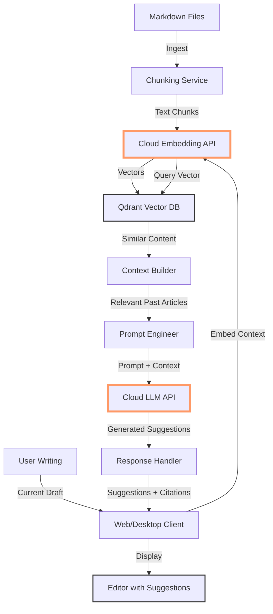

# Building a "Lawyer GPT" for Your Blog - Cloud Alternative: RAG with Qdrant and Generic LLMs

<!--category-- AI, LLM, RAG, C#, Cloud, Qdrant, OpenAI -->
<datetime class="hidden">2025-11-12T12:00</datetime>

## Introduction

In my [8-part "Lawyer GPT" series](/blog/building-a-lawyer-gpt-for-your-blog-part1), I showed you how to build a complete local RAG-based writing assistant using GPU acceleration, local LLMs, and vector databases. It's powerful, private, and runs entirely on your hardware.

But let's be honest - not everyone has a workstation with an NVIDIA GPU, 96GB of RAM, and the patience to set up CUDA, cuDNN, and wrangle GGUF models. What if you just want the benefits of a blog writing assistant without the hardware investment?

This article presents the cloud-based alternative: same RAG approach, same Qdrant vector database, but using cloud LLM APIs instead of local inference. Think of it as "Lawyer GPT Lite" - easier setup, lower barrier to entry, and potentially better output quality using frontier models.

Full disclosure: I'm still learning which approach works best in practice, so take my cost estimates and performance claims with a pinch of salt. What I can say is that this cloud approach has proven remarkably straightforward to set up compared to the GPU route.

> NOTE: This is part of my experiments with AI (assisted drafting) + my own editing. Same voice, same pragmatism; just faster fingers.

## Why a Cloud Alternative?

### The Original Approach

The full "Lawyer GPT" series builds a system that:
- Runs 100% locally (privacy)
- No API costs
- Fast GPU-accelerated inference
- Requires NVIDIA GPU (8GB+ VRAM)
- Complex setup (CUDA, cuDNN, model management)
- Limited to models you can fit in VRAM
- Windows-focused deployment

### The Cloud Alternative

This approach gives you:
- No GPU required (runs on any machine)
- Simple setup (no CUDA/cuDNN)
- Access to frontier models (GPT-4, Claude, etc.)
- Cross-platform (Windows, Mac, Linux)
- Better output quality (larger, more capable models)
- API costs (though reasonable for personal use)
- Data sent to third-party APIs
- Latency depends on network

**When to use which?**

| Use Local Approach | Use Cloud Approach |
|--------------------|-------------------|
| Privacy is critical | Convenience matters most |
| You have GPU hardware | You're on Mac/Linux/laptop |
| High volume usage | Moderate usage (few posts/month) |
| You enjoy tinkering | You want results fast |

[TOC]

## Architecture Overview

The cloud version keeps the same RAG fundamentals but swaps local LLM inference for API calls:



**Key differences:**
- **Embedding Model**: OpenAI's `text-embedding-3-small` API instead of local BGE model
- **LLM**: Claude 3.5 Sonnet or GPT-4 API instead of local Mistral/Llama
- **No GPU required**: Everything CPU-based locally, compute happens in cloud
- **Simpler deployment**: Single executable, no model files to manage

I should note that I haven't run extensive benchmarks comparing the two approaches yet - I'm still in the exploratory phase myself. But the initial results are promising enough to share.

## Technology Stack

### Core Framework
- **.NET 9** - Same as original series
- **C# 13** - Modern language features

### Cloud APIs
- **OpenAI API** - Embeddings (text-embedding-3-small) + LLM (GPT-4)
- **Anthropic API** - Alternative LLM (Claude 3.5 Sonnet)
- **Both** - You can mix and match!

### Vector Database
- **Qdrant** - Same as original, can run locally via Docker or use Qdrant Cloud
- **Alternative**: Pinecone, Weaviate Cloud (managed options)

### Client Options
- **Console App** - Simplest, great for testing
- **Blazor WebAssembly** - Web-based, works anywhere
- **Avalonia** - Cross-platform desktop (Windows, Mac, Linux)

## Setup: The Quick Path

### 1. Install Qdrant

**Option A: Local Docker (Recommended for development)**
```bash
docker run -p 6333:6333 -p 6334:6334 \
    -v $(pwd)/qdrant_storage:/qdrant/storage:z \
    qdrant/qdrant
```

**Option B: Qdrant Cloud (Easiest)**
1. Sign up at [cloud.qdrant.io](https://cloud.qdrant.io)
2. Create a free cluster
3. Get your API key and cluster URL

**No CUDA, no cuDNN, no driver installations needed!**

### 2. Get API Keys

**OpenAI** (for embeddings + LLM):
1. Go to [platform.openai.com](https://platform.openai.com)
2. Create API key
3. Set usage limits (important!)

**Anthropic** (optional, for Claude):
1. Go to [console.anthropic.com](https://console.anthropic.com)
2. Create API key

### 3. Configuration

Create `appsettings.json`:

```json
{
  "BlogRAG": {
    "Embedding": {
      "Provider": "OpenAI",
      "Model": "text-embedding-3-small",
      "ApiKey": "sk-..."
    },
    "LLM": {
      "Provider": "Anthropic",
      "Model": "claude-3-5-sonnet-20241022",
      "ApiKey": "sk-ant-..."
    },
    "VectorStore": {
      "Type": "Qdrant",
      "Url": "http://localhost:6333",
      "ApiKey": "",
      "CollectionName": "blog_embeddings"
    },
    "Ingestion": {
      "MarkdownPath": "/path/to/your/blog/Markdown",
      "ChunkSize": 500,
      "ChunkOverlap": 50
    }
  }
}
```

**That's it.** No GPU setup, no model downloads (12GB files), no VRAM management.

## Implementation

### Core Services

#### 1. Cloud Embedding Service

```csharp
using OpenAI;
using OpenAI.Embeddings;

namespace BlogRAG.Services
{
    public interface IEmbeddingService
    {
        Task<float[]> GenerateEmbeddingAsync(string text);
        Task<List<float[]>> GenerateBatchEmbeddingsAsync(List<string> texts);
    }

    public class OpenAIEmbeddingService : IEmbeddingService
    {
        private readonly OpenAIClient _client;
        private readonly string _model;
        private readonly ILogger<OpenAIEmbeddingService> _logger;

        public OpenAIEmbeddingService(
            string apiKey,
            string model,
            ILogger<OpenAIEmbeddingService> logger)
        {
            _client = new OpenAIClient(apiKey);
            _model = model;
            _logger = logger;
        }

        public async Task<float[]> GenerateEmbeddingAsync(string text)
        {
            var embeddings = await GenerateBatchEmbeddingsAsync(new List<string> { text });
            return embeddings.First();
        }

        public async Task<List<float[]>> GenerateBatchEmbeddingsAsync(List<string> texts)
        {
            _logger.LogInformation("Generating embeddings for {Count} texts", texts.Count);

            var request = new EmbeddingRequest
            {
                Input = texts,
                Model = _model
            };

            var response = await _client.CreateEmbeddingAsync(request);

            return response.Data
                .OrderBy(e => e.Index)
                .Select(e => e.Embedding.ToArray())
                .ToList();
        }
    }
}
```

**Key benefits vs local:**
- No ONNX Runtime setup
- No GPU memory management
- Automatic batching by OpenAI
- State-of-the-art embedding quality

**Cost**: ~$0.0001 per 1K tokens (very cheap)
- Processing 100 blog posts (~500K tokens): ~$0.05
- Daily usage (10 queries): ~$0.001/day = $0.30/month

#### 2. Cloud LLM Service

```csharp
using Anthropic.SDK;
using Anthropic.SDK.Messaging;

namespace BlogRAG.Services
{
    public interface ILLMService
    {
        Task<string> GenerateCompletionAsync(
            string systemPrompt,
            string userPrompt,
            float temperature = 0.7f);

        IAsyncEnumerable<string> GenerateStreamingCompletionAsync(
            string systemPrompt,
            string userPrompt,
            float temperature = 0.7f);
    }

    public class ClaudeLLMService : ILLMService
    {
        private readonly AnthropicClient _client;
        private readonly string _model;
        private readonly ILogger<ClaudeLLMService> _logger;

        public ClaudeLLMService(
            string apiKey,
            string model,
            ILogger<ClaudeLLMService> logger)
        {
            _client = new AnthropicClient(new APIAuthentication(apiKey));
            _model = model;
            _logger = logger;
        }

        public async Task<string> GenerateCompletionAsync(
            string systemPrompt,
            string userPrompt,
            float temperature = 0.7f)
        {
            _logger.LogInformation("Generating completion with temperature {Temp}", temperature);

            var messages = new List<Message>
            {
                new Message
                {
                    Role = RoleType.User,
                    Content = userPrompt
                }
            };

            var request = new MessageRequest
            {
                Model = _model,
                MaxTokens = 2048,
                Temperature = temperature,
                System = systemPrompt,
                Messages = messages
            };

            var response = await _client.Messages.CreateAsync(request);

            return response.Content.First().Text;
        }

        public async IAsyncEnumerable<string> GenerateStreamingCompletionAsync(
            string systemPrompt,
            string userPrompt,
            float temperature = 0.7f)
        {
            var messages = new List<Message>
            {
                new Message { Role = RoleType.User, Content = userPrompt }
            };

            var request = new MessageRequest
            {
                Model = _model,
                MaxTokens = 2048,
                Temperature = temperature,
                System = systemPrompt,
                Messages = messages,
                Stream = true
            };

            await foreach (var chunk in _client.Messages.StreamAsync(request))
            {
                if (chunk.Delta?.Text != null)
                {
                    yield return chunk.Delta.Text;
                }
            }
        }
    }
}
```

**Benefits over local:**
- No model loading (instant startup)
- No VRAM limits (use 200K context if needed)
- Better output quality (at least in theory - I'm still testing)
- Streaming works perfectly

**Cost**:
- Claude 3.5 Sonnet: $3/million input tokens, $15/million output
- Typical blog writing session (20K input, 2K output): roughly $0.09
- Monthly usage (10 sessions): roughly $0.90/month

These are ballpark figures based on my early experiments - your mileage may vary depending on how chatty you are with the AI.

#### 3. Qdrant Vector Store (Same as Original!)

```csharp
using Qdrant.Client;
using Qdrant.Client.Grpc;

namespace BlogRAG.Services
{
    public class QdrantVectorStore
    {
        private readonly QdrantClient _client;
        private readonly string _collectionName;
        private readonly ILogger<QdrantVectorStore> _logger;

        public QdrantVectorStore(
            string url,
            string apiKey,
            string collectionName,
            ILogger<QdrantVectorStore> logger)
        {
            _client = new QdrantClient(url, apiKey: apiKey);
            _collectionName = collectionName;
            _logger = logger;
        }

        public async Task CreateCollectionAsync(int vectorSize)
        {
            var collections = await _client.ListCollectionsAsync();

            if (collections.Any(c => c.Name == _collectionName))
            {
                _logger.LogInformation("Collection {Name} already exists", _collectionName);
                return;
            }

            await _client.CreateCollectionAsync(
                collectionName: _collectionName,
                vectorsConfig: new VectorParams
                {
                    Size = (ulong)vectorSize,
                    Distance = Distance.Cosine
                });

            _logger.LogInformation("Created collection {Name}", _collectionName);
        }

        public async Task UpsertAsync(
            Guid id,
            float[] vector,
            Dictionary<string, object> payload)
        {
            var point = new PointStruct
            {
                Id = id,
                Vectors = vector,
                Payload = payload
            };

            await _client.UpsertAsync(_collectionName, new[] { point });
        }

        public async Task<List<ScoredPoint>> SearchAsync(
            float[] queryVector,
            int limit = 10,
            float scoreThreshold = 0.7f)
        {
            var results = await _client.SearchAsync(
                collectionName: _collectionName,
                vector: queryVector,
                limit: (ulong)limit,
                scoreThreshold: scoreThreshold);

            return results.ToList();
        }
    }
}
```

**Same API as local setup** - just point to local Docker or Qdrant Cloud!

### Ingestion Pipeline

```csharp
namespace BlogRAG.Services
{
    public class IngestionService
    {
        private readonly IEmbeddingService _embedder;
        private readonly QdrantVectorStore _vectorStore;
        private readonly ILogger<IngestionService> _logger;

        public IngestionService(
            IEmbeddingService embedder,
            QdrantVectorStore vectorStore,
            ILogger<IngestionService> logger)
        {
            _embedder = embedder;
            _vectorStore = vectorStore;
            _logger = logger;
        }

        public async Task IngestMarkdownFilesAsync(string markdownPath)
        {
            var files = Directory.GetFiles(markdownPath, "*.md", SearchOption.AllDirectories);
            _logger.LogInformation("Found {Count} markdown files", files.Length);

            foreach (var file in files)
            {
                await IngestFileAsync(file);
            }
        }

        private async Task IngestFileAsync(string filePath)
        {
            var content = await File.ReadAllTextAsync(filePath);
            var metadata = ExtractMetadata(content);
            var chunks = ChunkContent(content);

            _logger.LogInformation("Processing {File}: {ChunkCount} chunks",
                Path.GetFileName(filePath), chunks.Count);

            // Batch embedding generation
            var texts = chunks.Select(c => c.Text).ToList();
            var embeddings = await _embedder.GenerateBatchEmbeddingsAsync(texts);

            // Upload to Qdrant
            for (int i = 0; i < chunks.Count; i++)
            {
                var chunk = chunks[i];
                var embedding = embeddings[i];

                var payload = new Dictionary<string, object>
                {
                    ["text"] = chunk.Text,
                    ["file_path"] = filePath,
                    ["blog_post_slug"] = metadata.Slug,
                    ["blog_post_title"] = metadata.Title,
                    ["chunk_index"] = i,
                    ["category"] = metadata.Category
                };

                await _vectorStore.UpsertAsync(Guid.NewGuid(), embedding, payload);
            }

            _logger.LogInformation("Ingested {File}", Path.GetFileName(filePath));
        }

        private List<TextChunk> ChunkContent(string content, int chunkSize = 500, int overlap = 50)
        {
            // Simple sentence-aware chunking
            var sentences = content.Split(new[] { ". ", ".\n", "!\n", "?\n" },
                StringSplitOptions.RemoveEmptyEntries);

            var chunks = new List<TextChunk>();
            var currentChunk = new StringBuilder();
            var currentLength = 0;

            foreach (var sentence in sentences)
            {
                if (currentLength + sentence.Length > chunkSize && currentChunk.Length > 0)
                {
                    chunks.Add(new TextChunk { Text = currentChunk.ToString() });

                    // Overlap: keep last sentence
                    currentChunk.Clear();
                    currentLength = 0;
                }

                currentChunk.Append(sentence).Append(". ");
                currentLength += sentence.Length;
            }

            if (currentChunk.Length > 0)
            {
                chunks.Add(new TextChunk { Text = currentChunk.ToString() });
            }

            return chunks;
        }

        private BlogMetadata ExtractMetadata(string content)
        {
            // Extract from markdown frontmatter or HTML comments
            var titleMatch = Regex.Match(content, @"^#\s+(.+)$", RegexOptions.Multiline);
            var categoryMatch = Regex.Match(content, @"<!--category--\s+(.+)-->");

            return new BlogMetadata
            {
                Title = titleMatch.Success ? titleMatch.Groups[1].Value : "Untitled",
                Category = categoryMatch.Success ? categoryMatch.Groups[1].Value : "General",
                Slug = Path.GetFileNameWithoutExtension(content)
            };
        }
    }

    public class TextChunk
    {
        public string Text { get; set; } = string.Empty;
    }

    public class BlogMetadata
    {
        public string Title { get; set; } = string.Empty;
        public string Category { get; set; } = string.Empty;
        public string Slug { get; set; } = string.Empty;
    }
}
```

### RAG Generation Service

```csharp
namespace BlogRAG.Services
{
    public class RAGGenerationService
    {
        private readonly IEmbeddingService _embedder;
        private readonly QdrantVectorStore _vectorStore;
        private readonly ILLMService _llm;
        private readonly ILogger<RAGGenerationService> _logger;

        public RAGGenerationService(
            IEmbeddingService embedder,
            QdrantVectorStore vectorStore,
            ILLMService llm,
            ILogger<RAGGenerationService> logger)
        {
            _embedder = embedder;
            _vectorStore = vectorStore;
            _llm = llm;
            _logger = logger;
        }

        public async Task<string> GenerateSuggestionAsync(
            string currentDraft,
            string requestType = "continue")
        {
            // 1. Generate embedding for current draft
            var draftEmbedding = await _embedder.GenerateEmbeddingAsync(currentDraft);

            // 2. Search for relevant past content
            var results = await _vectorStore.SearchAsync(
                queryVector: draftEmbedding,
                limit: 5,
                scoreThreshold: 0.7f);

            _logger.LogInformation("Found {Count} relevant chunks", results.Count);

            // 3. Build context from results
            var contextBuilder = new StringBuilder();
            foreach (var result in results)
            {
                var text = result.Payload["text"].ToString();
                var title = result.Payload["blog_post_title"].ToString();
                var score = result.Score;

                contextBuilder.AppendLine($"## From: {title} (relevance: {score:F2})");
                contextBuilder.AppendLine(text);
                contextBuilder.AppendLine();
            }

            // 4. Build prompt
            var systemPrompt = BuildSystemPrompt(requestType);
            var userPrompt = BuildUserPrompt(currentDraft, contextBuilder.ToString(), requestType);

            // 5. Generate with LLM
            var suggestion = await _llm.GenerateCompletionAsync(
                systemPrompt: systemPrompt,
                userPrompt: userPrompt,
                temperature: 0.7f);

            return suggestion;
        }

        private string BuildSystemPrompt(string requestType)
        {
            return requestType switch
            {
                "continue" => @"You are a technical blog writing assistant. Your role is to suggest
                    continuations for blog posts based on the author's past writing style and content.

                    Guidelines:
                    - Match the author's voice and technical depth
                    - Use similar patterns and structures from past posts
                    - Be specific and technical, not generic
                    - Include code examples when relevant
                    - Maintain consistency with past content",

                "improve" => @"You are a technical blog editor. Your role is to improve sections
                    of blog posts while maintaining the author's voice.

                    Guidelines:
                    - Preserve the author's style
                    - Improve clarity and flow
                    - Add technical depth where appropriate
                    - Suggest better examples from past posts
                    - Fix unclear explanations",

                "outline" => @"You are a technical blog outline generator. Your role is to suggest
                    outlines for new blog posts based on past structures.

                    Guidelines:
                    - Study the author's typical post structure
                    - Suggest sections based on successful past posts
                    - Include technical depth appropriate to topic
                    - Reference similar past articles",

                _ => "You are a helpful technical writing assistant."
            };
        }

        private string BuildUserPrompt(string currentDraft, string context, string requestType)
        {
            return $@"
# Current Draft
{currentDraft}

# Relevant Past Content
{context}

# Request
{GetRequestDescription(requestType)}

Please provide your suggestion based on the current draft and the relevant past content shown above.
Remember to maintain consistency with the author's past writing style and technical approach.
";
        }

        private string GetRequestDescription(string requestType)
        {
            return requestType switch
            {
                "continue" => "Continue writing from where the draft ends. Suggest the next 1-2 paragraphs.",
                "improve" => "Improve the current draft. Suggest specific edits and enhancements.",
                "outline" => "Create a detailed outline for completing this post.",
                _ => "Provide helpful suggestions."
            };
        }
    }
}
```

## Simple Console Client

```csharp
using Microsoft.Extensions.Configuration;
using Microsoft.Extensions.DependencyInjection;
using Microsoft.Extensions.Logging;

namespace BlogRAG.Console
{
    class Program
    {
        static async Task Main(string[] args)
        {
            // Setup DI and configuration
            var services = new ServiceCollection();

            var configuration = new ConfigurationBuilder()
                .SetBasePath(Directory.GetCurrentDirectory())
                .AddJsonFile("appsettings.json")
                .AddUserSecrets<Program>()  // For API keys
                .Build();

            services.AddLogging(builder => builder.AddConsole());

            // Register services
            var embeddingConfig = configuration.GetSection("BlogRAG:Embedding");
            services.AddSingleton<IEmbeddingService>(sp =>
                new OpenAIEmbeddingService(
                    embeddingConfig["ApiKey"]!,
                    embeddingConfig["Model"]!,
                    sp.GetRequiredService<ILogger<OpenAIEmbeddingService>>()));

            var llmConfig = configuration.GetSection("BlogRAG:LLM");
            services.AddSingleton<ILLMService>(sp =>
                new ClaudeLLMService(
                    llmConfig["ApiKey"]!,
                    llmConfig["Model"]!,
                    sp.GetRequiredService<ILogger<ClaudeLLMService>>()));

            var vectorConfig = configuration.GetSection("BlogRAG:VectorStore");
            services.AddSingleton(sp =>
                new QdrantVectorStore(
                    vectorConfig["Url"]!,
                    vectorConfig["ApiKey"] ?? "",
                    vectorConfig["CollectionName"]!,
                    sp.GetRequiredService<ILogger<QdrantVectorStore>>()));

            services.AddSingleton<IngestionService>();
            services.AddSingleton<RAGGenerationService>();

            var serviceProvider = services.BuildServiceProvider();

            // Run CLI
            await RunCLI(serviceProvider, configuration);
        }

        static async Task RunCLI(ServiceProvider serviceProvider, IConfiguration configuration)
        {
            System.Console.WriteLine("=== Blog RAG Assistant ===\n");
            System.Console.WriteLine("Commands:");
            System.Console.WriteLine("  ingest - Ingest markdown files");
            System.Console.WriteLine("  write - Start writing session");
            System.Console.WriteLine("  quit - Exit\n");

            while (true)
            {
                System.Console.Write("> ");
                var command = System.Console.ReadLine()?.Trim().ToLower();

                switch (command)
                {
                    case "ingest":
                        await IngestCommand(serviceProvider, configuration);
                        break;
                    case "write":
                        await WriteCommand(serviceProvider);
                        break;
                    case "quit":
                        return;
                    default:
                        System.Console.WriteLine("Unknown command");
                        break;
                }
            }
        }

        static async Task IngestCommand(ServiceProvider serviceProvider, IConfiguration configuration)
        {
            var ingestion = serviceProvider.GetRequiredService<IngestionService>();
            var markdownPath = configuration["BlogRAG:Ingestion:MarkdownPath"];

            System.Console.WriteLine($"Ingesting from {markdownPath}...");
            await ingestion.IngestMarkdownFilesAsync(markdownPath!);
            System.Console.WriteLine("Ingestion complete!\n");
        }

        static async Task WriteCommand(ServiceProvider serviceProvider)
        {
            var rag = serviceProvider.GetRequiredService<RAGGenerationService>();

            System.Console.WriteLine("\nEnter your draft (end with empty line):");
            var draft = new StringBuilder();
            string? line;

            while (!string.IsNullOrWhiteSpace(line = System.Console.ReadLine()))
            {
                draft.AppendLine(line);
            }

            System.Console.WriteLine("\nGenerating suggestion...\n");
            var suggestion = await rag.GenerateSuggestionAsync(draft.ToString());

            System.Console.WriteLine("=== Suggestion ===");
            System.Console.WriteLine(suggestion);
            System.Console.WriteLine("\n");
        }
    }
}
```

## Running the System

### First Time Setup

```bash
# 1. Clone/create project
dotnet new console -n BlogRAG
cd BlogRAG

# 2. Add packages
dotnet add package Qdrant.Client
dotnet add package OpenAI
dotnet add package Anthropic.SDK
dotnet add package Microsoft.Extensions.Configuration.Json
dotnet add package Microsoft.Extensions.Configuration.UserSecrets

# 3. Set API keys (stored securely)
dotnet user-secrets init
dotnet user-secrets set "BlogRAG:Embedding:ApiKey" "sk-..."
dotnet user-secrets set "BlogRAG:LLM:ApiKey" "sk-ant-..."

# 4. Start Qdrant (local)
docker run -d -p 6333:6333 qdrant/qdrant

# 5. Run ingestion
dotnet run
> ingest

# 6. Start writing
> write
```

**Total setup time**: roughly 15 minutes vs roughly 2 hours for local GPU setup - assuming everything goes smoothly, which in my experience is a dangerous assumption to make.

### Daily Usage

```bash
# Start Qdrant (if using local Docker)
docker start qdrant

# Run assistant
dotnet run
> write

# Enter your draft
I've been working on a new feature that uses Entity Framework Core...
[Ctrl+D or empty line]

# Get AI suggestion based on your past EF posts!
```

## Cost Analysis

### Monthly Cost Estimate (Personal Blog)

**Scenario**: Writing 4 blog posts per month

| Operation | Volume | Cost |
|-----------|--------|------|
| Initial ingestion (100 posts) | One-time, 500K tokens | $0.05 |
| Embeddings (queries, 40/month) | 40K tokens | $0.004 |
| LLM calls (40 suggestions) | 800K input, 80K output | $3.60 |
| **Total monthly** | | **~$3.65** |

**For comparison:**
- Local setup: $0/month (but $800+ GPU upfront)
- ChatGPT Plus: $20/month (no RAG, generic)
- Grammarly Premium: $12/month (no AI writing)

**Break-even point**: If you'd use this for 18+ months, local GPU pays for itself. Otherwise, cloud is cheaper. Though I'm still working out whether my cost projections are accurate - I may be eating my words in a few months when the bills come in.

### Cost Optimization Tips

1. **Use smaller models for embeddings**:
   - `text-embedding-3-small`: $0.00002/1K tokens
   - `text-embedding-3-large`: $0.00013/1K tokens
   - 6.5x cost difference!

2. **Batch API calls** (50% cheaper for non-urgent):
   ```csharp
   // Use OpenAI Batch API for ingestion
   var batch = await client.CreateBatchAsync(requests);
   // Wait hours, pay half price
   ```

3. **Cache embeddings locally**:
   ```csharp
   // Don't re-embed identical text
   var cache = new Dictionary<string, float[]>();
   ```

4. **Use cheaper models for drafts**:
   - Claude 3.5 Haiku: $0.25/M input (12x cheaper than Sonnet)
   - GPT-4o-mini: $0.15/M input (20x cheaper than GPT-4)

5. **Limit context window**:
   ```csharp
   // Retrieve top 3 instead of top 10 chunks
   limit: 3  // 70% less input tokens
   ```

## Advantages Over Local Setup

### 1. Better Model Quality

| Model | Context | Quality | Local? | Cloud? |
|-------|---------|---------|--------|--------|
| Mistral 7B | 8K | Good | Yes (needs 8GB VRAM) | Yes |
| Llama 3 70B | 8K | Excellent | No (needs 48GB VRAM) | Yes |
| GPT-4 Turbo | 128K | Excellent | No | Yes |
| Claude 3.5 Sonnet | 200K | Best | No | Yes |

**Cloud gives you access to 70B+ models** that would require $10K+ GPU hardware. At least, that's the theory - I'm still learning whether the larger models actually produce noticeably better blog content in practice.

### 2. Instant Updates

```csharp
// Switch models with one line
services.AddSingleton<ILLMService>(sp =>
    new ClaudeLLMService(  // Was GPT-4, now Claude
        config["ApiKey"],
        "claude-3-5-sonnet-20241022",  // Latest model
        sp.GetRequiredService<ILogger<ClaudeLLMService>>()));
```

**No model downloads**, no GGUF conversions, no compatibility checks. This is genuinely brilliant when you're experimenting with different models to see what works best.

### 3. Cross-Platform

```bash
# Works on Mac (no CUDA support)
dotnet run  # Just works!

# Works on Linux ARM (Raspberry Pi?)
dotnet run  # Just works!

# Works in Codespaces/Gitpod
dotnet run  # Just works!
```

**Local approach is Windows + NVIDIA only.**

### 4. Scalability

```csharp
// Handle 100 concurrent users? Easy with APIs
await Task.WhenAll(users.Select(u =>
    rag.GenerateSuggestionAsync(u.Draft)));

// Local? Limited by your single GPU
```

### 5. Simpler Deployment

```bash
# Deploy to Azure/AWS/GCP
dotnet publish -c Release
# Upload single binary, set env vars, done

# Local? Need to:
# - Include 12GB model files
# - Install CUDA on target machine
# - Ensure GPU drivers
# - Manage VRAM
```

## Limitations & Trade-offs

### 1. Privacy Concerns

**Your blog content goes to OpenAI/Anthropic.**

Mitigation:
- Use for public blog content only
- Check provider's data usage policy
- OpenAI: API data not used for training (as of 2024)
- Anthropic: Same commitment

If you're drafting confidential content, use the local approach. I'm comfortable with this for my public blog, but I wouldn't use it for anything remotely sensitive - and you shouldn't take my word for what "remotely sensitive" means for your use case.

### 2. Network Dependency

**No internet = no assistant.**

Mitigation:
- Cache previous suggestions locally
- Implement offline mode for editing
- Fall back to local smaller models

### 3. Latency

**API calls take 1-3 seconds vs <1s local.**

Reality check:
- Local: 0.5s generation
- Cloud: 2s generation
- Difference: 1.5s (perfectly acceptable for writing assistance in my experience - though I suppose it depends on how impatient you are)

### 4. Vendor Lock-in

**Switching APIs requires code changes.**

Mitigation:
```csharp
// Use abstraction layer
public interface ILLMService
{
    // Switch providers easily
}

// Factory pattern
services.AddSingleton<ILLMService>(sp =>
{
    return config["Provider"] switch
    {
        "OpenAI" => new OpenAILLMService(...),
        "Anthropic" => new ClaudeLLMService(...),
        "Cohere" => new CohereLLMService(...),
        _ => throw new Exception("Unknown provider")
    };
});
```

## Hybrid Approach: Best of Both Worlds

**Can you mix local and cloud?** Absolutely!

```csharp
public class HybridEmbeddingService : IEmbeddingService
{
    private readonly LocalOnnxEmbedding _local;
    private readonly OpenAIEmbeddingService _cloud;
    private readonly bool _preferLocal;

    public async Task<float[]> GenerateEmbeddingAsync(string text)
    {
        if (_preferLocal && _local.IsAvailable())
        {
            return _local.GenerateEmbedding(text);  // Free, fast
        }

        return await _cloud.GenerateEmbeddingAsync(text);  // Fallback
    }
}
```

**Use local for embeddings (cheap, fast), cloud for LLM (quality matters)**:
- Embeddings locally: Save $0.004/month (tiny amount, admittedly)
- LLM in cloud: Get GPT-4/Claude quality

This is actually my **recommended approach**, though I'm still experimenting to see if it's the right balance:
1. Run small embedding model locally (no GPU needed)
2. Use cloud APIs for LLM
3. Qdrant local for development, cloud for production

## Conclusion

The cloud alternative to "Lawyer GPT" gives you roughly 80% of the benefits with 20% of the complexity - or at least that's been my experience so far:

| Feature | Local | Cloud |
|---------|-------|-------|
| Setup time | 2-4 hours | 15 minutes |
| Hardware requirement | NVIDIA GPU | Any computer |
| Model quality | 7B-13B | GPT-4, Claude 3.5 |
| Monthly cost | $0 | roughly $3-5 |
| Latency | 0.5s | 2s |
| Privacy | 100% local | Sent to APIs |
| Cross-platform | Windows only | Mac/Linux/Windows |
| Maintenance | Model updates, CUDA updates | None |

**When to use cloud:**
- You don't have NVIDIA GPU
- You're on Mac/Linux
- You want the easiest path
- You write fewer than 10 posts/month
- You trust cloud providers with public content

**When to use local:**
- You have GPU hardware
- Privacy is critical
- You want $0 operating cost
- You write more than 20 posts/month
- You enjoy tinkering

**Best approach:** Start with cloud. If you love it and hit cost/privacy limits, migrate to local later. The RAG architecture is identical - you just swap the LLM service! Though I should caveat that I'm still learning the gotchas here.

## Next Steps

1. **Try it**: Set up the cloud version this afternoon
2. **Ingest**: Process your blog posts
3. **Write**: Get AI suggestions based on your past content
4. **Measure**: Track costs and usefulness
5. **Decide**: Keep cloud or migrate to local?

The beauty of RAG is **you're not locked in**. The vector database, chunking, and retrieval logic work the same whether your LLM is on your GPU or in OpenAI's datacentre.

Start simple, prove value, then optimise. I'm still learning what works best myself, so I'd be keen to hear how you get on.

## Resources

### Related Articles
- [Original Lawyer GPT Series (Part 1)](/blog/building-a-lawyer-gpt-for-your-blog-part1)
- [RAG Explained (Anthropic)](/blog/building-a-lawyer-gpt-for-your-blog-part1)

### Tools & Services
- [Qdrant](https://qdrant.tech/) - Vector database
- [Qdrant Cloud](https://cloud.qdrant.io) - Managed hosting
- [OpenAI Platform](https://platform.openai.com)
- [Anthropic Console](https://console.anthropic.com)
- [OpenAI .NET SDK](https://github.com/openai/openai-dotnet)
- [Anthropic .NET SDK](https://github.com/tghamm/Anthropic.SDK)

### Code
- Full example code: [GitHub repository] (coming soon!)

Happy writing with your cloud-powered AI assistant.
