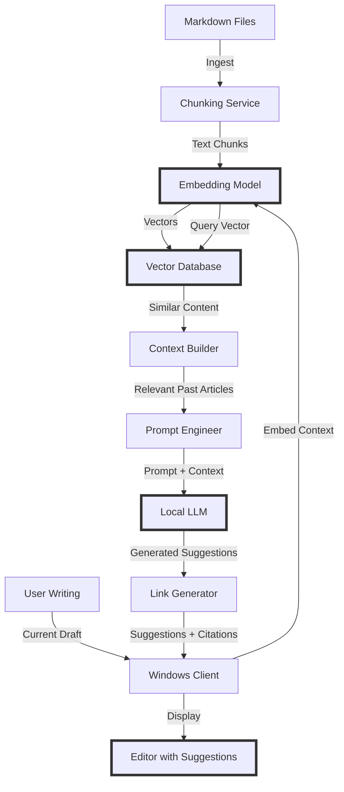

# Building a "Lawyer GPT" for Your Blog - Part 1: Introduction & Architecture

<!--category-- AI, LLM, RAG, C#, AI-Article, mostlylucid.blogllm -->
<datetime class="hidden">1973-02-08T12:00</datetime>

> WARNING: THESE ARE DRAFT POSTS WHICH 'ESCAPED'.

It's likely much of what's below won't work; I generate these as how-to for ME and then do all the steps and get the sample app working...You've been sneaky and seen them!  they'll likely be ready mid-December.


## Introduction

Buckle in because this is going to be a long series! If you've been following along with this blog, you'll know I'm a bit obsessed with finding interesting ways to use LLMs and AI in practical applications. Well, I've got a new project that combines my love of blogging, C#, and AI: building a writing assistant that helps me draft new blog posts using my existing content as a knowledge base.

> NOTE: This is part of my experiments with AI (assisted drafting) + my own editing. Same voice, same pragmatism; just faster fingers.

Think of how modern legal practices use LLMs trained on case law to draft briefs, motions, and contracts. They don't start from scratch - the system references relevant precedents, suggests language based on successful past documents, and maintains consistency with established patterns. That's exactly what we're building here, but for blog content.

The goal is to create an AI-powered writing assistant that:
- Helps draft new blog posts in my established style
- Suggests relevant content from past articles to reference
- Finds similar posts to maintain consistency
- Auto-generates internal links to related articles
- Acts like "GitHub Copilot for your blog"

This series will cover building a complete [Retrieval Augmented Generation (RAG)](https://www.anthropic.com/index/contextual-retrieval) system in C# that runs on Windows. We'll use the latest approaches and frameworks, and I'll explain each new technology as we encounter it.

## My Hardware Setup (and Minimum Specs)

**My Development Machine:**
- **GPU**: NVIDIA RTX A4000 (16GB VRAM)
- **CPU**: AMD Ryzen 9 9950X
- **RAM**: 96GB DDR5

This is my specific setup, but you **don't need this hardware** to follow along. Here are the minimum specs for different components:

### GPU Acceleration (Recommended, not required)
- **Minimum**: NVIDIA GPU with 8GB VRAM (e.g., RTX 3060, GTX 1070 Ti)
  - Can run 7B parameter models with quantization
  - Decent embedding generation speed
- **Comfortable**: 12GB+ VRAM (e.g., RTX 3060 12GB, RTX 4060 Ti)
  - Run larger models or higher quality quantizations
- **My setup**: 16GB (A4000) - Can run 13B models comfortably

### CPU-Only Alternative
- **Minimum**: Modern quad-core CPU
- **Recommended**: 8+ cores (for reasonable embedding generation)
- Everything works on CPU-only, just slower:
  - Embedding generation: ~5-10x slower
  - LLM inference: ~10-50x slower
  - Still totally usable for a writing assistant!

### RAM Requirements
- **Minimum**: 16GB system RAM
  - CPU-only inference for 7B models
- **Comfortable**: 32GB
  - Better for larger models on CPU
- **My setup**: 96GB - Overkill, 32GB is plenty

### Storage
- **SSD**: Recommended for model loading
- **Space**: ~20GB for models and vector database

### What About Intel/AMD NPUs?

Modern CPUs now include dedicated AI accelerators:
- **Intel Core Ultra** (Meteor Lake+) - Intel AI Boost (NPU)
- **AMD Ryzen AI** (7040/8040 series) - XDNA NPU
- **AMD Ryzen AI Max** (Strix Point) - Up to 50 TOPS

**Important: NPUs are for inference only!** You don't "build" or train models on NPUs - they're designed to *run* pre-trained models efficiently. Models are trained on cloud GPUs (or workstations), then downloaded and deployed to NPUs for inference.

**Current Status for Running Models on NPUs (as of writing):**
- ✅ Great for: On-device inference, battery efficiency (laptops)
- ⚠️ Limited for our use: Immature .NET/ONNX Runtime support
- ❌ Not ready for: This project's primary path

**Why not NPUs for this series?**
1. **Software ecosystem**: CUDA has 15+ years of maturity, NPU support in .NET is nascent
2. **Model compatibility**: Most GGUF models target CUDA/CPU, NPU-optimized models are rare
3. **Documentation**: Limited resources for NPU development in C#
4. **Performance**: Currently slower than discrete GPUs for our workload
5. **DirectML support**: Still experimental for LLM inference

**Can you use NPUs for inference? Yes, but:**
- Requires [DirectML](https://github.com/microsoft/DirectML) execution provider in ONNX Runtime
- Models need to be in ONNX format (not GGUF)
- C# support is experimental
- Performance is currently underwhelming vs. CUDA

**How to try NPU inference (advanced users):**
```bash
# Use DirectML execution provider (supports NPU)
dotnet add package Microsoft.ML.OnnxRuntime.DirectML

# In code:
var sessionOptions = new SessionOptions();
sessionOptions.AppendExecutionProvider("DML"); // DirectML
var session = new InferenceSession("model.onnx", sessionOptions);
```

**Future consideration**: Once [ONNX Runtime](https://onnxruntime.ai/) and [DirectML](https://github.com/microsoft/DirectML) mature their NPU support (likely 2024-2025), these will become viable alternatives for inference!

**Bottom line**: I'll show the GPU-accelerated path, but will note CPU-only alternatives throughout. You can start CPU-only and upgrade later!

[TOC]

## What We're Building

The final system will have several components:

1. **Markdown Ingestion Pipeline** - Processes all the blog posts, chunks them intelligently, and generates embeddings
2. **Vector Database** - Stores embeddings and enables semantic search for similar content
3. **Windows Client Application** - A desktop writing assistant UI with editor and suggestion panel
4. **LLM Integration** - Local GPU-accelerated inference for content generation
5. **Citation & Link Generation** - Auto-suggests internal links and references to related posts
6. **Style Consistency Engine** - Learns patterns from existing posts to maintain voice and structure

Think of it as "GitHub Copilot meets Grammarly" but trained specifically on your blog's content and style.

## Why "Lawyer GPT"?

Modern law firms use LLMs trained on vast libraries of case law to help draft legal documents. When writing a motion, the system:
- References relevant precedents and past successful arguments
- Suggests language patterns that have worked before
- Maintains consistency with legal writing standards
- Cites sources automatically

That's our model. When I start writing "Adding Entity Framework for...", the system should:
- Find my previous EF-related posts
- Suggest structural patterns I've used before
- Offer relevant code snippets from past articles
- Auto-generate links to related posts
- Maintain my writing style and technical depth

Unlike generic AI writing assistants, our system is grounded in actual past content, so it won't suggest things inconsistent with what I've already written.

## Series Overview

Here's what we'll cover over the coming weeks:

### Part 1 (This Post): Introduction & Architecture
We'll establish what we're building and why, plus cover the architectural decisions.

### [Part 2: GPU Setup & CUDA in C#](/blog/building-a-lawyer-gpt-for-your-blog-part2)
Getting Windows set up for GPU-accelerated AI workloads, installing [CUDA](https://developer.nvidia.com/cuda-toolkit), [cuDNN](https://developer.nvidia.com/cudnn), and testing that C# can actually see and use your GPU.

### [Part 3: Understanding Embeddings & Vector Databases](/blog/building-a-lawyer-gpt-for-your-blog-part3)
Deep dive into what embeddings actually are, how they enable semantic search, and choosing the right vector database (spoiler: we'll probably use [Qdrant](https://qdrant.tech/) or [pgvector](https://github.com/pgvector/pgvector)).

### [Part 4: Building the Ingestion Pipeline](/blog/building-a-lawyer-gpt-for-your-blog-part4)
Processing markdown files, intelligent chunking strategies (you can't just split on paragraphs!), and generating embeddings for all our content.

### [Part 5: The Windows Client](/blog/building-a-lawyer-gpt-for-your-blog-part5)
Choosing the right framework ([WPF](https://docs.microsoft.com/en-us/dotnet/desktop/wpf/), [Avalonia](https://avaloniaui.net/), or [MAUI](https://dotnet.microsoft.com/en-us/apps/maui)?), building the UI, and making it actually pleasant to use.

### [Part 6: Local LLM Integration](/blog/building-a-lawyer-gpt-for-your-blog-part6)
Running models locally using [ONNX Runtime](https://onnxruntime.ai/), [llama.cpp](https://github.com/ggerganov/llama.cpp) bindings, or other approaches. Making full use of that A4000!

### [Part 7: Content Generation & Prompt Engineering](/blog/building-a-lawyer-gpt-for-your-blog-part7)
Bringing it all together - semantic search for relevant content, context window management, prompt engineering for writing assistance, and generating coherent suggestions.

### [Part 8: Advanced Features & Production Deployment](/blog/building-a-lawyer-gpt-for-your-blog-part8)
Auto-linking to related posts, style consistency checking, code snippet suggestions, and making the system actually useful for daily writing.

## Why RAG?

Before we dive into architecture, let's talk about why RAG (Retrieval Augmented Generation) is the right approach here.

### The Problem with Fine-Tuning

You might think: "Why not just fine-tune an LLM on all the blog posts?" There are several issues with that:

1. **Cost & Complexity** - Fine-tuning is expensive (both in compute and effort)
2. **Staleness** - Every new blog post means retraining
3. **Black Box** - Hard to understand what the model "learned"
4. **Hallucination** - No guarantee the model won't make things up
5. **No Citations** - Can't easily trace answers back to sources

### How RAG Solves This

RAG combines the best of both worlds: the power of LLMs with the precision of search to create context-aware content generation.

The flow is:
1. User starts writing (e.g., "Building a REST API with ASP.NET Core...")
2. System finds semantically similar past articles
3. System feeds relevant chunks as context to the LLM
4. LLM generates suggestions/continuations based on past content
5. System offers suggestions with references to source posts

This means:
- ✅ Always up-to-date (just re-index new posts as you write them)
- ✅ Grounded in your actual writing (maintains consistency)
- ✅ Traceable (know which past posts influenced suggestions)
- ✅ Efficient (no expensive retraining for every new post)
- ✅ Flexible (can swap out LLMs or adjust search strategies)
- ✅ Privacy-preserving (everything runs locally)

## System Architecture

Let me break down the key components we'll be building:



### 1. Markdown Ingestion Pipeline

This component:
- Reads markdown files from the blog directory
- Extracts metadata (title, categories, date, word count)
- Intelligently chunks the content (preserving code blocks for reuse)
- Identifies structural patterns (how I organize posts)
- Tracks source information for citation generation

**Key Challenge**: Chunking strategy matters enormously. Too small and you lose context. Too large and you waste the LLM's context window. We need chunks that are semantically meaningful - a complete thought or section, not arbitrary paragraph breaks.

### 2. Embedding Model

Embeddings are the magic that makes semantic search work. An embedding model takes text and converts it into a high-dimensional vector (array of numbers) that captures semantic meaning.

Similar concepts end up "close" in vector space, even if they use different words.

For example:
- "database migration" and "updating the DB schema" would have similar embeddings
- "cat" and "kitten" would be closer than "cat" and "database"

**Technology Choice**: We'll probably use either:
- [sentence-transformers](https://www.sbert.net/) models (can run via ONNX Runtime in C#)
- OpenAI's embedding models (via API)
- [BGE models](https://huggingface.co/BAAI/bge-base-en-v1.5) (state-of-the-art open source)

### 3. Vector Database

The vector database stores embeddings and enables fast similarity search. When you're writing about "Docker compose", it finds the K most semantically similar past content - not just keyword matches, but conceptually related material.

**Technology Choice**: We'll evaluate:
- **[Qdrant](https://qdrant.tech/)** - Modern, written in Rust, excellent C# client, Docker-friendly
- **[pgvector](https://github.com/pgvector/pgvector)** - Extension for PostgreSQL (we're already using Postgres!)
- **[Weaviate](https://weaviate.io/)** - Another solid option with good .NET support
- **[Chroma](https://www.trychroma.com/)** - Popular in Python land, less so in C#

I'm leaning toward Qdrant for its simplicity and performance, or pgvector to keep everything in Postgres.

### 4. Windows Client

We need a nice UI for writing with AI assistance. Think split-pane editor with suggestions. Options:

**[WPF (Windows Presentation Foundation)](https://docs.microsoft.com/en-us/dotnet/desktop/wpf/)**
- ✅ Mature, stable, lots of resources
- ✅ Native Windows performance
- ❌ Windows-only
- ❌ Looks dated unless you invest in UI libraries

**[Avalonia](https://avaloniaui.net/)**
- ✅ Cross-platform (XAML-based)
- ✅ Modern, actively developed
- ✅ Similar to WPF
- ❌ Smaller ecosystem

**[MAUI (Multi-platform App UI)](https://dotnet.microsoft.com/en-us/apps/maui)**
- ✅ Cross-platform
- ✅ Microsoft-backed
- ❌ Still maturing
- ❌ More mobile-focused

Since we're Windows-focused and I want something stable, I'm leaning toward **WPF with [ModernWPF UI](https://github.com/Kinnara/ModernWpf)** or **Avalonia** for that cross-platform potential.

### 5. Local LLM Integration

This is where the A4000 GPU shines. We want to run the LLM locally for:
- Privacy (no data sent to APIs)
- Speed (local inference is fast)
- Cost (no API fees)
- Control (we choose the model)

**Technology Options**:

**[ONNX Runtime](https://onnxruntime.ai/)**
- Convert models to ONNX format
- Excellent GPU acceleration
- C# native support
- Downside: Not all models convert well

**[llama.cpp](https://github.com/ggerganov/llama.cpp) bindings**
- C++ library with C# bindings ([LLamaSharp](https://github.com/SciSharp/LLamaSharp))
- Supports CUDA
- Wide model support (Llama, Mistral, etc.)
- Very active development

**[TorchSharp](https://github.com/dotnet/TorchSharp)**
- PyTorch bindings for .NET
- Most flexibility
- Steeper learning curve

I'm leaning toward **LLamaSharp** for its maturity and ease of use with popular models.

### 6. Context Window Management & Prompt Engineering

LLMs have limited context windows (e.g., 4K, 8K, 32K tokens). We need to:
- Retrieve the most relevant past content (top K from vector search)
- Fit them into the context window with the current draft
- Structure the prompt for writing assistance
- Leave room for the generated suggestions

This is trickier than it sounds. We'll explore strategies like:
- Dynamic K selection based on what you're currently writing
- Re-ranking retrieved chunks by relevance
- Compressing context intelligently
- Multi-shot prompting with examples from past posts

### 7. Link & Citation Generation

Every chunk needs metadata:
- Source file/post
- Position in the original document
- Publish date
- Categories
- Code snippets used

When the LLM generates suggestions, we automatically create markdown links to the source posts and identify reusable code patterns.

## What Makes This Different?

There are lots of RAG tutorials out there, but this series will be different:

1. **C# First** - Most RAG examples are in Python. We're going full .NET
2. **Windows & GPU** - Leveraging NVIDIA CUDA on Windows, not Linux/WSL
3. **Production Ready** - Not just proof-of-concept, but actual usable code
4. **Domain-Specific** - Optimized for blog writing assistance, not generic content generation
5. **Deep Explanations** - We'll actually explain the "why" behind decisions

## Technologies We'll Use

Here's the tech stack I'm planning:

### Core Framework
- **.NET 9** (latest at the time of writing)
- **C# 13** - Modern language features

### AI/ML Libraries
- **[ONNX Runtime](https://onnxruntime.ai/)** or **[LLamaSharp](https://github.com/SciSharp/LLamaSharp)** - LLM inference
- **[Microsoft.ML](https://dotnet.microsoft.com/en-us/apps/machinelearning-ai/ml-dotnet)** - Potentially for some tasks
- **SentenceTransformers via ONNX** - Embeddings

### Vector Database
- **[Qdrant](https://qdrant.tech/)** or **[pgvector](https://github.com/pgvector/pgvector)** - To be determined

### UI Framework
- **WPF** with **ModernWPF** or **[Avalonia](https://avaloniaui.net/)** - Modern desktop UI

### Supporting Tools
- **[Markdig](https://github.com/xoofx/markdig)** - Already using this for markdown parsing
- **[Docker](https://www.docker.com/)** - For running Qdrant or other services
- **[Entity Framework Core](https://docs.microsoft.com/en-us/ef/core/)** - If we use pgvector

### GPU Stack
- **[CUDA](https://developer.nvidia.com/cuda-toolkit) 12.x** (latest at the time of writing)
- **[cuDNN](https://developer.nvidia.com/cudnn)** - Deep learning primitives

## Performance Considerations

Different hardware setups will have different capabilities:

### With 8GB VRAM (Minimum)
- **Model Size**: 7B parameter models with Q4 quantization
- **Batch Processing**: Process embeddings in smaller batches
- **Memory Management**: Careful VRAM monitoring required
- **Works well for**: Writing assistant, embedding generation

### With 12GB+ VRAM (Comfortable)
- **Model Size**: 7B with higher quality quantization (Q5/Q6)
- **Batch Processing**: Larger batches for faster throughput
- **Can also run**: Some 13B models with aggressive quantization

### With 16GB+ VRAM (My setup)
- **Model Size**: 7B-13B parameter models comfortably
- **Batch Processing**: Full batches, minimal constraints
- **Fast inference**: Sub-second response times
- **Headroom**: Can experiment with different models

### CPU-Only (Fallback)
- **Everything works**, just slower
- **Embeddings**: 5-10x slower than GPU
- **LLM inference**: 10-50x slower than GPU
- **Still usable**: For a writing assistant with patience!

## Development Approach

We'll build this incrementally:

1. Start with simplest components (markdown reading, chunking)
2. Add embedding generation (could start with API-based before going local)
3. Get vector search working
4. Build basic UI
5. Integrate LLM
6. Polish and optimize

Each part will be deployable and testable on its own. No big-bang integration nightmares.

## What's Next?

In **[Part 2: GPU Setup & CUDA in C#](/blog/building-a-lawyer-gpt-for-your-blog-part2)**, we'll get hands-on with the GPU setup:

- Installing CUDA and cuDNN on Windows
- Setting up the development environment
- Writing a simple C# program to verify GPU access
- Running a basic inference test with ONNX Runtime
- Benchmarking our A4000 to understand what we can do

This might seem basic, but getting the GPU stack right is crucial. I've wasted hours debugging issues that came down to version mismatches or missing DLLs.

## Why This Matters

Beyond just being a cool project, this approach has real applications:

- **Technical Documentation** - Maintaining consistent style across large doc sets
- **Legal Practice** - Actual use case! Drafting briefs using case law precedents
- **Content Marketing** - Maintaining brand voice across teams
- **Academic Writing** - Consistency with past papers and research
- **Personal Knowledge Management** - Writing assistant for your own corpus

The principles we'll cover apply to any domain where you have existing content and need to maintain consistency while creating new material.

## Conclusion

We're embarking on a journey to build a production-quality RAG-based writing assistant in C# that helps draft blog content using past articles as reference material - just like lawyers use LLMs trained on case law. We'll leverage modern GPU hardware, the latest .NET features, and battle-tested AI/ML approaches.

This isn't a toy project - we're building something that could genuinely be useful for anyone who writes regularly and wants to maintain consistency, style, and quality across a large body of work.

In the next part, we'll get our hands dirty with CUDA, GPUs, and making sure our development environment is ready for the challenges ahead.

Stay tuned, and get ready to learn about embeddings, vector databases, chunking strategies, prompt engineering, and all the other delightful complexities of modern AI systems!

## Series Navigation

- **Part 1: Introduction & Architecture** (this post)
- [Part 2: GPU Setup & CUDA in C#](/blog/building-a-lawyer-gpt-for-your-blog-part2)
- [Part 3: Understanding Embeddings & Vector Databases](/blog/building-a-lawyer-gpt-for-your-blog-part3)
- [Part 4: Building the Ingestion Pipeline](/blog/building-a-lawyer-gpt-for-your-blog-part4)
- [Part 5: The Windows Client](/blog/building-a-lawyer-gpt-for-your-blog-part5)
- [Part 6: Local LLM Integration](/blog/building-a-lawyer-gpt-for-your-blog-part6)
- [Part 7: Content Generation & Prompt Engineering](/blog/building-a-lawyer-gpt-for-your-blog-part7)
- [Part 8: Advanced Features & Production Deployment](/blog/building-a-lawyer-gpt-for-your-blog-part8)

## Resources

If you want to get a head start, here are some resources I'll be referencing throughout this series:

- [ONNX Runtime Documentation](https://onnxruntime.ai/)
- [LLamaSharp GitHub](https://github.com/SciSharp/LLamaSharp)
- [Qdrant Documentation](https://qdrant.tech/documentation/)
- [Sentence Transformers](https://www.sbert.net/)
- [Understanding RAG Systems](https://www.anthropic.com/index/contextual-retrieval)

See you in [Part 2](/blog/building-a-lawyer-gpt-for-your-blog-part2)!
