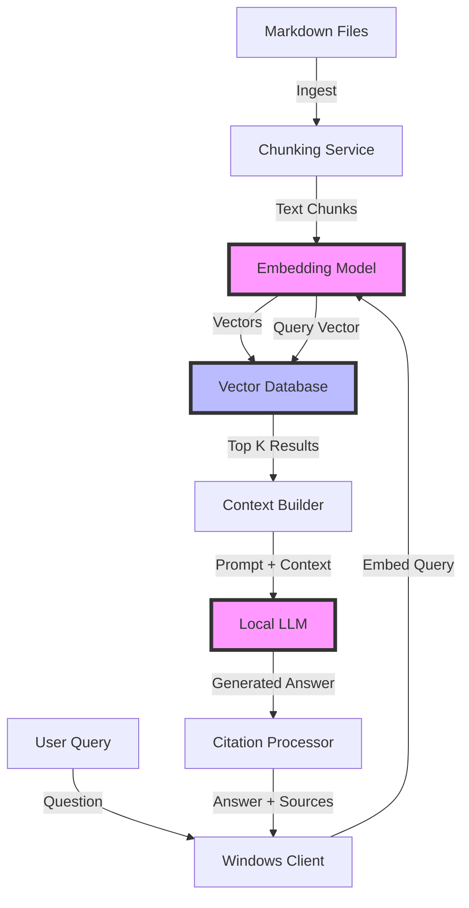

# Building a "Lawyer GPT" for Your Blog - Part 1: Introduction & Architecture

<!--category-- AI, LLM, RAG, C# -->
<datetime class="hidden">2025-11-09T12:00</datetime>

## Introduction

Buckle in because this is going to be a long series! If you've been following along with this blog, you'll know I'm a bit obsessed with finding interesting ways to use LLMs and AI in practical applications. Well, I've got a new project that combines my love of blogging, C#, and AI: building a system that lets you "interrogate" a blog like a lawyer cross-examining a witness.

The goal is simple: I want to be able to ask complex questions about the content across all my blog posts and get coherent, cited answers back. Not just keyword matching (we already have that with Postgres full-text search), but genuine semantic understanding. Questions like "What approaches has this blog covered for handling database migrations?" or "How do the caching strategies differ across the various posts?" - the kind of questions that would require reading through dozens of posts manually.

This series will cover building a complete Retrieval Augmented Generation (RAG) system in C# that runs on Windows, leveraging my NVIDIA A4000 16GB GPU for inference. We'll use the latest approaches and frameworks, and I'll explain each new technology as we encounter it.

[TOC]

## What We're Building

The final system will have several components:

1. **Markdown Ingestion Pipeline** - Processes all the blog posts, chunks them intelligently, and generates embeddings
2. **Vector Database** - Stores embeddings and enables semantic search
3. **Windows Client Application** - A desktop UI for querying the system
4. **LLM Integration** - Local GPU-accelerated inference for answering questions
5. **Citation & Source Tracking** - Ensures answers can be traced back to specific posts

Think of it as building your own domain-specific ChatGPT, but one that's grounded in your actual blog content and can show its working.

## Why "Lawyer GPT"?

Lawyers are notorious for their ability to find contradictions, inconsistencies, and specific details across vast amounts of documentation. That's exactly what we're building here - a system that can:

- Find specific information buried in hundreds of posts
- Compare and contrast approaches across different articles
- Identify patterns and themes
- Provide evidence for its claims (with citations!)

Unlike a general-purpose LLM that might hallucinate or make things up, our system will be grounded in the actual content of the blog.

## Series Overview

Here's what we'll cover over the coming weeks:

### Part 1 (This Post): Introduction & Architecture
We'll establish what we're building and why, plus cover the architectural decisions.

### Part 2: GPU Setup & CUDA in C#
Getting Windows set up for GPU-accelerated AI workloads, installing CUDA, cuDNN, and testing that C# can actually see and use your GPU.

### Part 3: Understanding Embeddings & Vector Databases
Deep dive into what embeddings actually are, how they enable semantic search, and choosing the right vector database (spoiler: we'll probably use Qdrant or pgvector).

### Part 4: Building the Ingestion Pipeline
Processing markdown files, intelligent chunking strategies (you can't just split on paragraphs!), and generating embeddings for all our content.

### Part 5: The Windows Client
Choosing the right framework (WPF, Avalonia, or MAUI?), building the UI, and making it actually pleasant to use.

### Part 6: Local LLM Integration
Running models locally using ONNX Runtime, llama.cpp bindings, or other approaches. Making full use of that A4000!

### Part 7: Retrieval & Answer Generation
Bringing it all together - semantic search, context window management, prompt engineering, and generating coherent answers.

### Part 8: Advanced Features
Citation tracking, confidence scoring, handling multi-hop questions, and making the system actually useful.

## Why RAG?

Before we dive into architecture, let's talk about why RAG (Retrieval Augmented Generation) is the right approach here.

### The Problem with Fine-Tuning

You might think: "Why not just fine-tune an LLM on all the blog posts?" There are several issues with that:

1. **Cost & Complexity** - Fine-tuning is expensive (both in compute and effort)
2. **Staleness** - Every new blog post means retraining
3. **Black Box** - Hard to understand what the model "learned"
4. **Hallucination** - No guarantee the model won't make things up
5. **No Citations** - Can't easily trace answers back to sources

### How RAG Solves This

RAG combines the best of both worlds: the power of LLMs with the precision of search.

The flow is:
1. User asks a question
2. System finds relevant chunks of text from blog posts (using semantic search)
3. System feeds those chunks as context to an LLM
4. LLM generates an answer based on the provided context
5. System returns answer with citations to specific posts

This means:
- ✅ Always up-to-date (just re-index new posts)
- ✅ Grounded in actual content (less hallucination)
- ✅ Traceable (we know which posts contributed to the answer)
- ✅ Efficient (no expensive retraining)
- ✅ Flexible (can swap out LLMs or search strategies easily)

## System Architecture

Let me break down the key components we'll be building:

### 1. Markdown Ingestion Pipeline

This component:
- Reads markdown files from the blog directory
- Extracts metadata (title, categories, date)
- Strips out code blocks (they're not useful for Q&A)
- Intelligently chunks the content
- Tracks source information for citations

**Key Challenge**: Chunking strategy matters enormously. Too small and you lose context. Too large and you waste the LLM's context window. We'll explore semantic chunking approaches.

### 2. Embedding Model

Embeddings are the magic that makes semantic search work. An embedding model takes text and converts it into a high-dimensional vector (array of numbers) that captures semantic meaning.

Similar concepts end up "close" in vector space, even if they use different words.

For example:
- "database migration" and "updating the DB schema" would have similar embeddings
- "cat" and "kitten" would be closer than "cat" and "database"

**Technology Choice**: We'll probably use either:
- `sentence-transformers` models (can run via ONNX Runtime in C#)
- OpenAI's embedding models (via API)
- BGE models (state-of-the-art open source)

### 3. Vector Database

The vector database stores embeddings and enables fast similarity search. When you query with a question, it finds the K most semantically similar chunks.

**Technology Choice**: We'll evaluate:
- **Qdrant** - Modern, written in Rust, excellent C# client, Docker-friendly
- **pgvector** - Extension for PostgreSQL (we're already using Postgres!)
- **Weaviate** - Another solid option with good .NET support
- **Chroma** - Popular in Python land, less so in C#

I'm leaning toward Qdrant for its simplicity and performance, or pgvector to keep everything in Postgres.

### 4. Windows Client

We need a nice UI for asking questions and viewing results. Options:

**WPF (Windows Presentation Foundation)**
- ✅ Mature, stable, lots of resources
- ✅ Native Windows performance
- ❌ Windows-only
- ❌ Looks dated unless you invest in UI libraries

**Avalonia**
- ✅ Cross-platform (XAML-based)
- ✅ Modern, actively developed
- ✅ Similar to WPF
- ❌ Smaller ecosystem

**MAUI (Multi-platform App UI)**
- ✅ Cross-platform
- ✅ Microsoft-backed
- ❌ Still maturing
- ❌ More mobile-focused

Since we're Windows-focused and I want something stable, I'm leaning toward **WPF with ModernWPF UI** or **Avalonia** for that cross-platform potential.

### 5. Local LLM Integration

This is where the A4000 GPU shines. We want to run the LLM locally for:
- Privacy (no data sent to APIs)
- Speed (local inference is fast)
- Cost (no API fees)
- Control (we choose the model)

**Technology Options**:

**ONNX Runtime**
- Convert models to ONNX format
- Excellent GPU acceleration
- C# native support
- Downside: Not all models convert well

**llama.cpp bindings**
- C++ library with C# bindings (LLamaSharp)
- Supports CUDA
- Wide model support (Llama, Mistral, etc.)
- Very active development

**TorchSharp**
- PyTorch bindings for .NET
- Most flexibility
- Steeper learning curve

I'm leaning toward **LLamaSharp** for its maturity and ease of use with popular models.

### 6. Context Window Management

LLMs have limited context windows (e.g., 4K, 8K, 32K tokens). We need to:
- Retrieve the most relevant chunks (top K from vector search)
- Fit them into the context window
- Structure the prompt effectively
- Leave room for the response

This is trickier than it sounds. We'll explore strategies like:
- Dynamic K selection based on chunk sizes
- Re-ranking retrieved chunks by relevance
- Compressing context
- Multi-hop retrieval for complex questions

### 7. Citation & Source Tracking

Every chunk needs metadata:
- Source file/post
- Position in the original document
- Publish date
- Categories

When the LLM generates an answer, we need to attribute which chunks contributed and present those sources to the user.

## What Makes This Different?

There are lots of RAG tutorials out there, but this series will be different:

1. **C# First** - Most RAG examples are in Python. We're going full .NET
2. **Windows & GPU** - Leveraging NVIDIA CUDA on Windows, not Linux/WSL
3. **Production Ready** - Not just proof-of-concept, but actual usable code
4. **Domain-Specific** - Optimized for blog content, not generic Q&A
5. **Deep Explanations** - We'll actually explain the "why" behind decisions

## Technologies We'll Use

Here's the tech stack I'm planning:

### Core Framework
- **.NET 9.0** - Latest and greatest
- **C# 13** - Modern language features

### AI/ML Libraries
- **ONNX Runtime** or **LLamaSharp** - LLM inference
- **Microsoft.ML** - Potentially for some tasks
- **SentenceTransformers via ONNX** - Embeddings

### Vector Database
- **Qdrant** or **pgvector** - To be determined

### UI Framework
- **WPF** with **ModernWPF** or **Avalonia** - Modern desktop UI

### Supporting Tools
- **MarkDig** - Already using this for markdown parsing
- **Docker** - For running Qdrant or other services
- **Entity Framework Core** - If we use pgvector

### GPU Stack
- **CUDA 12.x** - NVIDIA GPU acceleration
- **cuDNN** - Deep learning primitives

## Performance Considerations

With a 16GB A4000, we have some constraints:

- **Model Size** - Can't run massive models like 70B parameter LLMs
- **Batch Processing** - May need to process embeddings in batches
- **Memory Management** - Must be careful with VRAM usage

But we have plenty of power for:
- 7B-13B parameter models (Llama 2, Mistral, etc.)
- Efficient embedding models
- Fast inference (sub-second response times)

## Development Approach

We'll build this incrementally:

1. Start with simplest components (markdown reading, chunking)
2. Add embedding generation (could start with API-based before going local)
3. Get vector search working
4. Build basic UI
5. Integrate LLM
6. Polish and optimize

Each part will be deployable and testable on its own. No big-bang integration nightmares.

## What's Next?

In **Part 2**, we'll get hands-on with the GPU setup:

- Installing CUDA and cuDNN on Windows
- Setting up the development environment
- Writing a simple C# program to verify GPU access
- Running a basic inference test with ONNX Runtime
- Benchmarking our A4000 to understand what we can do

This might seem basic, but getting the GPU stack right is crucial. I've wasted hours debugging issues that came down to version mismatches or missing DLLs.

## Why This Matters

Beyond just being a cool project, this approach has real applications:

- **Documentation Search** - For large codebases or wikis
- **Legal Discovery** - Actually finding contradictions like a real lawyer
- **Research Assistance** - Analyzing papers or notes
- **Customer Support** - Grounding chatbot responses in actual documentation
- **Personal Knowledge Management** - Your own "second brain"

The principles we'll cover apply to any domain where you have lots of text and need to find and synthesize information.

## Conclusion

We're embarking on a journey to build a production-quality RAG system in C# that can actually interrogate blog content like a lawyer. We'll leverage modern GPU hardware, the latest .NET features, and battle-tested AI/ML approaches.

This isn't a toy project - we're building something that could genuinely be useful for anyone with a large corpus of text they need to make searchable and queryable in a semantic way.

In the next part, we'll get our hands dirty with CUDA, GPUs, and making sure our development environment is ready for the challenges ahead.

Stay tuned, and get ready to learn about embeddings, vector databases, chunking strategies, prompt engineering, and all the other delightful complexities of modern AI systems!

## Resources

If you want to get a head start, here are some resources I'll be referencing throughout this series:

- [ONNX Runtime Documentation](https://onnxruntime.ai/)
- [LLamaSharp GitHub](https://github.com/SciSharp/LLamaSharp)
- [Qdrant Documentation](https://qdrant.tech/documentation/)
- [Sentence Transformers](https://www.sbert.net/)
- [Understanding RAG Systems](https://www.anthropic.com/index/retrieval-augmented-generation)

See you in Part 2!
