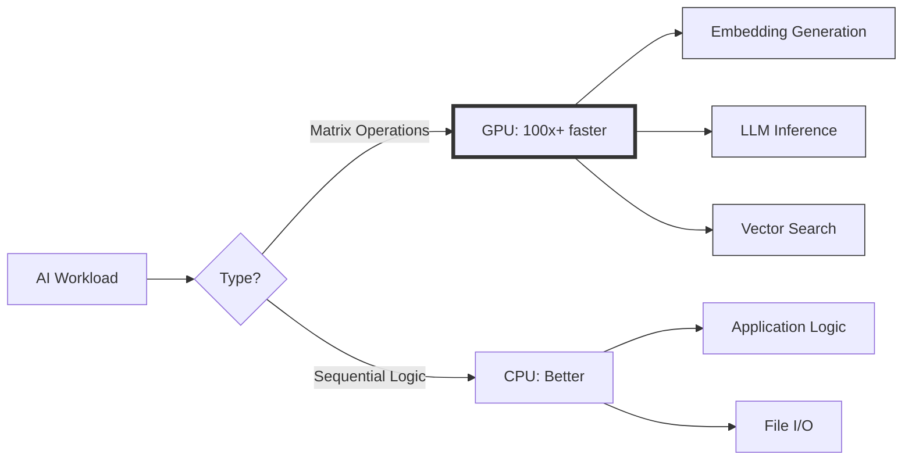
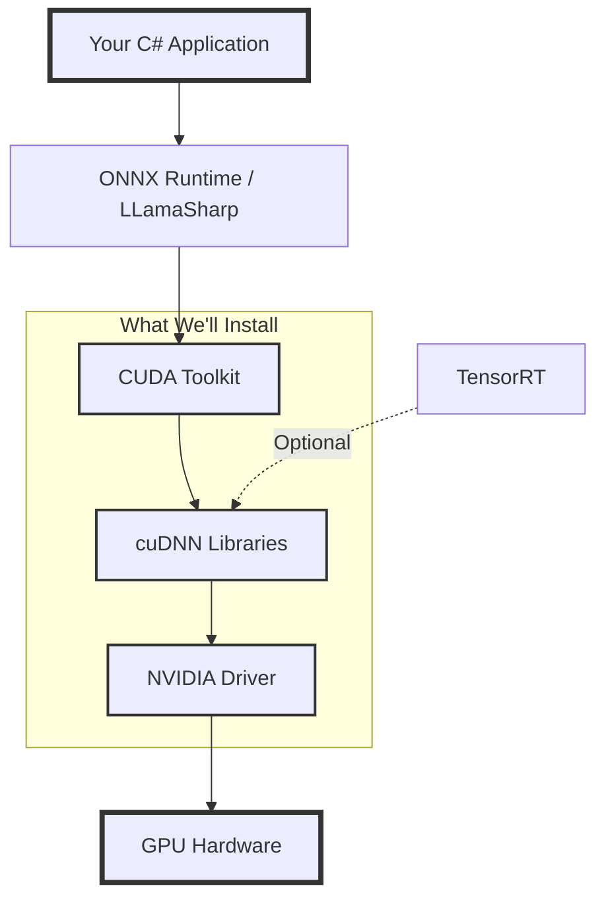
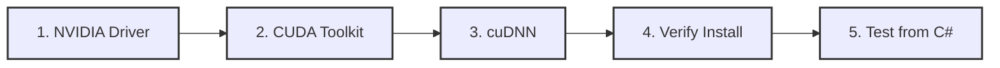
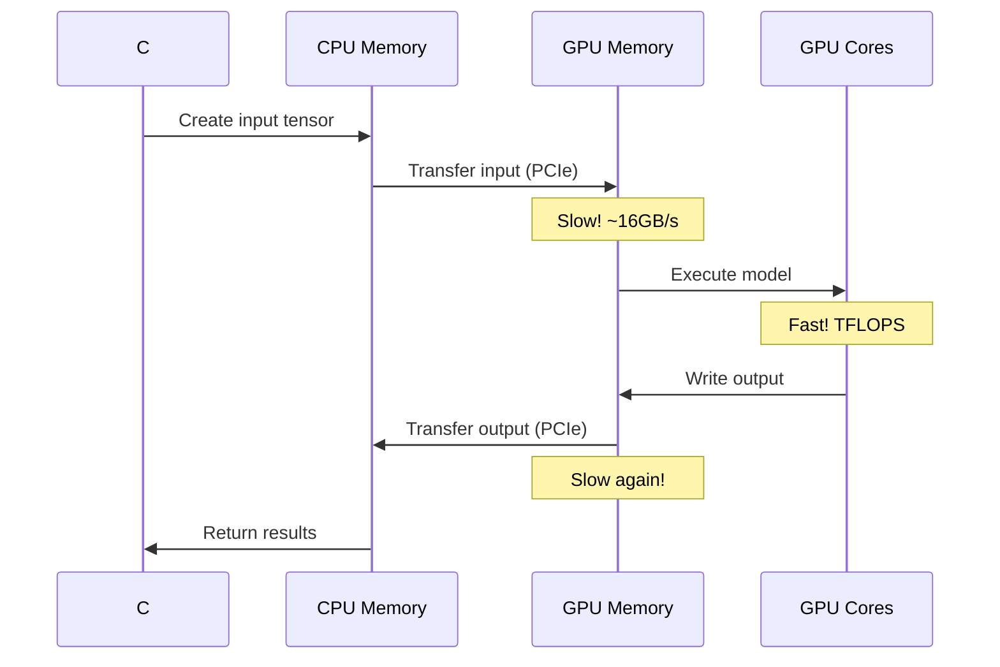
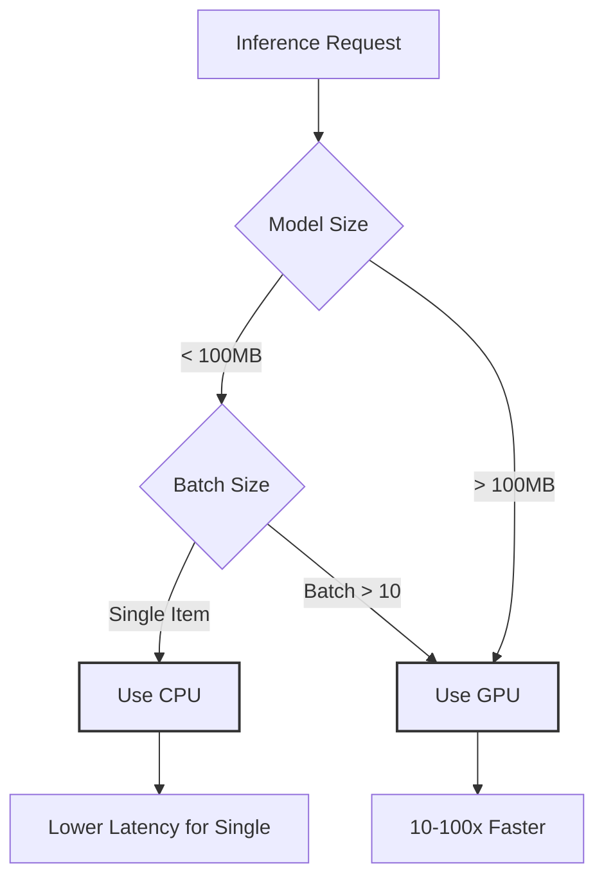

# Building a "Lawyer GPT" for Your Blog - Part 2: GPU Setup & CUDA in C#

<!--category-- AI, LLM, CUDA, C#, GPU, AI-Article, mostlylucid.blogllm -->
<datetime class="hidden">2025-11-12T22:45</datetime>


## Introduction

Welcome to Part 2! In [Part 1](/blog/building-a-lawyer-gpt-for-your-blog-part1), we laid out the vision for building a writing assistant that uses your blog as a knowledge base - like how lawyers use LLMs trained on case law to draft documents. Now it's time to get our hands dirty with the foundation: making sure your GPU is ready for AI workloads.

> NOTE: This is part of my experiments with AI (assisted drafting) + my own editing. Same voice, same pragmatism; just faster fingers.

**About my hardware**: I'm using an NVIDIA RTX A4000 (16GB VRAM), AMD Ryzen 9 9950X, and 96GB DDR5 RAM. But you don't need this! As covered in Part 1, you can use any NVIDIA GPU with 8GB+ VRAM, or even run CPU-only (slower but functional). This part focuses on GPU setup, but I'll note CPU-only alternatives where relevant.

This part might seem basic if you're already familiar with [CUDA](https://developer.nvidia.com/cuda-toolkit), but trust me - I've wasted countless hours debugging mysterious errors that traced back to version mismatches, missing environment variables, or incorrect [cuDNN](https://developer.nvidia.com/cudnn) installations. We'll do this right from the start.

[TOC]

## Why GPU Acceleration Matters

Before we dive into installation, let's understand why we need GPU acceleration at all.

### CPU vs GPU for AI Workloads



**Why GPUs dominate for AI**:

1. **Parallelism** - GPUs have thousands of cores vs CPUs' dozens
2. **Matrix Operations** - AI is mostly matrix math, which GPUs excel at
3. **Memory Bandwidth** - GPUs move data much faster
4. **Specialized Hardware** - Tensor cores accelerate AI-specific operations

**Real-world example** (on my hardware): Generating embeddings for a blog post:
- **CPU (Ryzen 9 9950X)**: ~5 seconds per post
- **GPU (A4000 16GB)**: ~0.3 seconds per post

That's 16x faster, and it compounds when processing hundreds of posts!

**Performance on other GPUs** (approximate):
- **RTX 4090** (24GB): Fastest, ~0.2s per post
- **RTX 3060** (12GB): ~0.5s per post
- **GTX 1070 Ti** (8GB): ~0.8s per post
- Still much faster than CPU!

## Understanding Your Hardware

Before installing anything, let's understand what we're working with.

### My GPU: NVIDIA RTX A4000

This is my specific GPU - a professional workstation card with:
- **16GB GDDR6 VRAM** - Enough for 7B-13B parameter models
- **6144 CUDA cores** - Parallel processing power
- **256 Tensor cores** - Accelerated AI operations
- **CUDA Compute Capability 8.6** - Important for compatibility

### Common GPU Options

Here's what various GPUs can handle:

| GPU | VRAM | Max Model Size | Good For |
|-----|------|----------------|----------|
| RTX 4090 | 24GB | 13B-30B | Overkill for this project |
| RTX 4070 Ti | 12GB | 7B-13B | Excellent choice |
| RTX 3060 | 12GB | 7B | Budget-friendly |
| RTX 4060 Ti | 16GB | 7B-13B | Great value |
| A4000 (mine) | 16GB | 7B-13B | Workstation GPU |
| GTX 1070 Ti | 8GB | 7B (tight) | Minimum viable |

### What About Intel/AMD NPUs?

You might have heard about Intel Core Ultra or AMD Ryzen AI chips with built-in NPUs (Neural Processing Units). **Can you use those instead of NVIDIA?**

**Short answer**: Still not recommended for this use case (as of late 2025), but getting closer!

**Current state (late 2025)**:
- **DirectML has matured**: [ONNX Runtime DirectML](https://onnxruntime.ai/docs/execution-providers/DirectML-ExecutionProvider.html) execution provider is now production-ready
- **NPU support improving**: Intel's Core Ultra (Meteor Lake/Lunar Lake) and AMD's Ryzen AI can run inference via DirectML
- **Model format limitations**: NPUs work best with ONNX models; GGUF models (used for LLMs) still target CUDA/CPU primarily
- **LLM performance**: For large language models, NPUs are currently slower than discrete GPUs and often slower than modern CPUs
- **Best for**: Small models, on-device inference, battery-powered scenarios

**Why we still use NVIDIA CUDA**:
1. **Ecosystem maturity**: CUDA has 15+ years of optimization for LLMs
2. **LLamaSharp**: Uses llama.cpp which targets CUDA/CPU, not DirectML/NPU
3. **Performance**: A mid-range NVIDIA GPU still outperforms NPUs significantly for our workload
4. **Community support**: Vastly more resources and troubleshooting available

**If you have an NPU-equipped CPU**:
- For embedding generation (Part 3), you can use DirectML with ONNX Runtime - might work reasonably well
- For LLM inference (Part 6), stick with CPU mode or get a discrete GPU
- Watch for llama.cpp DirectML backend (experimental as of Nov 2025)

**Future outlook**: NPUs are improving rapidly. By early  2026, they may become viable for LLM inference, especially for smaller models (1B-3B parameters). Intel's upcoming Arrow Lake and AMD's next-gen XDNA 2 promise significant AI performance improvements.

This series focuses on **NVIDIA CUDA** because it delivers the best performance today, but the architecture concepts will translate to NPUs as the ecosystem matures!

### Check Your GPU

First, verify Windows sees your GPU:

```bash
# PowerShell
wmic path win32_VideoController get name
```

You should see something like:
```
Name
NVIDIA RTX A4000
```

Or use NVIDIA Control Panel → System Information → Display tab.

### Architecture Overview

Here's how the software stack works:



**Layer breakdown**:
- **NVIDIA Driver** - Low-level GPU communication
- **CUDA Toolkit** - APIs for GPU programming
- **cuDNN** - Deep Neural Network library (optimized kernels)
- **ONNX Runtime / LLamaSharp** - High-level ML frameworks
- **Your Application** - Our C# code

## Installation Roadmap

Here's the order we'll install things (order matters!):



## Step 1: NVIDIA Driver

### Check Current Driver

Open PowerShell:

```bash
nvidia-smi
```

You should see output like:

```
+-----------------------------------------------------------------------------+
| NVIDIA-SMI 546.33       Driver Version: 546.33       CUDA Version: 12.3    |
|-------------------------------+----------------------+----------------------+
| GPU  Name            TCC/WDDM | Bus-Id        Disp.A | Volatile Uncorr. ECC |
| Fan  Temp  Perf  Pwr:Usage/Cap|         Memory-Usage | GPU-Util  Compute M. |
|===============================+======================+======================|
|   0  NVIDIA RTX A4000   WDDM  | 00000000:01:00.0 Off |                  Off |
| 41%   32C    P8    10W / 140W |    345MiB / 16376MiB |      0%      Default |
+-------------------------------+----------------------+----------------------+
```

**Key info**:
- `Driver Version`: Should be 545.xx or newer
- `CUDA Version`: This is the MAX CUDA version supported, not what's installed
- `Memory-Usage`: Currently used / total VRAM

### Update Driver if Needed

If `nvidia-smi` doesn't work or your driver is old:

1. Go to [NVIDIA Driver Downloads](https://www.nvidia.com/Download/index.aspx)
2. Select:
   - Product Type: **RTX/Quadro**
   - Product Series: **RTX Axxxx Series**
   - Product: **RTX A4000**
   - Operating System: **Windows 11** (or your version)
   - Download Type: **Studio Driver** (more stable than Game Ready)

3. Install and reboot

4. Verify again with `nvidia-smi`

## Step 2: CUDA Toolkit

CUDA provides the programming interface for GPU acceleration.

### Version Selection

**Critical**: We need [CUDA](https://developer.nvidia.com/cuda-toolkit) 12.x for modern models. Specifically:
- **CUDA 12.1+** - Good balance of compatibility and features (at the time of writing)
- **Latest 12.x** - Check compatibility with your libraries
- **NOT CUDA 11.x** - Missing features newer models need

### Download & Install

1. Go to [CUDA Toolkit Archive](https://developer.nvidia.com/cuda-toolkit-archive)
2. Select **CUDA Toolkit 12.1** (or 12.3 if you're adventurous)
3. Choose: **Windows → x86_64 → 11 → exe (local)**
4. Download (~3GB)

### Installation Options

Run the installer. When prompted:

```
Installation Type: Custom (Advanced)

Select Components:
✅ CUDA Toolkit
✅ CUDA Documentation
✅ CUDA Samples
✅ CUDA Visual Studio Integration
❌ GeForce Experience (not needed)
❌ NVIDIA Driver (already installed)
```

**Why Custom?**: We don't want to downgrade our driver or install gaming software.

### Installation Path

Default path is fine:
```
C:\Program Files\NVIDIA GPU Computing Toolkit\CUDA\v12.1
```

But note this - we'll need it for environment variables!

### Set Environment Variables

The installer usually sets these, but verify:

**Check in PowerShell**:
```powershell
$env:CUDA_PATH
# Should show: C:\Program Files\NVIDIA GPU Computing Toolkit\CUDA\v12.1

$env:PATH -split ';' | Select-String CUDA
# Should show CUDA bin and libnvvp paths
```

**If missing, add manually**:

1. Open **Environment Variables**:
   - Right-click `This PC` → Properties → Advanced System Settings → Environment Variables

2. Under **System Variables**, verify/add:
   - `CUDA_PATH` = `C:\Program Files\NVIDIA GPU Computing Toolkit\CUDA\v12.1`
   - `CUDA_PATH_V12_1` = `C:\Program Files\NVIDIA GPU Computing Toolkit\CUDA\v12.1`

3. In `Path` variable, ensure these exist:
   ```
   C:\Program Files\NVIDIA GPU Computing Toolkit\CUDA\v12.1\bin
   C:\Program Files\NVIDIA GPU Computing Toolkit\CUDA\v12.1\libnvvp
   ```

4. **Restart your terminal** for changes to take effect

### Verify CUDA Installation

```powershell
# Check CUDA compiler
nvcc --version

# Should output:
# nvcc: NVIDIA (R) Cuda compiler driver
# Copyright (c) 2005-2023 NVIDIA Corporation
# Built on Tue_Feb__7_19:32:13_Pacific_Standard_Time_2023
# Cuda compilation tools, release 12.1, V12.1.66
```

```powershell
# Check path resolves
where.exe nvcc
# Should show: C:\Program Files\NVIDIA GPU Computing Toolkit\CUDA\v12.1\bin\nvcc.exe
```

## Step 3: cuDNN (CUDA Deep Neural Network library)

cuDNN provides optimized implementations of deep learning operations.

### Version Compatibility

**Critical**: [cuDNN](https://developer.nvidia.com/cudnn) version must match CUDA version!

For **CUDA 12.x**, we need **cuDNN 8.9+** for CUDA 12.x (at the time of writing, 8.9.7 or later)

### Download cuDNN

1. Go to [cuDNN Archive](https://developer.nvidia.com/rdp/cudnn-archive)
2. You'll need an NVIDIA Developer account (free)
3. Find: **Download cuDNN v8.9.7 (December 5th, 2023), for CUDA 12.x**
4. Select: **Local Installer for Windows (Zip)**
5. Download (~800MB)

### Extract and Install cuDNN

cuDNN is just a set of files you copy into your CUDA installation.

**Extract the ZIP**, you'll see:
```
cudnn-windows-x86_64-8.9.7.29_cuda12-archive\
    bin\
        cudnn64_8.dll
        cudnn_adv_infer64_8.dll
        cudnn_adv_train64_8.dll
        ... (more DLLs)
    include\
        cudnn.h
        ... (header files)
    lib\
        x64\
            cudnn.lib
            ... (lib files)
```

**Copy files to CUDA installation**:

```powershell
# Assuming you extracted to Downloads and CUDA is in default location
# Run PowerShell as Administrator

$cudnnPath = "$env:USERPROFILE\Downloads\cudnn-windows-x86_64-8.9.7.29_cuda12-archive"
$cudaPath = "C:\Program Files\NVIDIA GPU Computing Toolkit\CUDA\v12.1"

# Copy DLLs
Copy-Item "$cudnnPath\bin\*.dll" -Destination "$cudaPath\bin\"

# Copy headers
Copy-Item "$cudnnPath\include\*.h" -Destination "$cudaPath\include\"

# Copy libs
Copy-Item "$cudnnPath\lib\x64\*.lib" -Destination "$cudaPath\lib\x64\"
```

**Or do it manually**:
1. Copy all files from `bin\` to `C:\Program Files\NVIDIA GPU Computing Toolkit\CUDA\v12.1\bin\`
2. Copy all files from `include\` to `C:\Program Files\NVIDIA GPU Computing Toolkit\CUDA\v12.1\include\`
3. Copy all files from `lib\x64\` to `C:\Program Files\NVIDIA GPU Computing Toolkit\CUDA\v12.1\lib\x64\`

### Verify cuDNN Installation

```powershell
# Check DLLs exist
Test-Path "C:\Program Files\NVIDIA GPU Computing Toolkit\CUDA\v12.1\bin\cudnn64_8.dll"
# Should return: True

# List all cuDNN DLLs
Get-ChildItem "C:\Program Files\NVIDIA GPU Computing Toolkit\CUDA\v12.1\bin\cudnn*.dll"
```

## Step 4: Complete Verification

Let's make sure everything works together.

### Hardware Check

```powershell
nvidia-smi
```

Should show your GPU with no errors.

### CUDA Check

```powershell
nvcc --version
```

Should show CUDA 12.1 (or whatever version you installed).

### System Variables Check

```powershell
# All these should return paths
$env:CUDA_PATH
$env:CUDA_PATH_V12_1

# Check PATH includes CUDA bin
$env:PATH -split ';' | Select-String CUDA
```

### CUDA Samples Test (Optional but Recommended)

The CUDA Toolkit includes sample programs. Let's compile and run one.

**Navigate to samples**:
```powershell
cd "C:\ProgramData\NVIDIA Corporation\CUDA Samples\v12.1"
```

**Find deviceQuery**:
```powershell
cd "1_Utilities\deviceQuery"
```

**Compile it** (requires Visual Studio):
```powershell
# If you have VS 2022
"C:\Program Files\Microsoft Visual Studio\2022\Community\MSBuild\Current\Bin\MSBuild.exe" deviceQuery_vs2022.vcxproj /p:Configuration=Release /p:Platform=x64
```

**Run it**:
```powershell
.\x64\Release\deviceQuery.exe
```

You should see output like:
```
CUDA Device Query (Runtime API) version (CUDART static linking)

Detected 1 CUDA Capable device(s)

Device 0: "NVIDIA RTX A4000"
  CUDA Driver Version / Runtime Version          12.3 / 12.1
  CUDA Capability Major/Minor version number:    8.6
  Total amount of global memory:                 16376 MBytes (17174683648 bytes)
  (048) Multiprocessors, (128) CUDA Cores/MP:    6144 CUDA Cores
  GPU Max Clock rate:                            1560 MHz (1.56 GHz)
  Memory Clock rate:                             7001 Mhz
  Memory Bus Width:                              256-bit
  L2 Cache Size:                                 4194304 bytes
  ...
  Result = PASS
```

**The key line**: `Result = PASS`

If you see this, your GPU + CUDA + cuDNN stack is working!

## Step 5: Testing from C#

Now the fun part - let's actually use CUDA from C#!

### Create Test Project

```bash
mkdir CudaTest
cd CudaTest
dotnet new console -n CudaTest
cd CudaTest
```

### Add ONNX Runtime with CUDA

[ONNX Runtime](https://onnxruntime.ai/) is the easiest way to use CUDA from C#.

```bash
dotnet add package Microsoft.ML.OnnxRuntime.Gpu  # Latest version
```

**Why this package?**
- `Microsoft.ML.OnnxRuntime` - CPU only
- `Microsoft.ML.OnnxRuntime.Gpu` - Includes CUDA support

### Test Code: GPU Detection

Create `Program.cs`:

```csharp
using Microsoft.ML.OnnxRuntime;
using System;
using System.Linq;

namespace CudaTest
{
    class Program
    {
        static void Main(string[] args)
        {
            Console.WriteLine("=== CUDA Test from C# ===\n");

            // Test 1: Can we create a CUDA execution provider?
            Console.WriteLine("Test 1: CUDA Execution Provider");
            try
            {
                var cudaProviderOptions = new OrtCUDAProviderOptions();
                var sessionOptions = new SessionOptions();
                sessionOptions.AppendExecutionProvider_CUDA(cudaProviderOptions);

                Console.WriteLine("✅ CUDA execution provider created successfully");
                Console.WriteLine($"   Device ID: {cudaProviderOptions.DeviceId}");
            }
            catch (Exception ex)
            {
                Console.WriteLine($"❌ Failed to create CUDA provider: {ex.Message}");
                return;
            }

            // Test 2: Check available providers
            Console.WriteLine("\nTest 2: Available Execution Providers");
            var providers = OrtEnv.Instance().GetAvailableProviders();
            foreach (var provider in providers)
            {
                Console.WriteLine($"   - {provider}");
            }

            if (providers.Contains("CUDAExecutionProvider"))
            {
                Console.WriteLine("✅ CUDA provider is available");
            }
            else
            {
                Console.WriteLine("❌ CUDA provider NOT available");
            }

            // Test 3: Get CUDA device count and info
            Console.WriteLine("\nTest 3: CUDA Device Information");
            try
            {
                // ONNX Runtime doesn't expose deviceQuery directly,
                // but we can test by trying to create a session
                var opts = new SessionOptions();
                opts.AppendExecutionProvider_CUDA(0); // Device 0

                Console.WriteLine("✅ Successfully configured for CUDA device 0");
                Console.WriteLine("   (Full device info requires native CUDA calls)");
            }
            catch (Exception ex)
            {
                Console.WriteLine($"❌ CUDA device configuration failed: {ex.Message}");
            }

            Console.WriteLine("\n=== Test Complete ===");
        }
    }
}
```

**Code breakdown**:

1. **OrtCUDAProviderOptions** - Configures CUDA execution
   - `DeviceId` - Which GPU to use (0 for first GPU)
   - Can set memory limits, optimization level, etc.

2. **SessionOptions.AppendExecutionProvider_CUDA()** - Tells ONNX Runtime to use GPU
   - If this succeeds, CUDA is working
   - If it fails, something in the stack is broken

3. **OrtEnv.Instance().GetAvailableProviders()** - Lists all available execution providers
   - Should include "CUDAExecutionProvider" if everything is installed correctly
   - Also shows "CPUExecutionProvider" as fallback

### Run the Test

```bash
dotnet run
```

**Expected output**:
```
=== CUDA Test from C# ===

Test 1: CUDA Execution Provider
✅ CUDA execution provider created successfully
   Device ID: 0

Test 2: Available Execution Providers
   - CUDAExecutionProvider
   - CPUExecutionProvider
✅ CUDA provider is available

Test 3: CUDA Device Information
✅ Successfully configured for CUDA device 0
   (Full device info requires native CUDA calls)

=== Test Complete ===
```

### Troubleshooting Common Errors

#### Error: "DllNotFoundException: Unable to load DLL 'onnxruntime'"

**Cause**: ONNX Runtime can't find CUDA DLLs.

**Fix**:
```powershell
# Make sure CUDA bin is in PATH
$env:PATH += ";C:\Program Files\NVIDIA GPU Computing Toolkit\CUDA\v12.1\bin"

# Verify cudnn DLL exists
Test-Path "C:\Program Files\NVIDIA GPU Computing Toolkit\CUDA\v12.1\bin\cudnn64_8.dll"

# Try running again
dotnet run
```

#### Error: "CUDAExecutionProvider not found"

**Cause**: Using wrong ONNX Runtime package (CPU-only).

**Fix**:
```bash
dotnet remove package Microsoft.ML.OnnxRuntime
dotnet add package Microsoft.ML.OnnxRuntime.Gpu --version 1.16.3
```

#### Error: "CUDA error code: 35 (CUDA driver version is insufficient)"

**Cause**: Driver is too old for CUDA 12.x.

**Fix**: Update NVIDIA driver to 545.xx or newer.

## Advanced Test: Actual Inference

Let's do something real - run a tiny neural network on GPU vs CPU and compare speeds.

### Download a Test Model

We'll use a simple MNIST digit recognition model (ONNX format).

```powershell
# Download sample model
Invoke-WebRequest -Uri "https://github.com/onnx/models/raw/main/vision/classification/mnist/model/mnist-8.onnx" -OutFile "mnist.onnx"
```

### Inference Test Code

Update `Program.cs`:

```csharp
using Microsoft.ML.OnnxRuntime;
using Microsoft.ML.OnnxRuntime.Tensors;
using System;
using System.Diagnostics;
using System.Linq;

namespace CudaTest
{
    class Program
    {
        static void Main(string[] args)
        {
            Console.WriteLine("=== GPU vs CPU Inference Test ===\n");

            // Create dummy input (28x28 image flattened to 784 floats)
            var inputData = Enumerable.Range(0, 784).Select(i => (float)i / 784).ToArray();
            var tensor = new DenseTensor<float>(inputData, new[] { 1, 1, 28, 28 });
            var inputs = new List<NamedOnnxValue>
            {
                NamedOnnxValue.CreateFromTensor("Input3", tensor)
            };

            // Test 1: CPU Inference
            Console.WriteLine("Test 1: CPU Inference");
            var cpuTime = TestInference(inputs, useCuda: false, iterations: 100);
            Console.WriteLine($"   Average time: {cpuTime:F2}ms\n");

            // Test 2: GPU Inference
            Console.WriteLine("Test 2: GPU Inference");
            var gpuTime = TestInference(inputs, useCuda: true, iterations: 100);
            Console.WriteLine($"   Average time: {gpuTime:F2}ms\n");

            // Compare
            Console.WriteLine("Comparison:");
            Console.WriteLine($"   CPU: {cpuTime:F2}ms");
            Console.WriteLine($"   GPU: {gpuTime:F2}ms");
            Console.WriteLine($"   Speedup: {cpuTime / gpuTime:F2}x faster on GPU");
        }

        static double TestInference(List<NamedOnnxValue> inputs, bool useCuda, int iterations)
        {
            var options = new SessionOptions();

            if (useCuda)
            {
                options.AppendExecutionProvider_CUDA(0);
            }

            using var session = new InferenceSession("mnist.onnx", options);

            // Warmup run (first run is always slower)
            session.Run(inputs);

            // Timed runs
            var sw = Stopwatch.StartNew();

            for (int i = 0; i < iterations; i++)
            {
                using var results = session.Run(inputs);
                // Force evaluation
                var output = results.First().AsEnumerable<float>().ToArray();
            }

            sw.Stop();

            return sw.Elapsed.TotalMilliseconds / iterations;
        }
    }
}
```

**Code explanation**:

1. **DenseTensor** - ONNX Runtime's way of representing multi-dimensional arrays
   - Shape `[1, 1, 28, 28]` = batch_size=1, channels=1, height=28, width=28

2. **NamedOnnxValue** - Binds a tensor to an input name
   - "Input3" is the input name in the MNIST model

3. **Warmup run** - First inference is always slower (model loading, optimization)
   - We run once before timing to get accurate measurements

4. **Timing methodology** - Average over 100 iterations for stable results

### Run Performance Test

```bash
dotnet run
```

**Expected output** (your numbers will vary):
```
=== GPU vs CPU Inference Test ===

Test 1: CPU Inference
   Average time: 0.42ms

Test 2: GPU Inference
   Average time: 0.15ms

Comparison:
   CPU: 0.42ms
   GPU: 0.15ms
   Speedup: 2.80x faster on GPU
```

**Why such a small speedup?**
- MNIST is tiny (only 100KB model)
- Overhead of GPU data transfer dominates
- For larger models (1GB+), you'll see 10-100x speedups

### Key Takeaway

We've proven the entire stack works:
✅ Driver installed correctly
✅ CUDA Toolkit accessible
✅ cuDNN integrated
✅ ONNX Runtime finds CUDA
✅ C# can run GPU-accelerated inference

## Understanding Performance

### Memory Transfer Bottleneck

Here's what happens during inference:



**Performance lessons**:
1. **Batch processing** - Transfer many inputs at once to amortize overhead
2. **Keep data on GPU** - Chain operations to avoid transfers
3. **Larger models benefit more** - Fixed transfer cost, scaling compute

### When to Use GPU vs CPU



**Rule of thumb**:
- **GPU** - Large models, batch processing, embedding generation
- **CPU** - Small models, single requests, latency-critical

For our blog writing assistant:
- **Embeddings** - Batch process 100+ chunks → GPU
- **LLM inference** - Large model (7B params) → GPU
- **Vector search** - Depends on DB choice, often CPU-bound

## Summary

We've successfully:

1. ✅ Installed NVIDIA driver (545.xx+)
2. ✅ Installed CUDA Toolkit 12.1
3. ✅ Integrated cuDNN 8.9.7
4. ✅ Verified with `nvidia-smi` and `nvcc`
5. ✅ Tested GPU access from C# with ONNX Runtime
6. ✅ Ran performance comparison (GPU vs CPU)

Our development environment is now ready for AI workloads!

## What's Next?

In **Part 3**, we'll dive deep into embeddings and vector databases:

- What are embeddings and how do they enable semantic search?
- Choosing between Qdrant, pgvector, and other options
- Generating embeddings locally with ONNX Runtime
- Storing and querying millions of vectors efficiently
- Building our first semantic search prototype

We'll finally start working with actual blog content and seeing RAG in action!

## Troubleshooting Reference

### Quick Diagnostic Commands

```powershell
# Check GPU
nvidia-smi

# Check CUDA
nvcc --version
where.exe nvcc

# Check cuDNN
Test-Path "C:\Program Files\NVIDIA GPU Computing Toolkit\CUDA\v12.1\bin\cudnn64_8.dll"

# Check environment
$env:CUDA_PATH
$env:PATH -split ';' | Select-String CUDA

# Test from C#
dotnet run
```

### Common Issues

| Error | Cause | Fix |
|-------|-------|-----|
| `nvidia-smi` not found | Driver not installed | Install NVIDIA driver |
| `nvcc` not found | CUDA not in PATH | Add CUDA bin to PATH |
| DLL load failed | cuDNN missing | Copy cuDNN files to CUDA dir |
| CUDA provider not found | Wrong NuGet package | Use `Microsoft.ML.OnnxRuntime.Gpu` |
| Driver version insufficient | Old driver | Update to 545.xx+ |

### Version Compatibility Matrix

| CUDA Version | cuDNN Version | ONNX Runtime | Driver Required |
|--------------|---------------|--------------|-----------------|
| 12.1 | 8.9.7 | 1.16.x | 545.xx+ |
| 12.3 | 9.0.0 | 1.17.x | 546.xx+ |
| 11.8 | 8.9.2 | 1.15.x | 520.xx+ |

## Series Navigation

- [Part 1: Introduction & Architecture](/blog/building-a-lawyer-gpt-for-your-blog-part1)
- **Part 2: GPU Setup & CUDA in C#** (this post)
- [Part 3: Understanding Embeddings & Vector Databases](/blog/building-a-lawyer-gpt-for-your-blog-part3)
- [Part 4: Building the Ingestion Pipeline](/blog/building-a-lawyer-gpt-for-your-blog-part4)
- [Part 5: The Windows Client](/blog/building-a-lawyer-gpt-for-your-blog-part5)
- [Part 6: Local LLM Integration](/blog/building-a-lawyer-gpt-for-your-blog-part6)
- [Part 7: Content Generation & Prompt Engineering](/blog/building-a-lawyer-gpt-for-your-blog-part7)
- [Part 8: Advanced Features & Production Deployment](/blog/building-a-lawyer-gpt-for-your-blog-part8)

## Resources

- [CUDA Toolkit Documentation](https://docs.nvidia.com/cuda/)
- [cuDNN Documentation](https://docs.nvidia.com/deeplearning/cudnn/api/index.html)
- [ONNX Runtime GPU Execution Provider](https://onnxruntime.ai/docs/execution-providers/CUDA-ExecutionProvider.html)
- [NVIDIA Developer Zone](https://developer.nvidia.com/)

See you in [Part 3](/blog/building-a-lawyer-gpt-for-your-blog-part3), where we finally start building the semantic search engine!
