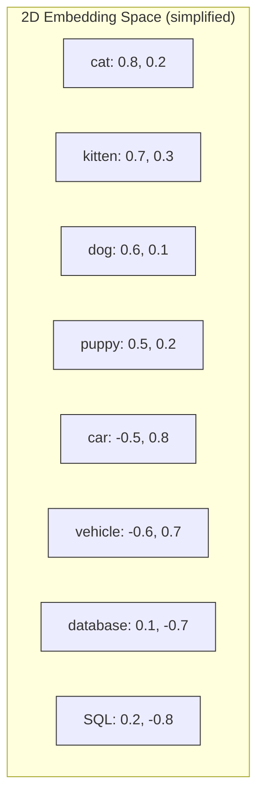
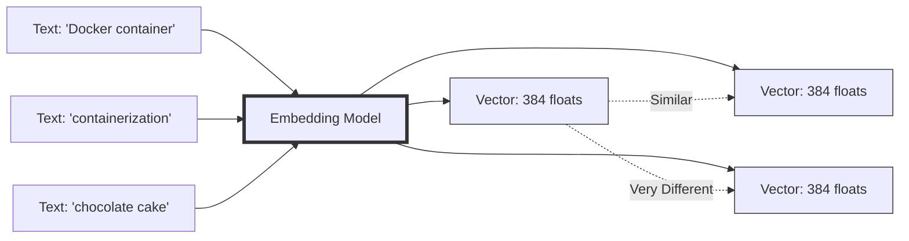
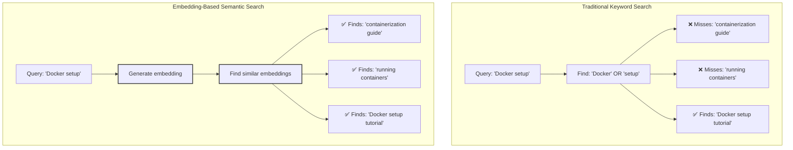
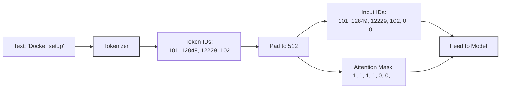
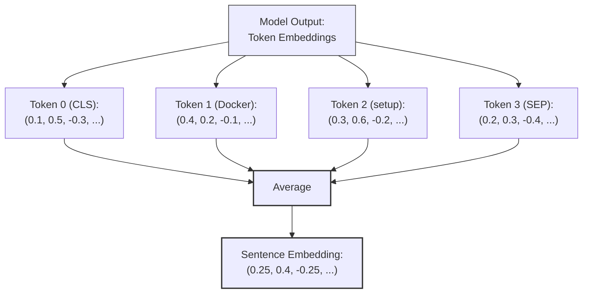
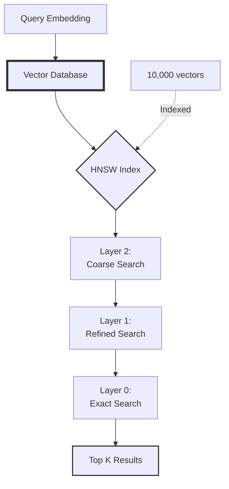

# Building a "Lawyer GPT" for Your Blog - Part 3: Understanding Embeddings & Vector Databases

<!--category-- AI, LLM, Embeddings, Vector Database, C#, AI-Article, mostlylucid.blogllm -->
<datetime class="hidden">1973-02-08T16:00</datetime>


> WARNING: THESE ARE DRAFT POSTS WHICH 'ESCAPED'.

It's likely much of what's below won't work; I generate these as how-to for ME and then do all the steps and get the sample app working...You've been sneaky and seen them!  they'll likely be ready mid-December.


## Introduction

Welcome to Part 3! We've got our GPU stack working ([Part 2](/blog/building-a-lawyer-gpt-for-your-blog-part2)), and we understand the architecture ([Part 1](/blog/building-a-lawyer-gpt-for-your-blog-part1)). Now it's time to dive into the magic that makes semantic search possible: **[embeddings](https://www.sbert.net/)** and **vector databases**.

> NOTE: This is part of my experiments with AI (assisted drafting) + my own editing. Same voice, same pragmatism; just faster fingers.

This is where things get interesting. We're going to understand how to represent text as numbers in a way that captures meaning, not just keywords. It's the difference between finding posts that contain the word "docker" vs finding posts that are semantically about containerization concepts.

[TOC]

## What Are Embeddings?

An embedding is a numerical representation of text (or images, audio, etc.) as a vector - essentially a list of numbers.

### The Intuition

Imagine plotting words in a 2D space based on their meaning:



Similar concepts cluster together:
- Pets (red/green) are near each other
- Vehicles (blue) are grouped
- Tech terms (yellow) cluster
- Unrelated concepts are far apart

**Real embeddings** use 384 to 1536 dimensions (not just 2!), capturing much more nuance.

### How It Works

An embedding model is a neural network trained to map text to vectors such that:
- Similar meanings → close vectors
- Different meanings → distant vectors



### Measuring Similarity

We use **cosine similarity** to measure how close two vectors are:

```csharp
public static float CosineSimilarity(float[] vectorA, float[] vectorB)
{
    if (vectorA.Length != vectorB.Length)
        throw new ArgumentException("Vectors must have same length");

    // Dot product: sum of element-wise multiplication
    float dotProduct = 0;
    for (int i = 0; i < vectorA.Length; i++)
    {
        dotProduct += vectorA[i] * vectorB[i];
    }

    // Magnitude of each vector: sqrt(sum of squares)
    float magnitudeA = 0;
    float magnitudeB = 0;
    for (int i = 0; i < vectorA.Length; i++)
    {
        magnitudeA += vectorA[i] * vectorA[i];
        magnitudeB += vectorB[i] * vectorB[i];
    }
    magnitudeA = MathF.Sqrt(magnitudeA);
    magnitudeB = MathF.Sqrt(magnitudeB);

    // Cosine similarity: dot product / (magnitude_a * magnitude_b)
    return dotProduct / (magnitudeA * magnitudeB);
}
```

**Cosine similarity ranges from -1 to 1**:
- `1.0` = identical meaning
- `0.0` = unrelated
- `-1.0` = opposite meaning (rare in practice)

**Example**:
```csharp
var dockerEmbed = new float[] { 0.5f, 0.3f, -0.2f, 0.8f };  // "Docker container"
var containerEmbed = new float[] { 0.45f, 0.35f, -0.18f, 0.75f };  // "containerization"
var cakeEmbed = new float[] { -0.7f, 0.1f, 0.9f, -0.3f };  // "chocolate cake"

Console.WriteLine(CosineSimilarity(dockerEmbed, containerEmbed));  // ~0.95 (very similar!)
Console.WriteLine(CosineSimilarity(dockerEmbed, cakeEmbed));  // ~0.15 (unrelated)
```

## Why Embeddings Are Perfect for Our Use Case

Remember, we're building a writing assistant. When I start writing:

> "In this post, I'll show how to use Entity Framework with..."

The system should find past posts about:
- Entity Framework
- Database access patterns
- ORM configurations
- Related ASP.NET Core topics

**Not just keyword matches!** It should understand that "EF Core migrations" is related even though it doesn't say "Entity Framework".

### Embeddings vs Traditional Search



## Choosing an Embedding Model

There are many embedding models. We need one that:
1. **Runs locally** (privacy + speed)
2. **Works with ONNX Runtime** (so we can use our GPU)
3. **Good quality** (accurate semantic understanding)
4. **Right size** (384-768 dimensions is good balance)

### Popular Options

| Model | Dimensions | Size | Quality | Speed |
|-------|------------|------|---------|-------|
| **all-MiniLM-L6-v2** | 384 | 80MB | Good | Very Fast ⚡⚡⚡ |
| **all-mpnet-base-v2** | 768 | 420MB | Better | Fast ⚡⚡ |
| **bge-small-en-v1.5** | 384 | 133MB | Better | Very Fast ⚡⚡⚡ |
| **bge-base-en-v1.5** | 768 | 436MB | Best | Fast ⚡⚡ |
| **OpenAI text-embedding-ada-002** | 1536 | N/A (API) | Excellent | Slow (network) ⚡ |

**My recommendation**: **bge-base-en-v1.5**
- State-of-the-art open source model
- 768 dimensions (good balance)
- Works great with ONNX Runtime
- Free and runs locally

### Converting to ONNX Format

Most models are in PyTorch format. We need ONNX for C#.

**Install Optimum (Python library for conversion)**:
```bash
pip install optimum[exporters]
```

**Convert BGE model**:
```bash
optimum-cli export onnx --model BAAI/bge-base-en-v1.5 --task feature-extraction bge-base-en-onnx/
```

This creates:
```
bge-base-en-onnx/
    model.onnx           # The neural network
    tokenizer.json       # Text → tokens converter
    tokenizer_config.json
    special_tokens_map.json
    config.json
```

**Download if you don't want to convert**:
Many models are pre-converted and available on Hugging Face with "onnx" in the name.

## Using Embeddings in C#

Let's build a practical embedding generator using ONNX Runtime.

### Project Setup

```bash
mkdir EmbeddingTest
cd EmbeddingTest
dotnet new console
dotnet add package Microsoft.ML.OnnxRuntime.Gpu --version 1.16.3
dotnet add package Microsoft.ML.Tokenizers --version 0.1.0-preview.23511.1
```

**Why these packages?**
- `OnnxRuntime.Gpu` - Run the model on GPU
- `Microsoft.ML.Tokenizers` - Convert text to token IDs (model input format)

### Tokenization First

Before embedding, we must tokenize (convert text to numbers):

```csharp
using Microsoft.ML.Tokenizers;
using System;
using System.Linq;

public class SimpleTokenizer
{
    private readonly Tokenizer _tokenizer;

    public SimpleTokenizer(string tokenizerPath)
    {
        // Load the tokenizer.json file
        _tokenizer = Tokenizer.CreateTokenizer(tokenizerPath);
    }

    public (long[] InputIds, long[] AttentionMask) Tokenize(string text, int maxLength = 512)
    {
        // Tokenize the text
        var encoding = _tokenizer.Encode(text);

        // Get token IDs
        var ids = encoding.Ids.Select(i => (long)i).ToArray();

        // Pad or truncate to maxLength
        var inputIds = new long[maxLength];
        var attentionMask = new long[maxLength];

        int length = Math.Min(ids.Length, maxLength);

        // Copy actual tokens
        Array.Copy(ids, inputIds, length);

        // Set attention mask (1 = real token, 0 = padding)
        for (int i = 0; i < length; i++)
        {
            attentionMask[i] = 1;
        }

        return (inputIds, attentionMask);
    }
}
```

**What's happening here?**

1. **Encoding** - "Hello world" → `[101, 8667, 2088, 102]`
   - Each number is a token ID from the model's vocabulary
   - Special tokens: 101 = [CLS], 102 = [SEP]

2. **Padding** - Models expect fixed-length input
   - If text is short: pad with zeros
   - If text is long: truncate

3. **Attention mask** - Tells the model which tokens are real vs padding
   - `1` = process this token
   - `0` = ignore (it's padding)



### Embedding Generator Class

Now the full embedding pipeline:

```csharp
using Microsoft.ML.OnnxRuntime;
using Microsoft.ML.OnnxRuntime.Tensors;
using System;
using System.Collections.Generic;
using System.Linq;

public class EmbeddingGenerator : IDisposable
{
    private readonly InferenceSession _session;
    private readonly SimpleTokenizer _tokenizer;
    private readonly int _embeddingDimension;

    public EmbeddingGenerator(string modelPath, string tokenizerPath, bool useGpu = true)
    {
        // Setup session options
        var options = new SessionOptions();
        if (useGpu)
        {
            options.AppendExecutionProvider_CUDA(0);
        }

        // Load model
        _session = new InferenceSession(modelPath, options);

        // Load tokenizer
        _tokenizer = new SimpleTokenizer(tokenizerPath);

        // Get embedding dimension from model output shape
        var outputMetadata = _session.OutputMetadata["last_hidden_state"];
        _embeddingDimension = outputMetadata.Dimensions[2]; // Usually 768 for base models
    }

    public float[] GenerateEmbedding(string text)
    {
        // Step 1: Tokenize
        var (inputIds, attentionMask) = _tokenizer.Tokenize(text);

        // Step 2: Create input tensors
        var inputIdsTensor = new DenseTensor<long>(inputIds, new[] { 1, inputIds.Length });
        var attentionMaskTensor = new DenseTensor<long>(attentionMask, new[] { 1, attentionMask.Length });

        var inputs = new List<NamedOnnxValue>
        {
            NamedOnnxValue.CreateFromTensor("input_ids", inputIdsTensor),
            NamedOnnxValue.CreateFromTensor("attention_mask", attentionMaskTensor)
        };

        // Step 3: Run inference
        using var results = _session.Run(inputs);

        // Step 4: Extract embeddings from output
        var outputTensor = results.First().AsTensor<float>();

        // Output shape is [batch_size, sequence_length, embedding_dim]
        // We want [batch_size, embedding_dim] by mean pooling

        return MeanPooling(outputTensor, attentionMask);
    }

    private float[] MeanPooling(Tensor<float> outputTensor, long[] attentionMask)
    {
        int seqLength = outputTensor.Dimensions[1];
        int embeddingDim = outputTensor.Dimensions[2];

        var embedding = new float[embeddingDim];
        int tokenCount = 0;

        // Average across all non-padded tokens
        for (int seq = 0; seq < seqLength; seq++)
        {
            if (attentionMask[seq] == 0) continue; // Skip padding

            tokenCount++;
            for (int dim = 0; dim < embeddingDim; dim++)
            {
                embedding[dim] += outputTensor[0, seq, dim];
            }
        }

        // Divide by count to get mean
        for (int dim = 0; dim < embeddingDim; dim++)
        {
            embedding[dim] /= tokenCount;
        }

        // Normalize to unit length (common practice)
        return Normalize(embedding);
    }

    private float[] Normalize(float[] vector)
    {
        float magnitude = 0;
        foreach (var val in vector)
        {
            magnitude += val * val;
        }
        magnitude = MathF.Sqrt(magnitude);

        var normalized = new float[vector.Length];
        for (int i = 0; i < vector.Length; i++)
        {
            normalized[i] = vector[i] / magnitude;
        }

        return normalized;
    }

    public void Dispose()
    {
        _session?.Dispose();
    }
}
```

**Code breakdown**:

1. **Model loading** - Creates ONNX session with GPU support
2. **Tokenization** - Converts text to token IDs
3. **Tensor creation** - Shapes data for model input
4. **Inference** - Runs the neural network
5. **Mean pooling** - Averages token embeddings → single sentence embedding
6. **Normalization** - Makes vector length 1 (simplifies similarity calculation)

### Mean Pooling Explained



We average because:
- Each token has its own embedding
- We need ONE embedding for the whole sentence
- Averaging captures the overall meaning

### Usage Example

```csharp
using System;

class Program
{
    static void Main(string[] args)
    {
        using var embedder = new EmbeddingGenerator(
            modelPath: "bge-base-en-onnx/model.onnx",
            tokenizerPath: "bge-base-en-onnx/tokenizer.json",
            useGpu: true
        );

        // Generate embeddings
        var embedding1 = embedder.GenerateEmbedding("Docker containerization tutorial");
        var embedding2 = embedder.GenerateEmbedding("Setting up containers with Docker");
        var embedding3 = embedder.GenerateEmbedding("Baking a chocolate cake");

        Console.WriteLine($"Embedding dimension: {embedding1.Length}");
        Console.WriteLine($"First 5 values: {string.Join(", ", embedding1.Take(5).Select(f => f.ToString("F4")))}");

        // Calculate similarities
        float sim12 = CosineSimilarity(embedding1, embedding2);
        float sim13 = CosineSimilarity(embedding1, embedding3);

        Console.WriteLine($"\nSimilarity (Docker vs Containers): {sim12:F4}");  // ~0.85
        Console.WriteLine($"Similarity (Docker vs Cake): {sim13:F4}");  // ~0.10
    }

    static float CosineSimilarity(float[] a, float[] b)
    {
        // Since vectors are normalized, dot product = cosine similarity
        float dot = 0;
        for (int i = 0; i < a.Length; i++)
        {
            dot += a[i] * b[i];
        }
        return dot;
    }
}
```

**Output**:
```
Embedding dimension: 768
First 5 values: 0.0123, -0.0456, 0.0789, -0.0234, 0.0567

Similarity (Docker vs Containers): 0.8542
Similarity (Docker vs Cake): 0.1023
```

Beautiful! Semantically similar content has high similarity, unrelated content is low.

## Vector Databases

Now we have embeddings. We need to store millions of them and search efficiently.

### The Problem

Let's say we have 1000 blog posts, each chunked into 10 pieces = 10,000 embeddings.

**Naive search**:
```csharp
float bestSimilarity = -1;
int bestIndex = -1;

for (int i = 0; i < 10000; i++)
{
    float sim = CosineSimilarity(queryEmbedding, storedEmbeddings[i]);
    if (sim > bestSimilarity)
    {
        bestSimilarity = sim;
        bestIndex = i;
    }
}
```

**Problem**: This is O(n) - we check EVERY embedding. Slow!

For 10,000 embeddings × 768 dimensions each:
- ~30 million floating point operations
- ~50-100ms even on fast CPU

We need something faster.

### Vector Database Solution

Vector databases use clever data structures (like HNSW - Hierarchical Navigable Small World graphs) to find nearest neighbors in O(log n) time.



**Speed comparison**:
- Naive search: 50-100ms for 10K vectors
- Vector DB (HNSW): 1-5ms for 10K vectors
- **10-50x faster!**

And it scales: million vectors still only takes ~10-20ms.

### Choosing a Vector Database

For our C# project, we need:
1. Good C# client library
2. Easy to deploy (Docker)
3. Good performance
4. Free / open source

| Database | C# Support | Deployment | Performance | License |
|----------|------------|------------|-------------|---------|
| **Qdrant** | ✅ Excellent | Docker | Very Fast | Apache 2.0 |
| **pgvector** | ✅ (via Npgsql) | Postgres extension | Fast | PostgreSQL License |
| **Weaviate** | ✅ Good | Docker | Very Fast | BSD-3 |
| **Milvus** | ⚠️ Limited | Docker/K8s | Very Fast | Apache 2.0 |
| **Chroma** | ❌ Python-first | Docker | Fast | Apache 2.0 |

**My choice: Qdrant**
- Excellent C# client (`Qdrant.Client`)
- Simple Docker deployment
- Built specifically for vector search (not bolted on)
- Great documentation
- Active development

**Alternative: pgvector**
- We're already using PostgreSQL for the blog!
- Could keep everything in one database
- Slightly less performant but simpler architecture

For this series, I'll use **Qdrant** because it's purpose-built and easier to understand the concepts. But I'll show pgvector as an alternative.

## Setting Up Qdrant

### Docker Deployment

```bash
docker run -p 6333:6333 -p 6334:6334 \
    -v $(pwd)/qdrant_storage:/qdrant/storage \
    qdrant/qdrant
```

**Ports**:
- `6333` - REST API
- `6334` - gRPC API (faster, we'll use this)

**Storage**: Persists data to `./qdrant_storage` on host

### C# Client Setup

```bash
dotnet add package Qdrant.Client --version 1.7.0
```

### Creating a Collection

A collection is like a table - it holds vectors of a specific dimension.

```csharp
using Qdrant.Client;
using Qdrant.Client.Grpc;

public class QdrantSetup
{
    private readonly QdrantClient _client;

    public QdrantSetup(string host = "localhost", int port = 6334)
    {
        _client = new QdrantClient(host, port);
    }

    public async Task CreateCollectionAsync(string collectionName, ulong vectorSize)
    {
        // Check if collection exists
        var collections = await _client.ListCollectionsAsync();
        if (collections.Any(c => c.Name == collectionName))
        {
            Console.WriteLine($"Collection '{collectionName}' already exists");
            return;
        }

        // Create collection
        await _client.CreateCollectionAsync(
            collectionName: collectionName,
            vectorsConfig: new VectorParams
            {
                Size = vectorSize,  // 768 for bge-base
                Distance = Distance.Cosine  // Cosine similarity
            }
        );

        Console.WriteLine($"Created collection '{collectionName}' with {vectorSize} dimensions");
    }
}
```

**Key parameters**:
- `Size` - Must match your embedding model (768 for bge-base)
- `Distance` - How to measure similarity:
  - `Distance.Cosine` - Cosine similarity (most common)
  - `Distance.Euclid` - Euclidean distance
  - `Distance.Dot` - Dot product

### Inserting Vectors

```csharp
using Qdrant.Client.Grpc;
using System.Collections.Generic;

public class QdrantInserter
{
    private readonly QdrantClient _client;

    public QdrantInserter(QdrantClient client)
    {
        _client = client;
    }

    public async Task InsertBlogChunkAsync(
        string collectionName,
        ulong id,
        float[] embedding,
        string blogPostSlug,
        string chunkText,
        int chunkIndex)
    {
        var point = new PointStruct
        {
            Id = id,
            Vectors = embedding,
            Payload =
            {
                ["blog_post_slug"] = blogPostSlug,
                ["chunk_text"] = chunkText,
                ["chunk_index"] = chunkIndex,
                ["timestamp"] = DateTimeOffset.UtcNow.ToUnixTimeSeconds()
            }
        };

        await _client.UpsertAsync(collectionName, new[] { point });
    }

    public async Task InsertBatchAsync(
        string collectionName,
        List<(ulong id, float[] embedding, Dictionary<string, object> payload)> points)
    {
        var qdrantPoints = points.Select(p => new PointStruct
        {
            Id = p.id,
            Vectors = p.embedding,
            Payload = { p.payload }
        }).ToList();

        // Batch insert for efficiency
        await _client.UpsertAsync(collectionName, qdrantPoints);

        Console.WriteLine($"Inserted {points.Count} points");
    }
}
```

**Payload explained**:
- Like metadata attached to each vector
- Can store anything: post title, chunk text, date, categories
- Searchable and filterable!

**Batch insertion**:
- Much faster than one-by-one
- Qdrant handles batches of 100-1000 efficiently

### Searching Vectors

```csharp
public class QdrantSearcher
{
    private readonly QdrantClient _client;

    public QdrantSearcher(QdrantClient client)
    {
        _client = client;
    }

    public async Task<List<SearchResult>> SearchAsync(
        string collectionName,
        float[] queryEmbedding,
        int topK = 10)
    {
        var searchResult = await _client.SearchAsync(
            collectionName: collectionName,
            vector: queryEmbedding,
            limit: (ulong)topK,
            scoreThreshold: 0.7f  // Only return if similarity > 0.7
        );

        return searchResult.Select(r => new SearchResult
        {
            Id = r.Id.Num,
            Score = r.Score,
            BlogPostSlug = r.Payload["blog_post_slug"].StringValue,
            ChunkText = r.Payload["chunk_text"].StringValue,
            ChunkIndex = (int)r.Payload["chunk_index"].IntegerValue
        }).ToList();
    }

    public async Task<List<SearchResult>> SearchWithFilterAsync(
        string collectionName,
        float[] queryEmbedding,
        string blogPostSlug,  // Only search within this post
        int topK = 5)
    {
        var filter = new Filter
        {
            Must =
            {
                new Condition
                {
                    Field = new FieldCondition
                    {
                        Key = "blog_post_slug",
                        Match = new Match { Keyword = blogPostSlug }
                    }
                }
            }
        };

        var searchResult = await _client.SearchAsync(
            collectionName: collectionName,
            vector: queryEmbedding,
            filter: filter,
            limit: (ulong)topK
        );

        return searchResult.Select(r => new SearchResult
        {
            Id = r.Id.Num,
            Score = r.Score,
            BlogPostSlug = r.Payload["blog_post_slug"].StringValue,
            ChunkText = r.Payload["chunk_text"].StringValue,
            ChunkIndex = (int)r.Payload["chunk_index"].IntegerValue
        }).ToList();
    }
}

public class SearchResult
{
    public ulong Id { get; set; }
    public float Score { get; set; }
    public string BlogPostSlug { get; set; }
    public string ChunkText { get; set; }
    public int ChunkIndex { get; set; }
}
```

**Search features**:
- `limit` - Return top K most similar
- `scoreThreshold` - Only return if similarity exceeds threshold
- `filter` - Filter by metadata (e.g., only search specific posts)

### Complete Example: Search Pipeline

```csharp
using System;
using System.Threading.Tasks;

class Program
{
    static async Task Main(string[] args)
    {
        // Setup
        var embedder = new EmbeddingGenerator(
            "bge-base-en-onnx/model.onnx",
            "bge-base-en-onnx/tokenizer.json",
            useGpu: true
        );

        var client = new QdrantClient("localhost", 6334);
        var searcher = new QdrantSearcher(client);

        // User query
        string query = "How do I set up Docker with ASP.NET Core?";

        // Generate query embedding
        Console.WriteLine($"Searching for: {query}");
        var queryEmbedding = embedder.GenerateEmbedding(query);

        // Search
        var results = await searcher.SearchAsync(
            collectionName: "blog_embeddings",
            queryEmbedding: queryEmbedding,
            topK: 5
        );

        // Display results
        Console.WriteLine($"\nFound {results.Count} results:\n");

        foreach (var result in results)
        {
            Console.WriteLine($"Score: {result.Score:F4}");
            Console.WriteLine($"Post: {result.BlogPostSlug}");
            Console.WriteLine($"Chunk: {result.ChunkText.Substring(0, Math.Min(100, result.ChunkText.Length))}...");
            Console.WriteLine();
        }
    }
}
```

**Output**:
```
Searching for: How do I set up Docker with ASP.NET Core?

Found 5 results:

Score: 0.8923
Post: dockercomposedevdeps
Chunk: In this post, I'll show you how to set up a development environment using Docker Compose. This is p...

Score: 0.8654
Post: dockercompose
Chunk: Docker Compose is a tool for defining and running multi-container Docker applications. With Compose...

Score: 0.8102
Post: addingentityframeworkforblogpostspt1
Chunk: You can set it up either as a windows service or using Docker as I presented in a previous post on...

Score: 0.7891
Post: imagesharpwithdocker
Chunk: When running ASP.NET Core applications in Docker containers, you may encounter issues with ImageSha...

Score: 0.7654
Post: selfhostingseq
Chunk: I use Docker Compose to run all my services. Here's the relevant part of my docker-compose.yml file...
```

Perfect! It found relevant posts about Docker and ASP.NET Core, even though the exact phrase didn't appear.

## Performance Optimization

### Batch Embedding Generation

Don't generate embeddings one-by-one. Batch them!

```csharp
public class BatchEmbeddingGenerator
{
    private readonly EmbeddingGenerator _embedder;

    public BatchEmbeddingGenerator(EmbeddingGenerator embedder)
    {
        _embedder = embedder;
    }

    public List<float[]> GenerateBatch(List<string> texts, int batchSize = 32)
    {
        var embeddings = new List<float[]>();

        for (int i = 0; i < texts.Count; i += batchSize)
        {
            var batch = texts.Skip(i).Take(batchSize).ToList();

            foreach (var text in batch)
            {
                embeddings.Add(_embedder.GenerateEmbedding(text));
            }

            Console.WriteLine($"Processed {Math.Min(i + batchSize, texts.Count)} / {texts.Count}");
        }

        return embeddings;
    }
}
```

**Why batching?**
- GPU utilization: keeps GPU busy
- Memory efficiency: reuses buffers
- Progress tracking: user feedback

### Caching Embeddings

Don't regenerate embeddings for unchanged content!

```csharp
using System.Security.Cryptography;
using System.Text;

public class EmbeddingCache
{
    private readonly Dictionary<string, float[]> _cache = new();

    public float[] GetOrGenerate(string text, Func<string, float[]> generator)
    {
        string hash = ComputeHash(text);

        if (_cache.TryGetValue(hash, out var cached))
        {
            return cached;
        }

        var embedding = generator(text);
        _cache[hash] = embedding;

        return embedding;
    }

    private string ComputeHash(string text)
    {
        using var sha256 = SHA256.Create();
        var bytes = sha256.ComputeHash(Encoding.UTF8.GetBytes(text));
        return Convert.ToBase64String(bytes);
    }
}
```

## pgvector Alternative

If you want to keep everything in PostgreSQL:

### Install pgvector Extension

```sql
CREATE EXTENSION vector;
```

### Create Table

```sql
CREATE TABLE blog_embeddings (
    id SERIAL PRIMARY KEY,
    blog_post_slug VARCHAR(255),
    chunk_text TEXT,
    chunk_index INT,
    embedding VECTOR(768)  -- 768 dimensions
);

-- Create HNSW index for fast search
CREATE INDEX ON blog_embeddings USING hnsw (embedding vector_cosine_ops);
```

### Insert from C#

```csharp
using Npgsql;
using Pgvector;

public async Task InsertEmbeddingAsync(
    string slug,
    string chunkText,
    int chunkIndex,
    float[] embedding)
{
    await using var conn = new NpgsqlConnection(connectionString);
    await conn.OpenAsync();

    await using var cmd = new NpgsqlCommand(
        "INSERT INTO blog_embeddings (blog_post_slug, chunk_text, chunk_index, embedding) VALUES ($1, $2, $3, $4)",
        conn
    )
    {
        Parameters =
        {
            new() { Value = slug },
            new() { Value = chunkText },
            new() { Value = chunkIndex },
            new() { Value = new Vector(embedding) }
        }
    };

    await cmd.ExecuteNonQueryAsync();
}
```

### Search with pgvector

```csharp
public async Task<List<SearchResult>> SearchAsync(float[] queryEmbedding, int topK = 10)
{
    await using var conn = new NpgsqlConnection(connectionString);
    await conn.OpenAsync();

    await using var cmd = new NpgsqlCommand(
        @"SELECT blog_post_slug, chunk_text, chunk_index,
                 1 - (embedding <=> $1) as similarity
          FROM blog_embeddings
          ORDER BY embedding <=> $1
          LIMIT $2",
        conn
    )
    {
        Parameters =
        {
            new() { Value = new Vector(queryEmbedding) },
            new() { Value = topK }
        }
    };

    var results = new List<SearchResult>();

    await using var reader = await cmd.ExecuteReaderAsync();
    while (await reader.ReadAsync())
    {
        results.Add(new SearchResult
        {
            BlogPostSlug = reader.GetString(0),
            ChunkText = reader.GetString(1),
            ChunkIndex = reader.GetInt32(2),
            Score = reader.GetFloat(3)
        });
    }

    return results;
}
```

**`<=>` operator**: Cosine distance (lower is more similar)
**`1 - distance`**: Convert to similarity score (higher is better)

## Summary

We've covered:

1. ✅ What embeddings are and why they enable semantic search
2. ✅ How to choose and convert an embedding model to ONNX
3. ✅ Generating embeddings in C# with ONNX Runtime
4. ✅ Vector database concepts (HNSW, similarity search)
5. ✅ Using Qdrant for vector storage and search
6. ✅ Alternative: pgvector in PostgreSQL
7. ✅ Performance optimization (batching, caching)

We now have the core technology to find semantically similar blog content!

## What's Next?

In **[Part 4: Building the Ingestion Pipeline](/blog/building-a-lawyer-gpt-for-your-blog-part4)**, we'll build the ingestion pipeline:

- Reading and parsing markdown files (we already do this for the blog!)
- Intelligent chunking strategies
- Generating embeddings for all content
- Bulk inserting into [Qdrant](https://qdrant.tech/)
- Handling updates and deletions
- Monitoring progress

We'll process our entire blog corpus and have a searchable knowledge base!

## Series Navigation

- [Part 1: Introduction & Architecture](/blog/building-a-lawyer-gpt-for-your-blog-part1)
- [Part 2: GPU Setup & CUDA in C#](/blog/building-a-lawyer-gpt-for-your-blog-part2)
- **Part 3: Understanding Embeddings & Vector Databases** (this post)
- [Part 4: Building the Ingestion Pipeline](/blog/building-a-lawyer-gpt-for-your-blog-part4)
- [Part 5: The Windows Client](/blog/building-a-lawyer-gpt-for-your-blog-part5)
- [Part 6: Local LLM Integration](/blog/building-a-lawyer-gpt-for-your-blog-part6)
- [Part 7: Content Generation & Prompt Engineering](/blog/building-a-lawyer-gpt-for-your-blog-part7)
- [Part 8: Advanced Features & Production Deployment](/blog/building-a-lawyer-gpt-for-your-blog-part8)

## Resources

- [Sentence Transformers](https://www.sbert.net/)
- [Qdrant Documentation](https://qdrant.tech/documentation/)
- [pgvector GitHub](https://github.com/pgvector/pgvector)
- [ONNX Runtime](https://onnxruntime.ai/)
- [Microsoft.ML.Tokenizers](https://www.nuget.org/packages/Microsoft.ML.Tokenizers/)

See you in [Part 4](/blog/building-a-lawyer-gpt-for-your-blog-part4)!
