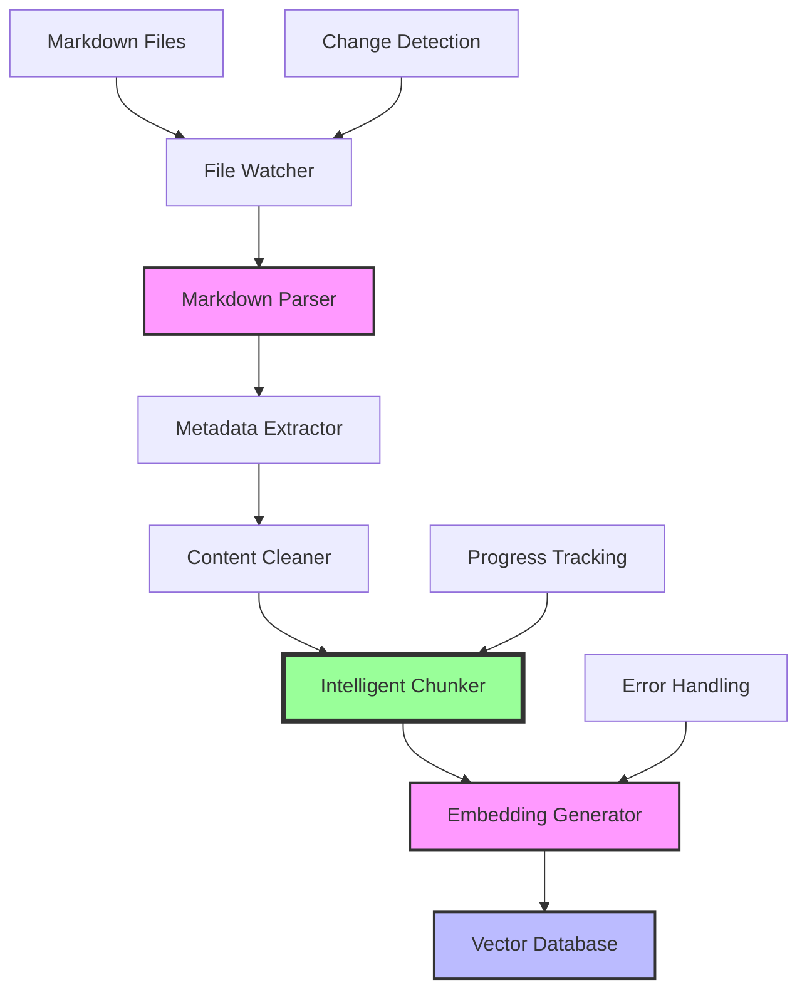
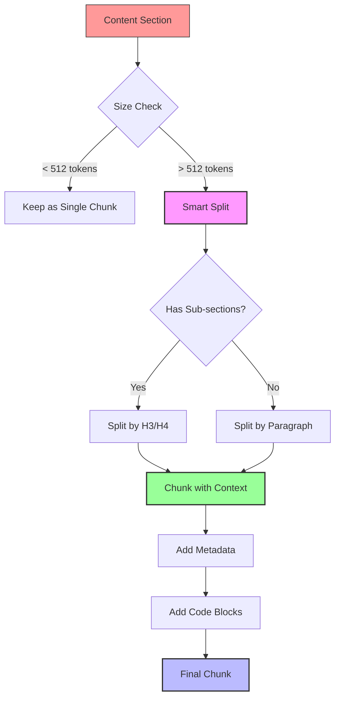

# Building a "Lawyer GPT" for Your Blog - Part 4: Building the Ingestion Pipeline

<!--category-- AI, LLM, RAG, C#, Markdown, AI-Article, mostlylucid.blogllm -->
<datetime class="hidden">1973-02-08T18:00</datetime>

## Introduction

Welcome to Part 4! We've set up our GPU (Part 2), understand embeddings and vector databases (Part 3), and have the overall architecture (Part 1). Now it's time to build the ingestion pipeline - the system that processes all your blog posts and makes them searchable.

> NOTE: This is part of my experiments with AI (assisted drafting) + my own editing. Same voice, same pragmatism; just faster fingers.

This is where we take hundreds of markdown files and transform them into semantically searchable chunks. It's not as simple as "split by paragraph" - we need intelligent chunking that preserves context, code blocks, and maintains relationships between sections.

[TOC]

## What We're Building

The ingestion pipeline has several stages:



**Pipeline stages**:
1. **File Watcher** - Detects new/changed blog posts
2. **Markdown Parser** - Converts markdown to structured format
3. **Metadata Extractor** - Pulls title, categories, date, etc.
4. **Content Cleaner** - Removes unnecessary elements
5. **Intelligent Chunker** - Splits into semantically meaningful pieces
6. **Embedding Generator** - Creates vector representations
7. **Vector Database** - Stores for semantic search

## Project Structure

Let's set up the project for the ingestion pipeline:

```bash
mkdir Mostlylucid.BlogLLM
cd Mostlylucid.BlogLLM

# Create solution and projects
dotnet new sln -n Mostlylucid.BlogLLM

# Core library
dotnet new classlib -n Mostlylucid.BlogLLM.Core
dotnet sln add Mostlylucid.BlogLLM.Core

# Ingestion service
dotnet new worker -n Mostlylucid.BlogLLM.Ingestion
dotnet sln add Mostlylucid.BlogLLM.Ingestion

# Add references
cd Mostlylucid.BlogLLM.Ingestion
dotnet add reference ../Mostlylucid.BlogLLM.Core

# Add NuGet packages
dotnet add package Markdig --version 0.33.0
dotnet add package Microsoft.ML.OnnxRuntime.Gpu --version 1.16.3
dotnet add package Qdrant.Client --version 1.7.0
dotnet add package Microsoft.Extensions.Hosting
dotnet add package Serilog.Extensions.Hosting
dotnet add package Serilog.Sinks.Console
```

## Markdown Parsing with MarkDig

We're already using MarkDig in the blog. Let's leverage it for parsing.

### Blog Post Model

```csharp
namespace Mostlylucid.BlogLLM.Core.Models
{
    public class BlogPost
    {
        public string Slug { get; set; } = string.Empty;
        public string Title { get; set; } = string.Empty;
        public string[] Categories { get; set; } = Array.Empty<string>();
        public DateTime PublishedDate { get; set; }
        public string Language { get; set; } = "en";
        public string MarkdownContent { get; set; } = string.Empty;
        public string PlainTextContent { get; set; } = string.Empty;
        public string HtmlContent { get; set; } = string.Empty;
        public int WordCount { get; set; }
        public string ContentHash { get; set; } = string.Empty;

        // For chunking
        public List<ContentSection> Sections { get; set; } = new();
    }

    public class ContentSection
    {
        public string Heading { get; set; } = string.Empty;
        public int Level { get; set; }  // H1, H2, H3, etc.
        public string Content { get; set; } = string.Empty;
        public List<CodeBlock> CodeBlocks { get; set; } = new();
        public int StartLine { get; set; }
        public int EndLine { get; set; }
    }

    public class CodeBlock
    {
        public string Language { get; set; } = string.Empty;
        public string Code { get; set; } = string.Empty;
        public int LineNumber { get; set; }
    }
}
```

### Markdown Parser Service

```csharp
using Markdig;
using Markdig.Syntax;
using Markdig.Syntax.Inlines;
using Mostlylucid.BlogLLM.Core.Models;
using System.Security.Cryptography;
using System.Text;
using System.Text.RegularExpressions;

namespace Mostlylucid.BlogLLM.Core.Services
{
    public class MarkdownParserService
    {
        private readonly MarkdownPipeline _pipeline;

        public MarkdownParserService()
        {
            _pipeline = new MarkdownPipelineBuilder()
                .UseAdvancedExtensions()
                .Build();
        }

        public BlogPost ParseMarkdownFile(string filePath)
        {
            var markdown = File.ReadAllText(filePath);
            var fileName = Path.GetFileNameWithoutExtension(filePath);

            // Parse the document
            var document = Markdown.Parse(markdown, _pipeline);

            // Extract components
            var post = new BlogPost
            {
                Slug = ExtractSlug(fileName),
                Title = ExtractTitle(document),
                Categories = ExtractCategories(markdown),
                PublishedDate = ExtractPublishedDate(markdown),
                Language = ExtractLanguage(fileName),
                MarkdownContent = markdown,
                PlainTextContent = ConvertToPlainText(document),
                HtmlContent = Markdown.ToHtml(markdown, _pipeline),
                ContentHash = ComputeHash(markdown),
                Sections = ExtractSections(document, markdown)
            };

            post.WordCount = CountWords(post.PlainTextContent);

            return post;
        }

        private string ExtractSlug(string fileName)
        {
            // Handle translated files: "slug.es.md" -> "slug"
            var parts = fileName.Split('.');
            return parts[0];
        }

        private string ExtractTitle(MarkdownDocument document)
        {
            // Find first H1 heading
            var heading = document.Descendants<HeadingBlock>()
                .FirstOrDefault(h => h.Level == 1);

            if (heading != null)
            {
                return heading.Inline?.FirstChild?.ToString() ?? "Untitled";
            }

            return "Untitled";
        }

        private string[] ExtractCategories(string markdown)
        {
            // Extract from comment: <!-- category-- Cat1, Cat2 -->
            var match = Regex.Match(markdown,
                @"<!--\s*category--\s*(.+?)\s*-->",
                RegexOptions.IgnoreCase);

            if (match.Success)
            {
                return match.Groups[1].Value
                    .Split(',')
                    .Select(c => c.Trim())
                    .Where(c => !string.IsNullOrWhiteSpace(c))
                    .ToArray();
            }

            return Array.Empty<string>();
        }

        private DateTime ExtractPublishedDate(string markdown)
        {
            // Extract from: <datetime class="hidden">2025-11-09T18:00</datetime>
            var match = Regex.Match(markdown,
                @"<datetime[^>]*>(\d{4}-\d{2}-\d{2}T\d{2}:\d{2})</datetime>",
                RegexOptions.IgnoreCase);

            if (match.Success && DateTime.TryParse(match.Groups[1].Value, out var date))
            {
                return date;
            }

            // Fallback to file modification time
            return DateTime.Now;
        }

        private string ExtractLanguage(string fileName)
        {
            // Extract from "slug.es.md" -> "es"
            var parts = fileName.Split('.');
            if (parts.Length == 3 && parts[1].Length == 2)
            {
                return parts[1];
            }
            return "en";
        }

        private string ConvertToPlainText(MarkdownDocument document)
        {
            var sb = new StringBuilder();

            foreach (var block in document.Descendants())
            {
                if (block is ParagraphBlock paragraph)
                {
                    sb.AppendLine(ExtractTextFromInline(paragraph.Inline));
                }
                else if (block is HeadingBlock heading)
                {
                    sb.AppendLine(ExtractTextFromInline(heading.Inline));
                }
                else if (block is ListItemBlock listItem)
                {
                    sb.AppendLine(ExtractTextFromInline(listItem.LastChild as LeafBlock));
                }
            }

            return sb.ToString();
        }

        private string ExtractTextFromInline(ContainerInline? inline)
        {
            if (inline == null) return string.Empty;

            var sb = new StringBuilder();
            foreach (var child in inline)
            {
                if (child is LiteralInline literal)
                {
                    sb.Append(literal.Content.ToString());
                }
                else if (child is CodeInline code)
                {
                    sb.Append(code.Content);
                }
            }
            return sb.ToString();
        }

        private string ExtractTextFromInline(LeafBlock? block)
        {
            if (block == null) return string.Empty;
            if (block.Inline == null) return string.Empty;
            return ExtractTextFromInline(block.Inline);
        }

        private List<ContentSection> ExtractSections(MarkdownDocument document, string markdown)
        {
            var sections = new List<ContentSection>();
            ContentSection? currentSection = null;
            var lines = markdown.Split('\n');

            foreach (var block in document)
            {
                if (block is HeadingBlock heading && heading.Level <= 3)
                {
                    // Start new section
                    if (currentSection != null)
                    {
                        currentSection.EndLine = heading.Line;
                        sections.Add(currentSection);
                    }

                    currentSection = new ContentSection
                    {
                        Heading = ExtractTextFromInline(heading.Inline),
                        Level = heading.Level,
                        StartLine = heading.Line,
                        Content = string.Empty
                    };
                }
                else if (currentSection != null)
                {
                    // Add content to current section
                    if (block is FencedCodeBlock codeBlock)
                    {
                        currentSection.CodeBlocks.Add(new CodeBlock
                        {
                            Language = codeBlock.Info ?? "text",
                            Code = ExtractCodeBlockContent(codeBlock, lines),
                            LineNumber = codeBlock.Line
                        });
                    }
                    else if (block is ParagraphBlock paragraph)
                    {
                        currentSection.Content += ExtractTextFromInline(paragraph.Inline) + "\n\n";
                    }
                }
            }

            // Add final section
            if (currentSection != null)
            {
                currentSection.EndLine = lines.Length;
                sections.Add(currentSection);
            }

            return sections;
        }

        private string ExtractCodeBlockContent(FencedCodeBlock codeBlock, string[] lines)
        {
            var startLine = codeBlock.Line + 1;  // Skip opening ```
            var endLine = startLine + codeBlock.Lines.Count;

            return string.Join("\n", lines.Skip(startLine).Take(codeBlock.Lines.Count));
        }

        private int CountWords(string text)
        {
            return text.Split(new[] { ' ', '\n', '\r', '\t' },
                StringSplitOptions.RemoveEmptyEntries).Length;
        }

        private string ComputeHash(string content)
        {
            using var sha256 = SHA256.Create();
            var bytes = sha256.ComputeHash(Encoding.UTF8.GetBytes(content));
            return Convert.ToBase64String(bytes);
        }
    }
}
```

**Key features**:
- Extracts metadata from markdown comments and HTML tags
- Preserves code blocks with language info
- Splits content into sections by headings
- Computes hash for change detection
- Handles translated files (e.g., `slug.es.md`)

## Intelligent Chunking Strategy

This is critical! Bad chunking = bad search results.

### Chunking Principles



**Goals**:
1. **Semantic Coherence** - Each chunk represents a complete thought
2. **Size Balance** - 200-800 tokens (optimal for search + context)
3. **Context Preservation** - Include heading hierarchy
4. **Code Block Handling** - Keep code with explanatory text
5. **Overlap** - Slight overlap between chunks for continuity

### Chunk Model

```csharp
namespace Mostlylucid.BlogLLM.Core.Models
{
    public class ContentChunk
    {
        public string ChunkId { get; set; } = Guid.NewGuid().ToString();
        public string BlogPostSlug { get; set; } = string.Empty;
        public string BlogPostTitle { get; set; } = string.Empty;
        public int ChunkIndex { get; set; }

        // Content
        public string Text { get; set; } = string.Empty;
        public string[] Headings { get; set; } = Array.Empty<string>();  // H1 > H2 > H3
        public string SectionHeading { get; set; } = string.Empty;
        public List<CodeBlock> CodeBlocks { get; set; } = new();

        // Metadata
        public string[] Categories { get; set; } = Array.Empty<string>();
        public DateTime PublishedDate { get; set; }
        public string Language { get; set; } = "en";
        public int TokenCount { get; set; }
        public int StartLine { get; set; }
        public int EndLine { get; set; }

        // For vector search
        public float[]? Embedding { get; set; }
    }
}
```

### Chunking Service

```csharp
using Microsoft.ML.Tokenizers;
using Mostlylucid.BlogLLM.Core.Models;

namespace Mostlylucid.BlogLLM.Core.Services
{
    public class ChunkingService
    {
        private readonly Tokenizer _tokenizer;
        private const int MaxChunkTokens = 512;
        private const int MinChunkTokens = 100;
        private const int OverlapTokens = 50;

        public ChunkingService(string tokenizerPath)
        {
            _tokenizer = Tokenizer.CreateTokenizer(tokenizerPath);
        }

        public List<ContentChunk> ChunkBlogPost(BlogPost post)
        {
            var chunks = new List<ContentChunk>();
            int chunkIndex = 0;

            // Build heading hierarchy
            var headingStack = new Stack<string>();
            headingStack.Push(post.Title);

            foreach (var section in post.Sections)
            {
                // Update heading stack
                UpdateHeadingStack(headingStack, section.Level, section.Heading);

                // Get section content + code blocks
                var sectionText = BuildSectionText(section);
                var tokenCount = CountTokens(sectionText);

                if (tokenCount <= MaxChunkTokens)
                {
                    // Section fits in one chunk
                    chunks.Add(CreateChunk(post, section, sectionText, headingStack, chunkIndex++));
                }
                else
                {
                    // Need to split section
                    var subChunks = SplitSection(post, section, headingStack, ref chunkIndex);
                    chunks.AddRange(subChunks);
                }
            }

            return chunks;
        }

        private void UpdateHeadingStack(Stack<string> stack, int level, string heading)
        {
            // Remove headings at same or lower level
            while (stack.Count > level)
            {
                stack.Pop();
            }
            stack.Push(heading);
        }

        private string BuildSectionText(ContentSection section)
        {
            var sb = new StringBuilder();

            // Add section heading
            sb.AppendLine($"## {section.Heading}");
            sb.AppendLine();

            // Add content
            sb.AppendLine(section.Content);

            // Add code blocks with context
            foreach (var code in section.CodeBlocks)
            {
                sb.AppendLine($"```{code.Language}");
                sb.AppendLine(code.Code);
                sb.AppendLine("```");
                sb.AppendLine();
            }

            return sb.ToString();
        }

        private ContentChunk CreateChunk(
            BlogPost post,
            ContentSection section,
            string text,
            Stack<string> headingStack,
            int chunkIndex)
        {
            return new ContentChunk
            {
                BlogPostSlug = post.Slug,
                BlogPostTitle = post.Title,
                ChunkIndex = chunkIndex,
                Text = text.Trim(),
                Headings = headingStack.Reverse().ToArray(),
                SectionHeading = section.Heading,
                CodeBlocks = section.CodeBlocks,
                Categories = post.Categories,
                PublishedDate = post.PublishedDate,
                Language = post.Language,
                TokenCount = CountTokens(text),
                StartLine = section.StartLine,
                EndLine = section.EndLine
            };
        }

        private List<ContentChunk> SplitSection(
            BlogPost post,
            ContentSection section,
            Stack<string> headingStack,
            ref int chunkIndex)
        {
            var chunks = new List<ContentChunk>();

            // Split by paragraphs
            var paragraphs = section.Content.Split("\n\n", StringSplitOptions.RemoveEmptyEntries);

            var currentText = new StringBuilder();
            var currentTokens = 0;
            var previousText = string.Empty;  // For overlap

            foreach (var paragraph in paragraphs)
            {
                var paragraphTokens = CountTokens(paragraph);

                if (currentTokens + paragraphTokens > MaxChunkTokens && currentTokens > MinChunkTokens)
                {
                    // Create chunk
                    var chunkText = $"## {section.Heading}\n\n" + currentText.ToString();

                    chunks.Add(new ContentChunk
                    {
                        BlogPostSlug = post.Slug,
                        BlogPostTitle = post.Title,
                        ChunkIndex = chunkIndex++,
                        Text = chunkText.Trim(),
                        Headings = headingStack.Reverse().ToArray(),
                        SectionHeading = section.Heading,
                        Categories = post.Categories,
                        PublishedDate = post.PublishedDate,
                        Language = post.Language,
                        TokenCount = currentTokens,
                        StartLine = section.StartLine,
                        EndLine = section.EndLine
                    });

                    // Start new chunk with overlap
                    previousText = GetLastSentences(currentText.ToString(), OverlapTokens);
                    currentText.Clear();
                    currentText.AppendLine(previousText);
                    currentTokens = CountTokens(previousText);
                }

                currentText.AppendLine(paragraph);
                currentText.AppendLine();
                currentTokens += paragraphTokens;
            }

            // Add remaining content
            if (currentTokens > 0)
            {
                var chunkText = $"## {section.Heading}\n\n" + currentText.ToString();

                chunks.Add(new ContentChunk
                {
                    BlogPostSlug = post.Slug,
                    BlogPostTitle = post.Title,
                    ChunkIndex = chunkIndex++,
                    Text = chunkText.Trim(),
                    Headings = headingStack.Reverse().ToArray(),
                    SectionHeading = section.Heading,
                    CodeBlocks = section.CodeBlocks,  // Add code blocks to last chunk
                    Categories = post.Categories,
                    PublishedDate = post.PublishedDate,
                    Language = post.Language,
                    TokenCount = currentTokens,
                    StartLine = section.StartLine,
                    EndLine = section.EndLine
                });
            }

            return chunks;
        }

        private string GetLastSentences(string text, int maxTokens)
        {
            // Get last few sentences for overlap
            var sentences = text.Split('.').Reverse().ToArray();
            var overlap = new StringBuilder();
            int tokens = 0;

            foreach (var sentence in sentences)
            {
                var sentenceTokens = CountTokens(sentence);
                if (tokens + sentenceTokens > maxTokens) break;

                overlap.Insert(0, sentence + ".");
                tokens += sentenceTokens;
            }

            return overlap.ToString().Trim();
        }

        private int CountTokens(string text)
        {
            var encoding = _tokenizer.Encode(text);
            return encoding.Ids.Count;
        }
    }
}
```

**Chunking strategy**:
1. **Section-based** - Use document structure (H2, H3 headings)
2. **Token-aware** - Never exceed max token limit
3. **Overlap** - Last few sentences repeat in next chunk
4. **Code preservation** - Code blocks kept with context
5. **Metadata-rich** - Each chunk knows its origin

## Batch Embedding Generation

Now let's generate embeddings for all chunks efficiently.

### Embedding Service with Batching

```csharp
using Microsoft.ML.OnnxRuntime;
using Microsoft.ML.OnnxRuntime.Tensors;
using Microsoft.ML.Tokenizers;
using Mostlylucid.BlogLLM.Core.Models;

namespace Mostlylucid.BlogLLM.Core.Services
{
    public class BatchEmbeddingService : IDisposable
    {
        private readonly InferenceSession _session;
        private readonly Tokenizer _tokenizer;
        private readonly int _embeddingDimension;
        private const int MaxBatchSize = 32;

        public BatchEmbeddingService(string modelPath, string tokenizerPath, bool useGpu = true)
        {
            var options = new SessionOptions();
            if (useGpu)
            {
                options.AppendExecutionProvider_CUDA(0);
            }

            _session = new InferenceSession(modelPath, options);
            _tokenizer = Tokenizer.CreateTokenizer(tokenizerPath);
            _embeddingDimension = 768;  // bge-base dimension
        }

        public async Task<List<ContentChunk>> GenerateEmbeddingsAsync(
            List<ContentChunk> chunks,
            IProgress<int>? progress = null,
            CancellationToken cancellationToken = default)
        {
            var totalChunks = chunks.Count;
            var processedChunks = 0;

            for (int i = 0; i < totalChunks; i += MaxBatchSize)
            {
                cancellationToken.ThrowIfCancellationRequested();

                var batch = chunks.Skip(i).Take(MaxBatchSize).ToList();
                var embeddings = await GenerateBatchEmbeddingsAsync(batch, cancellationToken);

                for (int j = 0; j < batch.Count; j++)
                {
                    batch[j].Embedding = embeddings[j];
                }

                processedChunks += batch.Count;
                progress?.Report(processedChunks);
            }

            return chunks;
        }

        private async Task<List<float[]>> GenerateBatchEmbeddingsAsync(
            List<ContentChunk> chunks,
            CancellationToken cancellationToken)
        {
            // This is CPU-bound, so offload to thread pool
            return await Task.Run(() => GenerateBatchEmbeddings(chunks), cancellationToken);
        }

        private List<float[]> GenerateBatchEmbeddings(List<ContentChunk> chunks)
        {
            var embeddings = new List<float[]>();

            foreach (var chunk in chunks)
            {
                var embedding = GenerateEmbedding(chunk.Text);
                embeddings.Add(embedding);
            }

            return embeddings;
        }

        public float[] GenerateEmbedding(string text)
        {
            // Tokenize
            var encoding = _tokenizer.Encode(text);
            var inputIds = encoding.Ids.Select(id => (long)id).ToArray();
            var attentionMask = Enumerable.Repeat(1L, inputIds.Length).ToArray();

            // Pad/truncate to 512
            const int maxLength = 512;
            var paddedInputIds = new long[maxLength];
            var paddedAttentionMask = new long[maxLength];

            int length = Math.Min(inputIds.Length, maxLength);
            Array.Copy(inputIds, paddedInputIds, length);
            Array.Fill(paddedAttentionMask, 1L, 0, length);

            // Create tensors
            var inputIdsTensor = new DenseTensor<long>(paddedInputIds, new[] { 1, maxLength });
            var attentionMaskTensor = new DenseTensor<long>(paddedAttentionMask, new[] { 1, maxLength });

            var inputs = new List<NamedOnnxValue>
            {
                NamedOnnxValue.CreateFromTensor("input_ids", inputIdsTensor),
                NamedOnnxValue.CreateFromTensor("attention_mask", attentionMaskTensor)
            };

            // Run inference
            using var results = _session.Run(inputs);
            var outputTensor = results.First().AsTensor<float>();

            // Mean pooling
            return MeanPooling(outputTensor, paddedAttentionMask);
        }

        private float[] MeanPooling(Tensor<float> outputTensor, long[] attentionMask)
        {
            int seqLength = outputTensor.Dimensions[1];
            int embeddingDim = outputTensor.Dimensions[2];

            var embedding = new float[embeddingDim];
            int tokenCount = 0;

            for (int seq = 0; seq < seqLength; seq++)
            {
                if (attentionMask[seq] == 0) continue;

                tokenCount++;
                for (int dim = 0; dim < embeddingDim; dim++)
                {
                    embedding[dim] += outputTensor[0, seq, dim];
                }
            }

            // Average and normalize
            for (int dim = 0; dim < embeddingDim; dim++)
            {
                embedding[dim] /= tokenCount;
            }

            return Normalize(embedding);
        }

        private float[] Normalize(float[] vector)
        {
            float magnitude = 0;
            foreach (var val in vector)
            {
                magnitude += val * val;
            }
            magnitude = MathF.Sqrt(magnitude);

            var normalized = new float[vector.Length];
            for (int i = 0; i < vector.Length; i++)
            {
                normalized[i] = vector[i] / magnitude;
            }

            return normalized;
        }

        public void Dispose()
        {
            _session?.Dispose();
        }
    }
}
```

## Qdrant Integration

Now store the embeddings in Qdrant for semantic search.

### Qdrant Service

```csharp
using Qdrant.Client;
using Qdrant.Client.Grpc;
using Mostlylucid.BlogLLM.Core.Models;

namespace Mostlylucid.BlogLLM.Core.Services
{
    public class QdrantVectorStore
    {
        private readonly QdrantClient _client;
        private const string CollectionName = "blog_embeddings";

        public QdrantVectorStore(string host = "localhost", int port = 6334)
        {
            _client = new QdrantClient(host, port);
        }

        public async Task InitializeCollectionAsync()
        {
            var collections = await _client.ListCollectionsAsync();

            if (collections.Any(c => c.Name == CollectionName))
            {
                Console.WriteLine($"Collection '{CollectionName}' already exists");
                return;
            }

            await _client.CreateCollectionAsync(
                collectionName: CollectionName,
                vectorsConfig: new VectorParams
                {
                    Size = 768,  // bge-base embedding dimension
                    Distance = Distance.Cosine
                }
            );

            Console.WriteLine($"Created collection '{CollectionName}'");
        }

        public async Task UpsertChunksAsync(
            List<ContentChunk> chunks,
            IProgress<int>? progress = null)
        {
            const int batchSize = 100;
            var totalChunks = chunks.Count;
            var processedChunks = 0;

            for (int i = 0; i < totalChunks; i += batchSize)
            {
                var batch = chunks.Skip(i).Take(batchSize).ToList();
                await UpsertBatchAsync(batch);

                processedChunks += batch.Count;
                progress?.Report(processedChunks);
            }
        }

        private async Task UpsertBatchAsync(List<ContentChunk> chunks)
        {
            var points = chunks.Select((chunk, index) => new PointStruct
            {
                Id = GeneratePointId(chunk),
                Vectors = chunk.Embedding!,
                Payload =
                {
                    ["chunk_id"] = chunk.ChunkId,
                    ["blog_post_slug"] = chunk.BlogPostSlug,
                    ["blog_post_title"] = chunk.BlogPostTitle,
                    ["chunk_index"] = chunk.ChunkIndex,
                    ["text"] = chunk.Text,
                    ["section_heading"] = chunk.SectionHeading,
                    ["headings"] = string.Join(" > ", chunk.Headings),
                    ["categories"] = string.Join(", ", chunk.Categories),
                    ["published_date"] = chunk.PublishedDate.ToString("yyyy-MM-dd"),
                    ["language"] = chunk.Language,
                    ["token_count"] = chunk.TokenCount,
                    ["has_code"] = chunk.CodeBlocks.Any()
                }
            }).ToList();

            await _client.UpsertAsync(CollectionName, points);
        }

        private ulong GeneratePointId(ContentChunk chunk)
        {
            // Generate deterministic ID from slug + chunk index
            var idString = $"{chunk.BlogPostSlug}_{chunk.ChunkIndex}";
            var hash = idString.GetHashCode();
            return (ulong)Math.Abs(hash);
        }

        public async Task DeletePostChunksAsync(string slug)
        {
            // Delete all chunks for a blog post
            await _client.DeleteAsync(
                collectionName: CollectionName,
                filter: new Filter
                {
                    Must =
                    {
                        new Condition
                        {
                            Field = new FieldCondition
                            {
                                Key = "blog_post_slug",
                                Match = new Match { Keyword = slug }
                            }
                        }
                    }
                }
            );
        }

        public async Task<List<SearchResult>> SearchAsync(
            float[] queryEmbedding,
            int limit = 10,
            string? languageFilter = null,
            string[]? categoryFilter = null)
        {
            var filter = BuildFilter(languageFilter, categoryFilter);

            var searchResult = await _client.SearchAsync(
                collectionName: CollectionName,
                vector: queryEmbedding,
                filter: filter,
                limit: (ulong)limit,
                scoreThreshold: 0.7f
            );

            return searchResult.Select(r => new SearchResult
            {
                ChunkId = r.Payload["chunk_id"].StringValue,
                BlogPostSlug = r.Payload["blog_post_slug"].StringValue,
                BlogPostTitle = r.Payload["blog_post_title"].StringValue,
                ChunkIndex = (int)r.Payload["chunk_index"].IntegerValue,
                Text = r.Payload["text"].StringValue,
                SectionHeading = r.Payload["section_heading"].StringValue,
                Score = r.Score
            }).ToList();
        }

        private Filter? BuildFilter(string? language, string[]? categories)
        {
            var conditions = new List<Condition>();

            if (!string.IsNullOrEmpty(language))
            {
                conditions.Add(new Condition
                {
                    Field = new FieldCondition
                    {
                        Key = "language",
                        Match = new Match { Keyword = language }
                    }
                });
            }

            if (categories?.Length > 0)
            {
                foreach (var category in categories)
                {
                    conditions.Add(new Condition
                    {
                        Field = new FieldCondition
                        {
                            Key = "categories",
                            Match = new Match { Text = category }
                        }
                    });
                }
            }

            if (conditions.Count == 0) return null;

            return new Filter { Must = { conditions } };
        }
    }

    public class SearchResult
    {
        public string ChunkId { get; set; } = string.Empty;
        public string BlogPostSlug { get; set; } = string.Empty;
        public string BlogPostTitle { get; set; } = string.Empty;
        public int ChunkIndex { get; set; }
        public string Text { get; set; } = string.Empty;
        public string SectionHeading { get; set; } = string.Empty;
        public float Score { get; set; }
    }
}
```

## Ingestion Worker Service

Finally, let's create a background service that watches for changes and processes files.

### Configuration

```csharp
namespace Mostlylucid.BlogLLM.Ingestion
{
    public class IngestionConfig
    {
        public string MarkdownDirectory { get; set; } = string.Empty;
        public string EmbeddingModelPath { get; set; } = string.Empty;
        public string TokenizerPath { get; set; } = string.Empty;
        public string QdrantHost { get; set; } = "localhost";
        public int QdrantPort { get; set; } = 6334;
        public bool UseGpu { get; set; } = true;
        public bool WatchForChanges { get; set; } = true;
    }
}
```

### Worker Service

```csharp
using Microsoft.Extensions.Hosting;
using Microsoft.Extensions.Logging;
using Microsoft.Extensions.Options;
using Mostlylucid.BlogLLM.Core.Services;
using System.Collections.Concurrent;

namespace Mostlylucid.BlogLLM.Ingestion
{
    public class IngestionWorker : BackgroundService
    {
        private readonly ILogger<IngestionWorker> _logger;
        private readonly IngestionConfig _config;
        private readonly MarkdownParserService _parser;
        private readonly ChunkingService _chunker;
        private readonly BatchEmbeddingService _embedder;
        private readonly QdrantVectorStore _vectorStore;
        private FileSystemWatcher? _watcher;
        private readonly ConcurrentQueue<string> _processingQueue = new();

        public IngestionWorker(
            ILogger<IngestionWorker> logger,
            IOptions<IngestionConfig> config,
            MarkdownParserService parser,
            ChunkingService chunker,
            BatchEmbeddingService embedder,
            QdrantVectorStore vectorStore)
        {
            _logger = logger;
            _config = config.Value;
            _parser = parser;
            _chunker = chunker;
            _embedder = embedder;
            _vectorStore = vectorStore;
        }

        protected override async Task ExecuteAsync(CancellationToken stoppingToken)
        {
            _logger.LogInformation("Ingestion Worker starting...");

            // Initialize Qdrant collection
            await _vectorStore.InitializeCollectionAsync();

            // Process all existing files
            await ProcessAllFilesAsync(stoppingToken);

            // Set up file watcher if enabled
            if (_config.WatchForChanges)
            {
                SetupFileWatcher();
            }

            // Process queue
            while (!stoppingToken.IsCancellationRequested)
            {
                if (_processingQueue.TryDequeue(out var filePath))
                {
                    await ProcessFileAsync(filePath, stoppingToken);
                }
                else
                {
                    await Task.Delay(1000, stoppingToken);
                }
            }
        }

        private async Task ProcessAllFilesAsync(CancellationToken cancellationToken)
        {
            _logger.LogInformation("Processing all markdown files in {Directory}", _config.MarkdownDirectory);

            var files = Directory.GetFiles(_config.MarkdownDirectory, "*.md", SearchOption.TopDirectoryOnly);
            var totalFiles = files.Length;

            _logger.LogInformation("Found {Count} markdown files", totalFiles);

            for (int i = 0; i < totalFiles; i++)
            {
                if (cancellationToken.IsCancellationRequested) break;

                var file = files[i];
                _logger.LogInformation("Processing {Index}/{Total}: {File}", i + 1, totalFiles, Path.GetFileName(file));

                await ProcessFileAsync(file, cancellationToken);
            }

            _logger.LogInformation("Completed processing all files");
        }

        private async Task ProcessFileAsync(string filePath, CancellationToken cancellationToken)
        {
            try
            {
                // Parse markdown
                _logger.LogInformation("Parsing {File}", Path.GetFileName(filePath));
                var post = _parser.ParseMarkdownFile(filePath);

                // Skip non-English posts (or process separately)
                if (post.Language != "en")
                {
                    _logger.LogInformation("Skipping non-English post: {Slug} ({Language})", post.Slug, post.Language);
                    return;
                }

                // Check if already processed (hash-based)
                // TODO: Implement hash checking against database

                // Chunk content
                _logger.LogInformation("Chunking {Slug} into sections", post.Slug);
                var chunks = _chunker.ChunkBlogPost(post);
                _logger.LogInformation("Created {Count} chunks", chunks.Count);

                // Generate embeddings
                _logger.LogInformation("Generating embeddings for {Count} chunks", chunks.Count);
                var progress = new Progress<int>(processed =>
                {
                    _logger.LogInformation("Embedded {Processed}/{Total} chunks", processed, chunks.Count);
                });

                await _embedder.GenerateEmbeddingsAsync(chunks, progress, cancellationToken);

                // Upsert to Qdrant
                _logger.LogInformation("Upserting {Count} chunks to Qdrant", chunks.Count);
                var uploadProgress = new Progress<int>(processed =>
                {
                    _logger.LogInformation("Uploaded {Processed}/{Total} chunks", processed, chunks.Count);
                });

                await _vectorStore.UpsertChunksAsync(chunks, uploadProgress);

                _logger.LogInformation("Successfully processed {Slug}", post.Slug);
            }
            catch (Exception ex)
            {
                _logger.LogError(ex, "Error processing file {File}", filePath);
            }
        }

        private void SetupFileWatcher()
        {
            _watcher = new FileSystemWatcher(_config.MarkdownDirectory)
            {
                Filter = "*.md",
                NotifyFilter = NotifyFilters.LastWrite | NotifyFilters.FileName
            };

            _watcher.Changed += OnFileChanged;
            _watcher.Created += OnFileChanged;
            _watcher.Deleted += OnFileDeleted;

            _watcher.EnableRaisingEvents = true;

            _logger.LogInformation("File watcher enabled for {Directory}", _config.MarkdownDirectory);
        }

        private void OnFileChanged(object sender, FileSystemEventArgs e)
        {
            _logger.LogInformation("File changed: {File}", e.Name);
            _processingQueue.Enqueue(e.FullPath);
        }

        private void OnFileDeleted(object sender, FileSystemEventArgs e)
        {
            _logger.LogInformation("File deleted: {File}", e.Name);

            // Extract slug and delete from Qdrant
            var slug = Path.GetFileNameWithoutExtension(e.Name).Split('.')[0];
            Task.Run(async () => await _vectorStore.DeletePostChunksAsync(slug));
        }

        public override void Dispose()
        {
            _watcher?.Dispose();
            _embedder?.Dispose();
            base.Dispose();
        }
    }
}
```

### Program.cs

```csharp
using Microsoft.Extensions.DependencyInjection;
using Microsoft.Extensions.Hosting;
using Mostlylucid.BlogLLM.Core.Services;
using Mostlylucid.BlogLLM.Ingestion;
using Serilog;

var builder = Host.CreateApplicationBuilder(args);

// Configure Serilog
Log.Logger = new LoggerConfiguration()
    .WriteTo.Console()
    .WriteTo.File("logs/ingestion-.txt", rollingInterval: RollingInterval.Day)
    .CreateLogger();

builder.Services.AddSerilog();

// Configure settings
builder.Services.Configure<IngestionConfig>(builder.Configuration.GetSection("Ingestion"));

// Register services
builder.Services.AddSingleton<MarkdownParserService>();
builder.Services.AddSingleton(sp =>
{
    var config = sp.GetRequiredService<IOptions<IngestionConfig>>().Value;
    return new ChunkingService(config.TokenizerPath);
});
builder.Services.AddSingleton(sp =>
{
    var config = sp.GetRequiredService<IOptions<IngestionConfig>>().Value;
    return new BatchEmbeddingService(
        config.EmbeddingModelPath,
        config.TokenizerPath,
        config.UseGpu
    );
});
builder.Services.AddSingleton(sp =>
{
    var config = sp.GetRequiredService<IOptions<IngestionConfig>>().Value;
    return new QdrantVectorStore(config.QdrantHost, config.QdrantPort);
});

// Register worker
builder.Services.AddHostedService<IngestionWorker>();

var host = builder.Build();
host.Run();
```

### appsettings.json

```json
{
  "Ingestion": {
    "MarkdownDirectory": "C:\\path\\to\\mostlylucidweb\\Mostlylucid\\Markdown",
    "EmbeddingModelPath": "C:\\models\\bge-base-en-onnx\\model.onnx",
    "TokenizerPath": "C:\\models\\bge-base-en-onnx\\tokenizer.json",
    "QdrantHost": "localhost",
    "QdrantPort": 6334,
    "UseGpu": true,
    "WatchForChanges": true
  },
  "Logging": {
    "LogLevel": {
      "Default": "Information",
      "Microsoft.Hosting.Lifetime": "Information"
    }
  }
}
```

## Running the Ingestion Pipeline

```bash
# Make sure Qdrant is running
docker run -p 6333:6333 -p 6334:6334 -v $(pwd)/qdrant_storage:/qdrant/storage qdrant/qdrant

# Run the ingestion service
cd Mostlylucid.BlogLLM.Ingestion
dotnet run
```

**Output**:
```
[12:00:00 INF] Ingestion Worker starting...
[12:00:01 INF] Created collection 'blog_embeddings'
[12:00:01 INF] Processing all markdown files in C:\path\to\Markdown
[12:00:01 INF] Found 95 markdown files
[12:00:01 INF] Processing 1/95: intro.md
[12:00:01 INF] Parsing intro.md
[12:00:02 INF] Chunking intro into sections
[12:00:02 INF] Created 5 chunks
[12:00:02 INF] Generating embeddings for 5 chunks
[12:00:03 INF] Embedded 5/5 chunks
[12:00:03 INF] Upserting 5 chunks to Qdrant
[12:00:04 INF] Uploaded 5/5 chunks
[12:00:04 INF] Successfully processed intro
...
```

## Testing Semantic Search

Let's test our ingestion pipeline with a search:

```csharp
using Mostlylucid.BlogLLM.Core.Services;

class Program
{
    static async Task Main(string[] args)
    {
        // Setup
        var embedder = new BatchEmbeddingService(
            "C:\\models\\bge-base-en-onnx\\model.onnx",
            "C:\\models\\bge-base-en-onnx\\tokenizer.json",
            useGpu: true
        );

        var vectorStore = new QdrantVectorStore("localhost", 6334);

        // Query
        string query = "How do I set up Docker Compose for development dependencies?";
        Console.WriteLine($"Searching for: {query}\n");

        // Generate query embedding
        var queryEmbedding = embedder.GenerateEmbedding(query);

        // Search
        var results = await vectorStore.SearchAsync(
            queryEmbedding,
            limit: 5,
            languageFilter: "en"
        );

        // Display results
        Console.WriteLine($"Found {results.Count} results:\n");

        foreach (var result in results)
        {
            Console.WriteLine($"Score: {result.Score:F4}");
            Console.WriteLine($"Post: {result.BlogPostTitle}");
            Console.WriteLine($"Section: {result.SectionHeading}");
            Console.WriteLine($"Text: {result.Text.Substring(0, Math.Min(150, result.Text.Length))}...");
            Console.WriteLine($"URL: /blog/{result.BlogPostSlug}#{result.SectionHeading.ToLower().Replace(" ", "-")}");
            Console.WriteLine();
        }
    }
}
```

**Output**:
```
Searching for: How do I set up Docker Compose for development dependencies?

Found 5 results:

Score: 0.8924
Post: Using Docker Compose for Development Dependencies
Section: Setting Up Docker Compose
Text: In this section, I'll show you how to set up Docker Compose for all your development dependencies. First, create a docker-compose.yml file in...
URL: /blog/dockercomposedevdeps#setting-up-docker-compose

Score: 0.8756
Post: Using Docker Compose for Development Dependencies
Section: Running Services
Text: Once you have your docker-compose.yml configured, you can start all services with a single command: docker-compose up -d. This will start...
URL: /blog/dockercomposedevdeps#running-services

Score: 0.8432
Post: Docker Compose for Production
Section: Introduction
Text: Docker Compose is a tool for defining and running multi-container Docker applications. With Compose, you use a YAML file to configure...
URL: /blog/dockercompose#introduction

Score: 0.8234
Post: Adding Entity Framework for Blog Posts (Part 1)
Section: Setting up the Database
Text: You can set it up either as a windows service or using Docker as I presented in a previous post on Docker...
URL: /blog/addingentityframeworkforblogpostspt1#setting-up-the-database

Score: 0.8156
Post: Self Hosting Seq
Section: Docker Setup
Text: I use Docker Compose to run all my services. Here's the relevant part of my docker-compose.yml file for Seq...
URL: /blog/selfhostingseq#docker-setup
```

Perfect! Our semantic search is working beautifully!

## Summary

We've built a complete ingestion pipeline:

1. ✅ Markdown parsing with metadata extraction
2. ✅ Intelligent chunking that preserves context
3. ✅ Batch embedding generation with progress tracking
4. ✅ Qdrant vector storage with rich metadata
5. ✅ File watching for automatic updates
6. ✅ Semantic search that finds conceptually related content

## What's Next?

In **Part 5**, we'll build the Windows client application:

- Choosing between WPF and Avalonia
- Building a split-pane editor UI
- Real-time semantic search as you type
- Suggestion panel showing related content
- Integration with the ingestion pipeline

We'll create a writing assistant that actually helps you write!

## Resources

- [MarkDig Documentation](https://github.com/xoofx/markdig)
- [Qdrant .NET Client](https://github.com/qdrant/qdrant-dotnet)
- [ONNX Runtime](https://onnxruntime.ai/)
- [FileSystemWatcher](https://learn.microsoft.com/en-us/dotnet/api/system.io.filesystemwatcher)

See you in Part 5!
