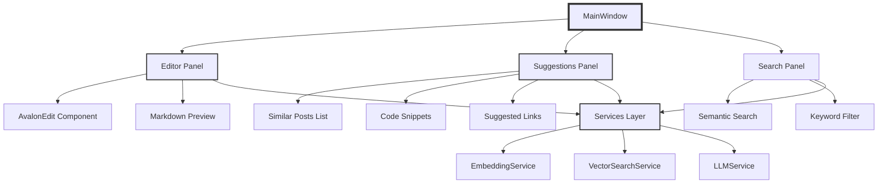

# Building a "Lawyer GPT" for Your Blog - Part 5: The Windows Client

<!--category-- AI, LLM, WPF, Avalonia, C#, AI-Article, mostlylucid.blogllm -->
<datetime class="hidden">1973-02-08T20:00</datetime>

WARNING: THESE ARE DRAFT POSTS WHICH 'ESCAPED'.

It's likely much of what's below won't work; I generate these as how-to for ME and then do all the steps and get the sample app working...You've been sneaky and seen them!  they'll likely be ready mid-December.


## Introduction

Welcome to Part 5! We've built the entire ingestion pipeline ([Part 4](/blog/building-a-lawyer-gpt-for-your-blog-part4)), understand embeddings and vector search ([Part 3](/blog/building-a-lawyer-gpt-for-your-blog-part3)), and have our GPU ready ([Part 2](/blog/building-a-lawyer-gpt-for-your-blog-part2)). Now it's time to build the actual writing assistant interface - the Windows client where you'll write blog posts with AI-powered suggestions.

> NOTE: This is part of my experiments with AI (assisted drafting) + my own editing. Same voice, same pragmatism; just faster fingers.

Think of [GitHub Copilot](https://github.com/features/copilot) or the new AI features in [VS Code](https://code.visualstudio.com/) - but for blog writing. As you type, the system searches your past posts semantically and offers relevant suggestions, code snippets, and internal links.

[TOC]

## Choosing the UI Framework

We have three main options for building a modern Windows desktop app in C#:

### Framework Comparison

| Feature | WPF | Avalonia | MAUI |
|---------|-----|----------|------|
| **Platform** | Windows only | Cross-platform | Cross-platform |
| **Maturity** | Very mature (2006) | Mature (2016) | New (2022) |
| **XAML Support** | Full | Full (compatible) | Different flavor |
| **Performance** | Excellent | Excellent | Good |
| **UI Libraries** | Many (MaterialDesign, ModernWPF) | Growing | Limited |
| **Learning Curve** | Moderate | Easy (if know WPF) | Moderate |
| **Ecosystem** | Huge | Growing | Smallest |

**My choice: [Avalonia](https://avaloniaui.net/)**

Why?
- Cross-platform (can run on Linux/Mac if needed)
- Modern, actively developed
- [WPF](https://docs.microsoft.com/en-us/dotnet/desktop/wpf/)-compatible XAML (easy to learn)
- Good performance
- Growing ecosystem

But the concepts apply to WPF too - I'll note WPF alternatives where they differ.

## Application Architecture



**Key components**:
1. **MainWindow** - Shell with menu, status bar
2. **Editor Panel** - Where you write (markdown editor)
3. **Suggestions Panel** - AI-powered suggestions
4. **Search Panel** - Semantic search interface
5. **Services Layer** - Backend integration

## Project Setup

```bash
# Create Avalonia MVVM application
dotnet new install Avalonia.Templates
dotnet new avalonia.mvvm -n Mostlylucid.BlogLLM.Client

cd Mostlylucid.BlogLLM.Client

# Add necessary packages (latest versions)
dotnet add package AvaloniaEdit
dotnet add package Markdown.Avalonia
dotnet add package CommunityToolkit.Mvvm

# Add references to our core library
dotnet add reference ../Mostlylucid.BlogLLM.Core
```

## Main Window Layout

### XAML Structure

```xml
<Window xmlns="https://github.com/avaloniaui"
        xmlns:x="http://schemas.microsoft.com/winfx/2006/xaml"
        xmlns:vm="using:Mostlylucid.BlogLLM.Client.ViewModels"
        xmlns:views="using:Mostlylucid.BlogLLM.Client.Views"
        x:Class="Mostlylucid.BlogLLM.Client.Views.MainWindow"
        x:DataType="vm:MainWindowViewModel"
        Title="Blog Writing Assistant"
        Width="1400" Height="900">

    <Design.DataContext>
        <vm:MainWindowViewModel />
    </Design.DataContext>

    <Grid RowDefinitions="Auto,*,Auto">
        <!-- Menu Bar -->
        <Menu Grid.Row="0">
            <MenuItem Header="_File">
                <MenuItem Header="_New Post" Command="{Binding NewPostCommand}" />
                <MenuItem Header="_Open Post" Command="{Binding OpenPostCommand}" />
                <MenuItem Header="_Save" Command="{Binding SaveCommand}" />
                <Separator />
                <MenuItem Header="E_xit" Command="{Binding ExitCommand}" />
            </MenuItem>
            <MenuItem Header="_Edit">
                <MenuItem Header="_Undo" Command="{Binding UndoCommand}" />
                <MenuItem Header="_Redo" Command="{Binding RedoCommand}" />
            </MenuItem>
            <MenuItem Header="_AI">
                <MenuItem Header="_Generate Suggestions" Command="{Binding GenerateSuggestionsCommand}" />
                <MenuItem Header="_Semantic Search" Command="{Binding OpenSearchCommand}" />
                <MenuItem Header="_Insert Link" Command="{Binding InsertLinkCommand}" />
            </MenuItem>
        </Menu>

        <!-- Main Content - Split View -->
        <Grid Grid.Row="1" ColumnDefinitions="2*,*">
            <!-- Left: Editor -->
            <Border Grid.Column="0" BorderBrush="LightGray" BorderThickness="0,0,1,0">
                <views:EditorView DataContext="{Binding EditorViewModel}" />
            </Border>

            <!-- Right: Suggestions -->
            <Border Grid.Column="1">
                <views:SuggestionsView DataContext="{Binding SuggestionsViewModel}" />
            </Border>
        </Grid>

        <!-- Status Bar -->
        <Border Grid.Row="2" Background="WhiteSmoke" Padding="8,4">
            <Grid ColumnDefinitions="*,Auto,Auto,Auto">
                <TextBlock Grid.Column="0" Text="{Binding StatusMessage}" />
                <TextBlock Grid.Column="1" Text="{Binding WordCount, StringFormat='Words: {0}'}" Margin="10,0" />
                <TextBlock Grid.Column="2" Text="{Binding CharCount, StringFormat='Chars: {0}'}" Margin="10,0" />
                <ProgressBar Grid.Column="3"
                             Width="100"
                             Height="16"
                             IsVisible="{Binding IsProcessing}"
                             IsIndeterminate="True" />
            </Grid>
        </Border>
    </Grid>
</Window>
```

### MainWindowViewModel

```csharp
using CommunityToolkit.Mvvm.ComponentModel;
using CommunityToolkit.Mvvm.Input;
using Mostlylucid.BlogLLM.Client.Services;
using System.Threading.Tasks;

namespace Mostlylucid.BlogLLM.Client.ViewModels
{
    public partial class MainWindowViewModel : ViewModelBase
    {
        private readonly IEditorService _editorService;
        private readonly ISuggestionService _suggestionService;

        [ObservableProperty]
        private EditorViewModel _editorViewModel;

        [ObservableProperty]
        private SuggestionsViewModel _suggestionsViewModel;

        [ObservableProperty]
        private string _statusMessage = "Ready";

        [ObservableProperty]
        private int _wordCount;

        [ObservableProperty]
        private int _charCount;

        [ObservableProperty]
        private bool _isProcessing;

        public MainWindowViewModel(
            IEditorService editorService,
            ISuggestionService suggestionService)
        {
            _editorService = editorService;
            _suggestionService = suggestionService;

            EditorViewModel = new EditorViewModel(editorService);
            SuggestionsViewModel = new SuggestionsViewModel(suggestionService);

            // Subscribe to editor changes
            EditorViewModel.PropertyChanged += (s, e) =>
            {
                if (e.PropertyName == nameof(EditorViewModel.Text))
                {
                    UpdateStatistics();
                    _ = GenerateSuggestionsAsync();
                }
            };
        }

        [RelayCommand]
        private async Task NewPost()
        {
            EditorViewModel.Text = GenerateNewPostTemplate();
            StatusMessage = "New post created";
        }

        [RelayCommand]
        private async Task OpenPost()
        {
            var dialog = new OpenFileDialog
            {
                Filters = new List<FileDialogFilter>
                {
                    new FileDialogFilter { Name = "Markdown", Extensions = { "md" } }
                }
            };

            var result = await dialog.ShowAsync(GetMainWindow());
            if (result != null && result.Length > 0)
            {
                EditorViewModel.Text = await File.ReadAllTextAsync(result[0]);
                StatusMessage = $"Opened: {Path.GetFileName(result[0])}";
            }
        }

        [RelayCommand]
        private async Task Save()
        {
            var dialog = new SaveFileDialog
            {
                Filters = new List<FileDialogFilter>
                {
                    new FileDialogFilter { Name = "Markdown", Extensions = { "md" } }
                },
                DefaultExtension = "md"
            };

            var result = await dialog.ShowAsync(GetMainWindow());
            if (!string.IsNullOrEmpty(result))
            {
                await File.WriteAllTextAsync(result, EditorViewModel.Text);
                StatusMessage = $"Saved: {Path.GetFileName(result)}";
            }
        }

        [RelayCommand]
        private async Task GenerateSuggestions()
        {
            IsProcessing = true;
            StatusMessage = "Generating suggestions...";

            try
            {
                var currentText = EditorViewModel.Text;
                await SuggestionsViewModel.GenerateSuggestionsAsync(currentText);
                StatusMessage = "Suggestions generated";
            }
            catch (Exception ex)
            {
                StatusMessage = $"Error: {ex.Message}";
            }
            finally
            {
                IsProcessing = false;
            }
        }

        private void UpdateStatistics()
        {
            var text = EditorViewModel.Text ?? string.Empty;
            CharCount = text.Length;
            WordCount = text.Split(new[] { ' ', '\n', '\r', '\t' },
                StringSplitOptions.RemoveEmptyEntries).Length;
        }

        private string GenerateNewPostTemplate()
        {
            var today = DateTime.Now.ToString("yyyy-MM-ddTHH:mm");
            return $@"# New Blog Post

<!-- category-- Category1, Category2 -->
<datetime class=""hidden"">{today}</datetime>

## Introduction

Write your introduction here...

[TOC]

## Section 1

Content here...
";
        }

        private Window GetMainWindow() =>
            (Application.Current?.ApplicationLifetime as IClassicDesktopStyleApplicationLifetime)
                ?.MainWindow ?? throw new InvalidOperationException();
    }
}
```

## Editor Component

We'll use **[AvalonEdit](https://github.com/AvaloniaUI/AvaloniaEdit)** - a powerful text editor component with syntax highlighting.

### EditorView.axaml

```xml
<UserControl xmlns="https://github.com/avaloniaui"
             xmlns:x="http://schemas.microsoft.com/winfx/2006/xaml"
             xmlns:avalonEdit="clr-namespace:AvaloniaEdit;assembly=AvaloniaEdit"
             x:Class="Mostlylucid.BlogLLM.Client.Views.EditorView">

    <Grid RowDefinitions="Auto,*,*">
        <!-- Toolbar -->
        <StackPanel Grid.Row="0" Orientation="Horizontal" Spacing="5" Margin="5">
            <Button Content="Bold" Command="{Binding InsertBoldCommand}" />
            <Button Content="Italic" Command="{Binding InsertItalicCommand}" />
            <Button Content="Code" Command="{Binding InsertCodeCommand}" />
            <Separator />
            <Button Content="H1" Command="{Binding InsertHeadingCommand}" CommandParameter="1" />
            <Button Content="H2" Command="{Binding InsertHeadingCommand}" CommandParameter="2" />
            <Button Content="H3" Command="{Binding InsertHeadingCommand}" CommandParameter="3" />
            <Separator />
            <Button Content="Link" Command="{Binding InsertLinkCommand}" />
            <Button Content="Image" Command="{Binding InsertImageCommand}" />
        </StackPanel>

        <!-- Editor -->
        <avalonEdit:TextEditor Grid.Row="1"
                               Name="Editor"
                               FontFamily="Consolas,Courier New"
                               FontSize="14"
                               ShowLineNumbers="True"
                               WordWrap="True"
                               Document="{Binding Document}"
                               SyntaxHighlighting="MarkDown" />

        <!-- Live Preview -->
        <Border Grid.Row="2" BorderBrush="LightGray" BorderThickness="0,1,0,0">
            <ScrollViewer>
                <MarkdownScrollViewer Markdown="{Binding Text}"
                                    Margin="10"
                                    Background="White" />
            </ScrollViewer>
        </Border>
    </Grid>
</UserControl>
```

### EditorViewModel

```csharp
using AvaloniaEdit.Document;
using CommunityToolkit.Mvvm.ComponentModel;
using CommunityToolkit.Mvvm.Input;

namespace Mostlylucid.BlogLLM.Client.ViewModels
{
    public partial class EditorViewModel : ViewModelBase
    {
        private readonly IEditorService _editorService;

        [ObservableProperty]
        private TextDocument _document = new();

        [ObservableProperty]
        private string _text = string.Empty;

        [ObservableProperty]
        private int _caretOffset;

        public EditorViewModel(IEditorService editorService)
        {
            _editorService = editorService;

            // Sync Document and Text
            Document.TextChanged += (s, e) =>
            {
                Text = Document.Text;
            };
        }

        [RelayCommand]
        private void InsertBold()
        {
            InsertMarkdownWrapper("**", "**", "bold text");
        }

        [RelayCommand]
        private void InsertItalic()
        {
            InsertMarkdownWrapper("*", "*", "italic text");
        }

        [RelayCommand]
        private void InsertCode()
        {
            InsertMarkdownWrapper("`", "`", "code");
        }

        [RelayCommand]
        private void InsertHeading(string level)
        {
            var headingMarker = new string('#', int.Parse(level));
            Document.Insert(CaretOffset, $"{headingMarker} Heading {level}\n");
        }

        [RelayCommand]
        private void InsertLink()
        {
            InsertMarkdownWrapper("[", "](url)", "link text");
        }

        [RelayCommand]
        private void InsertImage()
        {
            Document.Insert(CaretOffset, "");
        }

        private void InsertMarkdownWrapper(string before, string after, string placeholder)
        {
            var selectedText = GetSelectedText();

            if (string.IsNullOrEmpty(selectedText))
            {
                Document.Insert(CaretOffset, $"{before}{placeholder}{after}");
            }
            else
            {
                var selectionStart = Document.GetOffset(Document.GetLocation(CaretOffset));
                Document.Replace(selectionStart, selectedText.Length, $"{before}{selectedText}{after}");
            }
        }

        private string GetSelectedText()
        {
            // This would get actual selection from AvalonEdit
            // Simplified for example
            return string.Empty;
        }
    }
}
```

## Suggestions Panel

This is where the AI magic happens - showing semantically similar posts and suggestions.

### SuggestionsView.axaml

```xml
<UserControl xmlns="https://github.com/avaloniaui"
             xmlns:x="http://schemas.microsoft.com/winfx/2006/xaml"
             x:Class="Mostlylucid.BlogLLM.Client.Views.SuggestionsView">

    <TabControl>
        <!-- Similar Posts -->
        <TabItem Header="Similar Posts">
            <Grid RowDefinitions="Auto,*">
                <StackPanel Grid.Row="0" Margin="5">
                    <TextBlock Text="Related content from your blog:" FontWeight="Bold" />
                    <TextBlock Text="{Binding SimilarPostsCount, StringFormat='{0} posts found'}"
                               FontSize="11" Foreground="Gray" />
                </StackPanel>

                <ListBox Grid.Row="1"
                         ItemsSource="{Binding SimilarPosts}"
                         SelectedItem="{Binding SelectedPost}">
                    <ListBox.ItemTemplate>
                        <DataTemplate>
                            <Border BorderBrush="LightGray"
                                    BorderThickness="1"
                                    Padding="8"
                                    Margin="4"
                                    CornerRadius="4">
                                <StackPanel>
                                    <TextBlock Text="{Binding Title}"
                                               FontWeight="Bold"
                                               TextWrapping="Wrap" />
                                    <TextBlock Text="{Binding SectionHeading}"
                                               FontSize="11"
                                               Foreground="DarkBlue"
                                               Margin="0,2" />
                                    <TextBlock Text="{Binding Preview}"
                                               TextWrapping="Wrap"
                                               MaxHeight="60"
                                               FontSize="12"
                                               Margin="0,4" />
                                    <StackPanel Orientation="Horizontal" Spacing="10" Margin="0,4,0,0">
                                        <TextBlock Text="{Binding Score, StringFormat='Similarity: {0:P0}'}"
                                                   FontSize="11"
                                                   Foreground="Green" />
                                        <Button Content="Insert Link"
                                                Command="{Binding $parent[ListBox].DataContext.InsertLinkCommand}"
                                                CommandParameter="{Binding}"
                                                FontSize="11" />
                                        <Button Content="View"
                                                Command="{Binding $parent[ListBox].DataContext.ViewPostCommand}"
                                                CommandParameter="{Binding}"
                                                FontSize="11" />
                                    </StackPanel>
                                </StackPanel>
                            </Border>
                        </DataTemplate>
                    </ListBox.ItemTemplate>
                </ListBox>
            </Grid>
        </TabItem>

        <!-- Code Snippets -->
        <TabItem Header="Code Snippets">
            <Grid RowDefinitions="Auto,*">
                <TextBlock Grid.Row="0"
                           Text="Relevant code from past posts:"
                           FontWeight="Bold"
                           Margin="5" />

                <ListBox Grid.Row="1" ItemsSource="{Binding CodeSnippets}">
                    <ListBox.ItemTemplate>
                        <DataTemplate>
                            <Border BorderBrush="LightGray"
                                    BorderThickness="1"
                                    Padding="8"
                                    Margin="4"
                                    Background="WhiteSmoke">
                                <StackPanel>
                                    <TextBlock Text="{Binding Language}"
                                               FontFamily="Consolas"
                                               FontSize="11"
                                               Foreground="DarkGray" />
                                    <TextBlock Text="{Binding Code}"
                                               FontFamily="Consolas"
                                               TextWrapping="Wrap"
                                               Margin="0,4" />
                                    <Button Content="Insert"
                                            Command="{Binding $parent[ListBox].DataContext.InsertCodeCommand}"
                                            CommandParameter="{Binding}"
                                            HorizontalAlignment="Right" />
                                </StackPanel>
                            </Border>
                        </DataTemplate>
                    </ListBox.ItemTemplate>
                </ListBox>
            </Grid>
        </TabItem>

        <!-- AI Suggestions -->
        <TabItem Header="AI Suggestions">
            <Grid RowDefinitions="Auto,*,Auto">
                <TextBlock Grid.Row="0"
                           Text="AI-generated suggestions:"
                           FontWeight="Bold"
                           Margin="5" />

                <ScrollViewer Grid.Row="1">
                    <TextBlock Text="{Binding AiSuggestion}"
                               TextWrapping="Wrap"
                               Margin="10"
                               FontSize="13" />
                </ScrollViewer>

                <Button Grid.Row="2"
                        Content="Generate New Suggestion"
                        Command="{Binding RegenerateSuggestionCommand}"
                        Margin="5" />
            </Grid>
        </TabItem>
    </TabControl>
</UserControl>
```

### SuggestionsViewModel

```csharp
using CommunityToolkit.Mvvm.ComponentModel;
using CommunityToolkit.Mvvm.Input;
using Mostlylucid.BlogLLM.Client.Models;
using Mostlylucid.BlogLLM.Client.Services;
using System.Collections.ObjectModel;

namespace Mostlylucid.BlogLLM.Client.ViewModels
{
    public partial class SuggestionsViewModel : ViewModelBase
    {
        private readonly ISuggestionService _suggestionService;

        [ObservableProperty]
        private ObservableCollection<SimilarPost> _similarPosts = new();

        [ObservableProperty]
        private ObservableCollection<CodeSnippet> _codeSnippets = new();

        [ObservableProperty]
        private string _aiSuggestion = string.Empty;

        [ObservableProperty]
        private SimilarPost? _selectedPost;

        [ObservableProperty]
        private int _similarPostsCount;

        public SuggestionsViewModel(ISuggestionService suggestionService)
        {
            _suggestionService = suggestionService;
        }

        public async Task GenerateSuggestionsAsync(string currentText)
        {
            // Extract last few sentences as context
            var context = ExtractContext(currentText);

            // Search for similar posts
            var similarPosts = await _suggestionService.FindSimilarPostsAsync(context);
            SimilarPosts.Clear();
            foreach (var post in similarPosts)
            {
                SimilarPosts.Add(post);
            }
            SimilarPostsCount = SimilarPosts.Count;

            // Extract code snippets from similar posts
            var codeSnippets = await _suggestionService.ExtractCodeSnippetsAsync(similarPosts);
            CodeSnippets.Clear();
            foreach (var snippet in codeSnippets)
            {
                CodeSnippets.Add(snippet);
            }

            // Generate AI suggestion (we'll implement this in Part 6)
            // AiSuggestion = await _suggestionService.GenerateAiSuggestionAsync(currentText, similarPosts);
        }

        [RelayCommand]
        private void InsertLink(SimilarPost post)
        {
            var link = $"[{post.Title}](/blog/{post.Slug}#{post.SectionHeading.ToLower().Replace(" ", "-")})";
            // Notify EditorViewModel to insert link
            WeakReferenceMessenger.Default.Send(new InsertTextMessage(link));
        }

        [RelayCommand]
        private void ViewPost(SimilarPost post)
        {
            // Open in browser
            var url = $"https://www.mostlylucid.net/blog/{post.Slug}";
            Process.Start(new ProcessStartInfo { FileName = url, UseShellExecute = true });
        }

        [RelayCommand]
        private void InsertCode(CodeSnippet snippet)
        {
            var code = $"```{snippet.Language}\n{snippet.Code}\n```";
            WeakReferenceMessenger.Default.Send(new InsertTextMessage(code));
        }

        [RelayCommand]
        private async Task RegenerateSuggestion()
        {
            // To be implemented in Part 6 with LLM integration
            AiSuggestion = "AI suggestions will be available in Part 6...";
        }

        private string ExtractContext(string text, int sentences = 3)
        {
            // Get last N sentences as context for search
            var sentenceEndings = new[] { '.', '!', '?' };
            var sentences_found = 0;
            var index = text.Length - 1;

            while (index >= 0 && sentences_found < sentences)
            {
                if (sentenceEndings.Contains(text[index]))
                {
                    sentences_found++;
                }
                index--;
            }

            return index < 0 ? text : text.Substring(index + 1).Trim();
        }
    }
}
```

## Services Layer

### ISuggestionService

```csharp
using Mostlylucid.BlogLLM.Client.Models;

namespace Mostlylucid.BlogLLM.Client.Services
{
    public interface ISuggestionService
    {
        Task<List<SimilarPost>> FindSimilarPostsAsync(string context);
        Task<List<CodeSnippet>> ExtractCodeSnippetsAsync(List<SimilarPost> posts);
        Task<string> GenerateAiSuggestionAsync(string currentText, List<SimilarPost> context);
    }
}
```

### SuggestionService Implementation

```csharp
using Mostlylucid.BlogLLM.Client.Models;
using Mostlylucid.BlogLLM.Core.Services;

namespace Mostlylucid.BlogLLM.Client.Services
{
    public class SuggestionService : ISuggestionService
    {
        private readonly BatchEmbeddingService _embeddingService;
        private readonly QdrantVectorStore _vectorStore;

        public SuggestionService(
            BatchEmbeddingService embeddingService,
            QdrantVectorStore vectorStore)
        {
            _embeddingService = embeddingService;
            _vectorStore = vectorStore;
        }

        public async Task<List<SimilarPost>> FindSimilarPostsAsync(string context)
        {
            // Generate embedding for context
            var embedding = _embeddingService.GenerateEmbedding(context);

            // Search vector database
            var results = await _vectorStore.SearchAsync(
                queryEmbedding: embedding,
                limit: 10,
                languageFilter: "en"
            );

            // Convert to SimilarPost models
            return results.Select(r => new SimilarPost
            {
                Slug = r.BlogPostSlug,
                Title = r.BlogPostTitle,
                SectionHeading = r.SectionHeading,
                Preview = r.Text.Length > 200 ? r.Text.Substring(0, 200) + "..." : r.Text,
                FullText = r.Text,
                Score = r.Score
            }).ToList();
        }

        public async Task<List<CodeSnippet>> ExtractCodeSnippetsAsync(List<SimilarPost> posts)
        {
            var snippets = new List<CodeSnippet>();

            foreach (var post in posts)
            {
                // Extract code blocks from markdown
                var codeBlocks = ExtractCodeBlocks(post.FullText);
                snippets.AddRange(codeBlocks);
            }

            // Deduplicate and return top 5
            return snippets
                .GroupBy(s => s.Code)
                .Select(g => g.First())
                .Take(5)
                .ToList();
        }

        public async Task<string> GenerateAiSuggestionAsync(string currentText, List<SimilarPost> context)
        {
            // This will be implemented in Part 6 with LLM integration
            await Task.CompletedTask;
            return "AI generation coming in Part 6...";
        }

        private List<CodeSnippet> ExtractCodeBlocks(string markdown)
        {
            var snippets = new List<CodeSnippet>();
            var regex = new Regex(@"```(\w+)\n(.*?)\n```", RegexOptions.Singleline);
            var matches = regex.Matches(markdown);

            foreach (Match match in matches)
            {
                snippets.Add(new CodeSnippet
                {
                    Language = match.Groups[1].Value,
                    Code = match.Groups[2].Value.Trim()
                });
            }

            return snippets;
        }
    }
}
```

## Models

```csharp
namespace Mostlylucid.BlogLLM.Client.Models
{
    public class SimilarPost
    {
        public string Slug { get; set; } = string.Empty;
        public string Title { get; set; } = string.Empty;
        public string SectionHeading { get; set; } = string.Empty;
        public string Preview { get; set; } = string.Empty;
        public string FullText { get; set; } = string.Empty;
        public float Score { get; set; }
    }

    public class CodeSnippet
    {
        public string Language { get; set; } = string.Empty;
        public string Code { get; set; } = string.Empty;
    }

    public record InsertTextMessage(string Text);
}
```

## Dependency Injection Setup

### App.axaml.cs

```csharp
using Avalonia;
using Avalonia.Controls.ApplicationLifetimes;
using Avalonia.Markup.Xaml;
using Microsoft.Extensions.DependencyInjection;
using Mostlylucid.BlogLLM.Client.Services;
using Mostlylucid.BlogLLM.Client.ViewModels;
using Mostlylucid.BlogLLM.Client.Views;
using Mostlylucid.BlogLLM.Core.Services;

namespace Mostlylucid.BlogLLM.Client
{
    public partial class App : Application
    {
        public IServiceProvider Services { get; private set; } = null!;

        public override void Initialize()
        {
            AvaloniaXamlLoader.Load(this);
        }

        public override void OnFrameworkInitializationCompleted()
        {
            // Setup DI
            var services = new ServiceCollection();

            // Register core services
            services.AddSingleton(_ => new BatchEmbeddingService(
                modelPath: "C:\\models\\bge-base-en-onnx\\model.onnx",
                tokenizerPath: "C:\\models\\bge-base-en-onnx\\tokenizer.json",
                useGpu: true
            ));

            services.AddSingleton(_ => new QdrantVectorStore(
                host: "localhost",
                port: 6334
            ));

            // Register app services
            services.AddSingleton<IEditorService, EditorService>();
            services.AddSingleton<ISuggestionService, SuggestionService>();

            // Register ViewModels
            services.AddTransient<MainWindowViewModel>();
            services.AddTransient<EditorViewModel>();
            services.AddTransient<SuggestionsViewModel>();

            Services = services.BuildServiceProvider();

            // Create main window
            if (ApplicationLifetime is IClassicDesktopStyleApplicationLifetime desktop)
            {
                desktop.MainWindow = new MainWindow
                {
                    DataContext = Services.GetRequiredService<MainWindowViewModel>()
                };
            }

            base.OnFrameworkInitializationCompleted();
        }
    }
}
```

## Running the Application

```bash
dotnet run
```

You should see:
- **Left panel**: Markdown editor with toolbar and live preview
- **Right panel**: Similar posts based on what you're writing
- **Status bar**: Word/character count and processing indicator

As you type, the suggestions panel updates in real-time with semantically similar content from your blog!

## Performance Optimization

### Debouncing Search

Don't search on every keystroke - wait for pause:

```csharp
public partial class EditorViewModel : ViewModelBase
{
    private System.Timers.Timer _searchDebounceTimer;
    private const int DebounceMs = 500;

    public EditorViewModel(IEditorService editorService)
    {
        _editorService = editorService;

        _searchDebounceTimer = new System.Timers.Timer(DebounceMs);
        _searchDebounceTimer.AutoReset = false;
        _searchDebounceTimer.Elapsed += async (s, e) =>
        {
            await GenerateSuggestionsAsync();
        };

        Document.TextChanged += (s, e) =>
        {
            Text = Document.Text;

            // Restart debounce timer
            _searchDebounceTimer.Stop();
            _searchDebounceTimer.Start();
        };
    }

    private async Task GenerateSuggestionsAsync()
    {
        var context = ExtractContext(Text);
        await Dispatcher.UIThread.InvokeAsync(async () =>
        {
            await SuggestionsViewModel.GenerateSuggestionsAsync(context);
        });
    }
}
```

### Caching Embeddings

Cache embeddings for recently typed contexts:

```csharp
public class EmbeddingCache
{
    private readonly Dictionary<string, (float[] embedding, DateTime timestamp)> _cache = new();
    private const int MaxCacheSize = 100;
    private readonly TimeSpan _cacheExpiration = TimeSpan.FromMinutes(10);

    public bool TryGet(string text, out float[] embedding)
    {
        if (_cache.TryGetValue(text, out var cached))
        {
            if (DateTime.Now - cached.timestamp < _cacheExpiration)
            {
                embedding = cached.embedding;
                return true;
            }
            _cache.Remove(text);
        }

        embedding = null;
        return false;
    }

    public void Set(string text, float[] embedding)
    {
        if (_cache.Count >= MaxCacheSize)
        {
            // Remove oldest
            var oldest = _cache.OrderBy(kv => kv.Value.timestamp).First();
            _cache.Remove(oldest.Key);
        }

        _cache[text] = (embedding, DateTime.Now);
    }
}
```

## Summary

We've built a complete Windows client with:

1. ✅ [Avalonia](https://avaloniaui.net/) UI framework with MVVM pattern
2. ✅ Markdown editor with live preview ([AvalonEdit](https://github.com/AvaloniaUI/AvaloniaEdit))
3. ✅ Real-time semantic search as you type
4. ✅ Suggestions panel showing similar posts
5. ✅ Code snippet extraction and insertion
6. ✅ Link generation to related posts
7. ✅ Debounced search for performance
8. ✅ Dependency injection architecture

## What's Next?

In **[Part 6: Local LLM Integration](/blog/building-a-lawyer-gpt-for-your-blog-part6)**, we'll integrate local LLM inference:

- Setting up [LLamaSharp](https://github.com/SciSharp/LLamaSharp) for local model execution
- Downloading and quantizing models (Llama 2, Mistral)
- [GGUF format](https://github.com/ggerganov/ggml/blob/master/docs/gguf.md) and quantization explained
- Running inference on A4000 GPU
- Generating actual writing suggestions
- Prompt engineering for blog writing

We'll finally see AI-generated suggestions in the suggestions panel!

## Series Navigation

- [Part 1: Introduction & Architecture](/blog/building-a-lawyer-gpt-for-your-blog-part1)
- [Part 2: GPU Setup & CUDA in C#](/blog/building-a-lawyer-gpt-for-your-blog-part2)
- [Part 3: Understanding Embeddings & Vector Databases](/blog/building-a-lawyer-gpt-for-your-blog-part3)
- [Part 4: Building the Ingestion Pipeline](/blog/building-a-lawyer-gpt-for-your-blog-part4)
- **Part 5: The Windows Client** (this post)
- [Part 6: Local LLM Integration](/blog/building-a-lawyer-gpt-for-your-blog-part6)
- [Part 7: Content Generation & Prompt Engineering](/blog/building-a-lawyer-gpt-for-your-blog-part7)
- [Part 8: Advanced Features & Production Deployment](/blog/building-a-lawyer-gpt-for-your-blog-part8)

## Resources

- [Avalonia Documentation](https://docs.avaloniaui.net/)
- [AvaloniaEdit](https://github.com/AvaloniaUI/AvaloniaEdit)
- [CommunityToolkit.Mvvm](https://learn.microsoft.com/en-us/dotnet/communitytoolkit/mvvm/)
- [Markdown.Avalonia](https://github.com/whistyun/Markdown.Avalonia)

See you in [Part 6](/blog/building-a-lawyer-gpt-for-your-blog-part6)!
