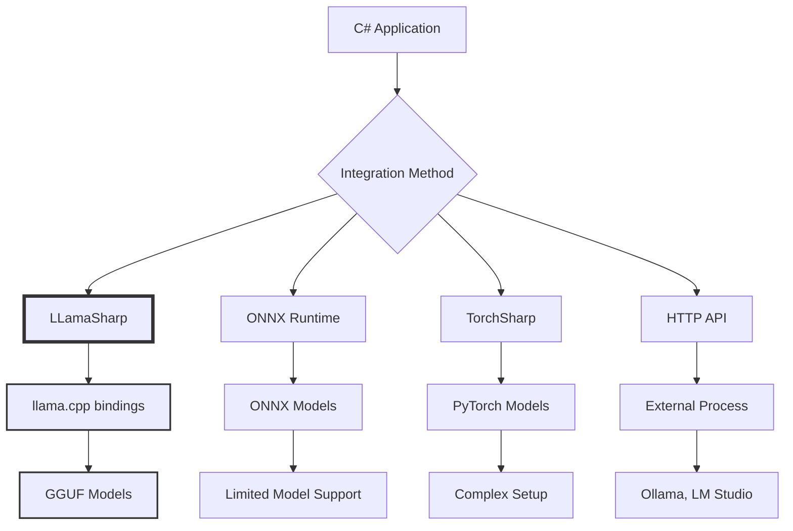
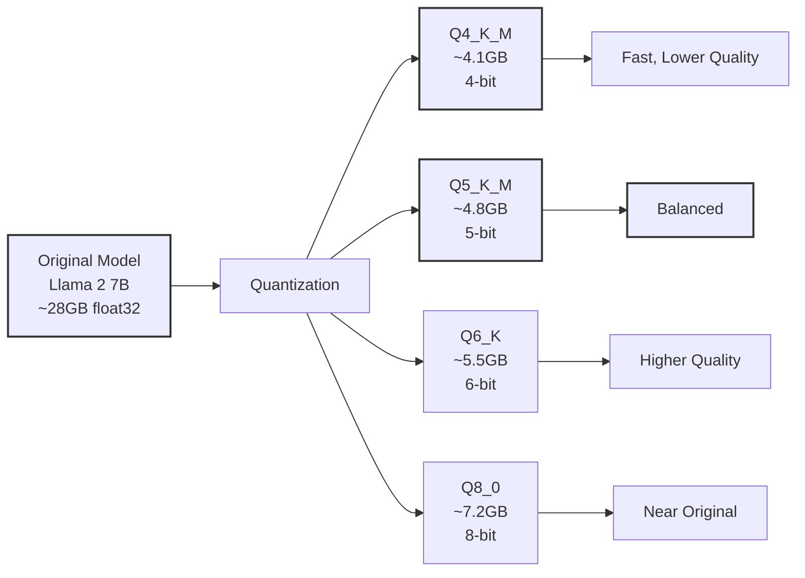

# Building a "Lawyer GPT" for Your Blog - Part 6: Local LLM Integration

<!--category-- AI, LLM, LLamaSharp, GGUF, C#, AI-Article, mostlylucid.blogllm -->
<datetime class="hidden">1973-02-08T22:00</datetime>

## Introduction

Welcome to Part 6! We've built the complete infrastructure - ingestion pipeline ([Part 4](/blog/building-a-lawyer-gpt-for-your-blog-part4)), Windows client ([Part 5](/blog/building-a-lawyer-gpt-for-your-blog-part5)), embeddings and vector search ([Part 3](/blog/building-a-lawyer-gpt-for-your-blog-part3)), and GPU setup ([Part 2](/blog/building-a-lawyer-gpt-for-your-blog-part2)). Now comes the exciting part: integrating a local LLM to actually generate writing suggestions.

> NOTE: This is part of my experiments with AI (assisted drafting) + my own editing. Same voice, same pragmatism; just faster fingers.

This is where we finally make the "AI" part of "AI writing assistant" work. We'll run large language models locally on your A4000 GPU, generating context-aware suggestions based on your past blog posts.

[TOC]

## Why Local LLM?

Before diving in, let's understand why we're running models locally instead of using OpenAI's API.

### Local vs API Comparison

| Aspect | Local LLM | API (OpenAI, etc.) |
|--------|-----------|-------------------|
| **Privacy** | ✅ Complete | ❌ Data sent to third party |
| **Cost** | ✅ Free after setup | ❌ Per-token pricing |
| **Latency** | ✅ <1 second | ⚠️ Network dependent |
| **Customization** | ✅ Full control | ❌ Limited |
| **Model Choice** | ✅ Any GGUF model | ❌ Provider's models only |
| **Offline** | ✅ Works offline | ❌ Requires internet |
| **Setup** | ❌ Complex | ✅ Simple |

For a writing assistant, privacy and cost matter. We don't want blog drafts sent to external APIs, and per-token pricing adds up fast for a daily writing tool.

## LLM Integration Options for C#

There are several ways to run LLMs in C#:



**My choice: LLamaSharp**

Why?
- Native C# bindings for llama.cpp (fastest inference library)
- Supports GGUF format (modern, quantized models)
- CUDA acceleration built-in
- Active development and great community
- Works with Llama, Mistral, Phi, Gemma, and more

## Understanding Model Formats & Quantization

### GGUF Format

[GGUF](https://github.com/ggerganov/ggml/blob/master/docs/gguf.md) (GPT-Generated Unified Format) is the standard for running LLMs efficiently.



**Quantization explained**:
- Original model: 32-bit floats (very large, very accurate)
- Q4: 4-bit integers (75% smaller, minimal quality loss)
- Q5/Q6: Sweet spot for most use cases
- Q8: Near-original quality, still 4x smaller

### Model Selection by Hardware

| Model | Size (Q4_K_M) | VRAM Usage | Fits 8GB? | Fits 12GB? | Fits 16GB? | Quality |
|-------|---------------|------------|-----------|------------|------------|---------|
| **Phi-3 Mini (3.8B)** | 2.3GB | ~4GB | ✅ Easy | ✅ Easy | ✅ Easy | ⭐⭐⭐ Good |
| **Llama 2 7B** | 4.1GB | ~6GB | ✅ Tight | ✅ Good | ✅ Easy | ⭐⭐⭐ Good |
| **Mistral 7B** | 4.1GB | ~6GB | ✅ Tight | ✅ Good | ✅ Easy | ⭐⭐⭐⭐ Better |
| **Gemma 7B** | 4.1GB | ~6GB | ✅ Tight | ✅ Good | ✅ Easy | ⭐⭐⭐⭐ Better |
| **Llama 3 8B** | 4.7GB | ~7GB | ⚠️ Very Tight | ✅ Good | ✅ Easy | ⭐⭐⭐⭐⭐ Best |
| **Llama 2 13B** | 7.4GB | ~10GB | ❌ No | ⚠️ Tight | ✅ Good | ⭐⭐⭐⭐ Better |

**Recommendations by GPU:**
- **8GB VRAM**: Start with **Mistral 7B** or **Phi-3 Mini** (safest)
- **12GB VRAM**: **Llama 3 8B** (best quality) or **Mistral 7B** (faster)
- **16GB VRAM (my setup)**: **Llama 3 8B** or try **13B models**
- **CPU-only**: Any model works, just much slower (start with Phi-3 Mini for speed)

**My recommendation**: **[Mistral 7B](https://mistral.ai/)** (latest version) or **[Llama 3](https://ai.meta.com/llama/)** 8B
- Excellent quality for technical writing
- Works across all GPU sizes
- Fast enough for interactive use
- Good at following instructions

## Downloading Models

Models are distributed on Hugging Face. We'll use quantized GGUF versions.

### Finding GGUF Models

1. Go to [Hugging Face](https://huggingface.co/models)
2. Search: `"mistral 7b gguf"`
3. Look for TheBloke's quantizations (most popular)

**Direct links** (TheBloke's quantizations):
- [Mistral-7B-Instruct-v0.2-GGUF](https://huggingface.co/TheBloke/Mistral-7B-Instruct-v0.2-GGUF)
- [Llama-2-7B-Chat-GGUF](https://huggingface.co/TheBloke/Llama-2-7B-Chat-GGUF)
- [Llama-3-8B-Instruct-GGUF](https://huggingface.co/QuantFactory/Meta-Llama-3-8B-Instruct-GGUF)

### Download Specific Quantization

```bash
# Install huggingface-cli
pip install huggingface-hub

# Download Mistral 7B Q5_K_M (recommended)
huggingface-cli download TheBloke/Mistral-7B-Instruct-v0.2-GGUF \
    mistral-7b-instruct-v0.2.Q5_K_M.gguf \
    --local-dir C:\models\mistral-7b \
    --local-dir-use-symlinks False
```

Or download manually:
1. Click on "Files and versions" tab
2. Find `mistral-7b-instruct-v0.2.Q5_K_M.gguf` (~4.8GB)
3. Click download
4. Save to `C:\models\mistral-7b\`

## LLamaSharp Setup

### Install NuGet Package

```bash
cd Mostlylucid.BlogLLM.Core
dotnet add package LLamaSharp  # Latest version
dotnet add package LLamaSharp.Backend.Cuda12  # Latest, matching CUDA version
```

**Why two packages?**
- `[LLamaSharp](https://github.com/SciSharp/LLamaSharp)` - Core library
- `LLamaSharp.Backend.Cuda12` - [CUDA](https://developer.nvidia.com/cuda-toolkit) 12 binaries for GPU acceleration

### Verify CUDA Backend

LLamaSharp will automatically detect CUDA if installed correctly.

```csharp
using LLama;
using LLama.Common;

// Check if CUDA is available
bool cudaAvailable = NativeLibraryConfig.Instance.CudaEnabled;
Console.WriteLine($"CUDA Available: {cudaAvailable}");
```

If `false`, check:
1. CUDA 12.x installed (Part 2)
2. `LLamaSharp.Backend.Cuda12` package installed
3. PATH includes CUDA bin directory

## Building the LLM Service

### Model Parameters

```csharp
using LLama;
using LLama.Common;

namespace Mostlylucid.BlogLLM.Core.Services
{
    public class ModelParameters
    {
        public string ModelPath { get; set; } = string.Empty;
        public int ContextSize { get; set; } = 4096;  // Context window
        public int GpuLayerCount { get; set; } = 35;  // Layers on GPU (35 = all for 7B)
        public int Seed { get; set; } = 1337;  // For reproducibility
        public float Temperature { get; set; } = 0.7f;  // Creativity (0.0 = deterministic, 1.0 = creative)
        public float TopP { get; set; } = 0.9f;  // Nucleus sampling
        public int MaxTokens { get; set; } = 500;  // Max generation length
    }
}
```

**Parameter explanations**:

- **ContextSize**: How much text the model can "see" at once
  - 4096 tokens ≈ 3000 words
  - Larger = more context but slower and more VRAM

- **GpuLayerCount**: How many transformer layers run on GPU
  - 7B models have ~32 layers
  - 35 = put everything on GPU (fastest)
  - Lower values = use less VRAM but slower

- **Temperature**: Controls randomness
  - 0.0 = always pick most likely token (boring, repetitive)
  - 0.7 = good balance (our default)
  - 1.0+ = very creative (can be nonsensical)

- **TopP**: Nucleus sampling
  - 0.9 = consider tokens that make up 90% of probability mass
  - Prevents sampling from very unlikely tokens

### LLM Service Implementation

```csharp
using LLama;
using LLama.Common;
using Microsoft.Extensions.Logging;

namespace Mostlylucid.BlogLLM.Core.Services
{
    public interface ILlmService
    {
        Task<string> GenerateAsync(string prompt, CancellationToken cancellationToken = default);
        Task<string> GenerateWithContextAsync(string prompt, List<string> contextChunks, CancellationToken cancellationToken = default);
    }

    public class LlmService : ILlmService, IDisposable
    {
        private readonly LLamaWeights _model;
        private readonly LLamaContext _context;
        private readonly ILogger<LlmService> _logger;
        private readonly ModelParameters _parameters;

        public LlmService(ModelParameters parameters, ILogger<LlmService> logger)
        {
            _parameters = parameters;
            _logger = logger;

            _logger.LogInformation("Loading model from {ModelPath}", parameters.ModelPath);

            // Configure model parameters
            var modelParams = new ModelParams(parameters.ModelPath)
            {
                ContextSize = (uint)parameters.ContextSize,
                GpuLayerCount = parameters.GpuLayerCount,
                Seed = (uint)parameters.Seed,
                UseMemoryLock = true,  // Keep model in RAM
                UseMemorymap = true    // Memory-map the model file
            };

            // Load model
            _model = LLamaWeights.LoadFromFile(modelParams);
            _context = _model.CreateContext(modelParams);

            _logger.LogInformation("Model loaded successfully. VRAM used: ~{VRAM}GB",
                EstimateVRAMUsage(parameters.GpuLayerCount));
        }

        public async Task<string> GenerateAsync(string prompt, CancellationToken cancellationToken = default)
        {
            var executor = new InteractiveExecutor(_context);

            var inferenceParams = new InferenceParams
            {
                Temperature = _parameters.Temperature,
                TopP = _parameters.TopP,
                MaxTokens = _parameters.MaxTokens,
                AntiPrompts = new[] { "\n\nUser:", "###" }  // Stop generation at these
            };

            var result = new StringBuilder();

            _logger.LogInformation("Generating response for prompt: {Prompt}", TruncateForLog(prompt));

            await foreach (var token in executor.InferAsync(prompt, inferenceParams, cancellationToken))
            {
                result.Append(token);
            }

            var response = result.ToString().Trim();
            _logger.LogInformation("Generated {Tokens} tokens", CountTokens(response));

            return response;
        }

        public async Task<string> GenerateWithContextAsync(
            string prompt,
            List<string> contextChunks,
            CancellationToken cancellationToken = default)
        {
            // Build prompt with retrieved context
            var fullPrompt = BuildContextualPrompt(prompt, contextChunks);

            _logger.LogInformation("Context chunks: {Count}, Total prompt tokens: ~{Tokens}",
                contextChunks.Count, CountTokens(fullPrompt));

            return await GenerateAsync(fullPrompt, cancellationToken);
        }

        private string BuildContextualPrompt(string userPrompt, List<string> contextChunks)
        {
            var sb = new StringBuilder();

            sb.AppendLine("You are a helpful writing assistant for a technical blog.");
            sb.AppendLine("Use the following excerpts from past blog posts as context:");
            sb.AppendLine();

            for (int i = 0; i < contextChunks.Count; i++)
            {
                sb.AppendLine($"--- Context {i + 1} ---");
                sb.AppendLine(contextChunks[i]);
                sb.AppendLine();
            }

            sb.AppendLine("---");
            sb.AppendLine();
            sb.AppendLine("Based on the context above, help with the following:");
            sb.AppendLine(userPrompt);
            sb.AppendLine();
            sb.AppendLine("Response:");

            return sb.ToString();
        }

        private int CountTokens(string text)
        {
            // Rough estimate: 1 token ≈ 4 characters
            return text.Length / 4;
        }

        private string TruncateForLog(string text, int maxLength = 100)
        {
            if (text.Length <= maxLength) return text;
            return text.Substring(0, maxLength) + "...";
        }

        private double EstimateVRAMUsage(int gpuLayers)
        {
            // Rough estimate for 7B model
            return (gpuLayers / 35.0) * 6.0;  // ~6GB for full 7B model
        }

        public void Dispose()
        {
            _context?.Dispose();
            _model?.Dispose();
        }
    }
}
```

**How it works**:

1. **Model Loading**: Loads GGUF model into VRAM using specified parameters
2. **InteractiveExecutor**: LLamaSharp's execution mode for chat-like interactions
3. **InferAsync**: Streams tokens as they're generated (real-time output)
4. **Context Building**: Combines user prompt with retrieved blog chunks
5. **Anti-prompts**: Stops generation at certain strings (prevents rambling)

### Testing the Service

```csharp
using Microsoft.Extensions.Logging;

class Program
{
    static async Task Main(string[] args)
    {
        // Setup logging
        var loggerFactory = LoggerFactory.Create(builder => builder.AddConsole());
        var logger = loggerFactory.CreateLogger<LlmService>();

        // Configure model
        var parameters = new ModelParameters
        {
            ModelPath = @"C:\models\mistral-7b\mistral-7b-instruct-v0.2.Q5_K_M.gguf",
            ContextSize = 4096,
            GpuLayerCount = 35,
            Temperature = 0.7f,
            MaxTokens = 200
        };

        // Create service
        using var llmService = new LlmService(parameters, logger);

        // Test simple generation
        Console.WriteLine("=== Test 1: Simple Generation ===\n");
        var response1 = await llmService.GenerateAsync(
            "Explain what Docker Compose is in 2-3 sentences."
        );
        Console.WriteLine(response1);
        Console.WriteLine("\n");

        // Test with context
        Console.WriteLine("=== Test 2: Generation with Context ===\n");
        var context = new List<string>
        {
            "Docker Compose is a tool for defining and running multi-container Docker applications. With Compose, you use a YAML file to configure your application's services.",
            "In development, Docker Compose makes it easy to spin up all dependencies (databases, caches, etc.) with one command: docker-compose up."
        };

        var response2 = await llmService.GenerateWithContextAsync(
            "Write an introduction paragraph for a blog post about using Docker Compose for development dependencies.",
            context
        );
        Console.WriteLine(response2);
    }
}
```

**Expected output**:
```
=== Test 1: Simple Generation ===

Docker Compose is a tool that allows you to define and run multi-container Docker applications using a simple YAML configuration file. It simplifies the process of managing multiple containers, networking, and volumes, making it ideal for development environments.

=== Test 2: Generation with Context ===

If you've ever found yourself juggling multiple terminal windows to start databases, caches, and other services for local development, Docker Compose is about to become your new best friend. This powerful tool lets you define your entire development environment in a single YAML file and spin everything up with one command. In this post, we'll explore how to leverage Docker Compose to manage all your development dependencies, making your local setup reproducible, shareable, and incredibly easy to manage.
```

Amazing! The model is working and generating coherent, context-aware text.

## Integrating with Suggestions Panel

Now let's integrate LLM generation into our Windows client from Part 5.

### Update SuggestionService

```csharp
namespace Mostlylucid.BlogLLM.Client.Services
{
    public class SuggestionService : ISuggestionService
    {
        private readonly BatchEmbeddingService _embeddingService;
        private readonly QdrantVectorStore _vectorStore;
        private readonly ILlmService _llmService;  // NEW

        public SuggestionService(
            BatchEmbeddingService embeddingService,
            QdrantVectorStore vectorStore,
            ILlmService llmService)  // NEW
        {
            _embeddingService = embeddingService;
            _vectorStore = vectorStore;
            _llmService = llmService;
        }

        public async Task<string> GenerateAiSuggestionAsync(
            string currentText,
            List<SimilarPost> context)
        {
            // Extract text from similar posts
            var contextChunks = context
                .Take(3)  // Top 3 most similar
                .Select(p => p.FullText)
                .ToList();

            // Determine what type of suggestion to generate
            var prompt = DeterminePromptType(currentText);

            // Generate suggestion
            var suggestion = await _llmService.GenerateWithContextAsync(
                prompt,
                contextChunks
            );

            return suggestion;
        }

        private string DeterminePromptType(string currentText)
        {
            // Analyze what user is writing
            var lines = currentText.Split('\n');
            var lastLine = lines.LastOrDefault(l => !string.IsNullOrWhiteSpace(l)) ?? "";

            // Is user starting a new section?
            if (lastLine.StartsWith("## "))
            {
                return "Suggest 3-5 bullet points for what this section could cover.";
            }

            // Is user writing code?
            if (lastLine.Contains("```"))
            {
                return "Suggest relevant code examples that might be useful here.";
            }

            // Is user writing an introduction?
            if (currentText.Length < 500 && currentText.Contains("## Introduction"))
            {
                return "Suggest 2-3 sentences to continue this introduction based on similar posts.";
            }

            // Default: continue current thought
            return "Suggest 1-2 sentences to continue the current paragraph in a natural way.";
        }
    }
}
```

### Update SuggestionsViewModel

```csharp
public partial class SuggestionsViewModel : ViewModelBase
{
    [RelayCommand]
    private async Task RegenerateSuggestion()
    {
        IsGenerating = true;
        AiSuggestion = "Generating...";

        try
        {
            var currentText = GetCurrentEditorText();  // From messaging
            var suggestion = await _suggestionService.GenerateAiSuggestionAsync(
                currentText,
                SimilarPosts.ToList()
            );

            AiSuggestion = suggestion;
        }
        catch (Exception ex)
        {
            AiSuggestion = $"Error: {ex.Message}";
        }
        finally
        {
            IsGenerating = false;
        }
    }
}
```

## Performance Optimization

### Model Caching

Keep the model loaded between requests:

```csharp
public class LlmServiceFactory
{
    private static LlmService? _instance;
    private static readonly object _lock = new();

    public static LlmService GetInstance(ModelParameters parameters, ILogger<LlmService> logger)
    {
        if (_instance == null)
        {
            lock (_lock)
            {
                if (_instance == null)
                {
                    _instance = new LlmService(parameters, logger);
                }
            }
        }

        return _instance;
    }
}
```

### KV Cache Reuse

LLamaSharp supports KV cache reuse for faster subsequent generations:

```csharp
public class StatefulLlmService
{
    private readonly InferenceParams _defaultParams;
    private string _cachedPromptPrefix = string.Empty;

    public async Task<string> GenerateWithPrefixAsync(string prefix, string newPrompt)
    {
        // If prefix matches cached, reuse KV cache
        if (prefix == _cachedPromptPrefix)
        {
            // Only process new tokens
            return await GenerateAsync(newPrompt);
        }

        // Process entire prompt and cache
        _cachedPromptPrefix = prefix;
        return await GenerateAsync(prefix + newPrompt);
    }
}
```

This is particularly useful for our use case - the context chunks stay the same, only the user's question changes.

### Batching

For multiple suggestions, batch them:

```csharp
public async Task<List<string>> GenerateBatchAsync(List<string> prompts)
{
    var results = new List<string>();

    foreach (var prompt in prompts)
    {
        // With KV cache reuse, subsequent prompts are faster
        results.Add(await GenerateAsync(prompt));
    }

    return results;
}
```

## Prompt Engineering for Writing Assistance

Good prompts = good output. Here are templates for different scenarios:

### Continue Writing

```csharp
private string PromptContinueWriting(string currentText, List<string> context)
{
    return $@"You are a technical blog writing assistant.

Here are excerpts from similar blog posts:
{string.Join("\n\n", context.Select((c, i) => $"--- Post {i + 1} ---\n{c}"))}

Current draft:
{currentText}

Task: Suggest 2-3 sentences to naturally continue the current paragraph.
Keep the same technical depth and casual, pragmatic tone.

Suggestion:";
}
```

### Suggest Section Structure

```csharp
private string PromptSectionStructure(string sectionTitle, List<string> context)
{
    return $@"You are a technical blog writing assistant.

Similar sections from past posts:
{string.Join("\n\n", context)}

New section: {sectionTitle}

Task: Suggest 4-6 bullet points for what this section should cover.
Format as a markdown list.

Bullets:";
}
```

### Code Example

```csharp
private string PromptCodeExample(string description, List<string> context)
{
    return $@"You are a C# coding assistant.

Relevant code from past posts:
{string.Join("\n\n", context)}

Task: {description}

Provide a clean, well-commented C# code example.

Code:";
}
```

## Memory Management

With large models, memory management is crucial.

### Monitor VRAM Usage

```csharp
public class VramMonitor
{
    [DllImport("nvml.dll")]
    private static extern int nvmlDeviceGetMemoryInfo(IntPtr device, ref NvmlMemory memory);

    [StructLayout(LayoutKind.Sequential)]
    public struct NvmlMemory
    {
        public ulong Total;
        public ulong Free;
        public ulong Used;
    }

    public static (ulong used, ulong total) GetVramUsage()
    {
        // Simplified - actual implementation needs proper NVML initialization
        var memory = new NvmlMemory();
        // nvmlDeviceGetMemoryInfo(device, ref memory);

        return (memory.Used / 1024 / 1024, memory.Total / 1024 / 1024);  // Convert to MB
    }
}
```

### Unload Model When Inactive

```csharp
public class LlmServiceWithUnload : IDisposable
{
    private LlmService? _service;
    private readonly Timer _unloadTimer;
    private DateTime _lastUsed;

    public LlmServiceWithUnload()
    {
        _unloadTimer = new Timer(CheckForUnload, null, TimeSpan.FromMinutes(1), TimeSpan.FromMinutes(1));
    }

    private void CheckForUnload(object? state)
    {
        if (_service != null && (DateTime.Now - _lastUsed) > TimeSpan.FromMinutes(10))
        {
            _service.Dispose();
            _service = null;
            GC.Collect();
            Console.WriteLine("Model unloaded due to inactivity");
        }
    }

    public async Task<string> GenerateAsync(string prompt)
    {
        _lastUsed = DateTime.Now;

        if (_service == null)
        {
            // Reload model
            _service = CreateService();
        }

        return await _service.GenerateAsync(prompt);
    }
}
```

## Error Handling

LLMs can fail in unexpected ways. Handle gracefully:

```csharp
public async Task<string> GenerateWithRetryAsync(string prompt, int maxRetries = 3)
{
    for (int i = 0; i < maxRetries; i++)
    {
        try
        {
            return await GenerateAsync(prompt);
        }
        catch (OutOfMemoryException)
        {
            _logger.LogWarning("OOM error, reducing max tokens");
            _parameters.MaxTokens = Math.Max(100, _parameters.MaxTokens / 2);
        }
        catch (Exception ex)
        {
            _logger.LogError(ex, "Generation failed, attempt {Attempt}/{Max}", i + 1, maxRetries);

            if (i == maxRetries - 1) throw;

            await Task.Delay(1000 * (i + 1));  // Exponential backoff
        }
    }

    throw new Exception("Generation failed after retries");
}
```

## Summary

We've successfully integrated local LLM inference:

1. ✅ Chose [LLamaSharp](https://github.com/SciSharp/LLamaSharp) for C# integration
2. ✅ Understood [GGUF format](https://github.com/ggerganov/ggml/blob/master/docs/gguf.md) and quantization
3. ✅ Selected appropriate model ([Mistral 7B](https://mistral.ai/) / [Llama 3](https://ai.meta.com/llama/) 8B)
4. ✅ Implemented LlmService with CUDA acceleration
5. ✅ Integrated with Windows client for suggestions
6. ✅ Implemented prompt engineering for writing tasks
7. ✅ Added performance optimizations (caching, batching)
8. ✅ Handled memory management and errors

## What's Next?

In **[Part 7: Content Generation & Prompt Engineering](/blog/building-a-lawyer-gpt-for-your-blog-part7)**, we'll focus on the complete content generation pipeline:

- Advanced prompt engineering techniques
- Multi-turn conversation for iterative refinement
- Context window management strategies
- Quality evaluation and filtering
- Style consistency enforcement
- Handling code block generation
- Real-world usage patterns

We'll make the system actually useful for daily blog writing!

## Series Navigation

- [Part 1: Introduction & Architecture](/blog/building-a-lawyer-gpt-for-your-blog-part1)
- [Part 2: GPU Setup & CUDA in C#](/blog/building-a-lawyer-gpt-for-your-blog-part2)
- [Part 3: Understanding Embeddings & Vector Databases](/blog/building-a-lawyer-gpt-for-your-blog-part3)
- [Part 4: Building the Ingestion Pipeline](/blog/building-a-lawyer-gpt-for-your-blog-part4)
- [Part 5: The Windows Client](/blog/building-a-lawyer-gpt-for-your-blog-part5)
- **Part 6: Local LLM Integration** (this post)
- [Part 7: Content Generation & Prompt Engineering](/blog/building-a-lawyer-gpt-for-your-blog-part7)
- [Part 8: Advanced Features & Production Deployment](/blog/building-a-lawyer-gpt-for-your-blog-part8)

## Resources

- [LLamaSharp Documentation](https://scisharp.github.io/LLamaSharp/)
- [GGUF Format Specification](https://github.com/ggerganov/ggml/blob/master/docs/gguf.md)
- [TheBloke's Model Collection](https://huggingface.co/TheBloke)
- [llama.cpp GitHub](https://github.com/ggerganov/llama.cpp)

See you in [Part 7](/blog/building-a-lawyer-gpt-for-your-blog-part7)!
