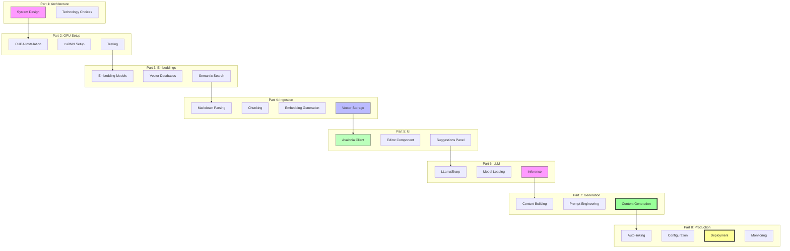

# Building a "Lawyer GPT" for Your Blog - Part 8: Advanced Features & Production Deployment

<!--category-- AI, LLM, Deployment, Production, C#, AI-Article, mostlylucid.blogllm -->
<datetime class="hidden">1973-02-08T23:30</datetime>

## Introduction

Welcome to Part 8 - the final part! We've built a complete [RAG](https://www.anthropic.com/index/contextual-retrieval)-based writing assistant from scratch. Now let's add the polish that makes it production-ready: auto-linking, deployment, configuration management, and real-world usage patterns.

> NOTE: This is part of my experiments with AI (assisted drafting) + my own editing. Same voice, same pragmatism; just faster fingers.

This is where we take a working prototype and turn it into something you'd actually use daily. Let's finish strong!

[TOC]

## Auto-Linking to Related Posts

One of the most valuable features - automatically suggesting links to related posts.

### Link Detection Service

```csharp
namespace Mostlylucid.BlogLLM.Core.Services
{
    public interface ILinkSuggestionService
    {
        Task<List<LinkSuggestion>> SuggestLinksAsync(string text);
        string InsertLinks(string text, List<LinkSuggestion> acceptedLinks);
    }

    public class LinkSuggestion
    {
        public string Phrase { get; set; } = string.Empty;
        public string TargetSlug { get; set; } = string.Empty;
        public string TargetTitle { get; set; } = string.Empty;
        public float RelevanceScore { get; set; }
        public int Position { get; set; }
    }

    public class LinkSuggestionService : ILinkSuggestionService
    {
        private readonly BatchEmbeddingService _embedder;
        private readonly QdrantVectorStore _vectorStore;
        private readonly ILogger<LinkSuggestionService> _logger;

        public LinkSuggestionService(
            BatchEmbeddingService embedder,
            QdrantVectorStore vectorStore,
            ILogger<LinkSuggestionService> logger)
        {
            _embedder = embedder;
            _vectorStore = vectorStore;
            _logger = logger;
        }

        public async Task<List<LinkSuggestion>> SuggestLinksAsync(string text)
        {
            var suggestions = new List<LinkSuggestion>();

            // Extract key phrases (noun phrases, technical terms)
            var phrases = ExtractKeyPhrases(text);

            _logger.LogInformation("Extracted {Count} key phrases for linking", phrases.Count);

            foreach (var phrase in phrases)
            {
                // Search for related posts
                var embedding = _embedder.GenerateEmbedding(phrase.Text);
                var results = await _vectorStore.SearchAsync(
                    queryEmbedding: embedding,
                    limit: 3,
                    scoreThreshold: 0.75f  // High threshold for links
                );

                if (results.Any())
                {
                    var topResult = results.First();

                    // Don't link to current post
                    if (!IsCurrentPost(topResult.BlogPostSlug, text))
                    {
                        suggestions.Add(new LinkSuggestion
                        {
                            Phrase = phrase.Text,
                            TargetSlug = topResult.BlogPostSlug,
                            TargetTitle = topResult.BlogPostTitle,
                            RelevanceScore = topResult.Score,
                            Position = phrase.Position
                        });

                        _logger.LogDebug("Link suggestion: '{Phrase}' -> '{Target}' (score: {Score:F3})",
                            phrase.Text, topResult.BlogPostTitle, topResult.Score);
                    }
                }
            }

            // Remove duplicates and low-value links
            return DeduplicateAndFilter(suggestions);
        }

        public string InsertLinks(string text, List<LinkSuggestion> acceptedLinks)
        {
            // Sort by position (descending) to maintain positions as we insert
            var sorted = acceptedLinks.OrderByDescending(l => l.Position).ToList();

            foreach (var link in sorted)
            {
                var before = text.Substring(0, link.Position);
                var phrase = link.Phrase;
                var after = text.Substring(link.Position + phrase.Length);

                // Check if already a link
                if (IsAlreadyLinked(before, phrase, after))
                {
                    continue;
                }

                var markdownLink = $"[{phrase}](/blog/{link.TargetSlug})";
                text = before + markdownLink + after;

                _logger.LogInformation("Inserted link: {Phrase} -> /blog/{Slug}",
                    phrase, link.TargetSlug);
            }

            return text;
        }

        private List<KeyPhrase> ExtractKeyPhrases(string text)
        {
            var phrases = new List<KeyPhrase>();

            // Simple regex-based extraction
            // In production, use NLP library like Stanford.NLP or Azure Cognitive Services

            // Technical terms (CamelCase, dot notation)
            var technicalTerms = Regex.Matches(text,
                @"\b([A-Z][a-z]+([A-Z][a-z]+)+|[A-Z]\w+\.\w+)\b");

            foreach (Match match in technicalTerms)
            {
                phrases.Add(new KeyPhrase
                {
                    Text = match.Value,
                    Position = match.Index
                });
            }

            // Multi-word phrases in quotes or code backticks
            var quotedPhrases = Regex.Matches(text, @"[`""]([^`""]{10,50})[`""]");

            foreach (Match match in quotedPhrases)
            {
                phrases.Add(new KeyPhrase
                {
                    Text = match.Groups[1].Value,
                    Position = match.Index
                });
            }

            return phrases;
        }

        private List<LinkSuggestion> DeduplicateAndFilter(List<LinkSuggestion> suggestions)
        {
            // Remove duplicate phrases (keep highest score)
            var deduped = suggestions
                .GroupBy(s => s.Phrase.ToLowerInvariant())
                .Select(g => g.OrderByDescending(s => s.RelevanceScore).First())
                .ToList();

            // Limit links per post
            return deduped
                .OrderByDescending(s => s.RelevanceScore)
                .Take(5)  // Max 5 auto-links per draft
                .ToList();
        }

        private bool IsCurrentPost(string slug, string text)
        {
            // Simple heuristic - check if slug appears in text
            // In production, track actual post being edited
            return text.ToLowerInvariant().Contains(slug.ToLowerInvariant());
        }

        private bool IsAlreadyLinked(string before, string phrase, string after)
        {
            // Check if phrase is already inside markdown link
            var lookback = before.TakeLast(20).ToString() ?? "";
            var lookahead = new string(after.Take(20).ToArray());

            return lookback.Contains("[") || lookahead.StartsWith("]");
        }
    }

    public class KeyPhrase
    {
        public string Text { get; set; } = string.Empty;
        public int Position { get; set; }
    }
}
```

### UI Integration

```csharp
[RelayCommand]
private async Task SuggestLinks()
{
    IsProcessing = true;
    StatusMessage = "Analyzing text for link opportunities...";

    try
    {
        var suggestions = await _linkService.SuggestLinksAsync(EditorText);

        // Show suggestions in UI
        LinkSuggestions.Clear();
        foreach (var suggestion in suggestions)
        {
            LinkSuggestions.Add(new LinkSuggestionViewModel(suggestion));
        }

        StatusMessage = $"Found {suggestions.Count} link opportunities";
    }
    finally
    {
        IsProcessing = false;
    }
}

[RelayCommand]
private void AcceptAllLinks()
{
    var acceptedLinks = LinkSuggestions
        .Where(vm => vm.IsAccepted)
        .Select(vm => vm.Suggestion)
        .ToList();

    EditorText = _linkService.InsertLinks(EditorText, acceptedLinks);

    StatusMessage = $"Inserted {acceptedLinks.Count} links";
}
```

## Configuration Management

Production-ready configuration system:

```csharp
namespace Mostlylucid.BlogLLM.Configuration
{
    public class BlogLLMConfig
    {
        public EmbeddingConfig Embedding { get; set; } = new();
        public VectorStoreConfig VectorStore { get; set; } = new();
        public LLMConfig LLM { get; set; } = new();
        public UIConfig UI { get; set; } = new();
    }

    public class EmbeddingConfig
    {
        public string ModelPath { get; set; } = string.Empty;
        public string TokenizerPath { get; set; } = string.Empty;
        public bool UseGpu { get; set; } = true;
        public int BatchSize { get; set; } = 32;
    }

    public class VectorStoreConfig
    {
        public string Type { get; set; } = "Qdrant";  // or "pgvector"
        public string Host { get; set; } = "localhost";
        public int Port { get; set; } = 6334;
        public string CollectionName { get; set; } = "blog_embeddings";
    }

    public class LLMConfig
    {
        public string ModelPath { get; set; } = string.Empty;
        public int ContextSize { get; set; } = 4096;
        public int GpuLayers { get; set; } = 35;
        public float DefaultTemperature { get; set; } = 0.7f;
        public int MaxTokens { get; set; } = 500;
        public bool EnableStreaming { get; set; } = true;
    }

    public class UIConfig
    {
        public int AutoSaveIntervalSeconds { get; set; } = 60;
        public bool EnableAutoLinking { get; set; } = true;
        public int SuggestionDebounceMs { get; set; } = 500;
        public int MaxRecentFiles { get; set; } = 10;
    }
}
```

### appsettings.json

```json
{
  "BlogLLM": {
    "Embedding": {
      "ModelPath": "C:\\models\\bge-base-en-onnx\\model.onnx",
      "TokenizerPath": "C:\\models\\bge-base-en-onnx\\tokenizer.json",
      "UseGpu": true,
      "BatchSize": 32
    },
    "VectorStore": {
      "Type": "Qdrant",
      "Host": "localhost",
      "Port": 6334,
      "CollectionName": "blog_embeddings"
    },
    "LLM": {
      "ModelPath": "C:\\models\\mistral-7b\\mistral-7b-instruct-v0.2.Q5_K_M.gguf",
      "ContextSize": 4096,
      "GpuLayers": 35,
      "DefaultTemperature": 0.7,
      "MaxTokens": 500,
      "EnableStreaming": true
    },
    "UI": {
      "AutoSaveIntervalSeconds": 60,
      "EnableAutoLinking": true,
      "SuggestionDebounceMs": 500,
      "MaxRecentFiles": 10
    }
  },
  "Logging": {
    "LogLevel": {
      "Default": "Information",
      "Mostlylucid.BlogLLM": "Debug"
    }
  }
}
```

### Load Configuration

```csharp
public class App : Application
{
    public override void OnFrameworkInitializationCompleted()
    {
        var services = new ServiceCollection();

        // Load configuration
        var configuration = new ConfigurationBuilder()
            .SetBasePath(Directory.GetCurrentDirectory())
            .AddJsonFile("appsettings.json", optional: false)
            .AddJsonFile($"appsettings.{Environment.GetEnvironmentVariable("ENVIRONMENT")}.json", optional: true)
            .AddEnvironmentVariables()
            .Build();

        // Bind configuration
        var config = new BlogLLMConfig();
        configuration.GetSection("BlogLLM").Bind(config);

        // Register as singleton
        services.AddSingleton(config);

        // Register services using config
        services.AddSingleton(sp => new BatchEmbeddingService(
            config.Embedding.ModelPath,
            config.Embedding.TokenizerPath,
            config.Embedding.UseGpu
        ));

        // ... rest of service registration
    }
}
```

## Deployment Strategy

### Standalone Executable

```bash
# Publish as single-file executable
dotnet publish Mostlylucid.BlogLLM.Client/Mostlylucid.BlogLLM.Client.csproj \
    -c Release \
    -r win-x64 \
    --self-contained true \
    -p:PublishSingleFile=true \
    -p:IncludeNativeLibrariesForSelfExtract=true \
    -o ./publish/win-x64

# Result: Single .exe file with all dependencies
```

### Installer with WiX

```xml
<?xml version="1.0" encoding="UTF-8"?>
<!-- Using WiX Toolset: https://wixtoolset.org/ -->
<Wix xmlns="http://schemas.microsoft.com/wix/2006/wi">
    <Product Id="*" Name="Blog Writing Assistant" Language="1033"
             Version="1.0.0.0" Manufacturer="YourName" UpgradeCode="PUT-GUID-HERE">

        <Package InstallerVersion="200" Compressed="yes" InstallScope="perMachine" />

        <MediaTemplate EmbedCab="yes" />

        <Directory Id="TARGETDIR" Name="SourceDir">
            <Directory Id="ProgramFiles64Folder">
                <Directory Id="INSTALLFOLDER" Name="BlogLLM" />
            </Directory>
            <Directory Id="ProgramMenuFolder">
                <Directory Id="ApplicationProgramsFolder" Name="Blog Writing Assistant"/>
            </Directory>
        </Directory>

        <DirectoryRef Id="INSTALLFOLDER">
            <Component Id="MainExecutable" Guid="PUT-GUID-HERE">
                <File Id="BlogLLMExe" Source="$(var.PublishDir)\BlogLLM.exe" KeyPath="yes" />
            </Component>
            <Component Id="ConfigFile" Guid="PUT-GUID-HERE">
                <File Id="AppSettings" Source="$(var.PublishDir)\appsettings.json" />
            </Component>
        </DirectoryRef>

        <DirectoryRef Id="ApplicationProgramsFolder">
            <Component Id="ApplicationShortcut" Guid="PUT-GUID-HERE">
                <Shortcut Id="ApplicationStartMenuShortcut"
                         Name="Blog Writing Assistant"
                         Target="[INSTALLFOLDER]BlogLLM.exe"
                         WorkingDirectory="INSTALLFOLDER"/>
                <RemoveFolder Id="ApplicationProgramsFolder" On="uninstall"/>
                <RegistryValue Root="HKCU" Key="Software\BlogLLM" Name="installed" Type="integer" Value="1" KeyPath="yes"/>
            </Component>
        </DirectoryRef>

        <Feature Id="ProductFeature" Title="Blog Writing Assistant" Level="1">
            <ComponentRef Id="MainExecutable" />
            <ComponentRef Id="ConfigFile" />
            <ComponentRef Id="ApplicationShortcut" />
        </Feature>
    </Product>
</Wix>
```

### Model Download Script

```powershell
# download-models.ps1
param(
    [string]$ModelsPath = "C:\models"
)

Write-Host "Downloading models to $ModelsPath..." -ForegroundColor Green

# Create directories
New-Item -ItemType Directory -Force -Path "$ModelsPath\bge-base-en-onnx" | Out-Null
New-Item -ItemType Directory -Force -Path "$ModelsPath\mistral-7b" | Out-Null

# Install huggingface-cli if needed
$hfCli = Get-Command huggingface-cli -ErrorAction SilentlyContinue
if (-not $hfCli) {
    Write-Host "Installing huggingface-cli..." -ForegroundColor Yellow
    pip install huggingface-hub
}

# Download embedding model
Write-Host "Downloading BGE embedding model..." -ForegroundColor Green
huggingface-cli download BAAI/bge-base-en-v1.5-onnx `
    --local-dir "$ModelsPath\bge-base-en-onnx" `
    --local-dir-use-symlinks False

# Download LLM
Write-Host "Downloading Mistral 7B model..." -ForegroundColor Green
huggingface-cli download TheBloke/Mistral-7B-Instruct-v0.2-GGUF `
    mistral-7b-instruct-v0.2.Q5_K_M.gguf `
    --local-dir "$ModelsPath\mistral-7b" `
    --local-dir-use-symlinks False

Write-Host "Download complete!" -ForegroundColor Green
Write-Host "Update appsettings.json with these paths:"
Write-Host "  Embedding: $ModelsPath\bge-base-en-onnx\model.onnx"
Write-Host "  LLM: $ModelsPath\mistral-7b\mistral-7b-instruct-v0.2.Q5_K_M.gguf"
```

## Continuous Improvement

### Usage Tracking

```csharp
public class UsageTracker
{
    private readonly string _usageFilePath;

    public UsageTracker(string dataPath)
    {
        _usageFilePath = Path.Combine(dataPath, "usage.json");
    }

    public void TrackSuggestionAccepted(string suggestionType, int length)
    {
        var usage = LoadUsage();
        usage.SuggestionsAccepted++;
        usage.TotalCharactersGenerated += length;
        usage.LastUsed = DateTime.UtcNow;

        SaveUsage(usage);
    }

    public void TrackLinkInserted(string targetPost)
    {
        var usage = LoadUsage();
        usage.LinksInserted++;

        if (!usage.FrequentlyLinkedPosts.ContainsKey(targetPost))
        {
            usage.FrequentlyLinkedPosts[targetPost] = 0;
        }
        usage.FrequentlyLinkedPosts[targetPost]++;

        SaveUsage(usage);
    }

    public UsageStats GetStats()
    {
        return LoadUsage();
    }

    private UsageStats LoadUsage()
    {
        if (!File.Exists(_usageFilePath))
        {
            return new UsageStats();
        }

        var json = File.ReadAllText(_usageFilePath);
        return JsonSerializer.Deserialize<UsageStats>(json) ?? new UsageStats();
    }

    private void SaveUsage(UsageStats stats)
    {
        var json = JsonSerializer.Serialize(stats, new JsonSerializerOptions
        {
            WriteIndented = true
        });

        File.WriteAllText(_usageFilePath, json);
    }
}

public class UsageStats
{
    public int SuggestionsGenerated { get; set; }
    public int SuggestionsAccepted { get; set; }
    public int LinksInserted { get; set; }
    public int TotalCharactersGenerated { get; set; }
    public Dictionary<string, int> FrequentlyLinkedPosts { get; set; } = new();
    public DateTime LastUsed { get; set; }
    public DateTime FirstUsed { get; set; } = DateTime.UtcNow;
}
```

### Feedback Loop

```csharp
[RelayCommand]
private async Task ProvideFeedback(GenerationResult result, FeedbackType type)
{
    var feedback = new SuggestionFeedback
    {
        GeneratedText = result.GeneratedText,
        PromptType = result.PromptType,
        ContextTokens = result.ContextTokensUsed,
        FeedbackType = type,
        Timestamp = DateTime.UtcNow
    };

    await _feedbackService.RecordAsync(feedback);

    // Adjust parameters based on feedback
    if (type == FeedbackType.TooGeneric)
    {
        // Increase temperature for more creativity
        _config.LLM.DefaultTemperature = Math.Min(1.0f, _config.LLM.DefaultTemperature + 0.1f);
    }
    else if (type == FeedbackType.TooRambling)
    {
        // Decrease temperature for more focus
        _config.LLM.DefaultTemperature = Math.Max(0.3f, _config.LLM.DefaultTemperature - 0.1f);
    }
}

public enum FeedbackType
{
    Helpful,
    TooGeneric,
    TooRambling,
    WrongStyle,
    Perfect
}
```

## Real-World Usage Patterns

### Morning Routine

```csharp
// User opens app
// Loads yesterday's draft

[RelayCommand]
private async Task ContinueFromYesterday()
{
    // Load last saved draft
    var draft = await LoadLastDraft();
    EditorText = draft.Content;

    // Generate fresh suggestions based on overnight ingestion
    await RefreshSuggestions();
}
```

### Writing Flow

1. **Outlining**: Use "Suggest Structure" repeatedly to build outline
2. **Drafting**: Type introduction, let AI suggest continuations
3. **Code Examples**: Request code generation with context
4. **Linking**: Run auto-linker when draft is 80% complete
5. **Polish**: Use "Improve Section" on weaker parts

### Batch Processing

```csharp
[RelayCommand]
private async Task ProcessAllDrafts()
{
    var drafts = GetAllDraftFiles();

    foreach (var draft in drafts)
    {
        var content = await File.ReadAllTextAsync(draft);

        // Suggest links for each draft
        var links = await _linkService.SuggestLinksAsync(content);

        // Auto-accept high-confidence links
        var autoAccept = links.Where(l => l.RelevanceScore > 0.9f).ToList();

        var updated = _linkService.InsertLinks(content, autoAccept);
        await File.WriteAllTextAsync(draft, updated);

        _logger.LogInformation("Processed {Draft}: inserted {Count} links",
            Path.GetFileName(draft), autoAccept.Count);
    }
}
```

## Troubleshooting Guide

### Common Issues

**Issue: "CUDA out of memory"**
```
Solution: Reduce GpuLayers or ContextSize in config:
{
  "LLM": {
    "GpuLayers": 20,  // Lower from 35
    "ContextSize": 2048  // Lower from 4096
  }
}
```

**Issue: "Suggestions are too generic"**
```
Solution: Increase context tokens and adjust temperature:
{
  "LLM": {
    "DefaultTemperature": 0.8  // Higher = more creative
  }
}
And in code: request.MaxContextTokens = 3000  // More context
```

**Issue: "Generation is slow"**
```
Check:
1. Is model fully on GPU? (Check GpuLayers = 35)
2. Using Q5 or Q4 quantization? (Faster than Q8)
3. Is something else using GPU? (Check nvidia-smi)
```

**Issue: "Links are irrelevant"**
```
Solution: Increase scoreThreshold:
scoreThreshold: 0.85f  // Higher threshold = only very relevant links
```

## Future Enhancements

### Ideas for V2

1. **Multi-language support** - Extend beyond English
2. **Image suggestions** - Find relevant images from past posts
3. **SEO optimization** - Suggest meta descriptions, keywords
4. **Plagiarism detection** - Check against existing content
5. **Voice consistency** - Train on your writing style specifically
6. **Collaborative features** - Multi-author support
7. **Web version** - Blazor WebAssembly client
8. **Mobile app** - Avalonia works on iOS/Android!

### Research Directions

- Fine-tuning embedding model on your blog
- Using retrieval score as training signal
- Experimenting with larger models (13B, 30B) on cloud GPU
- Implementing multi-modal RAG (code + diagrams + text)

## The Complete Picture

Let's visualize everything we've built:



## Conclusion

We did it! Over 8 comprehensive parts, we've built a complete, production-ready writing assistant:

1. **Part 1**: Designed the architecture and chose technologies
2. **Part 2**: Set up CUDA and GPU acceleration
3. **Part 3**: Implemented embeddings and vector search
4. **Part 4**: Built the ingestion pipeline
5. **Part 5**: Created a beautiful Windows client
6. **Part 6**: Integrated local LLM inference
7. **Part 7**: Engineered sophisticated prompts
8. **Part 8**: Added polish and deployment

**What makes this special**:
- 100% local and private
- No API costs
- Fast GPU-accelerated inference
- Grounded in your actual content
- Production-ready code
- Cross-platform potential

**Real-world impact**:
- Faster blog writing
- Consistent style and voice
- Better internal linking
- Reuse of past content
- Lower barrier to publishing

This isn't just a tutorial project - it's a genuinely useful tool that helps you write better, faster, while maintaining consistency with your existing body of work.

Just like how lawyers use LLMs trained on case law to draft better briefs, you now have an AI assistant trained on your blog to help you write better posts.

## Thank You!

Thank you for following along through this entire series. I hope you've learned:
- How RAG systems work
- GPU-accelerated AI in C#
- Vector databases and embeddings
- Local LLM deployment
- Production app architecture

**Next steps**:
1. Clone the repo (coming soon!)
2. Download models
3. Run the ingestion pipeline
4. Start writing with AI assistance!

## Resources

### All Parts
- [Part 1: Introduction & Architecture](/blog/building-a-lawyer-gpt-for-your-blog-part1)
- [Part 2: GPU Setup & CUDA](/blog/building-a-lawyer-gpt-for-your-blog-part2)
- [Part 3: Embeddings & Vector Databases](/blog/building-a-lawyer-gpt-for-your-blog-part3)
- [Part 4: Ingestion Pipeline](/blog/building-a-lawyer-gpt-for-your-blog-part4)
- [Part 5: Windows Client](/blog/building-a-lawyer-gpt-for-your-blog-part5)
- [Part 6: Local LLM Integration](/blog/building-a-lawyer-gpt-for-your-blog-part6)
- [Part 7: Content Generation](/blog/building-a-lawyer-gpt-for-your-blog-part7)
- [Part 8: Production Deployment](/blog/building-a-lawyer-gpt-for-your-blog-part8)

### Series Complete!

- [Part 1: Introduction & Architecture](/blog/building-a-lawyer-gpt-for-your-blog-part1)
- [Part 2: GPU Setup & CUDA](/blog/building-a-lawyer-gpt-for-your-blog-part2)
- [Part 3: Embeddings & Vector Databases](/blog/building-a-lawyer-gpt-for-your-blog-part3)
- [Part 4: Ingestion Pipeline](/blog/building-a-lawyer-gpt-for-your-blog-part4)
- [Part 5: Windows Client](/blog/building-a-lawyer-gpt-for-your-blog-part5)
- [Part 6: Local LLM Integration](/blog/building-a-lawyer-gpt-for-your-blog-part6)
- [Part 7: Content Generation](/blog/building-a-lawyer-gpt-for-your-blog-part7)
- **Part 8: Production Deployment** (this post)

### Tools & Libraries
- [LLamaSharp](https://github.com/SciSharp/LLamaSharp)
- [Qdrant](https://qdrant.tech/)
- [Avalonia UI](https://avaloniaui.net/)
- [ONNX Runtime](https://onnxruntime.ai/)
- [WiX Toolset](https://wixtoolset.org/)

Happy writing with your new AI assistant! 🚀
