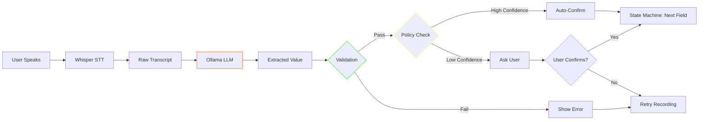
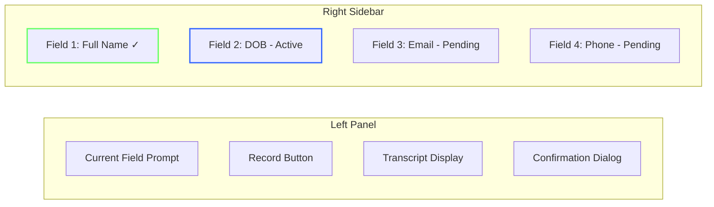

# Building Deterministic Voice Forms with Blazor and Local LLMs
## The Ten Commandments Way

<datetime class="hidden">2026-01-02T14:30</datetime>

<!--category-- ASP.NET, Blazor, AI, LLM, Whisper, Ollama -->

## Introduction

**In which we build a voice-to-form system that doesn't hand the keys to the AI kingdom**

Here's the thing about voice interfaces: everyone wants them, nobody trusts them. And they're right not to.

Most voice forms fail the moment the model mishears a date or decides to "helpfully" skip ahead. You say "May 12th 1984" and the LLM extracts "May 2014" and advances to the next field before you can correct it. Or worse: it hallucinates confidence and auto-submits your form with wrong data.

The moment you let an LLM "control" your form flow, you've introduced a non-deterministic black box into what should be a predictable user experience.

But what if we could have our cake and eat it too? Voice input for convenience, LLM for translation, but *deterministic code* for everything that actually matters?

That's what we're building today—a "Ten Commandments compliant" voice form system using Blazor Server, local Whisper for speech-to-text, and local Ollama for field extraction. No cloud dependencies. No unpredictable AI overlords. Just clean architecture.

[TOC]

## The Ten Commandments of Voice-Enabled Forms

Before we write any code, let's establish the rules:

1. **Speech is lossy input** — It's never the source of truth, just one way to populate fields
2. **LLM is a translator** — It extracts structured data from messy speech, nothing more
3. **The state machine owns form flow** — Deterministic code decides what field is next
4. **Confirmation is policy-driven** — Thresholds are declarative and enforced by code, not LLM judgment
5. **The user can always override** — Voice is convenience, not compulsion
6. **Everything runs locally** — No external API dependencies for core functionality
7. **Every interaction is logged** — Full audit trail for debugging, compliance, and replay when things go wrong
8. **Validation is type-based** — Standard validators, not LLM interpretation
9. **The form schema is declarative** — JSON defines the form structure, code interprets it
10. **Failure is graceful** — When speech recognition fails, the form still works

Here's how this looks in practice:



Notice what the LLM does: it translates. That's it. The state machine decides flow. Validation decides correctness. The policy check—not the LLM—decides whether to auto-confirm or ask the user.

## What This Doesn't Do

Let's be clear about scope:

- **No natural conversation** — This isn't a chatbot. One field at a time.
- **No adaptive questioning** — The form schema is static. The LLM doesn't improvise follow-ups.
- **No "assistant" personality** — The LLM extracts values, it doesn't make small talk.
- **No context across fields** — Each extraction is independent. The LLM doesn't remember your name when asking for email.

These constraints are features, not bugs. They make the system predictable, testable, and trustworthy.

## Project Structure

We're building a standalone Blazor Server app. Here's the architecture:

```
Mostlylucid.VoiceForm/
├── Config/
│   └── VoiceFormConfig.cs         # Configuration binding
├── Models/
│   ├── FormSchema/                # Form definitions
│   ├── State/                     # Session state
│   └── Extraction/                # LLM input/output
├── Services/
│   ├── Stt/                       # Speech-to-text (Whisper)
│   ├── Extraction/                # Field extraction (Ollama)
│   ├── Validation/                # Type-based validators
│   ├── StateMachine/              # Form flow control
│   └── Orchestration/             # Coordinates everything
├── Components/
│   └── Pages/                     # Blazor UI
└── wwwroot/js/
    └── audio-recorder.js          # Web Audio API capture
```

**Architectural note:** No service depends on another "downwards." The extractor doesn't know about the state machine. The validator doesn't know about the orchestrator. This makes each piece independently testable.

## Setting Up the Infrastructure

First, you'll need Whisper and Ollama running locally. Add these to your `devdeps-docker-compose.yml`:

```yaml
services:
  whisper:
    image: onerahmet/openai-whisper-asr-webservice:latest
    container_name: whisper-stt
    ports:
      - "9000:9000"
    environment:
      - ASR_MODEL=base.en
      - ASR_ENGINE=faster_whisper
    volumes:
      - whisper-models:/root/.cache/huggingface
    restart: unless-stopped

  ollama:
    image: ollama/ollama:latest
    container_name: ollama
    ports:
      - "11434:11434"
    volumes:
      - ollama-models:/root/.ollama
    restart: unless-stopped

volumes:
  whisper-models:
  ollama-models:
```

After spinning up, pull a model for Ollama:

```bash
docker exec -it ollama ollama pull llama3.2:3b
```

> **Why local?** Running everything locally isn't about cost—it's about testability, determinism, and data locality. Your CI pipeline can spin up the same containers. Your tests hit the same endpoints. No API rate limits, no network variability, no data leaving your machine.

**Note:** The `base.en` Whisper model is fast and accurate for English. For production, consider `small.en` or `medium.en` for better accuracy.

## The Form Schema: Declarative Form Definitions

Forms are defined in JSON. This is the single source of truth for what fields exist and how they behave:

```json
{
  "id": "customer-intake",
  "name": "Customer Intake Form",
  "fields": [
    {
      "id": "fullName",
      "label": "Full Name",
      "type": "Text",
      "prompt": "Please say your full name.",
      "required": true
    },
    {
      "id": "dateOfBirth",
      "label": "Date of Birth",
      "type": "Date",
      "prompt": "What is your date of birth?",
      "required": true,
      "confirmationPolicy": {
        "alwaysConfirm": true
      }
    },
    {
      "id": "email",
      "label": "Email Address",
      "type": "Email",
      "prompt": "What is your email address?",
      "required": true
    },
    {
      "id": "phone",
      "label": "Phone Number",
      "type": "Phone",
      "prompt": "What is your phone number?",
      "required": false
    },
    {
      "id": "notes",
      "label": "Additional Notes",
      "type": "Text",
      "prompt": "Any additional notes?",
      "required": false
    }
  ]
}
```

The C# models that represent this:

```csharp
public record FormDefinition(
    string Id,
    string Name,
    List<FieldDefinition> Fields);

public record FieldDefinition(
    string Id,
    string Label,
    FieldType Type,
    string Prompt,
    bool Required = true,
    ConfirmationPolicy? ConfirmationPolicy = null);

public enum FieldType
{
    Text,
    Date,
    Email,
    Phone,
    Choice  // Constrained vocabulary - especially important for voice
}

public record ConfirmationPolicy(
    bool AlwaysConfirm = false,
    double ConfidenceThreshold = 0.85);
```

Because the schema is declarative, **adding fields never requires touching the state machine**. Drop a new field definition in the JSON, and the form automatically includes it with proper flow control.

## The State Machine: Deterministic Form Flow

Here's the core insight: **the state machine doesn't use AI**. It's pure C# logic that determines transitions based on explicit rules.

```csharp
public class FormStateMachine : IFormStateMachine
{
    private FormSession _session = null!;
    private int _currentFieldIndex;

    public FormSession StartSession(FormDefinition form)
    {
        _session = new FormSession
        {
            Id = Guid.NewGuid().ToString(),
            Form = form,
            Status = FormStatus.InProgress,
            StartedAt = DateTime.UtcNow,
            FieldStates = form.Fields.ToDictionary(
                f => f.Id,
                f => new FieldState { FieldId = f.Id, Status = FieldStatus.Pending })
        };

        // First field starts in progress
        if (form.Fields.Count > 0)
        {
            _session.FieldStates[form.Fields[0].Id].Status = FieldStatus.InProgress;
        }

        return _session;
    }

    public FieldDefinition? GetCurrentField()
    {
        if (_currentFieldIndex >= _session.Form.Fields.Count)
            return null;

        return _session.Form.Fields[_currentFieldIndex];
    }
}
```

The state transitions are explicit and testable:

```csharp
public StateTransitionResult ProcessExtraction(
    ExtractionResponse extraction,
    ValidationResult validation)
{
    var currentField = GetCurrentField();
    if (currentField == null)
        return new StateTransitionResult(false, "No current field");

    var fieldState = _session.FieldStates[currentField.Id];
    fieldState.AttemptCount++;

    // Validation failed? Stay on current field
    if (!validation.IsValid)
    {
        return new StateTransitionResult(
            false,
            $"Validation failed: {validation.ErrorMessage}");
    }

    // Store the pending value
    fieldState.PendingValue = extraction.Value;
    fieldState.PendingConfidence = extraction.Confidence;

    // Check confirmation policy - this is rules, not AI
    var policy = currentField.ConfirmationPolicy
        ?? new ConfirmationPolicy();

    var needsConfirmation = policy.AlwaysConfirm
        || extraction.Confidence < policy.ConfidenceThreshold;

    if (needsConfirmation)
    {
        fieldState.Status = FieldStatus.AwaitingConfirmation;
        return new StateTransitionResult(
            true,
            "Please confirm this value",
            RequiresConfirmation: true);
    }

    // Auto-confirm high confidence values
    return ConfirmValue();
}
```

**Key point:** The `_currentFieldIndex` only advances on confirmation, never on extraction. This means a failed extraction or rejected confirmation keeps you on the same field. The user stays in control.

Notice the confirmation logic: it's a simple policy check, not LLM reasoning. High confidence + no `alwaysConfirm` = auto-confirm. Low confidence or sensitive field = ask the user.

## The LLM's Job: Translation Only

The Ollama extractor has one job: turn messy human speech into structured field values. Here's the contract:

```csharp
public interface IFieldExtractor
{
    Task<ExtractionResponse> ExtractAsync(
        ExtractionContext context,
        CancellationToken ct = default);
}

public record ExtractionContext(
    FieldDefinition Field,
    string Prompt,
    string Transcript);

public record ExtractionResponse(
    string FieldId,
    string? Value,
    double Confidence,
    bool NeedsConfirmation,  // Suggestion only - policy has final say
    string? Reason);
```

**Important:** The extractor may suggest `NeedsConfirmation: true`, but the confirmation policy always has the final say. The LLM's opinion is advisory, not authoritative.

And the implementation:

```csharp
public class OllamaFieldExtractor : IFieldExtractor
{
    private readonly HttpClient _httpClient;
    private readonly string _model;

    public async Task<ExtractionResponse> ExtractAsync(
        ExtractionContext context,
        CancellationToken ct = default)
    {
        var systemPrompt = BuildSystemPrompt(context.Field);
        var userPrompt = $"User said: \"{context.Transcript}\"";

        var request = new
        {
            model = _model,
            messages = new[]
            {
                new { role = "system", content = systemPrompt },
                new { role = "user", content = userPrompt }
            },
            format = "json",
            stream = false,
            options = new { temperature = 0.1 }  // Low = deterministic
        };

        var response = await _httpClient.PostAsJsonAsync(
            "/api/chat", request, ct);

        return ParseResponse(response, context.Field.Id);
    }
}
```

**Why temperature 0.1?** We want the LLM to be boring and predictable. Given the same transcript, it should extract the same value every time. Temperature 0.1 minimizes creative variation—exactly what we want for data extraction.

The system prompt is explicit about the LLM's limited role:

```csharp
private string BuildSystemPrompt(FieldDefinition field)
{
    return $"""
        You are a data extraction assistant. Extract the {field.Label}
        from the user's speech.

        Field type: {field.Type}

        Return JSON only:
        {{
          "fieldId": "{field.Id}",
          "value": "<extracted value or null>",
          "confidence": <0.0-1.0>,
          "needsConfirmation": <true/false>,
          "reason": "<brief explanation>"
        }}

        Rules:
        - For dates, output ISO format (YYYY-MM-DD)
        - For emails, output lowercase
        - For phones, output digits only
        - If you can't extract, set value to null
        - Be conservative with confidence scores

        DO NOT:
        - Ask follow-up questions
        - Suggest next steps
        - Make assumptions beyond the transcript
        """;
}
```

The LLM extracts, validates type format, and reports confidence. It doesn't decide what happens next.

## The Audio Recorder: Browser to WAV

The JavaScript side captures microphone audio and converts it to 16kHz mono WAV:

```javascript
window.voiceFormAudio = (function () {
    let mediaRecorder = null;
    let audioChunks = [];
    let audioContext = null;
    let dotNetRef = null;

    async function startRecording() {
        const stream = await navigator.mediaDevices
            .getUserMedia({ audio: true });

        audioContext = new AudioContext();
        audioChunks = [];

        const options = { mimeType: 'audio/webm;codecs=opus' };
        mediaRecorder = new MediaRecorder(stream, options);

        mediaRecorder.ondataavailable = (event) => {
            if (event.data.size > 0) {
                audioChunks.push(event.data);
            }
        };

        mediaRecorder.onstop = async () => {
            stream.getTracks().forEach(track => track.stop());

            const audioBlob = new Blob(audioChunks, { type: 'audio/webm' });
            const wavBlob = await convertToWav(audioBlob);
            const wavBytes = await wavBlob.arrayBuffer();

            // Send to Blazor
            const uint8Array = new Uint8Array(wavBytes);
            await dotNetRef.invokeMethodAsync(
                'OnRecordingComplete',
                Array.from(uint8Array));
        };

        mediaRecorder.start(100);
    }

    return { initialize, startRecording, stopRecording };
})();
```

**Why convert to WAV?** Whisper accepts various formats, but 16kHz mono WAV is optimal—it's exactly what the model was trained on. No transcoding overhead on the server, consistent results, and the conversion is deterministic (same audio in = same bytes out).

The `convertToWav` function resamples to 16kHz—I'll spare you the WAV header bit-twiddling, but it's in the repo.

## The Blazor UI: Two-Column Layout

The UI shows the current field prominently on the left, with all fields visible in a sidebar on the right. **The sidebar matters for trust**: users can see where they are in the form, what they've already answered, and what's coming next. No surprises.



Here's the Blazor page structure:

```razor
@page "/voiceform/{FormId}"
@inject IFormOrchestrator Orchestrator
@rendermode InteractiveServer

<div class="top-bar">
    <h1>Voice Form</h1>
    <button class="theme-toggle" onclick="voiceFormTheme.toggle()">
        Dark Mode
    </button>
</div>

<main>
    <div class="voice-form-layout">
        <!-- Left: Active Field -->
        <div class="active-field-panel">
            @if (_currentField != null)
            {
                <div class="current-prompt">
                    <h2>@_currentField.Label</h2>
                    <p class="prompt-text">@_message</p>
                </div>

                <AudioRecorder OnAudioCaptured="HandleAudioCaptured"
                               IsRecording="_isRecording"
                               IsProcessing="_isProcessing" />

                @if (!string.IsNullOrEmpty(_transcript))
                {
                    <TranscriptDisplay Transcript="_transcript"
                                       Confidence="_transcriptConfidence" />
                }

                @if (_showConfirmation)
                {
                    <ConfirmationDialog ExtractedValue="_pendingValue"
                                        OnConfirm="HandleConfirm"
                                        OnReject="HandleReject" />
                }
            }
        </div>

        <!-- Right: Form Overview -->
        <div class="form-sidebar">
            <h3>@_session.Form.Name</h3>
            <div class="form-fields-list">
                @foreach (var field in _session.Form.Fields)
                {
                    var state = _session.GetFieldState(field.Id);
                    <div class="form-field-item @GetFieldClass(field, state)">
                        <div class="field-status-icon">
                            @GetStatusIcon(state.Status)
                        </div>
                        <div class="field-info">
                            <div class="field-name">@field.Label</div>
                            <div class="field-value">
                                @(state.Value ?? "Waiting")
                            </div>
                        </div>
                    </div>
                }
            </div>
        </div>
    </div>
</main>
```

## The Orchestrator: Bringing It All Together

The orchestrator coordinates the services. It has **no branching logic of its own**—it just calls services in sequence and passes results along:

```csharp
public class FormOrchestrator : IFormOrchestrator
{
    private readonly ISttService _sttService;
    private readonly IFieldExtractor _extractor;
    private readonly IFormValidator _validator;
    private readonly IFormStateMachine _stateMachine;
    private readonly IFormEventLog _eventLog;

    public async Task<ProcessingResult> ProcessAudioAsync(byte[] audioData)
    {
        var currentField = _stateMachine.GetCurrentField();
        if (currentField == null)
            return ProcessingResult.Error("No current field");

        // Step 1: Speech to text
        var sttResult = await _sttService.TranscribeAsync(audioData);
        await _eventLog.LogAsync(new TranscriptReceivedEvent(
            currentField.Id, sttResult.Transcript, sttResult.Confidence));

        // Step 2: Extract structured value
        var context = new ExtractionContext(
            currentField, currentField.Prompt, sttResult.Transcript);
        var extraction = await _extractor.ExtractAsync(context);
        await _eventLog.LogAsync(new ExtractionAttemptEvent(
            currentField.Id, extraction));

        // Step 3: Validate
        var validation = _validator.Validate(currentField, extraction.Value);

        // Step 4: State machine decides next step
        var transition = _stateMachine.ProcessExtraction(extraction, validation);

        return new ProcessingResult(
            Success: transition.Success,
            Message: transition.Message,
            Session: _stateMachine.GetSession(),
            RequiresConfirmation: transition.RequiresConfirmation,
            PendingValue: extraction.Value);
    }
}
```

Each step is independent and testable. The state machine **never touches the network**. The LLM **never touches the state**.

## Dark Mode: CSS Variables for the Win

Dark mode is implemented with CSS custom properties:

```css
:root {
    --bg-primary: #f8fafc;
    --bg-secondary: #ffffff;
    --text-primary: #1e293b;
    --accent-blue: #3b82f6;
    --accent-green: #22c55e;
}

[data-theme="dark"] {
    --bg-primary: #0f172a;
    --bg-secondary: #1e293b;
    --text-primary: #f1f5f9;
    --accent-blue: #60a5fa;
    --accent-green: #4ade80;
}

body {
    background: var(--bg-primary);
    color: var(--text-primary);
}
```

The theme toggle persists via localStorage:

```javascript
window.voiceFormTheme = (function () {
    const THEME_KEY = 'voiceform-theme';

    function toggle() {
        const current = document.documentElement
            .getAttribute('data-theme') || 'light';
        const newTheme = current === 'dark' ? 'light' : 'dark';
        document.documentElement.setAttribute('data-theme', newTheme);
        localStorage.setItem(THEME_KEY, newTheme);
    }

    // Initialize from saved preference or system preference
    function init() {
        const saved = localStorage.getItem(THEME_KEY);
        const systemDark = window.matchMedia(
            '(prefers-color-scheme: dark)').matches;
        const theme = saved || (systemDark ? 'dark' : 'light');
        document.documentElement.setAttribute('data-theme', theme);
    }

    return { toggle, init };
})();
```

## Testing: Unit Tests + Browser Integration

The deterministic architecture pays off in testing. Here's a state machine unit test for the happy path:

```csharp
[Fact]
public void ProcessExtraction_HighConfidence_AutoConfirms()
{
    // Arrange
    var form = CreateTestForm();
    var stateMachine = new FormStateMachine();
    stateMachine.StartSession(form);

    var extraction = new ExtractionResponse(
        FieldId: "fullName",
        Value: "John Smith",
        Confidence: 0.95,  // High confidence
        NeedsConfirmation: false,
        Reason: "Clear speech");

    var validation = ValidationResult.Success();

    // Act
    var result = stateMachine.ProcessExtraction(extraction, validation);

    // Assert
    result.Success.Should().BeTrue();
    result.RequiresConfirmation.Should().BeFalse();

    var fieldState = stateMachine.GetSession()
        .GetFieldState("fullName");
    fieldState.Status.Should().Be(FieldStatus.Confirmed);
    fieldState.Value.Should().Be("John Smith");
}
```

And here's a negative test—low confidence **forces** confirmation regardless of what the LLM suggests:

```csharp
[Fact]
public void ProcessExtraction_LowConfidence_RequiresConfirmation()
{
    // Arrange
    var form = CreateTestForm();
    var stateMachine = new FormStateMachine();
    stateMachine.StartSession(form);

    var extraction = new ExtractionResponse(
        FieldId: "fullName",
        Value: "John Smith",
        Confidence: 0.65,  // Below threshold
        NeedsConfirmation: false,  // LLM says no, but policy overrides
        Reason: "Noisy audio");

    var validation = ValidationResult.Success();

    // Act
    var result = stateMachine.ProcessExtraction(extraction, validation);

    // Assert
    result.RequiresConfirmation.Should().BeTrue(
        "Policy threshold (0.85) should override LLM suggestion");

    var fieldState = stateMachine.GetSession()
        .GetFieldState("fullName");
    fieldState.Status.Should().Be(FieldStatus.AwaitingConfirmation);
}
```

And a PuppeteerSharp browser test that actually clicks things:

```csharp
[Fact]
public async Task HomePage_ThemeToggle_ShouldSwitchTheme()
{
    await _page!.GoToAsync(BaseUrl);
    await _page.WaitForSelectorAsync(".theme-toggle");

    var initialTheme = await _page.EvaluateFunctionAsync<string?>(
        "() => document.documentElement.getAttribute('data-theme')");

    // Click toggle
    await _page.ClickAsync(".theme-toggle");
    await Task.Delay(100);

    var newTheme = await _page.EvaluateFunctionAsync<string?>(
        "() => document.documentElement.getAttribute('data-theme')");

    newTheme.Should().NotBe(initialTheme);
}

[Fact]
public async Task VoiceFormPage_Sidebar_ShouldShowAllFields()
{
    await _page!.GoToAsync($"{BaseUrl}/voiceform/customer-intake");
    await _page.WaitForSelectorAsync(".form-fields-list");

    var fieldItems = await _page.QuerySelectorAllAsync(".form-field-item");

    fieldItems.Should().HaveCount(5, "Customer intake form has 5 fields");
}
```

The full test suite runs 98 tests—76 unit tests for the business logic, 22 browser integration tests for the UI.

## Why This Architecture Matters

Let's revisit why we built it this way:

```mermaid
graph TD
    subgraph "Traditional Voice Form"
        A1[User Speaks] --> B1[LLM]
        B1 --> C1[LLM decides field]
        C1 --> D1[LLM validates]
        D1 --> E1[LLM confirms]
        E1 --> F1[LLM advances form]
    end

    subgraph "Ten Commandments Approach"
        A2[User Speaks] --> B2[Whisper STT]
        B2 --> C2[Ollama Extract]
        C2 --> D2[C# Validator]
        D2 --> E2[Policy Check]
        E2 --> F2[State Machine]
    end

    style B1 stroke:#f96,stroke-width:2px
    style C1 stroke:#f96,stroke-width:2px
    style D1 stroke:#f96,stroke-width:2px
    style E1 stroke:#f96,stroke-width:2px
    style F1 stroke:#f96,stroke-width:2px

    style C2 stroke:#f96,stroke-width:2px
    style D2 stroke:#6f6,stroke-width:2px
    style E2 stroke:#6f6,stroke-width:2px
    style F2 stroke:#6f6,stroke-width:2px
```



In the traditional approach, **everything is the LLM**. Every decision is non-deterministic. Every test is probabilistic. Every bug is "it just sometimes does that"—unreproducible and unexplainable.

In our approach, the LLM does **one thing**: translate speech to structured values. Everything else is deterministic C# that you can debug, test, and reason about. When something goes wrong, you can trace exactly why.

This is Commandments 2, 3, and 4 in action: LLM translates, state machine controls flow, policy decides confirmation.

## Running It Yourself

1. Start the dependencies:
```bash
docker compose -f devdeps-docker-compose.yml up -d
docker exec -it ollama ollama pull llama3.2:3b
```

2. Run the app:
```bash
cd Mostlylucid.VoiceForm
dotnet run
```

3. Navigate to `http://localhost:5000`

4. Click "Customer Intake" and start speaking!

## Conclusion

Voice interfaces don't have to be black boxes. By treating speech as just another input method, LLMs as translators, and keeping flow control in deterministic code, you get:

- **Predictable behavior** — Same inputs, same outputs
- **Testable logic** — Unit tests for business rules
- **Auditable decisions** — Every state transition is logged
- **Graceful degradation** — Voice fails? Type instead
- **Local operation** — No cloud dependencies for core functionality

The "Ten Commandments" aren't about being anti-AI. They're about **putting AI in its proper place**: a powerful tool that translates between human messiness and computer precision, not an oracle that makes decisions for us.

Now go build something where you—not the model—decide what happens next.

## Further Reading

- [Using Docker Compose for Development Dependencies](/blog/dockercomposedevdeps) — Setting up local services
- [HTMX with ASP.NET Core](/blog/htmxwithaspnetcore) — Server-driven UI patterns
- [The DiSE Cooker: Untrustworthy Gods](/blog/blog-article-cooking-dise-part3-untrustworthy-gods) — Why LLMs need verification

The full source code is in the `Mostlylucid.VoiceForm` project in the repo.
