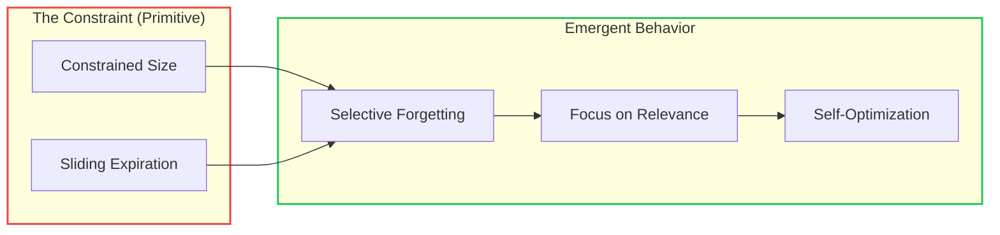
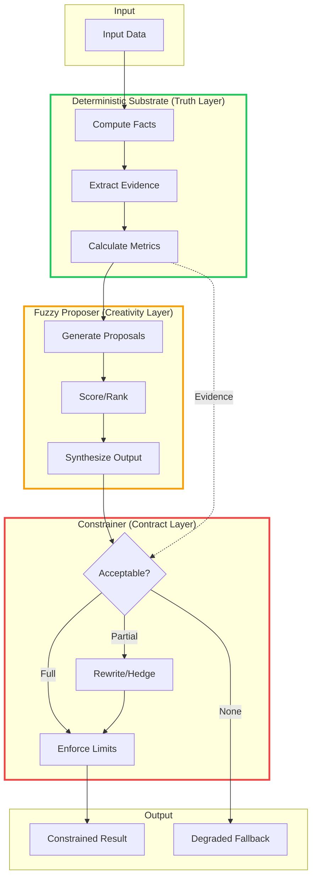
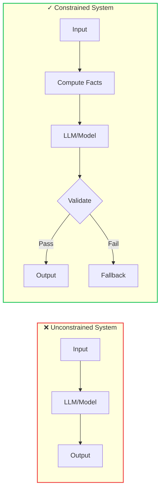
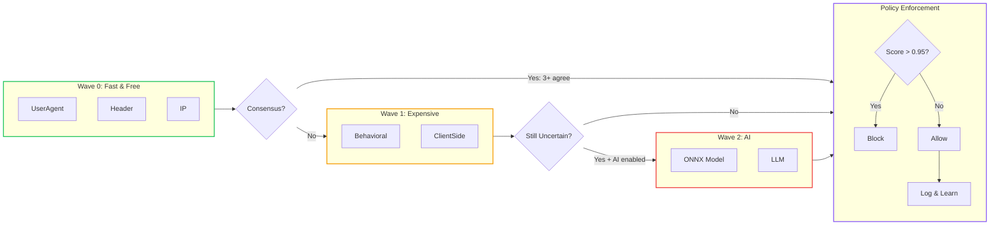
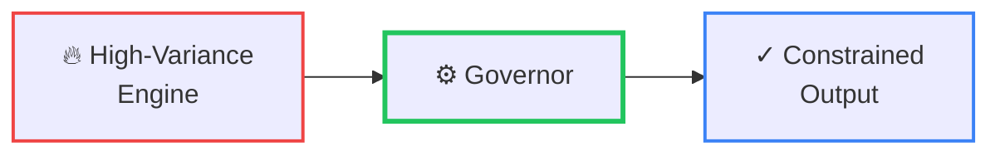

# Constrained Fuzziness: A Control System Pattern for Probabilistic Components
<!-- category -- AI,Patterns,Architecture,LLM,DiSE -->
<datetime class="hidden">2026-01-06ET14:00</datetime>

## The Pattern That Kept Emerging

It started with my blog's [translation tool](/blog/fire-and-dont-quite-forget-ephemeral-execution). The cache kept only 5 tasks per user, with 6-hour absolute and 1-hour sliding expiration. Sixth task? Oldest evicted. After an hour of inactivity, everything expired.

Most developers would see those as constraints to work around. But the cache became *self-cleaning* and *self-specializing*. It retained what users needed and forgot what they didn't. The constrained window wasn't fighting the system. It *was* the system.

I extracted that primitive into [Mostlylucid.Ephemeral](https://github.com/scottgal/mostlylucid.atoms): constrained concurrency, sliding expiration, signal-based coordination between operations. The same idea generalized.

The pattern kept showing up. In [DiSE](/blog/dise-architecture-overview), LLMs evolve code, but unit tests and quality checks decide what survives. The LLM proposes; the tests constrain. In [Bot Detection](/blog/learning-lrus-when-capacity-makes-systems-better), heuristic detectors score requests, but policy thresholds enforce the final verdict. In customer intelligence, LLMs generate behavioral segments, but computed metrics constrain what they can claim.

Four systems. Same shape. The constraint is always the teacher.

A constraint turns ambiguity into a forced choice: keep or evict, accept or degrade, escalate or stop. Sometimes the constraint is *resource* (size, time, cost). Sometimes it's *epistemic* (evidence, invariants). Same role: enforce selection and prevent unearned certainty.



This is the core insight of the [Semantic Intelligence series](/blog/semantidintelligence-part1) and [DiSE (Directed Synthetic Evolution)](/blog/dise-architecture-overview):

**Constraints don't limit intelligence. Constraints *create useful behaviour* in systems that otherwise drift.**

The LRU cache under pressure. The LLM constrained by computed facts. The heuristic model constrained by policy thresholds. Each constraint forces the system to make decisions. Those decisions create the selection pressure.

| System | Constraint (Primitive) | Emergent Behavior |
|--------|----------------------|-------------------|
| LRU Cache | Size limit + sliding expiry | Forgets irrelevant patterns, remembers useful ones |
| LLM Summarizer | Must cite source chunks | Can't hallucinate unsupported claims |
| Bot Detector | Policy thresholds (0.3/0.95) | Escalates only when genuinely uncertain |
| Image Captioner | Computed color palette | Can't invent colors that don't exist |

Same pattern. Different domains. The constraint is the teacher.

---

> **TL;DR**: Let probabilistic models *propose*; let deterministic systems *decide*. Compute facts you can verify, let AI interpret them, then validate every claim against the facts. Works for LLMs, heuristics, vision models, anything uncertain.

---

### Pattern Card

| | |
|---|---|
| **Intent** | Use probabilistic components safely in systems with real guarantees |
| **Forces** | High-variance outputs, silent failure, constrained compute, need for learning |
| **Solution** | Substrate (facts) → Proposer (uncertainty) → Constrainer (validate + rewrite + budget) → output/fallback |
| **Consequences** | More engineering upfront; dramatically safer evolution and operations |

**What you get:**
- Clearer failure modes (degraded outputs with audit trails, not silent corruption)
- Safer evolution (mutate the proposer freely; the constrainer catches mistakes)
- Model-agnostic architecture (swap 7B for frontier without structural changes)

**What it costs:**
- More plumbing upfront: you build evidence extraction and metrics before you see payoff

---

## Constrained Fuzziness

Constrained here means **bounded**: hard limits enforced mechanically rather than negotiated via prompts. Budgets, invariants, and constrainers (validate + rewrite gates) that physically prevent overreach, not "some guardrails" or "best-effort prompting."

After building systems across very different domains (document summarization, image analysis, bot detection, data querying), this architecture kept emerging:



The core insight: **let probabilistic components propose, but never let them decide**. Use them for what they're good at (interpretation, ranking, hypothesis generation) while enforcing hard, deterministic constraints at every boundary.

What makes this pattern powerful is its flexibility. The "fuzzy proposer" might be:
- An LLM generating natural language summaries
- A heuristic model with learned weights scoring bot probability
- A vision model proposing image captions
- An ensemble of weak classifiers voting on a decision

The architecture remains the same. Only the components change.

## The Problem: Unconstrained Systems Fail Silently

Without constraints, probabilistic systems fail in ways that are hard to detect and impossible to prevent:



**Unconstrained failure modes:**
- The LLM confidently describes colors that don't exist in the image
- Summaries cite facts that appear nowhere in the source material
- Bot detection scores fluctuate wildly based on irrelevant signals
- A learned heuristic drifts as traffic patterns change and silently blocks legitimate users
- SQL queries include UPDATE and DELETE statements when you only wanted reads
- Costs spiral as edge cases consume unlimited resources

The instinct is to add more prompting, more examples, more soft guardrails. But probabilistic systems can't be trusted to respect soft boundaries. They require hard ones.

## The Law: Ten Commandments

The pattern crystallized into [operational rules](/blog/tencommandments) that codify constrained fuzziness (selected):

| Commandment | Constrained Fuzziness Translation |
|-------------|------------------------------|
| **I. LLMs shall not own state** | State lives in the substrate, not the proposer |
| **II. LLMs shall not be sole cause of side-effects** | The constrainer commits; the LLM recommends |
| **IV. Use LLMs where probability is acceptable** | Classification, summarization, ranking (not invariants) |
| **V. Never ask an LLM to decide a derivable boolean** | If you can compute it, compute it |
| **VIII. Demote the LLM to advisor, not agent** | Proposer, not decider |

The payoff: **you don't need frontier models**. A tiny local LLM on commodity hardware becomes a force multiplier when it's doing classification and hypothesis generation, not pretending to be a database or state machine. The boring machinery handles the hard parts. The LLM handles the fuzzy parts.

## The Control Theory Connection

The pattern has deep roots in **control theory**: the governor that constrains a high-variance process:

```
Classical Control:       Steam Engine → Governor → Constrained Speed
Constrained Fuzziness:   LLM/Heuristic → Constrainer → Constrained Output
```

You don't make the engine "understand" it shouldn't explode. You physically prevent it. Same with probabilistic systems: you don't prompt the LLM to "not hallucinate." You computationally prevent hallucinations from reaching output.

**Related work** for the academically inclined:
- Herbert Simon's [bounded rationality](https://en.wikipedia.org/wiki/Bounded_rationality) - decision-making under constraints
- "[A Comprehensive Survey of RAG](https://arxiv.org/abs/2410.12837)" (2024) - retrieval-augmented generation patterns
- Mitchell's "The Need for Biases in Learning Generalizations" (1980) - why constraints help learning

## What About Frontier Models?

The obvious objection: "Sure, but GPT-5 / Claude 4 / Gemini Ultra will be so good that these constraints won't matter."

Maybe. Frontier models *can* paper over many cracks that smaller systems expose. They hallucinate less frequently. They follow instructions more reliably. They handle edge cases more gracefully. If you're building a prototype or a tool where occasional failures are acceptable, a frontier model with good prompting might be enough.

But "less frequently" is not "never." And "more reliably" is not "guaranteed."

The [small models article](/blog/small-models-not-budget-option) explores this in depth, but the core insight is: **frontier models fail differently, not less**. Their failures are semantic rather than structural (plausible-sounding nonsense instead of invalid JSON). That makes failures *harder* to detect, not easier.

More importantly: **prompt engineering cannot replace engineering discipline**. No matter how good the model becomes, these problems remain:

| Problem | Why Prompting Can't Fix It |
|---------|---------------------------|
| State management | Models have no persistent memory across calls |
| Side effects | Models can recommend actions but can't guarantee execution |
| Auditability | "The model said so" is not an acceptable audit trail |
| Determinism | Same prompt can produce different outputs |
| Cost at scale | Per-token pricing compounds with volume |

Even if a frontier model could reliably produce correct output 99.9% of the time, you still need:
- Validation to catch the 0.1%
- Fallbacks when validation fails
- Logging to understand what happened
- Metrics to track drift over time

That's the constrainer layer. You're building it anyway.

The difference is whether you build it *before* the failures teach you why it matters, or *after*. Constrained Fuzziness says: build it first. Then the model size becomes a deployment choice, not an architectural one. A 7B model with good constraints often outperforms a frontier model with bad ones.

Model choice changes *how often* you hit the constrainer. It doesn't remove the need for it.

## Implementing Constrained Fuzziness

### 1. Define Your Invariants

What must **never** be violated?

```csharp
public class SummaryInvariants
{
    public bool ValidateSummary(Summary summary, SourceDocument source)
    {
        // No claims without evidence pointers (e.g., "[chunk-3]" must exist in source)
        if (summary.Claims.Any(c => !source.ChunkIds.Contains(c.EvidenceChunkId)))
            return false;

        // No color assertions unless we computed a palette from the image
        if (summary.ColorClaims.Any() && !source.HasComputedPalette)
            return false;

        // No PII in output
        if (PiiDetector.ContainsPii(summary.Text))
            return false;

        return true;
    }
}
```

Common invariants include:
- No claims without evidence pointers
- No colors unless derived from palette statistics
- No PII emission
- No writes, only read-only SQL
- No identity attribution unless explicitly grounded

### 2. Set Hard Budgets

What must **always** be constrained?

```csharp
public record ProcessingBudget(
    int MaxContextTokens = 4000,
    int MaxModelCalls = 5,
    TimeSpan MaxLatency = default,  // e.g., 30 seconds
    int MaxVramMb = 2048,
    decimal MaxCostUsd = 0.10m
)
{
    public ProcessingBudget() : this(MaxLatency: TimeSpan.FromSeconds(30)) { }
}
```

The budget isn't a suggestion. It's a circuit breaker. When exceeded, the system degrades gracefully rather than continuing to burn resources.

### 3. Build Your Gate Types

The constrainer doesn't just reject. It *rewrites* overconfident outputs into hedged statements ("may", "uncertain", "based on available evidence"), or strips unsupported claims entirely. Rewriting preserves signal while stripping overconfidence, keeping systems useful under uncertainty instead of brittle. That's the distinctive part: it's not input validation, it's output governance.

Common constrainers you'll reuse across systems:

**Schema Gate**: JSON schema + type validation
```csharp
public class SchemaGate<T>
{
    public (bool Valid, T? Result, string? Error) Validate(string json)
    {
        try
        {
            var result = JsonSerializer.Deserialize<T>(json, _options);
            return (true, result, null);
        }
        catch (JsonException ex)
        {
            return (false, default, ex.Message);
        }
    }
}
```

**Evidence Gate**: Each claim must link to source chunks
```csharp
public class EvidenceGate
{
    public Summary EnforceEvidence(Summary proposed, IReadOnlySet<string> sourceChunkIds)
    {
        // Keep only claims that reference chunks we actually have
        var validClaims = proposed.Claims
            .Where(claim => sourceChunkIds.Contains(claim.EvidenceChunkId))
            .ToList();

        return proposed with { Claims = validClaims };
    }
}
```

**Policy Gate**: Privacy/safety rules
**Budget Gate**: Time/compute/token caps
**Rewrite Gate**: Transform assertions into hedged statements

### 4. Define Failure Handling

When the fuzzy part fails, don't crash. Degrade:

```csharp
public async Task<SummaryResult> SummarizeWithFallback(Document doc)
{
    try
    {
        var proposed = await _llm.GenerateSummary(doc);
        var constrained = _constrainer.Enforce(proposed, doc);

        if (constrained.Claims.Count > 0)
            return SummaryResult.Success(constrained);

        // LLM output was entirely invalid. Fall back to extractive
        return SummaryResult.Degraded(
            _extractiveSummarizer.Summarize(doc),
            reason: "LLM claims failed validation");
    }
    catch (BudgetExceededException ex)
    {
        // Log for evolution, return deterministic-only
        _logger.LogWarning(ex, "Budget exceeded for {DocId}", doc.Id);
        return SummaryResult.Degraded(
            _extractiveSummarizer.Summarize(doc),
            reason: ex.Message);
    }
}
```

The key principles:
- Degrade gracefully to deterministic-only mode
- Return partial output with explicit uncertainty markers
- Log invalid proposals as training signals for prompt evolution

## Real-World Examples

### LLM-Based Systems (Brief)

| System | Substrate | Proposer | Constrainer |
|--------|-----------|----------|---------|
| **DocSummarizer** | BERT/RAG chunk extraction | LLM narrative synthesis | Citation validator (claims must cite `[chunk-N]`) |
| **Image Captioning** | ImageSharp palette/metrics | Florence/LLaVA caption | Color claims must match computed palette |
| **DataSummarizer** | DuckDB schema | LLM → SQL | No writes, table allowlist |
| **Media Analysis** | Scene timestamps, transcript | LLM beat sheet | Beats must cite timestamps/quotes |

The pattern is always the same: compute facts, let the LLM interpret within those facts, strip anything that exceeds the facts.

### Bot Detection: The Non-LLM Example

*This section is intentionally detailed because it shows the pattern without any LLM at all.*

My bot detection system ([Mostlylucid.BotDetection](https://www.nuget.org/packages/Mostlylucid.BotDetection)) demonstrates that Constrained Fuzziness isn't limited to LLM-based systems. Here, the fuzzy proposer is a collection of heuristic detectors with learned weights. No language model required for core functionality.

**The Three Layers:**

- **Substrate (Truth Layer)**: Individual detectors compute objective signals from HTTP requests
  - UserAgent analysis: `ua.is_bot`, `ua.contains_automation_keyword`
  - Header analysis: `hdr.accept_language_count`, `hdr.missing_standard_headers`
  - IP analysis: `ip.is_datacenter`, `ip.reputation_score`
  - Behavioral analysis: `beh.requests_per_minute`, `beh.path_entropy`

- **Proposer (Creativity Layer)**: Heuristic model aggregates signals via weighted sigmoid
  ```csharp
  // Each detector emits a contribution, not a verdict
  DetectionContribution.Bot(
      source: "UserAgent",
      category: "BotSignature",
      confidence: 0.85,
      reason: "Contains 'Googlebot' signature",
      weight: 1.0
  );

  // Aggregation via weighted sigmoid
  var weightedSum = contributions.Sum(c => c.ConfidenceDelta * c.Weight);
  var botProbability = 1.0 / (1.0 + Math.Exp(-weightedSum));
  ```

- **Constrainer (Contract Layer)**: Policy engine enforces hard thresholds and actions
  ```csharp
  public record DetectionPolicy(
      double EarlyExitThreshold = 0.3,      // Exit if < 30% = confident human
      double ImmediateBlockThreshold = 0.95, // Block only if 95%+ certain
      double AiEscalationThreshold = 0.6     // Escalate if risk unclear
  );
  ```

**The Key Insight: Detectors Emit Evidence, Not Verdicts**

Each detector contributes to the final decision without making the decision itself. The `DetectionContribution` record captures:
- `ConfidenceDelta`: How much this pushes toward bot (+) or human (-)
- `Weight`: How much influence this detector has
- `Signals`: The computed facts (never raw PII)
- `Reason`: Human-readable explanation

This separation means you can:
- Add/remove detectors without changing aggregation logic
- Tune weights independently of detection logic
- Learn optimal weights from feedback over time

**Optional LLM Escalation**

Here's where it gets interesting: the pattern supports **optional escalation to LLM** when the heuristic model is uncertain. This is configured via policy:

```csharp
// Default policy: fast heuristics only
var defaultPolicy = new DetectionPolicy {
    FastPath = ["UserAgent", "Header", "Ip", "Behavioral"],
    EscalateToAi = false
};

// High-security policy: escalate uncertain cases to LLM
var strictPolicy = new DetectionPolicy {
    FastPath = ["UserAgent", "Header", "Ip"],
    SlowPath = ["Behavioral", "ClientSide"],
    AiPath = ["Onnx", "Llm"],  // Optional ML/LLM detectors
    EscalateToAi = true,
    AiEscalationThreshold = 0.4  // Escalate when 40-60% uncertain
};
```

When escalation triggers, the LLM receives the accumulated signals and provides a natural language analysis, but the constrainer still enforces thresholds. The LLM's opinion influences the score; it doesn't override the policy.

**Wave-Based Orchestration**

The system runs detectors in waves, with later waves triggered by earlier signals:



This is Constrained Fuzziness with **progressive escalation**: cheap heuristics handle clear cases, expensive AI handles edge cases, and policy enforces constraints at every step.

**Learning Without Risk**

Because the constrainer enforces safety regardless of what detectors output, the system can safely learn:

```csharp
// After each request, submit learning event (non-blocking)
LearningCoordinator.TrySubmit("ua.pattern", new LearningEvent {
    Features = extractedFeatures,
    Label = actualOutcome,  // Was it actually a bot?
    Confidence = detectionConfidence
});

// Background: EMA weight update
var alpha = 0.1;  // Learning rate
newWeight = existingWeight * (1 - alpha) + observedDelta * alpha;
```

Weights converge toward true patterns over time. High-confidence observations have more impact. But a bad weight update can never cause unconstrained harm. The policy thresholds still apply.

**Why This Matters**

BotDetection proves that Constrained Fuzziness isn't about LLMs specifically. It's about any system where:
1. Multiple uncertain signals must be combined
2. Different signals have different reliability
3. Hard constraints must be enforced regardless of scores
4. The system should learn and improve over time
5. Expensive analysis should only run when cheap analysis is insufficient

The LLM is just one possible fuzzy component. Heuristic models, ensemble classifiers, and rule-based scorers all fit the same architecture.

## When NOT to Use Constrained Fuzziness

The pattern has a cost. Don't pay it when you don't need to.

**Skip it when:**

- **The task is fully deterministic.** If you can write `if X then Y`, you don't need a proposer. Just write the code.

- **You're prototyping.** You don't yet know what constraints matter. Let it fail first. Constrain it after you understand the failure modes. (Unless the blast radius is high, constrain early.)

- **The output is disposable.** Brainstorming, drafts, creative exploration: if a human reviews everything anyway, the constrainer is redundant.

- **Occasional failures are acceptable.** If 5% hallucination rate is fine for your use case, the engineering cost of constraining may exceed the cost of failures.

- **You have no substrate.** If you can't compute ground truth, you can't constrain against it. Don't fake it. Either find computable facts or accept the fuzziness.

**The pattern is for systems where:**
- Probabilistic outputs reach users or other systems without human review
- Failures are silent, expensive, or compounding
- You need to learn/evolve without risking production

If that's not your situation, simpler approaches win.

## Integration with Evolutionary Systems

Constrained Fuzziness becomes even more powerful when combined with DiSE (Directed Synthetic Evolution) patterns. Because you can score candidates cheaply and deterministically:

1. **Generate** multiple fuzzy proposals
2. **Validate** against invariants
3. **Score** based on constraint satisfaction + utility metrics
4. **Keep** the best, discard the rest
5. **Accumulate** failures as training signals for prompt evolution

The key insight: **you can evolve the proposer without risking the system**, because the constrainer enforces safety and correctness regardless of what the proposer outputs.

```csharp
public async Task<EvolvedPrompt> EvolvePromptAsync(
    Prompt current,
    IReadOnlyList<FailureCase> failures)
{
    // Failures are safe to collect because constrainers caught them
    var patterns = AnalyzeFailurePatterns(failures);

    // Generate candidate prompt mutations
    var candidates = await _llm.GeneratePromptVariants(current, patterns);

    // Test each against held-out validation set
    var scored = await Task.WhenAll(candidates.Select(async c =>
    {
        var results = await RunValidationSet(c);
        return (Prompt: c, Score: CalculateScore(results));
    }));

    return scored.OrderByDescending(x => x.Score).First().Prompt;
}
```

## The One-Sentence Definition

> "Constrained Fuzziness is the practice of letting probabilistic components propose meaning while deterministic systems enforce truth, safety, and budgets at every boundary."

## Conclusion: The Governor, Not The Engine

Back to that LRU cache that got smarter when it ran out of memory.

The fix wasn't giving it more capacity. The fix was **letting the constraint do its job**. The constrained size forced selection. The sliding expiration forced forgetting. Together, they created learning.

This is the key insight: **you don't fix probabilistic systems by making them *less* probabilistic**. You fix them by not letting probability escape into your guarantees.



The steam engine doesn't "understand" it shouldn't explode. The governor physically prevents it. The LLM doesn't "understand" it shouldn't hallucinate colors. The constrainer computationally prevents it.

Same pattern. Different century.

The next time you're tempted to add another paragraph to your system prompt hoping the model will "understand" a constraint, stop. Ask instead: *can I compute that constraint?*

If yes, compute it. Then constrain the model to it.

Hard boundaries beat soft suggestions. Every time.

---

## The Series

| Part | Pattern | Axis |
|------|---------|------|
| 1 | Constrained Fuzziness (this article) | Single component |
| 2 | [Constrained Fuzzy MoM](/blog/constrained-mom-mixture-of-models) | Multiple components |
| 3 | [Constrained Fuzzy Context Dragging](/blog/constrained-fuzzy-context-dragging) | Time / memory |
| 4 | [Image Summarizer](/blog/constrained-fuzzy-image-intelligence) | Practical implementation |

**Part 2** extends this architecture to multi-agent systems. Models do not talk to each other. They publish typed signals to a shared substrate. The constraint becomes the communication itself.

**Part 3** extends it along the time axis. Models may notice, but engineering decides what persists. The constraint becomes memory itself.

**Part 4** shows all three patterns implemented in [ImageSummarizer](https://github.com/scottgal/lucidrag)—a wave-based image analysis pipeline where ColorWave computes facts, VisionLlmWave proposes, and deterministic selection constrains the output.
