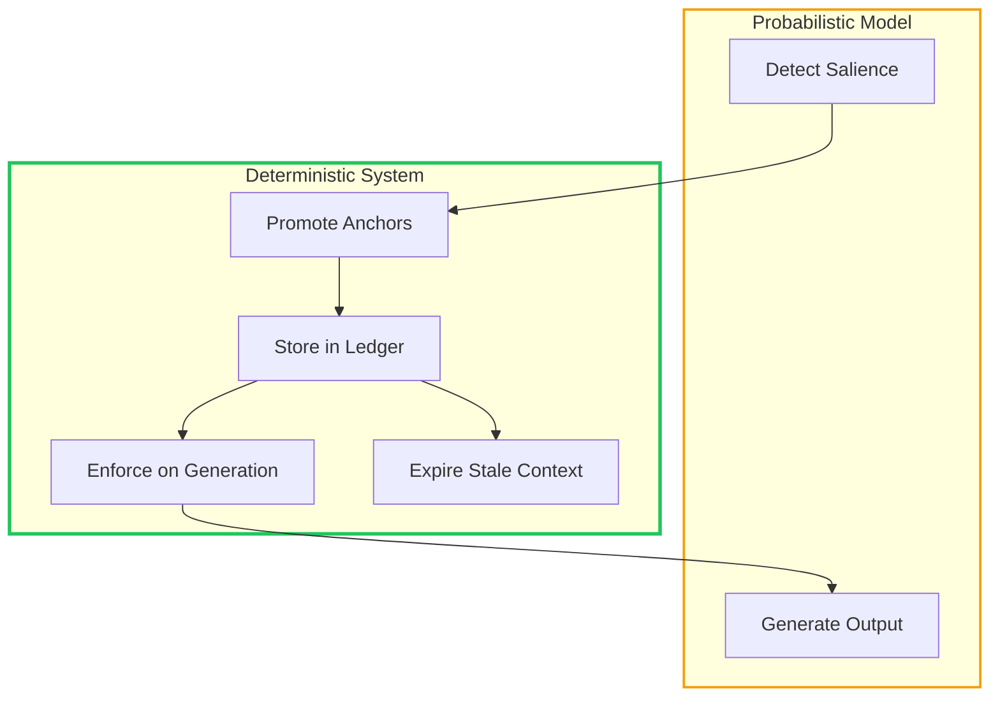
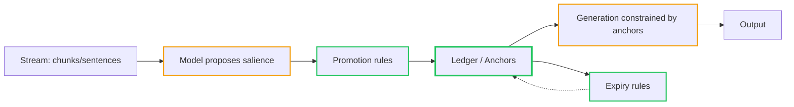
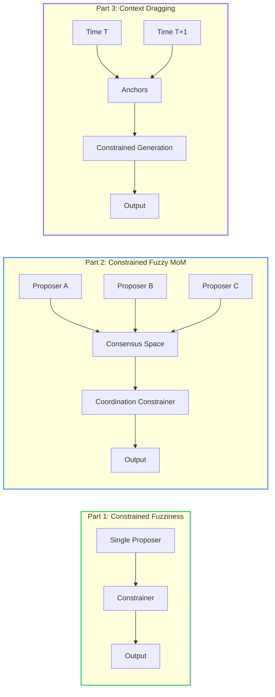

# Constrained Fuzzy Context Dragging: What Gets Remembered

<!-- category -- AI,Patterns,Architecture,LLM,DiSE -->
<datetime class="hidden">2026-01-06T16:00</datetime>

One of the easiest ways to make an AI system fail is to let it remember too much.

Most "context handling" approaches boil down to one of two mistakes:

- **Stuff everything into the prompt** and hope the model figures out what matters
- **Repeatedly re-summarise summaries** and accept drift as a fact of life

Both approaches are expensive, opaque, and unstable over long horizons.

There is a better pattern - one that mirrors how biological systems actually scale cognition.

I call it **Constrained Fuzzy Context Dragging** (CFCD).

[TOC]

---

## The Pattern in One Sentence

> **Constrained Fuzzy Context Dragging** is a pattern where probabilistic models propose what is salient, but only deterministic rules are allowed to carry that salience forward to influence future reasoning or generation.

Or more bluntly:

> *Models may notice. Engineering decides what persists.*

This is the same philosophical split as [Constrained Fuzziness](/blog/constrained-fuzziness-pattern) and [Constrained Fuzzy MoM](/blog/constrained-mom-mixture-of-models) - just applied along the **time axis** instead of the **decision axis**.

---

## The Core Mistake: Treating Context as Text

LLMs do not "remember". They pattern-match over tokens.

When we treat context as "just more text", we get:

- silent drift
- inconsistent terminology
- runaway cost
- summaries that contradict earlier summaries
- translations that rename the same thing five times
- context becomes an unversioned dependency (nobody knows what changed, but results changed)

Longer context windows do not solve this. They just delay the failure.

The real question is not *how much* context to keep, but:

> **What deserves to survive?**

---

## The CFCD Rule

CFCD enforces a hard separation:

| Role | Allowed to be fuzzy? | Allowed to become future constraint? |
|------|---------------------|--------------------------------------|
| Salience detection | Yes | No |
| Context promotion | No | Yes |
| Generation | Yes | No |
| Anchor storage (ledger) | No | Yes |

Probability can *suggest*. Determinism decides what gets dragged forward.

Deterministic means: **same inputs + same policy ⇒ same anchors**. You can still use probabilistic scores; you just run them through fixed promotion/expiry functions (MMR, RRF, vote rules).

CFCD is how you get the benefits of context without paying the price of context.

---

## Example 1: Summarisation (Vertical Dragging)

### The Naive Approach

- Chunk document
- Summarise each chunk
- Summarise the summaries
- Accept drift

This fails because:

- early errors compound
- emphasis shifts arbitrarily
- contradictions are hidden

### CFCD Approach

The key insight: **salience detection doesn't require an LLM**. You can use deterministic ML (embeddings, TF-IDF, BM25) to find what matters, then constrain the LLM to only see what survived selection.

[DocSummarizer](/blog/docsummarizer-advanced-concepts) implements this:

1. **Parse document into segments** (sentences, headings, lists, code blocks)
2. **Generate embeddings** using ONNX sentence-transformers (ML, not LLM)
3. **Compute salience scores** using:
   - Cosine similarity to document centroid
   - TF-IDF for term importance
   - Position weights (intro/conclusion boost)
   - Content-type adjustments (narrative vs expository)
4. **Select top-K using MMR** (Maximal Marginal Relevance):
   - Balances relevance (similarity to centroid) with diversity
   - Deterministic: same inputs → same selection
5. **LLM synthesises only from selected segments**

The LLM never sees the full document. It generates around the anchors, not through them.

```csharp
// From DocSummarizer: SegmentExtractor.cs
public class SegmentExtractor
{
    private readonly OnnxEmbeddingService _embeddingService;  // ML, not LLM

    public async Task<ExtractionResult> ExtractAsync(string docId, string markdown)
    {
        // 1. Parse document into typed segments
        var segments = ParseToSegments(docId, markdown);

        // 2. For large docs: semantic pre-filtering with multi-anchor approach
        //    - Guaranteed coverage: first/last sentences per section, constraints
        //    - BM25 candidate generation with pseudo-query from TF-IDF terms
        //    - Topic anchors via k-means clustering on sample embeddings
        if (segments.Count > _config.MaxSegmentsToEmbed)
        {
            (segmentsToEmbed, centroid) = await SemanticPreFilterAsync(segments, targetCount);
        }
        else
        {
            await GenerateEmbeddingsAsync(segments);
            centroid = CalculateCentroid(segments);
        }

        // 3. Score by salience using MMR (deterministic)
        //    Salience = lambda * sim(segment, centroid) * position_weight * content_weight
        //             - (1 - lambda) * max_sim(segment, higher_ranked_segments)
        ComputeSalienceScores(segments, centroid, contentType);

        // 4. Return top-K as anchors for synthesis
        var topBySalience = segments
            .OrderByDescending(s => s.SalienceScore)
            .Take(Math.Max(_config.FallbackBucketSize, targetCount))
            .ToList();

        return new ExtractionResult
        {
            AllSegments = segments,
            TopBySalience = topBySalience,
            Centroid = centroid,
            ContentType = contentType
        };
    }

    /// <summary>
    /// Greedy MMR selection: balances relevance with diversity
    /// </summary>
    private void ComputeSalienceScores(List<Segment> segments, float[] centroid, ContentType contentType)
    {
        var candidates = new HashSet<Segment>(segments.Where(s => s.Embedding != null));
        var ranked = new List<Segment>();

        // Pre-compute centroid similarities with content-type adjustments
        foreach (var segment in candidates)
        {
            var baseSim = CosineSimilarity(segment.Embedding!, centroid);
            var contentWeight = ComputeContentTypeWeight(segment, contentType);
            segment.SalienceScore = baseSim * segment.PositionWeight * contentWeight;
        }

        // Greedy MMR: pick best, penalise similar, repeat
        while (candidates.Count > 0)
        {
            var best = candidates
                .Select(c => new {
                    Segment = c,
                    Score = _config.MmrLambda * c.SalienceScore
                          - (1 - _config.MmrLambda) * MaxSimToRanked(c, ranked)
                })
                .OrderByDescending(x => x.Score)
                .First();

            best.Segment.SalienceScore = 1.0 - ((double)ranked.Count / segments.Count);
            ranked.Add(best.Segment);
            candidates.Remove(best.Segment);
        }
    }
}
```

### Adaptive Selection: Context Window Awareness

Because the output is a **ranked collection**, you can adapt anchor count to the synthesis model at runtime:

```csharp
public class AdaptiveSynthesizer
{
    public int ComputeAnchorBudget(ModelProfile model, ExtractionResult extraction)
    {
        // Larger context windows → more anchors
        var baseTokenBudget = model.ContextWindow / 4;  // Reserve 25% for output

        // More powerful models → can handle more complex synthesis
        var complexityMultiplier = model.Tier switch
        {
            ModelTier.Small => 0.5,   // tinyllama: fewer, simpler anchors
            ModelTier.Medium => 1.0,  // llama3.2:3b: standard
            ModelTier.Large => 1.5,   // llama3.1:8b+: more context, nuanced synthesis
            _ => 1.0
        };

        var anchorBudget = (int)(baseTokenBudget * complexityMultiplier / _avgTokensPerSegment);

        // Never exceed what we have
        return Math.Min(anchorBudget, extraction.TopBySalience.Count);
    }

    public async Task<Summary> SynthesizeAsync(
        ExtractionResult extraction,
        ModelProfile model)
    {
        var budget = ComputeAnchorBudget(model, extraction);

        // Take top-K from already-ranked segments
        var anchors = extraction.TopBySalience.Take(budget).ToList();

        // Synthesis model only sees what survived selection + adaptation
        return await _llm.SynthesizeAsync(anchors, model);
    }
}
```

This is still deterministic: **same inputs + same model profile → same anchors**. The ranking happens once; adaptation is just a slice.

This means you can:
- Use a fast small model with 5 anchors for quick summaries
- Use a powerful model with 50 anchors for comprehensive analysis
- Dynamically adjust mid-pipeline if the first attempt lacks coverage

The key insight: **anchors are structure, not prose**. The embeddings and MMR are deterministic. The LLM only does the final synthesis, bounded by what survived.

**Anchor contract:** generation may vary phrasing, but must not contradict anchors. If anchors are insufficient, it must hedge and/or request more evidence.

A concrete anchor representation:

```json
{
  "policyVersion": "cfcd-v1",
  "segments": [
    {"id":"seg-12","text":"Reset requires holding button 10s","salience":0.92},
    {"id":"seg-45","text":"Factory reset clears all settings","salience":0.88}
  ],
  "coverage": "3.2% semantic sample",
  "hedging": "sampled 3% - avoid definitive conclusions"
}
```

---

## Example 2: Translation (Lateral Dragging)

Translation exposes this pattern even more clearly.

### The Failure Mode

Translate sentence-by-sentence and you get:

- inconsistent terminology
- renamed entities
- subtle semantic drift

Even with a huge context window, models still "feel free" to vary phrasing.

### CFCD Approach

1. Early in the document, extract **terminology candidates**:
   - proper nouns
   - technical terms
   - repeated phrases
2. Build a **term ledger**:
   - source → target mapping
   - confidence
   - first-seen location
3. For each sentence:
   - allow fuzzy translation
   - **constrain** choices using the ledger
   - permit deviation only with strong local evidence
4. Update the ledger deterministically if:
   - a better mapping appears repeatedly
   - or an explicit override is declared

**What counts as strong local evidence?**

- Term appears in a glossary, table, or definition block (structural cue)
- Explicit user override in configuration
- Repeated within the last W chunks (sliding window) with consistent usage

This is deterministic: structural cues are detected by pattern or parser classification, not model judgment.

Default policy: Δ=0.08 confidence gap, W=50 chunks (tune per domain).

```csharp
public class TermLedger
{
    private readonly Dictionary<string, TermMapping> _mappings = new();

    public record TermMapping(
        string SourceTerm,
        string TargetTerm,
        float Confidence,
        string FirstSeenChunkId,
        int LastSeenChunkIndex,               // Track recency
        int VotesForCurrentTarget,
        int TotalVotes,                       // Preserve history
        string? ChallengerTarget = null,
        int ChallengerVotes = 0,
        float ChallengerConfidence = 0);

    public void ProposeMapping(string source, string target, float confidence, string chunkId, int chunkIndex)
    {
        source = source.ToLowerInvariant().Trim();

        if (_mappings.TryGetValue(source, out var existing))
        {
            if (existing.TargetTerm == target)
            {
                // Same as current: accumulate votes
                _mappings[source] = existing with
                {
                    Confidence = Math.Max(existing.Confidence, confidence),
                    VotesForCurrentTarget = existing.VotesForCurrentTarget + 1,
                    TotalVotes = existing.TotalVotes + 1,
                    LastSeenChunkIndex = chunkIndex
                };
            }
            else if (existing.ChallengerTarget == target)
            {
                // Same as challenger: accumulate challenger votes
                var newChallengerVotes = existing.ChallengerVotes + 1;
                var newChallengerConfidence = Math.Max(existing.ChallengerConfidence, confidence);

                // Switch if challenger has >= 2 votes AND higher confidence
                if (newChallengerVotes >= 2 && newChallengerConfidence > existing.Confidence)
                {
                    // Swap: old current becomes challenger, challenger becomes current
                    _mappings[source] = existing with
                    {
                        TargetTerm = target,
                        Confidence = newChallengerConfidence,
                        VotesForCurrentTarget = newChallengerVotes,
                        TotalVotes = existing.TotalVotes + 1,
                        LastSeenChunkIndex = chunkIndex,
                        ChallengerTarget = existing.TargetTerm,  // Preserve old mapping as challenger
                        ChallengerVotes = existing.VotesForCurrentTarget,
                        ChallengerConfidence = existing.Confidence
                    };
                }
                else
                {
                    _mappings[source] = existing with
                    {
                        ChallengerVotes = newChallengerVotes,
                        ChallengerConfidence = newChallengerConfidence,
                        TotalVotes = existing.TotalVotes + 1,
                        LastSeenChunkIndex = chunkIndex
                    };
                }
            }
            else if (confidence > existing.ChallengerConfidence)
            {
                // New challenger replaces old challenger
                _mappings[source] = existing with
                {
                    ChallengerTarget = target,
                    ChallengerVotes = 1,
                    ChallengerConfidence = confidence,
                    TotalVotes = existing.TotalVotes + 1,
                    LastSeenChunkIndex = chunkIndex
                };
            }
        }
        else
        {
            _mappings[source] = new TermMapping(
                source, target, confidence, chunkId, chunkIndex,
                VotesForCurrentTarget: 1, TotalVotes: 1);
        }
    }

    public string? GetCanonicalTranslation(string source)
    {
        source = source.ToLowerInvariant().Trim();
        return _mappings.TryGetValue(source, out var mapping)
            ? mapping.TargetTerm
            : null;
    }
}
```

In practice you also want vote decay (or a sliding window) so early mistakes don't become permanent. The key is that the decay rule is deterministic, not model-decided.

**Why this matters for debugging:** If the translation flips "factory reset" mid-document, you can diff the ledger and see exactly when and why:

```
chunk-12: "factory reset" → "Werkseinstellungen" (votes: 3, conf: 0.82)
chunk-47: challenger "Zurücksetzen" reaches 2 votes, conf: 0.91
chunk-47: SWITCH - "factory reset" → "Zurücksetzen" (old mapping preserved as challenger)
```

No guessing. No "the model just decided". Inspectable, deterministic, auditable.

This gives you:

- local fluency (model handles phrasing)
- global consistency (ledger enforces terminology)
- bounded cost (no need to re-translate for consistency)
- auditable decisions (ledger is inspectable)

This is why **terminology consistency** cannot be solved by "just more context".

---

## This Is Not Memory - It Is Constraint Propagation

CFCD does **not** give the model memory.

It gives the *system* memory.

The model:

- does not carry state
- does not decide what persists
- does not own context

The system:

- stores anchors
- enforces bounds
- expires stale salience
- controls lifetime explicitly

**Expiry rules** (deterministic, not model-decided):

- **Time-based:** anchors expire after `T` without being referenced
- **Use-based:** anchors with zero hits over `N` subsequent chunks decay out
- **Contradiction-based:** challenger has ≥2 votes AND exceeds current confidence by Δ, within a sliding window of W chunks

That distinction is everything.



### The CFCD Pipeline

Here is the pattern with the ledger as a first-class object:



The green boxes are deterministic. The orange boxes are probabilistic. The ledger sits between them, holding what survived.

### What Changes in Practice?

Three shifts:

- You stop persisting prose
- You persist *typed anchors*
- You treat the ledger as an API, not a prompt

The prompt becomes a *view* of the ledger, not the ledger itself.

That's the "grok" moment. The ledger is not context. It's a contract.

### What Counts as an Anchor?

Anchors are not "important text". They are **typed, structured facts** that constrain generation:

- **Terminology mappings**: `factory reset` → `restore factory settings`
- **Entities and IDs**: `ProductName`, `ModelNumber`, `UserID`
- **Constraints / invariants**: "Reset requires holding button 10s"
- **User preferences / style constraints**: "Use formal tone", "British spelling"
- **Coverage metadata**: "3.2% semantic sample, 5 anchors"
- **Versioning**: `policyVersion: "cfcd-v1"`, `anchorSchemaVersion: 2`

The point is: anchors are not prose. They are structure. The model writes around them.

---

## Biological Alignment

*This is an analogy, not a biological claim: the point is selective consolidation, not literal mechanism.*

Brains do not replay the entire sensory stream.

They:

- detect salience
- consolidate selectively
- inhibit noise
- freeze representations once stable

Language, motor skills, and perception all rely on **constrained carry-forward**, not raw recall.

CFCD is the same principle, implemented mechanically.

| Biological System | CFCD Equivalent |
|------------------|-----------------|
| Attention (what to notice) | Salience detection (fuzzy) |
| Consolidation (what to remember) | Anchor promotion (deterministic) |
| Inhibition (what to ignore) | Expiration rules (deterministic) |
| Recall (what to retrieve) | Ledger query (deterministic) |

---

## Unifying the Patterns

CFMoM and CFCD are the same idea viewed from different angles:

| Dimension | Pattern |
|-----------|---------|
| Single proposer | [Constrained Fuzziness](/blog/constrained-fuzziness-pattern) |
| Multiple proposers | [Constrained Fuzzy MoM](/blog/constrained-mom-mixture-of-models) |
| Long-horizon context | Constrained Fuzzy Context Dragging |

All three obey the same rule:

> **Probability proposes. Determinism persists.**

Once you internalise that rule, most "AI system design" stops being mysterious.



---

## Why This Is Not Mainstream

Because it:

- reduces compute spend (no re-processing for consistency)
- works with small models (anchors do the heavy lifting)
- looks boring in a demo (no "emergent memory" claims)
- produces fewer dramatic failures (failures are explicit)
- requires real systems thinking (not just prompt engineering)

In other words: it optimises for production, not hype.

---

## Anti-Patterns This Replaces

| Anti-Pattern | Problem | CFCD Solution |
|--------------|---------|---------------|
| **Stuff everything in context** | Unbounded cost, attention dilution | Promote only what survives selection |
| **Recursive summarisation** | Drift, contradictions | Anchors are structure, not prose |
| **Hope the model remembers** | No guarantees | System owns persistence |
| **Per-request full re-processing** | Cost scales with history | Ledger persists across requests |
| **Natural language "memory"** | Semantic drift | Typed anchors, explicit mappings |
| **One-size-fits-all context** | Wastes capacity or starves model | Adaptive slicing from ranked collection |

---

## Implementation Substrate: Ephemeral

[Mostlylucid.Ephemeral](https://github.com/scottgal/mostlylucid.atoms) is the substrate that makes CFCD practical. If you haven't read the background articles:

- [Fire and Don't Quite Forget](/blog/fire-and-dont-quite-forget-ephemeral-execution) - the philosophy
- [Ephemeral Execution Library](/blog/ephemeral-execution-library) - the implementation
- [Ephemeral Signals](/blog/ephemeral-signals) - signal-driven coordination
- [Learning LRUs](/blog/learning-lrus-when-capacity-makes-systems-better) - why bounded memory matters

| Ephemeral Primitive | CFCD Role |
|--------------------|-----------|
| **Signals** | Candidate salience (model proposes) |
| **Bounded windows** | No unbounded "memory" |
| **Eviction rules** | Forgetting is explicit |
| **Sliding expiration** | Stale context expires automatically |
| **Signal propagation** | Anchors carry forward without mutation |

Ephemeral does not "remember". It **decides what is allowed to be remembered, and for how long**.

That is exactly what CFCD requires.

```csharp
public class CFCDCoordinator
{
    private readonly SignalSink _sink;
    private readonly TermLedger _ledger;
    private readonly TimeSpan _anchorLifetime = TimeSpan.FromHours(1);

    public void PromoteAnchor(string term, string translation, string chunkId, int chunkIndex)
    {
        _ledger.ProposeMapping(term, translation, 0.8f, chunkId, chunkIndex);

        // Emit signal for observability (key = chunkId for correlation)
        _sink.Raise($"anchor.promoted:{term}", key: chunkId);
    }

    public void ExpireStaleAnchors()
    {
        var cutoff = DateTimeOffset.UtcNow - _anchorLifetime;

        // Ledger entries older than cutoff without recent usage are removed
        // This is deterministic, not model-decided
        _ledger.ExpireOlderThan(cutoff);
        _sink.Raise("anchors.expired");
    }
}
```

---

## Implementation Sketch: Document Translation

Bringing it together for a complete document translation pipeline:

```csharp
public class CFCDTranslationPipeline
{
    private readonly ILlmService _llm;
    private readonly TermLedger _ledger;
    private readonly SignalSink _sink;
    private readonly int _seedChunks = 3;  // K: configurable seed window

    public async Task<TranslatedDocument> TranslateAsync(
        Document source,
        string targetLanguage)
    {
        var chunks = Chunker.Chunk(source, maxTokens: 500).ToList();
        var translated = new List<TranslatedChunk>();

        // Phase 1: Extract terminology candidates (first pass, fuzzy)
        // Seed from first K chunks: front-loads terminology, avoids churn later
        for (var i = 0; i < Math.Min(_seedChunks, chunks.Count); i++)
        {
            var chunk = chunks[i];
            var candidates = await _llm.ExtractTerminologyAsync(chunk);
            foreach (var term in candidates)
            {
                _ledger.ProposeMapping(
                    term.Source,
                    term.ProposedTranslation,
                    term.Confidence,
                    chunkId: chunk.Id,
                    chunkIndex: i);
            }
        }

        _sink.Raise("terminology.seeded");

        // Phase 2: Translate with ledger constraints
        for (var i = 0; i < chunks.Count; i++)
        {
            var chunk = chunks[i];

            // Get canonical translations for terms in this chunk
            var constraints = ExtractConstraints(chunk, _ledger);

            // Translate with constraints (model must respect ledger)
            var result = await _llm.TranslateWithConstraintsAsync(
                chunk,
                targetLanguage,
                constraints);

            // Update ledger with any new terms (deterministic rules)
            foreach (var newTerm in result.NewTerminology)
            {
                if (ShouldPromote(newTerm, _ledger))
                {
                    _ledger.ProposeMapping(
                        newTerm.Source,
                        newTerm.Target,
                        newTerm.Confidence,
                        chunkId: chunk.Id,
                        chunkIndex: i);

                    _sink.Raise($"anchor.promoted:{newTerm.Source}");
                }
            }

            translated.Add(result.Chunk);
        }

        return new TranslatedDocument(translated, _ledger.GetAllMappings());
    }

    private bool ShouldPromote(TermCandidate term, TermLedger ledger)
    {
        // Deterministic rules, not model judgment:
        // - Proper nouns always promoted
        // - Technical terms promoted if repeated
        // - Common words never promoted
        return term.Type == TermType.ProperNoun ||
               (term.Type == TermType.Technical && term.OccurrenceCount >= 2);
    }
}
```

---

## Closing Thought

The mistake most AI systems make is assuming intelligence improves by remembering *more*.

In practice, intelligence scales by deciding what to **never have to think about again**.

CFCD is how you do that without lying to yourself.

---

## The Series

| Part | Pattern | Axis |
|------|---------|------|
| 1 | [Constrained Fuzziness](/blog/constrained-fuzziness-pattern) | Single component |
| 2 | [Constrained Fuzzy MoM](/blog/constrained-mom-mixture-of-models) | Multiple components |
| 3 | Constrained Fuzzy Context Dragging | Time / memory |

All three patterns share the same invariant: **probabilistic components propose; deterministic systems persist**.

The [Ten Commandments of LLM Use](/blog/tencommandments) codify these rules. The [DiSE architecture](/blog/dise-architecture-overview) implements them for code evolution. [Bot Detection](/blog/botdetection-introduction) implements them for request classification. [DocSummarizer](/blog/docsummarizer-advanced-concepts) implements them for document retrieval.

Different domains. Same pattern. Same rule.

---

## Next: Practical Implementation

Part 4 will be a runnable reference implementation: a CLI + sample documents demonstrating a translation pipeline with a real term ledger, vote decay, and Ephemeral integration. Code you can clone and run, not just read.
