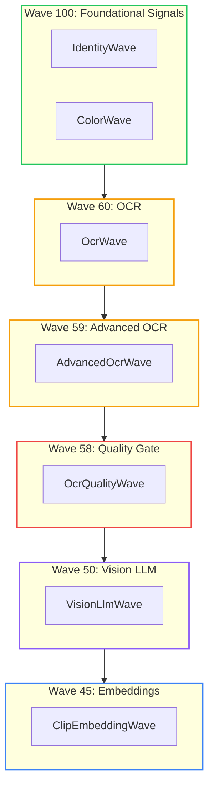

# Image Summarizer : A Constrained Fuzzy Image RAG Engine

<!-- category -- AI,Patterns,Architecture,LLM,DiSE -->
<datetime class="hidden">2026-01-06T17:00</datetime>

[](http://unlicense.org/)
[](https://github.com/scottgal/lucidrag/releases)
[](https://github.com/scottgal/lucidrag/actions)
[](https://dotnet.microsoft.com/)

The previous articles described Constrained Fuzziness as an abstract pattern. This article shows how [ImageSummarizer](https://github.com/scottgal/lucidrag) implements all three patterns in a practical image analysis pipeline.

ImageSummarizer is a RAG ingestion pipeline for images. It extracts structured metadata, text, captions, and visual signals using a wave-based architecture that escalates from fast local analysis to Vision LLMs only when needed. No autonomy, no planning, no agent theatre—just deterministic orchestration of bounded proposers.

ImageSummarizer is less about images, and more about proving that multimodal LLMs can be used without surrendering determinism.

The core rule: **probability proposes, determinism persists**.

[TOC]

---

## What It Does

The pipeline extracts structured metadata from images for RAG systems. Given any image or animated GIF, it produces:

- Extracted text (OCR + Vision LLM fallback)
- Color palette (computed, not guessed)
- Quality metrics (sharpness, blur, exposure)
- Type classification (Photo, Screenshot, Diagram, Meme)
- Motion analysis (for animated images)
- Optional Vision LLM caption (constrained by computed facts)
- Semantic embeddings (for vector search)

The key word is *structured*. Every output has confidence scores, source attribution, and evidence pointers. The Vision LLM is never the sole source of truth.

---

## The Wave Architecture

The system uses a **wave-based pipeline** where each wave is an independent analyzer that produces typed signals. Waves execute in priority order, and later waves can read signals from earlier ones.



This is [Constrained Fuzzy MoM](/blog/constrained-mom-mixture-of-models) applied to image analysis: **multiple proposers publish to a shared substrate** (the `AnalysisContext`), and the final output aggregates their signals.

---

## The Signal Contract

Every wave produces signals using a standardized contract:

```csharp
public record Signal
{
    public required string Key { get; init; }      // "color.dominant", "ocr.quality.is_garbled"
    public object? Value { get; init; }             // The measured value
    public double Confidence { get; init; } = 1.0;  // 0.0-1.0 reliability score
    public required string Source { get; init; }    // "ColorWave", "VisionLlmWave"
    public DateTime Timestamp { get; init; }        // When produced
    public List<string>? Tags { get; init; }        // "visual", "ocr", "quality"
    public Dictionary<string, object>? Metadata { get; init; }  // Additional context
}
```

This is the Part 2 signal contract in action. Waves do not talk to each other via natural language. They publish typed signals to the shared context, and downstream waves can query those signals.

Note that `Confidence` is per-signal, not per-wave. A single wave can emit multiple signals with different epistemic strength—ColorWave's dominant color list has confidence 1.0 (computed), but individual color percentages use confidence as a weighting factor for downstream summarisation.

Confidence here means *reliability for downstream use*, not mathematical certainty. Deterministic signals are reproducible, not infallible—spell-check can be deterministically wrong about proper nouns.

---

## The Wave Interface

Each wave implements a simple interface:

```csharp
public interface IAnalysisWave
{
    string Name { get; }
    int Priority { get; }           // Higher = runs earlier
    IReadOnlyList<string> Tags { get; }

    Task<IEnumerable<Signal>> AnalyzeAsync(
        string imagePath,
        AnalysisContext context,    // Shared substrate with earlier signals
        CancellationToken ct);
}
```

The `AnalysisContext` is the **consensus space** from Part 2. Waves can:

- Read signals from higher-priority waves: `context.GetValue<bool>("ocr.quality.is_garbled")`
- Access cached intermediate results: `context.GetCached<Image<Rgba32>>("ocr.frames")`
- Add new signals that downstream waves can consume

---

## ColorWave: The Deterministic Foundation

ColorWave runs first (priority 100) and computes facts that constrain everything else:

```csharp
public class ColorWave : IAnalysisWave
{
    public string Name => "ColorWave";
    public int Priority => 100;  // Runs first
    public IReadOnlyList<string> Tags => new[] { "visual", "color" };

    public async Task<IEnumerable<Signal>> AnalyzeAsync(
        string imagePath,
        AnalysisContext context,
        CancellationToken ct)
    {
        var signals = new List<Signal>();

        using var image = await LoadImageAsync(imagePath, ct);

        // Extract dominant colors (computed, not guessed)
        var dominantColors = _colorAnalyzer.ExtractDominantColors(image);
        signals.Add(new Signal
        {
            Key = "color.dominant_colors",
            Value = dominantColors,
            Confidence = 1.0,  // Reproducible measurement
            Source = Name,
            Tags = new List<string> { "color" }
        });

        // Individual colors for easy access
        for (int i = 0; i < Math.Min(5, dominantColors.Count); i++)
        {
            var color = dominantColors[i];
            signals.Add(new Signal
            {
                Key = $"color.dominant_{i + 1}",
                Value = color.Hex,
                Confidence = color.Percentage / 100.0,
                Source = Name,
                Metadata = new Dictionary<string, object>
                {
                    ["name"] = color.Name,
                    ["percentage"] = color.Percentage
                }
            });
        }

        // Cache the image for other waves (no need to reload)
        context.SetCached("image", image.CloneAs<Rgba32>());

        return signals;
    }
}
```

The Vision LLM later receives these colors as **constraints**. It should not claim the image has "vibrant reds" if ColorWave computed that the dominant color is blue—and if it does, the contradiction is detectable and can be rejected downstream.

---

## OcrQualityWave: The Escalation Gate

This is where [Constrained Fuzziness](/blog/constrained-fuzziness-pattern) shines. OcrQualityWave is the **constrainer** that decides whether to escalate to expensive Vision LLM:

```csharp
public class OcrQualityWave : IAnalysisWave
{
    public string Name => "OcrQualityWave";
    public int Priority => 58;  // Runs after OCR waves
    public IReadOnlyList<string> Tags => new[] { "content", "ocr", "quality" };

    public async Task<IEnumerable<Signal>> AnalyzeAsync(
        string imagePath,
        AnalysisContext context,
        CancellationToken ct)
    {
        var signals = new List<Signal>();

        // Get OCR text from earlier waves (priority order)
        string? ocrText =
            context.GetValue<string>("ocr.voting.consensus_text") ??
            context.GetValue<string>("ocr.temporal_median.full_text") ??
            context.GetValue<string>("ocr.full_text");

        if (string.IsNullOrWhiteSpace(ocrText))
        {
            signals.Add(new Signal
            {
                Key = "ocr.quality.no_text",
                Value = true,
                Confidence = 1.0,
                Source = Name
            });
            return signals;
        }

        // Tier 1: Spell check (deterministic, no LLM)
        var spellResult = _spellChecker.CheckTextQuality(ocrText);

        signals.Add(new Signal
        {
            Key = "ocr.quality.spell_check_score",
            Value = spellResult.CorrectWordsRatio,
            Confidence = 1.0,
            Source = Name,
            Metadata = new Dictionary<string, object>
            {
                ["total_words"] = spellResult.TotalWords,
                ["correct_words"] = spellResult.CorrectWords
            }
        });

        signals.Add(new Signal
        {
            Key = "ocr.quality.is_garbled",
            Value = spellResult.IsGarbled,  // < 50% correct words
            Confidence = 1.0,
            Source = Name
        });

        // This signal triggers Vision LLM escalation
        if (spellResult.IsGarbled)
        {
            signals.Add(new Signal
            {
                Key = "ocr.quality.correction_needed",
                Value = true,
                Confidence = 1.0,
                Source = Name,
                Tags = new List<string> { "action_required" },
                Metadata = new Dictionary<string, object>
                {
                    ["quality_score"] = spellResult.CorrectWordsRatio,
                    ["correction_method"] = "llm_sentinel"
                }
            });

            // Cache for Vision LLM to access
            context.SetCached("ocr.garbled_text", ocrText);
        }

        return signals;
    }
}
```

The escalation decision is **deterministic**: if spell check score < 50%, emit a signal that triggers Vision LLM. No probabilistic judgment. No "maybe we should ask the LLM". Just a threshold.

---

## VisionLlmWave: The Constrained Proposer

The Vision LLM wave only runs when earlier signals indicate it's needed. And when it does run, it's constrained by computed facts:

```csharp
public class VisionLlmWave : IAnalysisWave
{
    public string Name => "VisionLlmWave";
    public int Priority => 50;  // Runs after quality assessment
    public IReadOnlyList<string> Tags => new[] { "content", "vision", "llm" };

    public async Task<IEnumerable<Signal>> AnalyzeAsync(
        string imagePath,
        AnalysisContext context,
        CancellationToken ct)
    {
        var signals = new List<Signal>();

        if (!Config.EnableVisionLlm)
        {
            signals.Add(new Signal
            {
                Key = "vision.llm.disabled",
                Value = true,
                Confidence = 1.0,
                Source = Name
            });
            return signals;
        }

        // Check if OCR was unreliable (garbled text)
        var ocrGarbled = context.GetValue<bool>("ocr.quality.is_garbled");
        var textLikeliness = context.GetValue<double>("content.text_likeliness");

        // Only escalate to Vision LLM when signals indicate it's needed
        if (textLikeliness > 0.3 || ocrGarbled)
        {
            var llmText = await ExtractTextAsync(imagePath, ct);

            if (!string.IsNullOrEmpty(llmText))
            {
                signals.Add(new Signal
                {
                    Key = "vision.llm.text",
                    Value = llmText,
                    Confidence = 0.95,  // High but not 1.0 - it's still probabilistic
                    Source = Name,
                    Tags = new List<string> { "vision", "text", "llm" },
                    Metadata = new Dictionary<string, object>
                    {
                        ["ocr_was_garbled"] = ocrGarbled,
                        ["fallback_reason"] = ocrGarbled ? "ocr_quality_poor" : "text_likely"
                    }
                });
            }
        }

        return signals;
    }
}
```

The key insight: **Vision LLM text has confidence 0.95, not 1.0**. It's better than garbled OCR, but it's still probabilistic. The downstream aggregation knows this. (Why 0.95? Default prior, tuneable per model/pipeline, recorded in config. The exact value matters less than *having* a value that isn't 1.0.)

---

## The Ledger: Constrained Synthesis

The `ImageLedger` accumulates signals into structured sections for downstream consumption. This is [Context Dragging](/blog/constrained-fuzzy-context-dragging) applied to image analysis:

```csharp
public class ImageLedger
{
    public ImageIdentity Identity { get; set; } = new();
    public ColorLedger Colors { get; set; } = new();
    public TextLedger Text { get; set; } = new();
    public MotionLedger? Motion { get; set; }
    public QualityLedger Quality { get; set; } = new();
    public VisionLedger Vision { get; set; } = new();

    public static ImageLedger FromProfile(DynamicImageProfile profile)
    {
        var ledger = new ImageLedger();

        // Text: Priority order - corrected > voting > temporal > raw
        ledger.Text = new TextLedger
        {
            ExtractedText =
                profile.GetValue<string>("ocr.final.corrected_text") ??  // Tier 2/3 corrections
                profile.GetValue<string>("ocr.voting.consensus_text") ?? // Temporal voting
                profile.GetValue<string>("ocr.full_text") ??             // Raw OCR
                string.Empty,
            Confidence = profile.GetValue<double>("ocr.voting.confidence"),
            SpellCheckScore = profile.GetValue<double>("ocr.quality.spell_check_score"),
            IsGarbled = profile.GetValue<bool>("ocr.quality.is_garbled")
        };

        // Colors: Computed facts, not guessed
        ledger.Colors = new ColorLedger
        {
            DominantColors = profile.GetValue<List<DominantColor>>("color.dominant_colors") ?? new(),
            IsGrayscale = profile.GetValue<bool>("color.is_grayscale"),
            MeanSaturation = profile.GetValue<double>("color.mean_saturation")
        };

        return ledger;
    }

    public string ToLlmSummary()
    {
        var parts = new List<string>();

        parts.Add($"Format: {Identity.Format}, {Identity.Width}x{Identity.Height}");

        if (Colors.DominantColors.Count > 0)
        {
            var colorList = string.Join(", ",
                Colors.DominantColors.Take(5).Select(c => $"{c.Name}({c.Percentage:F0}%)"));
            parts.Add($"Colors: {colorList}");
        }

        if (!string.IsNullOrWhiteSpace(Text.ExtractedText))
        {
            var preview = Text.ExtractedText.Length > 100
                ? Text.ExtractedText[..100] + "..."
                : Text.ExtractedText;
            parts.Add($"Text (OCR, {Text.Confidence:F0}% confident): \"{preview}\"");
        }

        return string.Join("\n", parts);
    }
}
```

The ledger is the **anchor** in CFCD terms. It carries forward what survived selection, and the LLM synthesis must respect these facts.

---

## The Escalation Decision

You've seen escalation logic in two places: `OcrQualityWave` emits *signals* about quality; `EscalationService` applies *policy* across those signals. This is intentional separation:

- **Wave-local escalation**: Each wave emits facts about its domain (e.g., "OCR is garbled")
- **Service-level escalation**: `EscalationService` aggregates signals and applies global thresholds

The `EscalationService` ties it all together. It implements the Part 1 pattern: **substrate → proposer → constrainer**:

```csharp
public class EscalationService
{
    private bool ShouldAutoEscalate(ImageProfile profile)
    {
        // Escalate if type detection confidence is low
        if (profile.TypeConfidence < _config.ConfidenceThreshold)
            return true;

        // Escalate if image is blurry
        if (profile.LaplacianVariance < _config.BlurThreshold)
            return true;

        // Escalate if high text content
        if (profile.TextLikeliness >= _config.TextLikelinessThreshold)
            return true;

        // Escalate for complex diagrams or charts
        if (profile.DetectedType is ImageType.Diagram or ImageType.Chart)
            return true;

        return false;
    }
}
```

Every escalation decision is **deterministic**: same inputs, same thresholds, same decision. No LLM judgment in the escalation logic.

---

## The Vision LLM Prompt: Evidence Constraints

When the Vision LLM does run, it receives the computed facts as constraints:

```csharp
private static string BuildVisionPrompt(ImageProfile profile)
{
    var prompt = new StringBuilder();

    prompt.AppendLine("CRITICAL CONSTRAINTS:");
    prompt.AppendLine("- Only describe what is visually present in the image");
    prompt.AppendLine("- Only reference metadata values provided below");
    prompt.AppendLine("- Do NOT infer, assume, or guess information not visible");
    prompt.AppendLine();

    prompt.AppendLine("METADATA SIGNALS (computed from image analysis):");

    if (profile.DominantColors?.Any() == true)
    {
        prompt.Append("Dominant Colors: ");
        var colorDescriptions = profile.DominantColors
            .Take(3)
            .Select(c => $"{c.Name} ({c.Percentage:F0}%)");
        prompt.AppendLine(string.Join(", ", colorDescriptions));

        if (profile.IsMostlyGrayscale)
            prompt.AppendLine("  → Image is mostly grayscale");
    }

    prompt.AppendLine($"Sharpness: {profile.LaplacianVariance:F0} (Laplacian variance)");
    if (profile.LaplacianVariance < 100)
        prompt.AppendLine("  → Image is blurry or soft-focused");

    prompt.AppendLine($"Detected Type: {profile.DetectedType} (confidence: {profile.TypeConfidence:P0})");

    prompt.AppendLine();
    prompt.AppendLine("Use these metadata signals to guide your description.");
    prompt.AppendLine("Your description should be grounded in observable facts only.");

    return prompt.ToString();
}
```

The Vision LLM should not claim "vibrant colors" if we computed grayscale—if it does, the contradiction is detectable. It should not claim "sharp details" if we computed low Laplacian variance—if it does, we can reject the output. The **deterministic substrate constrains the probabilistic output**.

These constraints reduce hallucination but cannot eliminate it—prompts are suggestions, not guarantees. Real enforcement happens downstream via confidence weighting and signal selection. The prompt is one layer; the architecture is the other.

---

## Output Text Priority

When extracting the final text, the system uses a strict priority order:

```csharp
static string? GetExtractedText(DynamicImageProfile profile)
{
    // Priority: Vision LLM text (best for stylized fonts)
    //         > Tier 2/3 corrections
    //         > Voting consensus
    //         > Temporal median
    //         > Raw OCR

    var visionText = profile.GetValue<string>("vision.llm.text");
    if (!string.IsNullOrEmpty(visionText))
        return visionText;

    if (profile.HasSignal("ocr.final.corrected_text"))
        return profile.GetValue<string>("ocr.final.corrected_text");

    if (profile.HasSignal("ocr.voting.consensus_text"))
        return profile.GetValue<string>("ocr.voting.consensus_text");

    if (profile.HasSignal("ocr.temporal_median.full_text"))
        return profile.GetValue<string>("ocr.temporal_median.full_text");

    return profile.GetValue<string>("ocr.full_text");
}
```

Each source has known reliability. Vision LLM text has higher confidence for stylized fonts but lower confidence for standard text. The priority order encodes this knowledge.

Note: this function selects *one* source, but the ledger exposes *all* sources with their confidence scores. Downstream consumers can—and should—inspect provenance when the domain requires it. The priority order is a sensible default, not a straitjacket.

---

## Selection and Conflict Resolution

Selection runs as a deterministic post-pass over the substrate. The current implementation uses a priority-ordered fallback chain:

```csharp
// From Program.cs - actual selection logic
static string? GetExtractedText(DynamicImageProfile profile)
{
    // Priority: Vision LLM text (best for stylized fonts)
    //         > Tier 2/3 corrections > voting > temporal median > raw OCR
    var visionText = profile.GetValue<string>("vision.llm.text");
    if (!string.IsNullOrEmpty(visionText))
        return visionText;

    if (profile.HasSignal("ocr.final.corrected_text"))
        return profile.GetValue<string>("ocr.final.corrected_text");

    if (profile.HasSignal("ocr.voting.consensus_text"))
        return profile.GetValue<string>("ocr.voting.consensus_text");

    if (profile.HasSignal("ocr.temporal_median.full_text"))
        return profile.GetValue<string>("ocr.temporal_median.full_text");

    return profile.GetValue<string>("ocr.full_text");
}
```

This is a simple priority chain—it doesn't yet detect contradictions. The architecture supports adding rejection rules as config-driven policy. Here's the pattern for contradiction detection (not yet implemented, but the signals exist to support it):

```csharp
// Pattern: Contradiction detection as policy rules
public static class SelectionPolicy
{
    public static string? SelectTextWithConstraints(DynamicImageProfile profile)
    {
        var visionText = profile.GetValue<string>("vision.llm.text");
        if (!string.IsNullOrEmpty(visionText))
        {
            // Rule: Reject if Vision claims text but deterministic signals say no text
            var textLikeliness = profile.GetValue<double>("content.text_likeliness");
            if (textLikeliness < _config.TextLikelinessThreshold && visionText.Length > 50)
            {
                // Contradiction detected - log and fall through
                profile.AddSignal(new Signal
                {
                    Key = "selection.vision_rejected",
                    Value = "text_likeliness_contradiction",
                    Confidence = 1.0,
                    Source = "SelectionPolicy",
                    Metadata = new Dictionary<string, object>
                    {
                        ["text_likeliness"] = textLikeliness,
                        ["vision_text_length"] = visionText.Length,
                        ["threshold"] = _config.TextLikelinessThreshold
                    }
                });
                // Fall through to OCR sources
            }
            else
            {
                return visionText;
            }
        }

        // Continue with priority chain...
        return profile.GetValue<string>("ocr.voting.consensus_text")
            ?? profile.GetValue<string>("ocr.full_text");
    }
}
```

The same pattern applies to other signal types:

- **Color contradiction**: Reject caption claiming "vibrant reds" if `color.is_grayscale` is true
- **Sharpness contradiction**: Reject caption claiming "sharp details" if `quality.sharpness` < threshold
- **Type contradiction**: Reject caption claiming "a person" if `content.type` is Diagram with high confidence

The key properties of the selection layer:

- **Priority chain**: Each source has a defined fallback order, not ad-hoc selection
- **Quality gate upstream**: OCR is accepted when the deterministic gate says it's not garbled (< 50% correct words triggers escalation, not rejection)
- **Extension point**: Contradiction rules are config-driven and versioned like any other policy
- **Audit trail**: Rejections emit signals with observed values and thresholds

This is where "determinism persists" becomes mechanically true. The LLM proposes; deterministic rules decide whether to accept.

---

## JSON Pipeline Configuration

Pipelines are fully configurable via JSON, making the wave composition explicit and auditable:

```json
{
  "name": "advancedocr",
  "displayName": "Advanced OCR (Default)",
  "description": "Multi-frame temporal OCR with stabilization and voting",
  "estimatedDurationSeconds": 2.5,
  "accuracyImprovement": 25,
  "phases": [
    {
      "id": "color",
      "name": "Color Analysis",
      "priority": 100,
      "waveType": "ColorWave",
      "enabled": true
    },
    {
      "id": "simple-ocr",
      "name": "Simple OCR",
      "priority": 60,
      "waveType": "OcrWave",
      "earlyExitThreshold": 0.98
    },
    {
      "id": "advanced-ocr",
      "name": "Advanced Multi-Frame OCR",
      "priority": 59,
      "waveType": "AdvancedOcrWave",
      "dependsOn": ["simple-ocr"],
      "parameters": {
        "maxFrames": 30,
        "ssimThreshold": 0.95,
        "enableVoting": true
      }
    },
    {
      "id": "quality",
      "name": "OCR Quality Assessment",
      "priority": 58,
      "waveType": "OcrQualityWave",
      "dependsOn": ["advanced-ocr"]
    }
  ]
}
```

Early exit thresholds let expensive waves skip when cheap waves already achieved high confidence. This is budget management from Part 1.

---

## The CLI: Using It

```bash
# Extract text from a GIF (uses advancedocr pipeline by default)
imagesummarizer meme.gif

# Get full JSON output with ledger
imagesummarizer image.png --output json

# Use caption pipeline (forces Vision LLM)
imagesummarizer photo.jpg --pipeline caption

# Process a directory with visual output
imagesummarizer ./photos/ --output visual

# Interactive mode
imagesummarizer
> /pipeline caption
> /model minicpm-v:8b
> ./path/to/image.gif
```

The CLI exposes all the complexity as simple options. You can switch pipelines, models, and output formats without understanding the wave architecture.

---

## Where the Patterns Appear

| Part | Pattern | ImageSummarizer Implementation |
|------|---------|-------------------------------|
| 1 | [Constrained Fuzziness](/blog/constrained-fuzziness-pattern) | ColorWave computes facts; VisionLlmWave respects them |
| 2 | [Constrained Fuzzy MoM](/blog/constrained-mom-mixture-of-models) | Multiple waves publish to AnalysisContext; WaveOrchestrator coordinates |
| 3 | [Context Dragging](/blog/constrained-fuzzy-context-dragging) | ImageLedger accumulates salient features; SignalDatabase caches results |

Same patterns. Different domain. Same rule: **probability proposes, determinism persists**.

---

## What You Get

- **RAG-ready output**: Structured JSON with confidence scores, not prose
- **Auditable decisions**: Every escalation has an explicit reason
- **Model-agnostic**: Swap Ollama for OpenAI or Anthropic without changing architecture
- **Cached by content**: Same image = same analysis, even if renamed
- **MCP server mode**: Integrate with Claude Desktop

## What It Costs

- **Cognitive overhead**: You must understand the signal contract, wave priorities, and escalation logic before writing a single wave. This punishes sloppy thinking.
- **Spec discipline**: Every signal key needs a clear definition. Every confidence score needs a rationale. You cannot hand-wave "the model figures it out".
- **Per-wave complexity**: Each wave has its own configuration, edge cases, and failure modes. Debugging happens at the wave level, not the pipeline level.
- **Testing surface**: More components means more tests. Mock the context, assert the signals, verify the escalation paths.
- **Upfront investment**: You define waves, signals, and ledger structure before you see results. The payoff comes later.

This is not the fast path. It's the reliable path. Worth it if you need auditable image understanding at scale; overkill if you just need captions for a photo gallery.

---

## Failure Modes and How This Handles Them

| Failure Mode | What Happens | How It's Handled |
|--------------|--------------|------------------|
| **Noisy GIF** | Frame jitter, compression artifacts | Temporal stabilisation + SSIM deduplication + voting consensus |
| **OCR returns garbage** | Tesseract fails on stylized fonts | Spell-check gate detects < 50% correct → escalates to Vision LLM |
| **Vision hallucinates** | LLM claims text that isn't there | Signals enable contradiction detection (pattern shown above); downstream consumers can compare `vision.llm.text` vs `content.text_likeliness` |
| **Pipeline changes over time** | New waves added, thresholds adjusted | Content-hash caching + full provenance in every signal |
| **Model returns nothing** | Vision LLM timeout or empty response | Fallback chain continues to OCR sources; `GetExtractedText` returns next priority source |

Every failure mode has a deterministic response. No silent degradation.

---

## Conclusion

The architecture has structure: every wave is independent, every signal is typed, every escalation is deterministic. The Vision LLM is powerful, but it never operates unconstrained.

If you can do this for images—the messiest input type, with OCR noise, stylized fonts, animated frames, and hallucination-prone captions—you can do it for any probabilistic component.

That's Constrained Fuzziness in practice. Not an abstract pattern. Working code.

**Clone it:** [github.com/scottgal/lucidrag](https://github.com/scottgal/lucidrag)

---

## The Series

| Part | Pattern | Axis |
|------|---------|------|
| 1 | [Constrained Fuzziness](/blog/constrained-fuzziness-pattern) | Single component |
| 2 | [Constrained Fuzzy MoM](/blog/constrained-mom-mixture-of-models) | Multiple components |
| 3 | [Context Dragging](/blog/constrained-fuzzy-context-dragging) | Time / memory |
| 4 | Image Intelligence (this article) | Practical implementation |

All four parts follow the same invariant: **probabilistic components propose; deterministic systems persist**.
