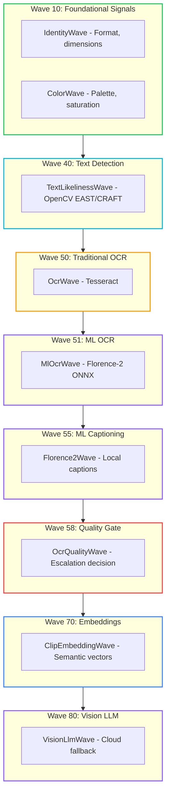

# Image Summarizer: A Constrained Fuzzy Image RAG Engine

<!-- category -- AI,Patterns,Architecture,LLM,DiSE -->

<datetime class="hidden">2026-01-06T17:00</datetime>

**Parts 1-3** described Constrained Fuzziness as an abstract pattern. This article applies those patterns to a working image analysis pipeline that demonstrates the principles in action.

- **[CLI Tool](https://github.com/scottgal/lucidrag/tree/main/src/Mostlylucid.ImageSummarizer.Cli)** - Command-line interface for image analysis
- **[Core Library](https://github.com/scottgal/lucidrag/tree/main/src/Mostlylucid.DocSummarizer.Images)** - The underlying image analysis library

> NOTE: Still tuning the system. But there's now a desktop version as well as the CLI. It works PRETTY well but some edges to smooth out.

### Reader Guide

This article serves multiple purposes. Navigate to what interests you:

- **Architecture patterns** → See "Wave Architecture", "Signal Contract", "The Ledger"
- **OCR details** → See [Part 4.1: OCR Pipeline](/blog/constrained-fuzzy-image-ocr-pipeline) for deep technical breakdown
- **CLI usage** → Jump to "The CLI: Using It"
- **GUI features** → See "Desktop GUI" section
- **Implementation** → Code examples throughout, full source on [GitHub](https://github.com/scottgal/lucidrag)


ImageSummarizer is a RAG ingestion pipeline for images that extracts structured metadata, text, captions, and visual signals using a **wave-based architecture**. The system escalates from fast local analysis (Florence-2 ONNX) to Vision LLMs only when needed.

**Key principles:**

- No autonomy (models never decide execution paths)
- No natural-language state (signals are typed, not prose)
- Models propose signals; deterministic policy decides what persists

ImageSummarizer demonstrates that multimodal LLMs can be used without surrendering determinism. The core rule: **probability proposes, determinism persists**.

> **Design rules**
>
> - Models never consume other models' prose
> - Natural language is never state
> - Escalation is deterministic thresholds
> - Every output carries confidence + provenance

[](http://unlicense.org/)
[](https://github.com/scottgal/lucidrag/releases)
[](https://github.com/scottgal/lucidrag/actions)
[](https://dotnet.microsoft.com/)

[toc]

---

## What It Does

The pipeline extracts structured metadata from images for RAG systems. Given any image or animated GIF, it produces:

- Extracted text (three-tier OCR: Tesseract → Florence-2 ONNX → Vision LLM fallback)
- Color palette (computed, not guessed)
- Quality metrics (sharpness, blur, exposure)
- Type classification (Photo, Screenshot, Diagram, Meme)
- Motion analysis (for animated images)
- Optional caption (Florence-2 local or Vision LLM, constrained by computed facts)
- Semantic embeddings (for vector search)

The key word is **structured**. Every output has confidence scores, source attribution, and evidence pointers. No model is the sole source of truth.

## Three-Tier OCR Strategy

> **Deep Dive**: The OCR pipeline is complex enough to warrant its own article. See [Part 4.1: The Three-Tier OCR Pipeline](/blog/constrained-fuzzy-image-ocr-pipeline) for the full technical breakdown including EAST, CRAFT, Real-ESRGAN, CLIP, and filmstrip optimization.

The system uses a three-tier escalation strategy for text extraction:


| Tier  | Method              | Speed  | Cost        | Best For                     |
| ----- | ------------------- | ------ | ----------- | ---------------------------- |
| **1** | **Tesseract**       | ~50ms  | Free        | Clean, high-contrast text    |
| **2** | **Florence-2 ONNX** | ~200ms | Free        | Stylized fonts, no API costs |
| **3** | **Vision LLM**      | ~1-5s  | $0.001-0.01 | Complex/garbled text         |

### Intelligent Routing

**ONNX text detection** ([EAST](https://github.com/argman/EAST), [CRAFT](https://github.com/clovaai/CRAFT-pytorch), ~20-30ms) determines the optimal path:

- **FAST route**: Florence-2 only (~100ms)
- **BALANCED route**: Florence-2 + Tesseract voting (~300ms)
- **QUALITY route**: Multi-frame analysis + Vision LLM (~1-5s)

### Supporting ONNX Models

- **[Real-ESRGAN](https://github.com/xinntao/Real-ESRGAN)**: 4× super-resolution for low-quality images (~500ms, free)
- **[CLIP](https://github.com/openai/CLIP)**: Semantic embeddings for image search (~100ms, free)

**Result**: ~1.16GB of local ONNX models that handle 85%+ of images without API costs.

---

## See It In Action

### Motion Detection & Animation Analysis


```bash
$ imagesummarizer demo-images/cat_wag.gif --pipeline caption --output text
Caption: A cat is sitting on a white couch.
Scene: indoor
Motion: MODERATE object_motion motion (partial coverage)
```

Motion phrases are only emitted when backed by optical flow measurements and frame deltas; otherwise the system falls back to neutral descriptors ("subtle motion", "camera movement", "object shifts").

### Meme & Subtitle Extraction


```bash
$ imagesummarizer demo-images/anchorman-not-even-mad.gif --pipeline caption --output text
"I'm not even mad."
"That's amazing."
Caption: A person wearing grey turtleneck sweater with neutral expression
Scene: meme
Motion: SUBTLE general motion (localized coverage)
```

The subtitle-aware frame deduplication detects text changes in the bottom 25% of frames, weighting bright pixels (white/yellow text) more heavily.

### Frame Strip Technology

For animated GIFs with subtitles, the tool creates horizontal frame strips for Vision LLM analysis. Three modes target different use cases:

**Text-Only Strip** (NEW! - 30× token reduction):

The most efficient mode extracts only text bounding boxes, dramatically reducing token costs:


```bash
$ imagesummarizer export-strip demo-images/anchorman-not-even-mad.gif --mode text-only
Detecting subtitle regions (bottom 30%)...
  Found 2 unique text segments
Saved text-only strip to: anchorman-not-even-mad_textonly_strip.png
  Dimensions: 253×105 (83% token reduction)
```


| Approach             | Dimensions   | Tokens  | Cost    |
| -------------------- | ------------ | ------- | ------- |
| Full frames (10)     | 3000×185    | ~1500   | High    |
| OCR strip (2 frames) | 600×185     | ~300    | Medium  |
| **Text-only strip**  | **253×105** | **~50** | **Low** |

**How it works**: OpenCV detects subtitle regions (bottom 30%), thresholds bright pixels (white/yellow text), extracts tight bounding boxes, and deduplicates based on text changes. The Vision LLM receives only the text regions, preserving all subtitle content while eliminating background pixels.

**OCR Mode Strip** (text changes only - 93 frames reduced to 2 frames):


```bash
$ imagesummarizer export-strip demo-images/anchorman-not-even-mad.gif --mode ocr
Deduplicating 93 frames (OCR mode - text changes only)...
  Reduced to 2 unique text frames
Saved ocr strip to: anchorman-not-even-mad_ocr_strip.png
  Dimensions: 600x185 (2 frames)
```

**Motion Mode Strip** (keyframes for motion inference):


```bash
$ imagesummarizer export-strip demo-images/cat_wag.gif --mode motion --max-frames 6
Extracting 6 keyframes from 9 frames (motion mode)...
  Extracted 6 keyframes for motion inference
Saved motion strip to: cat_wag_motion_strip.png
  Dimensions: 3000x280 (6 frames)
```

This allows Vision LLMs to read all subtitle text in a single API call, dramatically improving accuracy for memes and captioned content while minimizing token usage.

### Why Not Just Caption It?

This beats "just caption it with a frontier model" for the same reason an X-ray beats narration: the model is never asked to fill gaps. It receives a closed ledger-measured colors, tracked motion, deduped subtitle frames, OCR confidence-and only renders what the substrate already contains. When GPT-4o captions an image, it's guessing. When ImageSummarizer does, it's summarizing signals that already exist.

---

## The Wave Architecture

The system uses a **wave-based pipeline** where each wave is an independent analyzer that produces typed signals. **Waves execute in priority order (lower number runs first)**, and later waves can read signals from earlier ones.

> **Execution order**: Wave 10 runs before Wave 50 runs before Wave 80. Lower priority numbers execute earlier in the pipeline.



**Priority order** (lower runs first): 10 → 40 → 50 → 51 → 55 → 58 → 70 → 80

This is [Constrained Fuzzy MoM](/blog/constrained-mom-mixture-of-models) applied to image analysis: **multiple proposers publish to a shared substrate** (the `AnalysisContext`), and the final output aggregates their signals.

### Key Waves

- **TextLikelinessWave** (NEW): OpenCV EAST/CRAFT text detection (~5-20ms), determines routing decisions
- **OcrWave**: Traditional Tesseract OCR for clean text (Tier 1)
- **MlOcrWave**: Florence-2 ONNX runs locally (~200ms), handles stylized fonts (Tier 2)
- **Florence2Wave**: Local ML captioning when Vision LLM isn't needed
- **OcrQualityWave**: Spell-check gate, determines escalation path
- **VisionLlmWave**: Cloud-based Vision LLM, only runs when earlier waves fail or signal low confidence (Tier 3)

> **Note on wave ordering**: The three OCR **tiers** (Tesseract/Florence-2/Vision LLM) are the conceptual escalation levels. Individual waves like Advanced OCR or Quality Gate are **refinements** within those tiers, not separate escalation levels—they perform temporal stabilization and quality checks, respectively.

---

## The Signal Contract

Every wave produces signals using a standardized contract:

```csharp
public record Signal
{
    public required string Key { get; init; }      // "color.dominant", "ocr.quality.is_garbled"
    public object? Value { get; init; }             // The measured value
    public double Confidence { get; init; } = 1.0;  // 0.0-1.0 reliability score
    public required string Source { get; init; }    // "ColorWave", "VisionLlmWave"
    public DateTime Timestamp { get; init; }        // When produced
    public List<string>? Tags { get; init; }        // "visual", "ocr", "quality"
    public Dictionary<string, object>? Metadata { get; init; }  // Additional context
}
```

This is the Part 2 signal contract in action. Waves do not talk to each other via natural language. They publish typed signals to the shared context, and downstream waves can query those signals.

Note that `Confidence` is per-signal, not per-wave. A single wave can emit multiple signals with different epistemic strength-ColorWave's dominant color list has confidence 1.0 (computed), but individual color percentages use confidence as a weighting factor for downstream summarisation.

Confidence here means *reliability for downstream use*, not mathematical certainty. Deterministic signals are reproducible, not infallible-spell-check can be deterministically wrong about proper nouns.

> **Determinism caveat**: "Deterministic" means no sampling randomness and stable results for a given runtime and configuration. ONNX GPU execution providers may introduce minor numerical variance, which is acceptable for routing decisions. The signal contract (thresholds, escalation logic) remains fully deterministic.

---

### OCR Signal Taxonomy

To avoid confusion, here's the canonical OCR signal namespace used throughout the system:


| Signal Key                      | Source                 | Description                                    |
| ------------------------------- | ---------------------- | ---------------------------------------------- |
| `ocr.text`                      | Tesseract (Tier 1)     | Raw single-frame OCR                           |
| `ocr.confidence`                | Tesseract              | Tesseract confidence score                     |
| `ocr.ml.text`                   | Florence-2 (Tier 2)    | ML OCR single-frame                            |
| `ocr.ml.multiframe_text`        | Florence-2 (Tier 2)    | Multi-frame GIF OCR (preferred for animations) |
| `ocr.ml.confidence`             | Florence-2             | Florence-2 confidence score                    |
| `ocr.quality.spell_check_score` | OcrQualityWave         | Deterministic spell-check ratio                |
| `ocr.quality.is_garbled`        | OcrQualityWave         | Boolean escalation signal                      |
| `ocr.vision.text`               | VisionLlmWave (Tier 3) | Vision LLM OCR extraction                      |
| `caption.text`                  | VisionLlmWave          | Descriptive caption (separate from OCR)        |

**Important distinction**: `ocr.vision.text` is **text extraction** (OCR), while `caption.text` is **scene description** (captioning). Both may come from the same Vision LLM call, but serve different purposes.

**Final text selection priority** (highest to lowest):

1. `ocr.vision.text` (Vision LLM OCR, if escalated)
2. `ocr.ml.multiframe_text` (Florence-2 GIF)
3. `ocr.ml.text` (Florence-2 single-frame)
4. `ocr.text` (Tesseract)

---

## The Wave Interface

Each wave implements a simple interface:

```csharp
public interface IAnalysisWave
{
    string Name { get; }
    int Priority { get; }           // Lower number = runs earlier (10 before 50 before 80)
    IReadOnlyList<string> Tags { get; }

    Task<IEnumerable<Signal>> AnalyzeAsync(
        string imagePath,
        AnalysisContext context,    // Shared substrate with earlier signals
        CancellationToken ct);
}
```

The `AnalysisContext` is the **consensus space** from Part 2. Waves can:

- Read signals from earlier waves: `context.GetValue<bool>("ocr.quality.is_garbled")`
- Access cached intermediate results: `context.GetCached<Image<Rgba32>>("ocr.frames")`
- Add new signals that downstream waves can consume

---

## ColorWave: The Deterministic Foundation

ColorWave runs first (priority 10) and computes facts that constrain everything else:

```csharp
public class ColorWave : IAnalysisWave
{
    public string Name => "ColorWave";
    public int Priority => 10;  // Runs first (lowest priority number)
    public IReadOnlyList<string> Tags => new[] { "visual", "color" };

    public async Task<IEnumerable<Signal>> AnalyzeAsync(
        string imagePath,
        AnalysisContext context,
        CancellationToken ct)
    {
        var signals = new List<Signal>();

        using var image = await LoadImageAsync(imagePath, ct);

        // Extract dominant colors (computed, not guessed)
        var dominantColors = _colorAnalyzer.ExtractDominantColors(image);
        signals.Add(new Signal
        {
            Key = "color.dominant_colors",
            Value = dominantColors,
            Confidence = 1.0,  // Reproducible measurement
            Source = Name,
            Tags = new List<string> { "color" }
        });

        // Individual colors for easy access
        for (int i = 0; i < Math.Min(5, dominantColors.Count); i++)
        {
            var color = dominantColors[i];
            signals.Add(new Signal
            {
                Key = $"color.dominant_{i + 1}",
                Value = color.Hex,
                Confidence = color.Percentage / 100.0,
                Source = Name,
                Metadata = new Dictionary<string, object>
                {
                    ["name"] = color.Name,
                    ["percentage"] = color.Percentage
                }
            });
        }

        // Cache the image for other waves (no need to reload)
        context.SetCached("image", image.CloneAs<Rgba32>());

        return signals;
    }
}
```

The Vision LLM later receives these colors as **constraints**. It should not claim the image has "vibrant reds" if ColorWave computed that the dominant color is blue-and if it does, the contradiction is detectable and can be rejected downstream.

---

## OcrQualityWave: The Escalation Gate

This is where [Constrained Fuzziness](/blog/constrained-fuzziness-pattern) shines. OcrQualityWave is the **constrainer** that decides whether to escalate to expensive Vision LLM:

```csharp
public class OcrQualityWave : IAnalysisWave
{
    public string Name => "OcrQualityWave";
    public int Priority => 58;  // Runs after OCR waves
    public IReadOnlyList<string> Tags => new[] { "content", "ocr", "quality" };

    public async Task<IEnumerable<Signal>> AnalyzeAsync(
        string imagePath,
        AnalysisContext context,
        CancellationToken ct)
    {
        var signals = new List<Signal>();

        // Get OCR text from earlier waves (canonical taxonomy)
        string? ocrText =
            context.GetValue<string>("ocr.ml.multiframe_text") ??  // Florence-2 GIF
            context.GetValue<string>("ocr.ml.text") ??             // Florence-2 single
            context.GetValue<string>("ocr.text");                  // Tesseract

        if (string.IsNullOrWhiteSpace(ocrText))
        {
            signals.Add(new Signal
            {
                Key = "ocr.quality.no_text",
                Value = true,
                Confidence = 1.0,
                Source = Name
            });
            return signals;
        }

        // Tier 1: Spell check (deterministic, no LLM)
        var spellResult = _spellChecker.CheckTextQuality(ocrText);

        signals.Add(new Signal
        {
            Key = "ocr.quality.spell_check_score",
            Value = spellResult.CorrectWordsRatio,
            Confidence = 1.0,
            Source = Name,
            Metadata = new Dictionary<string, object>
            {
                ["total_words"] = spellResult.TotalWords,
                ["correct_words"] = spellResult.CorrectWords
            }
        });

        signals.Add(new Signal
        {
            Key = "ocr.quality.is_garbled",
            Value = spellResult.IsGarbled,  // < 50% correct words
            Confidence = 1.0,
            Source = Name
        });

        // This signal triggers Vision LLM escalation
        if (spellResult.IsGarbled)
        {
            signals.Add(new Signal
            {
                Key = "ocr.quality.correction_needed",
                Value = true,
                Confidence = 1.0,
                Source = Name,
                Tags = new List<string> { "action_required" },
                Metadata = new Dictionary<string, object>
                {
                    ["quality_score"] = spellResult.CorrectWordsRatio,
                    ["correction_method"] = "llm_sentinel"
                }
            });

            // Cache for Vision LLM to access
            context.SetCached("ocr.garbled_text", ocrText);
        }

        return signals;
    }
}
```

The escalation decision is **deterministic**: if spell check score < 50%, emit a signal that triggers Vision LLM. No probabilistic judgment. No "maybe we should ask the LLM". Just a threshold.

### Escalation in Action


```bash
$ imagesummarizer demo-images/arse_biscuits.gif --pipeline caption --output text
OCR: "ARSE BISCUITS"
Caption: An elderly man dressed as bishop with text reading "arse biscuits"
Scene: meme
```

OCR got the text; Vision LLM provided scene context. Each wave contributes what it's good at.

---

## VisionLlmWave: The Constrained Proposer

The Vision LLM wave only runs when earlier signals indicate it's needed. And when it does run, it's constrained by computed facts:

```csharp
public class VisionLlmWave : IAnalysisWave
{
    public string Name => "VisionLlmWave";
    public int Priority => 50;  // Runs after quality assessment
    public IReadOnlyList<string> Tags => new[] { "content", "vision", "llm" };

    public async Task<IEnumerable<Signal>> AnalyzeAsync(
        string imagePath,
        AnalysisContext context,
        CancellationToken ct)
    {
        var signals = new List<Signal>();

        if (!Config.EnableVisionLlm)
        {
            signals.Add(new Signal
            {
                Key = "vision.llm.disabled",
                Value = true,
                Confidence = 1.0,
                Source = Name
            });
            return signals;
        }

        // Check if OCR was unreliable (garbled text)
        var ocrGarbled = context.GetValue<bool>("ocr.quality.is_garbled");
        var textLikeliness = context.GetValue<double>("content.text_likeliness");
        var ocrConfidence = context.GetValue<double>("ocr.ml.confidence",
            context.GetValue<double>("ocr.confidence"));

        // Only escalate when: OCR failed OR (text likely but low OCR confidence)
        // Models never decide paths; deterministic signals do (no autonomy)
        bool shouldEscalate = ocrGarbled ||
                              (textLikeliness > 0.7 && ocrConfidence < 0.5);

        if (shouldEscalate)
        {
            var llmText = await ExtractTextAsync(imagePath, ct);

            if (!string.IsNullOrEmpty(llmText))
            {
                // Emit OCR signal (Vision LLM tier)
                signals.Add(new Signal
                {
                    Key = "ocr.vision.text",  // Vision LLM OCR extraction
                    Value = llmText,
                    Confidence = 0.95,  // High but not 1.0 - still probabilistic
                    Source = Name,
                    Tags = new List<string> { "ocr", "vision", "llm" },
                    Metadata = new Dictionary<string, object>
                    {
                        ["ocr_was_garbled"] = ocrGarbled,
                        ["escalation_reason"] = ocrGarbled ? "quality_gate_failed" : "low_confidence_high_likeliness",
                        ["text_likeliness"] = textLikeliness,
                        ["prior_ocr_confidence"] = ocrConfidence
                    }
                });

                // Optionally emit caption (separate signal)
                var llmCaption = await GenerateCaptionAsync(imagePath, ct);
                if (!string.IsNullOrEmpty(llmCaption))
                {
                    signals.Add(new Signal
                    {
                        Key = "caption.text",  // Descriptive caption (not OCR)
                        Value = llmCaption,
                        Confidence = 0.90,
                        Source = Name,
                        Tags = new List<string> { "caption", "description" }
                    });
                }
            }
        }

        return signals;
    }
}
```

The key insight: **Vision LLM text has confidence 0.95, not 1.0**. It's better than garbled OCR, but it's still probabilistic. The downstream aggregation knows this. (Why 0.95? Default prior, configured per model/pipeline, recorded in config. The exact value matters less than *having* a value that isn't 1.0.)

---

## The Ledger: Constrained Synthesis

The `ImageLedger` accumulates signals into structured sections for downstream consumption. This is [Context Dragging](/blog/constrained-fuzzy-context-dragging) applied to image analysis:

```csharp
public class ImageLedger
{
    public ImageIdentity Identity { get; set; } = new();
    public ColorLedger Colors { get; set; } = new();
    public TextLedger Text { get; set; } = new();
    public MotionLedger? Motion { get; set; }
    public QualityLedger Quality { get; set; } = new();
    public VisionLedger Vision { get; set; } = new();

    public static ImageLedger FromProfile(DynamicImageProfile profile)
    {
        var ledger = new ImageLedger();

        // Text: Priority order - corrected > voting > temporal > raw
        ledger.Text = new TextLedger
        {
            ExtractedText =
                profile.GetValue<string>("ocr.final.corrected_text") ??  // Tier 2/3 corrections
                profile.GetValue<string>("ocr.voting.consensus_text") ?? // Temporal voting
                profile.GetValue<string>("ocr.full_text") ??             // Raw OCR
                string.Empty,
            Confidence = profile.GetValue<double>("ocr.voting.confidence"),
            SpellCheckScore = profile.GetValue<double>("ocr.quality.spell_check_score"),
            IsGarbled = profile.GetValue<bool>("ocr.quality.is_garbled")
        };

        // Colors: Computed facts, not guessed
        ledger.Colors = new ColorLedger
        {
            DominantColors = profile.GetValue<List<DominantColor>>("color.dominant_colors") ?? new(),
            IsGrayscale = profile.GetValue<bool>("color.is_grayscale"),
            MeanSaturation = profile.GetValue<double>("color.mean_saturation")
        };

        return ledger;
    }

    public string ToLlmSummary()
    {
        var parts = new List<string>();

        parts.Add($"Format: {Identity.Format}, {Identity.Width}x{Identity.Height}");

        if (Colors.DominantColors.Count > 0)
        {
            var colorList = string.Join(", ",
                Colors.DominantColors.Take(5).Select(c => $"{c.Name}({c.Percentage:F0}%)"));
            parts.Add($"Colors: {colorList}");
        }

        if (!string.IsNullOrWhiteSpace(Text.ExtractedText))
        {
            var preview = Text.ExtractedText.Length > 100
                ? Text.ExtractedText[..100] + "..."
                : Text.ExtractedText;
            parts.Add($"Text (OCR, {Text.Confidence:F0}% confident): \"{preview}\"");
        }

        return string.Join("\n", parts);
    }
}
```

The ledger is the **anchor** in CFCD terms. It carries forward what survived selection, and the LLM synthesis must respect these facts.

---

## The Escalation Decision

You've seen escalation logic in two places: `OcrQualityWave` emits *signals* about quality; `EscalationService` applies *policy* across those signals. This is intentional separation:

- **Wave-local escalation**: Each wave emits facts about its domain (e.g., "OCR is garbled")
- **Service-level escalation**: `EscalationService` aggregates signals and applies global thresholds

The `EscalationService` ties it all together. It implements the Part 1 pattern: **substrate → proposer → constrainer**:

```csharp
public class EscalationService
{
    private bool ShouldAutoEscalate(ImageProfile profile)
    {
        // Escalate if type detection confidence is low
        if (profile.TypeConfidence < _config.ConfidenceThreshold)
            return true;

        // Escalate if image is blurry
        if (profile.LaplacianVariance < _config.BlurThreshold)
            return true;

        // Escalate if high text content
        if (profile.TextLikeliness >= _config.TextLikelinessThreshold)
            return true;

        // Escalate for complex diagrams or charts
        if (profile.DetectedType is ImageType.Diagram or ImageType.Chart)
            return true;

        return false;
    }
}
```

Every escalation decision is **deterministic**: same inputs, same thresholds, same decision. No LLM judgment in the escalation logic.

---

## The Vision LLM Prompt: Evidence Constraints

When the Vision LLM does run, it receives the computed facts as constraints:

```csharp
private static string BuildVisionPrompt(ImageProfile profile)
{
    var prompt = new StringBuilder();

    prompt.AppendLine("CRITICAL CONSTRAINTS:");
    prompt.AppendLine("- Only describe what is visually present in the image");
    prompt.AppendLine("- Only reference metadata values provided below");
    prompt.AppendLine("- Do NOT infer, assume, or guess information not visible");
    prompt.AppendLine();

    prompt.AppendLine("METADATA SIGNALS (computed from image analysis):");

    if (profile.DominantColors?.Any() == true)
    {
        prompt.Append("Dominant Colors: ");
        var colorDescriptions = profile.DominantColors
            .Take(3)
            .Select(c => $"{c.Name} ({c.Percentage:F0}%)");
        prompt.AppendLine(string.Join(", ", colorDescriptions));

        if (profile.IsMostlyGrayscale)
            prompt.AppendLine("  → Image is mostly grayscale");
    }

    prompt.AppendLine($"Sharpness: {profile.LaplacianVariance:F0} (Laplacian variance)");
    if (profile.LaplacianVariance < 100)
        prompt.AppendLine("  → Image is blurry or soft-focused");

    prompt.AppendLine($"Detected Type: {profile.DetectedType} (confidence: {profile.TypeConfidence:P0})");

    prompt.AppendLine();
    prompt.AppendLine("Use these metadata signals to guide your description.");
    prompt.AppendLine("Your description should be grounded in observable facts only.");

    return prompt.ToString();
}
```

The Vision LLM should not claim "vibrant colors" if we computed grayscale-if it does, the contradiction is detectable. It should not claim "sharp details" if we computed low Laplacian variance-if it does, we can reject the output. The **deterministic substrate constrains the probabilistic output**.

These constraints reduce hallucination but cannot eliminate it-prompts are suggestions, not guarantees. Real enforcement happens downstream via confidence weighting and signal selection. The prompt is one layer; the architecture is the other.

---

## Output Text Priority

When extracting the final text, the system uses a strict priority order:

```csharp
static string? GetExtractedText(DynamicImageProfile profile)
{
    // Priority chain using canonical signal names (see OCR Signal Taxonomy above)
    //   1. Vision LLM OCR (best for complex/garbled)
    //   2. Florence-2 multi-frame GIF (temporal stability)
    //   3. Florence-2 single-frame (stylized fonts)
    //   4. Tesseract (baseline)

    var visionText = profile.GetValue<string>("ocr.vision.text");
    if (!string.IsNullOrEmpty(visionText))
        return visionText;

    var florenceMulti = profile.GetValue<string>("ocr.ml.multiframe_text");
    if (!string.IsNullOrEmpty(florenceMulti))
        return florenceMulti;

    var florenceText = profile.GetValue<string>("ocr.ml.text");
    if (!string.IsNullOrEmpty(florenceText))
        return florenceText;

    return profile.GetValue<string>("ocr.text") ?? string.Empty;
}
```

**Note**: This selects ONE source, but the ledger exposes ALL sources with provenance. Downstream consumers can inspect `profile.Ledger.Signals` to see all OCR attempts and their confidence scores.

Each source has known reliability:

- **Vision LLM**: Best for complex scenes, charts, diagrams (confidence 0.95, high cost)
- **Florence-2**: Good for stylized fonts, runs locally (confidence 0.85-0.90, no cost)
- **Tesseract voting**: Reliable for clean text (confidence varies, deterministic)
- **Raw Tesseract**: Baseline fallback (confidence < 0.7 for stylized fonts)

The priority order encodes this knowledge. Florence-2 sitting between Vision LLM and Tesseract provides a "sweet spot" for most images—better than traditional OCR, cheaper than cloud Vision LLMs.

Note: this function selects *one* source, but the ledger exposes *all* sources with their confidence scores. Downstream consumers can-and should-inspect provenance when the domain requires it. The priority order is a sensible default, not a straitjacket.

---

## Selection and Conflict Resolution

The priority chain above is the current implementation-a simple fallback. But the architecture supports adding rejection rules as config-driven policy. Here's the pattern for contradiction detection (not yet implemented, but the signals exist to support it):

```csharp
// Pattern: Contradiction detection as policy rules
public static class SelectionPolicy
{
    public static string? SelectTextWithConstraints(DynamicImageProfile profile)
    {
        var visionText = profile.GetValue<string>("vision.llm.text");
        if (!string.IsNullOrEmpty(visionText))
        {
            // Rule: Reject if Vision claims text but deterministic signals say no text
            var textLikeliness = profile.GetValue<double>("content.text_likeliness");
            if (textLikeliness < _config.TextLikelinessThreshold && visionText.Length > 50)
            {
                // Contradiction detected - log and fall through
                profile.AddSignal(new Signal
                {
                    Key = "selection.vision_rejected",
                    Value = "text_likeliness_contradiction",
                    Confidence = 1.0,
                    Source = "SelectionPolicy",
                    Metadata = new Dictionary<string, object>
                    {
                        ["text_likeliness"] = textLikeliness,
                        ["vision_text_length"] = visionText.Length,
                        ["threshold"] = _config.TextLikelinessThreshold
                    }
                });
                // Fall through to OCR sources
            }
            else
            {
                return visionText;
            }
        }

        // Continue with priority chain...
        return profile.GetValue<string>("ocr.voting.consensus_text")
            ?? profile.GetValue<string>("ocr.full_text");
    }
}
```

The same pattern applies to other signal types:

- **Color contradiction**: Reject caption claiming "vibrant reds" if `color.is_grayscale` is true
- **Sharpness contradiction**: Reject caption claiming "sharp details" if `quality.sharpness` < threshold
- **Type contradiction**: Reject caption claiming "a person" if `content.type` is Diagram with high confidence

The key properties of the selection layer:

- **Priority chain**: Each source has a defined fallback order, not ad-hoc selection
- **Quality gate upstream**: OCR is accepted when the deterministic gate says it's not garbled (< 50% correct words triggers escalation, not rejection)
- **Extension point**: Contradiction rules are config-driven and versioned like any other policy
- **Audit trail**: Rejections emit signals with observed values and thresholds

This is where "determinism persists" becomes mechanically true. The LLM proposes; deterministic rules decide whether to accept.

---

## JSON Pipeline Configuration

Pipelines are fully configurable via JSON, making the wave composition explicit and auditable:

```json
{
  "name": "advancedocr",
  "displayName": "Advanced OCR (Default)",
  "description": "Multi-frame temporal OCR with stabilization and voting",
  "estimatedDurationSeconds": 2.5,
  "accuracyImprovement": 25,
  "phases": [
    {
      "id": "color",
      "name": "Color Analysis",
      "priority": 100,
      "waveType": "ColorWave",
      "enabled": true
    },
    {
      "id": "simple-ocr",
      "name": "Simple OCR",
      "priority": 60,
      "waveType": "OcrWave",
      "earlyExitThreshold": 0.98
    },
    {
      "id": "advanced-ocr",
      "name": "Advanced Multi-Frame OCR",
      "priority": 59,
      "waveType": "AdvancedOcrWave",
      "dependsOn": ["simple-ocr"],
      "parameters": {
        "maxFrames": 30,
        "ssimThreshold": 0.95,
        "enableVoting": true
      }
    },
    {
      "id": "quality",
      "name": "OCR Quality Assessment",
      "priority": 58,
      "waveType": "OcrQualityWave",
      "dependsOn": ["advanced-ocr"]
    }
  ]
}
```

Early exit thresholds let expensive waves skip when cheap waves already achieved high confidence. This is budget management from Part 1.

---

## The Auto Pipeline: Intelligent Routing

The `auto` pipeline implements smart routing based on image characteristics, selecting the optimal processing path:

```
Image Analysis (OpenCV ~5-20ms)
    │
    ├── Is animated (>1 frame)?
    │   └── ANIMATED route
    │       ├── Has subtitle regions? → Text-only strip extraction
    │       ├── Minimal text? → FAST (Florence-2 only)
    │       └── Motion significant? → Motion analysis
    │
    ├── Has text regions (OpenCV detection)?
    │   ├── High contrast, clean text → FAST route (Florence-2, ~100ms)
    │   ├── Moderate confidence → BALANCED route (Florence-2 + Tesseract, ~300ms)
    │   └── Low confidence → QUALITY route (Multi-frame + Vision LLM, ~1-5s)
    │
    ├── Is chart/diagram (type detection)?
    │   └── QUALITY route → Vision LLM caption
    │
    └── Default → FAST route (Florence-2 caption)
```

### Route Performance


| Route    | Triggers When                                    | Processing                    | Time   | Cost         |
| -------- | ------------------------------------------------ | ----------------------------- | ------ | ------------ |
| FAST     | Simple text, high contrast, standard fonts       | Florence-2 only               | ~100ms | Low (local)  |
| BALANCED | Normal text, moderate confidence                 | Florence-2 + Tesseract voting | ~300ms | Low (local)  |
| QUALITY  | Charts, diagrams, stylized fonts, low confidence | Multi-frame + Vision LLM      | ~1-5s  | Medium (API) |
| ANIMATED | GIFs with subtitles                              | Text-only strip + filmstrip   | ~2-3s  | Medium (API) |

### Real Example: Auto Route Selection

```bash
$ imagesummarizer anchorman-not-even-mad.gif --pipeline auto --output visual
[Route selection...]
  Image: 300×185, 93 frames
  Text detection: 15 regions found (bottom 30%)
  Subtitle pattern: DETECTED
  → Selected ANIMATED route (text-only filmstrip)

[Processing...]
  MlOcrWave: Extracted 10 frames → 2 unique text segments
  Text-only strip: 253×105 (83% token reduction)
  VisionLlmWave: Processing filmstrip...

[Results - 2.3s total]
Text: "I'm not even mad." + "That's amazing."
Caption: A person wearing grey turtleneck sweater with neutral expression
Scene: meme
Motion: SUBTLE general motion
```

The routing decision is deterministic and recorded in signals for audit:

```json
{
  "routing": {
    "selected_route": "ANIMATED",
    "reason": "subtitle_pattern_detected",
    "text_regions": 15,
    "frames": 93,
    "decision_time_ms": 18
  }
}
```

---

## The CLI: Using It

### Basic Usage

```bash
# Use auto pipeline (smart routing - recommended)
imagesummarizer meme.gif --pipeline auto

# Fast local caption with Florence-2 ONNX (~200ms)
imagesummarizer photo.jpg --pipeline florence2

# Best quality: Florence-2 + Vision LLM
imagesummarizer complex-diagram.png --pipeline florence2+llm

# Extract text only (three-tier OCR)
imagesummarizer screenshot.png --pipeline advancedocr

# Motion analysis for GIFs
imagesummarizer animation.gif --pipeline motion

# Process a directory with visual output
imagesummarizer ./photos/ --output visual
```

### Signal Collections

Request only the signals you need using pre-defined collections:

```bash
# Minimal metadata (fast)
imagesummarizer image.png --signals "@minimal"

# Alt text for accessibility
imagesummarizer image.png --signals "@alttext"

# Motion analysis
imagesummarizer animation.gif --signals "@motion"

# Full analysis
imagesummarizer image.png --signals "@full"

# Custom wildcard patterns
imagesummarizer image.png --signals "color.dominant*, ocr.text, motion.*"
```


| Collection | Signals                                 | Use Case           |
| ---------- | --------------------------------------- | ------------------ |
| `@minimal` | identity.*, quality.sharpness           | Fast profile only  |
| `@alttext` | caption.text, ocr.text, color.dominant* | Accessibility      |
| `@motion`  | motion.*, identity.frame_count          | Animation analysis |
| `@full`    | All signals                             | Complete analysis  |
| `@tool`    | Optimized subset                        | MCP/automation     |

### Real JSON Output

```bash
$ imagesummarizer princess-bride.gif --output json
```

```json
{
  "image": "princess-bride.gif",
  "duration_ms": 1838,
  "waves_executed": ["ColorWave", "OcrWave", "AdvancedOcrWave", "VisionLlmWave"],
  "text": {
    "value": "You keep using that word.\nI do not think it means what you think it means.",
    "source": "ocr.voting.consensus_text",
    "confidence": 0.95
  },
  "escalation": {
    "triggered": true,
    "reason": "text_likeliness_above_threshold",
    "threshold": 0.4,
    "observed": 0.67
  },
  "signals": {
    "color.dominant_1": { "value": "#1a1a2e", "confidence": 1.0 },
    "ocr.quality.spell_check_score": { "value": 0.82, "confidence": 1.0 },
    "ocr.quality.is_garbled": { "value": false, "confidence": 1.0 },
    "motion.type": { "value": "static", "confidence": 0.95 }
  }
}
```

Every field has provenance. The `escalation` block shows *why* the Vision LLM was called.

### Motion Analysis


```bash
$ imagesummarizer demo-images/alanshrug_opt.gif --pipeline motion
Motion: SUBTLE general motion (localized coverage)
Direction: up-down
Magnitude: 0.23
```

### Interactive Mode

```bash
$ imagesummarizer
ImageSummarizer Interactive Mode
Pipeline: advancedocr | Output: auto | LLM: auto
Commands: /help, /pipeline, /output, /llm, /model, /ollama, /models, /quit

Enter image path (or drag & drop): F:\Gifs\meme.gif
Processing...
I'm not even mad. That's amazing.

Enter image path: /llm true
Vision LLM: enabled

Enter image path: /model minicpm-v:8b
Vision model: minicpm-v:8b
```

### Desktop GUI

For visual exploration, the desktop application provides:

- **Drag & drop interface**: Drop images for instant analysis
- **Live signal log**: Watch waves execute in real-time with confidence coloring
- **Model status indicators**: Traffic light system (🟢 Ready, 🟡 Processing, 🔴 Failed)
- **Animated GIF preview**: See filmstrip generation and frame extraction
- **Signal inspector**: Click any signal to see full provenance and metadata
- **Pipeline selector**: Switch between auto/florence2/quality/motion modes
- **Export options**: Copy signals as JSON, save filmstrips, export text

The desktop GUI demonstrates the architecture visually—you can see exactly which waves ran, what signals they emitted, and how the routing decisions were made. Perfect for understanding the system or debugging custom pipelines.

The CLI exposes all the complexity as simple options. You can switch pipelines, models, and output formats without understanding the wave architecture.

---

## Where the Patterns Appear


| Part | Pattern                                                          | ImageSummarizer Implementation                                          |
| ---- | ---------------------------------------------------------------- | ----------------------------------------------------------------------- |
| 1    | [Constrained Fuzziness](/blog/constrained-fuzziness-pattern)     | ColorWave computes facts; VisionLlmWave respects them                   |
| 2    | [Constrained Fuzzy MoM](/blog/constrained-mom-mixture-of-models) | Multiple waves publish to AnalysisContext; WaveOrchestrator coordinates |
| 3    | [Context Dragging](/blog/constrained-fuzzy-context-dragging)     | ImageLedger accumulates salient features; SignalDatabase caches results |

Same patterns. Different domain. Same rule: **probability proposes, determinism persists**.

---

## What You Get

- **RAG-ready output**: Structured JSON with confidence scores, not prose
- **Local-first processing**: Florence-2 ONNX runs locally (~200ms), no API costs for most images
- **Intelligent routing**: Auto pipeline selects optimal path (FAST/BALANCED/QUALITY)
- **Token efficiency**: Text-only strips achieve 30× token reduction for GIF subtitles
- **Auditable decisions**: Every escalation has an explicit reason with provenance
- **Model-agnostic**: Swap Ollama for OpenAI or Anthropic without changing architecture
- **Cached by content**: Same image = same analysis, even if renamed (SQLite cache, 2-10ms hits)
- **Desktop GUI**: Drag-and-drop interface with live signal visualization
- **MCP server mode**: Integrate with any LLM that supports Model Context Protocol (Claude Desktop, etc.)
- **Signal-based API**: Request only what you need using wildcard patterns or collections

## What It Costs

- **Cognitive overhead**: You must understand the signal contract, wave priorities, and escalation logic before writing a single wave. This punishes sloppy thinking.
- **Spec discipline**: Every signal key needs a clear definition. Every confidence score needs a rationale. You cannot hand-wave "the model figures it out".
- **Per-wave complexity**: Each wave has its own configuration, edge cases, and failure modes. Debugging happens at the wave level, not the pipeline level.
- **Testing surface**: More components means more tests. Mock the context, assert the signals, verify the escalation paths.
- **Upfront investment**: You define waves, signals, and ledger structure before you see results. The payoff comes later.

This is not the fast path. It's the reliable path. Worth it if you need auditable image understanding at scale; overkill if you just need captions for a photo gallery.

---

## Failure Modes and How This Handles Them


| Failure Mode                   | What Happens                         | How It's Handled                                                                                                                             |
| ------------------------------ | ------------------------------------ | -------------------------------------------------------------------------------------------------------------------------------------------- |
| **Noisy GIF**                  | Frame jitter, compression artifacts  | Temporal stabilisation + SSIM deduplication + voting consensus + text-only strip extraction                                                  |
| **OCR returns garbage**        | Tesseract fails on stylized fonts    | Spell-check gate detects < 50% correct → escalates to Florence-2 → Vision LLM if still poor                                                |
| **High API costs**             | Too many cloud Vision LLM calls      | Florence-2 ONNX handles 80%+ locally (~200ms), text-only strips reduce tokens 30× for GIFs                                                  |
| **Vision hallucinates**        | LLM claims text that isn't there     | Signals enable contradiction detection (pattern shown above); downstream consumers can compare`vision.llm.text` vs `content.text_likeliness` |
| **Pipeline changes over time** | New waves added, thresholds adjusted | Content-hash caching + full provenance in every signal + version tracking                                                                    |
| **Model returns nothing**      | Vision LLM timeout or empty response | Fallback chain: Vision LLM → Florence-2 → Tesseract voting → Raw OCR; priority order ensures graceful degradation                         |

Every failure mode has a deterministic response. No silent degradation.

---

## The Bigger Picture: Multi-Modal Graph RAG

> **Important Context**: ImageSummarizer is the **image ingestion pipeline** for the LucidRAG ecosystem.

This article focuses on extracting structured signals from images. But the real power emerges when combined with the other summarizers:

- **[DocSummarizer](https://github.com/scottgal/lucidrag)** - Structured document analysis (PDFs, markdown, code)
- **[DataSummarizer](https://github.com/scottgal/lucidrag)** - Tabular data profiling (CSV, databases)
- **ImageSummarizer** (this article) - Image and animation analysis

When hooked together with **LucidRAG** (coming soon!), these three pipelines enable **multi-modal graph RAG**:

```
Document → DocSummarizer → Structured signals
    ↓
Images → ImageSummarizer → Structured signals
    ↓
Data → DataSummarizer → Structured signals
    ↓
    ↓ (all signals)
    ↓
LucidRAG Graph Builder → Multi-modal knowledge graph
    ↓
Query → Multi-modal retrieval + constrained generation
```

**Why this matters**: Traditional RAG treats images as opaque blobs that get captioned. Multi-modal graph RAG treats images as **first-class signal sources** with typed relationships to text, data, and other images. Same determinism principles, different scale.

The pattern scales: if you can extract structured signals from images (this article), documents ([DocSummarizer](/blog/building-a-document-summarizer-with-rag)), and data ([DataSummarizer](/blog/datasummarizer-how-it-works)), you can build a knowledge graph where every node carries provenance and every edge has confidence scores.

**Coming soon**: Full LucidRAG integration showing how these pipelines compose into multi-modal graph RAG queries. Same architectural principles, unified signal substrate.


---

## Conclusion

The architecture has structure: every wave is independent, every signal is typed, every escalation is deterministic. Florence-2 provides fast local analysis, Vision LLM handles complex cases, but neither operates unconstrained—deterministic signals always anchor the output.

Since the initial article publication, the system has evolved significantly:

- **Florence-2 ONNX integration** cuts API costs and latency (~200ms local vs ~1-5s cloud)
- **Text-only filmstrips** achieve 30× token reduction for GIF subtitles
- **Auto pipeline** selects optimal routing based on image characteristics
- **Signal collections** simplify common use cases (@alttext, @motion, @minimal)
- **Desktop GUI** provides drag-and-drop analysis with live signal visualization

The OCR pipeline alone—with its three-tier escalation, multi-frame voting, filmstrip optimization, and text-only strip extraction—has become complex enough to warrant its own detailed article. See the [Vision OCR Integration](https://github.com/scottgal/lucidrag/blob/main/src/Mostlylucid.DocSummarizer.Images/docs/vision-ocr-integration.md) guide for the full technical breakdown.

If you can do this for images—the messiest input type, with OCR noise, stylized fonts, animated frames, and hallucination-prone captions—you can do it for any probabilistic component.

That's Constrained Fuzziness in practice. Not an abstract pattern. Working code.

---

## Resources

### Repository

- **[LucidRAG Repository](https://github.com/scottgal/lucidrag)** - Full source code

### CLI Tool

- **[ImageSummarizer CLI](https://github.com/scottgal/lucidrag/tree/main/src/Mostlylucid.ImageSummarizer.Cli)** - Command-line tool for image analysis
- **[CLI README](https://github.com/scottgal/lucidrag/blob/main/src/Mostlylucid.ImageSummarizer.Cli/README.md)** - Installation, usage, and configuration
- **[Demo Images](https://github.com/scottgal/lucidrag/tree/main/src/Mostlylucid.ImageSummarizer.Cli/demo-images)** - Sample GIFs and frame strips shown in this article

### Core Library

- **[DocSummarizer.Images](https://github.com/scottgal/lucidrag/tree/main/src/Mostlylucid.DocSummarizer.Images)** - Core image analysis library
- **[Library README](https://github.com/scottgal/lucidrag/blob/main/src/Mostlylucid.DocSummarizer.Images/README.md)** - API documentation, wave architecture, and integration guide
- **[Architecture Guide](https://github.com/scottgal/lucidrag/blob/main/src/Mostlylucid.DocSummarizer.Images/docs/architecture.md)** - Waves, signals, escalation, caching
- **[Pipeline Documentation](https://github.com/scottgal/lucidrag/blob/main/src/Mostlylucid.DocSummarizer.Images/docs/pipelines.md)** - Auto, balanced, quality, florence2+llm
- **[Vision OCR Integration](https://github.com/scottgal/lucidrag/blob/main/src/Mostlylucid.DocSummarizer.Images/docs/vision-ocr-integration.md)** - Routing, filmstrips, token economics
- **[Motion Analysis](https://github.com/scottgal/lucidrag/blob/main/src/Mostlylucid.DocSummarizer.Images/docs/motion.md)** - GIF frame extraction, motion detection
- **[Signals Reference](https://github.com/scottgal/lucidrag/blob/main/src/Mostlylucid.DocSummarizer.Images/docs/signals.md)** - Signal catalog, collections, wildcard syntax

### Related Articles

- [DocSummarizer](/blog/building-a-document-summarizer-with-rag) - The document analysis pipeline using similar patterns
- [DataSummarizer](/blog/datasummarizer-how-it-works) - Data profiling with the same determinism-first approach

---

## The Series


| Part | Pattern                                                                   | Axis                            |
| ---- | ------------------------------------------------------------------------- | ------------------------------- |
| 1    | [Constrained Fuzziness](/blog/constrained-fuzziness-pattern)              | Single component                |
| 2    | [Constrained Fuzzy MoM](/blog/constrained-mom-mixture-of-models)          | Multiple components             |
| 3    | [Context Dragging](/blog/constrained-fuzzy-context-dragging)              | Time / memory                   |
| 4    | **Image Intelligence (this article)**                                     | **Wave architecture, patterns** |
| 4.1  | [The Three-Tier OCR Pipeline](/blog/constrained-fuzzy-image-ocr-pipeline) | OCR, ONNX models, filmstrips    |

**Next**: Part 5 will show how ImageSummarizer, [DocSummarizer](/blog/building-a-document-summarizer-with-rag), and [DataSummarizer](/blog/datasummarizer-how-it-works) compose into multi-modal graph RAG with LucidRAG.

All parts follow the same invariant: **probabilistic components propose; deterministic systems persist**.
