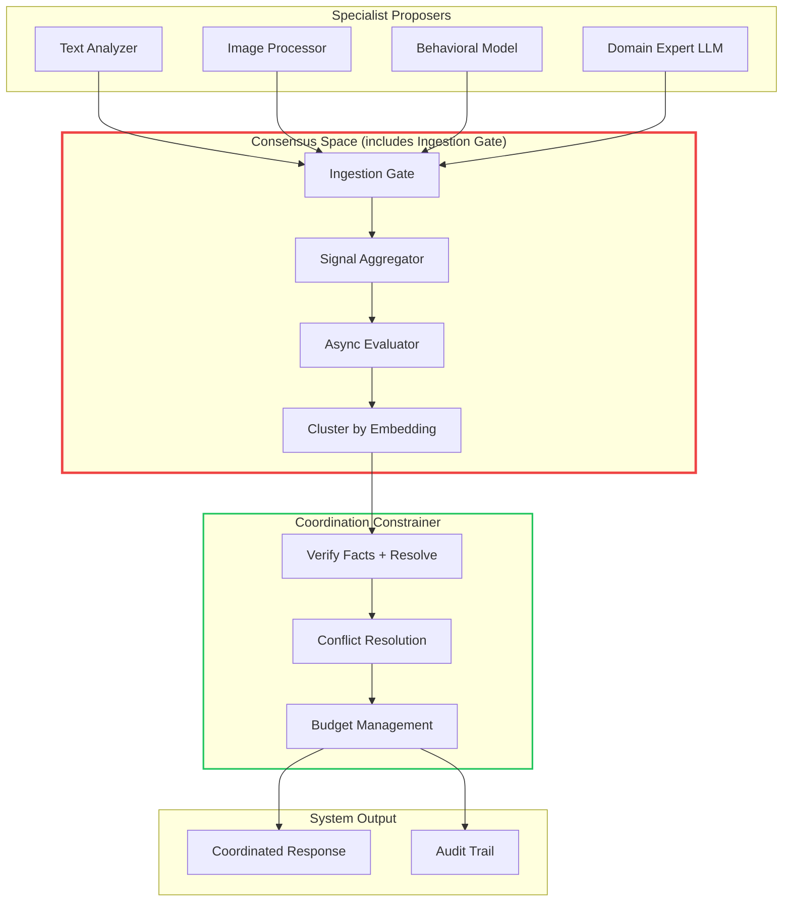
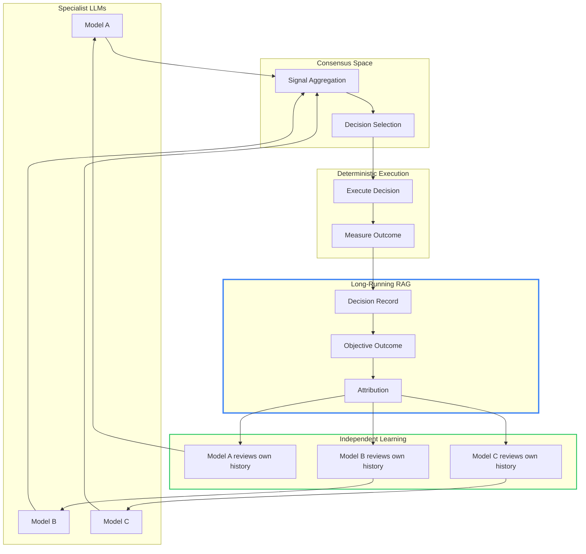

# Constrained Fuzzy MoM: Signal Contracts Over Agent Chatter

<!-- category -- AI,Patterns,Architecture,LLM,DiSE -->
<datetime class="hidden">2026-01-06T15:00</datetime>

[Part 1](/blog/constrained-fuzziness-pattern) described a pipeline: Substrate, Proposer, Constrainer. One probabilistic component, bounded by deterministic truth.

But what happens when you have *multiple* proposers? Multiple LLMs? Vision models talking to text models? Heuristics feeding into neural networks?

That is Constrained Fuzzy MoM (CFMoM): **constrained selection from multiple proposers**, validated against shared truth. Not "let many models talk". Not routing.

> *CFMoM is a pattern where multiple probabilistic components propose signals, but only deterministic logic may combine, validate, or act on them.*

The rule:

1. **Models publish signals.** No natural language between components.
2. **Substrate stores facts and evidence.** Typed, schema-validated, with pointers to source.
3. **Constrainer decides.** Cross-validates, resolves conflicts, enforces thresholds.

> "In multi-agent systems, the shared substrate is the language, and the constrainer is the grammar."

[TOC]

---

## Terminology

Before diving in, fix the vocabulary:

| Term | Meaning |
|------|---------|
| **CFMoM** | Constrained Fuzzy MoM: constrained selection from multiple proposers |
| **Substrate** | Facts + evidence + budgets (deterministic) |
| **Signal Contract** | How components write into the substrate |
| **Consensus Space** | Store + routing + async evaluation |
| **Coordination Constrainer** | Final gatekeeper for actions/output |

**Note:** Consensus Space is a bus and memory, not an arbiter. It may perform ingestion-time validation (schema, evidence existence) but never makes decisions. Decisions live in the constrainer.

These are not new concepts. They are the Part 1 pattern extended across components.

### Invariants

These are non-negotiable:

- **Only the constrainer can trigger side effects.**
- **Facts must validate against schema at ingestion.** Reject otherwise.
- **Evidence must be pointer-verifiable.** No prose citations.
- **Signals are immutable.** Once published, never modified.
- **Canonicalisation happens at ingestion.** Constrainer assumes canonical facts.
- **Cross-source confidence is not comparable unless calibrated.**
- **All decisions produce an audit record.**

---

## What This Is Not

| Thing | Why CFMoM Is Different |
|-------|------------------------|
| **Mixture of Experts (MoE)** | MoE mixes model outputs mathematically. CFMoM mixes *signals under constraints* with evidence and policy. |
| **Agent chatter** | Many agent systems pass free-form messages between components. CFMoM forbids free-form inter-component messages; only typed signals enter the substrate. |
| **Routing** | Routing selects *which model to call*. CFMoM accepts multiple proposals and constrains selection post-hoc. |
| **Voting/Ensembles** | Voting assumes outputs are comparable. CFMoM requires fact-level agreement before comparison. |
| **LangChain-style graphs** | Graphs pass messages. CFMoM publishes immutable signals to a shared substrate. |

CFMoM is not a library or framework. It is an epistemic rule: **probabilistic components may propose, but only deterministic, evidence-backed logic may combine or act.**

---

## Why LLM-to-LLM Communication Fails

When two LLMs communicate via natural language, you get compounding failures. Even if every hop is mostly correct, errors compound faster than you expect.

**Semantic drift**: Each model interprets slightly differently. Model A says "the user seems frustrated." Model B reads that as "the user is angry." Model C escalates to "hostile user detected." Three hops, three interpretations, one wrong conclusion.

**Confidence laundering**: Model A is 80% sure of something. It tells Model B in fluent prose. Model B treats it as fact because the language sounds certain. Uncertainty gets washed out at each hop.

**Hallucination amplification**: Model A invents a plausible detail. Model B builds on it. Model C cites it as established. The hallucination becomes load-bearing.

**Format instability**: Model A outputs JSON. Sometimes. Model B parses it. Sometimes. Silent failures propagate.

The instinct is to add more prompting to enforce format. But soft constraints fail between components just like they fail within components.

The fix: force all inter-component communication through a shared deterministic space.

### What "Models Do Not Talk" Means in Practice

This is the hard rule. Spell it out:

- **Models never ingest other models' outputs directly.** No "summarise what Model A said".
- **They only ingest substrate records** that passed schema + evidence checks at ingestion.
- **Human-facing explanation is generated last** and is never fed back into the system.
- **If you find yourself writing a prompt that references another model's response**, you have violated the pattern.

This kills the "but my agent can summarize the other agent" loophole. That loophole is how semantic drift starts.

---

## The Signal Contract

The heart of the pattern is a typed record that every component must use. No prose. No free-form output. Slots that must be filled.

### Evidence References

First, define what "evidence" means:

```csharp
public record EvidenceRef(
    string Kind,                    // "chunk", "frame", "timestamp", "request", "row"
    string Store,                   // namespace (e.g., "documents", "video-frames")
    string Id,                      // chunk-12, frame-0042, t=00:13:21.200, req-abc
    JsonElement? Locator = null,    // span, bbox, row-range - schema depends on Kind
    string? ContentHash = null      // optional hash for version verification
);
```

This is not a string. It is a pointer to verifiable source material. Every claim must cite what it is based on. The `Locator` field handles spans, bounding boxes, timestamps, or any other location scheme - its schema is determined by `Kind`.

### The ConstrainedSignal Record

```csharp
public record EmbeddingRef(string ModelId, float[] Vector);

public record ConstrainedSignal(
    string Id,                                      // stable identifier
    string SourceId,                                // component name/version
    string FactsSchemaId,                           // "bot-detection/1.0", "summarization/2.1"
    DateTimeOffset At,                              // when produced
    string? CorrelationId,                          // ties signals to one input/request
    string? SubjectId,                              // what this signal is about, if known
    JsonElement Facts,                              // schema-validated, not ad-hoc object
    IReadOnlyList<EvidenceRef> Evidence,            // what it's based on
    float Confidence,                               // self-estimated probability of correctness
    IReadOnlyList<EmbeddingRef>? Embeddings = null  // optional, supports multi-model migration
);
```

### Why This Works

- **Facts are schema-validated at ingestion**: `FactsSchemaId` points to a schema that defines what `palette_dominant_hue` means, what type it is, what units it uses. No ad-hoc `Dictionary<string, object>`. Schemas are JSON Schema (or equivalent), versioned and pinned.
- **Canonicalisation happens at ingestion**: Stable types, stable units, stable normalisation. Timestamps are ISO 8601. Colors are hex. Coordinates are WGS84. The constrainer assumes canonical facts.
- **Evidence is structured**: Pointers to verifiable source material, not prose descriptions.
- **Confidence is defined**: "Self-estimated probability of correctness". Uncalibrated confidence is never compared across sources. In the constrainer, treat cross-source confidence as a weight only after calibration; otherwise use per-source thresholds.
- **Embeddings are optional aids**: For retrieval and grouping, not for establishing truth.
- **Required slots must be filled or the signal is rejected.** Optional fields are allowed.

### Ingestion: Where Validation Lives

Signals are validated and canonicalised when they enter the substrate, not when the constrainer processes them:

```csharp
public async Task IngestAsync(ConstrainedSignal signal)
{
    // Hard fail if schema invalid
    _schemaRegistry.Validate(signal.FactsSchemaId, signal.Facts);

    // Canonicalise units, formats, types
    _canonicaliser.Apply(signal.FactsSchemaId, ref signal);

    // Verify evidence pointers exist and are in scope
    foreach (var evidence in signal.Evidence)
        _evidenceStore.VerifyExists(evidence);

    await _store.WriteAsync(signal);
}
```

By the time the constrainer sees a signal, it is already schema-valid, canonicalised, and evidence-verified. The constrainer only decides; it does not clean.

### Evidence Verification Levels

`_evidenceStore.VerifyExists` is doing real work. These are the levels:

- **Exists**: Referenced chunk/frame/request ID exists in the store
- **Scope-valid**: Span bounds (Start, End) are within the source material
- **Content-hash match**: Evidence pointer matches expected hash/version (optional but recommended)
- **Permissions**: Caller is allowed to reference this evidence (for multi-tenant systems)

Signals that fail any level are rejected at ingestion. No partial evidence.

### The Critical Distinction: Embeddings vs Facts

This is where many multi-agent architectures go wrong.

**Embeddings** give you a distance geometry that correlates with similarity. They are probabilistic, just less wobbly than natural language. Two signals with similar embeddings *might* be about the same thing.

**Facts + Evidence** are the truth. The thing that "means the same" across components must be:
- Typed measurable features (palette bins, object IDs, timestamps)
- Evidence pointers (chunk-12, frame-0042)
- NOT embedding similarity alone

Embeddings help you find signals that *might* be about the same thing. Facts verify that they *are*.

### Real Example: Bot Detection

In [Bot Detection](/blog/botdetection-introduction), Wave 0 detectors and Wave 2 LLMs communicate via `DetectionContribution`:

```csharp
DetectionContribution.Bot(
    source: "UserAgent",        // or "LLM"
    category: "BotSignature",
    confidence: 0.85,
    reason: "Contains automation keyword",
    weight: 1.0
);
```

The record IS the constraint. The LLM cannot ramble. It must fill slots. The UserAgent detector and the LLM produce the same shaped output. Downstream components do not need to know which one produced it.

---

## The Consensus Space

The shared substrate is not passive storage. It actively coordinates signal flow.



### Asynchronous Signal Processing

Specialists do not wait for each other. They contribute signals as they complete:

```csharp
public class ConsensusSpace
{
    private readonly ConcurrentDictionary<string, ConstrainedSignal> _signals = new();

    public async Task ContributeAsync(ConstrainedSignal signal)
    {
        _signals.TryAdd(signal.Id, signal);

        // Trigger evaluation without blocking the contributor
        _ = Task.Run(async () =>
        {
            var evaluation = await _evaluator.EvaluateAsync(signal);
            await _distributor.DistributeAsync(evaluation);
        });
    }

    public IDisposable Subscribe<T>(Func<T, Task> handler)
        where T : ConstrainedSignal
    {
        // Components subscribe to signals they care about
    }
}
```

Fast detectors (UserAgent check, header analysis) do not block on slow ones (LLM analysis, behavioral patterns). The consensus space accumulates signals over time. Early signals can trigger early exits. Late signals refine or override.

---

## Specialization and Depth

With a shared signal contract, specialists can focus on what they do best.

### Natural Division of Labor

```csharp
public class TextSpecialist : ISpecialist
{
    public async Task<ConstrainedSignal> AnalyzeAsync(InputData input, string correlationId)
    {
        var entities = await ExtractEntitiesAsync(input.Text);
        var sentiment = await AnalyzeSentimentAsync(input.Text);

        var facts = JsonSerializer.SerializeToElement(new
        {
            entities = entities.Select(e => e.Label).ToArray(),
            sentiment_score = sentiment.Score,
            sentiment_label = sentiment.Label
        });

        return new ConstrainedSignal(
            Id: Guid.NewGuid().ToString(),
            SourceId: "TextSpecialist/1.2",
            FactsSchemaId: "text-analysis/1.0",
            At: DateTimeOffset.UtcNow,
            CorrelationId: correlationId,
            SubjectId: input.Id,
            Facts: facts,
            Evidence: entities.Select(e => new EvidenceRef(
                "span", "documents", input.Id,
                JsonSerializer.SerializeToElement(new { Start = e.Start, End = e.End }))).ToList(),
            Confidence: CalculateConfidence(entities, sentiment),
            Embeddings: [new EmbeddingRef("all-MiniLM-L6-v2", _embedder.Embed(entities, sentiment))]
        );
    }
}

public class ImageSpecialist : ISpecialist
{
    public async Task<ConstrainedSignal> AnalyzeAsync(InputData input, string correlationId)
    {
        var objects = await DetectObjectsAsync(input.Image);
        var palette = await ExtractPaletteAsync(input.Image);

        var facts = JsonSerializer.SerializeToElement(new
        {
            objects = objects.Select(o => o.Label).ToArray(),
            palette_dominant_hex = palette.Dominant.ToHex(),
            palette_accent_hex = palette.Accent.ToHex()
        });

        return new ConstrainedSignal(
            Id: Guid.NewGuid().ToString(),
            SourceId: "ImageSpecialist/2.1",
            FactsSchemaId: "image-analysis/1.0",
            At: DateTimeOffset.UtcNow,
            CorrelationId: correlationId,
            SubjectId: input.Id,
            Facts: facts,
            Evidence: objects.Select(o => new EvidenceRef(
                "region", "images", input.Id,
                JsonSerializer.SerializeToElement(o.BoundingBox))).ToList(),
            Confidence: CalculateConfidence(objects, palette),
            Embeddings: [new EmbeddingRef("all-MiniLM-L6-v2", _embedder.Embed(objects, palette))]
        );
    }
}
```

### Cross-Modal Agreement

Both specialists publish to the same substrate with typed Facts. But facts from different domains cannot be compared directly.

When the text specialist produces `entity_color: "blue"` and the image specialist produces `palette_dominant_hex: "#0000CC"`, how do you verify agreement?

**Not raw equality.** "blue" != "#0000CC" as strings. You need a resolver.

```csharp
public interface IFactResolver
{
    bool CanResolve(string factNameA, string factNameB);
    FactAgreement Resolve(JsonElement factA, JsonElement factB);
}

public class ColorResolver : IFactResolver
{
    public bool CanResolve(string a, string b) =>
        (a.Contains("color") && b.Contains("hex")) ||
        (a.Contains("hex") && b.Contains("color"));

    public FactAgreement Resolve(JsonElement factA, JsonElement factB)
    {
        // Canonicalise both to RGB space
        var colorA = ParseToRgb(factA);
        var colorB = ParseToRgb(factB);

        // Tolerance-based comparison in perceptual space
        var distance = CieDeltaE(colorA, colorB);
        return new FactAgreement(distance < 10.0, distance);
    }
}
```

*(The `Contains` logic above is illustrative. In production, resolvers are registered by schema pair + fact key, not substring heuristics.)*

**Cross-schema comparison is impossible by default.** You only get it by registering an explicit resolver. This is a safety feature, not a limitation.

The coordination constrainer uses a resolver registry:

1. Use embeddings to cluster signals together (cheap, fuzzy)
2. For each fact pair, find the resolver (or use default exact-match)
3. Resolvers canonicalise and compare with appropriate tolerance
4. Merge if resolved, flag if conflicting

No natural language required. Disagreements are detected, not hidden. Cross-modal facts are compared in their shared canonical space.

---

## The Coordination Constrainer

In Part 1, the constrainer was a gatekeeper: validate, rewrite, or reject.

In Part 2, the coordination constrainer is an **orchestrator**. It:

1. **Cross-validates**: Do signals from different specialists agree on Facts?
2. **Resolves conflicts**: When specialists disagree, how to proceed?
3. **Manages budgets**: How many specialists to invoke for this input?
4. **Enforces consensus thresholds**: How much agreement before action?

**The constrainer is deterministic.** It contains no LLM, no probabilistic logic, no "judgment calls". Every decision follows explicit rules. This is the architectural guarantee that makes the rest of the pattern work.

### The Three-Step Verification

```csharp
public class CoordinationConstrainer
{
    public async Task<CoordinatedResult> ConstrainAsync(
        IReadOnlyList<ConstrainedSignal> signals)
    {
        // Step 1: Cluster candidates by embedding (cheap, fuzzy)
        var clusters = ClusterByEmbedding(signals);

        // Step 2: Within each cluster, verify agreement on FACTS (hard)
        var verified = new List<ConstrainedSignal>();
        foreach (var cluster in clusters)
        {
            // Time-of-use re-check: evidence may have expired or been GC'd since ingestion
            var withValidEvidence = cluster.Where(s =>
                s.Evidence.Any() && _evidenceStore.IsStillAuthorisedAndAvailable(s.Evidence)).ToList();

            var factAgreement = VerifyFactAgreement(withValidEvidence);
            if (factAgreement.Agreed)
                verified.AddRange(factAgreement.Signals);
            // Disagreeing signals are logged for analysis, not merged
        }

        // Step 3: Check consensus threshold (policy, hard)
        if (verified.Count < _policy.MinimumSignals)
        {
            if (_policy.AllowEscalation)
                return await EscalateToTiebreakerAsync(signals);
            else
                return CoordinatedResult.Degraded("Insufficient consensus");
        }

        // Step 4: Merge and apply output constraints
        var merged = MergeSignals(verified);
        return ApplyOutputConstraints(merged);
    }

    private FactAgreement VerifyFactAgreement(IReadOnlyList<ConstrainedSignal> cluster)
    {
        // Agreement is on Facts via rules registry, not raw equality
        foreach (var (signalA, signalB) in AllPairs(cluster))
        {
            var result = _rules.CheckAgreement(
                signalA.FactsSchemaId, signalA.Facts,
                signalB.FactsSchemaId, signalB.Facts);

            if (!result.Agreed)
                return new FactAgreement(false, cluster, result.ConflictingFact);
        }
        return new FactAgreement(true, cluster, null);
    }
}

// The rules registry handles type-appropriate comparison
public class FactAgreementRules
{
    private readonly Dictionary<string, IFactResolver> _resolvers = new();
    private readonly IFactResolver _defaultResolver = new DefaultFactResolver();

    public void Register(string factPattern, IFactResolver resolver) =>
        _resolvers[factPattern] = resolver;

    public AgreementResult CheckAgreement(
        string schemaA, JsonElement factsA,
        string schemaB, JsonElement factsB)
    {
        // Cross-schema: use resolvers to map between schemas
        if (schemaA != schemaB)
            return CheckCrossSchemaAgreement(schemaA, factsA, schemaB, factsB);

        // Same schema: compare fact by fact
        foreach (var prop in factsA.EnumerateObject())
        {
            if (!factsB.TryGetProperty(prop.Name, out var valueB))
                continue;

            var resolver = FindResolver(prop.Name);
            var result = resolver.Resolve(prop.Value, valueB);
            if (!result.Agreed)
                return new AgreementResult(false, prop.Name);
        }
        return new AgreementResult(true, null);
    }

    private IFactResolver FindResolver(string factName) =>
        _resolvers.FirstOrDefault(r => factName.Contains(r.Key)).Value
        ?? _defaultResolver;
}

public class DefaultFactResolver : IFactResolver
{
    public bool CanResolve(string a, string b) => true;

    public FactAgreement Resolve(JsonElement a, JsonElement b)
    {
        return a.ValueKind switch
        {
            JsonValueKind.Number => ResolveNumeric(a, b),     // Tolerance
            JsonValueKind.String => ResolveString(a, b),     // Exact match
            JsonValueKind.True or JsonValueKind.False =>
                new FactAgreement(a.GetBoolean() == b.GetBoolean(), 0),
            _ => new FactAgreement(a.GetRawText() == b.GetRawText(), 0)
        };
    }

    private FactAgreement ResolveNumeric(JsonElement a, JsonElement b)
    {
        var va = a.GetDouble();
        var vb = b.GetDouble();
        var tolerance = Math.Max(Math.Abs(va), Math.Abs(vb)) * 0.001; // 0.1%
        return new FactAgreement(Math.Abs(va - vb) <= tolerance, Math.Abs(va - vb));
    }

    private FactAgreement ResolveString(JsonElement a, JsonElement b) =>
        new FactAgreement(a.GetString() == b.GetString(), 0);
}
```

The key insight: **embeddings propose, Facts decide**. Embedding similarity suggests "these signals might be related." Fact comparison confirms "these signals agree."

### The Decision Function

The constrainer's decision is deterministic. No LLM, no heuristics, no "judgment". Here is the flow:

1. **Group candidates** by embedding similarity (cheap clustering)
2. **Filter** by schema validity and evidence verification (already done at ingestion, but can re-check)
3. **Resolve facts** into canonical comparison space via resolver registry
4. **Compute agreement score** per cluster: the fraction of required facts that are resolver-agreed across ≥N distinct sources
5. **Apply policy**: minimum agreement threshold, minimum source count, per-source confidence thresholds
6. **Select action**: merge if agreed, degrade if not, escalate if configured

Every step is a deterministic function. Every decision produces an audit record.

---

## Mixture of Models with Objective Feedback

The consensus space enables something powerful: **independent learning from shared objective truth**.

### The Learning Loop



### Why This Works

1. **Decisions are attributed**: The RAG stores which model proposed what
2. **Outcomes are objective**: Deterministic components measure what actually happened
3. **Feedback is shared but weighting is independent**: Each LLM sees the same outcome data but decides how to adjust

```csharp
public record DecisionRecord(
    string DecisionId,
    string ProposingModel,           // Which LLM proposed this
    ConstrainedSignal OriginalSignal,   // What it claimed
    float ConsensusScore,            // Agreement at decision time
    DateTime Timestamp
);

public record OutcomeRecord(
    string DecisionId,
    bool ObjectiveSuccess,           // Deterministic measurement
    Dictionary<string, float> Metrics,  // What we measured
    TimeSpan TimeToOutcome
);
```

### Independent Learning, Shared Truth

Each LLM can query the RAG differently:

```csharp
// Model A: Conservative, focuses on avoiding failures
var modelAContext = await _memory.QueryAsync(
    "decisions WHERE ProposingModel = 'ModelA' AND ObjectiveSuccess = false",
    limit: 100
);
// Learns: "I was overconfident when X, be more cautious"

// Model B: Aggressive, focuses on missed opportunities
var modelBContext = await _memory.QueryAsync(
    "decisions WHERE ProposingModel != 'ModelB' AND ObjectiveSuccess = true",
    limit: 100
);
// Learns: "Others succeeded where I hesitated, be bolder on pattern Y"

// Model C: Specialist, focuses on its domain
var modelCContext = await _memory.QueryAsync(
    "decisions WHERE Domain = 'security' ORDER BY ObjectiveSuccess DESC",
    limit: 100
);
// Learns: "These security patterns work, reinforce them"
```

### The Constraint That Enables Learning

This only works because feedback is **objective**.

| Without Deterministic Feedback | With Deterministic Feedback |
|-------------------------------|----------------------------|
| "Model A thought it did well" | "Conversion rate was 3.2%" |
| "Model B disagreed with outcome" | "Bot was confirmed by honeypot" |
| "Models argue about quality" | "Summary cited 4/4 valid chunks" |

The deterministic layer measures reality. LLMs cannot argue with measurements. Each model learns from the same ground truth but adapts independently based on its own history and priorities.

### Emergent Specialization

Over time, models naturally specialize:

- Model A learns it excels at cautious decisions, gets weighted higher for high-stakes inputs
- Model B learns it excels at edge cases, gets invoked when others are uncertain
- Model C learns its domain deeply, becomes the expert for that signal type

No central orchestrator assigns roles. Specialization emerges from objective feedback on actual outcomes.

---

## Why Frontier Models Make This More Important

Counterintuitive insight: **better models make shared substrates MORE critical, not less**.

| As models improve... | The risk increases because... |
|---------------------|------------------------------|
| More sophisticated outputs | More potential for subtle misunderstanding |
| Higher confidence | Overconfident signals propagate faster |
| Broader capabilities | More temptation to skip type constraints |
| Better at seeming coherent | Harder to detect when they disagree semantically |

A frontier model communicating with another frontier model via natural language is not safer than two small models doing the same. The failure modes are more sophisticated, not eliminated.

The fix is the same: force communication through deterministic shared spaces. The embedding model does not care if the proposer is small or frontier. Same vector space. Same typed Facts. Same constraints.

---

## Evolution Without Breakage

Because communication happens through typed records and shared embeddings:

- Swap text specialist from GPT-4 to Claude without touching other components
- Add new specialist (audio analyzer) without modifying existing ones
- Upgrade embedding model across all components atomically

### Versioning the Embedding Model

You want to upgrade from `all-MiniLM-L6-v2` to `nomic-embed-text-v1.5`. But all your stored signals have embeddings from the old model.

**The solution: dual-write with multiple embeddings.**

Because `Embeddings` is a list of `EmbeddingRef`, migration is straightforward:

```csharp
public class EmbeddingMigration
{
    // Phase 1: Dual-write (new signals get both embeddings)
    public ConstrainedSignal EnrichWithDualEmbedding(ConstrainedSignal signal)
    {
        var oldVector = _oldModel.Embed(signal.Facts);
        var newVector = _newModel.Embed(signal.Facts);

        return signal with
        {
            Embeddings =
            [
                new EmbeddingRef("all-MiniLM-L6-v2", oldVector),
                new EmbeddingRef("nomic-embed-text-v1.5", newVector)
            ]
        };
    }

    // Phase 2: Compare agreement rates
    public async Task<MigrationReport> CompareAgreementAsync()
    {
        var signals = await _store.GetRecentSignalsAsync(limit: 10000);

        var oldClusters = ClusterByEmbedding(signals, s =>
            s.Embeddings?.FirstOrDefault(e => e.ModelId == "all-MiniLM-L6-v2")?.Vector);
        var newClusters = ClusterByEmbedding(signals, s =>
            s.Embeddings?.FirstOrDefault(e => e.ModelId == "nomic-embed-text-v1.5")?.Vector);

        // Do the same Facts end up in the same clusters?
        var agreementRate = CalculateClusterAgreement(oldClusters, newClusters);

        return new MigrationReport(agreementRate, threshold: 0.95);
    }

    // Phase 3: Flip readers after threshold met
    public void CompleteMigration()
    {
        // Update config to use new model for queries
        // Keep old embeddings for rollback if needed
        // Optionally prune old embeddings after confidence period
    }
}
```

Key points:
- **Each embedding carries its ModelId.** No guessing.
- **Dual-write is just appending to a list.** Old readers still work.
- **Compare cluster agreement**, not raw cosine similarity.
- **Flip after threshold** (e.g., 95% same-cluster agreement).
- **Facts are stable.** Even if embeddings change, typed facts remain the ground truth.

---

## Failure Modes and Fallbacks

This pattern shines when things go wrong. The control-system framing means failures are explicit and recoverable.

### Conflicting Facts

Two specialists report different values for the same fact. The resolver cannot reconcile them.

**Response**: Log the conflict with full context. Do not merge. Degrade the output to indicate reduced confidence. Optionally escalate to a tiebreaker (another specialist or human review).

### Missing or Invalid Evidence

A signal arrives with evidence pointers that do not exist, are out of scope, or fail hash verification.

**Response**: Reject the signal at ingestion. It never enters the substrate. The proposing component is notified and can retry with valid evidence.

### No Consensus

Too few signals, or too much disagreement to meet the policy threshold.

**Response**: Fall back to a deterministic baseline (e.g., default classification, cached previous result, or explicit "insufficient data" response). If configured, request human review. Never guess.

### Stale Evidence

Evidence was valid at ingestion but has since expired, been garbage-collected, or had permissions revoked.

**Response**: Constrainer's time-of-use check (`IsStillAuthorisedAndAvailable`) catches this. Signal is excluded from the current decision with "evidence stale" audit reason. Policy can require re-analysis if fresh evidence is needed.

### Single Source of Truth Failure

The substrate itself is unavailable.

**Response**: Circuit breaker. No signals can be ingested or processed. System degrades to safe defaults or queues inputs for later processing. This is infrastructure failure, not pattern failure.

The pattern does not prevent failures. It makes them **loud, localised, and recoverable**.

---

## Implementation Checklist

For teams building multi-agent systems:

1. **Choose ONE embedding model** for all components (e.g., all-MiniLM-L6-v2)
2. **Define the signal contract** (`ConstrainedSignal` + `EvidenceRef`) before building any specialist
3. **Define canonical units and normalisation** for all facts (ISO 8601 timestamps, hex colors, WGS84 coords)
4. **Build the consensus space first** (signal aggregation, async evaluation)
5. **Each specialist produces signals**, never natural language to other specialists
6. **Coordination constrainer validates agreement on Facts**, not embedding similarity
7. **Register resolvers** for cross-modal fact comparison (color names vs hex, etc.)
8. **Log all signals** with attribution for debugging and evolution
9. **Measure outcomes objectively** (conversions, accuracy, latency)
10. **Store decision + outcome pairs** in long-running RAG
11. **Let models query their own history** for independent learning
12. **Swap components one at a time**, verify signals still match schema

---

## The Substrate Is the System

Part 1: Constraints create useful behavior in individual components.

Part 2: **Shared constraints create coherent behavior across components.**

The consensus space is not middleware. It is the substrate extended. When specialists communicate through typed Facts instead of language, through evidence pointers instead of prose, the constraints that make individual components reliable make the whole system reliable.

Multiple proposers. One shared truth. Same pattern.

The models do not talk to each other. They publish to the substrate. The constrainer validates. The outcome gets measured. The RAG remembers. Each model learns.

**Part 1 constrained a model. Part 2 constrains the space models share.**

That is the Constrained Fuzzy MoM.

---

## Notation

- **"Models don't talk"** = no free-form model outputs are fed into other models. Only substrate records that passed ingestion checks.
- **Evidence re-verification at decision-time** is for authorisation/retention only, not correctness. Correctness was established at ingestion.
- **Agreement score** = fraction of required facts that are resolver-agreed across ≥N distinct sources. It is deterministic.

---

## The Series

| Part | Pattern | Axis |
|------|---------|------|
| 1 | [Constrained Fuzziness](/blog/constrained-fuzziness-pattern) | Single component |
| 2 | Constrained Fuzzy MoM (this article) | Multiple components |
| 3 | [Constrained Fuzzy Context Dragging](/blog/constrained-fuzzy-context-dragging) | Time / memory |

**Part 1** constrains a single probabilistic component with deterministic boundaries.

**Part 3** extends this architecture along the time axis. Models may notice, but engineering decides what persists. The constraint becomes memory itself.

