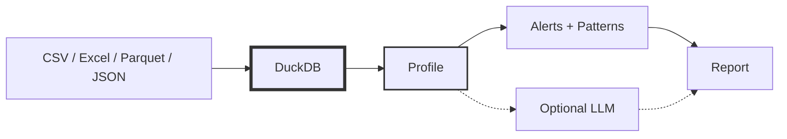

# DataSummarizer: Statistics-First Data Profiling
<!--category-- Data Analysis, DuckDB, C#, LLM, ONNX -->
<datetime class="hidden">2024-12-22T18:30</datetime>

If you've ever opened a dataset and immediately asked "which columns are junk?", "where are the nulls?", or "what's leaking?" - you've felt the need for data profiling.

**DataSummarizer** is a CLI that makes that first pass fast and repeatable:

- **DuckDB** computes deterministic profiles (counts, nulls, quantiles, outliers, correlations, patterns)
- **LLM** optionally interprets that profile
- **ONNX embeddings** enable vector search across multiple datasets

The LLM is an optional narrator. DuckDB does the work.

> This builds on the same philosophy as my [CSV analysis with LLMs](/blog/analysing-large-csv-files-with-local-llms) article - LLMs reason, databases compute. DataSummarizer takes this further with automatic profiling, pattern detection, and multi-dataset search. See also [DocSummarizer](/blog/building-a-document-summarizer-with-rag) for the document equivalent.

[TOC]

---

## Why Statistics-First

Pasting data into a prompt and asking "tell me about this" fails because:

1. **Scale**: millions of rows won't fit in a context window
2. **Correctness**: LLMs can't reliably compute aggregates
3. **Reproducibility**: prompts drift; computed stats don't

DataSummarizer flips the order: compute facts first, then optionally narrate.



The tool stays useful with `--no-llm`.

---

## Quick Start

```bash
# Stats only (fast, deterministic)
datasummarizer -f sales.csv --no-llm

# With LLM narrative
datasummarizer -f sales.csv --model qwen2.5-coder:7b

# Target-aware (feature effects on your label)
datasummarizer -f sales.csv --target IsReturned --no-llm
```

---

## Sample Output

Here's what you get from a 100,000 row sales dataset:

```
-- Summary ---------------------------------------------------------------

This dataset contains **100,000 rows** and **14 columns**. Column breakdown: 
4 numeric, 4 categorical, 1 date/time. Found **1 strong correlation(s)**.

+---------------+-------------+-------+---------+----------------------------+
| Column        | Type        | Nulls | Unique  | Stats                      |
+---------------+-------------+-------+---------+----------------------------+
| OrderId       | Id          | 0.0%  | 97,592  | -                          |
| OrderDate     | DateTime    | 0.0%  | 1,264   | 2022-01-01 -> 2024-12-30   |
| CustomerId    | Id          | 0.0%  | 64,502  | -                          |
| Email         | Text        | 0.0%  | 100,000 | -                          |
| Region        | Categorical | 0.0%  | 5       | top: South                 |
| Category      | Categorical | 0.0%  | 6       | top: Home & Garden         |
| Quantity      | Numeric     | 0.0%  | 21      | mean=10.5, std=5.8, 1-20   |
| UnitPrice     | Numeric     | 0.0%  | 19,586  | mean=73.4, std=61.5, 5-300 |
| TotalAmount   | Numeric     | 0.0%  | 69,420  | mean=737, std=814, 4-6k    |
| IsReturned    | Boolean     | 0.0%  | 2       | -                          |
+---------------+-------------+-------+---------+----------------------------+

-- Alerts ----------------------------------------------------------------
- Email: Potential leakage: 100.0% unique - exclude from modeling
- UnitPrice: 5,670 outliers (5.7%) outside IQR bounds [-69.8, 197.0]
- TotalAmount: Skewness: 2.27 - distribution is highly skewed

-- Insights --------------------------------------------------------------
Text Pattern in 'Email' (score 0.94)
100% of values match Email pattern (100,000 matches).

Modeling Recommendations (score 0.70)
- High-cardinality categoricals (ProductName) - consider target encoding
- Exclude ID columns from features: OrderId, CustomerId
```

---

## Plain English Queries

Ask questions in natural language - the LLM answers based on computed facts only:

```bash
datasummarizer -f sales.csv --model qwen2.5-coder:7b --query "tell me about this data"
```

```
Answer: **Dataset**: sales.csv
**Size**: 100,000 rows x 14 columns

**Column types:**
- Numeric: 4
- Categorical: 4
- DateTime: 1

**Data quality:**
- Columns with outliers: 3
- Alerts: 6
- Strong correlations: 1
```

```bash
datasummarizer -f sales.csv --model qwen2.5-coder:7b \
  --query "what issues should I fix before modeling?"
```

```
Answer: Found **6 data quality issue(s)**:

**PotentialLeakage** (1):
  Email: Potential leakage: 100.0% unique - exclude from modeling

**Outliers** (3):
  UnitPrice: 5,670 outliers (5.7%) outside IQR bounds
  Discount: 5,271 outliers (5.3%) outside IQR bounds
  TotalAmount: 7,445 outliers (7.4%) outside IQR bounds

**HighSkewness** (1):
  TotalAmount: Skewness: 2.27 - distribution is highly skewed
```

```bash
datasummarizer -f sales.csv --model qwen2.5-coder:7b \
  --query "are there any patterns in the data?"
```

```
Answer: **Text patterns detected:**

**CustomerName**:
  - **Novel Pattern**: 99.0% (99,000 matches)
    Consistent format: letters + space + letters
    Regex: ^[a-zA-Z]+\s+[a-zA-Z]+$
    Examples: Bianka Hyatt, Noelia Kub, Sally Thiel

**Email**:
  - Email: 100.0% (100,000 matches)
```

The LLM can only report facts that DuckDB computed - it cannot hallucinate columns or statistics.

---

## What Gets Profiled

| Category | Metrics |
|----------|---------|
| **Basic** | Row count, null %, unique %, min/max, mean, median, std dev |
| **Distribution** | Skewness, kurtosis, quartiles, IQR, outlier counts |
| **Categorical** | Top values, entropy, mode, imbalance ratio |
| **Patterns** | Text formats (email/URL/UUID/phone), distribution shape, time series gaps, trends |
| **Relationships** | Correlations, foreign key overlap, ID detection |

### Decision-Oriented Alerts

| Alert | Recommendation |
|-------|----------------|
| Target imbalance (20% vs 80%) | Stratified splits, class weights |
| Potential leakage (100% unique) | Exclude or verify causality |
| Ordinal as category | Treat as ordered numeric |
| Zero-inflated (36% zeros) | Log transform or two-part model |
| High nulls (85%) | Drop or impute |

---

## Target-Aware Profiling

With `--target IsReturned`, you get supervised-style analysis without training a model:

```bash
datasummarizer -f sales.csv --target IsReturned --no-llm
```

```
-- Insights --------------------------------------------------------------
IsReturned Analysis Summary (score 0.95)
Target rate: 4.9%. Top drivers: Discount, Quantity, TotalAmount.
See feature effects below for actionable segments.

Modeling Recommendations (score 0.70)
- Good candidate for logistic regression or gradient boosting
- Severe imbalance - consider SMOTE, class weights, or precision/recall
- Exclude ID columns from features: OrderId, CustomerId
```

This surfaces class imbalance, top drivers (Cohen's d or rate delta), and leakage warnings.

---

## How It Works

DuckDB queries files directly - no import step. This is the same trick from [analysing large CSV files](/blog/analysing-large-csv-files-with-local-llms):

```csharp
DataSourceType.Csv => $"read_csv_auto('{path}')",
DataSourceType.Parquet => $"read_parquet('{path}')",
DataSourceType.Excel => $"st_read('{path}', layer = '{sheet}')",
```

The profiler then runs `SUMMARIZE`, enriches with quantiles/outliers, computes correlations, and detects patterns.

---

## Multi-Dataset Registry

For many datasets, ingest profiles into a DuckDB registry with vector search:

```bash
# Ingest a directory
datasummarizer --ingest-dir "data/" --vector-db registry.duckdb --no-llm

# Query across all datasets
datasummarizer --registry-query "Which datasets have sales data?" \
  --vector-db registry.duckdb --no-llm
```

```
Answer: - Dataset: sales.csv (score 0.759)
  Rows: 100,000, Columns: 14
  Types: numeric 4, categorical 4, date/time 1
  Columns: OrderId, OrderDate, CustomerId, CustomerName, Email
  Insight: Text Pattern in 'Email' - 100% match Email pattern
```

### ONNX Embeddings

Embeddings auto-download on first use (~23MB for the default model). If ONNX fails, a hash-based fallback kicks in automatically.

| Model | Size | Use Case |
|-------|------|----------|
| all-MiniLM-L6-v2 (default) | 23MB | General purpose |
| bge-small-en-v1.5 | 34MB | Higher quality |
| paraphrase-MiniLM-L3-v2 | 17MB | Fastest |

---

## CLI Subcommands

| Command | Purpose |
|---------|---------|
| `profile` | Save profile as JSON |
| `synth` | Generate synthetic data from a profile |
| `validate` | Compare datasets, report drift |
| `tool` | JSON output for pipelines/agents |

```bash
# Save profile
datasummarizer profile -f data.csv --output profile.json

# Generate 1000 synthetic rows
datasummarizer synth --profile profile.json --synthesize-to fake.csv --synthesize-rows 1000

# Check drift between original and synthetic
datasummarizer validate --source original.csv --target synthetic.csv
```

### Tool Output (for LLM agents/pipelines)

```bash
datasummarizer tool -f sales.csv --fast
```

```json
{
  "Success": true,
  "Source": "sales.csv",
  "Profile": {
    "RowCount": 100000,
    "ColumnCount": 14,
    "ExecutiveSummary": "100,000 rows, 14 columns. 4 numeric, 4 categorical...",
    "Columns": [...],
    "Alerts": [
      { "Severity": "Warning", "Column": "Email", "Type": "PotentialLeakage",
        "Message": "100.0% unique - exclude from modeling" }
    ],
    "Insights": [...]
  },
  "Metadata": { "ProcessingSeconds": 2.1 }
}
```

---

## Performance Options

For wide tables:

```bash
datasummarizer -f wide.csv --fast --skip-correlations --max-columns 50 --no-llm
```

| Option | Effect |
|--------|--------|
| `--fast` | Skip pattern detection |
| `--skip-correlations` | Skip correlation matrix |
| `--max-columns N` | Auto-select N most interesting |
| `--columns a,b,c` | Only analyze specific columns |

---

## What This Tool Is (and Isn't)

**Is:** Fast first-pass facts, "fix this before modeling" alerts, grounded LLM pipeline, multi-dataset search.

**Isn't:** Full EDA replacement, magic "ask anything" system, substitute for domain knowledge.

---

## Coming Up

This article covers the basics - there's a lot more under the hood. Future articles will dig deeper into:

- **Pattern Detection** - How the regex-based text pattern detector works, distribution shape detection, and time series analysis
- **Target Analysis** - Cohen's d, rate deltas, and how feature effects are computed without training a model
- **ONNX Embeddings** - The auto-download system, tokenizer implementation, and GPU acceleration
- **Synthetic Data Generation** - How `synth` preserves statistical properties while generating fake data
- **Vector Registry** - DuckDB VSS integration, cosine fallback, and cross-dataset search

---

## Related Articles

- **[Analysing Large CSV Files with Local LLMs](/blog/analysing-large-csv-files-with-local-llms)** - The foundational pattern: LLM generates SQL, DuckDB executes
- **[DocSummarizer](/blog/building-a-document-summarizer-with-rag)** - Same philosophy for documents: BERT embeddings, chunking, LLM narrates extracted content
- **[Why I Don't Use LangChain](/blog/why-i-dont-use-langchain)** - The design philosophy behind these tools

---

## Next Steps

1. Start with `--no-llm` - read the alerts
2. Add `--target` when you know your label
3. Use `--fast` for wide tables
4. Ingest multiple datasets for cross-dataset queries

Full CLI reference: [DataSummarizer README](https://github.com/scottgal/mostlylucidweb/tree/main/Mostlylucid.DataSummarizer)

This is just the introduction - stay tuned for deeper dives into the internals.
