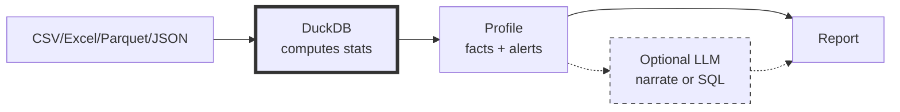

# DataSummarizer: Fast Local Data Profiling
<!--category-- Data Analysis, DuckDB, C#, LLM -->
<datetime class="hidden">2025-12-22T18:30</datetime>

[](https://github.com/scottgal/mostlylucidweb/tree/main/Mostlylucid.DataSummarizer)
[](https://dotnet.microsoft.com/)

You open a new CSV. 10,000 rows, 50 columns. What's in here? Which columns are junk? Where are the nulls? What's skewed?

**DataSummarizer** answers those questions in under a second — no cloud upload, no manual exploration, just **deterministic stats + optional AI insights**.

[TOC]

---

## The Simplest Start: Just Run It

No flags, no options. Just run the executable:

```bash
datasummarizer
```

**What happens:**

```
  ____            _             ____                                          
 |  _ \    __ _  | |_    __ _  / ___|   _   _   _ __ ___    _ __ ___     __ _ 
 | | | |  / _` | | __|  / _` | \___ \  | | | | | '_ ` _ \  | '_ ` _ \   / _` |
 | |_| | | (_| | | |_  | (_| |  ___) | | |_| | | | | | | | | | | | | | | (_| |
 |____/   \__,_|  \__|  \__,_| |____/   \__,_| |_| |_| |_| |_| |_| |_|  \__,_|
                                                                              
         _                     
  _ __  (_)  ____   ___   _ __ 
 | '__| | | |_  /  / _ \ | '__|
 | |    | |  / /  |  __/ | |   
 |_|    |_| /___|  \___| |_|   
                               
Welcome to DataSummarizer!
DuckDB-powered data profiling - analyze CSV, Excel, Parquet, JSON files

Enter path to data file: _
```

Type your file path and it profiles instantly.

**Why this is great:** Zero friction. No remembering flags, no reading docs first. Just run it and follow the prompts.

---

## Or Use Command-Line Flags

If you prefer commands:

```bash
datasummarizer -f pii-test.csv --no-llm --fast
```

**Actual output** (5 rows × 4 columns in <1 second):

```
── Summary ─────────────────────────────────────────────────────────
This dataset contains 5 rows and 4 columns. Column breakdown: 4 
categorical. No major data quality issues detected.

╭────────┬─────────────┬───────┬────────┬───────────────────────╮
│ Column │ Type        │ Nulls │ Unique │ Stats                 │
├────────┼─────────────┼───────┼────────┼───────────────────────┤
│ Name   │ Categorical │ 0.0%  │ 4      │ top: Alice Brown      │
│ Email  │ Categorical │ 0.0%  │ 4      │ top: alice@domain.net │
│ Phone  │ Categorical │ 0.0%  │ 5      │ top: 555-789-0123     │
│ SSN    │ Categorical │ 0.0%  │ 5      │ top: 222-33-4444      │
╰────────┴─────────────┴───────┴────────┴───────────────────────╯

── Alerts ──────────────────────────────────────────────────────────
- Phone: 100.0% unique - possibly an ID column
- SSN: 100.0% unique - possibly an ID column
- Name: ⚠ Potential PersonName detected (30% confidence). Risk level: Medium
- Email: ⚠ Potential Email detected (100% confidence). Risk level: High
- Phone: ⚠ Potential PhoneNumber detected (100% confidence). Risk level: High
- SSN: ⚠ Potential SSN detected (100% confidence). Risk level: Critical
```

**What you get instantly:**
- **Schema detection**: Column types (numeric/categorical/datetime/text/ID)
- **Data quality alerts**: Nulls, outliers, high-cardinality flags
- **PII detection**: Automatic flagging of sensitive data (emails, SSNs, phone numbers)
- **Recommendations**: Which columns are likely IDs or leakage risks

All **deterministic** - computed by DuckDB, not guessed by an LLM.

---

## Compare Datasets (Segment Analysis)

Compare two datasets to understand distributional differences:

```bash
datasummarizer segment --segment-a pii-test.csv --segment-b timeseries-weekly.csv
```

**Actual output:**

```json
{
  "SegmentAName": "pii-test.csv",
  "SegmentBName": "timeseries-weekly.csv",
  "SegmentARowCount": 5,
  "SegmentBRowCount": 365,
  "Similarity": 0,
  "OverallDistance": 1,
  "AnomalyScoreA": 0.28,
  "AnomalyScoreB": 0.018,
  "Insights": [
    "Segments are substantially different (<50% similarity)",
    "Segment sizes differ by +7200.0% (5 vs 365 rows)"
  ]
}
```

**Use cases:**
- Validate synthetic data vs source
- Compare customer cohorts (churned vs retained)
- Track temporal drift (Q1 vs Q2)
- A/B test analysis

---

## Automatic Drift Detection

Monitor data changes **without manual baseline management**:

```bash
datasummarizer tool -f daily_export.csv --auto-drift --store
```

**What happens:**
1. Profile computed (stats + alerts + patterns)
2. Baseline auto-selected (oldest profile with same schema, or pinned baseline)
3. Drift calculated using:
   - **Kolmogorov-Smirnov** distance (numeric columns, quantile-based)
   - **Jensen-Shannon** divergence (categorical columns)
4. JSON report emitted with drift score + recommendations

**For the first run**, drift is null (no baseline exists yet):

```json
{
  "Success": true,
  "Profile": { "RowCount": 5, "ColumnCount": 4 },
  "Drift": null
}
```

**On subsequent runs**, you'll get drift metrics comparing against the baseline.

**Run it in a cron job:**

```bash
# Daily at 2am
0 2 * * * datasummarizer tool -f /data/daily_export.csv --auto-drift --store > /logs/drift.json
```

No manual baseline management - it automatically picks the right baseline based on schema fingerprint.

---

## Profile Store Management

DataSummarizer keeps a profile store (local DuckDB) to track profiles over time.

**List all stored profiles:**

```bash
datasummarizer store list
```

**Actual output:**

```
╭──────────────┬──────────────────┬────────┬──────┬──────────┬─────────────────╮
│ ID           │ File             │ Rows   │ Cols │ Schema   │ Stored          │
├──────────────┼──────────────────┼────────┼──────┼──────────┼─────────────────┤
│ 74e6b186cfad │ pii-test.csv     │ 5      │ 4    │ 26240c83 │ 2025-12-20      │
│              │                  │        │      │          │ 12:26           │
│ a8edaed514a8 │ pii-test.csv     │ 5      │ 4    │ 26240c83 │ 2025-12-20      │
│              │                  │        │      │          │ 01:45           │
╰──────────────┴──────────────────┴────────┴──────┴──────────┴─────────────────╯
Total: 2 profile(s)
```

**Interactive menu** (requires interactive terminal):

```bash
datasummarizer store
```

**Features:**
- 📋 List all profiles (📌 = pinned, 🚫 = excluded, 🏷️ = tagged)
- ⚖️ Compare two profiles
- 📌 Pin as baseline (only one per schema)
- 🚫 Exclude from baseline (known-bad batches)
- 🏷️ Add tags/notes
- 🧹 Prune old profiles
- 📊 Show statistics

**Other store commands:**

```bash
# Show statistics
datasummarizer store stats

# Prune old profiles (keep 5 per schema)
datasummarizer store prune --keep 5

# Clear all profiles
datasummarizer store clear
```

---

## What Gets Profiled

**Deterministic (computed facts):**
- **Schema**: Row count, column count, inferred types (Numeric/Categorical/DateTime/Text/Id/Boolean)
- **Data quality**: Null %, unique %, constants, outliers (IQR)
- **Numeric stats**: Min/max, mean/median, stddev, quantiles, skewness, kurtosis
- **Categorical stats**: Top values, mode, entropy, imbalance ratio, cardinality
- **PII detection**: Email, SSN, phone number, credit card patterns
- **Alerts**: Leakage flags (100% unique), high nulls, ID detection

**Heuristic (fast approximations):**
- Pattern detection (email/URL/UUID formats)
- Distribution labels (normal/skewed/uniform)
- FK overlap hints
- Trends, seasonality

**LLM-generated (optional):**
- Narrative summaries
- SQL query generation
- Result interpretation

---

## How It Works



**Why this order matters:** LLMs can't reliably compute aggregates from raw rows. We compute facts first, then optionally narrate.

**Key design principles:**
1. **DuckDB does the math** - all stats are computed deterministically
2. **Profile is versioned** - you can diff profiles, track drift over time
3. **LLM is optional** - runs without any LLM for deterministic profiling
4. **Privacy-first** - data stays local, LLM only sees profile stats (or query results if you enable SQL mode)

---

## Trust Model

**What's deterministic:**
- All statistics (row/column stats, quartiles, correlations)
- Data quality alerts (nulls, outliers, duplicates, PII flags)
- Target analysis (effect sizes, segment rates) when available

**What's heuristic:**
- Pattern detection uses thresholds (e.g., "email format" = ≥10% match rate)
- Distribution labels based on skewness/kurtosis ranges
- These are documented as approximations, not proofs

**What's LLM-generated:**
- Only narrative summaries and SQL queries (optional, disabled by default in most commands)
- LLM never sees raw data unless you enable SQL mode (Q&A features)

**SQL safety (when LLM enabled):**
- Read-only queries
- Max 20 rows returned
- No COPY/ATTACH/INSTALL/CREATE/DROP/INSERT/UPDATE/DELETE allowed

---

## Performance

**.NET 10, out-of-core analytics via DuckDB:**

| Dataset | Rows | Columns | Time (--fast --no-llm) |
|---------|------|---------|------------------------|
| Small PII | 5 | 4 | <1 second |
| Time-series | 365 | 8 | <1 second |
| Bank churn (typical) | 10,000 | 13 | ~1 second |
| Sales (larger) | 100,000 | 14 | ~2 seconds |
| Wide table | 50,000 | 200 | ~8 seconds (with --max-columns 50) |

**Memory:** DuckDB handles files larger than RAM using out-of-core processing.

---

## Output Formats

DataSummarizer supports three output formats:

**1. Human-readable (default):**
- Pretty tables with Spectre.Console
- Color-coded alerts
- Use for interactive exploration

**2. JSON (tool mode):**
```bash
datasummarizer tool -f data.csv > profile.json
```
- Machine-readable
- Use for CI/CD pipelines, LLM tool integration

**3. Markdown/HTML:**
```bash
datasummarizer validate --source a.csv --target b.csv --format markdown
```
- Reports, documentation
- Use for sharing results with non-technical stakeholders

---

## Get It

**Repository:** [github.com/scottgal/mostlylucidweb/tree/main/Mostlylucid.DataSummarizer](https://github.com/scottgal/mostlylucidweb/tree/main/Mostlylucid.DataSummarizer)

**Requirements:**
- .NET 10 Runtime (or SDK to build from source)
- DuckDB (embedded - no separate install needed)
- Optional: Ollama for LLM features

**Full documentation:** See the [README](https://github.com/scottgal/mostlylucidweb/blob/main/Mostlylucid.DataSummarizer/README.md) for comprehensive command reference, all options, and advanced features.

---

**Related:**
- [CSV analysis with local LLMs](/blog/analysing-large-csv-files-with-local-llms) - The foundational pattern
- [DocSummarizer](/blog/building-a-document-summarizer-with-rag) - Same philosophy for documents
