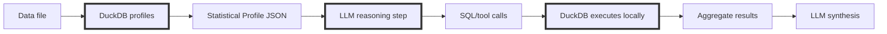
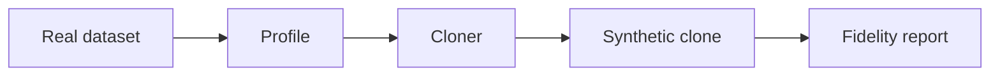

# DataSummarizer: Fast Local Data Profiling

<!--category-- Data Analysis, DuckDB, C#, LLM -->

<datetime class="hidden">2025-12-22T18:30</datetime>

**Series: Local LLMs for Data — Part 2 of 2**


DataSummarizer packages a proven pattern into a CLI: compute deterministic profiles with DuckDB, persist them, and optionally layer a local LLM for narration, safe SQL suggestions, and conversational follow-ups. The tool keeps the heavy numeric work local and auditable (profiles, drift detection, fidelity reports), while the LLM is limited to interpreting those facts or drafting read-only SQL that DuckDB executes in a sandbox. This yields fast, private profiling, trustworthy automation (`tool` JSON), drift monitoring, and the ability to create PII-free synthetic clones that match statistical shape — all without sending raw rows to a model. See [Part 1](/blog/analysing-large-csv-files-with-local-llms) for the schema+sample → LLM SQL pattern that inspired this design.

[](https://github.com/scottgal/mostlylucidweb/releases?q=datasummarizer)

This is a follow-up to **[How to Analyse Large CSV Files with Local LLMs in C#](/blog/analysing-large-csv-files-with-local-llms)**.

That article’s core point was simple:

> **LLMs should generate queries, not consume data.**

This one pushes the same idea further:

* don’t even feed the LLM “samples” unless you really have to
* feed it **statistical shape**
* let DuckDB compute facts
* let the LLM reason over *those facts* and ask for more

And because you now have a statistical shape, you can do something genuinely useful:

> generate a **PII-free synthetic clone** that behaves like the original dataset.

[TOC]

---

## The Problem With “Chat With Your Data”

When people bolt an LLM onto data analysis, they usually do one of these:

1. shove rows into context (falls over fast, leaks data)
2. embed chunks and retrieve them (still row-level, still leaky)
3. “representative samples” (often unrepresentative, still risky)

Even if you have a 200k token context window, you can’t compute reliable aggregates on large data by reading rows. LLMs aren’t built for that.

The correct abstraction is still:

**LLM reasons. Database computes.**

But you can improve it again by changing what the LLM sees.

---

## The Key Upgrade: Statistics as the Interface

Instead of giving the model data, give it a **profile**.

A profile is a compact, deterministic summary of the dataset:

* schema + inferred types
* null rate, uniqueness, cardinality
* min/max/quantiles, skew, outliers
* top values for safe categoricals
* PII risk signals (regex + classifier)
* time-series structure (span, gaps, granularity)
* optional drift deltas vs baseline

The model can now:

* decide what’s interesting
* propose follow-up queries
* interpret results

…without ever seeing raw rows.

### The architecture



This keeps the “LLM → SQL → DuckDB” pattern, but makes it more robust:

* the first step is deterministic profiling
* the LLM is operating on facts, not anecdotes

---

## Why the Profile Helps (Even Without an LLM)

A profile answers the boring-but-urgent questions immediately:

* Which columns are junk (all-null, constant, near-constant)?
* Which columns are leakage risks (near-unique identifiers)?
* Which columns are high-null / high-outlier?
* What are the dominant categories?
* Is this time series contiguous or full of gaps?
* Are distributions skewed (long tails, zero-inflated)?

These are the questions you usually discover 30 minutes into messing about with spreadsheets.

The profile gives you them in seconds.

---

## Why the Profile Helps the LLM

If you *do* enable the LLM, the profile is what makes it useful rather than performative.

With profile-only context, it can do things like:

* pick “interesting” columns to focus on (high entropy, high skew, high nulls)
* suggest sensible group-bys (low-cardinality categoricals)
* avoid garbage SQL (no grouping on 95%-unique columns)
* notice drift (“this categorical distribution moved”)
* ask for targeted follow-up stats rather than requesting more rows

That last point is the one most systems miss.

You don’t need a bigger model.
You need better tools and better evidence.

---

## The Tool I Built: DataSummarizer

I ended up turning this into a CLI so I could run it on arbitrary files (including in cron) without hand-writing analysis each time.

[](https://github.com/scottgal/mostlylucidweb/releases?q=datasummarizer)

### The quickest start

**Windows:** drag a file onto `datasummarizer.exe`

**CLI:**

```bash
datasummarizer mydata.csv
```

### Tool mode (JSON output)

```bash
datasummarizer tool -f mydata.csv > profile.json
```

That `profile.json` is the interface the LLM consumes (and the thing you can store for drift comparisons).

---

## Operational defaults (explicit)

- Ollama URL used by the CLI: `http://localhost:11434` (configure in `appsettings.json` if you want a different host).
- Default model used by the CLI: `qwen2.5-coder:7b` (override with `--model`).
- Default registry file for cross-dataset queries / conversations: `.datasummarizer.vss.duckdb` (override with `--vector-db`).
- SQL execution constraints when LLM-driven SQL is used:
  - Result set cap: up to 20 rows returned to the LLM.
  - Forbidden statements: `COPY`, `ATTACH`, `INSTALL`, `CREATE`, `DROP`, `INSERT`, `UPDATE`, `DELETE`, `PRAGMA` (unsafe pragmas).

These defaults make local use straightforward and secure by design.

---

## Example: Deterministic Profiling Output

```bash
datasummarizer -f pii-test.csv --no-llm --fast
```

You get schema + stats + alerts immediately:

* null rates
* uniqueness/cardinality
* PII warnings
* distribution shape flags

**All computed by DuckDB**. No guessing.

---

## Example: Compact `tool` JSON (short)

When you run `tool` mode the top-level JSON includes provenance and LLM metadata. Example (abridged):

```json
{
  "Success": true,
  "Source": "data.csv",
  "ProfileId": "a3f9e2c1b8d4",
  "Profile": { "RowCount": 10000, "ColumnCount": 13 },
  "Metadata": {
    "ProcessingSeconds": 1.23,
    "Model": "qwen2.5-coder:7b",
    "UsedLlm": true,
    "SessionId": "sales-analysis"
  },
  "Drift": { "DriftScore": 0.12 }
}
```

Use these fields in automation to track provenance, model usage, and drift scores.

---

## Automatic Drift Detection (Cron-Friendly)

Once you have profiles, drift becomes “free”.

```bash
datasummarizer tool -f daily_export.csv --auto-drift --store > drift.json
```

How it works:

1. compute today’s profile
2. pick baseline automatically by schema fingerprint (or pinned baseline)
3. compute drift using:

    * KS distance for numeric distributions
    * Jensen–Shannon divergence for categorical distributions
4. emit a report

Run it daily:

```bash
0 2 * * * datasummarizer tool -f /data/daily_export.csv --auto-drift --store > /logs/drift.json
```

CI snippet (fail on significant drift):

```bash
# requires jq
drift_score=$(jq '.Drift.DriftScore // 0' drift.json)
if (( $(echo "$drift_score > 0.3" | bc -l) )); then
  echo "❌ Significant drift: $drift_score"; exit 1
fi
```

---

## The Killer Feature: Cloner (Synthetic Data From Shape)

Once you have a statistical profile, you can generate a synthetic dataset that:

* contains **no original values**
* contains **no PII**
* matches the **statistical shape** (distribution, cardinality effects)

This is exactly what I want for demos, CI tests, support repros, and shareable sample data.

Conceptually:



The fidelity report quantifies deltas in null %, quantiles, categorical frequency tables, and drift distances.

---

## Session & Registry notes (where conversation is stored)

- Use `--session-id <id>` to tie questions together.
- Conversation turns are stored in the Registry only when you provide `--vector-db` (the default path is `.datasummarizer.vss.duckdb`).
- This keeps follow-ups usable across separate CLI invocations while remaining local.

Example:

```bash
# ingest once (creates registry)
datasummarizer --ingest-dir sampledata/ --vector-db registry.duckdb

# then run sessioned queries
datasummarizer -f sales.csv --query "top products" --session-id sales-analysis --model qwen2.5-coder:7b
# later
datasummarizer -f sales.csv --query "show their revenue" --session-id sales-analysis --model qwen2.5-coder:7b
```

---

## Trust Model (short)

**Deterministic:** all stats, quantiles, top-k, entropy, uniqueness, and drift distances are computed by DuckDB.

**Optional (LLM):** narrative summaries, SQL suggestions, and guided tool selection. The LLM *interprets* the profile; it does not produce the underlying numbers.

If you need hermetic, auditable runs (CI, regulatory contexts), use `--no-llm` and rely on the JSON/tool output.

---

## Get It

**Repo:** [https://github.com/scottgal/mostlylucidweb/tree/main/Mostlylucid.DataSummarizer](https://github.com/scottgal/mostlylucidweb/tree/main/Mostlylucid.DataSummarizer)

Requirements:

* .NET 10
* DuckDB (embedded)
* optional: Ollama for LLM features

Related:

* [Analysing large CSV files with local LLMs](/blog/analysing-large-csv-files-with-local-llms)
* [DocSummarizer](/blog/building-a-document-summarizer-with-rag)

