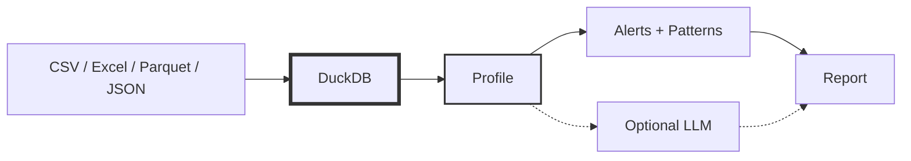

# DataSummarizer: Statistics-First Data Profiling
<!--category-- Data Analysis, DuckDB, C#, LLM, ONNX -->
<datetime class="hidden">2024-12-22T18:30</datetime>

If you've ever opened a dataset and immediately asked "which columns are junk?", "where are the nulls?", or "what's leaking?" - you've felt the need for data profiling.

**DataSummarizer** is a CLI that makes that first pass fast and repeatable:

- **DuckDB** computes deterministic profiles (counts, nulls, quantiles, outliers, correlations, patterns)
- **LLM** optionally interprets that profile
- **ONNX embeddings** enable vector search across multiple datasets

> NOTE: Work in progress...the prereleases you see here MIGHT work...I'll stabilise for v1.0 soon.

[](https://github.com/scottgal/mostlylucidweb/releases?q=datasummarizer)
[](https://dotnet.microsoft.com/)
[](https://github.com/scottgal/mostlylucidweb/releases?q=datasummarizer)

The LLM is an optional narrator. DuckDB does the work.

> This builds on the same philosophy as my [CSV analysis with LLMs](/blog/analysing-large-csv-files-with-local-llms) article - LLMs reason, databases compute. DataSummarizer takes this further with automatic profiling, pattern detection, and multi-dataset search. See also [DocSummarizer](/blog/building-a-document-summarizer-with-rag) for the document equivalent.

[TOC]

---

## Why Statistics-First

Pasting data into a prompt and asking "tell me about this" fails because:

1. **Scale**: millions of rows won't fit in a context window
2. **Correctness**: LLMs can't reliably compute aggregates
3. **Reproducibility**: prompts drift; computed stats don't

DataSummarizer flips the order: compute facts first, then optionally narrate.



The tool stays useful with `--no-llm`.

---

## Quick Start

```bash
# Stats only (fast, deterministic)
datasummarizer -f "Bank_Churn.csv" --no-llm

# With LLM narrative
datasummarizer -f "Bank_Churn.csv" --model qwen2.5-coder:7b

# Target-aware (feature effects on your label)
datasummarizer -f "Bank_Churn.csv" --target Exited --no-llm
```

---

## What Gets Profiled

| Category | Metrics |
|----------|---------|
| **Basic** | Row count, null %, unique %, min/max, mean, median, std dev |
| **Distribution** | Skewness, kurtosis, quartiles, IQR, outlier counts |
| **Categorical** | Top values, entropy, mode, imbalance ratio |
| **Patterns** | Text formats (email/URL/UUID/phone), distribution shape, time series gaps, trends |
| **Relationships** | Correlations, foreign key overlap, ID detection |

### Decision-Oriented Alerts

| Alert | Recommendation |
|-------|----------------|
| Target imbalance (20% vs 80%) | Stratified splits, class weights |
| Potential leakage (100% unique) | Exclude or verify causality |
| Ordinal as category | Treat as ordered numeric |
| Zero-inflated (36% zeros) | Log transform or two-part model |
| High nulls (85%) | Drop or impute |

---

## How It Works

DuckDB queries files directly - no import step. This is the same trick from [analysing large CSV files](/blog/analysing-large-csv-files-with-local-llms):

```csharp
DataSourceType.Csv => $"read_csv_auto('{path}')",
DataSourceType.Parquet => $"read_parquet('{path}')",
DataSourceType.Excel => $"st_read('{path}', layer = '{sheet}')",
```

The profiler then runs `SUMMARIZE`, enriches with quantiles/outliers, computes correlations, and detects patterns.

---

## Target-Aware Profiling

With `--target Exited`, you get supervised-style analysis without training a model:

```
Target driver: NumOfProducts (score 0.86)
NumOfProducts = 4 has exit rate 100% vs baseline 20.4%

Target driver: Age (score 0.82)  
Average Age is 44.8 for churners vs 37.4 for retained

Modeling Recommendations
Good candidate for logistic regression or gradient boosting
Exclude ID columns: CustomerId
```

This surfaces class imbalance, top drivers (Cohen's d or rate delta), and leakage warnings.

---

## Multi-Dataset Registry

For many datasets, ingest profiles into a DuckDB registry with vector search:

```bash
# Ingest a directory
datasummarizer --ingest-dir "data/" --vector-db registry.duckdb --no-llm

# Query across all datasets
datasummarizer --registry-query "Which datasets have churn?" \
  --vector-db registry.duckdb --no-llm
```

### ONNX Embeddings

Embeddings auto-download on first use (~23MB for the default model). If ONNX fails, a hash-based fallback kicks in automatically.

| Model | Size | Use Case |
|-------|------|----------|
| all-MiniLM-L6-v2 (default) | 23MB | General purpose |
| bge-small-en-v1.5 | 34MB | Higher quality |
| paraphrase-MiniLM-L3-v2 | 17MB | Fastest |

---

## CLI Subcommands

| Command | Purpose |
|---------|---------|
| `profile` | Save profile as JSON |
| `synth` | Generate synthetic data from a profile |
| `validate` | Compare datasets, report drift |
| `tool` | JSON output for pipelines/agents |

```bash
# Save profile
datasummarizer profile -f data.csv -o profile.json

# Generate 1000 synthetic rows
datasummarizer synth --profile profile.json --synthesize-to fake.csv --synthesize-rows 1000

# Check drift
datasummarizer validate --source original.csv --target synthetic.csv
```

---

## Performance Options

For wide tables:

```bash
datasummarizer -f wide.csv --fast --skip-correlations --max-columns 50 --no-llm
```

| Option | Effect |
|--------|--------|
| `--fast` | Skip pattern detection |
| `--skip-correlations` | Skip correlation matrix |
| `--max-columns N` | Auto-select N most interesting |
| `--columns a,b,c` | Only analyze specific columns |

---

## What the LLM Sees

When enabled, the LLM receives the computed profile - not raw data:

- Column stats (null%, unique%, distribution metrics)
- Detected patterns and alerts
- Correlations with |r| >= 0.3
- Target analysis if specified

This keeps the LLM grounded in facts - the same principle as [DocSummarizer](/blog/building-a-document-summarizer-with-rag) where the LLM summarizes extracted content, not raw documents.

---

## Sample Output

```
-- Summary --
10,000 rows, 13 columns. 5 numeric, 6 categorical. 3 alerts.

+---------------+-------------+-------+--------+-------------------------+
| Column        | Type        | Nulls | Unique | Stats                   |
+---------------+-------------+-------+--------+-------------------------+
| CustomerId    | Id          | 0.0%  | 9,438  | -                       |
| CreditScore   | Numeric     | 0.0%  | 509    | mu=650.5, sigma=96.7    |
| Age           | Numeric     | 0.0%  | 67     | mu=38.9, sigma=10.5     |
| Exited        | Categorical | 0.0%  | 2      | top: 0                  |
+---------------+-------------+-------+--------+-------------------------+

-- Alerts --
- Age: 359 outliers (3.6%) outside IQR [14, 62]
- EstimatedSalary: Potential leakage - 100% unique
```

---

## What This Tool Is (and Isn't)

**Is:** Fast first-pass facts, "fix this before modeling" alerts, grounded LLM pipeline, multi-dataset search.

**Isn't:** Full EDA replacement, magic "ask anything" system, substitute for domain knowledge.

---

## Related Articles

- **[Analysing Large CSV Files with Local LLMs](/blog/analysing-large-csv-files-with-local-llms)** - The foundational pattern: LLM generates SQL, DuckDB executes
- **[DocSummarizer](/blog/building-a-document-summarizer-with-rag)** - Same philosophy for documents: BERT embeddings, chunking, LLM narrates extracted content
- **[Why I Don't Use LangChain](/blog/why-i-dont-use-langchain)** - The design philosophy behind these tools

---

## Next Steps

1. Start with `--no-llm` - read the alerts
2. Add `--target` when you know your label
3. Use `--fast` for wide tables
4. Ingest multiple datasets for cross-dataset queries

Full CLI reference: [DataSummarizer README](https://github.com/scottgal/mostlylucidweb/tree/main/Mostlylucid.DataSummarizer)
