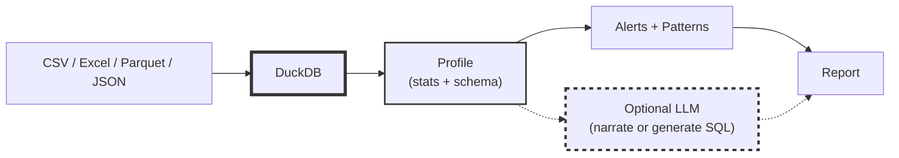
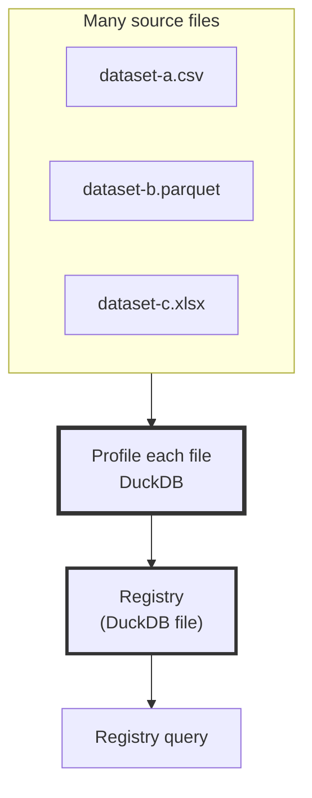

# DataSummarizer: Statistics-First Data Profiling with DuckDB
<!--category-- Data Analysis, DuckDB, C#, LLM, ONNX -->
<datetime class="hidden">2025-12-22T18:30</datetime>

[](https://github.com/scottgal/mostlylucidweb/tree/main/Mostlylucid.DataSummarizer)
[](https://github.com/scottgal/mostlylucidweb/releases?q=datasummarizer)
[](https://dotnet.microsoft.com/)

If you've ever opened a new dataset and immediately asked:

- Which columns are junk?
- Where are the missing values?
- What looks like an ID?
- What's skewed / leaky / suspicious?

…you already know what *data profiling* is for.

**DataSummarizer** is a CLI tool I built to make that first pass fast, local, and repeatable. It combines deterministic profiling with optional LLM narration to give you both **facts** and **insights** about your data.

- **DuckDB** computes a deterministic statistical profile (no in-memory loading).
- An **LLM** (optional) either narrates that profile *or* generates SQL that DuckDB runs locally.
- An **ONNX model** (optional) can score columns using profile features ("sentinel scoring").
- **Constraint validation** lets you define data contracts and catch drift early.
- **Segment comparison** helps you compare datasets, cohorts, or time periods.

This builds on the same philosophy as my [CSV analysis with local LLMs](/blog/analysing-large-csv-files-with-local-llms): **LLMs reason, databases compute.**

[TOC]

---

## Trust model (in plain English)

- **Deterministic**: profiling, alerts, target analysis, constraint validation, segment comparison, registry ingestion.
- **Heuristic** (fast, approximate): distribution labels, trends/seasonality, FK/monotonic hints.
- **LLM-generated** (optional): narrative summaries, SQL generation, result summarization.
- **Data stays local**: DuckDB is embedded; LLM calls go to your local Ollama endpoint.

If you want *zero* row-level exposure to the LLM, run with `--no-llm`.

---

## Why statistics-first

Pasting data into a prompt and asking "tell me about this" fails because:

1. **Scale**: millions of rows won't fit in a context window.
2. **Correctness**: LLMs can't reliably compute aggregates from raw rows.
3. **Reproducibility**: prompts drift; computed stats don't.

DataSummarizer flips the order: **compute facts first**, then optionally narrate.



---

## 30-second quick start

```bash
# Default: Full profile with local LLM narrative (most detailed, recommended)
datasummarizer -f "Bank_Churn.csv" --model qwen2.5-coder:7b

# Super fast mode: Stats only, skip expensive patterns (fastest, deterministic)
datasummarizer -f "Bank_Churn.csv" --no-llm --fast

# Stats with all patterns (no LLM but thorough profiling)
datasummarizer -f "Bank_Churn.csv" --no-llm

# Target-aware profiling (analyze feature effects on your label)
datasummarizer -f "Bank_Churn.csv" --target Exited --no-llm
```

**Sample output** from the fast mode (10,000 rows, 13 columns, ~1 second):

```
── Summary ─────────────────────────────────────────────────────────

This dataset contains **10,000 rows** and **13 columns**. Column breakdown: 
5 numeric, 6 categorical. Found 1 warning(s) to review.

╭─────────────────┬─────────────┬───────┬────────┬──────────────────────╮
│ Column          │ Type        │ Nulls │ Unique │ Stats                │
├─────────────────┼─────────────┼───────┼────────┼──────────────────────┤
│ CustomerId      │ Id          │ 0.0%  │ 9,438  │ -                    │
│ CreditScore     │ Numeric     │ 0.0%  │ 509    │ μ=650.5, σ=96.7      │
│ Geography       │ Categorical │ 0.0%  │ 3      │ top: France          │
│ Age             │ Numeric     │ 0.0%  │ 67     │ μ=38.9, σ=10.5       │
│ Balance         │ Numeric     │ 0.0%  │ 6,938  │ μ=76485.9, σ=62397.4 │
│ NumOfProducts   │ Categorical │ 0.0%  │ 4      │ top: 1               │
│ EstimatedSalary │ Numeric     │ 0.0%  │ 10,000 │ μ=100090.2, σ=57510  │
│ Exited          │ Categorical │ 0.0%  │ 2      │ top: 0               │
╰─────────────────┴─────────────┴───────┴────────┴──────────────────────╯

── Alerts ──────────────────────────────────────────────────────────
- Age: 359 outliers (3.6%) outside IQR bounds [14.0, 62.0]
- NumOfProducts: ℹ Ordinal detected: 4 integer levels
- EstimatedSalary: ⚠ Potential leakage: 100.0% unique (10,000 values)

── Insights ────────────────────────────────────────────────────────
💡 Modeling Recommendations (score 0.70)
⚠ Exclude ID columns from features: CustomerId
```

---

## What gets profiled

A `DataProfile` (the main output type) contains:

| Category | Metrics |
|----------|---------|
| **Schema** | Row count, column count, inferred types |
| **Data Quality** | Null %, unique %, constants, outliers (IQR) |
| **Numeric Stats** | Min/max, mean/median, stddev, quantiles, skewness, MAD |
| **Categorical Stats** | Unique count, top values, mode, imbalance ratio, entropy |
| **Relationships** | Pearson correlations (limited pairs), FK overlap hints |
| **Patterns** | Text formats (email/URL/UUID), distribution labels, trends, time gaps |
| **Alerts** | Leakage warnings, high nulls, extreme skew, ordinal hints |

The goal is **not** to replace proper EDA. It's to quickly surface the "fix this before you model anything" problems.

---

## Target-aware profiling (feature effects)

With `--target <column>`, you get supervised-style analysis **without training a model**:

```bash
datasummarizer -f "Bank_Churn.csv" --target Exited --no-llm
```

**Output includes:**

```
── Insights ────────────────────────────────────────────────────────
🎯 Exited Analysis Summary (score 0.95)
Target rate: 20.4%. Top drivers: NumOfProducts (Δ0.8%), Age (Δ0.7%), 
Balance (Δ0.3%). See feature effects below for actionable segments.

Target driver: NumOfProducts (score 0.86)
NumOfProducts = 4 has 1 rate 100.0% vs baseline 20.4% (Δ 79.6%)

Target driver: Age (score 0.82)
Average Age is 44.8 for 1 vs 37.4 for 0 (Δ 7.4)

💡 Modeling Recommendations (score 0.70)
ℹ Good candidate for logistic regression or gradient boosting
⚠ Exclude ID columns from features: CustomerId
```

This surfaces:
- **Class imbalance** (20.4% churn rate)
- **Top drivers** using Cohen's d and rate deltas
- **Segment effects** (e.g., NumOfProducts=4 → 100% churn)
- **Modeling recommendations** (algorithm suggestions, warnings)

---

## Plain English Q&A (two modes)

When you run `--query`, DataSummarizer takes one of two paths:

1. **Profile-only answers** (no SQL): for broad questions like "tell me about this data", the LLM sees the profile and writes a short narrative.
2. **SQL-backed answers**: for specific questions, the LLM generates DuckDB SQL using the profiled schema, DuckDB executes it locally, and the LLM summarizes the result.

```bash
# Profile-grounded overview (no SQL, profile only)
datasummarizer -f sales.csv --model qwen2.5-coder:7b \
  --query "tell me about this data"

# Specific question (generates SQL, runs locally, summarizes)
datasummarizer -f sales.csv --model qwen2.5-coder:7b \
  --query "top selling product categories"
```

**Important:** SQL-backed answers share the query result (up to 20 rows) with the local LLM for summarization. If you want to avoid that, stick to `--no-llm` or profile-only questions.

**Session-aware Q&A:** Add `--session-id <id>` to keep conversational context across runs. Turns are stored in the Registry and retrieved by similarity.

---

## The registry: profiling many datasets

If you have a folder full of files and want cross-dataset questions ("which dataset contains churn?"), DataSummarizer can ingest profiles into a local **Registry**.

- The **Registry** is a DuckDB file (set via `--vector-db`).
- It stores computed profile JSON + derived text embeddings for similarity search.
- It does **not** copy full tables; profiling reads original files in place.

```bash
# Ingest a directory (recursive, supports globs)
datasummarizer --ingest-dir "sampledata/" --no-llm \
  --vector-db sampledata/registry.duckdb

# Ingest specific files/patterns
datasummarizer --ingest-files \
  "sampledata/Bank*.csv" \
  "sampledata/CO2*.csv" \
  --no-llm --vector-db sampledata/registry.duckdb

# Ask across the ingested registry
datasummarizer --registry-query "Which datasets have a churn-like target?" \
  --vector-db sampledata/registry.duckdb --no-llm
```



**Implementation note:** If DuckDB `vss` extension is available, registry search uses it. Otherwise it falls back to in-process cosine distance over hash-based embeddings (good for lightweight retrieval, not deep semantic search).

---

## Constraint validation (data contracts)

DataSummarizer can auto-generate and validate **constraint suites** - essentially data contracts that capture expected schema and statistical properties.

### Generate constraints from your reference data

```bash
# Profile source data and auto-generate constraints
datasummarizer validate \
  --source "Bank_Churn.csv" \
  --target "bank_synthetic.csv" \
  --generate-constraints \
  --output bank-constraints.json \
  --no-llm
```

This generates **41 constraints** from the source data including:

- Row count should be between 5,000 and 20,000
- Column count should be 13
- All expected columns should exist
- `CreditScore` should be Numeric, range [350, 850] ±10%
- `Geography` values should be in {France, Germany, Spain}
- `Gender` values should be in {Male, Female}
- `EstimatedSalary` should have unique values (100% cardinality)

### Validate new data against constraints

```bash
# Validate target dataset against constraint suite
datasummarizer validate \
  --source "Bank_Churn.csv" \
  --target "new_batch.csv" \
  --constraints bank-constraints.json \
  --format markdown \
  --no-llm
```

**Output (Markdown format):**

```
── Constraint Validation: Auto-generated from Bank_Churn.csv ───────
Pass Rate: 87.8% (36/41)

## Failed Constraints

- Row count should be between 5,000 and 20,000
  Actual: 100 rows

- Column 'NumOfProducts' should be of type Categorical
  Actual: Numeric

- Column 'HasCrCard' should be of type Categorical
  Actual: Numeric
```

### What gets validated

| Constraint Type | Example |
|----------------|---------|
| **Row Count** | Between 5,000 and 20,000 rows |
| **Column Count** | Exactly 13 columns |
| **Columns Exist** | All expected columns present |
| **Column Type** | `CreditScore` must be Numeric |
| **Not Null** | `Age` must not have null values |
| **Value Range** | `Age` between 18 and 92 (±10%) |
| **Values In Set** | `Geography` ∈ {France, Germany, Spain} |
| **Uniqueness** | `EstimatedSalary` should be 100% unique |

### Use cases

- **Data pipeline testing**: Ensure synthetic/transformed data matches expected schema
- **Drift monitoring**: Track when new data violates expected bounds
- **CI/CD integration**: Use `--strict` mode to fail builds on violations

```bash
# Strict mode: exit with error code if constraints fail
datasummarizer validate \
  --source production.csv \
  --target new_batch.csv \
  --constraints prod-constraints.json \
  --strict
```

**Output formats:** `--format json` (default, machine-readable), `--format markdown` (reports), `--format html` (shareable docs).

---

## Segment comparison (A/B profiling)

Compare two datasets or cohorts to understand distributional differences:

```bash
# Compare production vs synthetic data
datasummarizer segment \
  --segment-a "Bank_Churn.csv" \
  --segment-b "bank_synthetic.csv" \
  --format markdown
```

**Sample output:**

```
── Segment Comparison ──────────────────────────────────────────────
Segment A: Bank_Churn.csv (10,000 rows)
Segment B: bank_synthetic.csv (100 rows)

Similarity: 94.6%
Anomaly Scores: A=0.086 (Excellent), B=0.250 (Fair)

Insights:
  - Segments are highly similar (>90% match)
  - Segment sizes differ by -99.0% (10,000 vs 100 rows)

Top Differences:
╭─────────────┬─────────┬──────────┬──────────┬──────────┬──────────╮
│ Column      │ Type    │ Distance │ A        │ B        │ Delta    │
├─────────────┼─────────┼──────────┼──────────┼──────────┼──────────┤
│ Age         │ Numeric │ 0.166    │ 38.92    │ 38.61    │ -0.3     │
│ Surname     │ Text    │ 0.154    │ -        │ -        │ -        │
│ CreditScore │ Numeric │ 0.115    │ 650.53   │ 641.84   │ -8.7     │
│ Tenure      │ Numeric │ 0.096    │ 5.01     │ 5.03     │ +0.0     │
│ Balance     │ Numeric │ 0.084    │ 76485.89 │ 86920.91 │ +10435.0 │
╰─────────────┴─────────┴──────────┴──────────┴──────────┴──────────╯
```

### What you get

- **Similarity score** (0-1): overall distributional similarity
- **Anomaly scores** for each segment (detects data quality issues)
- **Column-by-column comparison**: mean deltas, mode shifts, distribution distances
- **Auto-generated insights**: e.g., "highly similar", "Age increased by 7.4 years"

### Use cases

| Use Case | Example |
|----------|---------|
| **Synthetic data validation** | Compare generated data vs source distribution |
| **Cohort analysis** | Compare customer segments, treatment vs control groups |
| **Temporal drift** | Track how data evolves over time (Q1 vs Q2) |
| **A/B testing** | Compare metrics across test variants |
| **Data migration** | Verify old system vs new system data |

```bash
# Compare two time periods or cohorts
datasummarizer segment \
  --segment-a "sales_q1_2024.csv" --segment-name-a "Q1 2024" \
  --segment-b "sales_q2_2024.csv" --segment-name-b "Q2 2024" \
  --output comparison-report.md \
  --format markdown
```

**Segment comparison can also work with stored profiles:**

```bash
# Store profiles first
datasummarizer profile -f production.csv --output prod.profile.json --store-path profiles.duckdb
datasummarizer profile -f staging.csv --output staging.profile.json --store-path profiles.duckdb

# Compare stored profiles by ID
datasummarizer segment \
  --segment-a <profile-id-1> \
  --segment-b <profile-id-2> \
  --store-path profiles.duckdb
```

---

## Optional ONNX sentinel scoring

If you pass `--onnx path/to/model.onnx`, DataSummarizer can score each column using an ONNX model.

It's deliberately narrow:

- **Input**: a fixed feature vector built from the column's computed stats (null %, unique %, stddev, skewness, outlier ratio, imbalance ratio, text length, type flags).
- **Output**: a score clamped to 0–1 (higher = "more interesting/risky").

If the model is missing or incompatible, it safely no-ops.

This is useful for flagging columns that might need extra attention (e.g., high-risk PII, leakage candidates, data quality issues).

---

## Heuristics (what the pattern labels actually mean)

These are intentionally simple and fast (good enough for a first pass):

| Pattern | Detection Logic |
|---------|----------------|
| **Text formats** | Regex match rate ≥10% of non-null values (email/URL/UUID/phone/etc.) |
| **Novel text patterns** | Dominant character-class structure covers ≥70% of sampled distinct values |
| **Distribution labels** | Based on skewness + kurtosis; bimodal uses 10-bin histogram with ≥2 peaks |
| **FK overlap hint** | Value overlap >90% between candidate columns |
| **Monotonic hint** | >95% of transitions increase/decrease (first 10k rows) |
| **Seasonality** | Day-of-week count variation (CV >0.3) |
| **Trends** | Linear fit vs date (R² threshold) or row order |

These are **not** formal statistical tests - they're fast heuristics to flag "check this" candidates.

---

## Performance options (wide/large tables)

For wide tables (hundreds of columns) or very large files:

```bash
# Limit columns analyzed (auto-selects "most interesting")
datasummarizer -f wide.csv --max-columns 50 --no-llm

# Only analyze specific columns
datasummarizer -f wide.csv --columns Age,Balance,Exited --no-llm

# Exclude specific columns
datasummarizer -f wide.csv --exclude-columns Id,Timestamp --no-llm

# Skip expensive operations
datasummarizer -f wide.csv --fast --skip-correlations --no-llm

# Ignore CSV parsing errors (malformed rows)
datasummarizer -f messy.csv --ignore-errors --no-llm
```

| Option | Effect |
|--------|--------|
| `--fast` | Skip expensive pattern detection (trends/time-series) |
| `--skip-correlations` | Skip correlation matrix (faster for many numeric columns) |
| `--max-columns N` | Limit to N most interesting columns (default 50, 0=unlimited) |
| `--columns a,b,c` | Only analyze specific columns |
| `--exclude-columns x,y,z` | Exclude columns from analysis |
| `--ignore-errors` | Ignore CSV parsing errors |

---

## Command reference

| Command | Purpose |
|---------|---------|
| `profile` | Save profile as JSON (machine-readable) |
| `synth` | Generate synthetic data from a profile |
| `validate` | Compare datasets, report drift, or validate constraints |
| `segment` | Compare two datasets or stored profiles |
| `tool` | JSON output for pipelines/agents (compact format) |
| `store` | Manage the profile store (list, clear, prune) |

Full CLI reference and examples: [Mostlylucid.DataSummarizer/README.md](https://github.com/scottgal/mostlylucidweb/tree/main/Mostlylucid.DataSummarizer)

---

## Next steps

- **Full command reference**: `Mostlylucid.DataSummarizer/README.md`
- **Code paths**: Start with `Services/DuckDbProfiler.cs` and `Services/DataSummarizerService.cs`
- **MCP integration**: Use the `tool` command for LLM agent integration
- **CI/CD**: Use `validate --strict` in your test pipeline

**Related articles:**
- [CSV analysis with local LLMs](/blog/analysing-large-csv-files-with-local-llms) - The foundational pattern
- [DocSummarizer](/blog/building-a-document-summarizer-with-rag) - Same philosophy for documents
