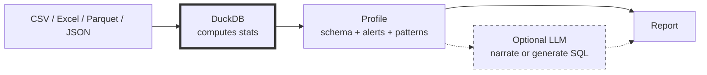

# DataSummarizer: Fast Local Data Profiling with DuckDB
<!--category-- Data Analysis, DuckDB, C#, LLM, ONNX -->
<datetime class="hidden">2025-12-22T18:30</datetime>

[](https://github.com/scottgal/mostlylucidweb/tree/main/Mostlylucid.DataSummarizer)
[](https://github.com/scottgal/mostlylucidweb/releases?q=datasummarizer)
[](https://dotnet.microsoft.com/)

You open a new CSV. 10,000 rows, 50 columns. What's in here? Which columns are junk? Where are the nulls? What's skewed?

**DataSummarizer** answers those questions in under a second — no cloud upload, no manual EDA, just **deterministic stats + optional AI narration**.

```bash
# Profile 10,000 rows in ~1 second (no LLM, pure stats)
datasummarizer -f Bank_Churn.csv --no-llm --fast

# Same, but with AI insights (requires Ollama)
datasummarizer -f Bank_Churn.csv --model qwen2.5-coder:7b

# Ask questions about your data
datasummarizer -f sales.csv --query "top selling products" --model qwen2.5-coder:7b

# Validate data contracts
datasummarizer validate --source prod.csv --target new_batch.csv --constraints rules.json --strict

# Track drift automatically (cron-friendly)
datasummarizer tool -f daily_export.csv --auto-drift --store
```

[TOC]

---

## What it is (and isn't)

**✔ DataSummarizer is:**
- **Fast**: Profiles 100k rows in seconds using DuckDB (out-of-core, no memory limits)
- **Local**: Everything runs on your machine (DuckDB embedded, optional Ollama for LLM)
- **Deterministic**: Stats are computed, not guessed (LLM only narrates or generates SQL)
- **Production-ready**: Constraint validation, drift detection, CI/CD integration

**✘ It's NOT:**
- A replacement for full exploratory data analysis
- AutoML or model training
- A cloud service (zero telemetry, zero data upload)

---

## How it works



1. **DuckDB** profiles the data (row/column stats, outliers, patterns)
2. **Profile** is a deterministic JSON blob (facts, not guesses)
3. **LLM** (optional) either narrates the profile *or* generates SQL that DuckDB executes locally

**Why this order matters:** LLMs can't reliably compute aggregates from raw rows. So we compute facts first, then optionally narrate.

---

## 30-second quick start

```bash
# Install (requires .NET 10 SDK)
dotnet tool install -g datasummarizer

# Profile a file (full analysis, no LLM)
datasummarizer -f Bank_Churn.csv --no-llm

# With AI insights (requires Ollama running locally)
datasummarizer -f Bank_Churn.csv --model qwen2.5-coder:7b

# Target-aware profiling (what drives churn?)
datasummarizer -f Bank_Churn.csv --target Exited --no-llm
```

**Sample output** (10,000 rows, 13 columns, ~1 second):

```
── Summary ─────────────────────────────────────────────────────────
10,000 rows × 13 columns (5 numeric, 6 categorical, 2 ID)

── Top Alerts ──────────────────────────────────────────────────────
⚠ EstimatedSalary: 100% unique (10,000 values) - possible leakage
ℹ Age: 359 outliers (3.6%) outside IQR bounds [14.0, 62.0]
ℹ NumOfProducts: Ordinal detected (4 integer levels)

── Insights ────────────────────────────────────────────────────────
🎯 Exited Analysis Summary (score 0.95)
   Target rate: 20.4%. Top drivers: NumOfProducts, Age, Balance

💡 Modeling Recommendations (score 0.70)
   ⚠ Exclude ID columns: CustomerId, Surname
   ℹ Good candidate for logistic regression or gradient boosting
```

---

## What gets profiled

| Category | Metrics |
|----------|---------|
| **Schema** | Row count, column count, inferred types (Numeric/Categorical/DateTime/Text/Id) |
| **Data Quality** | Null %, unique %, constants, outliers (IQR), high cardinality flags |
| **Numeric Stats** | Min/max, mean/median/stddev, quantiles, skewness, MAD, outlier count |
| **Categorical Stats** | Unique count, top values, mode, imbalance ratio, entropy |
| **Relationships** | Pearson correlations (limited pairs), FK overlap hints |
| **Patterns** | Text formats (email/URL/UUID/phone), distribution labels (normal/skewed/bimodal), trends, seasonality |
| **Alerts** | Leakage warnings, high nulls, extreme skew, ordinal hints, ID column detection |

---

## Key features

### 1. **Target-aware profiling** (feature effects without training models)

```bash
datasummarizer -f Bank_Churn.csv --target Exited --no-llm
```

Outputs:
- **Class distribution** (79.6% retained, 20.4% churned)
- **Top drivers** using Cohen's d and rate deltas
- **Segment effects** (e.g., NumOfProducts=4 → 100% churn)
- **Modeling recommendations** (algorithm suggestions, warnings)

### 2. **Plain English Q&A** (two modes)

```bash
# Profile-only answer (no SQL)
datasummarizer -f sales.csv --query "tell me about this data" --model qwen2.5-coder:7b

# SQL-backed answer (LLM generates SQL, DuckDB executes, LLM summarizes)
datasummarizer -f sales.csv --query "top 5 selling products" --model qwen2.5-coder:7b

# Interactive mode (profile once, ask many questions)
datasummarizer -f sales.csv --interactive --model qwen2.5-coder:7b
```

**What the LLM sees:**
- Always: The computed profile (schema + stats + alerts)
- SQL mode: Query results (up to 20 rows for summarization)
- Never: Your raw data (unless you enable SQL mode)

### 3. **Constraint validation** (data contracts)

```bash
# Generate constraints from reference data
datasummarizer validate --source prod.csv --target prod.csv --generate-constraints

# Validate new data against constraints
datasummarizer validate --source prod.csv --target new_batch.csv \
  --constraints prod-constraints.json --strict
```

**Exit code 1** if constraints fail in `--strict` mode (CI/CD friendly).

### 4. **Automatic drift detection** (cron-friendly)

```bash
# Daily cron job (no manual baseline management)
datasummarizer tool -f /data/daily_export.csv --auto-drift --store
```

**What happens:**
1. Profile computed
2. Baseline auto-selected (oldest profile with same schema)
3. Drift calculated using Kolmogorov-Smirnov (numeric) and Jensen-Shannon divergence (categorical)
4. Report emitted with drift score + recommendations

**If drift > 0.3**, auto-generates suggested constraints for review.

### 5. **Segment comparison** (A/B profiling)

```bash
# Compare production vs synthetic data
datasummarizer segment --segment-a prod.csv --segment-b synthetic.csv --format markdown

# Compare time periods
datasummarizer segment --segment-a q1.csv --segment-b q2.csv \
  --name-a "Q1 2024" --name-b "Q2 2024"
```

Outputs: similarity score, anomaly scores, column-by-column deltas.

### 6. **Multi-file registry** (cross-dataset search)

```bash
# Ingest a directory
datasummarizer --ingest-dir sampledata/ --no-llm --vector-db registry.duckdb

# Ask across ingested data
datasummarizer --registry-query "Which datasets have churn?" \
  --vector-db registry.duckdb --model qwen2.5-coder:7b
```

---

## Trust model (what's deterministic vs heuristic vs LLM)

| Component | Type | Example |
|-----------|------|---------|
| **Profiling** | Deterministic | Row count, nulls, mean/stddev, quantiles |
| **Alerts** | Deterministic | Outliers (IQR), leakage flags, high nulls |
| **Target analysis** | Deterministic | Cohen's d, rate deltas, segment effects |
| **Constraint validation** | Deterministic | Schema checks, range validation |
| **Drift detection** | Deterministic | KS/JS distance metrics |
| **Pattern detection** | Heuristic | Distribution labels (normal/skewed), FK hints, trends |
| **LLM insights** | LLM-generated | Narrative summaries, SQL generation |

**Heuristic thresholds** (fast approximations, not formal tests):
- Text format match ≥10% → flag as email/URL/UUID
- Skewness + kurtosis → label distribution shape
- Value overlap >90% → FK hint
- Transitions >95% monotonic → monotonic hint

**SQL safety:** Generated SQL is read-only, results limited to 20 rows, no COPY/ATTACH/INSTALL/EXPORT.

---

## Commands

| Command | Purpose |
|---------|---------|
| `datasummarizer -f <file>` | Human-friendly report (pretty tables, alerts, insights) |
| `profile` | Save profile as JSON |
| `synth` | Generate synthetic data from profile |
| `validate` | Compare datasets, validate constraints |
| `segment` | A/B comparison (similarity, anomaly scores, deltas) |
| `tool` | Compact JSON for LLM tools/agents |
| `store` | Manage profile store (list, clear, prune, interactive menu) |

---

## Performance

**Benchmarks** (.NET 10, M1 Mac, DuckDB embedded):

| Dataset | Rows | Columns | Time (--fast --no-llm) |
|---------|------|---------|------------------------|
| Bank churn | 10,000 | 13 | ~1 second |
| Sales synthetic | 100,000 | 14 | ~2 seconds |
| Wide table | 50,000 | 200 | ~8 seconds (--max-columns 50) |

**Performance options:**
- `--fast`: Skip expensive patterns (trends/time-series)
- `--skip-correlations`: Skip correlation matrix
- `--max-columns N`: Auto-select N most interesting columns
- `--columns a,b,c`: Only analyze specific columns

---

## Installation & requirements

```bash
# Install as .NET global tool
dotnet tool install -g datasummarizer

# Or download standalone binaries (no .NET required)
# https://github.com/scottgal/mostlylucidweb/releases?q=datasummarizer
```

**Requirements:**
- .NET 10 SDK (or use standalone binaries)
- DuckDB (embedded via `DuckDB.NET.Data.Full`)
- Optional: Ollama for LLM features (default model: `qwen2.5-coder:7b`)

---

## Next steps

- **Full command reference**: [Mostlylucid.DataSummarizer/README.md](https://github.com/scottgal/mostlylucidweb/tree/main/Mostlylucid.DataSummarizer)
- **Code**: Start with `Services/DuckDbProfiler.cs` and `Services/DataSummarizerService.cs`
- **MCP integration**: Use `tool` command for LLM agents
- **CI/CD**: Use `validate --strict` in test pipelines

**Related:**
- [CSV analysis with local LLMs](/blog/analysing-large-csv-files-with-local-llms) - Foundational pattern
- [DocSummarizer](/blog/building-a-document-summarizer-with-rag) - Same philosophy for documents
