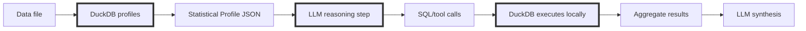

# DataSummarizer: Fast Local Data Profiling

<!--category-- Data Analysis, DuckDB, C#, LLM -->

<datetime class="hidden">2025-12-22T18:30</datetime>

**Series: Local LLMs for Data — Part 2 of 2**

DataSummarizer packages a proven pattern into a CLI: compute deterministic profiles with DuckDB, persist them, and optionally layer a local LLM for narration, safe SQL suggestions, and conversational follow-ups. 

The tool keeps the heavy numeric work local and auditable (profiles, drift detection, fidelity reports), while the LLM is limited to interpreting those facts or drafting read-only SQL that DuckDB executes in a sandbox. This yields fast, private profiling, trustworthy automation (`tool` JSON), drift monitoring, and the ability to create PII-free synthetic clones that match statistical shape — all without sending raw rows to a model.

See [Part 1](/blog/analysing-large-csv-files-with-local-llms) for the schema+sample → LLM SQL pattern that inspired this design.

**You'll notice this isn't 1.0 yet that's because I've yet to finalize it**

[](https://github.com/scottgal/mostlylucidweb/releases?q=datasummarizer)

> README See the [tool's readme here for](https://github.com/scottgal/mostlylucidweb/blob/main/Mostlylucid.DataSummarizer/README.md) ALL the functionality it has. It's deceptively simple, but powerful. The tool is designed to be used by data analysts, engineers, and scientists who need to quickly understand and validate their data without compromising privacy or security. Well That's the PLAN...I'm neither of those things so 🤷‍♂️

This is a follow-up to **[How to Analyse Large CSV Files with Local LLMs in C#](/blog/analysing-large-csv-files-with-local-llms)**.

That article’s core point was simple:

> **LLMs should generate queries, not consume data.**

This one pushes the same idea further:

* don’t even feed the LLM “samples” unless you really have to
* feed it **statistical shape**
* let DuckDB compute facts
* let the LLM reason over *those facts* and ask for more

And because you now have a statistical shape, you can do something genuinely useful:

> generate a **PII-free synthetic clone** that behaves like the original dataset.

[TOC]

---

## The Problem With “Chat With Your Data”

When people bolt an LLM onto data analysis, they usually do one of these:

1. shove rows into context (falls over fast, leaks data)
2. embed chunks and retrieve them (still row-level, still leaky)
3. “representative samples” (often unrepresentative, still risky)

Even if you have a 200k token context window, you can’t compute reliable aggregates on large data by reading rows. LLMs aren’t built for that.

The correct abstraction is still:

**LLM reasons. Database computes.**

But you can improve it again by changing what the LLM sees.

---

## The Key Upgrade: Statistics as the Interface

Instead of giving the model data, give it a **profile**.

A profile is a compact, deterministic summary of the dataset:

* schema + inferred types
* null rate, uniqueness, cardinality
* min/max/quantiles, skew, outliers
* top values for safe categoricals
* PII risk signals (regex + classifier)
* time-series structure (span, gaps, granularity)
* optional drift deltas vs baseline

The model can now:

* decide what’s interesting
* propose follow-up queries
* interpret results

…without ever seeing raw rows.

### The architecture



This keeps the “LLM → SQL → DuckDB” pattern, but makes it more robust:

* the first step is deterministic profiling
* the LLM is operating on facts, not anecdotes

---

## Why the Profile Helps (Even Without an LLM)

A profile answers the boring-but-urgent questions immediately:

* Which columns are junk (all-null, constant, near-constant)?
* Which columns are leakage risks (near-unique identifiers)?
* Which columns are high-null / high-outlier?
* What are the dominant categories?
* Is this time series contiguous or full of gaps?
* Are distributions skewed (long tails, zero-inflated)?

These are the questions you usually discover 30 minutes into messing about with spreadsheets.

The profile gives you them in seconds.

---

## Why the Profile Helps the LLM

If you *do* enable the LLM, the profile is what makes it useful rather than performative.

With profile-only context, it can do things like:

* pick “interesting” columns to focus on (high entropy, high skew, high nulls)
* suggest sensible group-bys (low-cardinality categoricals)
* avoid garbage SQL (no grouping on 95%-unique columns)
* notice drift (“this categorical distribution moved”)
* ask for targeted follow-up stats rather than requesting more rows

That last point is the one most systems miss.

You don’t need a bigger model.
You need better tools and better evidence.

---

## The Tool I Built: DataSummarizer

I ended up turning this into a CLI so I could run it on arbitrary files (including in cron) without hand-writing analysis each time.

[](https://github.com/scottgal/mostlylucidweb/releases?q=datasummarizer)

### The quickest start

**Windows:** drag a file onto `datasummarizer.exe`

**CLI:**

```bash
datasummarizer mydata.csv
```

### Tool mode (JSON output)

```bash
datasummarizer tool -f mydata.csv > profile.json
```

That `profile.json` is the interface the LLM consumes (and the thing you can store for drift comparisons).

---

## Operational defaults (explicit)

- Ollama URL used by the CLI: `http://localhost:11434` (configure in `appsettings.json` if you want a different host).
- Default model used by the CLI: `qwen2.5-coder:7b` (override with `--model`).
- Default registry file for cross-dataset queries / conversations: `.datasummarizer.vss.duckdb` (override with `--vector-db`).
- SQL execution constraints when LLM-driven SQL is used:
  - Result set cap: up to 20 rows returned to the LLM.
  - Forbidden statements: `COPY`, `ATTACH`, `INSTALL`, `CREATE`, `DROP`, `INSERT`, `UPDATE`, `DELETE`, `PRAGMA` (unsafe pragmas).

These defaults make local use straightforward and secure by design.

---

## Example: Deterministic Profiling Output

```bash
datasummarizer -f "Hospital+Patient+Records/patients.csv" --no-llm --fast
```

Real output (974 patient records with PII):

```
── Summary ────────────────────────────────────────────────

This dataset contains **974 rows** and **20 columns**. Column breakdown: 2
numeric, 9 categorical, 2 date/time. **4 column(s)** have >10% null values.
Found 8 warning(s) to review.

Column      Type        Nulls  Unique  Stats
Id          Id          0.0%   974     -
BIRTHDATE   DateTime    0.0%   974     1922-03-24 → 1991-11-27
DEATHDATE   DateTime    84.2%  161     2011-02-03 → 2022-01-27
FIRST       Text        0.0%   974     -
ADDRESS     Text        0.0%   974     -
CITY        Categorical 0.0%   33      top: Boston
STATE       Categorical 0.0%   1       top: Massachusetts
LAT         Numeric     0.0%   974     μ=42.3, σ=0.0, range=42.2-42.5

── Alerts ─────────────────────────────────────────────────
- DEATHDATE: 84.2% null values
- FIRST: 100.0% unique - possibly an ID column
- FIRST: ⚠ Potential data leakage: 100.0% unique (974 values)
- ADDRESS: 100.0% unique - possibly an ID column
- STATE: Column has only one unique value
```

You get schema + stats + alerts immediately — **all computed by DuckDB**. No guessing.

---

## Example: Compact `tool` JSON (for Agents/CI)

When you run `tool` mode the output is structured JSON optimized for automation:

```bash
datasummarizer tool -f patients.csv --store > profile.json
```

Real output (abridged):

```json
{
  "Success": true,
  "Profile": {
    "SourcePath": "patients.csv",
    "RowCount": 974,
    "ColumnCount": 20,
    "ExecutiveSummary": "974 rows, 20 columns. 4 columns have nulls. 18 alerts.",
    "Columns": [
      { "Name": "Id", "Type": "Id", "UniquePercent": 100 },
      { "Name": "BIRTHDATE", "Type": "DateTime", "NullPercent": 0 },
      { "Name": "DEATHDATE", "Type": "DateTime", "NullPercent": 84.2 }
    ]
  },
  "Metadata": {
    "ProfiledAt": "2025-12-20T16:07:27Z",
    "ProfileId": "0ae8dcc4d79b",
    "SchemaHash": "44d9ad8af68c1c62"
  }
}
```

Use these fields in automation to track provenance, schema changes, and data quality over time.

---

## Automatic Drift Detection (Cron-Friendly)

Once you have profiles, drift becomes “free”.

```bash
datasummarizer tool -f daily_export.csv --auto-drift --store > drift.json
```

How it works:

1. compute today’s profile
2. pick baseline automatically by schema fingerprint (or pinned baseline)
3. compute drift using:

    * KS distance for numeric distributions
    * Jensen–Shannon divergence for categorical distributions
4. emit a report

Run it daily:

```bash
0 2 * * * datasummarizer tool -f /data/daily_export.csv --auto-drift --store > /logs/drift.json
```

CI snippet (fail on significant drift):

```bash
# requires jq
drift_score=$(jq '.Drift.DriftScore // 0' drift.json)
if (( $(echo "$drift_score > 0.3" | bc -l) )); then
  echo "❌ Significant drift: $drift_score"; exit 1
fi
```

---

## The Killer Feature: Cloner (Synthetic Data From Shape)

Once you have a statistical profile, you can generate a synthetic dataset that:

* contains **no original values**
* contains **no PII**
* matches the **statistical shape** (distribution, cardinality effects)

This is exactly what I want for demos, CI tests, support repros, and shareable sample data.

### Real Example: Hospital Patients

```bash
# 1. Profile the real data (974 patients with PII)
datasummarizer profile -f patients.csv --output patients-profile.json --no-llm

# 2. Generate 100 synthetic patients
datasummarizer synth --profile patients-profile.json --synthesize-to synthetic.csv --synthesize-rows 100

# 3. Validate fidelity
datasummarizer validate --source patients.csv --target synthetic.csv --format markdown
```

Output shows the match quality:

```
── Data Drift Validation ──────────────────────────────────
Source: patients.csv (974 rows)
Target: synthetic.csv (100 rows)
Drift Score: 1.000
Anomaly Score: 0.300 (Fair)

Top Differences:
Column      Type        Distance  A         B           Delta
SUFFIX      Categorical 0.408     PhD       Health,     +1.3pp nulls
                                            Shoes &
                                            Toys
BIRTHPLACE  Text        0.173     -         -           -
CITY        Categorical 0.107     Boston    Boston      -
```

The fidelity report quantifies deltas in null %, quantiles, categorical frequency tables, and drift distances. The synthetic data is PII-free and safe to share.

---

## Cross-File Analysis: Segment Comparison

Compare two datasets to understand differences:

```bash
datasummarizer segment \
  --segment-a patients.csv \
  --segment-b synthetic.csv \
  --name-a "Real Patients" \
  --name-b "Synthetic" \
  --format markdown
```

Real output:

```
── Segment Comparison ─────────────────────────────────────
Segment A: Real Patients (974 rows)
Segment B: Synthetic (100 rows)

Similarity: 92.5%
Anomaly Scores: A=0.240 (Fair), B=0.300 (Fair)

Insights:
  - Segments are highly similar (>90% match)
  - Segment sizes differ by -89.7% (974 vs 100 rows)
  - 'SUFFIX' mode changed from 'PhD' to 'Health, Shoes & Toys'

Top Differences:
Column      Type        Distance  A       B              Delta
SUFFIX      Categorical 0.408     PhD     Health, Shoes  +1.3pp nulls
                                          & Toys
BIRTHPLACE  Text        0.173     -       -              -
CITY        Categorical 0.107     Boston  Boston         -
```

This is useful for A/B testing, cohort analysis, or verifying synthetic data quality.

---

## Session & Registry (Cross-Dataset Queries)

- Use `--session-id <id>` to tie questions together across CLI invocations
- Use `--ingest-dir` to profile an entire directory into a registry
- Query across multiple datasets with `--registry-query`

Example:

```bash
# ingest hospital data directory (6 CSV files)
datasummarizer --ingest-dir "Hospital+Patient+Records/" --vector-db hospital.duckdb

# Result: encounters.csv, patients.csv, procedures.csv, etc. all profiled and stored

# then run cross-file queries
datasummarizer -f patients.csv --query "which files have patient IDs?" \
  --session-id hospital-analysis --vector-db hospital.duckdb
```

The registry enables semantic search across datasets using vector embeddings of column names and statistics.

---

## Trust Model (short)

**Deterministic:** all stats, quantiles, top-k, entropy, uniqueness, and drift distances are computed by DuckDB.

**Optional (LLM):** narrative summaries, SQL suggestions, and guided tool selection. The LLM *interprets* the profile; it does not produce the underlying numbers.

If you need hermetic, auditable runs (CI, regulatory contexts), use `--no-llm` and rely on the JSON/tool output.

---

## Get It

**Repo:** [https://github.com/scottgal/mostlylucidweb/tree/main/Mostlylucid.DataSummarizer](https://github.com/scottgal/mostlylucidweb/tree/main/Mostlylucid.DataSummarizer)

Requirements:

* .NET 10
* DuckDB (embedded)
* optional: Ollama for LLM features

Related:

* [Analysing large CSV files with local LLMs](/blog/analysing-large-csv-files-with-local-llms)
* [DocSummarizer](/blog/building-a-document-summarizer-with-rag)

