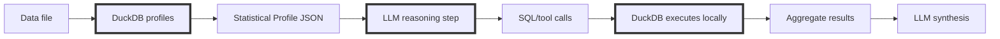

# DataSummarizer: Fast Local Data Profiling

<!--category-- Data Analysis, DuckDB, C#, LLM -->

<datetime class="hidden">2025-12-22T18:30</datetime>


Most “chat with your data” systems make the same mistake: they treat an LLM as if it were a database.

They shove rows into context, embed chunks, or pick “representative samples” and hope the model can infer structure, quality, and truth from anecdotes. It works just well enough to demo - and then collapses under scale, privacy constraints, or basic questions like “is this column junk?”

**DataSummarizer takes the opposite approach.**

It computes a **deterministic statistical profile** of your dataset using DuckDB, persists that profile, and *optionally* layers a **local LLM** on top to interpret those facts, propose safe read-only SQL, and guide follow-up analysis. The heavy lifting is numeric, auditable, and fast. The LLM is deliberately constrained to reasoning and narration.

The result is:

* fast, private profiling
* trustworthy automation (`tool` JSON)
* built-in drift detection
* and something most systems can’t do at all: **PII-free synthetic datasets that preserve statistical shape**

All without sending raw rows to a model.

This builds directly on **[How to Analyse Large CSV Files with Local LLMs in C#](/blog/analysing-large-csv-files-with-local-llms)**, which introduced the core idea:

> **LLMs should generate queries, not consume data.**

This article pushes that idea further:

* don’t feed the LLM rows
* don’t even feed it “samples” unless you must
* feed it **statistical shape**
* let DuckDB compute facts
* let the LLM reason over those facts - and ask for more

---

[](https://github.com/scottgal/mostlylucidweb/releases?q=datasummarizer)

> Full documentation lives in the
> **[DataSummarizer README](https://github.com/scottgal/mostlylucidweb/blob/main/Mostlylucid.DataSummarizer/README.md)**
> The tool looks simple. It isn’t. Most of the work is in what *isn’t* sent to the model.

> **Note:** This isn’t 1.0 yet. That’s intentional. The interface is stable; the edges are still being sharpened.

---

## The Problem With “Chat With Your Data”

When teams bolt an LLM onto data analysis, they usually do one of three things:

1. shove rows into context (falls over fast, leaks data)
2. embed chunks and retrieve them (still row-level, still leaky)
3. pass “representative samples” (often unrepresentative, still risky)

Even with 200k token context windows, this is the wrong abstraction.

LLMs are not designed to compute aggregates, detect skew, or reason reliably about distributional properties by reading rows. They hallucinate because they’re being asked to do database work.

The correct split is still:

**LLM reasons. Database computes.**

But you can go one step further by changing *what* the LLM reasons over.

---

## The Key Upgrade: Statistics as the Interface

Instead of giving the model data, give it a **profile**.

A profile is a compact, deterministic summary of a dataset’s shape:

* schema + inferred types
* null rate, uniqueness, cardinality
* min / max / quantiles, skew, outliers
* top values for safe categoricals
* PII risk signals (regex + classifier)
* time-series structure (span, gaps, granularity)
* optional drift deltas vs a baseline

This profile becomes the *interface* between reasoning and computation.

The model can now:

* decide what’s interesting
* propose sensible follow-up queries
* interpret results
* detect drift

…without ever seeing raw rows.

### Architecture



This preserves the familiar **LLM → SQL → DuckDB** loop, but anchors it in facts:

* profiling is deterministic
* the LLM operates on evidence, not anecdotes

---

## Why the Profile Is Useful (Even Without an LLM)

A profile answers the boring-but-urgent questions immediately:

* Which columns are junk (all-null, constant, near-constant)?
* Which columns are leakage risks (near-unique identifiers)?
* Which columns are high-null or outlier-heavy?
* What are the dominant categories?
* Is this time series contiguous or full of gaps?
* Are distributions skewed or zero-inflated?

These are the questions you normally discover 30 minutes into spreadsheet archaeology.

The profile gives you them in seconds.

---

## Why the Profile Makes the LLM Actually Useful

If you *do* enable the LLM, the profile is what stops it being performative.

With profile-only context, the model can:

* focus on high-entropy or high-skew columns
* suggest sensible group-bys (low-cardinality categoricals)
* avoid garbage SQL (no grouping on 95%-unique columns)
* notice distributional drift
* ask for *targeted* follow-up statistics instead of requesting more data

You don’t need a bigger model.

You need better evidence.

---

## The Tool: DataSummarizer

I turned this into a CLI so I could run it on arbitrary files - including in cron and CI - without hand-writing analysis every time.

[](https://github.com/scottgal/mostlylucidweb/releases?q=datasummarizer)

### Quick start

**Windows:** drag a file onto `datasummarizer.exe`

**CLI:**

```bash
datasummarizer mydata.csv
```

### Tool mode (JSON output)

```bash
datasummarizer tool -f mydata.csv > profile.json
```

That `profile.json` is the contract:

* consumed by agents
* stored for drift detection
* used for synthetic data generation

---

## Operational Defaults (Explicit)

* Ollama endpoint: `http://localhost:11434` (configurable)
* Default model: `qwen2.5-coder:7b` (override with `--model`)
* Default registry DB: `.datasummarizer.vss.duckdb`
* SQL safety constraints:

    * max 20 rows returned to the LLM
    * forbidden: `COPY`, `ATTACH`, `INSTALL`, `CREATE`, `DROP`, `INSERT`, `UPDATE`, `DELETE`, unsafe `PRAGMA`

The defaults are intentionally conservative. You can loosen them - but you have to opt in.

---

## Deterministic Profiling (Example)

```bash
datasummarizer -f patients.csv --no-llm --fast
```

Output (974 patient records with PII):

```
── Summary ────────────────────────────────────────────────
974 rows, 20 columns. 4 columns have >10% nulls. 8 warnings.
```

Alerts flag leakage risks, high-null columns, constant fields, and suspicious identifiers - all computed by DuckDB.

No guessing. No hallucination.

---

## Tool JSON for Automation

```bash
datasummarizer tool -f patients.csv --store > profile.json
```

Abridged output:

```json
{
  "Profile": {
    "RowCount": 974,
    "ColumnCount": 20,
    "ExecutiveSummary": "974 rows, 20 columns. 18 alerts."
  },
  "Metadata": {
    "ProfileId": "0ae8dcc4d79b",
    "SchemaHash": "44d9ad8af68c1c62"
  }
}
```

This is designed to be diffed, stored, and audited.

---

## Automatic Drift Detection (Cron-Friendly)

Once profiles exist, drift becomes cheap:

```bash
datasummarizer tool -f daily_export.csv --auto-drift --store
```

* KS distance for numeric columns
* Jensen–Shannon divergence for categoricals
* schema-fingerprinted baselines

It’s boring infrastructure - which is exactly what you want.

---

## The Killer Feature: Synthetic Clones From Shape

Once you have statistical shape, you can do something genuinely useful:

Generate synthetic datasets that:

* contain **no original values**
* contain **no PII**
* preserve **distribution, cardinality, and sparsity effects**

This is ideal for demos, CI, support repros, and shareable samples.

The fidelity report quantifies how close the synthetic data is - rather than hand-waving “realistic”.

---

## Trust Model

* **Deterministic:** all stats, quantiles, drift scores, and alerts are computed by DuckDB.
* **Optional LLM:** narration, reasoning, and SQL suggestions only.
* **Hermetic mode:** `--no-llm` produces fully auditable outputs suitable for CI or regulated environments.

The LLM never invents facts. It reacts to them.

---

## Get It

**Repo:**
[https://github.com/scottgal/mostlylucidweb/tree/main/Mostlylucid.DataSummarizer](https://github.com/scottgal/mostlylucidweb/tree/main/Mostlylucid.DataSummarizer)

**Requirements:**

* .NET 10
* DuckDB (embedded)
* optional: Ollama

**Related:**

* [Analysing large CSV files with local LLMs](/blog/analysing-large-csv-files-with-local-llms)
* [DocSummarizer](/blog/building-a-document-summarizer-with-rag)
* [Constrained Fuzziness Pattern](/blog/constrained-fuzziness-pattern) - The underlying philosophy: determinism computes, probability proposes
* [Image Summarizer](/blog/constrained-fuzzy-image-intelligence) - The same pattern applied to image understanding
