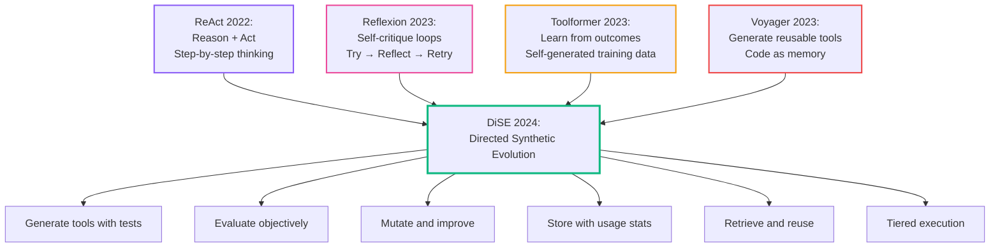
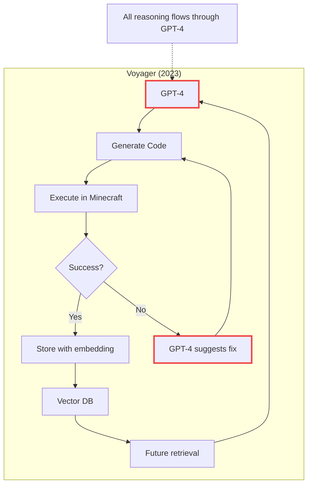
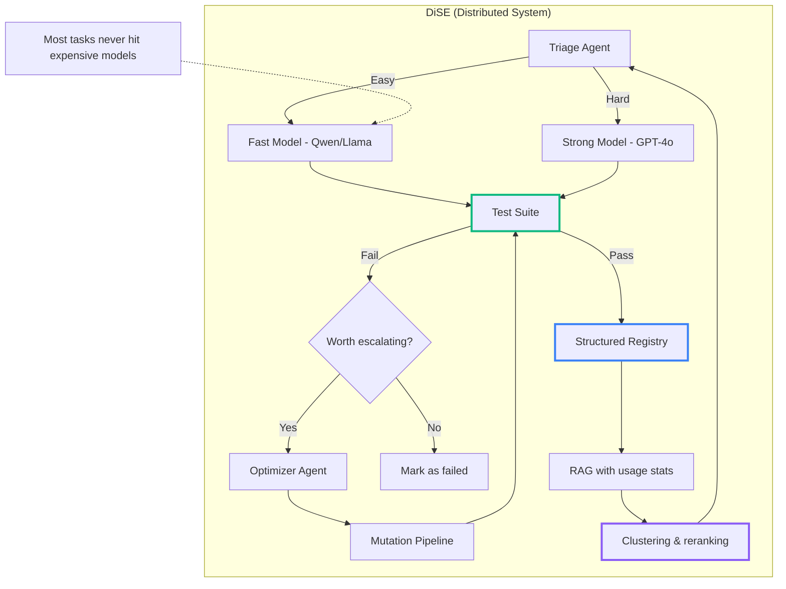

# "Isn't DiSE Just Voyager?" - Why Structure Beats Brilliance

<!--category-- AI, Machine Learning, LLMs, Code Generation -->
<datetime class="hidden">2025-11-24T18:00</datetime>

My system, DiSE, is a self-optimizing, self-assembling, software engineering grounded workflow builder. It generates testable code artifacts, evaluates them objectively, and evolves them over time without constant human supervision. But here's the thing: didn't Voyager—that impressive Minecraft bot from 2023—already do this by generating reusable skills? And didn't Toolformer already prove that LLMs could learn to use tools by measuring outcomes? If we already have agents that write their own tools and learn when to use them, haven't we already solved the problem of self-improving AI agents?

Spoiler: No. And understanding why matters if you're building anything that needs to run in production.

## Introduction

"This sounds like Voyager but with more steps."

Fair point. If you've been following LLM-driven agent research, you've probably heard of [Voyager](https://arxiv.org/abs/2305.16291) (Wang et al., 2023) - the system that taught GPT-4 to play Minecraft by generating reusable code "skills" - and [Toolformer](https://arxiv.org/abs/2302.04761) (Schick et al., 2023) - which taught LLMs to use tools by measuring actual outcomes. Both were impressive, influential, and widely cited.

At first glance, DiSE (Directed Synthetic Evolution) might look like Voyager + Toolformer with a fresh coat of paint. But that's like saying a production database is just a spreadsheet with more steps. The distinction matters if you care about scale, cost, and actually shipping something.

> **New to DiSE?** Check out [my elevator pitch](/blog/elevatorpitch) for the big picture, then explore the "Cooking with DiSE" series: [Part 2 on Graduated Apprenticeships](/blog/blog-article-cooking-dise-part2-apprenticeships) and [Part 3 on Untrustworthy LLMs](/blog/blog-article-cooking-dise-part3-untrustworthy-gods). This post focuses specifically on how DiSE's architecture differs from Voyager and Toolformer.

This post explains what Voyager and Toolformer got right, where they hit limits, and why DiSE's architectural approach solves problems that neither could tackle alone.

[TOC]

## What Voyager and Toolformer Did Well

Two papers from 2023 changed how we think about LLM agents and tools:

### Voyager: Agents Can Generate Tools

Voyager introduced a crucial insight:

**LLMs can generate their own reusable tools.**

Instead of hard-coding every action in Minecraft, Voyager used GPT-4 to write functions on the fly. Each successful action became a reusable skill stored in a vector database. The prompt was explicit:

> "Your function will be reused for building more complex functions. Therefore, you should make it generic and reusable."

This was important. For the first time, an agent system treated tool generation as **real software engineering** rather than one-off prompting. Voyager showed that agents could:

- Build a growing library of skills over time
- Compose simple skills into complex behaviours
- Avoid catastrophic forgetting through embedding-based retrieval

And it worked. Sort of. In Minecraft. With GPT-4.

### Toolformer: Agents Can Learn When to Use Tools

[Toolformer](https://arxiv.org/abs/2302.04761) (Schick et al., 2023) took a different approach. Instead of generating tools, it taught LLMs **when to call existing tools**.

The clever bit: Toolformer generated its own training data. It would:
1. Insert potential tool calls into text ("maybe I should use a calculator here?")
2. Actually execute those tools
3. Keep the examples where tools helped, discard where they didn't
4. Fine-tune on the successful examples

This created models that learned tool use from **objective outcomes** rather than human annotation. A calculator API that returns the right answer is better than one that doesn't - no LLM judgement needed.

### How DiSE Combines Both (And Goes Further)

DiSE takes insights from both papers but addresses their gaps:

**From Voyager:**
- ✅ Generate reusable code artifacts
- ✅ Store them for future retrieval
- ❌ But add: Objective test harnesses, not just "does it work in Minecraft?"
- ❌ But add: Tiered models instead of GPT-4 for everything
- ❌ But add: Mutation and evolution, not just storage

**From Toolformer:**
- ✅ Learn from objective outcomes
- ✅ Generate training data automatically
- ❌ But add: Runtime evolution, not just training-time learning
- ❌ But add: Generate the tools themselves, not just learn to call them
- ❌ But add: Full lifecycle - tools can be improved, not just used

**DiSE's genealogy:**

Think of DiSE as the grandchild of ReAct, Reflexion, Toolformer, and Voyager. Each ancestor contributed something crucial:

**The inheritance:**
- **ReAct** → Structured reasoning with action-observation loops
- **Reflexion** → Self-improvement through reflection (but LLM judges itself)
- **Toolformer** → Learn from actual outcomes, not just prompts
- **Voyager** → Generate and store reusable code artifacts

**What DiSE adds:**
- Objective test harnesses (not LLM self-judgement)
- Runtime evolution (not just training time)
- Tiered model execution (cheap → expensive only when needed)
- Full tool lifecycle (birth → mutation → inheritance → death)
- Cost optimization feedback loops
- Stateful tool registry (a bit of Fielding's REST architecture - tools as addressable resources with state)

Toolformer proved you could train models to use tools by measuring real outcomes. Voyager proved agents could build their own tool libraries. Reflexion proved reflection loops work. ReAct proved structured reasoning helps.

DiSE asks: **What if we combined all of these insights, but made it cheap enough to run in production and smart enough to improve itself over time?**

And yes, there's a dash of Roy Fielding's REST architecture in there too - tools are stateful resources with URIs, metadata, and versioning. Each tool is addressable, cacheable, and can be composed with others. The tool registry isn't just a vector database; it's a RESTful store where resources (tools) have state (usage stats, performance metrics, version history) that influences how they're retrieved and evolved.

That's not training. That's not one-off generation. That's **directed evolution**.

### The Voyager Architecture

See the problem? Every decision - planning, evaluation, debugging, composition - goes through the same frontier model. When you need brilliance at every step, you need GPT-4 (or equivalent) everywhere.

## What Held Voyager Back

Voyager wasn't just using GPT-4 for code generation. It relied on GPT-4 for:

- **Planning** - Breaking down high-level goals into sub-tasks
- **Evaluation** - Deciding if a skill worked correctly
- **Decomposition** - Figuring out which existing skills to combine
- **Naming** - Creating descriptive identifiers for storage
- **Selection** - Choosing the right skill from embeddings
- **Quality judgement** - Deciding what's "good enough"

When the model does everything, it needs to be frontier-level brilliant every time.

That's precisely why Voyager didn't scale beyond Minecraft. And it's why running it in production would cost a fortune.

### The Cost Problem

Let's do some napkin math. Say you want to run a Voyager-style system for real-world tasks:

- GPT-4 Turbo: ~$0.01 per 1K input tokens, ~$0.03 per 1K output tokens
- Typical skill generation: ~2K input + 1K output = $0.05
- 100 skills with 3 retry attempts each = ~300 calls = **$15**
- That's just the initial library build

Now add retrieval queries, composition attempts, debugging cycles. You're easily looking at hundreds of dollars for a single agent to build a moderate skill library.

For comparison, here's what a tiered approach might cost:

| Task | Voyager (GPT-4) | DiSE (Tiered) | Savings |
|------|-----------------|---------------|---------|
| Triage/routing | $0.05 | $0.001 (Llama 3.1 8B) | 98% |
| Initial generation | $0.05 | $0.002 (Qwen 2.5 Coder) | 96% |
| Evaluation | $0.05 | $0 (static tests) | 100% |
| Escalation (10%) | $0.05 | $0.05 (GPT-4o) | 0% |
| **Average per task** | **$0.20** | **$0.016** | **92%** |

When you only call the expensive model for genuinely hard problems, the economics change dramatically.

## Why DiSE Wasn't Possible in 2023 (But Is Now)

Voyager, Toolformer, and Reflexion were not failures. They simply hit the technical and economic ceiling of their moment.

Three constraints blocked progress in 2023:

| Limitation (2023) | Consequence | What Changed (2024–2025) |
|-------------------|-------------|--------------------------|
| GPT-4 was the only reliable reasoning engine | One model had to do everything | Tiered model stacks — GPT-4o + Qwen + DeepSeek + Llama |
| Local embeddings were weak or unused | Retrieval was expensive | BGE / Arctic / MiniLM on consumer GPUs |
| No structured evaluation harness | LLM judged LLM | LLMs now run code cleanly via containerized exec |

**So Voyager and Toolformer couldn't evolve.**

They could only call models or fine-tune models.
They couldn't distribute cognition across a system.
They couldn't apply selection pressure.

They solved the **"can we?"** question.

DiSE solves the **"how do we keep improving?"** question.

Not because I'm smarter than Wang or Schick — but because the hardware, tooling, and economics finally caught up.

**This is an engineering problem.**
And engineering is always a question of timing.

## DiSE's Core Difference

The key idea behind DiSE is simple but profound:

**Structure replaces brilliance.**

Instead of expecting one model to do everything perfectly, DiSE distributes the problem across an orchestration system. It doesn't assume models "know how to code". Instead, it creates **pressure, feedback, and memory** so models can improve code iteratively rather than generate it perfectly on the first try.

### DiSE Architecture

The difference is stark:

| Capability | Voyager | DiSE |
|------------|---------|------|
| Code generation | GPT-4 | Tiered multi-LLM pipeline |
| Evaluation | GPT-4 judgement | Non-LLM tests, metrics |
| Tool reuse | Embeddings only | Registry with metadata + tags + usage stats |
| Improvement | GPT-4 suggests fixes | Escalation & mutation pipelines |
| Memory | Vector DB | RAG + clustering + evolution tracking |
| Composition | GPT-4 plans | Workflow graph planning |
| Cost control | None | Prioritisation + fallback logic |

## Why DiSE Doesn't Need GPT-4 (Most of the Time)

Because **every unit of generated code is treated as an artifact**, not a prompt response.

It's not judged by "does this look good?" - it's judged by:
- Does it run?
- Does it solve the task?
- Is it faster than before?
- Does it pass the test suite?

A cheap LLM (Qwen 2.5 Coder 7B, Llama 3.1 8B) can generate five variants. Tests select the best. A stronger model only gets involved when weaker ones fail.

Over time, the system learns which models are good for which domains. Like I did with my [semantic search implementation](/blog/semantic-search-with-onnx-and-qdrant) - you don't need the biggest model when you have the right architecture.

The refinement process becomes **evolutionary, not autoregressive**.

### Real Example: Sorting Algorithms

Let's make this concrete. Say you want your agent to implement efficient sorting.

**Voyager approach:**
1. GPT-4 generates QuickSort implementation
2. GPT-4 evaluates if it "looks correct"
3. GPT-4 runs it in the environment
4. If it fails, GPT-4 suggests fixes
5. Cost: ~$0.20-0.30 per attempt

**DiSE approach:**
1. Triage: "implement efficient sorting" → routed to general tier
2. Qwen 2.5 Coder 7B generates 5 variants (QuickSort, MergeSort, HeapSort, variations)
3. Test suite runs all 5 against:
   - Correctness tests (sorted output, stability, edge cases)
   - Performance benchmarks (time, memory)
   - Static analysis (complexity, code quality)
4. Best performing variant goes into registry with metrics
5. Cost: ~$0.002-0.005
6. Future requests for "sorting" retrieve this proven implementation
7. If someone later needs "stable sorting", optimizer can mutate the existing code instead of starting from scratch

The cheap model can explore the solution space. The tests do the selection. The expensive model only gets involved if all 5 variants fail.

## What This Means in Practice

I've been experimenting with similar principles in [my blog's RAG system](/blog/rag-primer) and [semantic intelligence features](/blog/semantidintelligence). The pattern is consistent:

**Use the biggest model for architecture decisions, not execution.**

When I built the [broken link handler](/blog/the-war-on-404) with semantic search fallback, I didn't use GPT-4 to check every link. The system:
1. Uses simple HEAD requests to check link validity (no LLM)
2. Falls back to semantic search when links break (ONNX model)
3. Only involves an LLM if semantic search fails (rarely needed)

The expensive intelligence is in the design, not the execution.

## The Key Question

Each system asks a different question:

**Toolformer asks:**
> Can an LLM learn when to use tools by measuring which tool calls actually help?

**Voyager asks:**
> Can an LLM generate reusable code that helps in future tasks?

**DiSE asks:**
> Can a system generate tools, evaluate them objectively, evolve them based on real outcomes, and do all this efficiently enough to run in production?

Toolformer proved **outcome-based learning works**.
Voyager proved **generated tools can be reused**.
DiSE proves **tools can evolve continuously without breaking the bank**.

Toolformer is **training time**.
Voyager is **flash**.
DiSE is **infrastructure**.

One shows you can learn from outcomes.
One shows you can generate tools.
The other builds machinery for continuous evolution.

## Practical Implications

If you're building LLM-powered systems today, the DiSE approach suggests:

### 1. Build Evaluation First

Don't generate code and hope it works. Write tests that define "works". Like I do for [my Entity Framework migrations](/blog/efmigrationstherightway) - the tests run, or they don't. No LLM judgement needed.

### 2. Use Tiers Aggressively

Route simple tasks to cheap models. Reserve expensive models for genuinely hard problems. Your wallet will thank you.

### 3. Track What Works

Store not just the code, but:
- What it was generated for
- Which model created it
- How well it performed
- How often it gets reused

This metadata becomes training data for your routing logic.

### 4. Embrace Evolution

Don't expect perfection on the first try. Generate variants, test them, keep the winners, mutate the good-but-not-perfect ones.

This is how I approach development on this blog - iterate in public, [learn from real traffic](/blog/usingumamidataforwebsitestats), improve based on actual usage.

## Why Structure Matters More Than You Think

The difference between Voyager and DiSE isn't just about cost. It's about **what happens when things fail**.

In Voyager, failure means:
- Ask GPT-4 to debug
- Hope it understands the problem
- Pay $0.05 for the privilege

In DiSE, failure triggers:
- Structured error analysis (what failed, why, what was expected)
- Variant generation from working alternatives
- Escalation only if the problem is genuinely novel
- Learning for future similar failures

The system gets **smarter about what it doesn't know**.

## The Future is Hybrid

I don't think we're going to see pure "single model does everything" systems win in production. The economics don't work, and the failure modes are too opaque.

Instead, we'll see hybrid systems like DiSE:
- Cheap models for common patterns
- Expensive models for novel problems
- Non-LLM logic for everything else (tests, metrics, validation)
- Memory systems that actually learn from outcomes

We're seeing this pattern everywhere:
- [RAG systems](/blog/rag-architecture) combining retrieval + generation
- [Multi-agent workflows](/blog/workflowsystem-part1-introduction) with specialised components
- [Semantic search](/blog/semantic-search-in-action) using embeddings + reranking

The magic isn't in having one brilliant model. It's in having the **right model at the right time** with the **right context**.

## Conclusion

Voyager was a beacon. It showed that agents could learn by generating code.

The next step wasn't more prompting. That approach is reaching its limits.

The next step is **directed synthetic evolution**:
- Deliberate variation
- Objective evaluation
- Systematic inheritance
- Structural learning

DiSE isn't trying to be smarter in a single shot.
It's trying to be better on the **next** shot.

That difference is where evolution begins.

And unlike biological evolution, we don't have to wait millions of years to see results.

---

## Why DiSE Is Different

- **Doesn't need fine-tuning** - Works with any LLM via API
- **Doesn't need GPT-4 for everything** - Tiered execution keeps costs down
- **Doesn't hallucinate evaluation** - Objective test harnesses, not LLM judgement
- **Doesn't throw code away** - Every artifact is stored, versioned, tracked
- **Doesn't forget past work** - RAG + usage stats = institutional memory
- **Doesn't fear failure** - Uses it as selection pressure for evolution

---

## Further Reading

**Papers:**
- [Voyager: An Open-Ended Embodied Agent with Large Language Models](https://arxiv.org/abs/2305.16291) - The original paper
- [ToolFormer](https://arxiv.org/abs/2302.04761) - Teaching LLMs to use tools
- [ReAct](https://arxiv.org/abs/2210.03629) - Reasoning + Acting pattern
- [Tree of Thoughts](https://arxiv.org/abs/2305.10601) - Deliberate problem-solving

**On this blog:**
- [Building a RAG System](/blog/rag-primer) - Hybrid retrieval + generation architecture
- [Semantic Search with ONNX and Qdrant](/blog/semantic-search-with-onnx-and-qdrant) - Embeddings without expensive APIs
- [The War on 404](/blog/the-war-on-404) - Tiered approach to link fixing
- [Using Ollama for Local LLMs](/blog/reanimation) - Self-hosting smaller models
- [Building a Lawyer GPT series](/blog/building-a-lawyer-gpt-for-your-blog-part1) - Multi-part series on RAG + LLMs

**Tools:**
- [Ollama](https://ollama.ai/) - Run Llama, Qwen, and other models locally
- [LiteLLM](https://github.com/BerriAI/litellm) - Unified API for 100+ LLM providers
- [LangChain](https://www.langchain.com/) - Framework for LLM apps (though I tend to avoid heavy frameworks)
