# Docker Development Deep Dive: From Basics to Advanced .NET Containerization

<datetime class="hidden">2025-11-09T14:00</datetime>
<!--category-- Docker, .NET, DevOps, Containers -->

## Introduction

Docker has fundamentally transformed how we build, ship, and run applications. What started as a simple containerization tool has evolved into a complete ecosystem for modern application development and deployment.

This is the fourth and most comprehensive article in my Docker series for .NET developers. If you're new to Docker, you might want to start with:

1. **[Docker Compose](/dockercompose)** - Getting started with basic multi-container setups (July 2024)
2. **[Development Dependencies with Docker Compose](/dockercomposedevdeps)** - Setting up local dev environments (August 2024)
3. **[ImageSharp with Docker](/imagesharpwithdocker)** - Solving volume permission issues (August 2024)

In this deep dive, we'll build on those foundations to explore:
- **Production-ready Docker Compose**: The actual stack running this blog
- **Self-hosting on limited resources**: Practical optimization techniques for budget VPS deployments
- **GPU support**: Running ML workloads in containers
- **Multi-architecture builds**: Supporting ARM64 and AMD64
- **.NET 9 container features**: Built-in container publishing without Dockerfiles
- **.NET Aspire**: The modern .NET approach to container orchestration

> NOTE: This is part of my experiments with AI / a way to spend $1000 Claude Code Web credits. I've fed this a BUNCH of papers, my understanding, questions I had to generate this article. It's fun and fills a gap I haven't seen filled anywhere else.

Whether you're deploying a simple web app or orchestrating a complex microservices architecture with GPU-accelerated machine learning models, this guide takes you from Docker basics to production-ready containerized applications - with real examples from running mostlylucid.com.

[TOC]

## Docker Fundamentals: Understanding Containers

### What is Docker, Really?

At its core, Docker is a containerization platform that packages your application and all its dependencies into a standardized unit called a container. Unlike virtual machines that virtualize entire operating systems, containers share the host OS kernel while maintaining isolated user spaces.

Think of it this way:
- **Virtual Machines**: Each VM runs a full OS stack (Linux kernel, system libraries, etc.) - heavy and slow to start
- **Containers**: Share the host kernel, package only application code and dependencies - lightweight and fast

### Why Containers Matter for Developers

```bash
# The classic developer problem
"It works on my machine!" 

# The container solution
"Ship your machine!" 
```

Containers solve several critical problems:

1. **Environment Consistency**: Development, testing, and production environments are identical
2. **Dependency Isolation**: No more "DLL hell" or conflicting library versions
3. **Reproducible Builds**: Same input = same output, every time
4. **Fast Deployment**: Start containers in seconds, not minutes
5. **Resource Efficiency**: Run dozens of containers on a single host

### Essential Docker Concepts

#### Images vs Containers

```bash
# An image is a template (like a class in OOP)
docker pull mcr.microsoft.com/dotnet/aspnet:9.0

# A container is a running instance (like an object)
docker run -d -p 8080:8080 myapp:latest
```

**Images** are immutable, layered filesystems. Each instruction in a Dockerfile creates a new layer:

```dockerfile
FROM mcr.microsoft.com/dotnet/aspnet:9.0      # Layer 1: Base OS + .NET runtime
WORKDIR /app                                   # Layer 2: Directory structure
COPY *.dll ./                                  # Layer 3: Application files
ENTRYPOINT ["dotnet", "MyApp.dll"]            # Layer 4: Startup command
```

This layering is powerful:
- **Caching**: Unchanged layers are reused, speeding up builds
- **Sharing**: Multiple images can share base layers
- **Efficiency**: Only changed layers need to be downloaded/uploaded

#### Understanding Dockerfile Execution: Not Your Machine!

A common source of confusion for Docker beginners: **Commands in a Dockerfile don't run on your machine - they run inside the build container's OS.**

Here's what actually happens:

```
Your Machine (Windows/Mac/Linux)
    ↓ (reads Dockerfile)
Build Image (usually Linux)
    ↓ (executes RUN commands here)
Output Image (contains results)
```

**Why this matters:**

```dockerfile
# You're on Windows, writing this Dockerfile
FROM ubuntu:24.04

# This RUN command executes in Ubuntu, NOT on your Windows machine!
RUN apt-get update && apt-get install -y curl

# This copies FROM your Windows filesystem
COPY myapp.exe /app/

# This executes IN the Ubuntu container
RUN chmod +x /app/myapp.exe
```

**Key insights:**
1. **Local filesystem**: Your `COPY` and `ADD` commands read from your machine
2. **Build image**: Your `RUN` commands execute in the container's OS (not your machine)
3. **Output image**: The final image contains all the layers created during build
4. **Cross-platform**: You can be on Windows, building a Linux image, using Linux commands

This is why you can write `apt-get` commands in a Dockerfile on Windows - they're not running on Windows! They're running inside the Linux-based build container.

**Example confusion scenario:**
```dockerfile
FROM mcr.microsoft.com/dotnet/sdk:9.0  # This is Linux-based

# You might think: "But I'm on Windows, how can I use these Linux commands?"
RUN apt-get update  # ← Executes in the Linux build container, not your Windows machine
RUN dotnet restore  # ← Executes in the Linux build container
```

The Docker daemon handles the translation between your local filesystem and the containerized build environment.

#### Dockerfile Best Practices

Here's a production-ready .NET Dockerfile with commentary:

```dockerfile
# Multi-stage build: separates build environment from runtime
# Stage 1: Build
FROM mcr.microsoft.com/dotnet/sdk:9.0 AS build
WORKDIR /src

# Copy only csproj files first (better layer caching)
COPY ["MyApp/MyApp.csproj", "MyApp/"]
COPY ["MyApp.Core/MyApp.Core.csproj", "MyApp.Core/"]

# Restore dependencies (cached unless csproj changes)
RUN dotnet restore "MyApp/MyApp.csproj"

# Copy everything else
COPY . .

# Build the application
WORKDIR "/src/MyApp"
RUN dotnet build "MyApp.csproj" -c Release -o /app/build

# Stage 2: Publish
FROM build AS publish
RUN dotnet publish "MyApp.csproj" -c Release -o /app/publish /p:UseAppHost=false

# Stage 3: Final runtime image
FROM mcr.microsoft.com/dotnet/aspnet:9.0 AS final
WORKDIR /app

# Create non-root user for security
RUN addgroup --gid 1001 appuser && \
    adduser --uid 1001 --gid 1001 --disabled-password --gecos "" appuser

# Copy published output from publish stage
COPY --from=publish /app/publish .

# Switch to non-root user
USER appuser

# Expose port (documentation only, doesn't actually publish)
EXPOSE 8080

# Set environment variables
ENV ASPNETCORE_URLS=http://+:8080
ENV ASPNETCORE_ENVIRONMENT=Production

# Health check
HEALTHCHECK --interval=30s --timeout=3s --start-period=5s --retries=3 \
    CMD curl -f http://localhost:8080/health || exit 1

ENTRYPOINT ["dotnet", "MyApp.dll"]
```

#### Understanding the Build Flow

Here's what actually happens during a multi-stage Docker build - where files come from and where they end up:

```mermaid
graph TB
    subgraph "Your Machine"
        A[Source Code<br/>*.cs, *.csproj]
        B[Frontend Assets<br/>*.js, *.css]
        C[Configuration<br/>appsettings.json]
        D[Static Files<br/>wwwroot/]
    end

    subgraph "Stage 1: Build Container (SDK Image)"
        E[dotnet/sdk:9.0<br/>~1.5GB]
        F[Copy .csproj files]
        G[dotnet restore<br/>Download NuGet packages]
        H[Copy source code]
        I[dotnet build<br/>Compile to DLLs]
        J[Build artifacts<br/>/app/build/]
    end

    subgraph "Stage 2: Publish Container"
        K[dotnet publish<br/>Optimize & trim]
        L[Published output<br/>/app/publish/]
    end

    subgraph "Stage 3: Final Runtime Container (ASPNET Image)"
        M[dotnet/aspnet:9.0<br/>~220MB]
        N[Create app user<br/>Security]
        O[Copy published files<br/>ONLY production artifacts]
        P[Final image<br/>~250MB total]
    end

    subgraph "Frontend Build Pipeline (Parallel)"
        Q[npm install<br/>node_modules/]
        R[Webpack bundling<br/>*.js → dist/]
        S[TailwindCSS + PostCSS<br/>*.css → dist/]
        T[Optimized assets<br/>wwwroot/js/dist/<br/>wwwroot/css/dist/]
    end

    A --> F
    A --> H
    F --> G
    G --> H
    H --> I
    I --> J
    J --> K
    K --> L

    B --> Q
    Q --> R
    Q --> S
    R --> T
    S --> T

    L --> O
    T --> O
    C --> O
    D --> O

    M --> N
    N --> O
    O --> P
```



**Key insights from this flow:**

1. **SDK Image discarded**: The 1.5GB SDK container is thrown away after publishing - only ~50MB of compiled output moves forward
2. **Layer caching**: Copying `.csproj` before source code means dependency restore is cached unless dependencies change
3. **Frontend assets**: Built separately (often via `npm run build`) and copied into the final image
4. **Configuration files**: `appsettings.json` and `wwwroot/` content copied from your machine, not built
5. **Final image**: Starts from minimal runtime image (~220MB) + your app (~30MB) + assets (~5MB) = ~255MB total
6. **Only production files**: Source code, obj/, bin/, node_modules/ never make it to the final image

**Key principles illustrated:**

1. **Multi-stage builds**: Separate build/publish stages reduce final image size dramatically
2. **Layer optimization**: Copy dependency files before source code for better caching
3. **Security**: Run as non-root user
4. **Health checks**: Container orchestrators can monitor application health
5. **Explicit environment**: Set production defaults

#### Building and Running

```bash
# Build the image
docker build -t myapp:1.0.0 -t myapp:latest .

# Run with common options
docker run -d \
  --name myapp \
  -p 8080:8080 \
  -e ConnectionStrings__DefaultConnection="Server=db;Database=myapp" \
  -v /data/logs:/app/logs \
  --restart unless-stopped \
  myapp:latest

# View logs
docker logs -f myapp

# Execute commands inside running container
docker exec -it myapp /bin/bash

# Stop and remove
docker stop myapp
docker rm myapp
```

## Docker Compose: Multi-Container Orchestration

Docker Compose allows you to define and run multi-container applications. Instead of managing containers individually, you describe your entire application stack in a YAML file.

### Why Docker Compose?

Consider a typical .NET web application:
- ASP.NET Core web app
- PostgreSQL database
- Redis cache
- Seq for logging
- Maybe a background worker service

Managing these individually with `docker run` commands becomes unwieldy. Docker Compose solves this.

### Complete Real-World Example: Production Blog Platform

Here's the **actual production `docker-compose.yml`** that runs this very site (mostlylucid.com):

```yaml
services:
  # Main ASP.NET Core application
  mostlylucid:
    image: scottgal/mostlylucid:latest
    restart: always
    healthcheck:
      test: [ "CMD", "curl", "-f -K", "https://mostlylucid:7240/healthy" ]
      interval: 30s
      timeout: 10s
      retries: 5
    labels:
      - "com.centurylinklabs.watchtower.enable=true"
    env_file:
      - .env
    environment:
      - Auth__GoogleClientId=${AUTH_GOOGLECLIENTID}
      - Auth__GoogleClientSecret=${AUTH_GOOGLECLIENTSECRET}
      - Auth__AdminUserGoogleId=${AUTH_ADMINUSERGOOGLEID}
      - SmtpSettings__UserName=${SMTPSETTINGS_USERNAME}
      - SmtpSettings__Password=${SMTPSETTINGS_PASSWORD}
      - Analytics__UmamiPath=${ANALYTICS_UMAMIPATH}
      - Analytics__WebsiteId=${ANALYTICS_WEBSITEID}
      - ConnectionStrings__DefaultConnection=${POSTGRES_CONNECTIONSTRING}
      - TranslateService__ServiceIPs=${EASYNMT_IPS}
      - Serilog__WriteTo__0__Args__apiKey=${SEQ_API_KEY}
      - Markdown__MarkdownPath=${MARKDOWN_MARKDOWNPATH}
    volumes:
      - /mnt/imagecache:/app/wwwroot/cache
      - /mnt/logs:/app/logs
      - /mnt/markdown:/app/markdown
      - ./mostlylucid.pfx:/app/mostlylucid.pfx
      - /mnt/articleimages:/app/wwwroot/articleimages
      - /mnt/mostlylucid/uploads:/app/wwwroot/uploads
    networks:
      - app_network
    depends_on:
      - db

  # PostgreSQL database
  db:
    image: postgres:16-alpine
    ports:
      - 5266:5432  # Custom external port to avoid conflicts
    env_file:
      - .env
    networks:
      - app_network
    healthcheck:
      test: ["CMD-SHELL", "pg_isready -U ${POSTGRES_USER}"]
      interval: 5s
      timeout: 5s
      retries: 5
    volumes:
      - /mnt/umami/postgres:/var/lib/postgresql/data
    restart: always

  # Cloudflare tunnel for secure external access
  cloudflared:
    image: cloudflare/cloudflared:latest
    command: tunnel --no-autoupdate run --token ${CLOUDFLARED_TOKEN}
    env_file:
      - .env
    restart: always
    networks:
      - app_network

  # Umami analytics
  umami:
    image: ghcr.io/umami-software/umami:postgresql-latest
    env_file: .env
    environment:
      DATABASE_URL: ${DATABASE_URL}
      DATABASE_TYPE: ${DATABASE_TYPE}
      HASH_SALT: ${HASH_SALT}
      APP_SECRET: ${APP_SECRET}
      TRACKER_SCRIPT_NAME: getinfo
      API_COLLECT_ENDPOINT: all
    depends_on:
      - db
    labels:
      - "com.centurylinklabs.watchtower.enable=true"
    networks:
      - app_network
    restart: always

  # Translation service (CPU-limited for resource management)
  easynmt:
    image: easynmt/api:2.0.2-cpu
    volumes:
      - /mnt/easynmt:/cache/
    deploy:
      resources:
        limits:
          cpus: "4.0"  # Prevent translation service from consuming all CPU
    networks:
      - app_network

  # Caddy reverse proxy with automatic HTTPS
  caddy:
    image: caddy:latest
    ports:
      - 80:80
      - 443:443
    volumes:
      - ./Caddyfile:/etc/caddy/Caddyfile
      - caddy_data:/data
      - caddy_config:/config
    networks:
      - app_network
    restart: always

  # Seq centralized logging
  seq:
    image: datalust/seq
    container_name: seq
    restart: unless-stopped
    environment:
      ACCEPT_EULA: "Y"
      SEQ_FIRSTRUN_ADMINPASSWORDHASH: ${SEQ_DEFAULT_HASH}
    volumes:
      - /mnt/seq:/data
    networks:
      - app_network

  # Prometheus metrics collection
  prometheus:
    image: prom/prometheus:latest
    container_name: prometheus
    volumes:
      - prometheus-data:/prometheus
      - ./prometheus.yml:/etc/prometheus/prometheus.yml
    command:
      - '--config.file=/etc/prometheus/prometheus.yml'
    labels:
      - "com.centurylinklabs.watchtower.enable=true"
    networks:
      - app_network

  # Grafana visualization
  grafana:
    image: grafana/grafana:latest
    container_name: grafana
    labels:
      - "com.centurylinklabs.watchtower.enable=true"
    volumes:
      - grafana-data:/var/lib/grafana
    networks:
      - app_network
    environment:
      - GF_SECURITY_ADMIN_USER=admin
      - GF_SECURITY_ADMIN_PASSWORD=${GRAFANA_PASSWORD}

  # Host metrics exporter
  node_exporter:
    image: quay.io/prometheus/node-exporter:latest
    container_name: node_exporter
    command:
      - '--path.rootfs=/host'
    networks:
      - app_network
    restart: unless-stopped
    volumes:
      - '/:/host:ro,rslave'

  # Automatic container updates
  watchtower:
    image: containrrr/watchtower
    container_name: watchtower
    restart: always
    volumes:
      - /var/run/docker.sock:/var/run/docker.sock
    environment:
      - WATCHTOWER_CLEANUP=true
      - WATCHTOWER_LABEL_ENABLE=true
    command: --interval 300  # Check every 5 minutes

volumes:
  grafana-data:
  caddy_data:
  caddy_config:
  prometheus-data:

networks:
  app_network:
    driver: bridge
```

**Key Production Patterns:**

1. **Single Network**: All services on `app_network` for simplicity
2. **Bind Mounts**: Host paths (`/mnt/*`) for persistent data you need to backup/access
3. **Named Volumes**: Docker-managed storage for data you don't need direct access to
4. **Watchtower Labels**: Only update services explicitly labeled for auto-update
5. **Resource Limits**: CPU constraints on translation service prevent resource starvation
6. **External Port Mapping**: PostgreSQL on 5266 instead of 5432 to avoid conflicts with other instances
7. **Environment Files**: Secrets in `.env` file (never committed to git)

### Docker Compose Key Features

#### Service Dependencies

```yaml
services:
  web:
    depends_on:
      db:
        condition: service_healthy  # Wait for health check
      redis:
        condition: service_started  # Just wait for start
```

Docker Compose orchestrates startup order. The `condition: service_healthy` requires the database health check to pass before starting the web app.

#### Environment Variables and Secrets

```bash
# .env file (never commit to git!)
DB_PASSWORD=super_secret_password
SMTP_PASSWORD=another_secret
```

```yaml
services:
  web:
    environment:
      - DB_PASSWORD=${DB_PASSWORD}  # From .env file
      - STATIC_VALUE=production     # Hardcoded
    env_file:
      - .env                        # Load entire file
```

For production secrets, use Docker Secrets or external secret managers (AWS Secrets Manager, Azure Key Vault, HashiCorp Vault).

#### Named Volumes vs Bind Mounts

```yaml
services:
  db:
    volumes:
      # Named volume (managed by Docker)
      - postgres_data:/var/lib/postgresql/data

  web:
    volumes:
      # Bind mount (maps host directory to container)
      - ./data/markdown:/app/Markdown
      - ./logs:/app/logs
```

**Named volumes**:
- Managed by Docker
- Persist data across container restarts
- Can be backed up/restored with Docker commands
- Cross-platform compatible

**Bind mounts**:
- Direct mapping to host filesystem
- Useful for development (live code reloading)
- Configuration files, logs, uploads

#### Networking

```yaml
networks:
  frontend:
    driver: bridge
  backend:
    driver: bridge

services:
  web:
    networks:
      - frontend
      - backend

  db:
    networks:
      - backend  # Not exposed to frontend
```

Networks provide isolation. Here, the database is only accessible to backend services, not directly exposed.

#### Health Checks

```yaml
services:
  db:
    healthcheck:
      test: ["CMD-SHELL", "pg_isready -U postgres"]
      interval: 10s
      timeout: 5s
      retries: 5
      start_period: 30s
```

Health checks allow Docker to:
- Determine if a container is actually ready (not just started)
- Restart unhealthy containers
- Provide status to orchestrators (Kubernetes, Docker Swarm)

### Common Docker Compose Commands

```bash
# Start all services (detached)
docker-compose up -d

# Start specific services
docker-compose up -d web db

# View logs (all services)
docker-compose logs -f

# View logs (specific service)
docker-compose logs -f web

# Stop services (containers remain)
docker-compose stop

# Stop and remove containers
docker-compose down

# Stop, remove containers, and remove volumes
docker-compose down -v

# Rebuild and restart
docker-compose up -d --build

# Scale a service
docker-compose up -d --scale worker=3

# Execute command in running service
docker-compose exec web /bin/bash

# Run one-off command
docker-compose run --rm web dotnet ef database update
```

### Development vs Production Compose Files

Separate concerns with multiple compose files:

**docker-compose.yml** (base):
```yaml
services:
  web:
    build: .
    environment:
      - ASPNETCORE_ENVIRONMENT=Development
```

**docker-compose.override.yml** (development - auto-merged):
```yaml
services:
  web:
    volumes:
      - .:/app  # Live code reloading
    ports:
      - "5000:8080"
```

**docker-compose.prod.yml** (production):
```yaml
services:
  web:
    image: registry.example.com/myapp:${VERSION}
    restart: always
    deploy:
      replicas: 3
      resources:
        limits:
          cpus: '2'
          memory: 2G
```

```bash
# Development (base + override)
docker-compose up -d

# Production
docker-compose -f docker-compose.yml -f docker-compose.prod.yml up -d
```

## GPU Support in Docker: Accelerating ML Workloads

Machine learning, scientific computing, and video processing applications often require GPU acceleration. Docker supports NVIDIA GPUs through the NVIDIA Container Toolkit.

### Setting Up NVIDIA Container Toolkit

```bash
# Install NVIDIA Container Toolkit (Ubuntu/Debian)
distribution=$(. /etc/os-release;echo $ID$VERSION_ID)
curl -s -L https://nvidia.github.io/libnvidia-container/gpgkey | sudo apt-key add -
curl -s -L https://nvidia.github.io/libnvidia-container/$distribution/libnvidia-container.list | \
  sudo tee /etc/apt/sources.list.d/nvidia-container-toolkit.list

sudo apt-get update
sudo apt-get install -y nvidia-container-toolkit

# Configure Docker daemon
sudo nvidia-ctk runtime configure --runtime=docker
sudo systemctl restart docker

# Test GPU access
docker run --rm --gpus all nvidia/cuda:12.6.0-base-ubuntu24.04 nvidia-smi
```

### Dockerfile for GPU-Accelerated Python/PyTorch Application

```dockerfile
# Use NVIDIA CUDA base image
FROM nvidia/cuda:12.6.0-cudnn-runtime-ubuntu24.04

# Install Python
RUN apt-get update && apt-get install -y \
    python3.12 \
    python3-pip \
    && rm -rf /var/lib/apt/lists/*

WORKDIR /app

# Install PyTorch with CUDA support
COPY requirements.txt .
RUN pip3 install --no-cache-dir torch torchvision torchaudio --index-url https://download.pytorch.org/whl/cu124

# Copy application
COPY . .

# Test GPU on container start
RUN python3 -c "import torch; print(f'CUDA available: {torch.cuda.is_available()}'); print(f'GPU: {torch.cuda.get_device_name(0) if torch.cuda.is_available() else \"None\"}')"

ENTRYPOINT ["python3", "train.py"]
```

### Running GPU Containers

```bash
# Run with all GPUs
docker run --gpus all myapp:gpu

# Run with specific GPUs
docker run --gpus '"device=0,2"' myapp:gpu

# Run with GPU memory limits
docker run --gpus all --memory=16g myapp:gpu
```

### GPU in Docker Compose

```yaml
services:
  ml-trainer:
    build:
      context: .
      dockerfile: Dockerfile.gpu
    image: myapp:gpu
    deploy:
      resources:
        reservations:
          devices:
            - driver: nvidia
              count: all  # or specific count: 1, 2, etc.
              capabilities: [gpu]
    volumes:
      - ./models:/app/models
      - ./data:/app/data
    environment:
      - NVIDIA_VISIBLE_DEVICES=all
      - CUDA_VISIBLE_DEVICES=0,1  # Use GPUs 0 and 1
```

### Real-World Example: Translation Service with GPU and CPU Builds

Here's a real production example from [mostlylucid-nmt](https://github.com/scottgal/mostlylucid-nmt), a neural machine translation service I built that powers auto-translation on this blog.

The project demonstrates:
- **GPU and CPU variants** - Same codebase, different base images
- **Multi-architecture builds** - Supports AMD64 and ARM64
- **Optimized Docker images** - Both full and minimal variants
- **Production-ready** - Health checks, volume persistence, proper logging

#### GPU-Accelerated Translation Service

```yaml
services:
  translation:
    image: scottgal/mostlylucid-nmt:gpu
    container_name: translation-gpu
    deploy:
      resources:
        reservations:
          devices:
            - driver: nvidia
              count: 1
              capabilities: [gpu]
    environment:
      - MODEL_FAMILY=opus-mt
      - FALLBACK_MODELS=mbart50,m2m100
      - CUDA_VISIBLE_DEVICES=0
      - LOG_LEVEL=info
    volumes:
      - model_cache:/app/cache  # Persistent model storage
    ports:
      - "8888:8888"
    healthcheck:
      test: ["CMD", "curl", "-f", "http://localhost:8888/health"]
      interval: 30s
      timeout: 10s
      retries: 3

volumes:
  model_cache:
```

#### CPU-Only Alternative

For environments without GPUs, the same service runs on CPU:

```yaml
services:
  translation:
    image: scottgal/mostlylucid-nmt:cpu
    container_name: translation-cpu
    environment:
      - MODEL_FAMILY=opus-mt
      - FALLBACK_MODELS=mbart50,m2m100
    volumes:
      - model_cache:/app/cache
    ports:
      - "8888:8888"
    restart: unless-stopped

volumes:
  model_cache:
```

**Available image variants:**
- `scottgal/mostlylucid-nmt:gpu` - CUDA 12.6 with PyTorch GPU support (~5GB)
- `scottgal/mostlylucid-nmt:cpu` - CPU-only, smaller footprint (~2.5GB)
- `scottgal/mostlylucid-nmt:gpu-min` - Minimal GPU build, no preloaded models (~4GB)
- `scottgal/mostlylucid-nmt:cpu-min` - Minimal CPU build (~1.5GB)

**Key features:**
- **GPU Acceleration**: 10-15x faster translation with CUDA
- **Model Auto-Download**: Downloads translation models on-demand
- **Fallback Support**: Tries Opus-MT → mBART50 → M2M100 for maximum language coverage
- **Volume Persistence**: Cache models across container restarts
- **Health Endpoints**: `/health` and `/ready` for orchestrators
- **Multi-Architecture**: Runs on x86_64 and ARM64 (Apple Silicon, Raspberry Pi)

See the [full project on GitHub](https://github.com/scottgal/mostlylucid-nmt) for Dockerfile examples, build scripts, and API documentation.

## Multi-Architecture Builds with Docker Buildx

Modern applications need to run on multiple architectures: x86_64 (AMD64) for servers, ARM64 for Raspberry Pi and Apple Silicon Macs, sometimes even ARM32 for embedded devices.

### Why Multi-Architecture Matters

```bash
# Problem: Image built on M1 Mac won't run on Linux server
docker build -t myapp:latest .  # Builds for ARM64
docker push myapp:latest
# Server tries to run it... error: "exec format error"

# Solution: Build for multiple platforms
docker buildx build --platform linux/amd64,linux/arm64 -t myapp:latest --push .
```

### Setting Up Buildx

Docker Buildx is included in Docker Desktop. For Linux:

```bash
# Verify buildx is available
docker buildx version

# Create a new builder instance
docker buildx create --name multiarch --driver docker-container --use

# Inspect and bootstrap the builder
docker buildx inspect --bootstrap

# List available platforms
docker buildx inspect | grep Platforms
```

### Multi-Architecture Dockerfile

Most Dockerfiles work without changes, but here are some tips:

```dockerfile
# Use official multi-arch base images
FROM mcr.microsoft.com/dotnet/aspnet:9.0 AS base

# For platform-specific operations, use build arguments
ARG TARGETPLATFORM
ARG BUILDPLATFORM

RUN echo "Building on $BUILDPLATFORM for $TARGETPLATFORM"

# Install architecture-specific dependencies
RUN if [ "$TARGETPLATFORM" = "linux/arm64" ]; then \
        apt-get update && apt-get install -y some-arm64-package; \
    elif [ "$TARGETPLATFORM" = "linux/amd64" ]; then \
        apt-get update && apt-get install -y some-amd64-package; \
    fi
```

### Building for Multiple Platforms

```bash
# Build and push for AMD64 and ARM64
docker buildx build \
  --platform linux/amd64,linux/arm64 \
  -t myregistry/myapp:latest \
  -t myregistry/myapp:1.0.0 \
  --push \
  .

# Build without pushing (loads into local Docker)
# Note: Can only load one platform at a time
docker buildx build \
  --platform linux/amd64 \
  -t myapp:latest \
  --load \
  .

# Build and export to tar files
docker buildx build \
  --platform linux/amd64,linux/arm64 \
  -t myapp:latest \
  -o type=tar,dest=./myapp.tar \
  .
```

### Multi-Architecture with Docker Compose

Unfortunately, Docker Compose doesn't directly support buildx. Workarounds:

**Option 1: Pre-build images**
```bash
# Build multi-arch images first
docker buildx build --platform linux/amd64,linux/arm64 -t myapp:latest --push .

# Then use in compose
```
```yaml
services:
  web:
    image: myapp:latest  # Already built for multiple architectures
```

**Option 2: Build script**
```bash
#!/bin/bash
# build-multiarch.sh

docker buildx build --platform linux/amd64,linux/arm64 \
  -t myregistry/web:latest \
  -f web/Dockerfile \
  --push \
  web/

docker buildx build --platform linux/amd64,linux/arm64 \
  -t myregistry/worker:latest \
  -f worker/Dockerfile \
  --push \
  worker/

docker-compose pull  # Pull the multi-arch images
docker-compose up -d
```

### Real-World Example: CI/CD Pipeline

GitHub Actions workflow for multi-architecture builds:

```yaml
name: Build and Push Multi-Arch Images

on:
  push:
    branches: [ main ]
    tags: [ 'v*' ]

jobs:
  build:
    runs-on: ubuntu-latest
    steps:
      - name: Checkout
        uses: actions/checkout@v4

      - name: Set up QEMU
        uses: docker/setup-qemu-action@v3

      - name: Set up Docker Buildx
        uses: docker/setup-buildx-action@v3

      - name: Login to Docker Hub
        uses: docker/login-action@v3
        with:
          username: ${{ secrets.DOCKERHUB_USERNAME }}
          password: ${{ secrets.DOCKERHUB_TOKEN }}

      - name: Extract metadata
        id: meta
        uses: docker/metadata-action@v5
        with:
          images: myregistry/myapp
          tags: |
            type=ref,event=branch
            type=semver,pattern={{version}}
            type=semver,pattern={{major}}.{{minor}}
            type=sha,prefix={{branch}}-

      - name: Build and push
        uses: docker/build-push-action@v5
        with:
          context: .
          platforms: linux/amd64,linux/arm64
          push: true
          tags: ${{ steps.meta.outputs.tags }}
          labels: ${{ steps.meta.outputs.labels }}
          cache-from: type=registry,ref=myregistry/myapp:buildcache
          cache-to: type=registry,ref=myregistry/myapp:buildcache,mode=max
```

This workflow:
- Triggers on pushes to main or version tags
- Sets up QEMU for cross-platform emulation
- Builds for AMD64 and ARM64
- Generates tags automatically (branch name, semantic versions, SHA)
- Uses registry caching for faster builds

## .NET 9 Container Improvements

.NET 9 introduces significant improvements to container support, making it easier than ever to containerize .NET applications without even writing a Dockerfile.

### Built-in Container Publishing

With .NET 9, you can publish a containerized application directly:

```bash
# Publish as a container image (no Dockerfile needed!)
dotnet publish --os linux --arch x64 -p:PublishProfile=DefaultContainer

# Specify image name and tag
dotnet publish \
  --os linux \
  --arch x64 \
  -p:PublishProfile=DefaultContainer \
  -p:ContainerImageName=myapp \
  -p:ContainerImageTag=1.0.0

# Multi-architecture
dotnet publish --os linux --arch arm64 -p:PublishProfile=DefaultContainer
```

### Configuring Container Properties

Add to your `.csproj`:

```xml
<Project Sdk="Microsoft.NET.Sdk.Web">
  <PropertyGroup>
    <TargetFramework>net9.0</TargetFramework>

    <!-- Container Configuration -->
    <ContainerImageName>myapp</ContainerImageName>
    <ContainerImageTag>$(Version)</ContainerImageTag>
    <ContainerRegistry>myregistry.azurecr.io</ContainerRegistry>

    <!-- Base image (defaults to mcr.microsoft.com/dotnet/aspnet:9.0) -->
    <ContainerBaseImage>mcr.microsoft.com/dotnet/aspnet:9.0-alpine</ContainerBaseImage>

    <!-- Container runtime configuration -->
    <ContainerWorkingDirectory>/app</ContainerWorkingDirectory>
    <ContainerPort>8080</ContainerPort>
    <ContainerEnvironmentVariable Include="ASPNETCORE_ENVIRONMENT">Production</ContainerEnvironmentVariable>

    <!-- User (security best practice) -->
    <ContainerUser>app</ContainerUser>

    <!-- Labels -->
    <ContainerLabel Include="org.opencontainers.image.description">My awesome app</ContainerLabel>
    <ContainerLabel Include="org.opencontainers.image.source">https://github.com/me/myapp</ContainerLabel>
  </PropertyGroup>
</Project>
```

Then publish:

```bash
dotnet publish -p:PublishProfile=DefaultContainer
```

### Advantages of Built-in Container Support

1. **No Dockerfile needed**: Reduces complexity
2. **Optimized images**: Microsoft tunes the images for performance
3. **Consistent**: Standard images across all .NET apps
4. **Security**: Automated base image updates
5. **Smaller images**: Trimming and AOT compilation support

### Trimming and AOT for Smaller Images

```xml
<PropertyGroup>
  <!-- Enable trimming to remove unused code -->
  <PublishTrimmed>true</PublishTrimmed>
  <TrimMode>full</TrimMode>

  <!-- OR use Native AOT for even smaller, faster images -->
  <PublishAot>true</PublishAot>
</PropertyGroup>
```

Results:
- **Standard**: ~220MB
- **With trimming**: ~110MB
- **With AOT**: ~12MB for simple apps!

### Comparison: Dockerfile vs Built-in

**Traditional Dockerfile approach:**
```dockerfile
FROM mcr.microsoft.com/dotnet/sdk:9.0 AS build
WORKDIR /src
COPY ["MyApp.csproj", "."]
RUN dotnet restore
COPY . .
RUN dotnet publish -c Release -o /app/publish

FROM mcr.microsoft.com/dotnet/aspnet:9.0
WORKDIR /app
COPY --from=build /app/publish .
ENTRYPOINT ["dotnet", "MyApp.dll"]
```

**Built-in container approach:**
```bash
# Just this!
dotnet publish -p:PublishProfile=DefaultContainer
```

Both produce similar images, but the built-in approach is simpler and more maintainable.

### When to Use Dockerfile vs Built-in

**Use Dockerfile when:**
- You need full control over the image
- Installing system dependencies
- Complex multi-stage builds
- Non-standard base images

**Use built-in when:**
- Standard .NET web/console apps
- You want simplicity
- Leveraging Microsoft optimizations
- Quick prototyping

### Chiseled Ubuntu Images

.NET 9 supports "chiseled" Ubuntu images - ultra-minimal base images:

```xml
<PropertyGroup>
  <ContainerBaseImage>mcr.microsoft.com/dotnet/aspnet:9.0-noble-chiseled</ContainerBaseImage>
</PropertyGroup>
```

Benefits:
- **Tiny**: ~50% smaller than regular images
- **Secure**: Minimal attack surface (no package manager, shell)
- **Fast**: Faster pulls and starts

Trade-offs:
- No shell (harder to debug)
- Limited system utilities

Perfect for production where security and size matter most.

## Introduction to .NET Aspire

.NET Aspire is an opinionated, cloud-ready stack for building distributed applications. Think of it as Docker Compose on steroids, specifically designed for .NET microservices.

### What is Aspire?

Aspire provides:
1. **Orchestration**: Run and connect multiple services locally
2. **Service Discovery**: Services find each other automatically
3. **Telemetry**: Built-in logging, metrics, tracing
4. **Components**: Pre-configured integrations (Redis, PostgreSQL, RabbitMQ, etc.)
5. **Deployment**: Generate Kubernetes/Docker Compose manifests

### Aspire Architecture

An Aspire solution has three project types:

1. **App Host**: Orchestrates your services
2. **Service Projects**: Your actual services (Web APIs, workers, etc.)
3. **Service Defaults**: Shared configuration (logging, health checks, etc.)

### Quick Example

**1. Create Aspire project:**
```bash
dotnet new aspire-starter -n MyDistributedApp
cd MyDistributedApp
```

**2. App Host (MyDistributedApp.AppHost/Program.cs):**
```csharp
var builder = DistributedApplication.CreateBuilder(args);

// Add Redis cache
var cache = builder.AddRedis("cache");

// Add PostgreSQL database
var db = builder.AddPostgres("postgres")
               .AddDatabase("mydb");

// Add API service (references cache and db)
var api = builder.AddProject<Projects.MyApi>("api")
                 .WithReference(cache)
                 .WithReference(db);

// Add frontend (references API)
builder.AddProject<Projects.MyWeb>("web")
       .WithReference(api);

builder.Build().Run();
```

**3. Use in your service:**
```csharp
// MyApi/Program.cs
var builder = WebApplication.CreateBuilder(args);

// Aspire automatically configures these based on AppHost
builder.AddServiceDefaults();
builder.AddRedisClient("cache");
builder.AddNpgsqlDbContext<MyDbContext>("mydb");

var app = builder.Build();
app.MapDefaultEndpoints();  // Health, metrics, etc.
```

**4. Run everything:**
```bash
dotnet run --project MyDistributedApp.AppHost
```

Aspire launches:
- Dashboard at http://localhost:15888
- All services with proper configuration
- Redis and PostgreSQL in containers
- Distributed tracing across services

### Aspire vs Docker Compose

**Docker Compose:**
- Language-agnostic
- Infrastructure-focused
- Manual service discovery
- Bring your own observability

**Aspire:**
- .NET-specific
- Development-focused
- Automatic service discovery
- Built-in telemetry
- Generates deployment manifests

**Use both**: Aspire for local development, generates Docker Compose/Kubernetes for production.

### Deploying Aspire Apps

Generate deployment manifests:

```bash
# Generate Docker Compose
dotnet run --project MyDistributedApp.AppHost -- \
  --publisher compose \
  --output-path ../deploy

# Generate Kubernetes manifests
dotnet run --project MyDistributedApp.AppHost -- \
  --publisher manifest \
  --output-path ../deploy/k8s
```

Then deploy:
```bash
# Docker Compose
docker-compose -f deploy/docker-compose.yml up -d

# Kubernetes
kubectl apply -f deploy/k8s/
```

### Aspire Components

Pre-built integrations make adding services trivial:

```csharp
// Add various backing services
var redis = builder.AddRedis("cache");
var postgres = builder.AddPostgres("db").AddDatabase("mydb");
var rabbitmq = builder.AddRabbitMQ("messaging");
var mongodb = builder.AddMongoDB("mongo").AddDatabase("docs");
var sql = builder.AddSqlServer("sql").AddDatabase("business");

// Add Azure services
var storage = builder.AddAzureStorage("storage");
var cosmos = builder.AddAzureCosmosDB("cosmos");
var servicebus = builder.AddAzureServiceBus("messaging");

// Use in services
builder.AddProject<Projects.MyService>("service")
       .WithReference(redis)
       .WithReference(postgres)
       .WithReference(rabbitmq);
```

## Self-Hosting on Limited Resources: Practical Optimization

Running a full observability stack like the one above requires significant resources. If you're self-hosting on a VPS with 4GB RAM or an old laptop, here are practical strategies to reduce resource consumption while maintaining functionality.

### Development Dependencies Only

For local development, you don't need the full production stack. The [devdeps-docker-compose.yml](/dockercomposedevdeps) approach runs only what you need:

```yaml
services:
  smtp4dev:
    image: rnwood/smtp4dev
    ports:
      - "3002:80"
      - "2525:25"
    volumes:
      - e:/smtp4dev-data:/smtp4dev
    restart: always

  postgres:
    image: postgres:16-alpine
    container_name: postgres
    ports:
      - "5432:5432"
    env_file:
      - .env
    volumes:
      - e:/data:/var/lib/postgresql/data
    restart: always
```

**Why this works for development:**
- **SMTP4Dev**: Test email functionality without a real SMTP server
- **PostgreSQL**: Matches production database
- **Total footprint**: ~200MB RAM vs 2-4GB for full stack

See the [full development dependencies guide](/dockercomposedevdeps) for setup instructions.

### Resource-Constrained Production Setup

For a budget VPS (2-4GB RAM), prioritize essential services:

```yaml
services:
  # Core application
  mostlylucid:
    image: scottgal/mostlylucid:latest
    restart: always
    env_file: .env
    volumes:
      - ./markdown:/app/markdown
      - ./logs:/app/logs
    networks:
      - app_network
    deploy:
      resources:
        limits:
          memory: 512M
          cpus: '1.0'
        reservations:
          memory: 256M

  # Database only
  db:
    image: postgres:16-alpine
    env_file: .env
    volumes:
      - db_data:/var/lib/postgresql/data
    networks:
      - app_network
    deploy:
      resources:
        limits:
          memory: 512M
    healthcheck:
      test: ["CMD-SHELL", "pg_isready -U ${POSTGRES_USER}"]
      interval: 30s
      timeout: 5s
      retries: 3

  # Caddy for HTTPS
  caddy:
    image: caddy:latest
    ports:
      - 80:80
      - 443:443
    volumes:
      - ./Caddyfile:/etc/caddy/Caddyfile
      - caddy_data:/data
    networks:
      - app_network
    deploy:
      resources:
        limits:
          memory: 128M

volumes:
  db_data:
  caddy_data:

networks:
  app_network:
```

**What's removed and alternatives:**
- **No Prometheus/Grafana**: Use external monitoring (UptimeRobot, BetterStack free tier)
- **No Seq**: Use file-based logging + `docker logs`, or Seq Cloud free tier
- **No Watchtower**: Manual updates with GitHub Actions notifications
- **No Translation Service**: Run on-demand in a separate container you start/stop manually
- **Resource limits**: Prevent any single service from consuming all memory

### Progressive Enhancement Strategy

Start minimal, add services as needed:

**Stage 1: Core (512MB-1GB VPS)**
```bash
# Just app + database + reverse proxy
docker-compose up -d mostlylucid db caddy
```

**Stage 2: Add Observability (2GB VPS)**
```bash
# Add lightweight monitoring
docker-compose up -d mostlylucid db caddy seq
# Use Seq free 10GB/month
```

**Stage 3: Full Stack (4GB+ VPS)**
```bash
# Add everything
docker-compose up -d
```

### Resource Optimization Techniques

#### 1. Use Alpine Images

```yaml
services:
  myapp:
    image: postgres:16-alpine     # 50% smaller than postgres:16
    # vs
    image: postgres:16            # Full Debian base
```

**Savings**: Alpine images are 50-70% smaller

#### 2. Shared Database Instance

Instead of one database per service, use one PostgreSQL instance with multiple databases:

```yaml
db:
  image: postgres:16-alpine
  # One instance, multiple databases
  # Umami, Mostlylucid, etc. all share this PostgreSQL
```

**Savings**: 400MB RAM per additional database you consolidate

#### 3. Limit CPU for Background Services

```yaml
easynmt:
  deploy:
    resources:
      limits:
        cpus: "2.0"      # Don't let translation consume all CPU
      reservations:
        cpus: "0.5"      # Guarantee minimum
```

This prevents background jobs from starving your web application.

#### 4. Persistent Cache Volumes

As covered in [ImageSharp with Docker](/imagesharpwithdocker), mounting cache directories prevents unnecessary reprocessing:

```yaml
mostlylucid:
  volumes:
    - /mnt/imagecache:/app/wwwroot/cache  # ImageSharp cache persists across restarts
```

**Why it matters**: Without this, every container restart regenerates all thumbnails/processed images.

#### 5. Use External Services (Free Tiers)

| Service | Self-Hosted RAM | External Alternative |
|---------|-----------------|---------------------|
| Seq | ~500MB | Seq Cloud (10GB/month free) |
| Prometheus + Grafana | ~600MB | Grafana Cloud (free tier) |
| Umami | ~200MB | Plausible (paid) or self-host elsewhere |

**Strategy**: Offload observability to free tiers, keep core application on your VPS.

#### 6. On-Demand Services

For infrequently used services like translation:

```bash
# Create a separate compose file
# translation-compose.yml
services:
  easynmt:
    image: easynmt/api:2.0.2-cpu
    ports:
      - "8888:8888"
    volumes:
      - /mnt/easynmt:/cache/

# Only run when needed
docker-compose -f translation-compose.yml up -d

# Translate your content
# ...

# Shut down when done
docker-compose -f translation-compose.yml down
```

**Savings**: 1-2GB RAM when translation service isn't running

### Real-World Budget Hosting Example

Here's what runs on a $6/month Hetzner VPS (2 vCPU, 4GB RAM):

```yaml
# Minimal production compose
services:
  mostlylucid:
    image: scottgal/mostlylucid:latest
    restart: always
    env_file: .env
    volumes:
      - /mnt/markdown:/app/markdown
      - /mnt/logs:/app/logs
      - /mnt/imagecache:/app/wwwroot/cache
    depends_on:
      - db

  db:
    image: postgres:16-alpine
    env_file: .env
    volumes:
      - /mnt/postgres:/var/lib/postgresql/data
    healthcheck:
      test: ["CMD-SHELL", "pg_isready"]
      interval: 30s

  cloudflared:
    image: cloudflare/cloudflared:latest
    command: tunnel run --token ${CLOUDFLARED_TOKEN}
    restart: always

  watchtower:
    image: containrrr/watchtower
    volumes:
      - /var/run/docker.sock:/var/run/docker.sock
    environment:
      WATCHTOWER_CLEANUP: "true"
      WATCHTOWER_LABEL_ENABLE: "true"
    command: --interval 3600  # Check once per hour, not every 5 minutes
```

**Total resource usage:**
- RAM: ~800MB (leaves 3.2GB free)
- Disk: ~2GB
- CPU: <10% idle, <50% under load

**What's different:**
- No Prometheus/Grafana (use UptimeRobot + Cloudflare Analytics)
- No Seq (use `docker logs` + occasional grep)
- No Umami (use Cloudflare Web Analytics - free)
- Watchtower checks hourly instead of every 5 minutes
- No translation service (run manually when needed)

### Monitoring on a Budget

Without Prometheus/Grafana, use these free alternatives:

**Health monitoring:**
```bash
# Simple health check script
#!/bin/bash
while true; do
  curl -f http://localhost/healthz || echo "Health check failed!" | mail -s "Alert" you@example.com
  sleep 300
done
```

**Log monitoring:**
```bash
# Watch for errors
docker-compose logs -f --tail=100 | grep -i error

# Email on critical errors
docker-compose logs -f | grep -i "critical" | while read line; do
  echo "$line" | mail -s "Critical Error" you@example.com
done
```

**Resource usage:**
```bash
# Quick resource check
docker stats --no-stream

# Pretty output
docker stats --format "table {{.Name}}\t{{.CPUPerc}}\t{{.MemUsage}}"
```

## Aspire Version: The .NET Way

Now let's reimagine the entire stack using .NET Aspire. This gives you all the orchestration benefits with better .NET integration and an amazing developer experience.

### Setting Up Aspire for Mostlylucid

First, create the Aspire App Host:

```bash
# Add Aspire to your solution
dotnet new aspire-apphost -n Mostlylucid.AppHost
cd Mostlylucid.AppHost
```

**Mostlylucid.AppHost/Program.cs:**

```csharp
var builder = DistributedApplication.CreateBuilder(args);

// PostgreSQL with persistent data
var postgres = builder.AddPostgres("postgres")
    .WithDataVolume()  // Persistent storage
    .WithPgAdmin();     // Optional: PgAdmin for database management

var mostlylucidDb = postgres.AddDatabase("mostlylucid");
var umamiDb = postgres.AddDatabase("umami");

// Seq for centralized logging
var seq = builder.AddSeq("seq")
    .WithDataVolume();

// Redis for caching (if needed)
var redis = builder.AddRedis("cache")
    .WithDataVolume()
    .WithRedisCommander();  // Optional: Redis Commander UI

// Main blog application
var mostlylucid = builder.AddProject<Projects.Mostlylucid>("web")
    .WithReference(mostlylucidDb)
    .WithReference(seq)
    .WithReference(redis)
    .WithEnvironment("TranslateService__Enabled", "false")  // Disable for dev
    .WithHttpsEndpoint(port: 7240, name: "https");

// Umami analytics
var umami = builder.AddContainer("umami", "ghcr.io/umami-software/umami", "postgresql-latest")
    .WithReference(umamiDb)
    .WithEnvironment("DATABASE_TYPE", "postgresql")
    .WithEnvironment("TRACKER_SCRIPT_NAME", "getinfo")
    .WithEnvironment("API_COLLECT_ENDPOINT", "all")
    .WithHttpEndpoint(port: 3000, name: "http");

// Translation service (CPU version, with resource limits)
var translation = builder.AddContainer("easynmt", "easynmt/api", "2.0.2-cpu")
    .WithDataVolume("/cache")
    .WithHttpEndpoint(port: 8888, name: "http")
    .WithEnvironment("MODEL_FAMILY", "opus-mt");

// Scheduler service (Hangfire background jobs)
var scheduler = builder.AddProject<Projects.Mostlylucid_SchedulerService>("scheduler")
    .WithReference(mostlylucidDb)
    .WithReference(seq);

// Prometheus for metrics
var prometheus = builder.AddContainer("prometheus", "prom/prometheus", "latest")
    .WithDataVolume()
    .WithBindMount("./prometheus.yml", "/etc/prometheus/prometheus.yml")
    .WithHttpEndpoint(port: 9090);

// Grafana for visualization
var grafana = builder.AddContainer("grafana", "grafana/grafana", "latest")
    .WithDataVolume()
    .WithHttpEndpoint(port: 3001)
    .WithEnvironment("GF_SECURITY_ADMIN_PASSWORD", builder.Configuration["Grafana:AdminPassword"] ?? "admin");

builder.Build().Run();
```

### Aspire Service Defaults

Create **Mostlylucid.ServiceDefaults** project:

```csharp
// Extensions.cs
public static class Extensions
{
    public static IHostApplicationBuilder AddServiceDefaults(this IHostApplicationBuilder builder)
    {
        // OpenTelemetry
        builder.Services.AddOpenTelemetry()
            .WithMetrics(metrics =>
            {
                metrics.AddAspNetCoreInstrumentation()
                    .AddHttpClientInstrumentation()
                    .AddRuntimeInstrumentation();
            })
            .WithTracing(tracing =>
            {
                if (builder.Environment.IsDevelopment())
                {
                    tracing.SetSampler(new AlwaysOnSampler());
                }

                tracing.AddAspNetCoreInstrumentation()
                    .AddHttpClientInstrumentation()
                    .AddEntityFrameworkCoreInstrumentation();
            });

        // Health checks
        builder.Services.AddHealthChecks()
            .AddCheck("self", () => HealthCheckResult.Healthy(), tags: new[] { "live" });

        return builder;
    }

    public static IApplicationBuilder MapDefaultEndpoints(this WebApplication app)
    {
        app.MapHealthChecks("/healthz");
        app.MapHealthChecks("/ready", new HealthCheckOptions
        {
            Predicate = check => check.Tags.Contains("ready")
        });

        return app;
    }
}
```

### Update Mostlylucid/Program.cs

```csharp
var builder = WebApplication.CreateBuilder(args);

// Add Aspire service defaults (telemetry, health checks)
builder.AddServiceDefaults();

// Add services
builder.AddNpgsqlDbContext<MostlylucidDbContext>("mostlylucid");
builder.AddRedisClient("cache");

// Existing service registrations...
// builder.Services.AddControllersWithViews();
// etc...

var app = builder.Build();

// Map Aspire default endpoints
app.MapDefaultEndpoints();

// Existing middleware...
app.Run();
```

### Benefits of Aspire Approach

**Development Experience:**
1. **Single Command**: `dotnet run --project Mostlylucid.AppHost` starts everything
2. **Dashboard**: Beautiful UI at http://localhost:15888 showing:
   - All services with live status
   - Logs from all services in one place
   - Distributed traces across services
   - Metrics and health checks
3. **Service Discovery**: Services find each other automatically via names
4. **Configuration**: Centralized in AppHost, no more `.env` juggling

**Production Deployment:**

Generate deployment manifests from Aspire:

```bash
# Generate Docker Compose
dotnet run --project Mostlylucid.AppHost -- \
  --publisher compose \
  --output-path ./deploy

# This creates a production-ready docker-compose.yml
cd deploy
docker-compose up -d
```

**Generated docker-compose.yml** (simplified):

```yaml
services:
  postgres:
    image: postgres:16
    environment:
      POSTGRES_PASSWORD: ${POSTGRES_PASSWORD}
    volumes:
      - postgres-data:/var/lib/postgresql/data

  mostlylucid-db:
    image: postgres:16
    # Database initialization

  seq:
    image: datalust/seq:latest
    environment:
      ACCEPT_EULA: Y
    volumes:
      - seq-data:/data

  web:
    image: scottgal/mostlylucid:latest
    environment:
      ConnectionStrings__mostlylucid: Host=postgres;Database=mostlylucid;Username=postgres;Password=${POSTGRES_PASSWORD}
      ConnectionStrings__cache: cache:6379
    depends_on:
      - postgres
      - cache
      - seq

  cache:
    image: redis:7-alpine
    volumes:
      - redis-data:/data

  # ... other services
```

### Aspire vs Traditional Docker Compose

| Feature | Docker Compose | .NET Aspire |
|---------|---------------|-------------|
| **Setup** | Manual YAML | C# code with IntelliSense |
| **Service Discovery** | Manual env vars | Automatic |
| **Observability** | Bring your own | Built-in (OpenTelemetry) |
| **Development** | `docker-compose up` | `dotnet run` + Dashboard |
| **Debugging** | Attach to container | F5 in Visual Studio |
| **Logs** | `docker logs` | Centralized dashboard |
| **Tracing** | Setup manually | Automatic distributed tracing |
| **Production** | Use YAML directly | Generate manifests |
| **Learning Curve** | YAML syntax | C# you already know |

### When to Use Aspire vs Docker Compose

**Use Aspire when:**
- Building .NET microservices
- You want integrated debugging
- Team is comfortable with C#
- You need distributed tracing out-of-the-box
- You're deploying to Azure Container Apps (native support)

**Use Docker Compose when:**
- Polyglot services (Node.js, Python, Go, etc.)
- Team prefers infrastructure-as-code YAML
- Deploying to any Docker-compatible host
- You need maximum control over container configuration
- Simple single-service deployments

**Use Both:**
- Aspire for local development
- Generate Docker Compose for production deployment
- Best of both worlds!

### Evolution of This Blog's Docker Setup

This blog's Docker journey shows typical progression:

1. **[July 2024 - Simple Start](/dockercompose)**: Just the app, Cloudflared, and Watchtower
2. **[August 2024 - Dev Dependencies](/dockercomposedevdeps)**: Added development-only services
3. **[August 2024 - ImageSharp Fix](/imagesharpwithdocker)**: Solved volume permissions for caching
4. **[November 2024 - Full Stack](/dockercompose)**: Complete observability with Prometheus, Grafana, Seq
5. **Today**: Aspire option for .NET-first development

**Lessons learned:**
- Start simple, add complexity only when needed
- Separate dev and production configurations
- Resource limits prevent one service from killing others
- Volume mounts for caches save significant reprocessing time
- Watchtower enables zero-downtime auto-updates
- Observability is worth the resource cost in production

## Best Practices Summary

### Dockerfile Best Practices
1.  Use multi-stage builds
2.  Run as non-root user
3.  Order instructions for optimal caching
4.  Use specific base image tags (not `latest`)
5.  Include health checks
6.  Use `.dockerignore` to exclude unnecessary files
7.  Minimize layers (combine RUN commands)
8.  Use build arguments for flexibility

### Docker Compose Best Practices
1.  Use named volumes for data
2.  Implement health checks
3.  Use `.env` for secrets (never commit)
4.  Define explicit networks
5.  Use `depends_on` with health conditions
6.  Set restart policies
7.  Separate dev/prod configurations
8.  Resource limits in production

### Security Best Practices
1.  Run as non-root user
2.  Use chiseled/minimal base images
3.  Scan images for vulnerabilities
4.  Keep base images updated
5.  Don't include secrets in images
6.  Use read-only filesystems where possible
7.  Limit container capabilities
8.  Use Docker secrets or external secret managers

### Performance Best Practices
1.  Use BuildKit for faster builds
2.  Leverage layer caching
3.  Multi-stage builds to reduce image size
4.  Use `.dockerignore` generously
5.  Alpine/chiseled images for smaller size
6.  Use volume mounts for development
7.  Configure appropriate resource limits
8.  Use health checks for orchestration

## Troubleshooting Common Issues

### Container Won't Start

```bash
# Check logs
docker logs container-name

# Common issues:
# 1. Port already in use
docker ps | grep 8080  # Find conflicting container
docker stop conflicting-container

# 2. Missing environment variables
docker inspect container-name | grep Env

# 3. Failed health check
docker inspect container-name | grep Health -A 20
```

### Slow Builds

```bash
# Enable BuildKit for faster builds
export DOCKER_BUILDKIT=1

# Use build cache
docker build --cache-from myapp:latest -t myapp:latest .

# Check what's taking time
docker build --progress=plain -t myapp:latest .
```

### Networking Issues

```bash
# Containers can't communicate
# Solution: Ensure they're on the same network
docker network ls
docker network inspect network-name

# DNS not working
# Container names are DNS names within Docker networks
docker exec web ping db  # Should work if both on same network
```

### Volume Permission Issues

```bash
# Permission denied on volume
# Solution: Match user IDs
FROM ubuntu
RUN useradd -u 1000 appuser  # Match host user ID
USER appuser
```

## Conclusion

Docker has evolved from a simple containerization tool to a comprehensive platform for building, shipping, and running modern applications. This guide has taken you from fundamentals to production-ready deployments, with real-world examples from running mostlylucid.com.

### Key Takeaways

**For Beginners:**
- Start with the [basic Docker Compose setup](/dockercompose) - just 3 services
- Use [development-only dependencies](/dockercomposedevdeps) for local work
- Solve common issues like [volume permissions](/imagesharpwithdocker) early

**For Self-Hosters on Budget VPS:**
- Start minimal: App + Database + Reverse Proxy (~800MB RAM)
- Use Alpine images and resource limits
- Offload observability to free tiers (Seq Cloud, Grafana Cloud, UptimeRobot)
- Run expensive services (translation, ML) on-demand only
- A $6/month VPS can run a production blog with room to spare

**For Production Deployments:**
- Health checks enable zero-downtime updates with Watchtower
- Separate networks provide security (frontend/backend isolation)
- Bind mounts for data you need to backup/access
- Named volumes for Docker-managed storage
- CPU/memory limits prevent resource starvation
- Cloudflare Tunnel eliminates need for public IP addresses

**For .NET Developers:**
- Built-in container publishing in .NET 9 eliminates Dockerfiles for simple apps
- Chiseled Ubuntu images provide minimal attack surface
- .NET Aspire offers best-in-class local development experience
- Aspire can generate Docker Compose for production deployment
- OpenTelemetry integration comes free with Aspire

**For Advanced Use Cases:**
- GPU containers enable ML/AI workloads with 10-15x speedup
- Multi-architecture builds support ARM64 and AMD64 from single source
- GitHub Actions automates multi-platform builds
- Layer caching dramatically speeds up repeated builds

### The Journey

This blog's Docker evolution mirrors typical progression:

| Stage | Services | RAM Usage | Complexity |
|-------|----------|-----------|------------|
| **Stage 1** (July 2024) | App + Tunnel | ~300MB | Simple |
| **Stage 2** (Aug 2024) | + Dev dependencies | ~500MB | Learning |
| **Stage 3** (Aug 2024) | + Volume fixes | ~500MB | Debugging |
| **Stage 4** (Nov 2024) | Full observability | ~3.5GB | Production |
| **Stage 5** (Today) | + Aspire option | Variable | Modern |

**The pattern**: Start simple, solve problems as they arise, add complexity only when needed.

### What's Next?

Depending on your path:

- **Learning Docker**: Start with [Docker Compose basics](/dockercompose)
- **Self-Hosting**: Try the minimal VPS setup from this article
- **Building Microservices**: Explore .NET Aspire
- **Running ML Workloads**: Check out the [mostlylucid-nmt translation service](https://github.com/scottgal/mostlylucid-nmt)
- **Multi-platform**: Set up buildx for ARM64 + AMD64 builds

### Resources

**Official Documentation:**
- [Docker Documentation](https://docs.docker.com/)
- [Docker Compose Reference](https://docs.docker.com/compose/compose-file/)
- [.NET Container Images](https://github.com/dotnet/dotnet-docker)
- [.NET Aspire Documentation](https://learn.microsoft.com/en-us/dotnet/aspire/)
- [NVIDIA Container Toolkit](https://github.com/NVIDIA/nvidia-container-toolkit)
- [Docker Buildx](https://github.com/docker/buildx)

**This Blog's Docker Series:**
1. [Docker Compose](/dockercompose) - Getting started
2. [Development Dependencies](/dockercomposedevdeps) - Local dev setup
3. [ImageSharp with Docker](/imagesharpwithdocker) - Volume permissions
4. This article - Deep dive into production

**Related Projects:**
- [mostlylucid-nmt](https://github.com/scottgal/mostlylucid-nmt) - GPU/CPU translation service with multi-arch builds
- [Mostlylucid Blog Source](https://github.com/scottgal/mostlylucidweb) - See the actual code and compose files

Remember: The best architecture is the one that meets your needs without unnecessary complexity. Start simple, measure, optimize when you hit actual bottlenecks - not imagined ones.

Happy containerizing! 🐳
