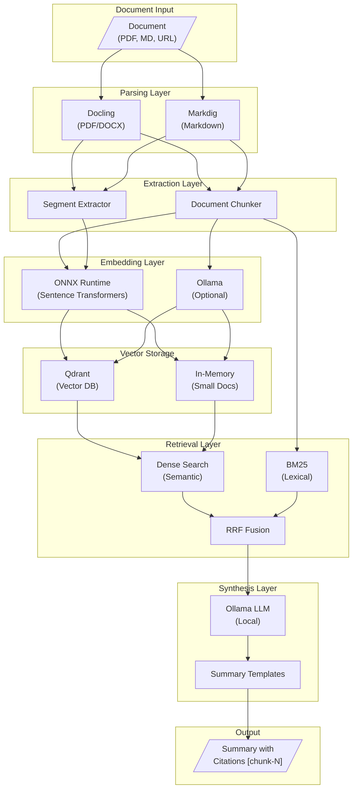
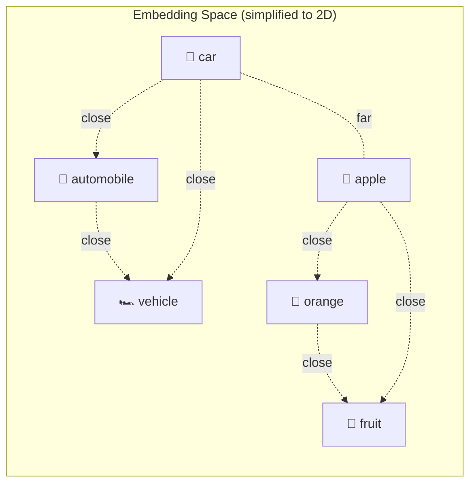
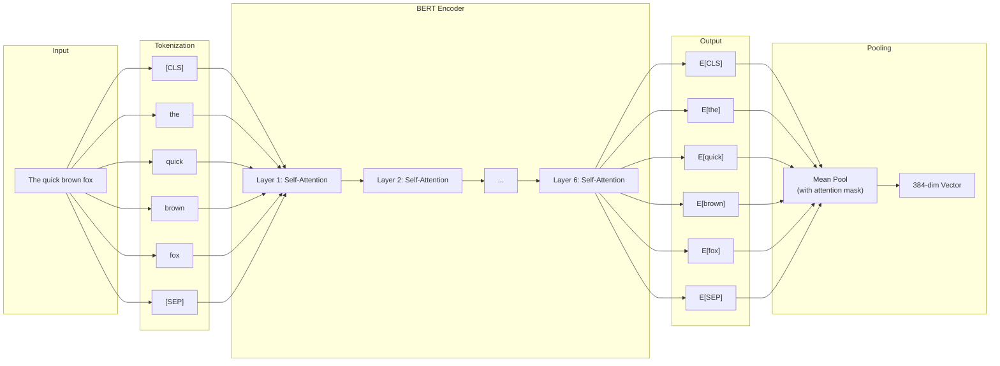
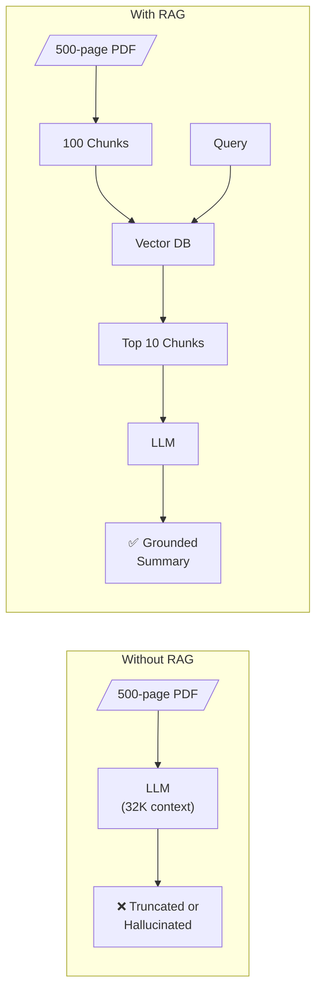
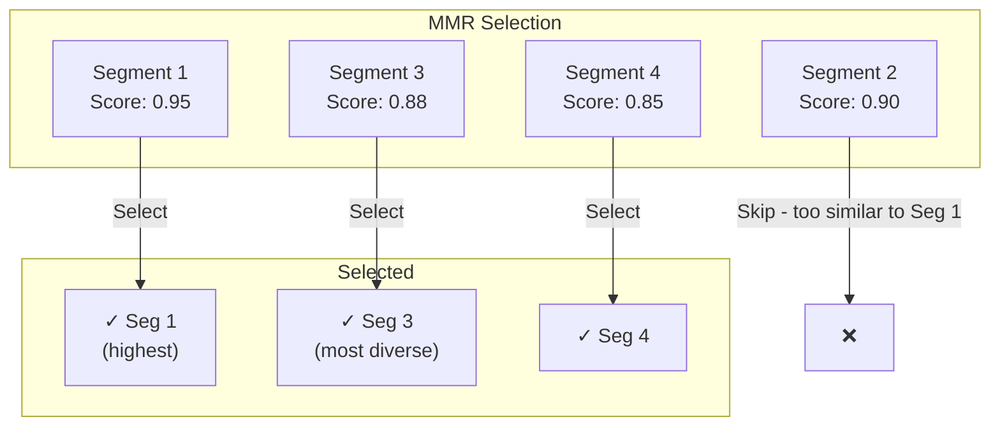
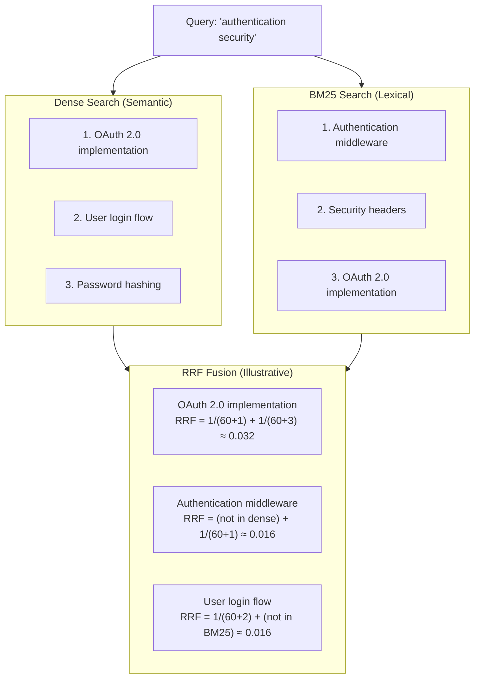
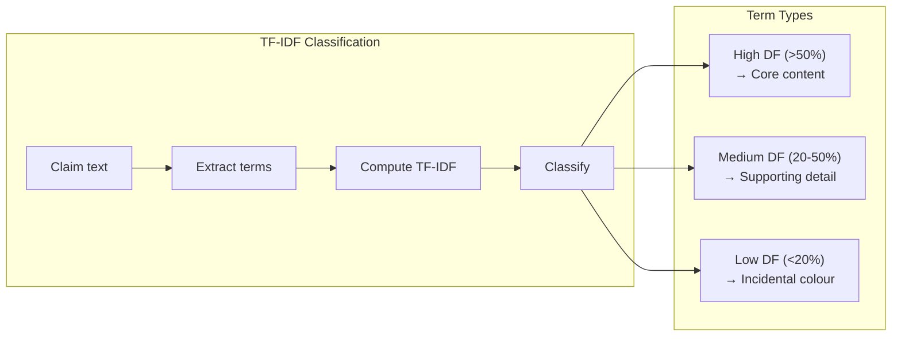

# DocSummarizer Part 3 - Advanced Concepts: The "I Went Too Far 🤦" Deep Dive

<!--category-- AI, LLM, RAG, BERT, ONNX, C#, .NET, Embeddings -->
<datetime class="hidden">2025-12-21T12:00</datetime>

## Introduction

This is **Part 3** of the DocSummarizer series:

1. **[Part 1: Building a Document Summarizer with RAG](/blog/building-a-document-summarizer-with-rag)** - The architecture and why the pipeline approach beats naive LLM calls
2. **[Part 2: Using the Tool](/blog/docsummarizer-tool)** - Quick-start guide for the CLI
3. **Part 3: Advanced Concepts** (this article) - The "I went too far" technical deep dive
4. **[Part 4: Building RAG Pipelines](/blog/docsummarizer-rag-pipeline)** - Use the NuGet library to build your own RAG apps

---

This is part of my "Time-Boxed Tools" approach: give myself a fixed window to build something functional. It forces decisions and produces working code rather than theoretical designs.

DocSummarizer started as a demonstration of how you *should* build document summarizers with LLMs - the pipeline approach I outlined in Part 1. Most tutorials show you how to shove text into an LLM and hope for the best. I wanted to show proper architecture: chunking, embeddings, retrieval, citation validation.

But as I always do, I got interested in the problem space. Four days later, I'd dug into the research. How do production-grade systems actually handle summarization? What makes retrieval work well? Why do some embeddings outperform others? 

I implemented versions of these approaches. What started as "here's the right pattern" became ONNX embeddings running locally, hybrid search combining BM25 with dense retrieval, Maximal Marginal Relevance for diversity, and Reciprocal Rank Fusion for combining signals.

**Fair warning**: This is the "I went too far" deep dive. If you just want to use the tool, read Part 2. If you want to understand *why* it works and *how* the pieces fit together, keep reading.

This article covers:

- **Sentence Embeddings**: How transformer models (MiniLM/BGE/GTE) turn text into vectors
- **ONNX Runtime**: Running ML models locally without Python or cloud APIs
- **RAG (Retrieval-Augmented Generation)**: Grounding LLM output in source material
- **Hybrid Search**: Combining semantic and lexical retrieval with RRF

[TOC]

## The Architecture at a Glance

Before diving into specifics, here's how the pieces fit together:



## Understanding Embeddings

### The Problem: How Do You Find Relevant Content Without Keywords?

When summarizing a 500-page manual, you need to find relevant sections. Traditional keyword search fails:
- User asks "How do I reset the device?"
- Manual says "To restore factory settings..." 
- Keyword search misses it (no shared words)

You need **semantic search** - matching by meaning, not just words.

### What Are Embeddings?

Embeddings solve this by turning text into dense vectors (arrays of numbers) that capture semantic meaning. Similar meanings = similar vectors, regardless of exact wording.

Here's the intuition: imagine a 384-dimensional space where every piece of text has a position. Texts with similar meanings cluster together.



### Why Sentence Transformers (Not Raw BERT)?

**Problem**: I needed embeddings that work for semantic similarity. Raw BERT was designed for classification tasks, not similarity search.

**Solution**: Use **sentence transformers** - models specifically trained on similarity tasks using contrastive learning. They're based on the [BERT architecture](https://arxiv.org/abs/1810.04805) but fine-tuned differently.

Models like `all-MiniLM-L6-v2` and `bge-small-en-v1.5` were trained on billions of text pairs like:
- "How to reset device" ↔ "Restore factory settings" (similar)
- "How to reset device" ↔ "Product specifications" (dissimilar)

The training teaches them: similar meanings = close vectors (high cosine similarity).

> **Related**: If you want to understand how transformer models work at a deeper level - including attention mechanisms, encoder-decoder architecture, and why embeddings work - see my article on [How Neural Machine Translation Works](/blog/how-neural-machine-translation-works). It covers the same transformer concepts from a translation perspective.

**Implementation**: We take the model's output layer and apply **mean pooling** - averaging the embeddings of all tokens to get a single vector for the entire text.



## ONNX: Running ML Models Locally

### The Problem: Python Dependency Hell

I wanted embeddings to "just work" when someone runs the tool. The standard approach:
1. Install Python + PyTorch + transformers
2. Download models manually
3. Hope version conflicts don't break everything

This sucks. Users want `docsummarizer -f doc.pdf`, not a 30-step setup guide.

### Why ONNX?

ONNX (Open Neural Network Exchange) is an open format for ML models. The killer feature: **runtime inference without Python**.

**What I get with ONNX Runtime:**
1. **Zero external dependencies** - No Python, PyTorch, CUDA drivers
2. **Auto-download models** - First run downloads from HuggingFace (~23-34MB), then cached
3. **Pure .NET** - Works anywhere .NET runs (Windows, Linux, macOS, ARM64)
4. **CPU inference** - No GPU required, runs on cheap hardware

Trade-off: Slightly slower than GPU PyTorch, but way faster than asking users to install Python.

### The Model Registry

DocSummarizer includes several embedding models, each with different trade-offs:

| Model | Dimensions | Max Tokens | Size (Quantized) | Use Case | Requires Instruction |
|-------|-----------|------------|------------------|----------|---------------------|
| `AllMiniLmL6V2` | 384 | 256 | ~23MB | Default - fast, good quality | No |
| `BgeSmallEnV15` | 384 | 512 | ~34MB | Better for technical docs | Yes |
| `GteSmall` | 384 | 512 | ~34MB | General purpose | No |
| `MultiQaMiniLm` | 384 | 512 | ~23MB | Optimized for Q&A | No |

**Note**: All registry entries point to WordPiece-compatible ONNX exports (using `vocab.txt`). BPE/Unigram models are not yet supported.

**BGE instruction format**: Some models (like BGE) require prefixes for optimal performance. The exact format depends on the model:

```csharp
// Query embedding (what the user asks)
var queryText = "Represent this sentence for searching relevant passages: " + userQuery;
var queryEmbedding = await EmbedAsync(queryText);

// Passage embedding (document chunks)
// Some BGE variants prefix passages, others don't - check model documentation
var passageEmbedding = await EmbedAsync(chunkText);
```

The registry tracks which models need instructions via `RequiresInstruction` and `QueryInstruction` fields. Always benchmark retrieval quality when working with instruction-based models.

Here's how the model registry works:

```csharp
public static class OnnxModelRegistry
{
    public static EmbeddingModelInfo GetEmbeddingModel(OnnxEmbeddingModel model, bool quantized = true)
    {
        return model switch
        {
            OnnxEmbeddingModel.AllMiniLmL6V2 => new EmbeddingModelInfo
            {
                Name = "all-MiniLM-L6-v2",
                HuggingFaceRepo = "Xenova/all-MiniLM-L6-v2",
                ModelFile = quantized ? "onnx/model_quantized.onnx" : "onnx/model.onnx",
                VocabFile = "vocab.txt",
                EmbeddingDimension = 384,
                MaxSequenceLength = 256,
                SizeBytes = quantized ? 23_000_000 : 90_000_000,
                RequiresInstruction = false
            },
            // ... other models
        };
    }
}
```

### Tokenization: WordPiece vs BPE

Different models use different tokenizers. The `all-MiniLM-L6-v2` model uses WordPiece tokenization (like BERT), which splits unknown words into subword tokens. Other models may use BPE (Byte-Pair Encoding) or Unigram tokenizers.

**Important**: Model tokenizers must match the training tokenizer. Our registry tracks which tokenizer each model requires. **Currently implemented: WordPiece** (via `vocab.txt`). BPE/Unigram support via `tokenizer.json` is planned but not yet implemented - stick to the WordPiece models in the registry for now.

```csharp
public class BertTokenizer
{
    private readonly Dictionary<string, int> _vocab;
    private const int ClsTokenId = 101;  // [CLS] - start of sequence
    private const int SepTokenId = 102;  // [SEP] - end of sequence
    private const int PadTokenId = 0;    // [PAD] - padding
    private const int UnkTokenId = 100;  // [UNK] - unknown token

    public BertTokenizer(string vocabPath)
    {
        // Load vocabulary: word -> token ID
        _vocab = File.ReadAllLines(vocabPath)
            .Select((word, index) => (word, index))
            .ToDictionary(x => x.word, x => x.index);
    }

    public (long[] InputIds, long[] AttentionMask, long[] TokenTypeIds) 
        Encode(string text, int maxLength)
    {
        // Split text into words, then apply WordPiece to each word
        var words = text.ToLowerInvariant()
            .Split(new[] { ' ', '\t', '\n', '\r' }, StringSplitOptions.RemoveEmptyEntries);
        var tokens = words.SelectMany(WordPieceTokenize).ToList();
        
        // Truncate to fit [CLS] and [SEP] tokens
        if (tokens.Count > maxLength - 2)
            tokens = tokens.Take(maxLength - 2).ToList();

        // Build input: [CLS] + tokens + [SEP] + [PAD]...
        var inputIds = new List<long> { ClsTokenId };
        inputIds.AddRange(tokens.Select(t => (long)GetTokenId(t)));
        inputIds.Add(SepTokenId);

        // Pad to maxLength
        var padCount = maxLength - inputIds.Count;
        inputIds.AddRange(Enumerable.Repeat((long)PadTokenId, padCount));

        // Attention mask: 1 for real tokens, 0 for padding
        var attentionMask = inputIds.Select(id => id != PadTokenId ? 1L : 0L).ToArray();
        
        // Token type IDs: all zeros for single sentence
        var tokenTypeIds = new long[maxLength];

        return (inputIds.ToArray(), attentionMask, tokenTypeIds);
    }

    private IEnumerable<string> WordPieceTokenize(string word)
    {
        // If the whole word is in vocabulary, return it
        if (_vocab.ContainsKey(word))
        {
            yield return word;
            yield break;
        }

        // Otherwise, split into subwords with "##" prefix
        int start = 0;
        while (start < word.Length)
        {
            int end = word.Length;
            string? curSubstr = null;

            while (start < end)
            {
                var substr = word[start..end];
                if (start > 0) substr = "##" + substr;  // Continuation marker

                if (_vocab.ContainsKey(substr))
                {
                    curSubstr = substr;
                    break;
                }
                end--;
            }

            if (curSubstr == null)
            {
                yield return "[UNK]";
                yield break;
            }

            yield return curSubstr;
            start = end;
        }
    }
}
```

Example tokenization:

| Input | Tokens |
|-------|--------|
| `"embedding"` | `["em", "##bed", "##ding"]` |
| `"DocSummarizer"` | `["doc", "##su", "##mm", "##ari", "##zer"]` |
| `"the quick brown"` | `["the", "quick", "brown"]` |

### Mean Pooling with Attention Mask

After BERT processes the tokens, we get a hidden state for each token. Mean pooling averages these, but only over real tokens (not padding):

```csharp
private static float[] MeanPool(Tensor<float> hiddenStates, long[] attentionMask, int hiddenSize)
{
    // Assumes last_hidden_state shape: [batch=1, seq_len, hidden_size]
    // Note: Many sentence-transformer models export a pooled output directly,
    // but we use mean pooling for consistency across all ONNX exports.
    var result = new float[hiddenSize];
    var dims = hiddenStates.Dimensions.ToArray();
    var seqLen = (int)dims[1];
    
    // Count real tokens (not padding)
    float maskSum = attentionMask.Count(x => x == 1);
    if (maskSum == 0) maskSum = 1; // Avoid division by zero

    // Average each dimension, weighted by attention mask
    for (int h = 0; h < hiddenSize; h++)
    {
        float sum = 0;
        for (int s = 0; s < seqLen; s++)
        {
            if (attentionMask[s] == 1)
                sum += hiddenStates[0, s, h];
        }
        result[h] = sum / maskSum;
    }

    // L2 normalize for cosine similarity
    float norm = MathF.Sqrt(result.Sum(x => x * x));
    if (norm > 0)
    {
        for (int i = 0; i < result.Length; i++)
            result[i] /= norm;
    }

    return result;
}
```

### The Complete Embedding Pipeline

Here's the full flow from text to embedding:

```csharp
public class OnnxEmbeddingService : IEmbeddingService, IDisposable
{
    private InferenceSession? _session;
    private BertTokenizer? _tokenizer;

    public async Task<float[]> EmbedAsync(string text, CancellationToken ct = default)
    {
        await InitializeAsync(ct);  // Downloads model if needed
        
        // Prepend instruction for models that need it (like BGE)
        if (_modelInfo.RequiresInstruction)
            text = _modelInfo.QueryInstruction + text;

        // Tokenize
        var (inputIds, attentionMask, tokenTypeIds) = 
            _tokenizer.Encode(text, _maxSequenceLength);

        // Create ONNX tensors
        var inputIdsTensor = new DenseTensor<long>(inputIds, new[] { 1, inputIds.Length });
        var attentionMaskTensor = new DenseTensor<long>(attentionMask, new[] { 1, attentionMask.Length });
        var tokenTypeIdsTensor = new DenseTensor<long>(tokenTypeIds, new[] { 1, tokenTypeIds.Length });

        var inputs = new List<NamedOnnxValue>
        {
            NamedOnnxValue.CreateFromTensor("input_ids", inputIdsTensor),
            NamedOnnxValue.CreateFromTensor("attention_mask", attentionMaskTensor),
            NamedOnnxValue.CreateFromTensor("token_type_ids", tokenTypeIdsTensor)
        };

        // Run inference
        using var results = _session.Run(inputs);
        
        // Get hidden states output
        var output = results.First(r => r.Name == "last_hidden_state");
        var outputTensor = output.AsTensor<float>();

        // Mean pooling with attention mask
        return MeanPool(outputTensor, attentionMask, _modelInfo.EmbeddingDimension);
    }
}
```

## RAG: Retrieval-Augmented Generation

### The Problem: LLMs Can't Read 500-Page Documents

**The naive approach fails:**
```csharp
var text = File.ReadAllText("500-page-manual.txt"); // 2MB of text
var summary = await llm.GenerateAsync($"Summarize: {text}"); // ❌ Doesn't fit in context
```

Even with 128K context windows, you can't just dump huge documents in:
- **Truncation**: Only the first 100 pages fit, rest ignored
- **Hallucination**: LLM invents "facts" to fill gaps
- **Cost**: Processing 2MB of text costs $$$ per query
- **Quality**: LLMs get confused with massive context ("lost in the middle" problem)

### The Solution: RAG (Retrieval-Augmented Generation)

Instead of sending everything, send only what's relevant:

1. **Chunking**: Split the document into segments
2. **Embedding**: Convert segments to vectors (semantic representation)
3. **Retrieval**: Find the 10-20 most relevant segments for the query
4. **Synthesis**: LLM summarizes only those segments

**Why this works:** The LLM sees 10KB of highly relevant content instead of 2MB of mostly irrelevant text.



### Document Chunking Strategies

DocSummarizer supports multiple chunking strategies based on document structure:

```csharp
public class DocumentChunker
{
    public List<DocumentChunk> ChunkByHeadings(string markdown, int maxHeadingLevel = 2)
    {
        var chunks = new List<DocumentChunk>();
        var lines = markdown.Split('\n');
        var currentChunk = new StringBuilder();
        var currentHeading = "";
        var headingLevel = 0;
        var order = 0;

        foreach (var line in lines)
        {
            // Detect heading (# to ######)
            var headingMatch = Regex.Match(line, @"^(#{1,6})\s+(.+)$");
            
            if (headingMatch.Success && 
                headingMatch.Groups[1].Length <= maxHeadingLevel)
            {
                // Flush current chunk
                if (currentChunk.Length > 0)
                {
                    chunks.Add(new DocumentChunk(
                        Order: order++,
                        Heading: currentHeading,
                        HeadingLevel: headingLevel,
                        Content: currentChunk.ToString().Trim(),
                        Hash: ComputeHash(currentChunk.ToString())
                    ));
                }
                
                // Start new chunk
                currentHeading = headingMatch.Groups[2].Value;
                headingLevel = headingMatch.Groups[1].Length;
                currentChunk.Clear();
            }
            else
            {
                currentChunk.AppendLine(line);
            }
        }
        
        // Don't forget the last chunk
        if (currentChunk.Length > 0)
        {
            chunks.Add(new DocumentChunk(
                Order: order,
                Heading: currentHeading,
                HeadingLevel: headingLevel,
                Content: currentChunk.ToString().Trim(),
                Hash: ComputeHash(currentChunk.ToString())
            ));
        }
        
        return chunks;
    }
}
```

### Segment Extraction for Fine-Grained Retrieval

For longer documents, DocSummarizer extracts individual segments (sentences, list items, code blocks) with salience scoring:

```csharp
public class SegmentExtractor
{
    public async Task<ExtractionResult> ExtractAsync(string docId, string markdown)
    {
        // 1. Parse into typed segments
        var segments = ParseToSegments(docId, markdown);
        
        // 2. Generate embeddings
        await GenerateEmbeddingsAsync(segments);
        
        // 3. Calculate document centroid (average embedding)
        var centroid = CalculateCentroid(segments);
        
        // 4. Score by salience using MMR (Maximal Marginal Relevance)
        ComputeSalienceScores(segments, centroid);
        
        return new ExtractionResult
        {
            AllSegments = segments,
            TopBySalience = segments.OrderByDescending(s => s.SalienceScore).Take(50).ToList(),
            Centroid = centroid
        };
    }
}
```

### The Problem: Semantic Search Returns Duplicates

**Without MMR**, retrieval for "How does caching work?" returned:
1. "Caching overview" (0.95 similarity)
2. "Introduction to caching" (0.94 similarity)  
3. "What is caching?" (0.93 similarity)
4. "Cache implementation details" (0.85 similarity)

The top 3 results all say the same thing. I'm wasting context window on repetition.

### The Solution: Maximal Marginal Relevance (MMR)

MMR balances **relevance** (similarity to query) with **diversity** (dissimilarity to already-selected items).

**Formula:**
$$MMR = \lambda \cdot \text{sim}(s, query) - (1 - \lambda) \cdot \max_{s' \in Selected} \text{sim}(s, s')$$

**What it does:** Penalizes candidates similar to already-selected segments. This prevents the summary from being 5 versions of the same paragraph.



The formula:

$$MMR = \lambda \cdot sim(s, centroid) - (1 - \lambda) \cdot \max_{s' \in Selected} sim(s, s')$$

```csharp
private List<Segment> SelectSentencesMMR(
    List<Segment> segments,
    float[] centroid,
    int targetCount)
{
    var selected = new List<Segment>();
    var candidates = new HashSet<Segment>(segments.Where(s => s.Embedding != null));
    
    // Pre-calculate centroid similarities
    foreach (var segment in candidates)
    {
        segment.Score = CosineSimilarity(segment.Embedding!, centroid) 
                      * segment.PositionWeight;
    }
    
    while (selected.Count < targetCount && candidates.Count > 0)
    {
        Segment? best = null;
        double bestScore = double.MinValue;
        
        foreach (var candidate in candidates)
        {
            // Relevance: similarity to centroid
            var relevance = candidate.Score;
            
            // Diversity: max similarity to already selected
            double maxSimToSelected = 0;
            foreach (var sel in selected)
            {
                var sim = CosineSimilarity(candidate.Embedding!, sel.Embedding!);
                maxSimToSelected = Math.Max(maxSimToSelected, sim);
            }
            
            // MMR score: balance relevance and diversity
            var mmrScore = _config.Lambda * relevance 
                         - (1 - _config.Lambda) * maxSimToSelected;
            
            if (mmrScore > bestScore)
            {
                bestScore = mmrScore;
                best = candidate;
            }
        }
        
        if (best != null)
        {
            selected.Add(best);
            candidates.Remove(best);
        }
    }
    
    return selected;
}
```

## Hybrid Search with RRF

### The Problem: Semantic Search Misses Exact Matches

I ran into this when testing:

**Query**: "What's the API endpoint for authentication?"

**Semantic search returned:**
1. "User login flow overview" (high similarity)
2. "Security best practices" (high similarity)
3. "Session management" (high similarity)

**What it missed**: The actual API endpoint buried in code examples: `POST /api/v1/auth/login`

**Why**: Embedding models are trained on natural language, not code/URLs/exact terms. The endpoint `POST /api/v1/auth/login` doesn't semantically match "authentication endpoint" - it's a literal technical reference.

### The Solution: Hybrid Search (Semantic + Lexical)

Combine two retrieval methods with complementary strengths:

| Search Type | Strengths | Weaknesses |
|-------------|-----------|------------|
| **Dense (Embedding)** | Semantic understanding, synonyms | Can miss exact matches, rare terms |
| **Sparse (BM25)** | Exact keyword matching, rare terms | No semantic understanding |

Hybrid search combines both using Reciprocal Rank Fusion (RRF):



**Note**: RRF scores shown are illustrative. The constant k=60 is standard; actual ranking depends on the full candidate set.

### RRF Implementation

```csharp
public static class HybridRRF
{
    /// <summary>
    /// Reciprocal Rank Fusion: combine multiple rankings into one.
    /// 
    /// Formula: RRF(d) = Σ 1/(k + rank_i(d))
    /// 
    /// Where k = 60 (standard constant to prevent division by small numbers)
    /// </summary>
    public static List<Segment> Fuse(
        List<Segment> segments,
        string query,
        BM25Scorer bm25,
        int k = 60,
        int topK = 20)
    {
        // Rank by dense similarity
        var byDense = segments
            .Where(s => s.Embedding != null)
            .OrderByDescending(s => s.QuerySimilarity)
            .ToList();
        
        // Rank by BM25 (scorer is built over the same ordered segment list)
        var bm25Scores = segments
            .Select((s, i) => (segment: s, score: bm25.Score(i, query)))
            .OrderByDescending(x => x.score)
            .Select(x => x.segment)
            .ToList();
        
        // Rank by salience (pre-computed importance)
        var bySalience = segments
            .OrderByDescending(s => s.SalienceScore)
            .ToList();
        
        // Compute RRF scores
        var rrfScores = new Dictionary<Segment, double>();
        
        void AddRRFScore(List<Segment> ranking)
        {
            for (int i = 0; i < ranking.Count; i++)
            {
                var segment = ranking[i];
                var rrfContribution = 1.0 / (k + i + 1);  // 1-based rank
                
                if (!rrfScores.TryAdd(segment, rrfContribution))
                    rrfScores[segment] += rrfContribution;
            }
        }
        
        AddRRFScore(byDense);
        AddRRFScore(bm25Scores);
        AddRRFScore(bySalience);
        
        // Return top-K by fused score
        return rrfScores
            .OrderByDescending(kv => kv.Value)
            .Take(topK)
            .Select(kv => kv.Key)
            .ToList();
    }
}
```

### BM25: The Sparse Retrieval Workhorse

BM25 (Best Matching 25) is the classic information retrieval algorithm. It combines term frequency, inverse document frequency, and document length normalization:

```csharp
public class BM25Scorer
{
    private const double K1 = 1.5;  // Term frequency saturation
    private const double B = 0.75;  // Length normalization factor
    
    public double Score(int docIndex, string query)
    {
        var queryTerms = Tokenize(query);
        var docTermFreq = _docTermFreqs[docIndex];
        var docLength = _docLengths[docIndex];
        
        double score = 0;
        
        foreach (var term in queryTerms.Distinct())
        {
            if (!docTermFreq.TryGetValue(term, out var tf)) continue;
            if (!_docFreqs.TryGetValue(term, out var df)) continue;
            
            // IDF with smoothing
            var idf = Math.Log((_corpusSize - df + 0.5) / (df + 0.5) + 1);
            
            // BM25 TF component with length normalization
            var tfNorm = (tf * (K1 + 1)) / 
                (tf + K1 * (1 - B + B * docLength / _avgDocLength));
            
            score += idf * tfNorm;
        }
        
        return score;
    }
}
```

## TF-IDF for Content Centrality

### The Problem: How Do You Distinguish Core Content from Trivia?

When summarizing a novel, I got results like:

> "The protagonist wore a blue coat. Watson noted the weather was mild. The study had oak furniture..."

These are accurate extractions, but they're **colour** (scene-setting details), not **core plot points**.

**Challenge**: How do you tell the difference between:
- **Core content**: Appears throughout the document (character names, main themes, key events)
- **Supporting detail**: Appears in some sections (subplots, explanations)
- **Colour**: Rare, specific details (what someone was wearing, furniture descriptions)

### The Solution: TF-IDF for Centrality Classification

TF-IDF (Term Frequency - Inverse Document Frequency) estimates **how central a term is to the document**, not its truth value.

**Logic:**
- **High DF (>50% of chunks)**: "Sherlock", "Watson", "murder" → Core content
- **Medium DF (20-50%)**: "Baker Street", "investigation" → Supporting detail  
- **Low DF (<20%)**: "blue coat", "oak furniture" → Incidental colour

This is not about truth (a repeated claim can be false, a rare fact can be true). It's about *centrality to the document*.



```csharp
public class TextAnalysisService
{
    private readonly Dictionary<string, int> _documentFrequency = new();
    private int _totalDocuments;

    public void BuildTfIdfIndex(IEnumerable<string> documents)
    {
        _documentFrequency.Clear();
        _totalDocuments = 0;
        
        foreach (var doc in documents)
        {
            _totalDocuments++;
            var terms = Tokenize(doc).Distinct();
            
            foreach (var term in terms)
            {
                _documentFrequency.TryGetValue(term, out var count);
                _documentFrequency[term] = count + 1;
            }
        }
    }

    /// <summary>
    /// Classify term centrality (not epistemic truth):
    /// - High DF (>50%): appears across most chunks = core content
    /// - Medium DF (20-50%): supporting detail
    /// - Low DF (<20%): rare = likely incidental ("colour")
    /// 
    /// Note: This estimates centrality, not factuality. A repeated 
    /// claim can be false; a rare fact can be true.
    /// </summary>
    public ClaimType ClassifyTermImportance(string term)
    {
        var df = _documentFrequency.GetValueOrDefault(term.ToLowerInvariant(), 0);
        
        if (_totalDocuments == 0 || df == 0)
            return ClaimType.Colour;
        
        var documentRatio = (double)df / _totalDocuments;
        
        // High centrality = appears widely
        if (documentRatio > 0.5)
            return ClaimType.Core;
        
        // Medium centrality = supporting themes
        if (documentRatio > 0.2)
            return ClaimType.Supporting;
        
        // Low centrality = incidental detail
        return ClaimType.Colour;
    }
}
```

## The Complete BertRag Pipeline

DocSummarizer's production pipeline (`BertRagSummarizer`) combines all these concepts:

```csharp
public class BertRagSummarizer
{
    /// <summary>
    /// Full pipeline: Extract → Retrieve → Synthesize
    /// 
    /// Key properties:
    /// - LLM only at synthesis (no LLM-in-the-loop evaluation)
    /// - Deterministic extraction (reproducible, debuggable)
    /// - Validated citations (every claim traceable to source segment)
    /// - Scales to any document size
    /// - Cost-optimal (cheap CPU work first, expensive LLM last)
    /// </summary>
    public async Task<DocumentSummary> SummarizeAsync(
        string docId,
        string markdown,
        string? focusQuery = null)
    {
        // === Phase 1: Extract ===
        // Parse document → segments with embeddings + salience scores
        var extraction = await _extractor.ExtractAsync(docId, markdown);
        
        // === Phase 2: Retrieve ===
        // Hybrid search: Dense + BM25 + Salience via RRF
        var retrieved = await RetrieveAsync(extraction, focusQuery);
        
        // === Phase 3: Synthesize ===
        // LLM generates fluent summary from retrieved segments
        var summary = await SynthesizeAsync(docId, retrieved, extraction, focusQuery);
        
        return summary;
    }
}
```

## Common Failure Modes

When building and using DocSummarizer, I've hit these issues (and you will too):

1. **Tokenizer mismatch → nonsense embeddings**: Loading a WordPiece vocab for a BPE-trained model produces valid-looking but semantically meaningless vectors. Always verify the tokenizer matches the model's training regime.

2. **Dominant-topic bias in single-centroid scoring**: Using one document centroid systematically down-ranks minority topics (constraints, exceptions, edge cases). Multi-anchor retrieval fixes this but adds complexity.

3. **BM25 beats dense search on rare terms**: If your query contains technical jargon or proper nouns not well-represented in the embedding model's training data, lexical matching (BM25) will outperform semantic search. This is why hybrid search matters.

4. **OCR garbage in scanned PDFs**: Docling is good, but OCR errors compound. If you see nonsense in summaries, check the markdown output from Docling first - the summarizer can't fix garbage input.

5. **Low-coverage summaries must hedge language**: If you're only seeing 3% of a document, phrases like "ultimately" or "in conclusion" are dishonest. The system must say "in sampled sections" and avoid definitive endings.

6. **Citation hallucination**: Small LLMs (1.5B-3B params) sometimes invent plausible-sounding citations. We validate by parsing the output for `[chunk-N]`, verifying N exists in the source chunks, and flagging or repairing claims that cite missing chunks. If you see `[chunk-999]` for a 10-chunk document, your LLM is struggling with the task.

These aren't bugs - they're inherent tensions in the design space. Good production systems acknowledge and mitigate them.

## Practical Considerations

### Coverage and Sampling Honesty

When processing very large documents, DocSummarizer doesn't try to embed everything - it uses semantic pre-filtering to select representative segments. **This means the summary is based on a sample, not the full document.**

The system handles this transparently:

```csharp
// If coverage is low (<5%), prepend disclaimer and use cautious language
if (coverage < 0.05)
{
    var disclaimer = $"WARNING: Summary (sampled ~{coverage:P1} of document)";
    summary = $"{disclaimer}\n\n{CleanAndHedge(summary)}";
}

// Append coverage footer to every summary
var footer = $"\n\n---\nCoverage: {coverage:P1} ({scope})\nConfidence: {confidence}";
```

**Important**: This is a *summary of retrieved evidence*, not a guarantee of full-document coverage. When we say "sampled 3%", that's exactly what happened - the system saw 3% of the document and summarized that.

**The sampling isn't random** - it's *semantic*. We use multi-anchor clustering to ensure minority topics aren't excluded. A random 3% might miss all the constraints and edge cases. A semantic 3% tries to capture one representative segment from each major theme. It's still partial coverage, but it's intentionally diverse partial coverage.

**Adaptive sampling with multiple topic anchors**: The pre-filter uses multiple anchors (k-means-style clustering of a stratified sample) to ensure minority topics aren't systematically excluded. This prevents the "dominant theme bias" where a single centroid down-ranks important-but-rare content like constraints, exceptions, or conclusions.

From `SegmentExtractor.cs`:

```csharp
// Multi-anchor approach prevents single-centroid bias
var topicAnchors = ComputeTopicAnchors(embeddedSample, k: 5);

// Score by max similarity to ANY anchor (catches minority topics)
var score = topicAnchors.Max(anchor => CosineSimilarity(segment.Embedding, anchor));
```

This is research-informed (avoiding single-query recall collapse) but practical - it runs in seconds on CPU.

**Why not just embed everything?**

For a 500-page document (2,000+ segments), embedding everything would work but isn't optimal:

- **Cost**: O(N) embeddings dominates runtime. At ~150 segments/sec, that's 13+ seconds just for embedding before you even start retrieval.
- **Quality**: Embedding everything increases noise in the retrieval pool. You still need ranking, so why embed segments that will never rank high?
- **Practicality**: Memory and latency constraints matter. Keeping 2,000 384-dim vectors in memory and computing 2,000 cosine similarities per query is wasteful when you only need the top 20.

The multi-anchor sampling gives you the best of both: broad topic coverage with tractable compute.

### Quantization

ONNX models can be quantized (reduced precision) for smaller size and faster inference. The trade-off is minimal quality loss:

| Model | Full Precision | Quantized | Quality Difference |
|-------|---------------|-----------|-------------------|
| all-MiniLM-L6-v2 | 90MB | 23MB | ~0.5% |
| bge-small-en-v1.5 | 133MB | 34MB | ~0.3% |

### Batch Processing and Concurrency

For large documents, batch embedding is critical for performance. ONNX Runtime's `InferenceSession` can generally be shared across threads safely, but performance depends on session configuration:

```csharp
public async Task<float[][]> EmbedBatchAsync(IEnumerable<string> texts, CancellationToken ct)
{
    var textList = texts.ToList();
    var results = new float[textList.Count][];
    
    // InferenceSession is safe to share for inference in most cases
    // Tune SessionOptions.IntraOpNumThreads and InterOpNumThreads for your workload
    var maxParallel = Math.Min(Environment.ProcessorCount, 8);
    
    await Parallel.ForEachAsync(
        textList.Select((text, index) => (text, index)),
        new ParallelOptions { MaxDegreeOfParallelism = maxParallel },
        async (item, token) =>
        {
            results[item.index] = await EmbedSingleAsync(item.text, token);
        });
    
    return results;
}
```

**Performance tip**: Configure `SessionOptions` when creating the session:

```csharp
var sessionOptions = new SessionOptions
{
    IntraOpNumThreads = 4,  // Threads within a single operation
    InterOpNumThreads = 2   // Threads across operations
};
var session = new InferenceSession(modelPath, sessionOptions);
```

### Memory Management for Large Documents

Very large documents (novels, legal documents) require special handling to avoid OOM:

```csharp
// For documents > MaxSegmentsToEmbed, use hierarchical extraction
if (segments.Count > _config.MaxSegmentsToEmbed)
{
    // Process in batches, keeping only top-K per batch
    // Then re-rank globally
    return await ExtractHierarchicalAsync(segments);
}
```

## Performance Characteristics

Real-world performance on a typical developer machine (Ryzen 5600X, 32GB RAM, no GPU):

| Operation | Throughput | Notes |
|-----------|-----------|-------|
| **Embedding** | ~150 segments/sec | Batch size 64, all-MiniLM-L6-v2 quantized |
| **Dense retrieval** | <10ms | Cosine similarity over 500 segments |
| **BM25 scoring** | <5ms | In-memory inverted index |
| **RRF fusion** | <2ms | Combine 3 rankings |
| **End-to-end (25-page PDF)** | ~15-20s | Includes chunking, embedding, retrieval, LLM synthesis |

**Test environment**: Ryzen 5600X (6-core), 32GB RAM, no GPU. Embedding uses all-MiniLM-L6-v2 (quantized, 256 token max), 8-thread parallel batching. Retrieval corpus: 500 segments. Your mileage will vary with different models, hardware, and document complexity.

**Main driver is embedding throughput** (model choice + token length + batch size). Retrieval and fusion are basically free - they take milliseconds. This reinforces the "LLM last" principle: do cheap CPU work (embedding, retrieval) first, expensive LLM work only on filtered content.

**Scaling**: The hierarchical extraction handles 500+ page documents (novels, manuals) by processing in batches and keeping only top-K per batch in memory.

## Summary

DocSummarizer demonstrates that sophisticated NLP capabilities don't require cloud APIs or Python dependencies. With ONNX Runtime for embeddings and Ollama for generation, you can build a complete RAG pipeline that:

- Runs entirely locally
- Produces traceable, cited summaries
- Handles documents of any size
- Works offline

The key insights from building this tool:

1. **Embeddings are the foundation** - Good retrieval depends on good embeddings
2. **Hybrid search beats either alone** - Combine semantic and lexical for robustness
3. **MMR prevents repetition** - Diversity is as important as relevance
4. **Structure matters** - Respecting document structure (headings, sections) improves results
5. **LLMs should come last** - Do cheap CPU work first, expensive LLM work only on filtered content

## Further Reading

### Papers and Technical References
- [BERT Paper](https://arxiv.org/abs/1810.04805) - The original transformer encoder
- [Sentence-BERT](https://arxiv.org/abs/1908.10084) - BERT for sentence embeddings
- [BM25 Explained](https://www.elastic.co/blog/practical-bm25-part-2-the-bm25-algorithm-and-its-variables) - The classic retrieval algorithm
- [RRF Paper](https://plg.uwaterloo.ca/~gvcormac/cormacksigir09-rrf.pdf) - Reciprocal Rank Fusion
- [ONNX Runtime](https://onnxruntime.ai/) - Cross-platform ML inference

### Related Deep Dives
- [How Neural Machine Translation Works](/blog/how-neural-machine-translation-works) - Covers transformer architecture, attention mechanisms, and embeddings from a translation perspective (many of the same concepts apply to document understanding)

## Wrapping Up the Series

This concludes the DocSummarizer series. Here's how the three parts fit together:

**[Part 1](/blog/building-a-document-summarizer-with-rag)** explains *why* the pipeline approach beats naive LLM calls. It covers the architecture patterns (chunking, hierarchical reduction, citation validation) that make any document summarizer work well. The tool evolved since Part 1 was written, but the principles remain valid.

**[Part 2](/blog/docsummarizer-tool)** is your quick-start guide. Installation, modes, templates, common use cases. If you just want to use the tool, that's all you need.

**Part 3** (this article) is the deep dive for people who want to understand *how* it actually works: BERT vs sentence transformers, why ONNX matters, tokenization gotchas, hybrid search trade-offs, and what breaks in production.

If you're building your own pipeline, read all three. If you're just using the tool, read Part 2 and maybe skim Part 3's failure modes section.

## Related

- [CSV Analysis with Local LLMs](/blog/analysing-large-csv-files-with-local-llms)
- [Fetching and Analysing Web Content with LLMs](/blog/fetching-and-analysing-web-content-with-llms)
