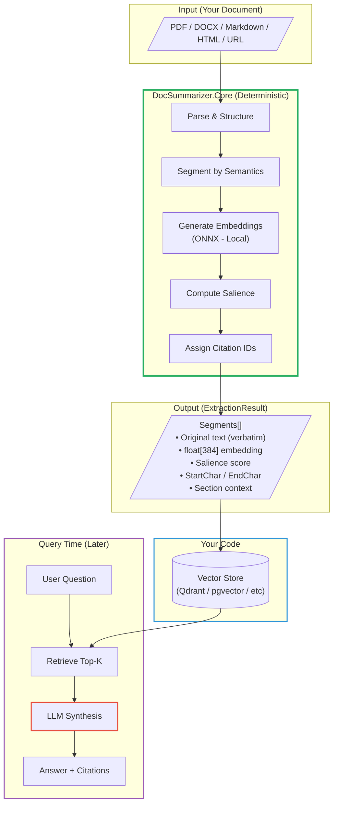
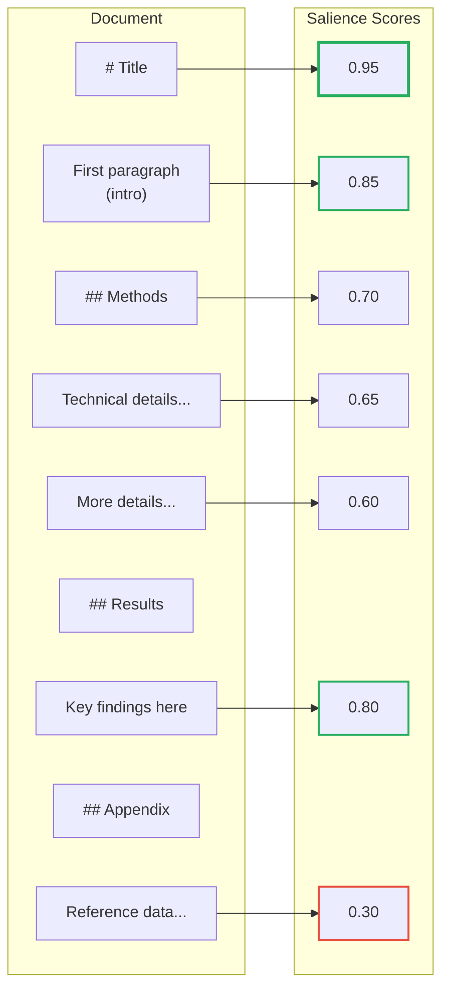
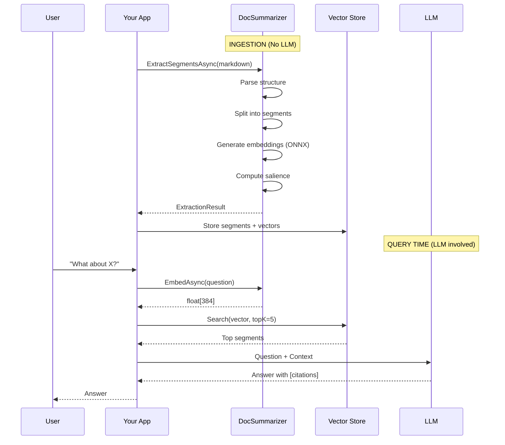

# DocSummarizer Part 4 - Building RAG Pipelines

<!--category-- AI, LLM, RAG, C#, Embeddings, ONNX, Semantic Search -->
<datetime class="hidden">2025-12-30T17:00</datetime>

[](https://www.nuget.org/packages/Mostlylucid.DocSummarizer)
[](https://www.npmjs.com/package/@mostlylucid/docsummarizer)
[](https://dotnet.microsoft.com/)
[](https://nodejs.org/)

This is **Part 4** of the DocSummarizer series. See [Part 1](/blog/building-a-document-summarizer-with-rag) for the architecture, [Part 2](/blog/docsummarizer-tool) for the CLI tool, or [Part 3](/blog/docsummarizer-advanced-concepts) for the deep dive on embeddings.

> **The hard part of RAG isn't the LLM. It's everything before the LLM.**

You've probably seen the pattern: split documents into chunks, generate embeddings, store in a vector database, retrieve relevant chunks, send to LLM. Simple in theory. In practice, you're writing:

- Document parsers for every format
- Chunking logic that respects semantic boundaries  
- Tokenization that matches your embedding model
- Batching for efficient embedding generation
- Salience scoring so not all chunks are treated equal
- Citation tracking so you know where answers came from

That's a lot of infrastructure before you write a single line of application code.

**DocSummarizer.Core handles all of it in a single package** - available for both .NET and Node.js.

DocSummarizer.Core is essentially a **document intelligence layer**: deterministic structure first, probabilistic retrieval second. It solves the information-engineering problem so you can focus on the reasoning problem.

### The Ingestion Pipeline

Here's what DocSummarizer does - and critically, what it *doesn't* do:



**What DocSummarizer does (green box):**
- Parses documents preserving structure
- Splits into semantic segments (not arbitrary chunks)
- Generates embeddings locally with ONNX
- Computes salience scores
- Assigns citation IDs with character positions

**What you do (blue box):**
- Store segments in your vector database
- Build your retrieval logic

**What happens at query time (purple box):**
- Embed the question (same model)
- Retrieve similar segments
- Send to LLM for synthesis

**Key insight:** The LLM (red border) is only involved at query time. Ingestion is entirely deterministic - the same document always produces the same segments. This is what makes RAG reproducible and debuggable.

**Reproducibility bonus:** Deterministic ingestion means you can re-index, diff, and debug your RAG pipeline like any other build artifact. No prompt variance, no model temperature - just pure, testable data engineering.

### Why No LLM for Ingestion?

For RAG, you want the *actual sentences* from your documents - not LLM-generated paraphrases. When a user asks "what does the contract say about termination?", you need to retrieve the real contract text, not a summary of it.

The LLM comes later, at query time, to synthesize an answer from retrieved chunks. But the chunks themselves should be verbatim source material. That's what makes citations meaningful.

DocSummarizer's `ExtractSegmentsAsync` gives you exactly this: the original text segments with embeddings, ready for retrieval. No LLM involved in ingestion.

[TOC]

## The Value Proposition

Here's what you get with one `dotnet add package`:

```bash
dotnet add package Mostlylucid.DocSummarizer
```

- **Smart segmentation** - Splits on headings, respects semantic boundaries
- **ONNX embeddings** - Local, no API keys, models auto-download (~23MB)
- **Salience scoring** - Pre-computed importance for each segment
- **Citation tracking** - Every segment has a unique ID
- **Multiple formats** - Markdown, HTML, PDF, DOCX (with Docling)
- **Vector store options** - InMemory, DuckDB, Qdrant built-in

No Python. No external APIs. No complex setup. Works offline after first model download.

## Extract Segments: The Core API

The simplest use case - extract segments with embeddings ready for your vector store:

```csharp
using Microsoft.Extensions.DependencyInjection;
using Mostlylucid.DocSummarizer;

// Setup DI
var services = new ServiceCollection();
services.AddDocSummarizer();
var provider = services.BuildServiceProvider();

var summarizer = provider.GetRequiredService<IDocumentSummarizer>();

// Extract segments with embeddings
string markdown = File.ReadAllText("document.md");
var extraction = await summarizer.ExtractSegmentsAsync(markdown);

foreach (var segment in extraction.AllSegments)
{
    Console.WriteLine($"[{segment.Type}] {segment.SectionTitle}");
    Console.WriteLine($"  ID: {segment.Id}");
    Console.WriteLine($"  Salience: {segment.SalienceScore:F2}");
    Console.WriteLine($"  Embedding: float[{segment.Embedding?.Length}]");
    Console.WriteLine($"  Text: {segment.Text[..Math.Min(80, segment.Text.Length)]}...");
}
```

**Output:**

```
[Heading] Introduction
  ID: a1b2c3d4e5f6g7h8_h_0
  Salience: 0.85
  Embedding: float[384]
  Text: This document describes the architecture of our new microservices platform...

[Sentence] Introduction  
  ID: a1b2c3d4e5f6g7h8_s_1
  Salience: 0.72
  Embedding: float[384]
  Text: The system is designed to handle 10,000 requests per second with sub-100ms...
```

That's it. No orchestration, no prompts, no opinions - just segments with embeddings and provenance. Ready for your vector database.

### Document IDs

Each segment's `Id` is constructed from a document ID plus type and index: `{docId}_{type}_{index}`.

You can provide your own document ID, or let DocSummarizer compute one from the content hash:

```csharp
// Option 1: Provide your own ID (useful for tracking documents in your system)
var extraction = await summarizer.ExtractSegmentsAsync(markdown, documentId: "contract-2024-001");
// Segments get IDs like: contract_2024_001_s_0, contract_2024_001_h_1, ...

// Option 2: Auto-generated from content hash (default)
var extraction = await summarizer.ExtractSegmentsAsync(markdown);
// Segments get IDs like: a1b2c3d4e5f6g7h8_s_0, a1b2c3d4e5f6g7h8_h_1, ...
// Same document = same hash = same IDs (deterministic)
```

**Why this matters for RAG:**
- Custom IDs let you correlate segments with your document management system
- Content-hash IDs ensure re-indexing the same document produces identical segment IDs
- Both approaches support stable citations - `[s42]` always resolves to the same source text

## What's in a Segment

Each extracted segment contains everything you need for RAG:

```csharp
public class Segment
{
    string Id;              // Unique ID: "mydoc_s_42" (for citations)
    string Text;            // The actual content
    SegmentType Type;       // Sentence, Heading, ListItem, CodeBlock, Quote, TableRow
    int Index;              // 0-based order in document
    
    // Source location tracking
    int StartChar;          // Character offset where segment starts
    int EndChar;            // Character offset where segment ends
    int? PageNumber;        // Page number (for PDFs)
    int? LineNumber;        // Line number (for text/markdown)
    
    // Section context
    string SectionTitle;    // "Introduction" - immediate heading
    string HeadingPath;     // "Chapter 1 > Introduction > Overview"
    int HeadingLevel;       // 1-6 (heading depth)
    
    // Computed during extraction
    float[] Embedding;      // 384-dim vector (default model)
    double SalienceScore;   // 0-1 importance score
    string ContentHash;     // Stable hash for citation tracking across re-indexing
    
    // For retrieval (set during query)
    double QuerySimilarity; // Similarity to the query
    double RetrievalScore;  // Combined score: similarity + salience
    
    string Citation { get; } // Auto-generated: "[s42]", "[h3]", etc.
}
```

The `Id` is the key for citation tracking. When your LLM outputs `[s42]`, you can resolve it back to the exact source location using `StartChar`/`EndChar`.

**Bonus:** The `ExtractionResult` includes helper methods for citation resolution:

```csharp
var extraction = await summarizer.ExtractSegmentsAsync(markdown);

// Fast O(1) lookups
var segment = extraction.GetSegment("mydoc_s_42");
var segmentByIdx = extraction.GetSegmentByIndex(42);

// Find segment at a character position
var segmentAtPos = extraction.GetSegmentAtPosition(5432);

// Get all segments on page 5 (for PDFs)
var pageSegments = extraction.GetSegmentsOnPage(5);

// Get source location for highlighting
var location = extraction.GetSourceLocation("mydoc_s_42");
// Returns: StartChar, EndChar, LineNumber, PageNumber, SectionTitle, HeadingPath

// Extract highlighted text with context
var highlight = extraction.GetHighlightedText(originalMarkdown, "mydoc_s_42", contextChars: 50);
Console.WriteLine(highlight.ToHtml());  // <span class="highlight">...</span>
Console.WriteLine(highlight.ToMarkdown()); // **...**
```

## Plugging Into Vector Stores

DocSummarizer gives you the embeddings. Use whatever vector database you like.

### Qdrant

```csharp
var points = extraction.AllSegments.Select((s, i) => new PointStruct
{
    Id = (ulong)i,
    Vectors = s.Embedding,
    Payload = 
    {
        ["text"] = s.Text,
        ["section"] = s.SectionTitle,
        ["salience"] = s.SalienceScore,
        ["segment_id"] = s.Id,
        ["start_char"] = s.StartChar,
        ["end_char"] = s.EndChar
    }
}).ToList();

await qdrantClient.UpsertAsync("documents", points);
```

### PostgreSQL + pgvector

```csharp
foreach (var segment in extraction.Segments)
{
    await connection.ExecuteAsync(
        @"INSERT INTO documents (segment_id, text, heading, salience, embedding) 
          VALUES (@id, @text, @heading, @salience, @embedding::vector)",
        new { 
            id = segment.Id,
            text = segment.Text, 
            heading = segment.SectionTitle,
            salience = segment.SalienceScore,
            // NOTE: String interpolation is for demo simplicity only.
            // For production, use NpgsqlParameter with Vector type for better
            // performance and to avoid culture-dependent decimal separators.
            embedding = $"[{string.Join(",", segment.Embedding)}]"
        });
}
```

### Or Use the Built-in Stores

Don't want to manage a separate database? DocSummarizer includes three backends:

```csharp
services.AddDocSummarizer(options =>
{
    // In-memory (fastest, no persistence)
    options.BertRag.VectorStore = VectorStoreBackend.InMemory;
    
    // DuckDB (embedded file-based, default)
    options.BertRag.VectorStore = VectorStoreBackend.DuckDB;
    
    // Qdrant (external server)
    options.BertRag.VectorStore = VectorStoreBackend.Qdrant;
    options.Qdrant.Host = "localhost";
    options.Qdrant.Port = 6334;
});
```

## Why Salience Matters

Most RAG systems fail not because embeddings are bad, but because all chunks are treated as equally important.



A sentence in the abstract is more important than one in the appendix. DocSummarizer pre-computes this:

```csharp
// Get the top 20% most salient segments
var topSegments = extraction.Segments
    .OrderByDescending(s => s.SalienceScore)
    .Take((int)(extraction.Segments.Count * 0.2));
```

**Salience factors:**

| Factor | Effect |
|--------|--------|
| Position | Intro/conclusion sentences score higher |
| Heading proximity | First sentences after headings are topic sentences |
| Length | Very short segments (< 80 chars) are penalized |
| Section type | Abstract/Introduction boosted, References/Appendix reduced |
| Content type | Code blocks, quotes, lists weighted differently |

This means your retrieval can weight by `(similarity * salience)` instead of just similarity.

## Document Classification

DocSummarizer auto-detects document type using heuristics on the content:

```csharp
var extraction = await summarizer.ExtractSegmentsAsync(markdown);

// Document type detected from content
Console.WriteLine($"Type: {extraction.DocumentType}");     // Technical, Narrative, Legal, etc.
Console.WriteLine($"Confidence: {extraction.Confidence}"); // High, Medium, Low
```

**Classification affects retrieval**: Retrieval depth scales with document entropy, not a hardcoded TopK. Narrative documents (fiction, stories) get a 1.5x boost to retrieval count because they need more context. Technical documents with clear structure need less.

The heuristics look at:
- Code block frequency (technical)
- Heading structure (academic, technical)
- Dialogue patterns (narrative)
- Legal terminology (contracts)
- List density (documentation)

If heuristics are uncertain, DocSummarizer can optionally fall back to a fast LLM classification using a "sentinel" model. This requires Ollama running locally with a small model like `tinyllama`. Enable it via configuration:

```csharp
services.AddDocSummarizer(options =>
{
    options.Ollama.BaseUrl = "http://localhost:11434";
    options.Ollama.Model = "tinyllama";
});

// Then use with LLM fallback enabled
var extraction = await summarizer.ExtractSegmentsAsync(markdown, useLlmFallback: true);
```

For most documents, heuristics alone are accurate enough - the LLM fallback is there for edge cases.

## Full RAG Pipeline Example

Here's a complete index-and-query pipeline. We'll build it in three steps:



### Step 1: The Data Structures

```csharp
public class SimpleRagService
{
    private readonly IDocumentSummarizer _summarizer;
    
    // In-memory segment store - maps "docId:segmentId" to the full segment
    private readonly Dictionary<string, ExtractedSegment> _segments = new();
    
    // In-memory vector index - pairs of (id, embedding vector)
    private readonly List<(string Id, float[] Vector)> _index = new();
```

In production you'd use a real vector database (Qdrant, pgvector, etc.), but this shows the core pattern.

### Step 2: Indexing Documents

```csharp
    public async Task IndexAsync(string markdown, string docId)
    {
        // Extract segments with embeddings - this is where DocSummarizer does the work
        var extraction = await _summarizer.ExtractSegmentsAsync(markdown);
        
        // Store each segment and its vector
        foreach (var segment in extraction.Segments)
        {
            // Composite key: document + segment for citation tracking
            var id = $"{docId}:{segment.SegmentId}";
            
            // Keep the full segment for retrieval
            _segments[id] = segment;
            
            // Add to vector index for similarity search
            _index.Add((id, segment.Embedding));
        }
    }
```

Note: no LLM involved. We're storing the *actual* document text, not summaries.

### Step 3: Querying

```csharp
    public async Task<string> QueryAsync(string question, int topK = 5)
    {
        // Embed the question using the same model as documents
        // This ensures vectors are in the same space
        var embedding = await _summarizer.EmbedAsync(question);
        
        // Find top-K most similar segments
        var results = _index
            .Select(x => (x.Id, Similarity: CosineSimilarity(embedding, x.Vector)))
            .OrderByDescending(x => x.Similarity)
            .Take(topK)
            .Select(x => _segments[x.Id])
            .ToList();
        
        // Build context with citation markers
        // The LLM can reference [chunk-3] and we can trace it back
        var context = string.Join("\n\n", results.Select(s => 
            $"[{s.SegmentId}] {s.Text}"));
        
        return context; // Send this + the question to your LLM
    }
```

The returned context contains the *real* document text with segment IDs. Your LLM prompt might look like:

```
Answer the question based on the following context.
Cite sources using the [chunk-N] markers.

Context:
{context}

Question: {question}
```

### The Math (Standard Cosine Similarity)

```csharp
    private static float CosineSimilarity(float[] a, float[] b)
    {
        float dot = 0, normA = 0, normB = 0;
        for (int i = 0; i < a.Length; i++)
        {
            dot += a[i] * b[i];
            normA += a[i] * a[i];
            normB += b[i] * b[i];
        }
        return dot / (MathF.Sqrt(normA) * MathF.Sqrt(normB));
    }
}
```

DocSummarizer includes `VectorMath.CosineSimilarity()` if you don't want to write this yourself.

The DocSummarizer also exposes `IEmbeddingService` directly if you need to embed queries separately from the full summarization pipeline.

## Embedding Models

Default is `AllMiniLmL6V2` - fast, small, good quality. Choose based on your needs:

```csharp
services.AddDocSummarizer(options =>
{
    options.Onnx.EmbeddingModel = OnnxEmbeddingModel.BgeBaseEnV15;
});
```

| Model | Dims | Max Tokens | Size | Notes |
|-------|------|------------|------|-------|
| `AllMiniLmL6V2` | 384 | 256 | ~23MB | Default, fast |
| `BgeSmallEnV15` | 384 | 512 | ~34MB | Best quality/size ratio |
| `BgeBaseEnV15` | 768 | 512 | ~110MB | Production quality |
| `JinaEmbeddingsV2BaseEn` | 768 | 8192 | ~137MB | Long documents |

Models auto-download from HuggingFace on first use. Subsequent runs load from disk.

## OpenTelemetry

Monitor your RAG pipeline in production:

```csharp
services.AddOpenTelemetry()
    .WithTracing(tracing => tracing
        .AddSource("Mostlylucid.DocSummarizer")
        .AddSource("Mostlylucid.DocSummarizer.Ollama")
        .AddSource("Mostlylucid.DocSummarizer.WebFetcher")
        .AddOtlpExporter())
    .WithMetrics(metrics => metrics
        .AddMeter("Mostlylucid.DocSummarizer")
        .AddMeter("Mostlylucid.DocSummarizer.Ollama")
        .AddMeter("Mostlylucid.DocSummarizer.WebFetcher")
        .AddPrometheusExporter());
```

**Key metrics:**

- `docsummarizer.summarizations` - Request counts
- `docsummarizer.summarization.duration` - Processing time in ms
- `docsummarizer.document.size` - Document sizes
- `docsummarizer.ollama.embed.requests` - Embedding API calls

## Format Support

DocSummarizer handles multiple document formats with smart detection and processing.

### Direct Processing (No External Dependencies)

These formats are processed natively - no Docling or other services needed:

| Format | Extension | Processing |
|--------|-----------|------------|
| Markdown | `.md`, `.markdown` | Parsed with Markdig, structure preserved |
| Plain Text | `.txt`, `.text` | Split by paragraphs (double newlines) |
| HTML | `.html`, `.htm` | Sanitized, converted to Markdown |
| ZIP Archives | `.zip` | Extracts text files, auto-detects Gutenberg format |

**Plain text gets smart handling**: When there are no Markdown headings, the chunker switches to paragraph-based splitting. It detects document structure heuristically - if your text has clear paragraph breaks, those become chunk boundaries.

```csharp
// Plain text works the same way
var plainText = File.ReadAllText("notes.txt");
var extraction = await summarizer.ExtractSegmentsAsync(plainText);
// Chunks split by paragraphs, embeddings generated
```

### Rich Documents with Docling

For PDF, DOCX, PPTX, XLSX, and images (OCR) - add Docling:

```bash
docker run -d -p 5001:5001 quay.io/docling-project/docling-serve
```

```csharp
services.AddDocSummarizer(options =>
{
    options.Docling.BaseUrl = "http://localhost:5001";
});

// PDF, DOCX, PPTX, images all work
var pdfBytes = await File.ReadAllBytesAsync("document.pdf");
var extraction = await summarizer.ExtractSegmentsAsync(pdfBytes, "document.pdf");
```

Docling preserves document structure - headings, tables, lists come through as proper Markdown. This means better chunking than raw text extraction.

| Format | Extension | Notes |
|--------|-----------|-------|
| PDF | `.pdf` | Text + layout preserved, tables converted |
| Word | `.docx` | Full formatting, headings, lists |
| PowerPoint | `.pptx` | Slides become sections |
| Excel | `.xlsx` | Tables extracted |
| Images | `.png`, `.jpg`, `.tiff` | OCR via Docling |

See [Part 1](/blog/building-a-document-summarizer-with-rag) for more on Docling integration, or [Multi-Format Document Conversion](/blog/building-a-lawyer-gpt-for-your-blog-part9) for a deep dive.

## The Hard Parts You Skip

| Problem | DocSummarizer Solution |
|---------|----------------------|
| Chunking at semantic boundaries | Splits on headings, groups related content |
| Tokenization per model | Uses correct tokenizer for each ONNX model |
| Embedding batching | Configurable batch size, memory-efficient |
| Citation tracking | Every segment gets unique `SegmentId` |
| Format conversion | Markdown, HTML, PDF, DOCX via single API |
| Model download/caching | Auto-downloads, caches in `~/.docsummarizer` |

## Summary

RAG pipelines need infrastructure before the interesting part. DocSummarizer.Core gives you:

1. **Segments with embeddings** - Ready for any vector store
2. **Salience scores** - Not all chunks are equal
3. **Citation tracking** - Know where answers come from
4. **Local-first** - No API keys, runs offline
5. **Production telemetry** - OpenTelemetry built in

```bash
dotnet add package Mostlylucid.DocSummarizer
```

The plumbing is done. Build your RAG app.

## Related Articles

### DocSummarizer Series

- [Part 1 - Architecture & Patterns](/blog/building-a-document-summarizer-with-rag) - Why the pipeline approach works
- [Part 2 - Using the Tool](/blog/docsummarizer-tool) - CLI installation, modes, templates
- [Part 3 - Advanced Concepts](/blog/docsummarizer-advanced-concepts) - BERT embeddings, ONNX, hybrid search
- [Part 5 - DoomSummarizer: Deep Research](/blog/doomsummarizer-deep-research) - Multi-source retrieval, entity profiles, semantic graph discovery, and parallel long-form synthesis

### RAG Deep Dives

- [RAG Primer](/blog/rag-primer) - Foundational concepts for retrieval-augmented generation
- [RAG Architecture](/blog/rag-architecture) - System design patterns for RAG
- [Hybrid Search and Indexing](/blog/rag-hybrid-search-and-indexing) - Combining dense and sparse retrieval
- [RAG Practical Applications](/blog/rag-practical-applications) - Real-world use cases

### GraphRAG

- [GraphRAG: Knowledge Graphs for RAG](/blog/graphrag-knowledge-graphs-for-rag) - When vector search isn't enough
- [GraphRAG Minimum Viable Implementation](/blog/graphrag-minimum-viable-implementation) - Building a working GraphRAG system

### Related Tools

- [Semantic Search with ONNX and Qdrant](/blog/semantic-search-with-onnx-and-qdrant) - The building blocks
- [Self-Hosted Vector Databases: Qdrant](/blog/self-hosted-vector-databases-qdrant) - Running Qdrant locally
- [Analysing Large CSV Files with Local LLMs](/blog/analysing-large-csv-files-with-local-llms) - Same pattern, different domain
- [Fetching and Analysing Web Content with LLMs](/blog/fetching-and-analysing-web-content-with-llms) - Web scraping for RAG
- [Multi-Format Document Conversion Service](/blog/multi-format-document-conversion-service) - Docling deep dive

## Links

- [NuGet Package](https://www.nuget.org/packages/Mostlylucid.DocSummarizer)
- [GitHub - Core Library](https://github.com/scottgal/mostlylucidweb/tree/main/Mostlylucid.DocSummarizer.Core)
- [GitHub - CLI Tool](https://github.com/scottgal/mostlylucidweb/tree/main/Mostlylucid.DocSummarizer)
