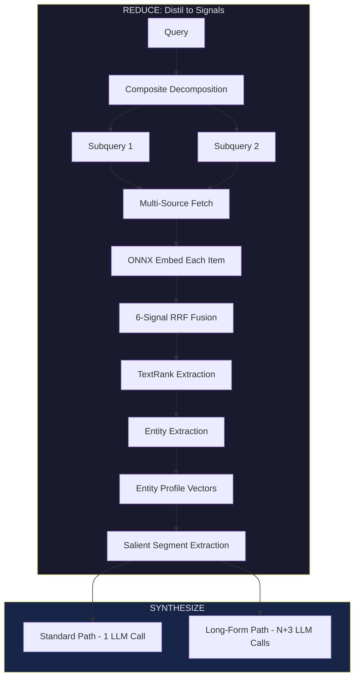
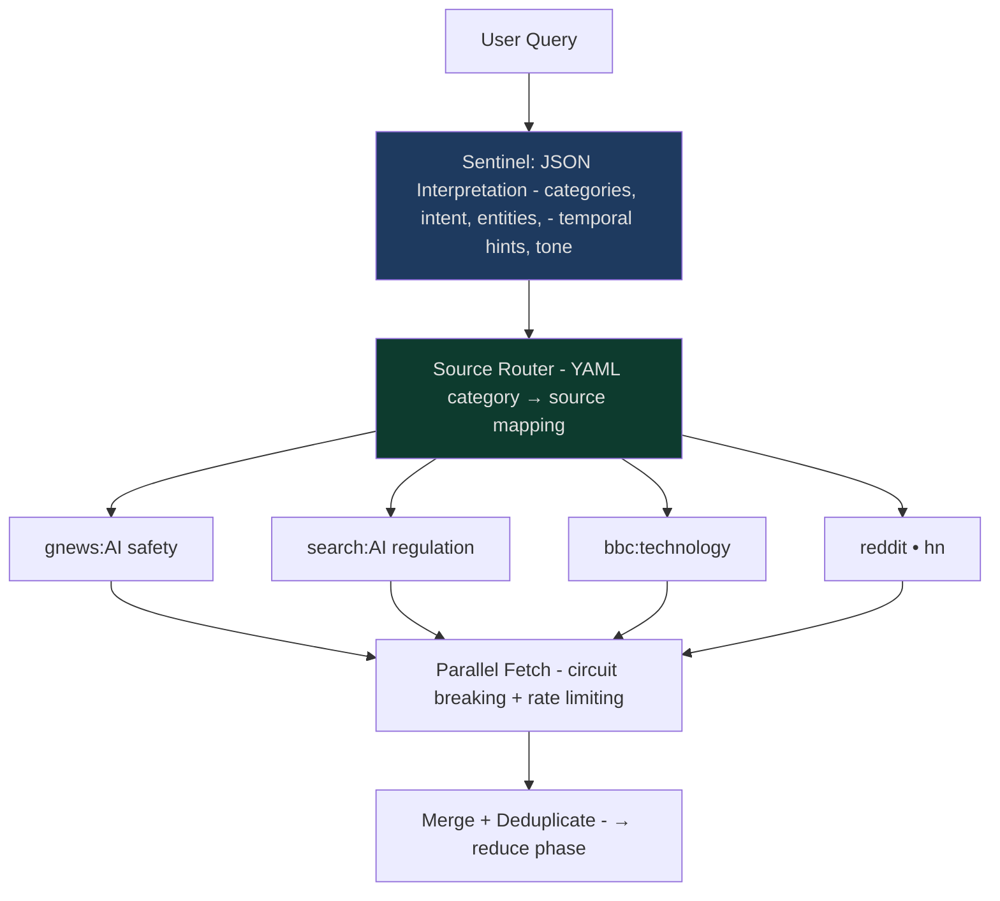
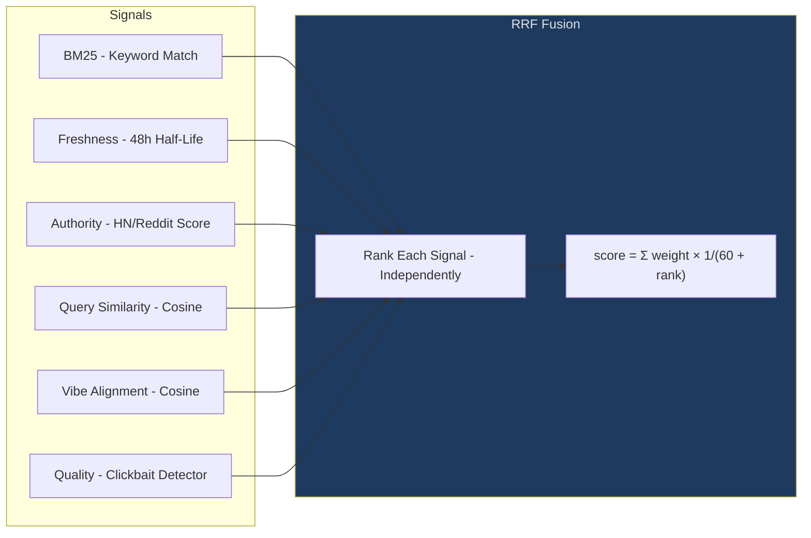
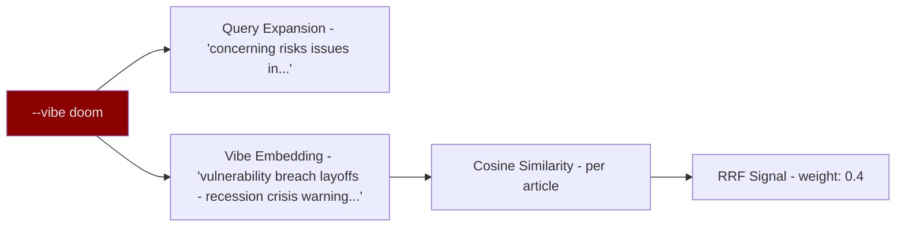
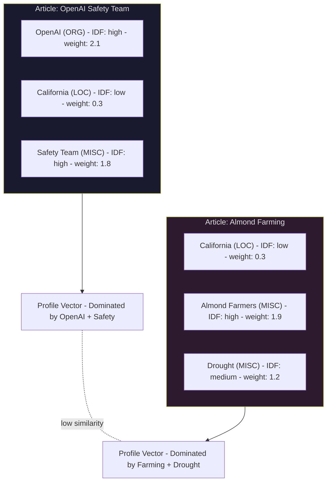
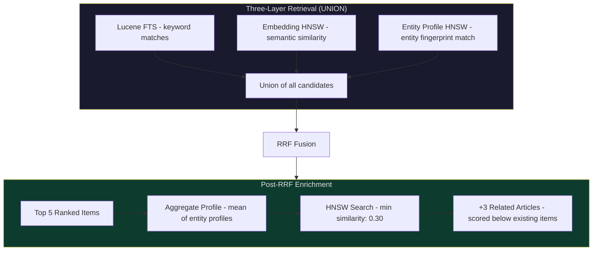
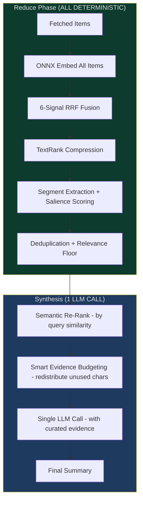
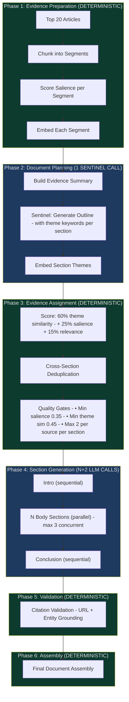
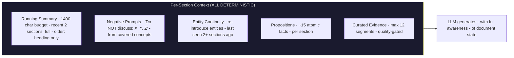
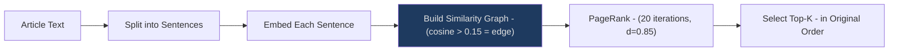

# DoomSummarizer: DocSummarizer's Younger, Smarter Brother

<!--category-- AI, LLM, RAG, C#, Deep Research, Lucene, Knowledge Graph, Time Boxed Tool -->

<datetime class="hidden">2026-01-29T10:00</datetime>

Deep Research without Deep Pockets.

When "Deep Research" landed in the premium AI tools, I was curious: what is this, actually? So I pulled it apart. And once I understood the architecture, I realised I'd already built most of it.

### DoomSummarizer leverages a similar workflow, but its design optimizes the "read + reduce" process to be mostly deterministic and localized, with the Large Language Model (LLM) primarily employed for synthesis.

In this approach, the strength of the reduction step eliminates the need for a large, expensive model to produce satisfactory results.

Notably, I already possessed many essential building blocks, including multi-source retrieval, entity extraction, knowledge graphs, and embedding-based ranking, which are shared with lucidRAG and the DocSummarizer series.

The missing component was not a lack of capability, but rather understanding how to effectively apply these existing elements.What “Deep Research” Usually Means

In the commercial tools, “Deep Research” usually means a workflow that plans a research approach, does multi-step searching/browsing/reading across lots of sources (often web + your uploaded/connected files), then writes a longer report with citations.

A big part of the value is improving the input: pull in fresher, higher-signal sources than any model’s training data cut-off date, ground claims in evidence, and reduce the chance of the model making things up.

Examples: [OpenAI Deep Research](https://openai.com/index/introducing-deep-research/), [Gemini Deep Research](https://blog.google/products/gemini/new-gemini-app-features-march-2025/), and [Perplexity Deep Research](https://www.perplexity.ai/hub/blog/introducing-perplexity-deep-research) (also called “Research mode” in their UI/docs).

DoomSummarizer follows the same workflow, but it’s engineered so most of the “read + reduce” work is deterministic and local, and the LLM is used mainly for synthesis.

If the reduce step is strong, you don’t need a big, expensive model to get a good result.

Between [lucidRAG](https://github.com/scottgal/lucidrag) and the DocSummarizer series, I already had most of the building blocks: multi-source retrieval, entity extraction, knowledge graphs, embedding-based ranking.

The missing piece wasn't capability. It was *orchestration*. How do you take all these signals and fuse them into something coherent with a tiny model?

That's DoomSummarizer. Named after doom scrolling, because it doom scrolls so you don't have to. Point it at your sources, set a vibe, get a synthesis.

But this article isn't about the tool. It's about the ideas that make it work.

[](https://github.com/scottgal/lucidrag/releases?q=doomsummarizer)

This is **Part 5** of the DocSummarizer series.

If you want the groundwork first:

- [Part 1: Architecture](/blog/building-a-document-summarizer-with-rag)
- [Part 2: Using the Tool](/blog/docsummarizer-tool)
- [Part 3: Advanced Concepts](/blog/docsummarizer-advanced-concepts)
- [Part 4: Building RAG Pipelines](/blog/docsummarizer-rag-pipeline)

This is also a [Time Boxed Tool](/blog/timeboxedtool-consoleimage).

---

[toc]

## The Core Idea: Reduced RAG

Standard RAG already does semantic retrieval: chunk documents, embed them, and fetch the top-k most similar chunks.

The pain is the last step: you still end up dumping a noisy, overlapping pile of chunks into an LLM and asking it to reconcile duplicates, weigh sources, and keep a coherent thread. That works, but it pushes you toward big context windows and expensive models.

What if you did more work *before* the LLM sees anything?

That's the pattern: **reduce before you generate**. Take raw documents and deterministically reduce them to their essential signals: embeddings, ranks, salient segments, entity profiles. By the time the LLM sees anything, the hard work is done.



The reduce phase is deterministic: embeddings, ranking, entity extraction, TextRank, segment scoring. No LLM calls.

Synthesis is the only LLM step. For a standard query the reduced signals are clean enough that **one call** does the job. For long-form documents, a sentinel plans the structure and the main model generates sections in parallel (**N+3** calls for N sections).

For more detail on this pattern, see [Reduced RAG](/blog/reduced-rag).

## The Map Phase: From Query to Sources

Before anything gets reduced, the query needs to become search actions.

A small local sentinel model (0.6B in my case, JSON mode, temperature 0.1) interprets the raw query into a structured intent, then a YAML-driven source router turns that intent into concrete fetches.



The sentinel extracts structured fields:

- Topic categories (with confidence weights)
- Query intent (news, QA, research, comparison, howto)
- Temporal sensitivity (breaking / today / week)
- Named entities
- For compound questions: decomposed subqueries (with pronouns resolved)

**Source selection** happens in six phases:

1. **Explicit sources**: user said `"from HackerNews"` → `hn` goes straight in
2. **Search queries**: the sentinel's optimised search terms become vibe-qualified API calls (DuckDuckGo, Brave, Google News RSS)
3. **Category routing**: topic weights map to RSS feeds via YAML config. A query about "AI regulation" routes to tech feeds *and* policy feeds
4. **Research enrichment**: `research` or `deep_dive` intents add arxiv
5. **Entity enrichment**: named entities from NER get their own gnews queries ("OpenAI" → `gnews:OpenAI`)
6. **Diversity floor**: if fewer than 3 sources selected, defaults fill in

The result: ~10 source identifiers fetched in parallel with per-source circuit breaking.

Vibes modify the search terms before they hit any API. For example, `--vibe doom` prefixes queries with *"concerning problems risks issues in..."*, reshaping what comes back before any ranking happens.

If you want the background on the resilience bits, see [Using Polly for Retries](/blog/usingpollyforretries) (circuit breakers) and [Backpressure in Queueing Systems](/blog/backpressure-queueing-systems) (rate limiting and backpressure).

## Deconstructing the Query

Most search systems treat "What's new in AI safety and what are the latest regulations?" as one query. It's two. Treating it as one dilutes both.

The sentinel decomposes compound queries:

```json
{
  "is_composite": true,
  "subqueries": [
    "What's new in AI safety?",
    "What are the latest AI regulations?"
  ]
}
```

The interesting choice is what happens next. Each subquery gets its own ONNX embedding (see [ONNX: Running ML Models Locally](/blog/docsummarizer-advanced-concepts#onnx-running-ml-models-locally)). When scoring articles, I take the **max cosine similarity** across all subquery embeddings, not the average.

Why max? An article that perfectly answers "AI safety" shouldn't be penalised for saying nothing about "regulations". Averaging would bury it under mediocre partial matches. Max similarity means: if an article nails *any* part of your question, it rises. The alternative, averaging, rewards bland articles that vaguely touch everything.

## Fusing Heterogeneous Signals

I have six ranking signals. They have completely different scales:



HN points go to thousands. Cosine similarity is -1 to 1. Freshness decays exponentially. You can't safely add these together. The scales are incompatible.

The keyword signal here is BM25 across multiple fields (BM25F). If you want the background on BM25, see [DocSummarizer Part 3](/blog/docsummarizer-advanced-concepts#bm25-the-sparse-retrieval-workhorse).

**[Reciprocal Rank Fusion](/blog/docsummarizer-advanced-concepts#hybrid-search-with-rrf)** (Cormack et al., 2009) solves this by ignoring raw scores: each signal ranks items independently, then you combine the *ranks*: `score = Σ weight × 1/(k + rank)` (with `k=60`).

If you want the full background on RRF, Part 3 covers it. Here the twist is **weights adapt to query type**. The sentinel detects intent, and the scorer reshapes itself:

- Timeline queries ("What happened today?") crank freshness up and quality down (recency matters most).
- Explainer queries ("How does quantum computing work?") do the opposite (depth matters more than novelty).
- Roundups and comparisons have their own tuned profiles.

## Vibes as a Retrieval Dimension

This started as a joke. Now it's my favourite feature.

A "vibe" isn't prompt wording. It's a **first-class ranking signal** embedded into the retrieval pipeline:



Three things happen when you set a vibe:

1. **Query expansion** - search gets prefixed with mood-appropriate qualifiers
2. **Vibe embedding** - representative text gets embedded as a 384-dim target
3. **Ranking signal** - articles scored by cosine similarity to the vibe embedding

Custom vibes work identically. `--vibe "contemplative philosophical"`-your text becomes both the query prefix and the ranking target. The system doesn't distinguish predefined from custom. It just embeds whatever you give it.

## Entity Profiles, Not Entity Counts

Here's a mistake I made first: counting shared entities between documents.

Two articles both mention "California":

1. *"OpenAI's California office announces safety team"*
2. *"California almond farmers face drought"*

Shared entity count: 1. Therefore related! Obviously wrong.

The fix was to think about entities as vectors, not strings.

This is the [constrained fuzziness pattern](/blog/constrained-fuzziness-pattern): the NER model proposes entities, but deterministic weighting decides what matters.

Each document gets a **weighted entity profile** (a 384-dim vector encoding *which* entities appear and how distinctive they are):

```
weight = TF × IDF × confidence × type_weight
profile = L2_normalize(Σ entity_embedding × weight)
```



IDF is the key. "California" appears in tons of articles - low IDF, weak signal. "OpenAI" is distinctive - high IDF, dominates the profile. Now similarity search works. OpenAI articles cluster together. Farming articles cluster separately. The shared "California" becomes noise.

The clever part: **saturating TF**. Instead of raw mention count, I use `1 + log(mentions)`. An entity mentioned 50 times in a long article doesn't get 50× the weight of one mentioned once. It gets ~5×. This prevents boilerplate entities from flooding the profile.

## Semantic Graph Discovery

Entity profiles aren't just for understanding documents. They're a **retrieval dimension**. Each documen🥱t's entity profile gets indexed in an HNSW graph (DuckDB's VSS extension), enabling O(log N) discovery of semantically related articles that keyword search would miss entirely.

If you want more detail on HNSW and DuckDB VSS, see [GraphRAG Part 2: Minimum Viable GraphRAG](/blog/graphrag-minimum-viable-implementation).



This works at two stages:

**During retrieval**: when the sentinel extracts 2+ entities from the query, a query entity profile is computed using the same TF×IDF formula. This searches the HNSW index for articles with similar entity fingerprints, with a minimum similarity of 0.25. An article about "OpenAI safety concerns" surfaces even if it never mentions the exact query terms, because its entity profile (dominated by high-IDF "OpenAI" + "safety") is close to the query's.

**After ranking**: the top 5 ranked items have their entity profiles averaged into an aggregate vector. This aggregate searches for related articles that the keyword and embedding layers missed entirely. Found articles get scored just below the lowest ranked item (×0.9) and tagged as discovered *"via entities"*. This catches the primary sources that news articles reference but don't quote verbatim.

Three retrieval layers fuse via union: Lucene keyword matches ∪ embedding HNSW matches ∪ entity profile HNSW matches. Union is deliberately broader than intersection. It catches items that any single signal would surface. The RRF fusion then sorts out what's actually relevant.

The fallback path (for corpora without entity profiles yet) uses SQL entity co-occurrence counting (`HAVING shared_count >= 2`). It works, but it's O(N²) instead of O(log N). The `--backfill-entity-profiles` command migrates existing corpora to the HNSW path.

## Standard Synthesis: One LLM Call

This is the normal path. `scroll "AI safety and regulation"` hits this. After the reduce phase distils your sources into ranked, deduplicated, entity-profiled segments, synthesis is a single call:



The reduce phase does the hard work. By the time the LLM sees anything, it receives:

- **Top items only**: relevance floor at 30% of the best item's score, URL-deduplicated
- **Source diversity**: capped at 3 items per domain for roundup queries
- **Semantic re-ranking**: items re-ordered by cosine similarity to the query embedding
- **Smart evidence budgeting**: short items donate unused character budget to long items, so evidence space isn't wasted
- **Structured evidence blocks**: `[E1] Title | topic | relevance` with content truncated to budget

One LLM call. That's the payoff of [reduced RAG](/blog/reduced-rag): selection, ranking, deduplication, and budgeting all happen before the LLM sees anything.

## The Long-Form Pipeline: Constrained Parallel Generation

Long-form (`--template blog-article`) is a different beast. You're generating a multi-section document from dozens of sources, and you need coherence across sections without expensive LLM compression calls.

The answer is **[constrained fuzzy context dragging](/blog/constrained-fuzzy-context-dragging)**. These are deterministic mechanisms that maintain cross-section coherence while allowing parallel generation.



Count the LLM calls: **1** (sentinel outline) + **1** (intro) + **N** (body sections) + **1** (conclusion) = **N+3**. Four of the six phases are deterministic.

### Constrained Fuzzy Context Dragging

The problem with parallel section generation is coherence. If sections don't know what other sections said, you get repetition and drift. The usual fix is sequential generation with full context. That's slow and wastes context window.

Instead, each section gets a **constrained context** that's built deterministically:



- **Running summary**: after each section, the top-salience evidence segment (200 chars) is recorded. Recent 2 sections get full digest; older sections get heading + first sentence. Total budget: 1400 characters. No LLM summarisation.
- **Negative prompts**: covered concepts are extracted (proper nouns, technical terms, heading keywords, max 15 per section). Subsequent sections get: *"Do NOT discuss these topics (already covered): X, Y, Z"*
- **Entity continuity**: entities not mentioned in 2+ sections get flagged for re-introduction. Active entities (mentioned recently) are tracked. The LLM gets guidance: *"Re-introduce if relevant: Entity1 (last mentioned: section 2)"*
- **Drift detection**: after each section generates, its first 1000 characters are embedded and compared against the plan's theme embedding. If cosine similarity drops below 0.35 for 3 consecutive sections, the theme embedding is recalibrated from the first 2 sections.

In parallel mode, the intro generates first (sets the baseline), body sections run concurrently (up to 3 via `SemaphoreSlim` to cap concurrency, each excluding intro topics but not each other), and the conclusion runs last (excluding everything).

Sequential mode gives tighter coherence (each section excludes all previous concepts cumulatively), but parallel is ~3x faster for large documents.

### Evidence Assignment: The Heart of Reduced RAG

Each section needs evidence, but not *any* evidence. Every segment gets a composite score: **60% theme similarity** (cosine distance to the section's theme embedding), **25% salience** (how informative the segment is), and **15% article relevance** (how relevant the source article is overall). This scoring is entirely deterministic. No LLM decides what's relevant.

Then the gates:

- **Salience floor** (0.35): low-quality segments never reach the LLM
- **Theme similarity floor** (0.45): off-topic evidence stays out
- **Cross-section dedup** (0.80 cosine): the same fact doesn't appear twice
- **Per-source cap** (2 segments per article per section): no single source dominates
- **Section role awareness**: intro sections penalise technical detail (-0.3); later sections reward it (+0.15)
- **Query cohesion gate** (0.30): evidence must relate to the original query, not just the section theme

The LLM target word count adjusts based on evidence quality. Strong evidence (salience ≥ 0.6, 2+ sources, 4+ segments) → full word count. Weak evidence (salience < 0.45, sparse) → 60% of target. This prevents hallucination when the evidence is thin.

### Proposition Extraction: Dense-X in Practice

Before evidence reaches the LLM, it's atomised into propositions (inspired by the [Dense-X Retrieval paper](https://arxiv.org/abs/2312.06648)). Each segment is broken into six types of atomic fact: **claims** (general factual assertions), **quotes** (direct from source), **statistics** (numbers and metrics), **definitions** ("X is Y"), **processes** (step-by-step), and **named entity facts** (focused on a specific entity).

Each section gets ~15 propositions, deduplicated across sections using semantic similarity (not string matching). The LLM receives structured bullet points grouped by source, not raw paragraphs.

By the time the LLM writes a section, the reduce phase has given it:

- A clear heading and theme
- Curated evidence segments (quality-gated, deduplicated)
- ~15 atomic propositions (quotes, stats, entities)
- A running summary of what previous sections already covered
- Negative prompts for what *not* to repeat
- Entity continuity guidance

A small model can do excellent work with this kind of pre-processing.

## TextRank: Deterministic Summarisation

When articles are too long for the evidence pipeline, I need to compress them. But I don't want to spend an LLM call on summarisation.

TextRank (Mihalcea & Tarau, 2004) does it deterministically:



Every sentence gets an embedding. Pairwise similarities above 0.15 become graph edges. PageRank finds the most *central* sentences, the ones most connected to everything else. Those are the sentences that best represent the document.

The key detail: selected sentences are returned **in original document order**. This preserves narrative flow. You get a coherent summary, not a random bag of important sentences.

No LLM call. Runs in milliseconds. Cosine similarity is SIMD-accelerated via `TensorPrimitives` (`System.Numerics.Tensors`) (AVX2, AVX-512, or ARM NEON, chosen at runtime).

## One-Hop Link Following

Articles reference other articles. Those references often contain the best evidence - the primary source that a news article summarises.

DoomSummarizer follows links, but selectively. Each candidate link gets scored:

```
link_score = 0.7 × query_relevance(anchor_context) + 0.3 × segment_salience
```

Where segment salience combines:

- **Position** (60%) - inverted pyramid: earlier paragraphs matter more
- **Substance** (40%) - paragraph length and information density

Links below a relevance floor (0.15) are skipped. The system follows the journalistic inverted pyramid heuristic: important links tend to appear early in well-written articles.

Results are cached with content hashes and ETags. Second runs are fast. See [Response Caching, ETags, and Conditional Requests](/blog/ASPNET-STATE-BETWEEN-REQUESTS).

## Crawl Mode: Build a Local Knowledge Base

Everything described so far assumes web fetching. But you can skip the web entirely.

`crawl` ingests a website into a local knowledge base. It does a breadth-first crawl (BFS) from a seed URL, respecting depth and page limits, with adaptive rate limiting that scales delay based on server response times:

```bash
doomsummarizer crawl https://docs.example.com --name example-docs --depth 3 --max-pages 200
```

Everything gets persisted: full content, ONNX embeddings, entity profiles, SQLite FTS5 keyword indexes (full-text search), sentiment and topic scores (computed via embedding anchors, no LLM). Incremental re-crawls send `If-None-Match` / `If-Modified-Since` headers. Unchanged pages return HTTP 304 and skip reprocessing. For servers without ETag support, SHA256 content hashes catch duplicates.

Once crawled, query entirely offline:

```bash
doomsummarizer scroll "how does authentication work?" --name example-docs
```

The `--name` flag routes to the local KB instead of web sources. The same three-layer retrieval fires: FTS5 full-text pre-filter, embedding HNSW search, entity profile HNSW search. They are union-fused and ranked. Same reduce pipeline, same synthesis. No network required.

The storage is lightweight: SQLite for metadata and FTS5 indexes, DuckDB with the VSS extension for HNSW vector indexes. No external services, no Docker, no API keys. A crawled knowledge base of hundreds of pages fits in a few megabytes and queries in milliseconds.

## Putting It Together

```bash
doomsummarizer scroll "AI safety and regulation" --vibe doom --debug

Composite query detected: 2 subqueries
  • What's new in AI safety?
  • What are the latest AI regulations?

Searching...
├─ Lucene: 18 keyword matches (regulation^3, safety^2)
├─ Embedding: 12 semantic matches (max-sim across 2 subqueries)
├─ RRF fusion: 22 candidates, 6 signals
├─ Entity HNSW: +3 related via entity profiles
├─ TextRank: compressed 4 long articles
└─ Final: 12 items

Long-form: Phase 1 - 187 segments from 12 articles
Long-form: Phase 2 - "AI Safety Landscape" - 5 sections
Long-form: Phase 3 - Evidence assigned (cross-section dedup: 8 removed)
Long-form: Phase 4 - Generating sections...
```

## The Ideas That Made It Work

These are the insights. Take them, use them in your own systems:

1. **Reduce before you generate**: the standard path needs just 1 LLM call because the pipeline does all the heavy lifting deterministically. [Reduced RAG](/blog/reduced-rag) is the pattern: embeddings, PageRank, heuristics, and quality gates produce such clean input that even small models synthesise well.
2. **Sentinel-driven source routing**: a small model interprets queries into structured intent, then YAML-driven routing selects and vibe-qualifies ~10 sources. The sentinel is cheap enough to call on every query.
3. **Max similarity for compound queries**: don't average subquery scores, take the best match. An article nailing one part of your question is better than one half-matching everything.
4. **Combine ranks, not scores**: RRF lets you fuse signals with incompatible scales. Authority, freshness, embedding similarity, vibe alignment; just rank and fuse.
5. **Vibes as embeddings**: any text can be a retrieval dimension. Embed it, score against it, weight it in RRF. No special cases needed.
6. **Entity profiles as vectors**: IDF-weighted entity embeddings, not entity string counting. Rare entities dominate the profile, common entities become noise, and HNSW search discovers related articles in O(log N).
7. **Constrained fuzzy context dragging**: [deterministic context management](/blog/constrained-fuzzy-context-dragging) enables parallel section generation. Running summaries, negative prompts, entity continuity, and drift detection maintain coherence without LLM compression calls.
8. **Deterministic where possible**: of the six long-form phases, four are deterministic. TextRank replaces LLM summarisation. Evidence assignment replaces LLM selection.

## Resources

- **[DoomSummarizer Releases](https://github.com/scottgal/lucidrag/releases?q=doomsummarizer)**: single binary, no runtime needed
- **[lucidRAG Repository](https://github.com/scottgal/lucidrag)**: the parent project
- **[Source Code](https://github.com/scottgal/lucidrag/tree/main/src/DoomSummarizer)**

### Related Articles

- [Reduced RAG](/blog/reduced-rag): the reduce-before-generate pattern in depth
- [Constrained Fuzzy Context Dragging](/blog/constrained-fuzzy-context-dragging): how parallel section generation maintains coherence
- [Constrained Fuzziness Pattern](/blog/constrained-fuzziness-pattern): the broader pattern behind deterministic control + probabilistic proposals

### Also

- [ConsoleImage (Time Boxed Tool)](/blog/timeboxedtool-consoleimage)
