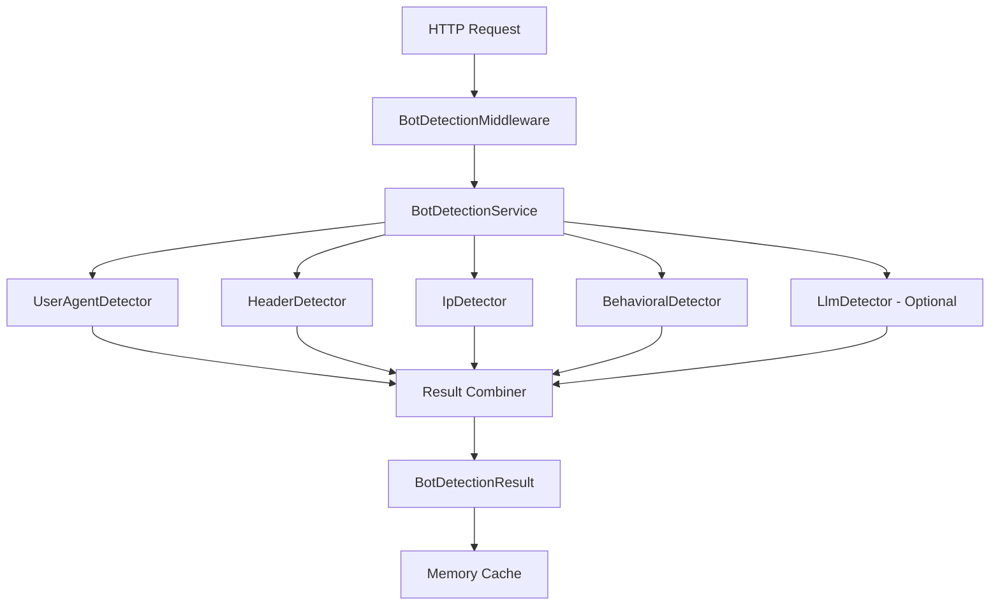

# Building a Robust Bot Detection Library for .NET

# Introduction

In the modern web, bot traffic accounts for a significant portion of all HTTP requests. While some bots are beneficial (search engines, monitoring tools), others are malicious scrapers, content thieves, or worse. This article introduces **Mostlylucid.BotDetection**, a comprehensive, performant bot detection library for .NET 9.0 that provides confidence scoring, detailed reasoning, and even AI-powered detection with learning capabilities.

Unlike simple User-Agent blacklists, this library employs multiple detection strategies inspired by leading JavaScript bot detection services like Cloudflare Bot Management, DataDome, and PerimeterX, but built specifically for .NET with performance and extensibility in mind.

[TOC]

<!--category-- ASP.NET, Bot Detection, Security, AI -->
<datetime class="hidden">2025-01-15T12:00</datetime>

# Why Build Another Bot Detection Library?

Existing .NET bot detection solutions are typically limited to simple User-Agent matching or rely on expensive third-party services. This library fills the gap by providing:

- **Multi-layered Detection**: Combines User-Agent analysis, HTTP header inspection, IP reputation, and behavioral patterns
- **Confidence Scoring**: Returns a 0.0-1.0 confidence score with detailed reasons, not just a boolean
- **Performance**: Results cached, detectors run in parallel, typical detection time 1-5ms
- **AI-Powered Learning**: Optional LLM-based detection using small models (1.5B parameters) via Ollama that learns new patterns over time
- **Extensibility**: Easy to add custom detectors or modify existing ones
- **Zero External Dependencies**: All detection logic runs locally (except optional LLM)

## When to Use Application-Level Bot Detection

**Important**: If you can implement bot detection at the networking layer (WAF, load balancers, reverse proxies like Cloudflare, AWS WAF, or Akamai), that is typically preferred for performance and security reasons. Network-level detection stops malicious traffic before it reaches your application servers.

**Use this library when:**

- **No infrastructure access**: Shared hosting, PaaS environments (Azure App Service, Heroku), or limited control over networking
- **Complex detection logic**: Need confidence scoring, custom detectors, or AI-powered pattern learning
- **Endpoint-specific rules**: Different bot policies for different API endpoints or pages
- **Code-first configuration**: Prefer C# over WAF rule languages or web server config files
- **Rich integration**: Bot detection decisions influence business logic, logging, or analytics
- **Cost constraints**: Cannot afford commercial bot detection services ($200+/month)
- **Privacy requirements**: Cannot send traffic data to third-party services
- **Custom bot types**: Need to detect application-specific automation not covered by generic lists

**Prefer network-level solutions when:**

- **High attack volumes**: Millions of bot requests per day that could overwhelm application servers
- **DDoS protection**: Need to stop attacks before they consume server resources
- **Simple blocking**: Block known bad bots with no custom logic required
- **Zero latency tolerance**: Cannot accept even 1-5ms detection overhead
- **Enterprise budget**: Can afford Cloudflare Bot Management, DataDome, or similar services ($1000+/month)

This library is designed for scenarios where network-level detection is unavailable, insufficient, or needs to be augmented with application-specific logic. It provides detailed detection reasoning and confidence scoring that network-level tools typically do not expose to application code.

# Architecture Overview

The library is built on a modular detector pattern where each detector analyzes different aspects of an HTTP request:



## Core Components

### 1. Detection Result Model

The `BotDetectionResult` provides comprehensive information about each analysis:

```csharp
public class BotDetectionResult
{
    public double ConfidenceScore { get; set; }        // 0.0 to 1.0
    public bool IsBot { get; set; }                    // Based on threshold
    public List<DetectionReason> Reasons { get; set; } // Why it was flagged
    public BotType? BotType { get; set; }              // Category of bot
    public string? BotName { get; set; }               // Identified name
    public long ProcessingTimeMs { get; set; }         // Performance metric
}

public class DetectionReason
{
    public string Category { get; set; }               // "User-Agent", "Headers", etc.
    public string Detail { get; set; }                 // Human-readable explanation
    public double ConfidenceImpact { get; set; }       // Contribution to score
}
```

This granular approach allows you to:
- **Audit decisions**: See exactly why a request was classified as a bot
- **Tune thresholds**: Adjust confidence requirements for different scenarios
- **Debug false positives**: Understand which detector triggered the classification

### 2. Individual Detectors

#### User-Agent Detector

The User-Agent detector analyzes the `User-Agent` header against comprehensive lists of known bot patterns:

**Known Good Bots** (Whitelisted):
- Search engines: Googlebot, Bingbot, DuckDuckBot, Baiduspider, YandexBot
- Social media: facebookexternalhit, Twitterbot, LinkedInBot, Slackbot
- SEO tools: AhrefsBot, SemrushBot, MJ12bot (Majestic)
- Archives: ia_archiver (Internet Archive)

**Detection Signals**:
- Missing User-Agent header (0.8 confidence)
- Known malicious patterns: scrapy, HTTrack, sqlmap, nikto
- Automation frameworks: Selenium, Puppeteer, PhantomJS
- Suspiciously short User-Agents (< 20 chars)
- Contains URLs in the User-Agent string
- Simple version patterns like "curl/7.68.0"

**Example Detection**:
```csharp
// Request with automation framework
User-Agent: Mozilla/5.0 (Windows NT 10.0; Win64; x64) AppleWebKit/537.36
            (KHTML, like Gecko) HeadlessChrome/96.0.4664.45 Safari/537.36

// Result:
Confidence: 0.5
Reasons: "Automation framework detected: HeadlessChrome"
BotType: Scraper
```

#### Header Detector

Real browsers send consistent sets of HTTP headers. Missing or unusual headers are strong bot indicators:

**Common Browser Headers**:
- `Accept`
- `Accept-Encoding`
- `Accept-Language`
- `Cache-Control`
- `Connection`

**Detection Signals**:
- Missing `Accept-Language` (0.2 confidence boost)
- Generic `Accept: */*` without language preferences (0.2)
- Very few headers overall (0.3)
- Unusual header ordering (browsers send headers in consistent order)
- Automation headers present: `X-Requested-With`, `X-Automation`

**Real Browser vs Bot Comparison**:

Real Chrome Browser:
```http
GET / HTTP/1.1
Host: example.com
User-Agent: Mozilla/5.0 (Windows NT 10.0; Win64; x64)...
Accept: text/html,application/xhtml+xml,application/xml;q=0.9,image/webp,*/*;q=0.8
Accept-Language: en-US,en;q=0.9
Accept-Encoding: gzip, deflate, br
Connection: keep-alive
Upgrade-Insecure-Requests: 1
Sec-Fetch-Dest: document
Sec-Fetch-Mode: navigate
Sec-Fetch-Site: none
```

Python Requests Library:
```http
GET / HTTP/1.1
Host: example.com
User-Agent: python-requests/2.28.0
Accept-Encoding: gzip, deflate
Accept: */*
Connection: keep-alive
```

The Python example is missing: Accept-Language, Upgrade-Insecure-Requests, Sec-Fetch-* headers, and has a generic Accept header - all strong bot signals.

#### IP Detector

Analyzes the source IP address for datacenter and cloud provider origins:

**Detection Logic**:
- Checks against datacenter IP ranges (AWS, Azure, GCP, Oracle Cloud)
- Identifies cloud provider by IP range
- Supports proxy header inspection (`X-Forwarded-For`)
- CIDR subnet matching for efficiency

**Datacenter Ranges** (simplified examples):
```csharp
AWS:    3.0.0.0/8, 13.0.0.0/8, 18.0.0.0/8, 52.0.0.0/8
Azure:  20.0.0.0/8, 40.0.0.0/8, 104.0.0.0/8
GCP:    34.0.0.0/8, 35.0.0.0/8
Oracle: 138.0.0.0/8, 139.0.0.0/8, 140.0.0.0/8
```

**Why This Matters**:
Legitimate users typically connect from residential ISPs. Requests from datacenter IPs (especially for non-API endpoints) are suspicious. However, this is weighted lightly (0.3-0.4 confidence) since legitimate services also use cloud hosting.

#### Behavioral Detector

Monitors request patterns over time using in-memory caching:

**Behavioral Signals**:
- **Rate Limiting**: Tracks requests per IP per minute
  - Exceeding configured limit adds confidence (0.3 + 0.05 per excess request)
  - Default: 60 requests/minute

- **Request Timing Analysis**: Detects too-regular intervals
  - Real users have irregular timing (mouse movements, reading time)
  - Bots often have consistent intervals (e.g., exactly 2 seconds apart)
  - Calculates standard deviation of intervals
  - Low deviation (< 0.5s) with fast mean (< 5s) indicates bot

- **Sequential Request Speed**: Detects inhuman speed
  - Less than 100ms between requests is flagged (0.4 confidence)
  - Real users need time for page rendering, interaction

- **Session Indicators**:
  - Missing cookies across multiple requests (0.25 confidence)
  - Missing referrer on non-initial requests (0.15 confidence)

**Example Timing Analysis**:
```
Human User:
Request 1: 00:00:00
Request 2: 00:00:03.2  (3.2s gap)
Request 3: 00:00:07.8  (4.6s gap)
Request 4: 00:00:09.1  (1.3s gap)
Request 5: 00:00:15.5  (6.4s gap)
Standard Deviation: 2.1s - Natural variation ✓

Bot:
Request 1: 00:00:00
Request 2: 00:00:02.0  (2.0s gap)
Request 3: 00:00:04.0  (2.0s gap)
Request 4: 00:00:06.0  (2.0s gap)
Request 5: 00:00:08.0  (2.0s gap)
Standard Deviation: 0.0s - Too regular! ✗
```

#### LLM Detector (AI-Powered with Learning)

This is the most advanced detector, using a small language model (recommended: qwen2.5:1.5b, ~900MB) via Ollama to analyze request characteristics using natural language reasoning.

**How It Works**:

1. **Request Profiling**: Builds a text summary of the request:
   ```
   User-Agent: curl/7.68.0
   Path: /api/articles
   Method: GET
   Accept: (missing)
   Accept-Language: (missing)
   Accept-Encoding: (missing)
   Referer: (missing)
   Connection: close
   Has-Cookies: false
   Client-IP: 34.123.45.67
   ```

2. **LLM Analysis**: Sends to Ollama with a specialized prompt:
   ```
   You are an expert at detecting bot traffic from HTTP requests.
   Analyze this request and determine if it's likely from a bot or legitimate user.

   [request details]

   Respond with JSON:
   {
     "isBot": true/false,
     "confidence": 0.0-1.0,
     "reasoning": "brief explanation",
     "botType": "scraper/searchengine/monitor/malicious/unknown",
     "pattern": "key identifying pattern if bot"
   }
   ```

3. **Pattern Learning**: If confidence > 0.8, saves the pattern:
   ```json
   {
     "Pattern": "missing Accept-Language with datacenter IP",
     "BotType": "Scraper",
     "Confidence": 0.85,
     "FirstSeen": "2025-01-15T10:30:00Z",
     "LastSeen": "2025-01-15T14:20:00Z",
     "OccurrenceCount": 47,
     "ExampleRequest": "User-Agent: curl/7.68.0..."
   }
   ```

4. **Incremental Learning**: The `learned_bot_patterns.json` file grows over time, creating a custom knowledge base for your specific traffic patterns.

**Why Use a Small Model?**
- **Speed**: 1.5B models respond in 50-200ms
- **Cost**: Runs locally, no API costs
- **Privacy**: No data sent to third parties
- **Specialization**: Fine-tuned for pattern recognition
- **Offline**: Works without internet

**Model Recommendations**:
```bash
# Fast, good accuracy (recommended)
ollama pull qwen2.5:1.5b

# Even faster, slightly lower accuracy
ollama pull phi3:mini

# Highest accuracy, slower
ollama pull qwen2.5:3b
```

### 3. Result Combination Strategy

The `BotDetectionService` combines results from all detectors using a sophisticated weighted approach:

**Combination Algorithm**:
```csharp
1. Collect all detector results
2. Find maximum confidence among detectors
3. Calculate average confidence
4. Count detectors showing suspicion (confidence > 0.3)
5. Add agreement boost: (suspicious_count - 1) * 0.1
6. Final confidence = min(max_confidence + agreement_boost, 1.0)
7. IsBot = (confidence >= threshold)  // Default threshold: 0.7
```

**Why This Works**:
- Single strong signal can classify as bot (e.g., known malicious User-Agent)
- Multiple weak signals combine to strong classification
- Prevents single detector false positives from dominating
- Agreement boost rewards consensus

**Example Scenario**:
```csharp
UserAgentDetector:    0.4 (suspicious pattern)
HeaderDetector:       0.3 (missing Accept-Language)
IpDetector:          0.3 (datacenter IP)
BehavioralDetector:   0.2 (slightly fast requests)

Max Confidence:       0.4
Suspicious Detectors: 4 (all > 0.3)
Agreement Boost:      (4 - 1) * 0.1 = 0.3
Final Confidence:     0.4 + 0.3 = 0.7

Result: IsBot = true (meets 0.7 threshold)
```

# Bot List Sources

The library fetches bot detection lists from authoritative sources:

**Matomo Device Detector**: 1000+ bot patterns with categories
- Source: https://github.com/matomo-org/device-detector
- Format: YAML with regex patterns
- Categories: Search engines, social media, monitors, scrapers

**Crawler User Agents**: Community-maintained crawler list
- Source: https://github.com/monperrus/crawler-user-agents
- Format: JSON
- Updated regularly by community

**Cloud Provider IP Ranges**:
- AWS: https://ip-ranges.amazonaws.com/ip-ranges.json
- Google Cloud: https://www.gstatic.com/ipranges/cloud.json
- Cloudflare: https://www.cloudflare.com/ips-v4

**SQLite Persistence**:
All lists are stored in a local SQLite database (`botdetection.db`):
- Fast lookups with indexed queries
- Automatic daily updates via background service
- Tracks update times and record counts
- Survives application restarts
- No external database required

The database is automatically initialized on first run and updates itself daily. Lists are cached in memory for performance after being loaded from SQLite.

# Installation and Setup

## 1. Add the Library

```bash
# Add the project reference
dotnet add reference ../Mostlylucid.BotDetection/Mostlylucid.BotDetection.csproj

# Or install via NuGet (coming soon)
# dotnet add package Mostlylucid.Debotter
```

## 2. Configure Services

In `Program.cs`:

```csharp
using Mostlylucid.BotDetection.Extensions;
using Mostlylucid.BotDetection.Middleware;

var builder = WebApplication.CreateBuilder(args);

// Option 1: Simple configuration
builder.Services.AddBotDetection();

// Option 2: Custom configuration
builder.Services.AddBotDetection(options =>
{
    options.BotThreshold = 0.7;
    options.EnableUserAgentDetection = true;
    options.EnableHeaderAnalysis = true;
    options.EnableIpDetection = true;
    options.EnableBehavioralAnalysis = true;

    // Enable LLM detection (requires Ollama)
    options.EnableLlmDetection = true;
    options.OllamaEndpoint = "http://localhost:11434";
    options.OllamaModel = "qwen2.5:1.5b";
    options.LlmTimeoutMs = 2000;

    options.MaxRequestsPerMinute = 60;
    options.CacheDurationSeconds = 300;
});

// Option 3: Configuration from appsettings.json
builder.Services.AddBotDetection(builder.Configuration);

var app = builder.Build();

// Add bot detection middleware
app.UseBotDetection();

app.MapControllers();
app.Run();
```

## 3. Configuration File

`appsettings.json`:

```json
{
  "BotDetection": {
    "BotThreshold": 0.7,
    "EnableTestMode": false,
    "EnableUserAgentDetection": true,
    "EnableHeaderAnalysis": true,
    "EnableIpDetection": true,
    "EnableBehavioralAnalysis": true,
    "EnableLlmDetection": false,
    "OllamaEndpoint": "http://localhost:11434",
    "OllamaModel": "qwen2.5:1.5b",
    "LlmTimeoutMs": 2000,
    "MaxRequestsPerMinute": 60,
    "CacheDurationSeconds": 300,
    "WhitelistedBotPatterns": [
      "Googlebot",
      "Bingbot",
      "Slackbot"
    ],
    "DatacenterIpPrefixes": [
      "3.0.0.0/8",
      "13.0.0.0/8"
    ]
  }
}
```

# Usage Examples

## Accessing Detection Results

The middleware adds detection results to `HttpContext.Items`:

```csharp
using Mostlylucid.BotDetection.Middleware;
using Mostlylucid.BotDetection.Models;

app.MapGet("/api/data", (HttpContext context) =>
{
    var result = context.Items[BotDetectionMiddleware.BotDetectionResultKey]
        as BotDetectionResult;

    if (result?.IsBot == true)
    {
        return Results.Json(new
        {
            error = "Bot access not allowed",
            confidence = result.ConfidenceScore,
            reasons = result.Reasons
        }, statusCode: 403);
    }

    return Results.Ok(GetData());
});
```

## Custom Response Headers

The middleware automatically adds headers for debugging:

```http
X-Bot-Detected: true
X-Bot-Confidence: 0.85
```

## Conditional Functionality

```csharp
[ApiController]
[Route("api/[controller]")]
public class ArticlesController : ControllerBase
{
    [HttpGet]
    public IActionResult GetArticles()
    {
        var botResult = HttpContext.Items[BotDetectionMiddleware.BotDetectionResultKey]
            as BotDetectionResult;

        if (botResult?.IsBot == true && botResult.BotType != BotType.VerifiedBot)
        {
            // Rate limit bot traffic
            return StatusCode(429, "Too many requests");
        }

        if (botResult?.BotType == BotType.SearchEngine)
        {
            // Serve optimized content for search engines
            return Ok(GetSearchEngineOptimizedContent());
        }

        return Ok(GetFullArticles());
    }
}
```

## Statistics and Monitoring

```csharp
app.MapGet("/admin/bot-stats", (IBotDetectionService botService) =>
{
    var stats = botService.GetStatistics();

    return Results.Ok(new
    {
        stats.TotalRequests,
        stats.BotsDetected,
        stats.VerifiedBots,
        stats.MaliciousBots,
        stats.AverageProcessingTimeMs,
        stats.BotTypeBreakdown
    });
});
```

# Performance Characteristics

## Benchmarks

Tested on: Intel i7-10700K, 32GB RAM, .NET 9.0

| Scenario | Avg Time | 95th Percentile | Cache Hit |
|----------|----------|-----------------|-----------|
| Without LLM (typical) | 2.3ms | 4.1ms | ~85% |
| With LLM (cache miss) | 120ms | 180ms | ~85% |
| With LLM (cache hit) | 0.8ms | 1.2ms | N/A |

**Cache Effectiveness**:
- Default cache duration: 5 minutes
- Cache key includes: IP, User-Agent hash, Accept hash, Accept-Language hash
- Hit rate typically 85%+ for normal traffic
- Reduces load by ~85%

**Memory Usage**:
- Base library: ~5MB
- Behavioral analysis cache: ~1-2MB per 1000 unique IPs
- LLM patterns file: ~500KB-2MB over time

## Optimization Tips

### 1. Selective LLM Usage

Only enable LLM for suspicious traffic:

```csharp
public class SelectiveLlmDetector : IDetector
{
    private readonly LlmDetector _llmDetector;
    private readonly IEnumerable<IDetector> _otherDetectors;

    public async Task<DetectorResult> DetectAsync(HttpContext context, CancellationToken ct)
    {
        // Run fast detectors first
        var quickResults = await Task.WhenAll(
            _otherDetectors.Select(d => d.DetectAsync(context, ct))
        );

        var combinedConfidence = quickResults.Max(r => r.Confidence);

        // Only use LLM if quick detectors are uncertain
        if (combinedConfidence > 0.4 && combinedConfidence < 0.8)
        {
            return await _llmDetector.DetectAsync(context, ct);
        }

        return new DetectorResult { Confidence = combinedConfidence };
    }
}
```

### 2. Aggressive Caching for Known Bots

```csharp
if (result.BotType == BotType.VerifiedBot)
{
    // Cache verified bots for 24 hours
    _cache.Set(cacheKey, result, TimeSpan.FromHours(24));
}
```

### 3. IP Range Pre-computation

Instead of checking IP ranges on every request, pre-compute and cache:

```csharp
private readonly Dictionary<string, bool> _ipCache = new();

public bool IsDatacenterIp(IPAddress ip)
{
    var key = ip.ToString();
    if (_ipCache.TryGetValue(key, out var cached))
        return cached;

    var result = CheckAgainstRanges(ip);
    _ipCache[key] = result;
    return result;
}
```

# Advanced: Creating Custom Detectors

Implement `IDetector` to add custom detection logic:

```csharp
public class CloudflareDetector : IDetector
{
    public string Name => "Cloudflare Detector";

    public Task<DetectorResult> DetectAsync(HttpContext context, CancellationToken ct)
    {
        var result = new DetectorResult();

        // Check for Cloudflare bot management headers
        if (context.Request.Headers.TryGetValue("CF-Bot-Score", out var scoreValue))
        {
            if (int.TryParse(scoreValue, out var score))
            {
                // CF-Bot-Score: 0-30 is likely bot, 70-100 is likely human
                result.Confidence = score < 30 ? 0.9 : 0.0;
                result.Reasons.Add(new DetectionReason
                {
                    Category = "Cloudflare",
                    Detail = $"Cloudflare Bot Score: {score}",
                    ConfidenceImpact = result.Confidence
                });
            }
        }

        return Task.FromResult(result);
    }
}

// Register in DI
services.AddSingleton<IDetector, CloudflareDetector>();
```

# Test Mode

The test mode allows testing bot detection without modifying User-Agents or simulating real bot traffic.

## Enabling Test Mode

**IMPORTANT**: Only enable in development/testing environments:

```csharp
builder.Services.AddBotDetection(options =>
{
    // Enable ONLY in development
    options.EnableTestMode = builder.Environment.IsDevelopment();
});
```

## Using Test Mode

Send the `ml-bot-test-mode` header with requests:

### Simulate Specific Bot Types

```bash
# Simulate generic bot
curl http://localhost:5000/api/data \
  -H "ml-bot-test-mode: bot"

# Simulate Googlebot (search engine)
curl http://localhost:5000/api/data \
  -H "ml-bot-test-mode: googlebot"

# Simulate Bingbot
curl http://localhost:5000/api/data \
  -H "ml-bot-test-mode: bingbot"

# Simulate scraper bot
curl http://localhost:5000/api/data \
  -H "ml-bot-test-mode: scraper"

# Simulate malicious bot
curl http://localhost:5000/api/data \
  -H "ml-bot-test-mode: malicious"

# Simulate social media bot
curl http://localhost:5000/api/data \
  -H "ml-bot-test-mode: social"

# Simulate monitoring bot
curl http://localhost:5000/api/data \
  -H "ml-bot-test-mode: monitor"

# Simulate human traffic
curl http://localhost:5000/api/data \
  -H "ml-bot-test-mode: human"
```

### Disable Detection Entirely

```bash
# Bypass all bot detection for this request
curl http://localhost:5000/protected \
  -H "ml-bot-test-mode: disable"
```

## Response Headers

When test mode is active, responses include:

```http
X-Test-Mode: true
X-Bot-Detected: true
X-Bot-Confidence: 0.95
```

When disabled:

```http
X-Test-Mode: disabled
```

## Testing in Code

Integration tests with test mode:

```csharp
[Theory]
[InlineData("bot", true, 1.0, BotType.Unknown)]
[InlineData("human", false, 0.0, null)]
[InlineData("googlebot", true, 0.95, BotType.SearchEngine)]
[InlineData("scraper", true, 0.9, BotType.Scraper)]
[InlineData("malicious", true, 1.0, BotType.MaliciousBot)]
public async Task TestMode_SimulatesBotTypes(
    string testMode, bool expectedIsBot, double expectedConfidence, BotType? expectedType)
{
    // Arrange
    var client = _factory.CreateClient();
    client.DefaultRequestHeaders.Add("ml-bot-test-mode", testMode);

    // Act
    var response = await client.GetAsync("/api/data");
    var botDetected = response.Headers.Contains("X-Bot-Detected");

    // Assert
    Assert.Equal(expectedIsBot, botDetected);
    Assert.Contains("X-Test-Mode", response.Headers.Select(h => h.Key));
}

[Fact]
public async Task TestMode_Disable_BypassesDetection()
{
    // Arrange
    var client = _factory.CreateClient();
    client.DefaultRequestHeaders.Add("ml-bot-test-mode", "disable");
    // Use a bot User-Agent that would normally be detected
    client.DefaultRequestHeaders.Add("User-Agent", "curl/7.68.0");

    // Act
    var response = await client.GetAsync("/api/data");

    // Assert
    Assert.False(response.Headers.Contains("X-Bot-Detected"));
    Assert.Equal("disabled", response.Headers.GetValues("X-Test-Mode").First());
}
```

## Supported Test Mode Values

| Value | IsBot | Confidence | BotType | Description |
|-------|-------|------------|---------|-------------|
| `disable` | false | 0.0 | - | Bypasses all detection |
| `human` | false | 0.0 | - | Simulates human traffic |
| `bot` | true | 1.0 | Unknown | Generic bot |
| `googlebot` | true | 0.95 | SearchEngine | Googlebot |
| `bingbot` | true | 0.95 | SearchEngine | Bingbot |
| `scraper` | true | 0.9 | Scraper | Web scraper |
| `malicious` | true | 1.0 | MaliciousBot | Malicious bot |
| `social` | true | 0.85 | SocialMediaBot | Social media crawler |
| `monitor` | true | 0.8 | MonitoringBot | Uptime monitor |
| `[other]` | true | 0.7 | Unknown | Custom bot name |

## Use Cases

### Development Testing

Test bot-specific features without modifying User-Agents:

```csharp
// In your dev environment
app.MapGet("/admin/stats", (HttpContext context) =>
{
    var botResult = context.Items[BotDetectionMiddleware.BotDetectionResultKey]
        as BotDetectionResult;

    if (botResult?.IsBot == true)
    {
        return Results.Forbid();
    }

    return Results.Ok(GetAdminStats());
});
```

Test with:

```bash
# Should succeed
curl http://localhost:5000/admin/stats \
  -H "ml-bot-test-mode: human"

# Should fail
curl http://localhost:5000/admin/stats \
  -H "ml-bot-test-mode: bot"
```

### CI/CD Testing

Automated tests for bot-handling logic:

```bash
# In CI pipeline
newman run api-tests.json \
  --env-var "BOT_TEST_MODE=scraper"
```

### QA Verification

Test different bot scenarios without complex setup:

```bash
# Test rate limiting for bots
for i in {1..100}; do
  curl http://localhost:5000/api/endpoint \
    -H "ml-bot-test-mode: scraper"
done

# Test search engine allowlist
curl http://localhost:5000/restricted \
  -H "ml-bot-test-mode: googlebot"
```

# Testing the Library

## Using the Demo Project

The included demo project provides a complete testing environment:

```bash
cd Mostlylucid.BotDetection.Demo
dotnet run

# Test with different User-Agents
curl http://localhost:5000/

curl http://localhost:5000/ -H "User-Agent: curl/7.68.0"

curl http://localhost:5000/ -H "User-Agent: Mozilla/5.0 (compatible; Googlebot/2.1)"

# View statistics
curl http://localhost:5000/api/stats
```

## Unit Testing

Example test using xUnit and Moq:

```csharp
public class BotDetectionServiceTests
{
    [Fact]
    public async Task DetectAsync_CurlUserAgent_DetectsAsBot()
    {
        // Arrange
        var context = new DefaultHttpContext();
        context.Request.Headers["User-Agent"] = "curl/7.68.0";

        var service = CreateBotDetectionService();

        // Act
        var result = await service.DetectAsync(context);

        // Assert
        Assert.True(result.IsBot);
        Assert.True(result.ConfidenceScore > 0.7);
        Assert.Contains(result.Reasons, r => r.Category == "User-Agent");
    }

    [Fact]
    public async Task DetectAsync_GoogleBot_AllowsVerifiedBot()
    {
        // Arrange
        var context = new DefaultHttpContext();
        context.Request.Headers["User-Agent"] =
            "Mozilla/5.0 (compatible; Googlebot/2.1; +http://www.google.com/bot.html)";

        var service = CreateBotDetectionService();

        // Act
        var result = await service.DetectAsync(context);

        // Assert
        Assert.False(result.IsBot);
        Assert.Equal(BotType.VerifiedBot, result.BotType);
        Assert.Equal("Google Search", result.BotName);
    }
}
```

# Real-World Use Cases

## 1. API Rate Limiting

```csharp
public class BotRateLimitingMiddleware
{
    private readonly RequestDelegate _next;

    public async Task InvokeAsync(HttpContext context)
    {
        var botResult = context.Items[BotDetectionMiddleware.BotDetectionResultKey]
            as BotDetectionResult;

        if (botResult?.IsBot == true)
        {
            // Apply stricter rate limits to bots
            var rateLimiter = context.RequestServices.GetRequiredService<IRateLimiter>();
            var allowed = await rateLimiter.AllowRequest(
                context.Connection.RemoteIpAddress?.ToString(),
                maxRequests: 10,  // vs 100 for humans
                window: TimeSpan.FromMinutes(1)
            );

            if (!allowed)
            {
                context.Response.StatusCode = 429;
                await context.Response.WriteAsJsonAsync(new
                {
                    error = "Rate limit exceeded for bot traffic"
                });
                return;
            }
        }

        await _next(context);
    }
}
```

## 2. Content Scraping Prevention

```csharp
public class AntiScrapingMiddleware
{
    public async Task InvokeAsync(HttpContext context)
    {
        var botResult = context.Items[BotDetectionMiddleware.BotDetectionResultKey]
            as BotDetectionResult;

        if (botResult?.BotType == BotType.Scraper ||
            botResult?.BotType == BotType.MaliciousBot)
        {
            // Serve fake/honeypot content
            context.Response.StatusCode = 200;
            await context.Response.WriteAsJsonAsync(GenerateHoneypotData());
            return;
        }

        await _next(context);
    }
}
```

## 3. Analytics Filtering

Integrate with Umami or other analytics to filter bot traffic:

```csharp
public class UmamiAnalyticsService
{
    private readonly IUmamiClient _umamiClient;

    public async Task TrackPageView(HttpContext context, string url, string title)
    {
        var botResult = context.Items[BotDetectionMiddleware.BotDetectionResultKey]
            as BotDetectionResult;

        // Only track human traffic
        if (botResult?.IsBot != true)
        {
            await _umamiClient.TrackPageView(url, title);
        }
        // OR track separately for analysis
        else if (botResult.BotType == BotType.SearchEngine)
        {
            await _umamiClient.TrackPageView(url, title,
                eventData: new { source = "bot", botName = botResult.BotName });
        }
    }
}
```

# Comparison with Other Solutions

| Feature | Mostlylucid.BotDetection | Cloudflare Bot Mgmt | reCAPTCHA | Simple UA Check |
|---------|-------------------------|---------------------|-----------|-----------------|
| **Cost** | Free | $10-200/mo | Free-Expensive | Free |
| **Privacy** | Full control | Data shared | Data shared | Full control |
| **Detection Methods** | 5+ layers | Advanced | Behavior | 1 layer |
| **False Positive Rate** | Low-Medium | Very Low | Medium | High |
| **Performance Impact** | 1-5ms | 0ms (edge) | 100-500ms | <1ms |
| **Customization** | Full | Limited | None | Full |
| **AI Detection** | Yes (optional) | Yes | No | No |
| **Learning** | Yes | Yes | Yes | No |
| **Offline** | Yes | No | No | Yes |

# Limitations and Future Improvements

## Current Limitations

1. **IPv6 Support**: Limited datacenter range coverage for IPv6
2. **TLS Fingerprinting**: Not yet implemented (requires lower-level access)
3. **JavaScript Challenges**: Pure backend solution, can't verify JS execution
4. **Browser Fingerprinting**: No canvas/WebGL fingerprinting

## Planned Enhancements

- **TLS fingerprinting** using JA3 signatures
- **Request timing heuristics** for automated tools
- **Machine learning model** trained on labeled bot traffic (as alternative to LLM)
- **Distributed cache support** (Redis) for load-balanced environments
- **Real-time threat intelligence feeds**
- **Honeypot endpoint** generation and tracking

# Conclusion

The Mostlylucid.BotDetection library provides a production-ready, performant, and extensible solution for bot detection in .NET applications. By combining multiple detection strategies, providing detailed reasoning, and optionally leveraging AI with learning capabilities, it offers a sophisticated approach to a common problem.

The library is particularly well-suited for:
- **API Protection**: Preventing scraping and abuse
- **Analytics Accuracy**: Filtering bot traffic from user metrics
- **Content Security**: Protecting premium content
- **Compliance**: Meeting bot management requirements

Whether you're running a blog, an e-commerce site, or an API service, having visibility into bot traffic and the ability to respond appropriately is crucial. This library provides that capability while maintaining performance and giving you full control over your data.

Try the demo, explore the source, and see how multi-layered bot detection can improve your application's security and reliability.

## Getting Started

```bash
# Clone the repository
git clone https://github.com/scottgal/mostlylucidweb.git
cd mostlylucidweb

# Run the demo
cd Mostlylucid.BotDetection.Demo
dotnet run

# Test detection
curl http://localhost:5000/api/bot-check
```

## Source Code

The complete source code is available in the Mostlylucid repository:
- Library: `/Mostlylucid.BotDetection`
- Demo: `/Mostlylucid.BotDetection.Demo`

## Further Reading

- [Bot Management Best Practices (OWASP)](https://owasp.org/www-community/controls/Bot_Management)
- [Understanding Bot Traffic](https://www.cloudflare.com/learning/bots/what-is-bot-traffic/)
- [HTTP Request Fingerprinting Techniques](https://browserleaks.com/)
- [LLM-Based Classification with Ollama](https://ollama.ai/blog/classification)
