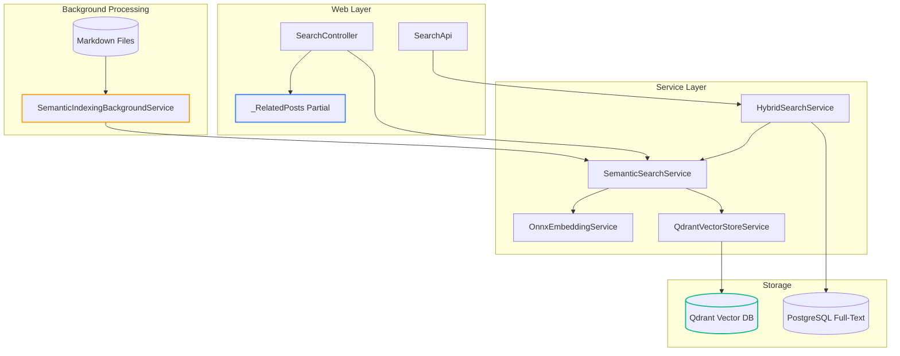
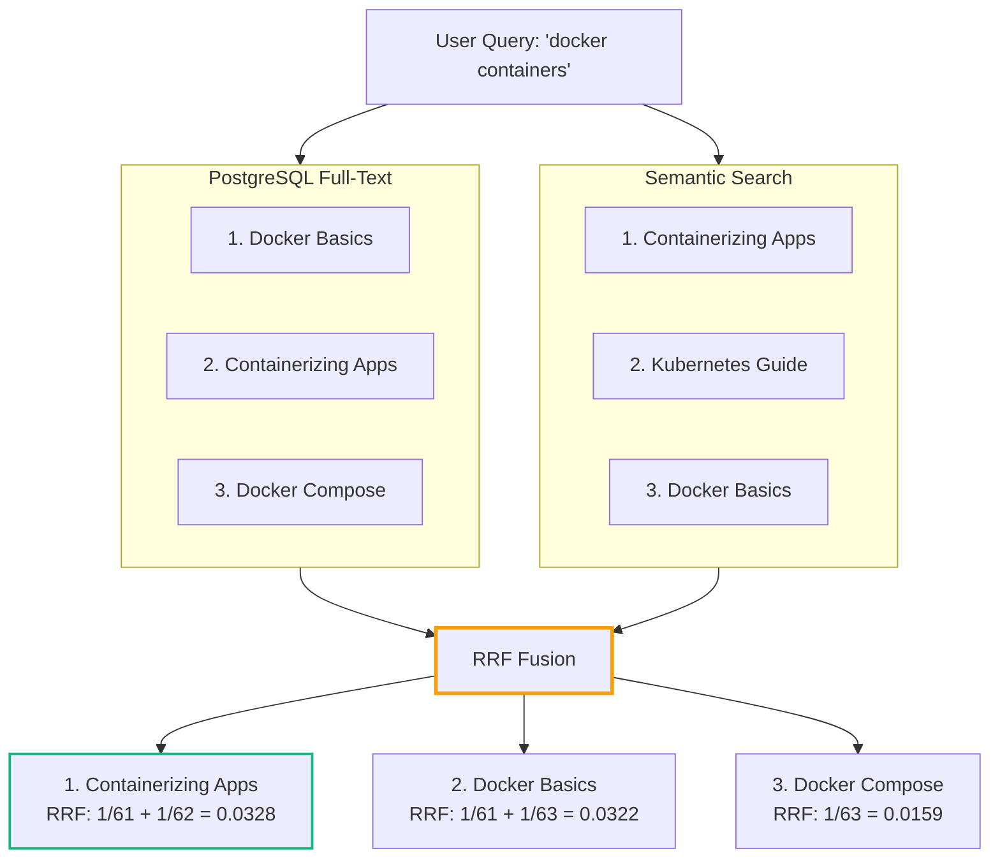

# Building a Local RAG System - Part 2: Blog Integration with HTMX and Background Services

<datetime class="hidden">2025-05-22T10:00</datetime>
<!-- category -- ASP.NET, Semantic Search, HTMX, Background Services, Qdrant, ONNX -->

## Introduction

In [Part 1](/blog/blogllm-indexing), we built a CLI tool for indexing markdown documents into Qdrant. Grand stuff - but it's no use sitting there gathering dust. Now we need to actually *use* it in our blog.

This part covers the practical integration: background services that keep your index fresh, HTMX-powered partials for related posts, hybrid search that combines semantic understanding with traditional full-text search, and all the controller plumbing to tie it together.

By the end, you'll have a "Related Posts" panel that actually understands what your content is *about*, not just which words appear in it.

[TOC]

## The Architecture

Here's how everything fits together in the main blog application:



## Project Structure

The semantic search integration lives in `Mostlylucid.SemanticSearch`:

```
Mostlylucid.SemanticSearch/
├── Config/
│   └── SemanticSearchConfig.cs
├── Models/
│   ├── BlogPostDocument.cs
│   └── SearchResult.cs
├── Services/
│   ├── IEmbeddingService.cs
│   ├── OnnxEmbeddingService.cs
│   ├── IVectorStoreService.cs
│   ├── QdrantVectorStoreService.cs
│   ├── ISemanticSearchService.cs
│   ├── SemanticSearchService.cs
│   ├── IHybridSearchService.cs
│   └── HybridSearchService.cs
└── Extensions/
    └── ServiceCollectionExtensions.cs
```

And the background service lives in `Mostlylucid.Services`:

```
Mostlylucid.Services/
└── SemanticSearch/
    └── SemanticIndexingBackgroundService.cs
```

## Configuration

First, let's set up the configuration. The `SemanticSearchConfig` class follows the POCO pattern used throughout the codebase:

```csharp
public class SemanticSearchConfig : IConfigSection
{
    public static string Section => "SemanticSearch";

    /// <summary>
    /// Enable or disable semantic search entirely
    /// </summary>
    public bool Enabled { get; set; } = false;

    /// <summary>
    /// Qdrant server URL (HTTP port, e.g., http://localhost:6333)
    /// </summary>
    public string QdrantUrl { get; set; } = "http://localhost:6333";

    /// <summary>
    /// Optional API keys for Qdrant (if secured)
    /// </summary>
    public string? ReadApiKey { get; set; }
    public string? WriteApiKey { get; set; }

    /// <summary>
    /// Collection name in Qdrant
    /// </summary>
    public string CollectionName { get; set; } = "blog_posts";

    /// <summary>
    /// Path to the ONNX embedding model
    /// </summary>
    public string EmbeddingModelPath { get; set; } = "models/all-MiniLM-L6-v2.onnx";

    /// <summary>
    /// Path to the BERT vocabulary file
    /// </summary>
    public string VocabPath { get; set; } = "models/vocab.txt";

    /// <summary>
    /// Embedding vector dimensions (384 for MiniLM)
    /// </summary>
    public int VectorSize { get; set; } = 384;

    /// <summary>
    /// Number of related posts to show
    /// </summary>
    public int RelatedPostsCount { get; set; } = 5;

    /// <summary>
    /// Minimum similarity score (0-1) for results
    /// </summary>
    public float MinimumSimilarityScore { get; set; } = 0.5f;

    /// <summary>
    /// Maximum search results to return
    /// </summary>
    public int SearchResultsCount { get; set; } = 10;
}
```

And in `appsettings.json`:

```json
{
  "SemanticSearch": {
    "Enabled": false,
    "QdrantUrl": "http://localhost:6333",
    "ReadApiKey": "",
    "WriteApiKey": "",
    "CollectionName": "blog_posts",
    "EmbeddingModelPath": "models/all-MiniLM-L6-v2.onnx",
    "VocabPath": "models/vocab.txt",
    "VectorSize": 384,
    "RelatedPostsCount": 5,
    "MinimumSimilarityScore": 0.5,
    "SearchResultsCount": 10
  }
}
```

Note it's disabled by default - you don't want the app crashing on startup if Qdrant isn't running!

## The Background Indexing Service

This is the beating heart of the integration. The `SemanticIndexingBackgroundService` runs as a hosted service, automatically indexing new and changed posts.

```csharp
public class SemanticIndexingBackgroundService : BackgroundService
{
    private readonly ILogger<SemanticIndexingBackgroundService> _logger;
    private readonly ISemanticSearchService _semanticSearchService;
    private readonly MarkdownRenderingService _markdownRenderingService;
    private readonly MarkdownConfig _markdownConfig;
    private readonly SemanticSearchConfig _semanticSearchConfig;

    // Re-index every hour to catch any changes
    private readonly TimeSpan _indexInterval = TimeSpan.FromHours(1);

    // Wait for other services to initialize first
    private readonly TimeSpan _startupDelay = TimeSpan.FromSeconds(30);

    public SemanticIndexingBackgroundService(
        ILogger<SemanticIndexingBackgroundService> logger,
        ISemanticSearchService semanticSearchService,
        MarkdownRenderingService markdownRenderingService,
        MarkdownConfig markdownConfig,
        SemanticSearchConfig semanticSearchConfig)
    {
        _logger = logger;
        _semanticSearchService = semanticSearchService;
        _markdownRenderingService = markdownRenderingService;
        _markdownConfig = markdownConfig;
        _semanticSearchConfig = semanticSearchConfig;
    }

    protected override async Task ExecuteAsync(CancellationToken stoppingToken)
    {
        // Bail out early if semantic search is disabled
        if (!_semanticSearchConfig.Enabled)
        {
            _logger.LogInformation(
                "Semantic search is disabled, indexing service will not run");
            return;
        }

        _logger.LogInformation("Semantic indexing background service starting...");

        // Give other services time to spin up
        await Task.Delay(_startupDelay, stoppingToken);

        // Initialize the Qdrant collection
        try
        {
            await _semanticSearchService.InitializeAsync(stoppingToken);
            _logger.LogInformation("Semantic search initialized successfully");
        }
        catch (Exception ex)
        {
            _logger.LogError(ex, "Failed to initialize semantic search service");
            return;
        }

        // Initial indexing
        await IndexAllMarkdownFilesAsync(stoppingToken);

        // Periodic re-indexing loop
        while (!stoppingToken.IsCancellationRequested)
        {
            try
            {
                await Task.Delay(_indexInterval, stoppingToken);
                await IndexAllMarkdownFilesAsync(stoppingToken);
            }
            catch (OperationCanceledException)
            {
                break;
            }
            catch (Exception ex)
            {
                _logger.LogError(ex, "Error during periodic indexing");
            }
        }

        _logger.LogInformation("Semantic indexing background service stopped");
    }
}
```

### Hash-Based Change Detection

The clever bit is that we don't re-index everything each time. We compute a SHA-256 hash of the content and only reindex if it's changed:

```csharp
private async Task IndexAllMarkdownFilesAsync(CancellationToken stoppingToken)
{
    var markdownPath = _markdownConfig.MarkdownPath;

    if (!Directory.Exists(markdownPath))
    {
        _logger.LogWarning("Markdown directory does not exist: {Path}", markdownPath);
        return;
    }

    // IMPORTANT: Only index top-level files, not drafts/translated subdirectories
    var markdownFiles = Directory.GetFiles(markdownPath, "*.md",
        SearchOption.TopDirectoryOnly);

    _logger.LogInformation("Found {Count} markdown files to index",
        markdownFiles.Length);

    var indexedCount = 0;
    var skippedCount = 0;
    var errorCount = 0;

    foreach (var filePath in markdownFiles)
    {
        if (stoppingToken.IsCancellationRequested)
            break;

        try
        {
            var result = await IndexMarkdownFileAsync(filePath, stoppingToken);
            if (result == IndexResult.Indexed)
                indexedCount++;
            else if (result == IndexResult.Skipped)
                skippedCount++;
        }
        catch (Exception ex)
        {
            errorCount++;
            _logger.LogError(ex, "Error indexing file: {FilePath}", filePath);
        }

        // Small delay to avoid hammering the embedding service
        await Task.Delay(100, stoppingToken);
    }

    _logger.LogInformation(
        "Indexing complete: {Indexed} indexed, {Skipped} skipped, {Errors} errors",
        indexedCount, skippedCount, errorCount);
}

private async Task<IndexResult> IndexMarkdownFileAsync(
    string filePath,
    CancellationToken stoppingToken)
{
    var fileName = Path.GetFileNameWithoutExtension(filePath);

    // Skip translated files (e.g., my-post.es.md)
    if (fileName.Contains('.'))
    {
        var parts = fileName.Split('.');
        if (parts.Length >= 2 && parts[^1].Length == 2)
        {
            return IndexResult.Skipped;
        }
    }

    var markdown = await File.ReadAllTextAsync(filePath, stoppingToken);
    var fileInfo = new FileInfo(filePath);

    // Use the existing markdown rendering service to parse
    var blogPost = _markdownRenderingService.GetPageFromMarkdown(
        markdown, fileInfo.LastWriteTimeUtc, filePath);

    // Skip hidden posts
    if (blogPost.IsHidden)
    {
        _logger.LogDebug("Skipping hidden post: {Slug}", blogPost.Slug);
        return IndexResult.Skipped;
    }

    // Compute content hash
    var contentHash = ComputeContentHash(blogPost.PlainTextContent);

    // Check if we need to reindex
    var needsReindex = await _semanticSearchService.NeedsReindexingAsync(
        blogPost.Slug,
        MarkdownBaseService.EnglishLanguage,
        contentHash,
        stoppingToken);

    if (!needsReindex)
    {
        _logger.LogDebug("Skipping unchanged post: {Slug}", blogPost.Slug);
        return IndexResult.Skipped;
    }

    // Create document for indexing
    var document = new BlogPostDocument
    {
        Id = $"{blogPost.Slug}_{MarkdownBaseService.EnglishLanguage}",
        Slug = blogPost.Slug,
        Title = blogPost.Title,
        Content = blogPost.PlainTextContent,
        Language = MarkdownBaseService.EnglishLanguage,
        Categories = blogPost.Categories.ToList(),
        PublishedDate = blogPost.PublishedDate,
        ContentHash = contentHash
    };

    await _semanticSearchService.IndexPostAsync(document, stoppingToken);
    _logger.LogInformation("Indexed post: {Slug}", blogPost.Slug);

    return IndexResult.Indexed;
}

private static string ComputeContentHash(string content)
{
    using var sha256 = SHA256.Create();
    var bytes = Encoding.UTF8.GetBytes(content);
    var hashBytes = sha256.ComputeHash(bytes);
    return Convert.ToBase64String(hashBytes);
}

private enum IndexResult
{
    Indexed,
    Skipped
}
```

### Registering the Background Service

The service is registered conditionally in `BlogSetup.cs`:

```csharp
// In BlogSetup.cs
public static void AddBlogServices(this IServiceCollection services, IConfiguration config)
{
    // ... other service registration ...

    // Add semantic search services
    services.AddSemanticSearch(config);

    // Only add the background service if semantic search is enabled
    var semanticConfig = config.GetSection(SemanticSearchConfig.Section)
        .Get<SemanticSearchConfig>();

    if (semanticConfig?.Enabled == true)
    {
        services.AddHostedService<SemanticIndexingBackgroundService>();
    }
}
```

## The HTMX Related Posts Partial

Now for the fun bit - showing related posts to readers. We use HTMX to load these asynchronously, so they don't slow down initial page load.

### The Partial View

First, the `_RelatedPosts.cshtml` partial. It's a collapsible panel using Alpine.js with smooth animations:

```cshtml
@model List<Mostlylucid.SemanticSearch.Models.SearchResult>

@if (Model != null && Model.Any())
{
    <div class="mt-6 mb-6 print:hidden" x-data="{ open: false }">
        <div class="border border-base-300 rounded-lg overflow-hidden
                    bg-gradient-to-r from-base-200/80 to-base-200/40 backdrop-blur-sm">
            @* Header - always visible *@
            <button @@click="open = !open"
                    type="button"
                    class="w-full flex items-center justify-between px-4 py-2.5
                           hover:bg-base-300/30 transition-all duration-200 group">
                <div class="flex items-center gap-2">
                    <i class='bx bx-brain text-xl text-secondary
                              group-hover:scale-110 transition-transform'></i>
                    <span class="font-medium text-sm">Related Posts</span>
                    <span class="badge badge-secondary badge-xs font-mono">
                        @Model.Count
                    </span>
                </div>
                <i class='bx bx-chevron-down text-xl transition-transform duration-300'
                   :class="open ? 'rotate-180' : ''"></i>
            </button>

            @* Collapsible content with CSS grid animation *@
            <div class="grid transition-all duration-300 ease-out"
                 :style="open ? 'grid-template-rows: 1fr' : 'grid-template-rows: 0fr'">
                <div class="overflow-hidden">
                    <div class="border-t border-base-300/50">
                        @foreach (var (post, index) in Model.Take(3).Select((p, i) => (p, i)))
                        {
                            <a hx-boost="true"
                               hx-target="#contentcontainer"
                               hx-swap="show:window:top"
                               asp-action="Show"
                               asp-controller="Blog"
                               asp-route-slug="@post.Slug"
                               asp-route-language="@post.Language"
                               class="flex items-center gap-3 px-4 py-2.5
                                      hover:bg-secondary/10 transition-all group/item
                                      @(index < Model.Take(3).Count() - 1 ?
                                        "border-b border-base-300/30" : "")">
                                @* Ranking number *@
                                <div class="w-6 h-6 rounded-full bg-secondary/20
                                            flex items-center justify-center shrink-0">
                                    <span class="text-xs font-bold text-secondary">
                                        @(index + 1)
                                    </span>
                                </div>

                                @* Post info *@
                                <div class="flex-1 min-w-0">
                                    <div class="text-sm font-medium truncate
                                                group-hover/item:text-secondary transition-colors">
                                        @post.Title
                                    </div>
                                    <div class="flex items-center gap-2 text-xs
                                                opacity-50 mt-0.5">
                                        <span>@post.PublishedDate.ToString("MMM d, yyyy")</span>
                                        @if (post.Categories?.Any() == true)
                                        {
                                            <span class="opacity-30">•</span>
                                            <span class="truncate max-w-[150px]">
                                                @string.Join(", ", post.Categories.Take(2))
                                            </span>
                                        }
                                    </div>
                                </div>

                                @* Similarity score bar *@
                                <div class="flex items-center gap-1.5 shrink-0
                                            opacity-60 group-hover/item:opacity-100">
                                    <div class="w-8 h-1.5 bg-base-300 rounded-full overflow-hidden">
                                        <div class="h-full bg-secondary rounded-full"
                                             style="width: @((post.Score * 100).ToString("F0"))%">
                                        </div>
                                    </div>
                                    <span class="text-[10px] font-mono w-7 text-right">
                                        @((post.Score * 100).ToString("F0"))%
                                    </span>
                                </div>
                            </a>
                        }
                    </div>
                </div>
            </div>
        </div>
    </div>
}
```

A few things to note here:

1. **`print:hidden`** - Don't show this when printing the page
2. **CSS Grid animation** - Using `grid-template-rows` for smooth height transitions (works better than `max-height`)
3. **`hx-boost="true"`** - HTMX-powered navigation for the links
4. **Similarity score bar** - Visual indicator of how related each post is

### Loading the Partial

In `_PostPartial.cshtml`, we load the related posts after a short delay:

```cshtml
@* Related Posts Section - Loaded via HTMX *@
<div class="print:hidden"
     hx-get="/search/related/@Model.Slug/@Model.Language"
     hx-trigger="load delay:300ms"
     hx-swap="innerHTML">
    @* Loading placeholder *@
    <div class="mt-6 mb-6">
        <div class="border border-base-300 rounded-lg overflow-hidden
                    bg-gradient-to-r from-base-200/80 to-base-200/40">
            <div class="flex items-center gap-2 px-4 py-2.5">
                <span class="loading loading-spinner loading-xs text-secondary"></span>
                <span class="text-sm opacity-60">Finding related posts...</span>
            </div>
        </div>
    </div>
</div>
```

The key attributes:

- **`hx-trigger="load delay:300ms"`** - Wait 300ms after page load before fetching
- **`hx-swap="innerHTML"`** - Replace the placeholder with the partial

This pattern means:
1. Blog post content loads immediately
2. After 300ms, HTMX fires off a request for related posts
3. The spinner shows while loading
4. Once loaded, the partial replaces the placeholder

## Controller Endpoints

The `SearchController` handles both standard search and semantic features:

```csharp
[Route("search")]
public class SearchController(
    BaseControllerService baseControllerService,
    BlogSearchService searchService,
    ISemanticSearchService semanticSearchService,
    ILogger<SearchController> logger)
    : BaseController(baseControllerService, logger)
{
    /// <summary>
    /// Semantic search endpoint
    /// </summary>
    [HttpGet]
    [Route("semantic")]
    [OutputCache(Duration = 3600, VaryByQueryKeys = new[] {"query", "limit"})]
    public async Task<IActionResult> SemanticSearch(string? query, int limit = 10)
    {
        if (string.IsNullOrWhiteSpace(query))
        {
            return BadRequest("Query cannot be empty");
        }

        var results = await semanticSearchService.SearchAsync(query, limit);

        if (Request.IsHtmx())
        {
            return PartialView("_SemanticSearchResults", results);
        }

        return Json(results);
    }

    /// <summary>
    /// Related posts endpoint - called via HTMX from blog posts
    /// </summary>
    [HttpGet]
    [Route("related/{slug}/{language}")]
    [OutputCache(Duration = 7200, VaryByRouteValueNames = new[] {"slug", "language"})]
    public async Task<IActionResult> RelatedPosts(
        string slug,
        string language,
        int limit = 5)
    {
        var results = await semanticSearchService.GetRelatedPostsAsync(
            slug, language, limit);

        if (Request.IsHtmx())
        {
            return PartialView("_RelatedPosts", results);
        }

        return Json(results);
    }
}
```

Notice the aggressive caching:
- **Semantic search**: 1 hour cache
- **Related posts**: 2 hour cache

This is safe because blog content doesn't change that often, and re-generating embeddings is computationally expensive.

## Hybrid Search: Best of Both Worlds

Here's where it gets interesting. Pure semantic search is great for understanding meaning, but sometimes folk search for exact phrases or technical terms. The solution? Combine both approaches using **Reciprocal Rank Fusion (RRF)**.

### What's RRF?

It's dead simple. For each search result from each source, we compute:

```
RRF score = 1 / (k + rank)
```

Where `k` is typically 60, and `rank` is the position (1, 2, 3...).

If a result appears in multiple sources, we add the scores together. This naturally boosts results that appear in both full-text and semantic search.



"Containerizing Apps" wins because it ranks highly in both search methods!

### The Implementation

The `SearchApi` controller implements hybrid search:

```csharp
[ApiController]
[Route("api")]
public class SearchApi(
    BlogSearchService searchService,
    UmamiBackgroundSender umamiBackgroundSender,
    SearchService indexService,
    ISemanticSearchService semanticSearchService,
    SemanticSearchConfig semanticSearchConfig) : ControllerBase
{
    private const int RrfConstant = 60;

    [HttpGet]
    [Route("search/{query}")]
    [OutputCache(Duration = 3600, VaryByQueryKeys = new[] { "query" })]
    public async Task<Results<JsonHttpResult<List<SearchResults>>, BadRequest<string>>>
        Search(string query)
    {
        using var activity = Log.Logger.StartActivity("Search {query}", query);
        try
        {
            var host = Request.Host.Value;
            List<SearchResults> output;

            // Use hybrid search if semantic search is enabled
            if (semanticSearchConfig.Enabled)
            {
                output = await HybridSearchAsync(query, host);
            }
            else
            {
                // Fallback to full-text only
                output = await FullTextSearchAsync(query, host);
            }

            // Track search event for analytics
            var encodedQuery = HttpUtility.UrlEncode(query);
            await umamiBackgroundSender.Track("searchEvent",
                new UmamiEventData { { "query", encodedQuery } });

            activity?.Complete();
            return TypedResults.Json(output);
        }
        catch (Exception e)
        {
            activity.Complete(LogEventLevel.Error, e);
            return TypedResults.BadRequest("Error in search");
        }
    }

    private async Task<List<SearchResults>> HybridSearchAsync(
        string query,
        string host)
    {
        // Run both searches in parallel
        var fullTextTask = GetFullTextResultsAsync(query);
        var semanticTask = semanticSearchService.SearchAsync(query, limit: 20);

        await Task.WhenAll(fullTextTask, semanticTask);

        var fullTextResults = await fullTextTask;
        var semanticResults = await semanticTask;

        // Apply Reciprocal Rank Fusion
        var rrfScores = new Dictionary<string, (double Score, string Title, string Slug)>();

        // Score full-text results
        for (int i = 0; i < fullTextResults.Count; i++)
        {
            var (title, slug) = fullTextResults[i];
            var key = slug.ToLowerInvariant();
            var rrfScore = 1.0 / (RrfConstant + i + 1);

            if (rrfScores.TryGetValue(key, out var existing))
            {
                rrfScores[key] = (existing.Score + rrfScore, title, slug);
            }
            else
            {
                rrfScores[key] = (rrfScore, title, slug);
            }
        }

        // Score semantic results
        for (int i = 0; i < semanticResults.Count; i++)
        {
            var result = semanticResults[i];
            var key = result.Slug.ToLowerInvariant();
            var rrfScore = 1.0 / (RrfConstant + i + 1);

            if (rrfScores.TryGetValue(key, out var existing))
            {
                rrfScores[key] = (existing.Score + rrfScore, existing.Title, existing.Slug);
            }
            else
            {
                rrfScores[key] = (rrfScore, result.Title, result.Slug);
            }
        }

        // Sort by combined score and return top 15
        return rrfScores.Values
            .OrderByDescending(x => x.Score)
            .Take(15)
            .Select(x => new SearchResults(
                x.Title.Trim(),
                x.Slug,
                Url.ActionLink("Show", "Blog", new { x.Slug }, "https", host)))
            .ToList();
    }

    private async Task<List<(string Title, string Slug)>> GetFullTextResultsAsync(
        string query)
    {
        // Single word = prefix search, multiple words = full query
        if (!query.Contains(' '))
            return await searchService.GetSearchResultForComplete(query);
        else
            return await searchService.GetSearchResultForQuery(query);
    }
}
```

### The HybridSearchService

For cleaner separation, there's also a dedicated `HybridSearchService`:

```csharp
public class HybridSearchService : IHybridSearchService
{
    private readonly ILogger<HybridSearchService> _logger;
    private readonly ISemanticSearchService _semanticSearchService;
    private const int RrfConstant = 60;

    public HybridSearchService(
        ILogger<HybridSearchService> logger,
        ISemanticSearchService semanticSearchService)
    {
        _logger = logger;
        _semanticSearchService = semanticSearchService;
    }

    public async Task<List<SearchResult>> SearchAsync(
        string query,
        string language = "en",
        int limit = 10,
        CancellationToken cancellationToken = default)
    {
        if (string.IsNullOrWhiteSpace(query))
            return new List<SearchResult>();

        try
        {
            // Get more results than needed for better fusion
            var semanticResults = await _semanticSearchService.SearchAsync(
                query,
                limit * 2,
                cancellationToken);

            // Filter by language
            var filteredResults = semanticResults
                .Where(r => r.Language == language)
                .ToList();

            // Apply RRF
            var fusedResults = ApplyReciprocalRankFusion(filteredResults);

            return fusedResults.Take(limit).ToList();
        }
        catch (Exception ex)
        {
            _logger.LogError(ex, "Hybrid search failed for '{Query}'", query);
            return new List<SearchResult>();
        }
    }

    private List<SearchResult> ApplyReciprocalRankFusion(
        List<SearchResult> semanticResults)
    {
        var rrfScores = new Dictionary<string, RrfScore>();

        for (int i = 0; i < semanticResults.Count; i++)
        {
            var result = semanticResults[i];
            var key = $"{result.Slug}_{result.Language}";

            if (!rrfScores.ContainsKey(key))
            {
                rrfScores[key] = new RrfScore
                {
                    Result = result,
                    SemanticRank = i + 1
                };
            }

            var rrfScore = 1.0 / (RrfConstant + i + 1);
            rrfScores[key].Score += rrfScore;
            rrfScores[key].SemanticScore = result.Score;
        }

        return rrfScores.Values
            .OrderByDescending(x => x.Score)
            .Select(x =>
            {
                x.Result.Score = (float)x.Score;
                return x.Result;
            })
            .ToList();
    }

    private class RrfScore
    {
        public required SearchResult Result { get; set; }
        public double Score { get; set; }
        public int? SemanticRank { get; set; }
        public double SemanticScore { get; set; }
    }
}
```

## Dependency Injection Setup

The `ServiceCollectionExtensions` wires everything up:

```csharp
public static class ServiceCollectionExtensions
{
    public static void AddSemanticSearch(
        this IServiceCollection services,
        IConfiguration configuration)
    {
        // Bind configuration using POCO pattern
        services.ConfigurePOCO<SemanticSearchConfig>(
            configuration.GetSection(SemanticSearchConfig.Section));

        // Register services as singletons (ONNX session is expensive to create)
        services.AddSingleton<IEmbeddingService, OnnxEmbeddingService>();
        services.AddSingleton<IVectorStoreService, QdrantVectorStoreService>();
        services.AddSingleton<ISemanticSearchService, SemanticSearchService>();
        services.AddSingleton<IHybridSearchService, HybridSearchService>();
    }
}
```

We use singletons here because:
1. The ONNX session is expensive to create
2. The Qdrant client maintains a connection
3. We want to reuse these across requests

## The SemanticSearchService

This orchestrates the embedding and vector store services:

```csharp
public class SemanticSearchService : ISemanticSearchService
{
    private readonly ILogger<SemanticSearchService> _logger;
    private readonly SemanticSearchConfig _config;
    private readonly IEmbeddingService _embeddingService;
    private readonly IVectorStoreService _vectorStoreService;

    public SemanticSearchService(
        ILogger<SemanticSearchService> logger,
        SemanticSearchConfig config,
        IEmbeddingService embeddingService,
        IVectorStoreService vectorStoreService)
    {
        _logger = logger;
        _config = config;
        _embeddingService = embeddingService;
        _vectorStoreService = vectorStoreService;
    }

    public async Task InitializeAsync(CancellationToken cancellationToken = default)
    {
        if (!_config.Enabled) return;

        await _vectorStoreService.InitializeCollectionAsync(cancellationToken);
    }

    public async Task IndexPostAsync(
        BlogPostDocument document,
        CancellationToken cancellationToken = default)
    {
        if (!_config.Enabled) return;

        try
        {
            // Prepare text: emphasize title by including it twice
            var textToEmbed = $"{document.Title}. {document.Title}. {document.Content}";

            // Truncate for embedding model limits
            const int maxLength = 2000;
            if (textToEmbed.Length > maxLength)
            {
                textToEmbed = textToEmbed[..maxLength];
            }

            // Generate embedding
            var embedding = await _embeddingService.GenerateEmbeddingAsync(
                textToEmbed, cancellationToken);

            // Store in vector database
            await _vectorStoreService.IndexDocumentAsync(
                document, embedding, cancellationToken);

            _logger.LogInformation("Indexed post {Slug}", document.Slug);
        }
        catch (Exception ex)
        {
            _logger.LogError(ex, "Failed to index post {Slug}", document.Slug);
        }
    }

    public async Task<List<SearchResult>> SearchAsync(
        string query,
        int limit = 10,
        CancellationToken cancellationToken = default)
    {
        if (!_config.Enabled || string.IsNullOrWhiteSpace(query))
            return new List<SearchResult>();

        try
        {
            var queryEmbedding = await _embeddingService.GenerateEmbeddingAsync(
                query, cancellationToken);

            var results = await _vectorStoreService.SearchAsync(
                queryEmbedding,
                Math.Min(limit, _config.SearchResultsCount),
                _config.MinimumSimilarityScore,
                cancellationToken);

            return results;
        }
        catch (Exception ex)
        {
            _logger.LogError(ex, "Search failed for '{Query}'", query);
            return new List<SearchResult>();
        }
    }

    public async Task<List<SearchResult>> GetRelatedPostsAsync(
        string slug,
        string language,
        int limit = 5,
        CancellationToken cancellationToken = default)
    {
        if (!_config.Enabled)
            return new List<SearchResult>();

        try
        {
            return await _vectorStoreService.FindRelatedPostsAsync(
                slug,
                language,
                Math.Min(limit, _config.RelatedPostsCount),
                cancellationToken);
        }
        catch (Exception ex)
        {
            _logger.LogError(ex,
                "Failed to get related posts for {Slug}", slug);
            return new List<SearchResult>();
        }
    }

    public async Task<bool> NeedsReindexingAsync(
        string slug,
        string language,
        string contentHash,
        CancellationToken cancellationToken = default)
    {
        if (!_config.Enabled) return false;

        return await _vectorStoreService.NeedsReindexingAsync(
            slug, language, contentHash, cancellationToken);
    }
}
```

## Running the Full Setup

To get everything working:

### 1. Start Qdrant

```bash
docker run -d \
  --name qdrant \
  -p 6333:6333 \
  -p 6334:6334 \
  -v qdrant_storage:/qdrant/storage \
  qdrant/qdrant
```

### 2. Download the Embedding Model

```bash
# Create models directory
mkdir -p Mostlylucid/models

# Download all-MiniLM-L6-v2 ONNX model
wget -O Mostlylucid/models/all-MiniLM-L6-v2.onnx \
  https://huggingface.co/sentence-transformers/all-MiniLM-L6-v2/resolve/main/onnx/model.onnx

# Download vocabulary
wget -O Mostlylucid/models/vocab.txt \
  https://huggingface.co/sentence-transformers/all-MiniLM-L6-v2/resolve/main/vocab.txt
```

### 3. Enable Semantic Search

Update `appsettings.json`:

```json
{
  "SemanticSearch": {
    "Enabled": true,
    "QdrantUrl": "http://localhost:6333"
  }
}
```

### 4. Run the Application

```bash
cd Mostlylucid
dotnet run
```

The background service will:
1. Wait 30 seconds for startup
2. Initialize the Qdrant collection
3. Index all markdown files in the `Markdown/` directory
4. Re-check for changes every hour

## Performance Considerations

A few things to keep in mind:

### Embedding Generation
- ONNX inference takes ~50-100ms per document on CPU
- The background service adds 100ms delays between documents
- Use the `SemaphoreSlim` pattern in the embedding service for thread safety

### Caching
- Related posts are cached for 2 hours via `OutputCache`
- Search results are cached for 1 hour
- The Qdrant client maintains persistent connections

### Memory
- The ONNX runtime loads the model into memory (~90MB)
- Keep the model loaded as a singleton
- Each 384-dimensional vector takes ~1.5KB

## Troubleshooting

### "Model not found"

Check the model path in config matches where you downloaded it:
```bash
ls -la Mostlylucid/models/
```

### "Connection refused to Qdrant"

Make sure Qdrant is running:
```bash
docker ps | grep qdrant
curl http://localhost:6333/health
```

### Low Similarity Scores

If everything returns scores < 0.3:
- Check you're using the same embedding model for indexing and search
- Try lowering `MinimumSimilarityScore` temporarily
- Inspect what's actually being indexed with the CLI tool

### No Related Posts Showing

1. Check semantic search is enabled in config
2. Verify the background service is running (check logs)
3. Make sure the post exists in the vector store
4. Check the browser network tab for HTMX requests

## Summary

We've covered a lot of ground here:

| Component | Purpose |
|-----------|---------|
| SemanticIndexingBackgroundService | Automatic indexing with change detection |
| _RelatedPosts.cshtml | HTMX partial with Alpine.js collapse |
| SearchController | Endpoints for search and related posts |
| SearchApi | Hybrid search with RRF fusion |
| HybridSearchService | Clean RRF implementation |

The key principles:

1. **Lazy loading** - Load related posts after page content
2. **Aggressive caching** - Embeddings are expensive, cache results
3. **Graceful degradation** - Works fine if semantic search is disabled
4. **Hash-based change detection** - Don't reindex unchanged content
5. **Hybrid search** - Combine keyword and semantic for best results

For the indexing pipeline that populates this system, see [Part 1: Document Indexing](/blog/blogllm-indexing).

## Related Articles

- [Semantic Search with ONNX and Qdrant](/blog/semantic-search-with-onnx-and-qdrant) - Deep dive into the embedding service
- [Full-Text Search in PostgreSQL](/blog/textsearchingpt1) - The other half of hybrid search
- [HTMX for ASP.NET Core Developers](/blog/htmx-with-aspnet-core) - More HTMX patterns

## Resources

- [Qdrant .NET Client](https://github.com/qdrant/qdrant-dotnet)
- [ONNX Runtime Documentation](https://onnxruntime.ai/docs/)
- [all-MiniLM-L6-v2 Model](https://huggingface.co/sentence-transformers/all-MiniLM-L6-v2)
- [Reciprocal Rank Fusion Paper](https://plg.uwaterloo.ca/~gvcormac/cormacksigir09-rrf.pdf)
- [HTMX Documentation](https://htmx.org/docs/)
