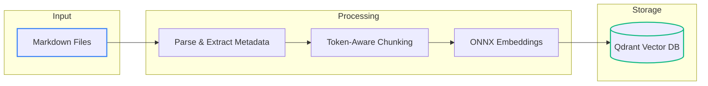

# Building a Local RAG System - Part 1: Document Indexing with ONNX and Qdrant

<datetime class="hidden">2025-05-22T09:00</datetime>
<!-- category -- ASP.NET, Semantic Search, ONNX, Qdrant, Machine Learning, RAG, LLM -->

## Introduction

Right, here's the thing - I've been banging on about semantic search and vector databases for a wee while now (see my [ONNX and Qdrant article](/blog/semantic-search-with-onnx-and-qdrant)), but I wanted to take it a step further. What if we could build a full RAG (Retrieval Augmented Generation) system that runs entirely locally, no expensive API calls, no GPU required?

In this two-part series, I'll show you how I built `mostlylucid.blogllm` - a CLI tool that indexes your markdown content into a vector database, ready for semantic search and LLM-powered question answering.

**This is Part 1: The Indexing Pipeline**

In [Part 2](/blog/blogllm-implementation), we'll cover how to integrate this into an ASP.NET Core blog with background services, HTMX partials, and hybrid search.

[TOC]

## What We're Building

Let me paint the picture. We want a system that:

1. Parses markdown files and extracts meaningful content
2. Splits documents into intelligent chunks (not just arbitrary byte limits)
3. Generates embeddings using CPU-friendly ONNX models
4. Stores everything in Qdrant for blazingly fast similarity search



## Project Structure

The `mostlylucid.blogllm` project is a standalone .NET 9.0 CLI application:

```
mostlylucid.blogllm/
├── Models/
│   ├── BlogDocument.cs       # Parsed document with metadata
│   ├── ContentChunk.cs       # Chunked content with embeddings
│   └── SearchResult.cs       # Vector search results
├── Services/
│   ├── MarkdownParserService.cs    # Markdown parsing + metadata extraction
│   ├── ChunkingService.cs          # Token-aware document chunking
│   ├── EmbeddingService.cs         # ONNX-based embedding generation
│   └── VectorStoreService.cs       # Qdrant client wrapper
├── Program.cs                # CLI interface with Spectre.Console
└── appsettings.json
```

## The Document Model

First, let's define what a parsed blog document looks like. This captures all the metadata we extract from markdown files:

```csharp
public class BlogDocument
{
    public required string FilePath { get; set; }
    public required string Slug { get; set; }
    public required string Title { get; set; }
    public List<string> Categories { get; set; } = new();
    public DateTime PublishedDate { get; set; }
    public string Language { get; set; } = "en";
    public required string MarkdownContent { get; set; }
    public required string PlainTextContent { get; set; }
    public int WordCount { get; set; }
    public required string ContentHash { get; set; }
    public List<DocumentSection> Sections { get; set; } = new();
}

public class DocumentSection
{
    public required string Heading { get; set; }
    public int Level { get; set; }
    public required string Content { get; set; }
    public List<CodeBlock> CodeBlocks { get; set; } = new();
}

public class CodeBlock
{
    public required string Language { get; set; }
    public required string Code { get; set; }
}
```

The key insight here is that we preserve the *structure* of the document - headings, sections, code blocks. This is crucial for intelligent chunking later.

## Markdown Parsing

The `MarkdownParserService` does the heavy lifting of extracting metadata from markdown files. In my blog, I use HTML comments for categories and hidden elements for dates:

```csharp
public class MarkdownParserService
{
    private readonly IServiceProvider? _serviceProvider;
    private readonly ILogger? _logger;

    public BlogDocument ParseFile(string filePath)
    {
        var markdown = File.ReadAllText(filePath);
        var fileName = Path.GetFileNameWithoutExtension(filePath);

        // Extract language from filename (e.g., my-post.es.md -> "es")
        var language = "en";
        if (fileName.Contains('.'))
        {
            var parts = fileName.Split('.');
            if (parts.Length >= 2 && parts[^1].Length == 2)
            {
                language = parts[^1];
                fileName = string.Join('.', parts[..^1]);
            }
        }

        // Parse metadata from markdown
        var title = ExtractTitle(markdown);
        var categories = ExtractCategories(markdown);
        var publishedDate = ExtractPublishedDate(markdown);

        // Convert to plain text for embedding
        var plainText = ConvertToPlainText(markdown);

        // Extract document structure
        var sections = ExtractSections(markdown);

        // Compute content hash for change detection
        using var sha256 = SHA256.Create();
        var hashBytes = sha256.ComputeHash(Encoding.UTF8.GetBytes(plainText));
        var contentHash = Convert.ToBase64String(hashBytes);

        return new BlogDocument
        {
            FilePath = filePath,
            Slug = fileName,
            Title = title,
            Categories = categories,
            PublishedDate = publishedDate,
            Language = language,
            MarkdownContent = markdown,
            PlainTextContent = plainText,
            WordCount = plainText.Split(' ', StringSplitOptions.RemoveEmptyEntries).Length,
            ContentHash = contentHash,
            Sections = sections
        };
    }

    private string ExtractTitle(string markdown)
    {
        // First H1 heading is the title
        var match = Regex.Match(markdown, @"^#\s+(.+)$", RegexOptions.Multiline);
        return match.Success ? match.Groups[1].Value.Trim() : "Untitled";
    }

    private List<string> ExtractCategories(string markdown)
    {
        // Categories from HTML comment: <!-- category -- Cat1, Cat2 -->
        var match = Regex.Match(markdown, @"<!--\s*category\s*--\s*(.+?)\s*-->",
            RegexOptions.IgnoreCase);

        if (match.Success)
        {
            return match.Groups[1].Value
                .Split(',')
                .Select(c => c.Trim())
                .Where(c => !string.IsNullOrEmpty(c))
                .ToList();
        }
        return new List<string>();
    }

    private DateTime ExtractPublishedDate(string markdown)
    {
        // Date from hidden datetime element
        var match = Regex.Match(markdown,
            @"<datetime[^>]*class=""hidden""[^>]*>([^<]+)</datetime>");

        if (match.Success && DateTime.TryParse(match.Groups[1].Value, out var date))
        {
            return date;
        }
        return DateTime.UtcNow;
    }
}
```

### Why Extract Structure?

Here's a wee secret - if you just chuck your entire document at an embedding model, you lose all that lovely structure. By extracting sections and headings, we can:

1. Create context-aware chunks that respect document boundaries
2. Include heading hierarchy in the embedding (so the model knows *where* in the document this content sits)
3. Preserve code blocks separately (they embed poorly when mixed with prose)

## Token-Aware Chunking

This is where the magic happens. Most folk just split text by character count, but that's daft - you end up cutting sentences in half and breaking semantic meaning.

Instead, we use **token-aware chunking** with the TikToken library:

```csharp
public class ChunkingService
{
    private readonly TikToken _tokenizer;
    private readonly int _maxChunkTokens;
    private readonly int _minChunkTokens;
    private readonly int _overlapTokens;

    public ChunkingService(
        string tokenizerPath,
        int maxChunkTokens = 512,
        int minChunkTokens = 100,
        int overlapTokens = 50)
    {
        // Load tokenizer - using cl100k_base for BGE models
        _tokenizer = TikToken.GetEncoding("cl100k_base");
        _maxChunkTokens = maxChunkTokens;
        _minChunkTokens = minChunkTokens;
        _overlapTokens = overlapTokens;
    }

    public List<ContentChunk> ChunkDocument(BlogDocument document)
    {
        var chunks = new List<ContentChunk>();
        int chunkIndex = 0;

        // Track heading hierarchy for context
        var headingStack = new Stack<string>();
        headingStack.Push(document.Title);

        foreach (var section in document.Sections)
        {
            UpdateHeadingStack(headingStack, section.Level, section.Heading);

            var sectionText = BuildSectionText(section);
            var tokenCount = CountTokens(sectionText);

            if (tokenCount <= _maxChunkTokens)
            {
                // Section fits in one chunk - lovely!
                chunks.Add(CreateChunk(document, section, sectionText,
                    headingStack, chunkIndex++));
            }
            else
            {
                // Section too big - split with overlap
                var subChunks = SplitSection(document, section,
                    headingStack, ref chunkIndex);
                chunks.AddRange(subChunks);
            }
        }

        return chunks;
    }

    public int CountTokens(string text)
    {
        var encoded = _tokenizer.Encode(text);
        return encoded.Count;
    }
}
```

### The Overlap Strategy

When we split a large section, we use **sliding window overlap** - the end of each chunk overlaps with the beginning of the next. This preserves context across chunk boundaries:

```csharp
private List<ContentChunk> SplitSection(
    BlogDocument document,
    DocumentSection section,
    Stack<string> headingStack,
    ref int chunkIndex)
{
    var chunks = new List<ContentChunk>();
    var paragraphs = section.Content.Split("\n\n", StringSplitOptions.RemoveEmptyEntries);

    var currentText = new StringBuilder();
    var currentTokens = 0;
    string? previousText = null;

    foreach (var paragraph in paragraphs)
    {
        var paragraphTokens = CountTokens(paragraph);

        // Time to flush current chunk?
        if (currentTokens + paragraphTokens > _maxChunkTokens &&
            currentTokens > _minChunkTokens)
        {
            var chunkText = $"## {section.Heading}\n\n" + currentText.ToString();

            chunks.Add(new ContentChunk
            {
                DocumentSlug = document.Slug,
                DocumentTitle = document.Title,
                ChunkIndex = chunkIndex++,
                Text = chunkText.Trim(),
                Headings = headingStack.Reverse().ToArray(),
                SectionHeading = section.Heading,
                Categories = document.Categories,
                PublishedDate = document.PublishedDate,
                Language = document.Language,
                TokenCount = currentTokens
            });

            // Get overlap from last sentences
            previousText = GetLastSentences(currentText.ToString(), _overlapTokens);
            currentText.Clear();

            if (!string.IsNullOrWhiteSpace(previousText))
            {
                currentText.AppendLine(previousText);
                currentTokens = CountTokens(previousText);
            }
            else
            {
                currentTokens = 0;
            }
        }

        currentText.AppendLine(paragraph);
        currentText.AppendLine();
        currentTokens += paragraphTokens;
    }

    // Don't forget the final chunk!
    if (currentTokens > 0)
    {
        var chunkText = $"## {section.Heading}\n\n" + currentText.ToString();
        chunks.Add(new ContentChunk
        {
            DocumentSlug = document.Slug,
            DocumentTitle = document.Title,
            ChunkIndex = chunkIndex++,
            Text = chunkText.Trim(),
            Headings = headingStack.Reverse().ToArray(),
            SectionHeading = section.Heading,
            Categories = document.Categories,
            PublishedDate = document.PublishedDate,
            Language = document.Language,
            TokenCount = currentTokens
        });
    }

    return chunks;
}

private string GetLastSentences(string text, int maxTokens)
{
    var sentences = text.Split('.', StringSplitOptions.RemoveEmptyEntries)
        .Reverse()
        .ToArray();
    var overlap = new StringBuilder();
    int tokens = 0;

    foreach (var sentence in sentences)
    {
        var sentenceTokens = CountTokens(sentence);
        if (tokens + sentenceTokens > maxTokens) break;

        overlap.Insert(0, sentence + ".");
        tokens += sentenceTokens;
    }

    return overlap.ToString().Trim();
}
```

### The ContentChunk Model

Each chunk carries rich metadata for search and retrieval:

```csharp
public class ContentChunk
{
    public string ChunkId => $"{DocumentSlug}_{ChunkIndex}";
    public required string DocumentSlug { get; set; }
    public required string DocumentTitle { get; set; }
    public int ChunkIndex { get; set; }
    public required string Text { get; set; }
    public string[] Headings { get; set; } = Array.Empty<string>();
    public string? SectionHeading { get; set; }
    public List<string> Categories { get; set; } = new();
    public DateTime PublishedDate { get; set; }
    public string Language { get; set; } = "en";
    public int TokenCount { get; set; }

    // The embedding vector - populated by EmbeddingService
    public float[]? Embedding { get; set; }
}
```

## ONNX Embeddings

Now for the clever bit - generating embeddings without a GPU. We use the BGE-small-en-v1.5 model converted to ONNX format:

```csharp
public class EmbeddingService : IDisposable
{
    private readonly InferenceSession _session;
    private readonly TikToken _tokenizer;
    private readonly int _dimensions;
    private const int MaxSequenceLength = 512;

    public EmbeddingService(
        string modelPath,
        string tokenizerPath,
        int dimensions = 384,
        bool useGpu = false)
    {
        _dimensions = dimensions;
        _tokenizer = TikToken.GetEncoding("cl100k_base");

        var sessionOptions = new SessionOptions
        {
            ExecutionMode = ExecutionMode.ORT_SEQUENTIAL,
            GraphOptimizationLevel = GraphOptimizationLevel.ORT_ENABLE_ALL
        };

        // Optional GPU acceleration
        if (useGpu)
        {
            sessionOptions.AppendExecutionProvider_CUDA();
        }

        _session = new InferenceSession(modelPath, sessionOptions);
    }

    public float[] GenerateEmbedding(string text)
    {
        // Tokenize input
        var tokens = _tokenizer.Encode(text);
        if (tokens.Count > MaxSequenceLength)
        {
            tokens = tokens.Take(MaxSequenceLength).ToList();
        }

        // Create input tensors
        var inputIds = CreateInputTensor(tokens);
        var attentionMask = CreateAttentionMask(tokens.Count);

        var inputs = new List<NamedOnnxValue>
        {
            NamedOnnxValue.CreateFromTensor("input_ids", inputIds),
            NamedOnnxValue.CreateFromTensor("attention_mask", attentionMask)
        };

        // Run inference
        using var results = _session.Run(inputs);
        var output = results.First().AsTensor<float>();

        // Mean pooling over sequence length
        var embedding = MeanPool(output, tokens.Count);

        // L2 normalize
        return NormalizeVector(embedding);
    }

    private float[] MeanPool(Tensor<float> output, int sequenceLength)
    {
        var embedding = new float[_dimensions];

        for (int d = 0; d < _dimensions; d++)
        {
            float sum = 0;
            for (int s = 0; s < sequenceLength; s++)
            {
                sum += output[0, s, d];
            }
            embedding[d] = sum / sequenceLength;
        }

        return embedding;
    }

    private float[] NormalizeVector(float[] vector)
    {
        var sumOfSquares = vector.Sum(v => v * v);
        var magnitude = MathF.Sqrt(sumOfSquares);

        if (magnitude > 0)
        {
            for (int i = 0; i < vector.Length; i++)
            {
                vector[i] /= magnitude;
            }
        }

        return vector;
    }

    public async Task GenerateEmbeddingsAsync(
        List<ContentChunk> chunks,
        IProgress<(int current, int total)>? progress = null)
    {
        for (int i = 0; i < chunks.Count; i++)
        {
            chunks[i].Embedding = GenerateEmbedding(chunks[i].Text);
            progress?.Report((i + 1, chunks.Count));

            // Yield to prevent blocking
            if (i % 10 == 0)
            {
                await Task.Yield();
            }
        }
    }

    public void Dispose()
    {
        _session?.Dispose();
    }
}
```

### Why BGE-small?

There are loads of embedding models out there. I chose BGE-small-en-v1.5 because:

- **Small but mighty**: 384 dimensions, ~33MB model size
- **CPU-friendly**: Fast inference without GPU
- **English-optimized**: Perfect for technical blog content
- **Well-documented**: Easy to convert to ONNX

## Vector Storage with Qdrant

Finally, we store everything in Qdrant. This service handles collection management and batch upserts:

```csharp
public class VectorStoreService
{
    private readonly QdrantClient _client;
    private readonly string _collectionName;

    public VectorStoreService(string host, int port, string collectionName)
    {
        _client = new QdrantClient(host, port);
        _collectionName = collectionName;
    }

    public async Task<bool> CollectionExistsAsync()
    {
        var collections = await _client.ListCollectionsAsync();
        return collections.Any(c => c.Name == _collectionName);
    }

    public async Task CreateCollectionAsync(ulong vectorSize)
    {
        await _client.CreateCollectionAsync(
            collectionName: _collectionName,
            vectorsConfig: new VectorParams
            {
                Size = vectorSize,
                Distance = Distance.Cosine
            }
        );
    }

    public async Task UpsertChunksAsync(
        List<ContentChunk> chunks,
        IProgress<(int current, int total)>? progress = null)
    {
        const int batchSize = 100;
        var batches = chunks.Chunk(batchSize).ToList();
        int processed = 0;

        foreach (var batch in batches)
        {
            var points = batch.Select(chunk => new PointStruct
            {
                Id = new PointId { Uuid = Guid.NewGuid().ToString() },
                Vectors = chunk.Embedding!,
                Payload =
                {
                    ["chunk_id"] = chunk.ChunkId,
                    ["document_slug"] = chunk.DocumentSlug,
                    ["document_title"] = chunk.DocumentTitle,
                    ["chunk_index"] = chunk.ChunkIndex,
                    ["text"] = chunk.Text,
                    ["section_heading"] = chunk.SectionHeading ?? "",
                    ["headings"] = chunk.Headings,
                    ["categories"] = chunk.Categories.ToArray(),
                    ["published_date"] = chunk.PublishedDate.ToString("O"),
                    ["language"] = chunk.Language,
                    ["token_count"] = chunk.TokenCount
                }
            }).ToList();

            await _client.UpsertAsync(_collectionName, points);

            processed += batch.Length;
            progress?.Report((processed, chunks.Count));
        }
    }

    public async Task<List<SearchResult>> SearchAsync(
        float[] queryEmbedding,
        int limit = 10,
        float scoreThreshold = 0.7f,
        string? languageFilter = null)
    {
        Filter? filter = null;
        if (!string.IsNullOrEmpty(languageFilter))
        {
            filter = new Filter
            {
                Must =
                {
                    new Condition
                    {
                        Field = new FieldCondition
                        {
                            Key = "language",
                            Match = new Match { Keyword = languageFilter }
                        }
                    }
                }
            };
        }

        var results = await _client.SearchAsync(
            collectionName: _collectionName,
            vector: queryEmbedding,
            limit: (ulong)limit,
            scoreThreshold: scoreThreshold,
            filter: filter
        );

        return results.Select(r => new SearchResult
        {
            ChunkId = r.Payload["chunk_id"].StringValue,
            DocumentSlug = r.Payload["document_slug"].StringValue,
            DocumentTitle = r.Payload["document_title"].StringValue,
            Text = r.Payload["text"].StringValue,
            SectionHeading = r.Payload["section_heading"].StringValue,
            Categories = r.Payload["categories"].ListValue.Values
                .Select(v => v.StringValue).ToList(),
            Language = r.Payload["language"].StringValue,
            Score = r.Score
        }).ToList();
    }
}
```

## The CLI Interface

The whole thing is wrapped in a nice CLI using Spectre.Console:

```csharp
static async Task IngestDocuments()
{
    var path = AnsiConsole.Ask<string>("[yellow]Enter path to markdown file or directory:[/]");

    if (!File.Exists(path) && !Directory.Exists(path))
    {
        AnsiConsole.MarkupLine("[red]Path does not exist![/]");
        return;
    }

    var files = File.Exists(path)
        ? new[] { path }
        : Directory.GetFiles(path, "*.md", SearchOption.AllDirectories);

    AnsiConsole.MarkupLine($"[green]Found {files.Length} markdown file(s)[/]");

    await AnsiConsole.Progress()
        .Columns(new ProgressColumn[]
        {
            new TaskDescriptionColumn(),
            new ProgressBarColumn(),
            new PercentageColumn(),
            new SpinnerColumn(),
        })
        .StartAsync(async ctx =>
        {
            // Initialize services
            var parser = new MarkdownParserService(_serviceProvider, logger);
            var chunker = new ChunkingService(_tokenizerPath,
                _maxChunkTokens, _minChunkTokens, _overlapTokens);
            using var embedder = new EmbeddingService(_modelPath,
                _tokenizerPath, _dimensions, _useGpu);
            var vectorStore = new VectorStoreService(_qdrantHost,
                _qdrantPort, _collectionName);

            // Parse -> Chunk -> Embed -> Store
            var parseTask = ctx.AddTask("[green]Parsing documents...[/]");
            var documents = files.Select(f => parser.ParseFile(f)).ToList();
            parseTask.Increment(100);

            var chunkTask = ctx.AddTask("[green]Chunking documents...[/]");
            var allChunks = documents.SelectMany(d =>
                chunker.ChunkDocument(d)).ToList();
            chunkTask.Increment(100);

            var embedTask = ctx.AddTask("[green]Generating embeddings...[/]");
            await embedder.GenerateEmbeddingsAsync(allChunks,
                new Progress<(int c, int t)>(p =>
                    embedTask.Value = (p.c * 100.0) / p.t));

            var uploadTask = ctx.AddTask("[green]Uploading to Qdrant...[/]");
            await vectorStore.UpsertChunksAsync(allChunks,
                new Progress<(int c, int t)>(p =>
                    uploadTask.Value = (p.c * 100.0) / p.t));
        });
}
```

## Configuration

All settings are configurable via `appsettings.json`:

```json
{
  "BlogRag": {
    "EmbeddingModel": {
      "ModelPath": "./models/bge-small-en-v1.5-onnx/model.onnx",
      "TokenizerPath": "./models/bge-small-en-v1.5-onnx/tokenizer.json",
      "Dimensions": 384,
      "UseGpu": false
    },
    "VectorStore": {
      "Host": "localhost",
      "Port": 6334,
      "CollectionName": "blog_knowledge_base",
      "ApiKey": ""
    },
    "Chunking": {
      "MaxChunkTokens": 512,
      "MinChunkTokens": 100,
      "OverlapTokens": 50
    }
  }
}
```

## Running the Indexer

Start Qdrant first:

```bash
docker run -p 6333:6333 -p 6334:6334 \
  -v qdrant_storage:/qdrant/storage \
  qdrant/qdrant
```

Then run the CLI:

```bash
cd mostlylucid.blogllm
dotnet run
```

You'll get a bonny wee menu:

```
 ███╗   ███╗ ██████╗ ███████╗████████╗██╗  ██╗   ██╗██╗     ██╗   ██╗ ██████╗██╗██████╗
 ████╗ ████║██╔═══██╗██╔════╝╚══██╔══╝██║  ╚██╗ ██╔╝██║     ██║   ██║██╔════╝██║██╔══██╗
 ██╔████╔██║██║   ██║███████╗   ██║   ██║   ╚████╔╝ ██║     ██║   ██║██║     ██║██║  ██║
 ██║╚██╔╝██║██║   ██║╚════██║   ██║   ██║    ╚██╔╝  ██║     ██║   ██║██║     ██║██║  ██║
 ██║ ╚═╝ ██║╚██████╔╝███████║   ██║   ███████╗██║   ███████╗╚██████╔╝╚██████╗██║██████╔╝
 ╚═╝     ╚═╝ ╚═════╝ ╚══════╝   ╚═╝   ╚══════╝╚═╝   ╚══════╝ ╚═════╝  ╚═════╝╚═╝╚═════╝

What would you like to do?
> 📄 Ingest Markdown Documents
  🔍 Search Knowledge Base
  ⚙️  Configure Settings
  📊 Show Statistics
  🗑️  Delete Collection
  👋 Exit
```

## Summary

In this part, we've built the indexing pipeline:

| Component | Purpose |
|-----------|---------|
| MarkdownParserService | Extracts metadata and structure from markdown files |
| ChunkingService | Token-aware splitting with overlap |
| EmbeddingService | ONNX-based vector generation |
| VectorStoreService | Qdrant storage and search |

The key principles:

1. **Preserve structure** - Don't lose headings and sections
2. **Token-aware chunking** - Respect semantic boundaries
3. **Overlap for context** - Sliding window between chunks
4. **Rich metadata** - Store everything you might need later

In [Part 2: Implementation](/blog/blogllm-implementation), we'll integrate this into an ASP.NET Core blog with:

- Background service for automatic indexing
- HTMX partials for related posts
- Hybrid search combining full-text and semantic
- Controller endpoints for search and recommendations

## Resources

- [BGE Embedding Models](https://huggingface.co/BAAI/bge-small-en-v1.5)
- [Qdrant Documentation](https://qdrant.tech/documentation/)
- [ONNX Runtime for .NET](https://onnxruntime.ai/docs/get-started/with-csharp.html)
- [TikToken for .NET](https://github.com/aiqinxuancai/TiktokenSharp)
- [Spectre.Console](https://spectreconsole.net/)
