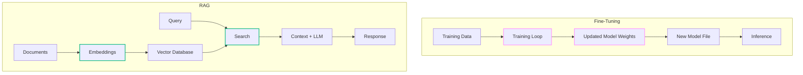
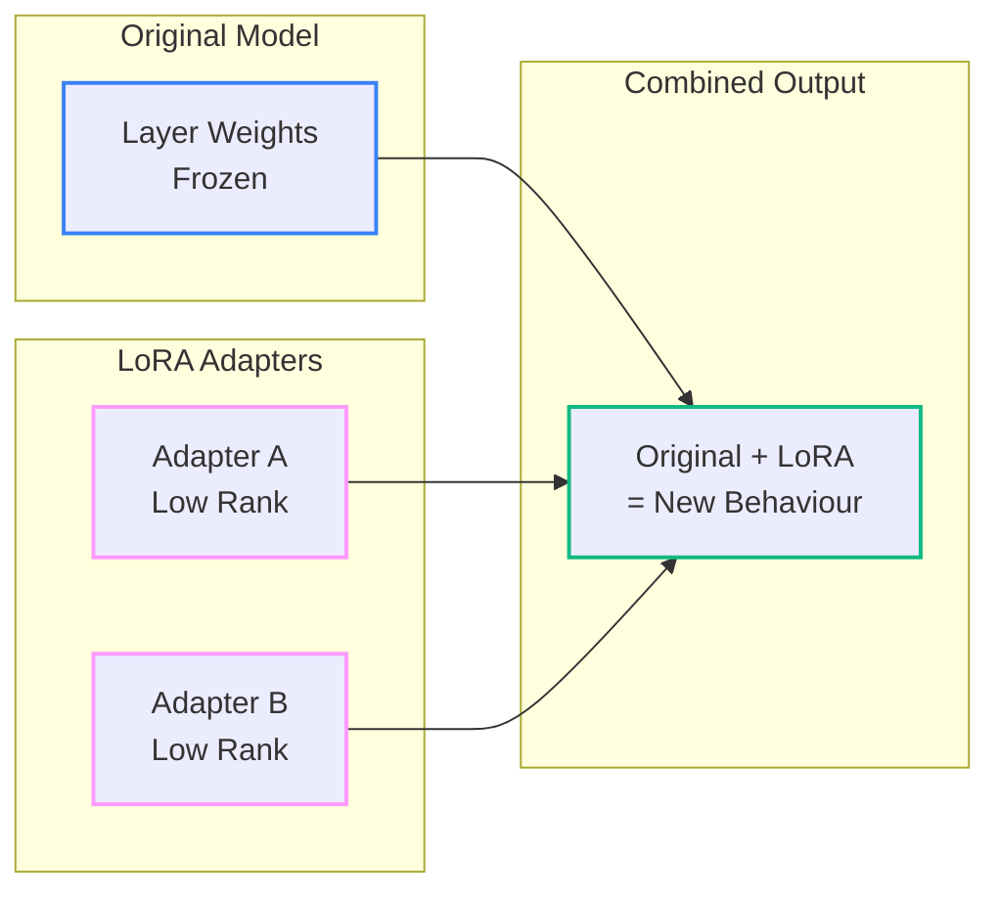
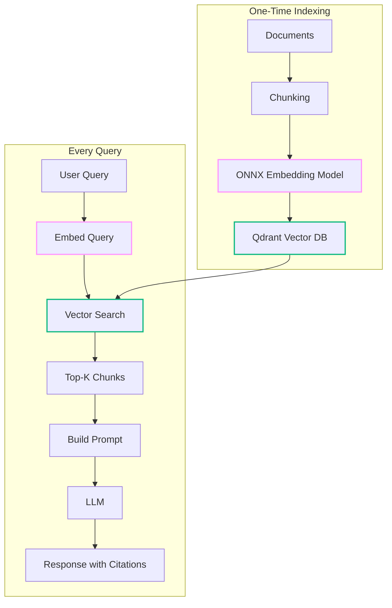
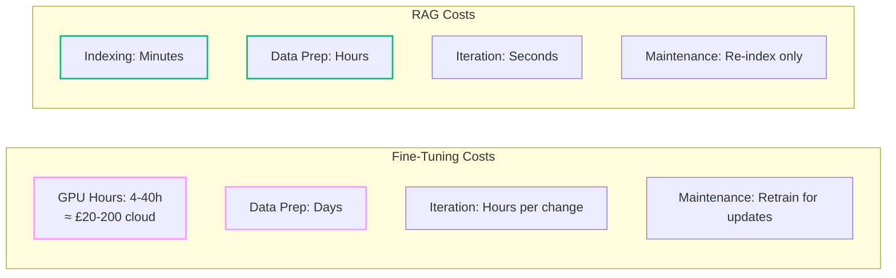

# Fine-Tuning Small LLMs for 'Fun' and Profit (and Why You'll Likely Be Better Off with a RAG)

<!--category-- AI, LLM, Machine Learning, Fine-tuning, C#, ONNX, Qdrant, AI-Article -->
<datetime class="hidden">2025-11-22T10:00</datetime>

## Introduction

Right, here's the thing: fine-tuning LLMs is genuinely fascinating technology that's become remarkably accessible. You can now tweak a small model to do very specific things on consumer hardware. Brilliant stuff. But—and there's always a but—before you dive headfirst into training loops and gradient accumulation, you should ask yourself whether you *actually* need to fine-tune at all.

> NOTE: This is part of my experiments with AI (assisted drafting) + my own editing. Same voice, same pragmatism; just faster fingers.

This article covers both sides honestly:

1. **When and how to fine-tune** - The genuine use cases, the .NET tooling, and working code
2. **When RAG is simpler** - Why, for most practical applications, retrieval beats training

I've built both. I've fine-tuned models for specific tasks, and I've built [RAG systems for my blog](/blog/building-a-lawyer-gpt-for-your-blog-part1). The RAG approach won for nearly everything I actually wanted to do. Let me show you why—but also how to fine-tune properly when it *is* the right choice.

[TOC]

## The Honest Comparison: Fine-Tuning vs RAG

Before we write a single line of code, let's be clear about what each approach actually does:



**Fine-tuning** modifies the model's internal weights—you're teaching it new patterns, styles, or behaviours that become *baked in*.

**RAG** keeps the model unchanged but gives it relevant context at query time—you're teaching it by showing, not by training.

### The Decision Matrix

| Factor | Fine-Tuning | RAG | Winner For |
|--------|-------------|-----|------------|
| **Knowledge updates** | Retrain required | Just update documents | RAG - dynamic content |
| **Style/format adaptation** | Excellent | Prompt-dependent | Fine-tuning - consistent output format |
| **Factual accuracy** | Can hallucinate | Grounded in sources | RAG - verifiable answers |
| **Cost** | Hours of GPU time | Minutes to index | RAG - budget-conscious |
| **Explainability** | Black box | Can cite sources | RAG - auditable systems |
| **Private data** | Data in model weights | Data stays separate | Depends on threat model |
| **Specialised vocabulary** | Learns domain terms | Needs good prompting | Fine-tuning - niche domains |

### When Fine-Tuning Actually Makes Sense

Fine-tuning shines in specific scenarios:

1. **Consistent output format** - You need JSON responses in a very specific schema, every time
2. **Domain-specific language** - The model needs to understand obscure terminology (medical, legal, scientific)
3. **Behaviour modification** - You want to change *how* the model responds, not *what* it knows
4. **Edge deployment** - You need a small, self-contained model without external dependencies
5. **Style transfer** - The model should write/respond in a very particular voice

### When RAG is Almost Certainly Better

RAG wins when:

1. **Knowledge changes frequently** - Blog posts, documentation, news, any evolving corpus
2. **You need citations** - Users want to know *where* the answer came from
3. **Accuracy is critical** - Hallucination could cause real harm
4. **You're prototyping** - Get something working fast, iterate later
5. **Budget is limited** - You can't afford GPU hours for training

For my [blog writing assistant](/blog/building-a-lawyer-gpt-for-your-blog-part1), RAG was the obvious choice. I wanted it to reference specific past articles, cite sources, and stay current as I publish new content. Fine-tuning would have been fighting against the use case.

## Fine-Tuning in .NET: The Practical Approach

Right, if you've read the comparison and still need fine-tuning (good on you—sometimes you genuinely do), let's look at how to actually do it in .NET.

### The Architecture

```mermaid
flowchart LR
    subgraph Data["Data Preparation"]
        A[Raw Data] --> B[Clean & Format]
        B --> C[Training/Validation Split]
    end

    subgraph Training["Training Loop"]
        C --> D[Load Base Model]
        D --> E[Configure LoRA/QLoRA]
        E --> F[Training Epochs]
        F --> G[Checkpointing]
    end

    subgraph Export["Export & Deploy"]
        G --> H[Merge Adapters]
        H --> I[Convert to ONNX]
        I --> J[C# Inference]
    end

    style E stroke:#f9f,stroke-width:2px
    style F stroke:#f9f,stroke-width:2px
    style I stroke:#10b981,stroke-width:2px
    style J stroke:#10b981,stroke-width:2px
```



### The Honest Truth About .NET and Training

Here's where I need to be straight with you: **training** LLMs in pure .NET is rather painful. The ML ecosystem lives in Python, and fighting that is a losing battle. The good news? You only need Python for the training step—everything else can be C#.

The workflow looks like this:

1. **Data preparation** - C# (you're probably already good at this)
2. **Training** - Python with PyTorch/Hugging Face (just accept it)
3. **Export to ONNX** - One-time conversion
4. **Inference** - C# with ONNX Runtime (where you live)

### Step 1: Preparing Training Data in C#

Training data quality is everything. Garbage in, garbage out. Here's a service that prepares data for instruction fine-tuning:

```csharp
public class TrainingDataService
{
    public async Task<List<TrainingExample>> PrepareInstructionDataAsync(
        IEnumerable<SourceDocument> documents)
    {
        var examples = new List<TrainingExample>();

        foreach (var doc in documents)
        {
            // Generate instruction-response pairs from your content
            var pairs = ExtractQAPairs(doc);
            examples.AddRange(pairs.Select(p => new TrainingExample
            {
                Instruction = p.Question,
                Response = p.Answer,
                Context = doc.Category // Optional metadata
            }));
        }

        // Shuffle and validate
        return examples
            .Where(e => e.IsValid())
            .OrderBy(_ => Random.Shared.Next())
            .ToList();
    }

    private IEnumerable<(string Question, string Answer)> ExtractQAPairs(
        SourceDocument doc)
    {
        // Extract meaningful Q&A pairs from your documents
        // This is domain-specific - you'll need to customize this
        yield return (
            $"Explain {doc.Title}",
            doc.Summary
        );

        foreach (var section in doc.Sections)
        {
            yield return (
                $"What is {section.Heading}?",
                section.Content
            );
        }
    }
}

public record TrainingExample
{
    public string Instruction { get; init; } = "";
    public string Response { get; init; } = "";
    public string? Context { get; init; }

    public bool IsValid() =>
        !string.IsNullOrWhiteSpace(Instruction) &&
        !string.IsNullOrWhiteSpace(Response) &&
        Response.Length >= 50; // Minimum useful response
}
```

Export to JSONL format (what training scripts expect):

```csharp
public async Task ExportToJsonlAsync(
    IEnumerable<TrainingExample> examples,
    string outputPath)
{
    await using var writer = File.CreateText(outputPath);

    foreach (var example in examples)
    {
        var json = JsonSerializer.Serialize(new
        {
            instruction = example.Instruction,
            output = example.Response,
            input = example.Context ?? ""
        });
        await writer.WriteLineAsync(json);
    }
}
```

### Step 2: Training with LoRA (The Python Bit)

LoRA (Low-Rank Adaptation) is essential for fine-tuning on consumer hardware. Instead of updating all model weights, you train small adapter matrices that modify the model's behaviour. This reduces memory requirements by 10-100x.



Here's the Python training script (I told you we'd need some):

```python
# train_lora.py - Run this once, then it's all C# from here
from transformers import AutoModelForCausalLM, AutoTokenizer, TrainingArguments
from peft import LoraConfig, get_peft_model
from datasets import load_dataset
import torch

# Choose a small, capable base model
MODEL_NAME = "microsoft/phi-2"  # 2.7B params, genuinely good
# Alternatives: "TinyLlama/TinyLlama-1.1B-Chat-v1.0", "Qwen/Qwen2-1.5B"

# Load base model with 4-bit quantisation (QLoRA)
model = AutoModelForCausalLM.from_pretrained(
    MODEL_NAME,
    load_in_4bit=True,
    torch_dtype=torch.float16,
    device_map="auto"
)

tokenizer = AutoTokenizer.from_pretrained(MODEL_NAME)
tokenizer.pad_token = tokenizer.eos_token

# Configure LoRA - these are sensible defaults
lora_config = LoraConfig(
    r=16,                      # Rank - higher = more capacity, more memory
    lora_alpha=32,             # Scaling factor
    target_modules=["q_proj", "v_proj", "k_proj", "o_proj"],  # Which layers
    lora_dropout=0.05,
    bias="none",
    task_type="CAUSAL_LM"
)

model = get_peft_model(model, lora_config)

# Load your prepared data
dataset = load_dataset("json", data_files="training_data.jsonl", split="train")

# Training arguments - conservative for 8GB VRAM
training_args = TrainingArguments(
    output_dir="./fine-tuned-model",
    num_train_epochs=3,
    per_device_train_batch_size=1,      # Keep small for memory
    gradient_accumulation_steps=8,       # Effective batch = 8
    learning_rate=2e-4,
    warmup_steps=100,
    save_steps=500,
    logging_steps=50,
    fp16=True,
    optim="paged_adamw_8bit"            # Memory-efficient optimizer
)

# Train (this takes hours, go make a cuppa)
from trl import SFTTrainer
trainer = SFTTrainer(
    model=model,
    train_dataset=dataset,
    args=training_args,
    tokenizer=tokenizer,
    max_seq_length=512,
    dataset_text_field="instruction"  # Adjust to your data format
)

trainer.train()

# Save the LoRA adapters
model.save_pretrained("./fine-tuned-lora")
```

### Step 3: Export to ONNX

ONNX (Open Neural Network Exchange) is your bridge from Python training to C# inference. It's a standard format that ONNX Runtime can execute efficiently.

```python
# export_to_onnx.py
from transformers import AutoModelForCausalLM, AutoTokenizer
from peft import PeftModel
import torch
import onnx
from onnxruntime.transformers import optimizer

# Load base + LoRA adapters
base_model = AutoModelForCausalLM.from_pretrained("microsoft/phi-2")
model = PeftModel.from_pretrained(base_model, "./fine-tuned-lora")

# Merge LoRA into base weights (creates standalone model)
merged_model = model.merge_and_unload()

# Export to ONNX
dummy_input = torch.randint(0, 50256, (1, 64))  # Dummy input tokens

torch.onnx.export(
    merged_model,
    dummy_input,
    "fine-tuned-model.onnx",
    input_names=["input_ids"],
    output_names=["logits"],
    dynamic_axes={
        "input_ids": {0: "batch", 1: "sequence"},
        "logits": {0: "batch", 1: "sequence"}
    },
    opset_version=17
)

# Optimize for inference
optimized_model = optimizer.optimize_model(
    "fine-tuned-model.onnx",
    model_type="gpt2",  # Architecture family
    num_heads=32,
    hidden_size=2560
)
optimized_model.save_model_to_file("fine-tuned-model-optimized.onnx")
```

### Step 4: Inference in C# with ONNX Runtime

Now we're back in comfortable territory. Here's a complete inference service:

```csharp
public sealed class OnnxLlmService : IDisposable
{
    private readonly InferenceSession _session;
    private readonly Tokenizer _tokenizer;

    public OnnxLlmService(string modelPath, string tokenizerPath)
    {
        var options = new SessionOptions();

        // Use GPU if available (CUDA)
        if (IsCudaAvailable())
        {
            options.AppendExecutionProvider_CUDA(0);
        }

        _session = new InferenceSession(modelPath, options);
        _tokenizer = LoadTokenizer(tokenizerPath);
    }

    public async Task<string> GenerateAsync(
        string prompt,
        int maxTokens = 256,
        float temperature = 0.7f)
    {
        var inputIds = _tokenizer.Encode(prompt);
        var generated = new List<int>(inputIds);

        for (int i = 0; i < maxTokens; i++)
        {
            // Create input tensor
            var inputTensor = new DenseTensor<long>(
                generated.Select(x => (long)x).ToArray(),
                new[] { 1, generated.Count }
            );

            var inputs = new List<NamedOnnxValue>
            {
                NamedOnnxValue.CreateFromTensor("input_ids", inputTensor)
            };

            // Run inference
            using var outputs = _session.Run(inputs);
            var logits = outputs.First().AsEnumerable<float>().ToArray();

            // Sample next token (simplified - add proper sampling)
            var nextToken = SampleToken(logits, generated.Count, temperature);

            if (nextToken == _tokenizer.EosTokenId)
                break;

            generated.Add(nextToken);
        }

        return _tokenizer.Decode(generated.Skip(inputIds.Length).ToArray());
    }

    private int SampleToken(float[] logits, int seqLength, float temperature)
    {
        // Get logits for last position
        var vocabSize = logits.Length / seqLength;
        var lastLogits = logits.Skip((seqLength - 1) * vocabSize)
                               .Take(vocabSize)
                               .ToArray();

        // Apply temperature
        for (int i = 0; i < lastLogits.Length; i++)
            lastLogits[i] /= temperature;

        // Softmax
        var maxLogit = lastLogits.Max();
        var exps = lastLogits.Select(l => MathF.Exp(l - maxLogit)).ToArray();
        var sum = exps.Sum();
        var probs = exps.Select(e => e / sum).ToArray();

        // Sample from distribution
        var random = Random.Shared.NextSingle();
        var cumulative = 0f;
        for (int i = 0; i < probs.Length; i++)
        {
            cumulative += probs[i];
            if (random < cumulative)
                return i;
        }

        return probs.Length - 1;
    }

    private static bool IsCudaAvailable()
    {
        try
        {
            return OrtEnv.Instance()
                .GetAvailableProviders()
                .Contains("CUDAExecutionProvider");
        }
        catch { return false; }
    }

    public void Dispose() => _session?.Dispose();
}
```

## The RAG Alternative: Often the Better Choice

Now let's look at what you'd build instead with RAG. I've covered this extensively in my [RAG primer series](/blog/rag-primer), but here's the comparison in terms of code complexity.

### RAG Architecture



### Embedding Service with ONNX

Instead of training, you just need to embed your documents:

```csharp
public class EmbeddingService
{
    private readonly InferenceSession _session;
    private readonly Tokenizer _tokenizer;
    private const int EmbeddingDim = 384; // all-MiniLM-L6-v2

    public EmbeddingService(string modelPath, string tokenizerPath)
    {
        var options = new SessionOptions();

        // CPU is often fast enough for embeddings
        options.AppendExecutionProvider_CPU();

        _session = new InferenceSession(modelPath, options);
        _tokenizer = LoadTokenizer(tokenizerPath);
    }

    public float[] Embed(string text)
    {
        var encoded = _tokenizer.Encode(text, maxLength: 512);

        var inputIds = new DenseTensor<long>(
            encoded.InputIds.Select(x => (long)x).ToArray(),
            new[] { 1, encoded.InputIds.Length }
        );

        var attentionMask = new DenseTensor<long>(
            encoded.AttentionMask.Select(x => (long)x).ToArray(),
            new[] { 1, encoded.AttentionMask.Length }
        );

        var inputs = new List<NamedOnnxValue>
        {
            NamedOnnxValue.CreateFromTensor("input_ids", inputIds),
            NamedOnnxValue.CreateFromTensor("attention_mask", attentionMask)
        };

        using var outputs = _session.Run(inputs);

        // Mean pooling over token embeddings
        var tokenEmbeddings = outputs.First().AsEnumerable<float>().ToArray();
        return MeanPool(tokenEmbeddings, encoded.InputIds.Length, EmbeddingDim);
    }

    private static float[] MeanPool(float[] embeddings, int seqLen, int dim)
    {
        var result = new float[dim];
        for (int d = 0; d < dim; d++)
        {
            float sum = 0;
            for (int t = 0; t < seqLen; t++)
                sum += embeddings[t * dim + d];
            result[d] = sum / seqLen;
        }

        // L2 normalise
        var norm = MathF.Sqrt(result.Sum(x => x * x));
        for (int i = 0; i < result.Length; i++)
            result[i] /= norm;

        return result;
    }
}
```

### Qdrant Integration

[Qdrant](https://qdrant.tech/) is a brilliant vector database with excellent .NET support:

```csharp
public class VectorSearchService
{
    private readonly QdrantClient _client;
    private readonly EmbeddingService _embedding;
    private const string CollectionName = "blog_posts";

    public VectorSearchService(
        QdrantClient client,
        EmbeddingService embedding)
    {
        _client = client;
        _embedding = embedding;
    }

    public async Task IndexDocumentAsync(BlogDocument doc)
    {
        var chunks = ChunkDocument(doc);

        var points = chunks.Select((chunk, idx) => new PointStruct
        {
            Id = new PointId { Uuid = $"{doc.Id}_{idx}" },
            Vectors = _embedding.Embed(chunk.Text),
            Payload =
            {
                ["title"] = doc.Title,
                ["slug"] = doc.Slug,
                ["chunk_text"] = chunk.Text,
                ["chunk_index"] = idx,
                ["published"] = doc.PublishedDate.ToString("O")
            }
        }).ToList();

        await _client.UpsertAsync(CollectionName, points);
    }

    public async Task<List<SearchResult>> SearchAsync(string query, int limit = 5)
    {
        var queryVector = _embedding.Embed(query);

        var results = await _client.SearchAsync(
            CollectionName,
            queryVector,
            limit: (ulong)limit,
            scoreThreshold: 0.7f  // Only return relevant results
        );

        return results.Select(r => new SearchResult
        {
            Title = r.Payload["title"].StringValue,
            Slug = r.Payload["slug"].StringValue,
            Text = r.Payload["chunk_text"].StringValue,
            Score = r.Score,
            ChunkIndex = (int)r.Payload["chunk_index"].IntegerValue
        }).ToList();
    }

    private IEnumerable<TextChunk> ChunkDocument(BlogDocument doc)
    {
        // Smart chunking - preserve paragraphs, code blocks
        var chunks = new List<TextChunk>();
        var paragraphs = doc.Content.Split("\n\n", StringSplitOptions.RemoveEmptyEntries);

        var currentChunk = new StringBuilder();
        foreach (var para in paragraphs)
        {
            if (currentChunk.Length + para.Length > 500) // ~100 tokens
            {
                if (currentChunk.Length > 0)
                    chunks.Add(new TextChunk(currentChunk.ToString().Trim()));
                currentChunk.Clear();
            }
            currentChunk.AppendLine(para);
        }

        if (currentChunk.Length > 0)
            chunks.Add(new TextChunk(currentChunk.ToString().Trim()));

        return chunks;
    }
}
```

### The Complete RAG Query

Bringing it together:

```csharp
public class RagService
{
    private readonly VectorSearchService _search;
    private readonly OnnxLlmService _llm;

    public async Task<RagResponse> QueryAsync(string question)
    {
        // 1. Find relevant chunks
        var chunks = await _search.SearchAsync(question, limit: 5);

        // 2. Build context-aware prompt
        var context = string.Join("\n\n", chunks.Select((c, i) =>
            $"[{i + 1}] {c.Text}"));

        var prompt = $"""
            You are a helpful assistant. Use the following context to answer
            the question. Cite sources using [1], [2], etc.

            Context:
            {context}

            Question: {question}

            Answer:
            """;

        // 3. Generate response
        var response = await _llm.GenerateAsync(prompt, maxTokens: 512);

        // 4. Return with citations
        return new RagResponse
        {
            Answer = response,
            Sources = chunks.Select(c => new Citation
            {
                Title = c.Title,
                Slug = c.Slug,
                Relevance = c.Score
            }).ToList()
        };
    }
}
```

## Cost and Effort Comparison

Let me be concrete about what each approach actually costs:



### Fine-Tuning Reality Check

For a typical fine-tuning project:

| Step | Time | Notes |
|------|------|-------|
| Data collection | 2-5 days | Quality matters enormously |
| Data cleaning | 1-3 days | The boring but critical bit |
| Initial training | 4-8 hours | On decent GPU |
| Evaluation | 1-2 hours | Often disappointing |
| Iterate | 4-8 hours × N | Usually 3-5 iterations |
| Export to ONNX | 1-2 hours | Debugging shape issues |
| Integration | 1 day | Getting inference working |

**Total: 2-4 weeks of actual work**

### RAG Reality Check

For an equivalent RAG system:

| Step | Time | Notes |
|------|------|-------|
| Document ingestion | Hours | Probably already have this |
| Chunking strategy | 1 day | Some experimentation needed |
| Embedding model setup | 2-4 hours | Download and configure |
| Vector DB setup | 1-2 hours | Qdrant Docker or cloud |
| Query pipeline | 1 day | Prompt engineering |
| Integration | Half day | Simpler inference |

**Total: 3-5 days of actual work**

## When I'd Actually Fine-Tune

Despite everything above, there are times I'd reach for fine-tuning:

### 1. Consistent JSON Output

If you need the model to *always* output valid JSON in a specific schema:

```csharp
// Fine-tuned model reliably produces:
{
    "sentiment": "positive",
    "confidence": 0.92,
    "entities": ["Docker", "Kubernetes"],
    "summary": "The article discusses container orchestration."
}

// Base model with prompting sometimes produces:
// "Sure! Here's the JSON: {..."  (not what you want)
```

### 2. Specialised Domain Language

If your domain has vocabulary the model genuinely doesn't understand:

```csharp
// Medical coding, legal precedents, scientific nomenclature
// Fine-tuning teaches the model what "ICD-10 code M54.5" actually means
```

### 3. Edge Deployment

If you need a tiny, self-contained model without network dependencies:

```csharp
// Fine-tuned Phi-2 at 1.5GB vs RAG setup requiring:
// - Embedding model (~100MB)
// - Vector database (varies)
// - Base LLM (still needed for generation)
// - Network connectivity (for updates)
```

### 4. Behaviour Modification

If you need to fundamentally change *how* the model responds:

```csharp
// Teaching a model to be more concise
// Teaching a model to always ask clarifying questions
// Teaching a model to refuse certain types of requests
```

## Conclusion: Choose Wisely

Fine-tuning is genuinely impressive technology, and it's more accessible than ever. You *can* fine-tune small models on consumer hardware with LoRA and QLoRA. The .NET tooling via ONNX Runtime is solid.

But for most practical applications—especially anything involving:
- Frequently updated information
- Need for citations and sources
- Factual accuracy requirements
- Budget or time constraints

—[RAG is almost certainly the better choice](/blog/rag-primer).

The honest truth? I've fine-tuned models for fun and learning. But for my [actual blog assistant](/blog/building-a-lawyer-gpt-for-your-blog-part1), I use RAG. It's simpler, cheaper, more accurate, and easier to maintain.

Fine-tune when you need to change model *behaviour*. Use RAG when you need to change model *knowledge*.

## Further Reading

**RAG Fundamentals:**
- [RAG Explained: Origins and Fundamentals](/blog/rag-primer) - How RAG came about and why it matters
- [RAG Architecture and Internals](/blog/rag-architecture) - Technical deep dive
- [RAG in Practice](/blog/rag-practical-applications) - Building real systems

**Practical Implementation:**
- [Building a "Lawyer GPT" for Your Blog](/blog/building-a-lawyer-gpt-for-your-blog-part1) - Complete RAG system walkthrough
- [Understanding Embeddings & Vector Databases](/blog/building-a-lawyer-gpt-for-your-blog-part3) - Deep dive into the search component

**Related Technology:**
- [How Neural Machine Translation Works](/blog/how-neural-machine-translation-works) - Understanding transformer models

## Resources

- [ONNX Runtime Documentation](https://onnxruntime.ai/)
- [Qdrant Documentation](https://qdrant.tech/documentation/)
- [Hugging Face PEFT (LoRA) Library](https://github.com/huggingface/peft)
- [Microsoft Phi-2 Model](https://huggingface.co/microsoft/phi-2)
- [Sentence Transformers for Embeddings](https://www.sbert.net/)
