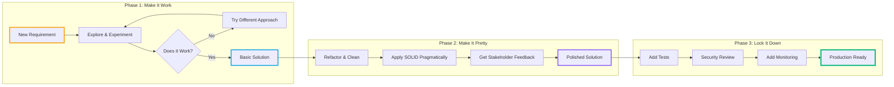
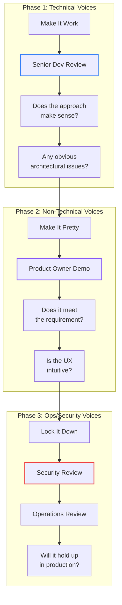
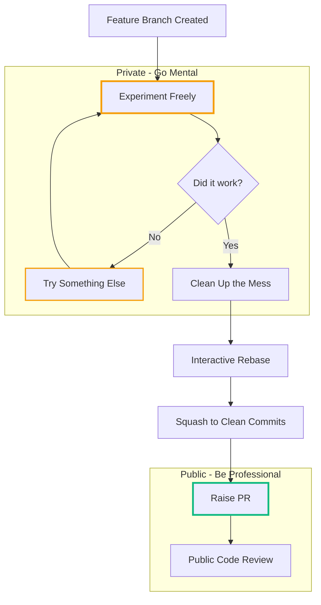

# Playing with Code: An Efficient Agile Approach

<datetime class="hidden">2025-11-22T10:00</datetime>
<!-- category -- Software Development, Agile, Best Practices, Craftsmanship -->

**Why treating your branch as a sandbox—and play as legitimate work—produces better software with less stress.**

> **Hot take:** Most developers are trying to be perfect at every stage of development, and it's killing both their creativity and their productivity. Here's a better way.

## Introduction

I've been building software professionally for... well, let's just say I remember when "Agile" was a new idea and not a corporate buzzword weaponised by project managers to justify more standups.

Over the years, I've noticed something: the best code I've ever written came from projects where I felt *permission to play*. The worst code came from projects where every keystroke felt like it was being scrutinised, where I was trying to write "production-ready" code from minute one.

This isn't accidental. **Creativity and pressure don't mix well.**

So I've developed an approach that separates the messy, creative exploration from the polished, production-ready delivery. I call it "Make it work, make it pretty, lock it down" — but really, it's about giving yourself permission to experiment without the weight of perfection hanging over you.

[TOC]

## The Three Phases

Let me be clear upfront: this isn't about being sloppy or avoiding discipline. It's about *applying the right discipline at the right time*.



### Phase 1: Make It Work

**The mantra:** Play first. Confirm your assumptions. Get something running.

This is the phase where your branch is a sandbox. Messy code is fine. Dead ends are fine. Starting over three times is *fine*. You're not building a cathedral here; you're sketching on a napkin.

What you're trying to figure out:
- Does this API actually behave how the docs claim? (Spoiler: it rarely does)
- Can I even solve this problem with the tools I have?
- What are the actual requirements, not the ones written in the ticket?
- Is this a two-hour problem or a two-week problem?

**The critical insight:** Until you raise a PR, your branch is *yours*. It's your experimental laboratory. Nobody needs to see your false starts, your commented-out debugging code, your "TODO: this is terrible, fix later" comments.

This psychological freedom is essential. When you know you can throw everything away and start fresh, you make bolder decisions. You try that weird approach that probably won't work. Sometimes it works brilliantly.

```csharp
// Phase 1 code looks like this - and THAT'S OKAY
public async Task<Result> ProcessThing(Request req)
{
    // TODO: what if this is null?
    var data = await _api.GetSomething(req.Id);

    // This probably isn't right but let's see what happens
    var transformed = data.Items
        .Where(x => x.Status != "deleted") // Is this the right filter?
        .Select(x => new Thing { Name = x.Name }); // Missing loads of fields

    // HACK: hardcoded for now
    return new Result { Items = transformed.ToList(), Total = 42 };
}
```

Is this production code? God no. Is it useful? Absolutely. It tells you whether your approach is even viable before you invest hours polishing something that won't work.

### Phase 2: Make It Pretty

**The mantra:** Now that you know what you're building, make it *good*.

The exploratory phase has done its job. You've confirmed the approach works, you understand the shape of the problem, and you've probably discovered a dozen edge cases the original ticket didn't mention.

Now you clean it up:

```csharp
// Phase 2: Same logic, but actually maintainable
public async Task<ProcessingResult> ProcessItemsAsync(
    ProcessingRequest request,
    CancellationToken cancellationToken = default)
{
    ArgumentNullException.ThrowIfNull(request);

    var items = await _itemRepository.GetActiveItemsAsync(
        request.AccountId,
        cancellationToken);

    var processedItems = items
        .Where(item => item.Status != ItemStatus.Deleted)
        .Select(item => _mapper.ToProcessedItem(item))
        .ToList();

    return new ProcessingResult
    {
        Items = processedItems,
        TotalCount = processedItems.Count,
        ProcessedAt = _timeProvider.UtcNow
    };
}
```

This is where you:
- Apply SOLID principles *pragmatically* (know them, but don't worship them)
- Give things proper names
- Add type hints and XML documentation
- Think about the API surface from the caller's perspective
- Handle the edge cases you discovered in Phase 1

**Critically, this is the best time for non-technical stakeholder feedback.** The feature is now visible and usable, but you haven't yet invested hours writing tests for it. If they say "actually, we wanted it to do X instead," you can pivot without the heartbreak of deleting a comprehensive test suite.

### Phase 3: Lock It Down

**The mantra:** Harden it, test it, make it resilient.

Now—and only now—you write your tests. Add security checks. Implement proper error handling for production edge cases. Add monitoring and guardrails.

Why wait until now? Because **you finally know what you're testing**.

Tests written in Phase 1 would have been wrong—you didn't understand the problem yet. Tests written in Phase 2 would have churn—you were still refining the API. Tests written in Phase 3 are *correct*, because the implementation is stable.

```csharp
[Theory]
[InlineData(0)]
[InlineData(1)]
[InlineData(100)]
public async Task ProcessItemsAsync_WithValidRequest_ReturnsCorrectCount(
    int itemCount)
{
    // Arrange
    var items = _fixture.CreateMany<Item>(itemCount).ToList();
    _mockRepository
        .Setup(r => r.GetActiveItemsAsync(It.IsAny<Guid>(), It.IsAny<CancellationToken>()))
        .ReturnsAsync(items);

    // Act
    var result = await _sut.ProcessItemsAsync(
        new ProcessingRequest { AccountId = Guid.NewGuid() });

    // Assert
    result.TotalCount.Should().Be(itemCount);
    result.Items.Should().HaveCount(itemCount);
}

[Fact]
public async Task ProcessItemsAsync_WithNullRequest_ThrowsArgumentNullException()
{
    // Act & Assert
    await _sut.Invoking(s => s.ProcessItemsAsync(null!))
        .Should().ThrowAsync<ArgumentNullException>();
}

[Fact]
public async Task ProcessItemsAsync_ExcludesDeletedItems()
{
    // Arrange
    var items = new[]
    {
        new Item { Status = ItemStatus.Active },
        new Item { Status = ItemStatus.Deleted },
        new Item { Status = ItemStatus.Active }
    };
    _mockRepository
        .Setup(r => r.GetActiveItemsAsync(It.IsAny<Guid>(), It.IsAny<CancellationToken>()))
        .ReturnsAsync(items);

    // Act
    var result = await _sut.ProcessItemsAsync(
        new ProcessingRequest { AccountId = Guid.NewGuid() });

    // Assert
    result.Items.Should().HaveCount(2);
}
```

This phase also includes:
- Security review (authentication, authorisation, input validation)
- Concurrency considerations (what happens under load?)
- Failure mode analysis (what if the database is slow? What if the API times out?)
- Monitoring (how will we know if this breaks in production?)

## Feedback Choreography

One of the key insights I've developed over the years is that *different people should be involved at different stages*. Getting this wrong causes endless friction.



**Phase 1 feedback: Technical voices only**

At this stage, you want people who can look at messy code and see the shape of the solution. Senior developers, architects, tech leads. They're asking: "Does this approach make sense? Are there obvious pitfalls?"

You do NOT want non-technical stakeholders seeing Phase 1 code. They'll panic at the roughness. They'll ask about button colours when you're still figuring out if the data model works.

**Phase 2 feedback: Non-technical voices welcome**

Now the feature is usable. The UI exists. Buttons do things. This is when you get product owners, designers, and end users involved. They can see the actual experience and give meaningful feedback.

Getting this feedback NOW is critical. Changes are still cheap. You haven't written comprehensive tests yet. If the product owner says "actually, we need this to work completely differently," you can pivot without too much pain.

**Phase 3 feedback: Ops and security voices**

Now you want the people who ask uncomfortable questions. "What happens if this gets 10x the expected traffic?" "What if someone passes malicious input?" "How will we debug this at 3am when it breaks?"

These voices come last because their concerns only matter once the feature actually works correctly. There's no point hardening something that's going to change shape.

## Branches as Sandboxes

Here's the thing that changed my development life: **until you raise a PR, your branch is entirely private**.

That might sound obvious, but I see developers treating every commit like it's going on their permanent record. They're afraid to experiment. Afraid to write ugly code. Afraid to break things.

I want you to think of your feature branch as a sandbox. A playground. A laboratory where explosions are expected and nobody gets hurt.



In practice, this means:
- Commit frequently, even if the code doesn't compile
- Write `FIXME` and `TODO` comments everywhere
- Leave debugging code in place while you're exploring
- Have multiple "try this approach" commits
- Don't worry about commit messages (you'll squash later)

Then, before you raise a PR:
1. Clean up the code (Phase 2)
2. Add tests (Phase 3)
3. Interactive rebase to squash all that messy history
4. Write a proper commit message

The PR reviewers see clean, professional code with a clear narrative. They don't see the six false starts, the 3am "why doesn't this bloody work" commits, or the "undo undo undo" history.

**The sandbox stays private. The polished work goes public.**

## Why This Reduces Stress

Traditional "be professional at all times" development creates a particular kind of stress. Every line of code feels permanent. Every decision feels consequential. The weight of getting it right *first time* is crushing.

This approach removes that pressure:

**Play is legitimate work.** Phase 1 is explicitly about experimentation. You're not "wasting time" when you try something that doesn't work—you're *learning what doesn't work*, which is valuable information.

**Feedback comes at the right time.** Nothing's more demoralising than getting a PR comment saying your entire approach is wrong after you've spent days polishing it. With this approach, you get that feedback in Phase 1, when pivoting is cheap.

**Tests are written once, correctly.** TDD purists will tell you to write tests first. But when you don't understand the problem yet, you're writing tests for the wrong thing. Then you rewrite them. Then you rewrite them again. With this approach, you write tests once the implementation is stable—they're correct the first time.

**The messiness is contained.** Instead of stress bleeding into every phase, the "acceptable chaos" is contained to Phase 1. Phases 2 and 3 are calm, methodical, and professional. You know what you're building and you're just executing.

## Pragmatic SOLID (And DRY's Dirty Secret)

I mentioned applying SOLID principles "pragmatically" in Phase 2. Let me be specific about what I mean.

SOLID is a good set of principles. I teach them. I use them. But I've seen teams disappear down abstraction rabbit holes in the name of Single Responsibility or Open/Closed, creating systems so flexible they're incomprehensible.

Here's my heuristic:

**Apply SOLID when:**
- You have evidence you'll need the flexibility
- The abstraction makes the code clearer
- You're building something others will use

**Don't apply SOLID when:**
- You're speculating about future requirements
- The abstraction adds complexity without clarity
- You're building internal code that only you maintain

Three similar lines of code are better than a premature abstraction. You can always extract later when you see the pattern clearly. You can't easily undo an abstraction that's baked into your architecture.

```csharp
// Over-engineered SOLID worship
public interface IThingProcessor { }
public interface IThingProcessorFactory { }
public class ThingProcessorFactory : IThingProcessorFactory { }
public class ThingProcessor : IThingProcessor { }
public class ThingProcessorDecorator : IThingProcessor { }
public class ThingProcessorValidationDecorator : IThingProcessor { }

// What you probably actually need
public class ThingProcessor
{
    public async Task<Result> ProcessAsync(Thing thing)
    {
        // Just do the thing
    }
}
```

If you need the flexibility later, refactoring is cheap. Over-engineering upfront is expensive because you're maintaining abstraction layers that aren't earning their keep.

### The DRY Trap

And while we're slaying sacred cows, let's talk about **DRY** (Don't Repeat Yourself). It's perhaps the most dogmatically applied principle in our industry, and when applied without thought, it causes more harm than good.

The problem is this: **not all duplication is the same kind of duplication**.

When two pieces of code look similar but serve different purposes, extracting them into a shared abstraction couples things that should evolve independently. Now when one use case needs to change, you're either:
1. Adding parameters and conditionals to handle both cases (making the abstraction worse)
2. Breaking the other use case
3. Copying the shared code back out and editing it (admitting DRY was wrong here)

```csharp
// "DRY" solution - looks clever, causes pain
public async Task<Result> ProcessEntity<T>(
    T entity,
    bool validateFirst = true,
    bool sendNotification = false,
    Func<T, bool>? customFilter = null,
    Action<T>? preProcess = null,
    Action<T>? postProcess = null) where T : IEntity
{
    // 50 lines of conditional spaghetti trying to handle
    // "processing" for Users, Orders, and Products
    // because they all had 3 similar lines once
}

// What you probably actually need
public async Task<Result> ProcessUser(User user) { /* 15 clear lines */ }
public async Task<Result> ProcessOrder(Order order) { /* 15 clear lines */ }
public async Task<Result> ProcessProduct(Product product) { /* 15 clear lines */ }
```

Yes, there's some "duplication" in the second approach. But each method is:
- Easy to understand in isolation
- Easy to modify without side effects
- Easy to delete when that entity type goes away
- Easy to test with clear inputs and outputs

The DRY version is a nightmare to maintain because it's trying to be all things to all callers. Every change requires understanding all the use cases. Every bug fix risks breaking something else.

**My rule:** Tolerate duplication until you've seen the *same* thing three times and you're confident it represents the *same* concept that will evolve together. Until then, a bit of copy-paste is fine. It's not a moral failing; it's appropriate caution.

Duplication is far cheaper than the wrong abstraction. You can always deduplicate later when the pattern is clear. You can't easily undo a bad abstraction that's woven through your codebase.

## The Agile Connection

I find it ironic that this approach is more aligned with the original Agile manifesto than most "Agile" processes I've encountered in the wild.

**"Working software over comprehensive documentation"**
Phase 1 gets to working software *fast*. Documentation comes when you know what you're documenting.

**"Responding to change over following a plan"**
Phases 1 and 2 embrace change. Phase 3 locks it down only when the shape is clear.

**"Individuals and interactions over processes and tools"**
No sprint points, no velocity tracking, no burndown charts. Just: make it work, make it pretty, lock it down.

**"Customer collaboration over contract negotiation"**
Non-technical feedback in Phase 2, when change is still cheap and the feature is actually demonstrable.

The problem with modern "Agile" is that it's been captured by process enthusiasts who've added so many ceremonies that there's no time left for actual exploration. Standups, retrospectives, sprint planning, backlog grooming, story pointing... where's the time to *play* with the code?

This approach brings play back into the process, not as an indulgence but as a legitimate, essential phase of creative work.

## When NOT to Use This Approach

I should be honest: this isn't always the right approach.

**Bug fixes:** When you're fixing a known bug, TDD style makes more sense. Write a test that reproduces the bug, fix it, done.

**Well-understood problems:** If you're implementing a standard algorithm or a pattern you've used a hundred times, you don't need an exploration phase.

**Tight deadlines with known requirements:** If you genuinely know exactly what you're building and when it needs to ship, you might skip Phase 1 exploration.

**Highly regulated environments:** If every commit needs sign-off, sandboxing is harder. Though you can still do the exploration locally before pushing.

But for *most* feature development—where requirements are a bit fuzzy, the technical approach isn't obvious, and you need space to think—this approach works brilliantly.

## Bottom Line

**Make it work, make it pretty, lock it down.**

Start simple. Design with foresight but not speculation. Iterate quickly. Only add complexity when it pays off.

The exploration phase isn't a guilty secret—it's a defined part of the process. Your branch is your sandbox until you raise a PR. Technical feedback comes early, non-technical feedback comes mid, ops and security feedback comes late.

This keeps creativity alive, reduces stress, and produces systems that scale elegantly—because you understood the problem before you committed to the solution.

**Stop trying to be perfect from minute one. Give yourself permission to play.**

---

*If this resonates, you might also enjoy my related post on [How I Build Software](/blog/makeitworkthenmakeitpretty), which goes deeper into the testing philosophy behind this approach.*
